# Flink: 安装部署及入门案例

Apache Flink是一个框架和分布式处理引擎，用于对无界和有界数据流进行有状态计算。Flink设计为在所有常见的集群环境中运行，以内存速度和任何规模执行计算。

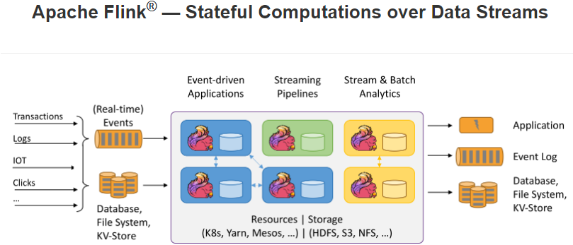

## 大数据分析引擎

> 梳理整个大数据课程，分为四大阶段，具体如下所示：

```ini
1）、HADOOP 离线阶段：
	基础课程（LINUX + ZOOKEEPER + HADOOP + HIVE）和项目课程（亿品新零售）
	
2）、SPARK 内存分析阶段：
	基础课程（PySpark）和项目课程（一站制造项目）
	
3）、大数据实时存储阶段：
	Flume、Redis、Kafka、HBase、
	
4）、FLINK 流式计算阶段：
	基础课程（FLINK：流计算及SQL&Table API）和项目课程
```

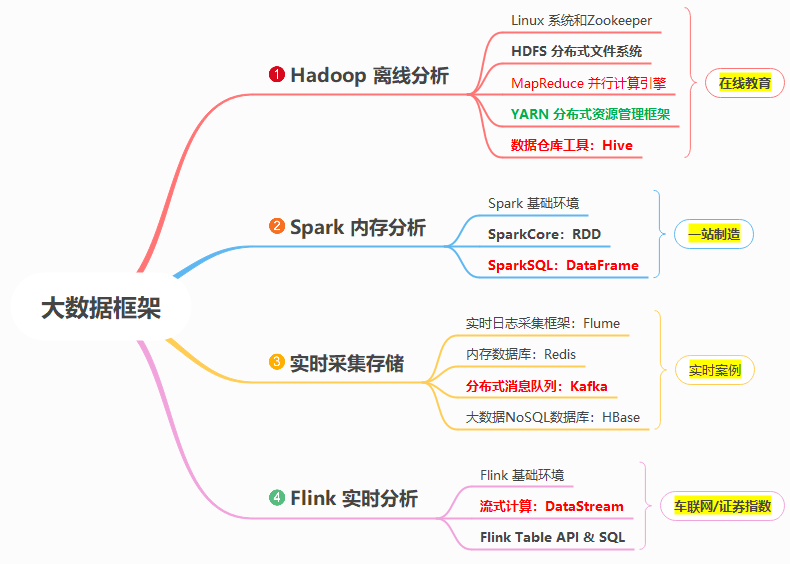

> 大数据分析领域，数据分析类型：==离线批处理分析（Batch）==和==实时流计算分析（Streaming）==。

```ini
离线分析：
	批处理（Batch Processing）
实时分析：
	流计算（Stream Processing）
	

MapReduce和Spark                        Flink
    批处理                                 流处理（流计算）
        每次处理多条数据                        每次处理1条数据
        很多条数据一起处理                      1条1条数据处理

    批处理                                 流计算
        实时性没有太多要求                      实时性要求很高
        当处理数据时，才运行Task                没有开始处理数据之前，运行Task
        
```

## I. Flink框架概述

### 1. 官方定义

Apache Flink 官网：https://flink.apache.org/

> [Apache Flink 是一个开源的、基于流的、有状态的计算框架。它是分布式地执行的，具备低延迟、高吞吐的优秀性能，并且非常擅长处理有状态的复杂计算逻辑场景。]()


> 官方定义：==**Apache Flink is a framework and distributed processing engine for stateful computations over *unbounded and bounded* data streams.**==

- 1）、计算框架：类似MapReduce框架，分析数据

- 2）、分布式计算框架

  - 分析处理数据时，可以启动多个任务Task，同时并行处理
  - [分布式计算思想：分而治之，先分，后合]()

- 3）、建立在==数据流（DataStream）==之上状态计算框架

  - 处理的数据为`数据流（DataStream）`

  - 在Flink框架中，将所有数据认为是数据流DataStream

    

    - 静态数据：==Bounded Data Stream==，**有界数据流**
    - 动态数据：==Unbounded Data Stream==，**无界数据流，流式数据**

  > [Flink 计算引擎，针对流数据进行处理，来一条数据处理一条数据，所以有界流和无界流。]()

- 4）、状态计算：`Stateful Computions`
  - Flink程序在处理数据时（流式计算，针对无界流数据处理），记录状态State信息
  - 比如以词频统计为例，记录每个单词词频；


> Apache Flink 是 Apache 开源软件基金会的一个**顶级项目**，和许多 Apache 顶级项目一样，如 Spark 起源于 UC 伯克利的实验室， Flink 也是起源于非常有名的大学的实验室——**柏林工业大学实验室**。


> Flink 诞生于欧洲的一个大数据研究项目 `StratoSphere`。早期，Flink 是做 Batch 计算的，但是在 2014 年， StratoSphere 里面的核心成员孵化出 Flink，同年将 Flink 捐赠 Apache，并在后来成为 Apache 的顶级大数据项目，同时 Flink计算的主流方向被定位为 Streaming， 即**用流式计算来做所有大数据的计算**，这就是 Flink 技术诞生的背景。

[项目最初的名称为 Stratosphere，目标是要让大数据的处理看起来更加地简洁。]()


> 由于 Flink 项目吸引了非常多贡献者参与，活跃度等方面也都非常优秀，它**在 2014 年 12 月成为了 Apache 的顶级项目**。成为顶级项目之后，它在一个月之后发布了**第一个 Release 版本 Flink 0.8.0**。在此之后，Flink 基本保持 4 个月 1 个版本的节奏，发展到今天。


> 当阿里收购Flink母公司以后，大力推广Flink使用，以及将内部`Blink`框架功能与Apache Flink框架整合，陆续发布：Flink 1.9.0 版本，Flink 1.10.0（稳当），Flink 1.11.0，Flink `1.12.0`（里程碑版本）。

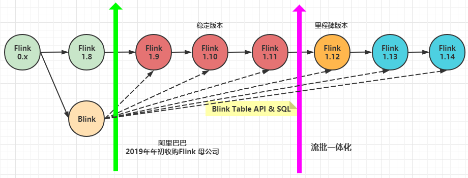

> Flink 框架尤其在2019年和2020年发展比较迅速，版本迭代更加频繁，尤其2020年底发布`Flink 1.12`版本，**里程碑版本**，`流批一体化编程模式`，并且`Flink Table API和SQL成熟稳定`，可以用于实际生产环境。


> 当Flink框架出现，并且成熟以后，未来的数据分析处理：**实时处理分析**，Flink框架首选。


### 2. 流式计算思想

> [Flink 流式计算程序，来一条处理一条数据，真正流计算。]()

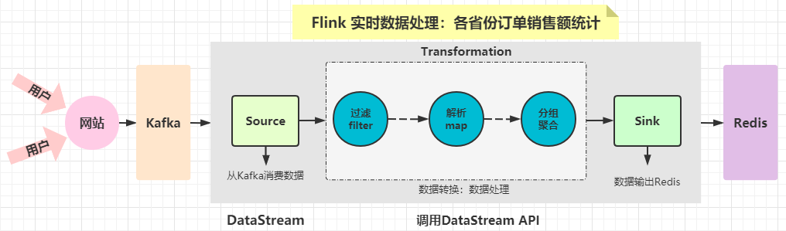

> Flink 框架进行流式计算时，整个流程分为：[数据源Source、数据转换Transformation和数据接收器Sink]()。

```ini
第一步、从数据源获取数据时，将数据封装到数据流
	DataStream
	实际项目，都是从Kafka 消息队列中消费数据
	
第二步、数据处理时，调用DataStream方法
	DataStream#transformation
	类似RDD中转换算子，比如map、flatMap、filter等等

第三步、将分析数据输出到外部存储
	DataStream#sink
	类似RDD中触发/输出算子，比如foreach.....
```

> Flink应用程序进行**分布式**流式计算时，如何做到[并行计算]()，如下图所示：

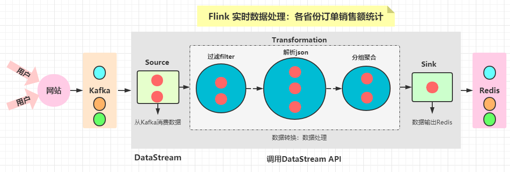

> 对于Flink框架来说，每个Job运行时，==在处理第一条数据之前，首先需要获取资源，运行Task任务，准备数据到达，当数据到达时，一个个数据处理==。

- Operator：`无论是从数据源Source加载数据，还是调用方法转换Transformation处理数据，到最后数据终端Sink输出，都称为Operator`，分为：`Source Operator、Transformation Operator和Sink Operator` 。
- `Stream`：数据从一个Operator流向另一个Operator； 

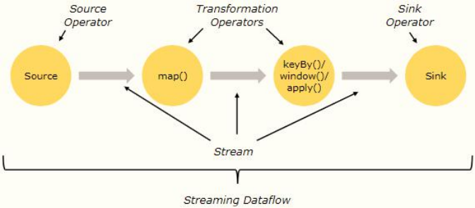

[每个Operator可以设置并行度（`Parallelism`），假设【Source】、【map()】及【keyBy()/window()/apply()】三个Operator并行度设置为2，【Sink】Operator并行的设置为1，形成如下示意图：]()

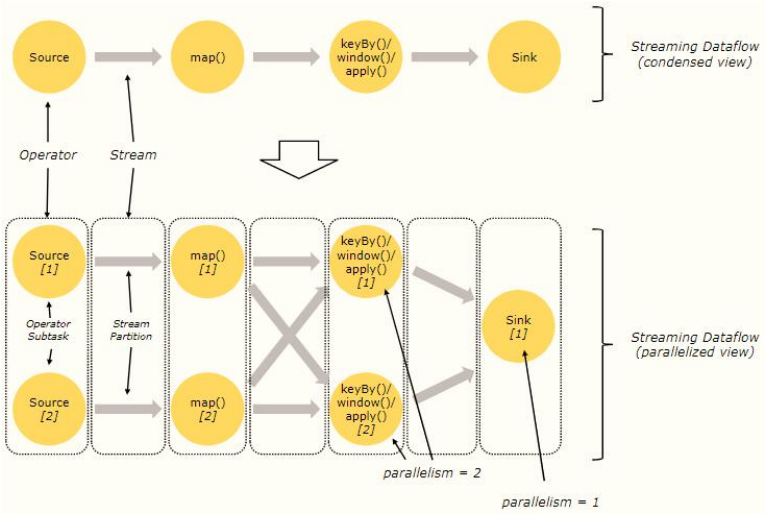

> Flink 流式计算引擎特点：

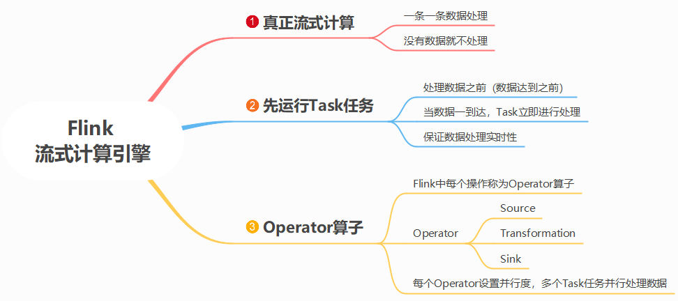

### 3. 应用场景

> Apache Flink在阿里巴巴主要应用场景如下四类：[实时数仓、实时监控、实时报表、流数据分析	]()


> 官方提出三个方面，Flink框架应用场景：


- 1）、事件驱动型应用：`Event-driven Applications`

[事件驱动表示一个事件会触发另一个或者很多个后续的事件，然后这一系列事件会形成一些信息，基于这些信息需要做一定的处理。]()


```
1、在社交场景下，以【微博】为例，当点击了一个关注之后，被关注人的粉丝数就会发生变化。之后如果被关注的人发了一条微博，关注他的粉丝也会收到消息通知，这是一个典型的事件驱动。

2、在网购的场景底下，如用户给商品做评价，这些评价一方面会影响店铺的星级，另外一方面有恶意差评的检测。此外，用户通过点击信息流，也可看到商品派送或其他状态，这些都可能触发后续的一系列事件。

3、金融反欺诈的场景，诈骗者通过短信诈骗，然后在取款机窃取别人的钱财。在这种场景底下，我们通过摄像头拍摄后，迅速反应识别出来，然后对犯罪的行为进  行相应的处理，一个典型的事件驱动型应用。
```

> **总结一下**，事件驱动型应用是一类具有**状态的应用**，会根据事件流中的事件触发计算、更新状态或进行外部系统操作。事件驱动型应用常见于实时计算业务中，比如：**实时推荐，金融反欺诈，实时规则预警**等。

- 2）、数据分析型应用：`Data Analytics Applications`


```
如双 11 成交额实时汇总，包括PV、UV 的统计；包括上方图中所示，是 Apache 开源软件在全世界不同地区的一个下载量，其实也是一个信息的汇总。
```


如上图所示，以双 11 为例，在 2020 年天猫双 11 购物节，阿里基于 Flink 的实时计算平台每秒处理的消息数达到了 40 亿条，数据体量达到 7TB，订单创建数达到 58 万/秒，计算规模也超过了 150 万核。

> 可以看到，这些应用的场景体量很大且对于实时性要求非常高 ，这也 是Apache Flink 非常擅长的场景。

- 3）、数据管道型应用 (ETL)，`Data Pipeline Applications`

> ETL（Extract-Transform-Load）是从数据源抽取/转换/加载/数据至目的端的过程。

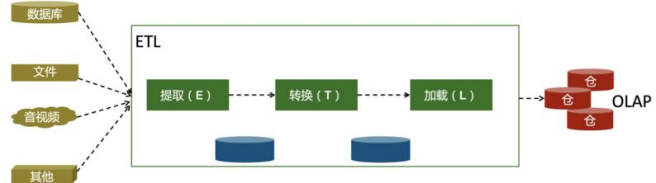

- 传统的 ETL 使用离线处理，经常做的是小时级别或者天级别的 ETL。
- 但是，随着大数据处理呈现实时化趋势，也会有实时数仓的需求，要求在分钟级或者秒级就能够对数据进行更新，从而进行及时的查询，能够看到实时的指标，然后做更实时的判断和分析。

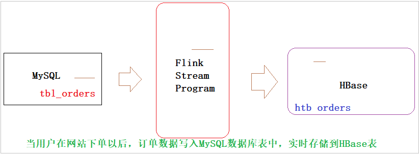

> 在以上场景底下，Flink 能够最大限度地满足实时化的需求。

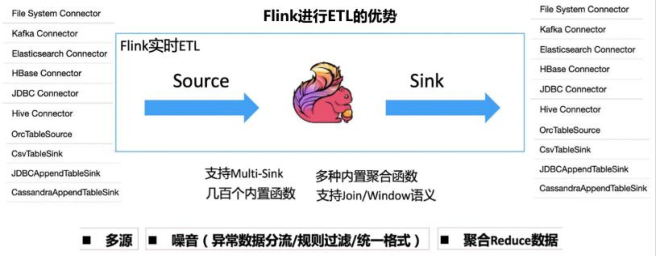

## II. Flink安装部署

### 1. 运行架构

> Flink Runtime运行时架构组成：==**JobManager（主节点**）和**TaskManager`s`（从节点）**==。

https://nightlies.apache.org/flink/flink-docs-release-1.13/docs/concepts/flink-architecture/

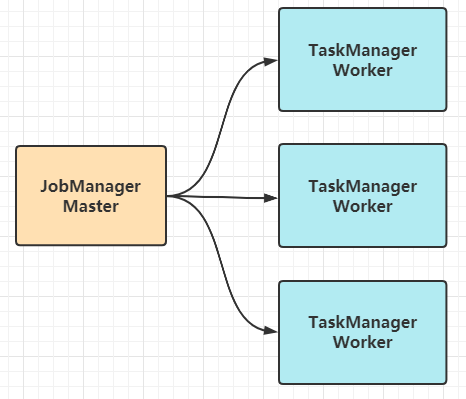

- 1）、==**JobManager**==：主节点Master，为每个Flink Job分配资源，管理和监控Job运行。
  - 主要负责调度 Flink Job 并协调 Task 做 checkpoint；
  - 从 Client 处接收到 Job 和JAR 包等资源后，会生成优化后的执行计划，并以 Task 为单元调度到各个 TaskManager去执行；

- 2）、==**TaskManager**==：从节点Workers，调度每个Job中Task任务执行，及负责Task监控和容错等。
  - 在启动的时候设置：`Slot 槽位数（资源槽）`，每个 slot 能启动 Task，其中Task 为线程。

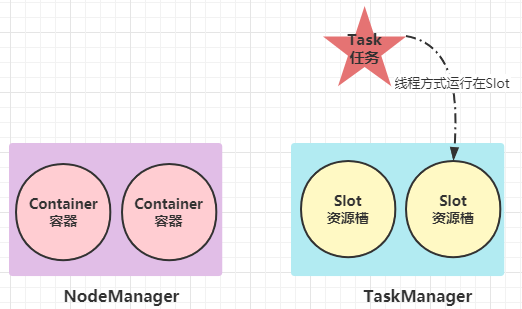

> ==**Flink Client**==：提交应用程序，给主节点JobManager
>
> - Client 为提交 Job 的客户端，可以是运行在任何机器上（与 JobManager 环境连通即可）。


> Flink支持多种安装运行模式，可以将Flink程序运行在很多地方：

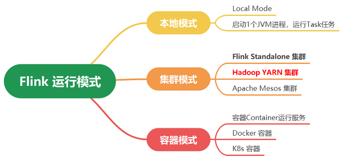

- 第一、`Local 模式`

  [在Windows系统上IDEA集成开发环境编写Flink 代码程序，直接运行测试即为本地测试]()

  - 适用于本地开发和测试环境，占用的资源较少，部署简单
  - 本地模式LocalMode：JobManager和TaskManager运行在==同一个JVM进程==中

  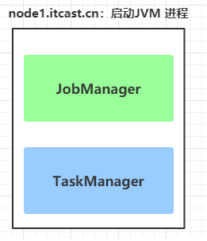

- 第二、`Standalone 模式`

  [将JobManager和TaskManagers直接运行机器上，称为Standalone集群，Flink框架自己集群]()

  - 可以在测试环境功能验证完毕到版本发布的时候使用，进行性能验证

    https://nightlies.apache.org/flink/flink-docs-release-1.13/docs/deployment/resource-providers/standalone/overview/

  - 高可用HA：Standalone Cluster HA

    https://nightlies.apache.org/flink/flink-docs-release-1.13/docs/deployment/ha/zookeeper_ha/

- 第三、`Flink On Yarn 模式`

  [将JobManager和TaskManagers运行在NodeManage的Container容器中，称为Flink on YARN。]()

  - Flink使用YARN进行调度

    https://nightlies.apache.org/flink/flink-docs-release-1.13/docs/deployment/resource-providers/yarn/

- 第四、`K8s 模式`

  [将JobManager和TaskManagers运行在Docker或K8s容器Container中。]()

  - 由于Flink使用的无状态模式，只需要kubernetes提供计算资源即可。会是Flink以后运行的主流方式，可以起到节约硬件资源和便于管理的效果。

    https://nightlies.apache.org/flink/flink-docs-release-1.13/docs/deployment/resource-providers/native_kubernetes/

```ini
# Apache Flink 框架软件下载：
	https://flink.apache.org/downloads.html
	https://archive.apache.org/dist/flink/
	
# Aapche Flink 官方文档：
	https://ci.apache.org/projects/flink/flink-docs-release-1.13/
```

### 2. 本地集群

==Local Cluster 本地集群==：**将不同进程运行在同一台机器上，只有一台机器**。

> [针对Flink框架来说，进程分别为`JobManager`（主节点，管理者）和`TaskManager`（从节点，干活着）]()

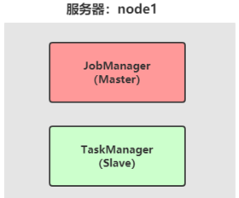

> 提交Flink Job运行原理如下：

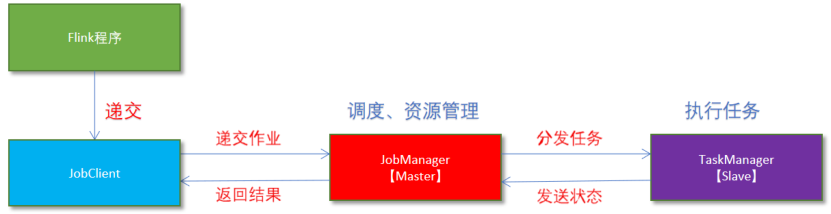

1. Flink程序（比如jar包）由`JobClient`进行提交；
2. JobClient将作业提交给`JobManager`；
3. JobManager负责**协调资源分配和作业执行**。资源分配完成后，任务将提交给相应的`TaskManager`；
4. TaskManager**启动一个线程以开始执行**。TaskManager会向JobManager报告状态更改，如开始执行，正在进行或已完成；
5. 作业执行完成后，结果将发送回客户端(JobClient)；

> 1）、上传软件及解压

```ini
[root@node1 ~]# cd /export/software/
[root@node1 software]# rz
	上传软件包：flink-1.13.1-bin-scala_2.11.tgz

[root@node1 software]# chmod u+x flink-1.13.1-bin-scala_2.11.tgz
[root@node1 software]# tar -zxf flink-1.13.1-bin-scala_2.11.tgz -C /export/server/	

[root@node1 ~]# cd /export/server/
[root@node1 server]# chown -R root:root flink-1.13.1
[root@node1 server]# mv flink-1.13.1 flink-local
```

[当将Flink软件压缩包解压以后，`默认配置，就是本地集群配置，可以直接启动服务即可`]()

```ini
# 目录结构
[root@node1 server]# cd flink-local/
[root@node1 flink-local]# ll
total 480
drwxrwxr-x  2 root root   4096 May 25 20:36 bin
drwxrwxr-x  2 root root    263 May 25 20:36 conf
drwxrwxr-x  7 root root     76 May 25 20:36 examples
drwxrwxr-x  2 root root   4096 May 25 20:36 lib
-rw-r--r--  1 root root  11357 Oct 29  2019 LICENSE
drwxrwxr-x  2 root root   4096 May 25 20:37 licenses
drwxr-xr-x  2 root root      6 Oct  5 10:25 log
-rw-rw-r--  1 root root 455180 May 25 20:37 NOTICE
drwxrwxr-x  3 root root   4096 May 25 20:36 opt
drwxrwxr-x 10 root root    210 May 25 20:36 plugins
-rw-r--r--  1 root root   1309 Jan 30  2021 README.txt
```

> 2）、启动Flink本地集群

```ini
[root@node1 ~]# cd /export/server/flink-local/

[root@node1 flink-local]# bin/start-cluster.sh

[root@node1 flink-local]# jps
3504 TaskManagerRunner
3239 StandaloneSessionClusterEntrypoint
3559 Jps
```

> 3）、访问Flink的Web UI：http://node1.itcast.cn:8081/#/overview

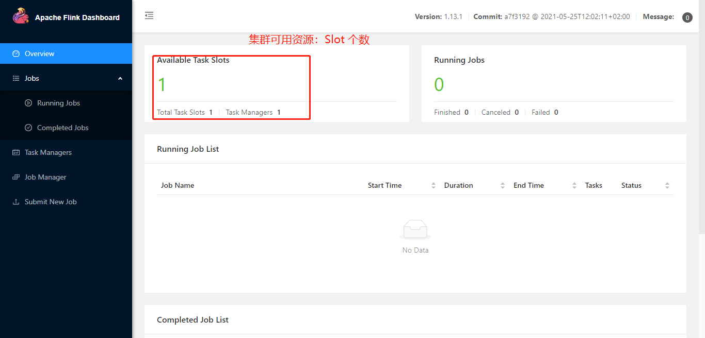

> `slot`在Flink里面可以认为是资源组，Flink是通过将==任务（Task）分成子任务（SubTask）==并且将这些子任务分配到==slot==来并行执行程序。

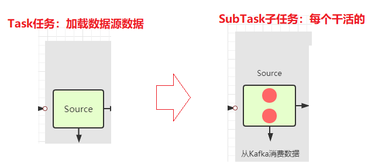

[Slot 封装Task运行资源，可以认为Contanier容器，]()==同一个Slot资源槽中可以运行不同类型SubTask，相当于“猪槽，可以被多个PIG吃食。”==

> 4）、测试完成以后，关闭本地集群

```ini
 [root@node1 ~]# /export/server/flink-local/bin/stop-cluster.sh 
```

当本地集群启动以后，运行Flink应用程序，分别运行**流计算和批处理 词频统计**。

> 通过`flink` 脚本命令提交运行jar包程序，具体命令使用说明如下：

```ini
[root@node1 ~]# cd /export/server/flink-local/
[root@node1 flink-local]# bin/flink run --help

Action "run" compiles and runs a program.

  Syntax: run [OPTIONS] <jar-file> <arguments>
  "run" action options:
     -c,--class <classname>               Class with the program entry point
                                          ("main()" method). Only needed if the
                                          JAR file does not specify the class in
                                          its manifest.
     -C,--classpath <url>                 Adds a URL to each user code
                                          classloader  on all nodes in the
                                          cluster. The paths must specify a
                                          protocol (e.g. file://) and be
                                          accessible on all nodes (e.g. by means
                                          of a NFS share). You can use this
                                          option multiple times for specifying
                                          more than one URL. The protocol must
                                          be supported by the {@link
                                          java.net.URLClassLoader}.
     -d,--detached                        If present, runs the job in detached
                                          mode
     -p,--parallelism <parallelism>       The parallelism with which to run the
                                          program. Optional flag to override the
                                          default value specified in the
                                          configuration.

  Options for Generic CLI mode:
     -D <property=value>   Allows specifying multiple generic configuration
                           options. The available options can be found at
                           https://ci.apache.org/projects/flink/flink-docs-stabl
                           e/ops/config.html
     -t,--target <arg>     The deployment target for the given application,
                           which is equivalent to the "execution.target" config
                           option. For the "run" action the currently available
                           targets are: "remote", "local", "kubernetes-session",
                           "yarn-per-job", "yarn-session". For the
                           "run-application" action the currently available
                           targets are: "kubernetes-application".

  Options for yarn-cluster mode:
     -m,--jobmanager <arg>            Set to yarn-cluster to use YARN execution
                                      mode.
     -yid,--yarnapplicationId <arg>   Attach to running YARN session
     -z,--zookeeperNamespace <arg>    Namespace to create the Zookeeper
                                      sub-paths for high availability mode

  Options for default mode:
     -D <property=value>             Allows specifying multiple generic
                                     configuration options. The available
                                     options can be found at
                                     https://ci.apache.org/projects/flink/flink-
                                     docs-stable/ops/config.html
     -m,--jobmanager <arg>           Address of the JobManager to which to
                                     connect. Use this flag to connect to a
                                     different JobManager than the one specified
                                     in the configuration. Attention: This
                                     option is respected only if the
                                     high-availability configuration is NONE.
     -z,--zookeeperNamespace <arg>   Namespace to create the Zookeeper sub-paths
                                     for high availability mode
```

> 1）、流计算：WordCount词频统计，[运行流式计算程序，从TCP Socket 读取数据，进行词频统计。]()

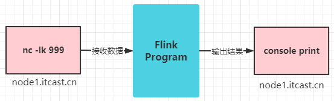

```ini
# 开启1个终端
nc -lk 9999

# 上传jar【StreamWordCount.jar】包至/export/server/flink-local目录
cd /export/server/flink-local
rz

# 再开启1个终端，运行流式应用
/export/server/flink-local/bin/flink run \
--class cn.itcast.flink.StreamWordCount \
/export/server/flink-local/StreamWordCount.jar \
--host node1.itcast.cn --port 9999
```

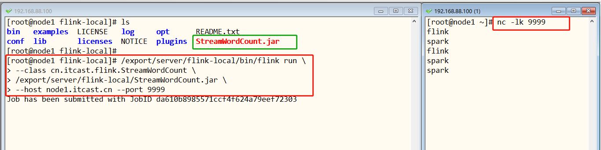

> 2）、监控页面查看日志信息数据

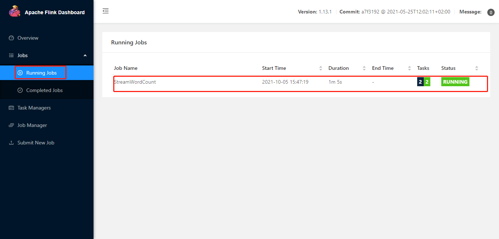

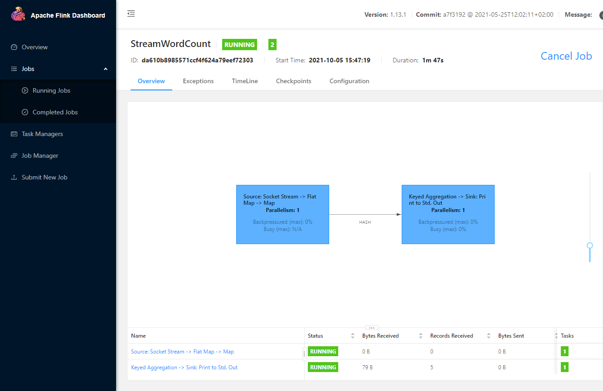

> 查看TaskManager日志，每条数据处理结果：

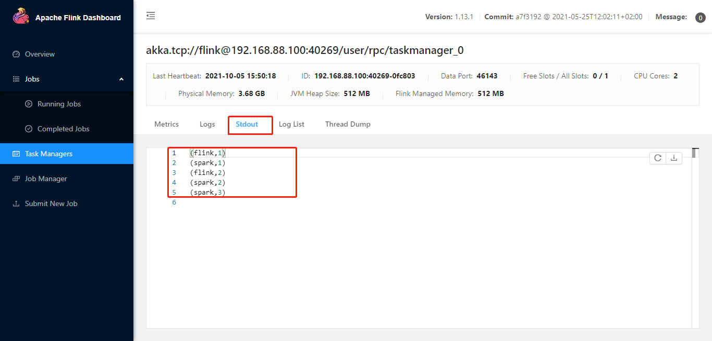

执行官方示例Example，**读取文本文件数据，进行词频统计WordCount，将结果打印控制台或文件**。

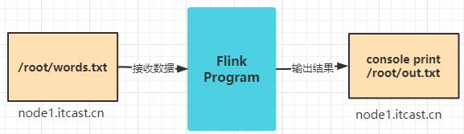

> 1）准备文件`/root/words.txt`

```ini
[root@node1 ~]# vim /root/words.txt
添加数据
spark python spark hive spark hive
python spark hive spark python
mapreduce spark hadoop hdfs hadoop spark
hive mapreduce
```

> 2）批处理，执行如下命令

```ini
# 指定处理数据文件，通过参数 --input 传递
/export/server/flink-local/bin/flink run \
/export/server/flink-local/examples/batch/WordCount.jar --input /root/words.txt
```

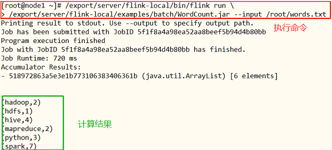

```ini
# 指定处理数据文件和输出数据目录，分别通过--input 和 --output 传递参数值
/export/server/flink-local/bin/flink run \
/export/server/flink-local/examples/batch/WordCount.jar \
--input /root/words.txt \
--output /root/out.txt
```

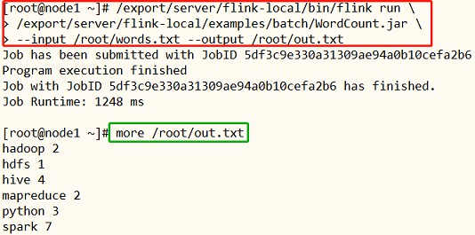

### 3. Standalone集群

> **Flink Standalone集群**，类似Hadoop YARN集群，==管理集群资源和分配资源给Flink Job运行任务Task==。

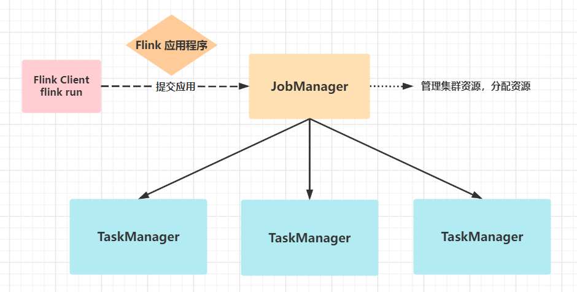

1. Client客户端提交任务给JobManager；
2. JobManager负责申请任务运行所需要的资源并管理任务和资源；
3. JobManager分发任务给TaskManager执行；
4. TaskManager定期向JobManager汇报状态；

> 0）、集群规划：


> 1）、上传软件及解压

```ini
[root@node1 ~]# cd /export/software/
[root@node1 software]# rz
	上传软件包：flink-1.13.1-bin-scala_2.11.tgz
	
[root@node1 software]# chmod u+x flink-1.13.1-bin-scala_2.11.tgz
[root@node1 software]# tar -zxf flink-1.13.1-bin-scala_2.11.tgz -C /export/server/	

[root@node1 ~]# cd /export/server/
[root@node1 server]# chown -R root:root flink-1.13.1
[root@node1 server]# mv flink-1.13.1 flink-standalone
```

> 2）、修改`flink-conf.yaml`

```ini
vim /export/server/flink-standalone/conf/flink-conf.yaml
修改内容：33行内容
	jobmanager.rpc.address: node1.itcast.cn
```

> 3）、修改`masters`

```ini
vim /export/server/ flink-standalone/conf/masters
修改内容：	
	node1.itcast.cn:8081
```

> 4）、修改`workers`

```ini
vim /export/server/ flink-standalone/conf/workers
修改内容：	
    node1.itcast.cn
    node2.itcast.cn
    node3.itcast.cn
```

> 5）、添加`HADOOP_CONF_DIR`环境变量(**集群所有机器**）

```ini
vim /etc/profile
	添加内容：
	export HADOOP_CONF_DIR=/export/server/hadoop/etc/hadoop
# 执行生效
source /etc/profile
```

> 6）、将Flink依赖Hadoop 框架JAR包上传至`/export/server/flink-standalone/lib`目录

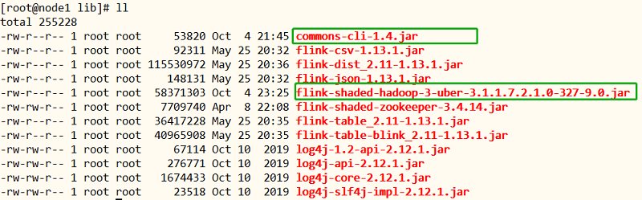

```ini
[root@node1 ~]# cd /export/server/flink-standalone/lib/

[root@node1 lib]# rz
	commons-cli-1.4.jar
	flink-shaded-hadoop-3-uber-3.1.1.7.2.1.0-327-9.0.jar
```

> 7）、分发到集群其他机器

```ini
scp -r /export/server/flink-standalone root@node2.itcast.cn:/export/server
scp -r /export/server/flink-standalone root@node3.itcast.cn:/export/server
```

接下来，启动服务进程，运行批处理程序：词频统计WordCount。

> 1）、启动HDFS集群，在`node1.itcast.cn`上执行如下命令

```ini
# NameNode 主节点
hadoop-daemon.sh start namenode

# 所有DataNodes从节点
hadoop-daemons.sh start datanode
```

> 2）、启动集群，执行如下命令

```ini
# 一键启动所有服务JobManager和TaskManagers
[root@node1 ~]# /export/server/flink-standalone/bin/start-cluster.sh 
Starting cluster.
Starting standalonesession daemon on host node1.itcast.cn.
Starting taskexecutor daemon on host node1.itcast.cn.
Starting taskexecutor daemon on host node2.itcast.cn.
Starting taskexecutor daemon on host node3.itcast.cn.
```

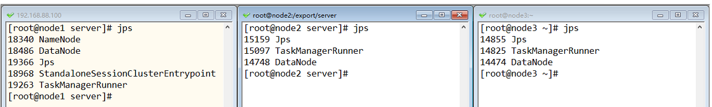

> 3）、访问Flink UI界面：http://node1.itcast.cn:8081/#/overview


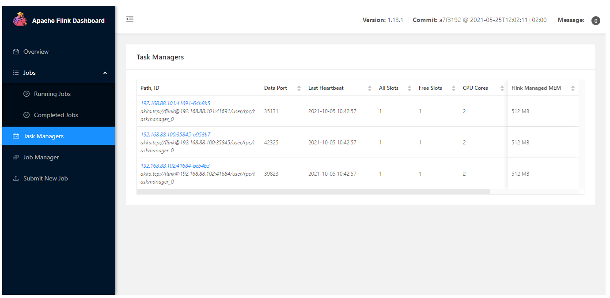

> 4）、执行官方测试案例

```ini
# 准备测试数据
[root@node1 ~]# hdfs dfs -mkdir -p /wordcount/input/
[root@node1 ~]# hdfs dfs -put /root/words.txt /wordcount/input/
```

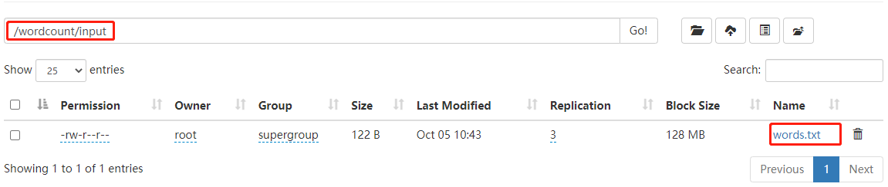

```ini
# 运行程序，使用--input指定处理数据文件路径
/export/server/flink-standalone/bin/flink run \
/export/server/flink-standalone/examples/batch/WordCount.jar \
--input hdfs://node1.itcast.cn:8020/wordcount/input/words.txt
```

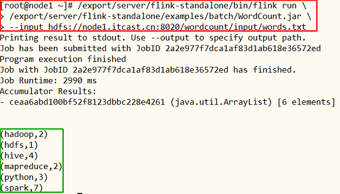

```ini
# 使用--output指定处理结果数据存储目录
/export/server/flink-standalone/bin/flink run \
/export/server/flink-standalone/examples/batch/WordCount.jar \
--input hdfs://node1.itcast.cn:8020/wordcount/input/words.txt \
--output hdfs://node1.itcast.cn:8020/wordcount/output/result

[root@node1 ~]# hdfs dfs -text /wordcount/output/result
```

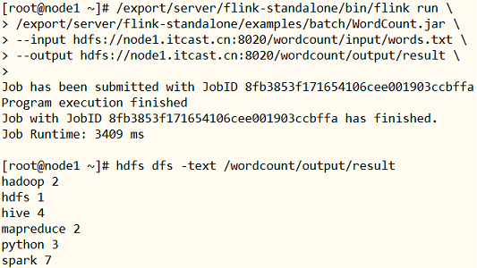

> 5）、关闭Standalone集群服务

```ini
# 一键停止所有服务JobManager和TaskManagers
[root@node1 ~]# /export/server/flink-standalone/bin/stop-cluster.sh 
Stopping taskexecutor daemon (pid: 6600) on host node1.itcast.cn.
Stopping taskexecutor daemon (pid: 3016) on host node2.itcast.cn.
Stopping taskexecutor daemon (pid: 3034) on host node3.itcast.cn.
Stopping standalonesession daemon (pid: 6295) on host node1.itcast.cn.
```

> **补充**：Flink Standalone集群启动与停止，也可以逐一服务启动

```ini
# 每个服务单独启动
# 在node1.itcast.cn上启动
/export/server/flink-standalone/bin/jobmanager.sh start
# 在node1.itcast.cn、node2.itcast.cn、node3.itcast.cn
/export/server/flink-standalone/bin/taskmanager.sh start  # 每台机器执行

# ===============================================================
# 每个服务单独停止
# 在node1.itcast.cn上停止
/export/server/flink-standalone/bin/jobmanager.sh stop
# 在node1.itcast.cn、node2.itcast.cn、node3.itcast.cn
/export/server/flink-standalone/bin/taskmanager.sh stop 
```

### 4. Standalone HA

> 从Standalone架构图中，可发现JobManager存在`单点故障（SPOF`），一旦JobManager出现意外，整个集群无法工作。为了确保集群的高可用，需要搭建Flink的Standalone HA。


> Flink Standalone HA集群，类似YARN HA 集群安装部署，可以[启动多个主机点JobManager，使用Zookeeper集群监控JobManagers转态，进行选举leader，实现自动故障转移。]()

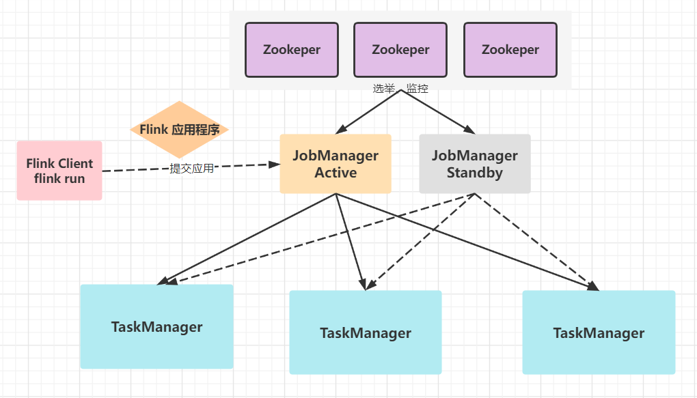

在 Zookeeper 的协助下，一个 Standalone的Flink集群会同时有多个活着的 JobManager，其中**只有一个处于Active工作状态，其他处于 Standby 状态。**当工作中的 JobManager 失去连接后(如宕机或 Crash)，Zookeeper 会从 Standby 中选一个新的 JobManager 来接管 Flink 集群。

> 1）、集群规划

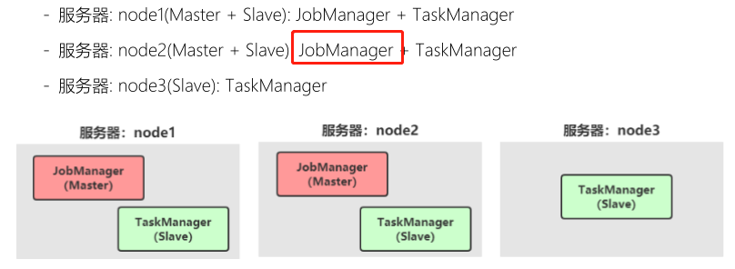

```ini
# 在node1.itcast.cn上复制一份standalone
[root@node1 ~]# cd /export/server/
[root@node1 server]# cp -r flink-standalone flink-ha

# 删除日志文件
[root@node1 ~]# rm -rf /export/server/flink-ha/log/*
```

> 2）、启动ZooKeeper，在`node1.itcast.cn`上启动

```ini
zookeeper-daemons.sh start
```

> 3）、启动HDFS，在`node1.itcast.cn`上启动，**如果没有关闭，不用重启**

```ini
hadoop-daemon.sh start namenode
hadoop-daemons.sh start datanode
```

> 4）、停止集群，在`node1.itacast.cn`操作，进行HA高可用配置

```ini
/export/server/flink-standalone/bin/stop-cluster.sh 
```

> 5）、修改`flink-conf.yaml`，在`node1.itacast.cn`操作

```ini
vim /export/server/flink-ha/conf/flink-conf.yaml
	修改内容：
jobmanager.rpc.address: node1.itcast.cn	

high-availability: zookeeper
high-availability.storageDir: hdfs://node1.itcast.cn:8020/flink/ha/
high-availability.zookeeper.quorum: node1.itcast.cn:2181,node2.itcast.cn:2181,node3.itcast.cn:2181
high-availability.zookeeper.path.root: /flink
high-availability.cluster-id: /cluster_standalone

state.backend: filesystem
state.backend.fs.checkpointdir: hdfs://node1.itcast.cn:8020/flink/checkpoints
state.savepoints.dir: hdfs://node1.itcast.cn:8020/flink/savepoints
```


> 6）、修改`masters`，在`node1.itacast.cn`操作

```ini
vim /export/server/flink-ha/conf/masters
	修改内容：
	node1.itcast.cn:8081
	node2.itcast.cn:8081
```

> 7）、分发到集群其他机器，在`node1.itacast.cn`操作

```ini
scp -r /export/server/flink-ha root@node2.itcast.cn:/export/server/
scp -r /export/server/flink-ha root@node3.itcast.cn:/export/server/
```

> 8）、修改`node2.itcast.cn`上的`flink-conf.yaml`

```ini
[root@node2 ~]# vim /export/server/flink-ha/conf/flink-conf.yaml 
	修改内容：33 行
	jobmanager.rpc.address: node2.itcast.cn   
```

> 9）、重新启动Flink集群

```ini
# node1.itcast.cn和node2.itcast.cn上执行
/export/server/flink-ha/bin/jobmanager.sh start

# node1.itcast.cn和node2.itcast.cn、node3.itcast.cn执行
/export/server/flink-ha/bin/taskmanager.sh start  # 每台机器执行
```

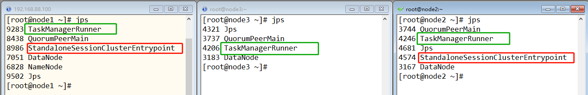

运行批处理词频统计WordCount，在Standalone HA高可用集群上：

> 1）、访问WebUI

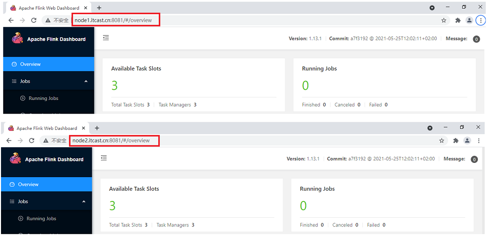

> 2）、执行批处理词频统计WordCount

```ini
/export/server/flink-ha/bin/flink run \
/export/server/flink-ha/examples/batch/WordCount.jar \
--input hdfs://node1.itcast.cn:8020/wordcount/input/words.txt
```

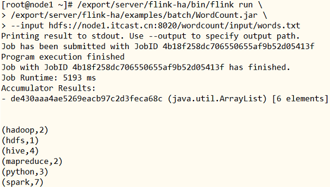

> 3）、kill掉其中一个master，再次运行批处理词频统计

```ini
/export/server/flink-ha/bin/flink run \
/export/server/flink-ha/examples/batch/WordCount.jar \
--input hdfs://node1.itcast.cn:8020/wordcount/input/words.txt
```

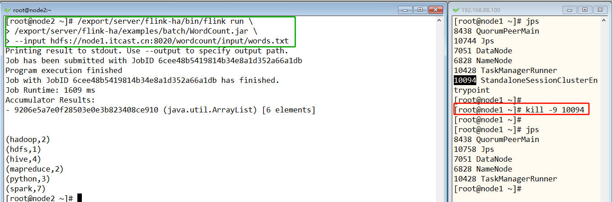

> 查看node2.itcast.cn上JobManager监控页面：

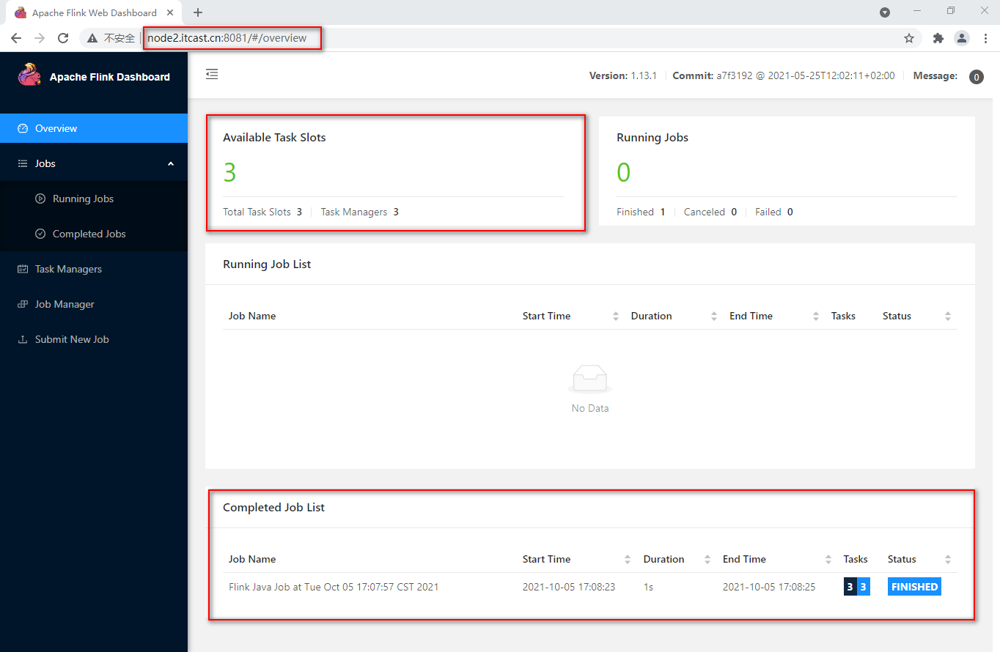

> 4）、关闭集群服务：Standalone 服务、Zookeeper 服务和HDFS服务

```ini
# JM和TMs服务(node2.itcast.cn)
/export/server/flink-ha/bin/stop-cluster.sh

# Zookeeper服务（node1.itcast.cn)
zookeeper-daemons.sh stop

# HDFS服务（node1.itcast.cn)
hadoop-daemon.sh stop namenode
hadoop-daemons.sh stop datanode
```

### 5. Flink on YARN

#### 5.1. 运行流程

在一个企业中，为了==最大化的利用集群资源==，一般都会在一个集群中同时运行多种类型的Workload，因此 Flink 也支持在 Yarn 集群运行。

> 为什么使用`Flink on Yarn或Spark on Yarn?`

- 1）、Yarn的资源可以按需使用，提高集群的资源利用率

- 2）、Yarn的任务有优先级，根据优先级运行作业

- 3）、基于Yarn调度系统，能够自动化地处理各个角色的 Failover(容错)

  `当应用程序（MR、Spark、Flink）运行在YARN集群上时，可以实现容灾恢复。`

> Flink on YARN本质：[将JobManager和TaskManager`s`运行在YARN Contanier容器中]()。

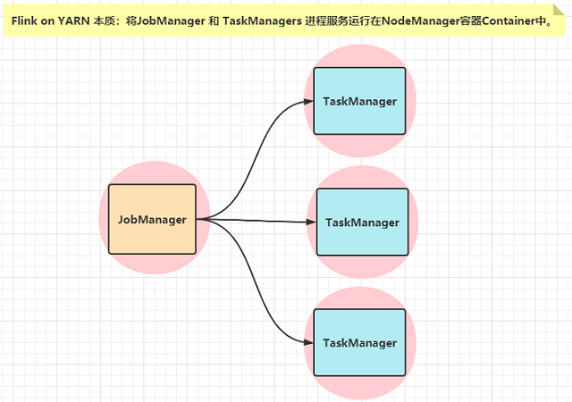

- 1）、JobManager 进程和 TaskManager 进程都由 Yarn NodeManager 监控；

  [JobManager和TaskManager都是运行NodeManager容器Contanier中]()

- 2）、如果 JobManager 进程异常退出，则 Yarn ResourceManager 会重新调度 JobManager到其他机器；

  - [JobManager和AppMaster运行在同一个Container容器中]()

  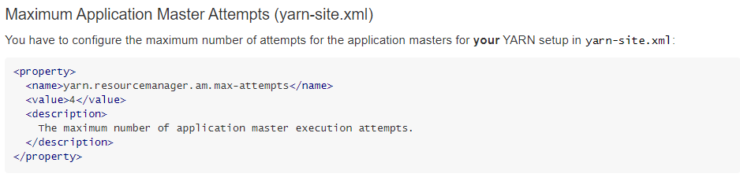

  `max-attempts`默认值：`2`，实际生产环境，可以调整大一点，比如：`4`

- 3）、如果 TaskManager 进程异常退出，JobManager 会收到消息并重新向 Yarn ResourceManager 申请资源，重新启动 TaskManager；

> Flink on YARN 运行机制示意图：[将JobManager和TaskManagers运行到YARN Container容器中。]()

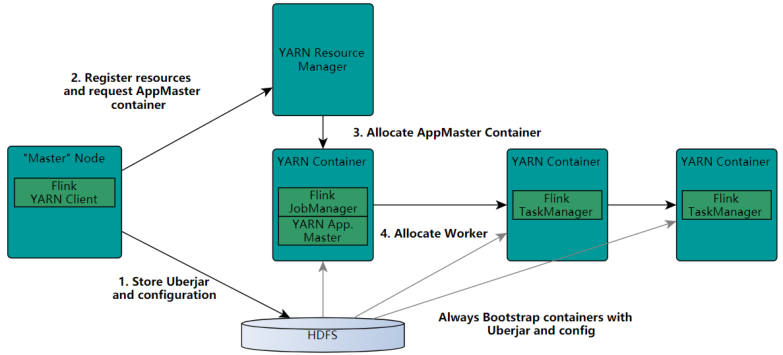

1. 客户端Client上传`jar包和配置文件`到HDFS集群上；
   - 当启动一个Flink Yarn会话时，客户端首先会检查本次请求的资源是否足够；资源足够再上传。
   - YARN Client上传完成jar包和配置文件以后，再向RM提交任务；
2. [Client向YARN ResourceManager提交应用并申请资源；]()
   - ResourceManager在NodeManager上启动容器，运行AppMaster，相当于JobManager进程。
3. [ResourceManager分配Container资源并启动ApplicationMaster，然后AppMaster加载Flink的Jar包和配置构建环境，启动JobManager；]()
   - JobManager和ApplicationMaster运行在同一个Container上；
   - 一旦JobManager被成功启动，AppMaster就知道JobManager的地址(AM它自己所在的机器)；
   - 它就会为TaskManager生成一个新的Flink配置文件，此配置文件也被上传到HDFS上；
   - 此外，AppMaster容器也提供了Flink的web服务接口；
   - YARN所分配的所有端口都是临时端口，这允许用户并行执行多个Flink
4. [ApplicationMaster向ResourceManager申请工作资源，NodeManager加载Flink的Jar包和配置
   构建环境并启动TaskManager（多个）。]()
5. TaskManager启动后向JobManager发送心跳包，并等待JobManager向其分配任务；

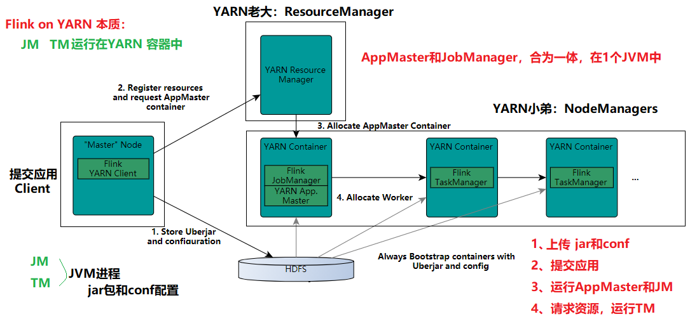

#### 5.2. 安装部署

> Flink on YARN安装配置，此处考虑高可用HA配置，集群机器安装软件框架示意图：

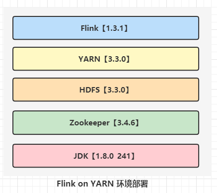

> - 1）、关闭YARN的内存检查（`node1.itcast.cn`操作）

```ini
# yarn-site.xml中添加配置
vim /export/server/hadoop/etc/hadoop/yarn-site.xml
	添加如下内容：
<!-- 关闭yarn内存检查 -->
<property>
    <name>yarn.nodemanager.pmem-check-enabled</name>
    <value>false</value>
</property>
<property>
    <name>yarn.nodemanager.vmem-check-enabled</name>
    <value>false</value>
</property>	
```

> - 2）、 配置Application最大的尝试次数（`node1.itcast.cn`操作）

```ini
# yarn-site.xml中添加配置
vim /export/server/hadoop/etc/hadoop/yarn-site.xml
	添加如下内容：
<property>
	<name>yarn.resourcemanager.am.max-attempts</name>
	<value>4</value>
</property>
```

> - 3）、同步yarn-site.xml配置文件（`node1.itcast.cn`操作）

```ini
cd /export/server/hadoop/etc/hadoop
scp -r yarn-site.xml root@node2.itcast.cn:$PWD
scp -r yarn-site.xml root@node3.itcast.cn:$PWD
```

> - 4）、启动HDFS集群和YARN集群（`node1.itcast.cn`操作）

```ini
[root@node1 ~]# hadoop-daemon.sh start namenode 
[root@node1 ~]# hadoop-daemons.sh start datanode 

[root@node1 ~]# /export/server/hadoop/sbin/start-yarn.sh
```

> - 5）、添加`HADOOP_CONF_DIR`环境变量(**集群所有机器**）

```ini
# 添加环境变量
 vim /etc/profile
	添加内容：
	export HADOOP_CONF_DIR=/export/server/hadoop/etc/hadoop
	
# 环境变量生效	
source /etc/profile
```

> - 6）、上传软件及解压（`node1.itcast.cn`操作）

```ini
[root@node1 ~]# cd /export/software/
[root@node1 software]# rz
	上传软件包：flink-1.13.1-bin-scala_2.11.tgz
	
[root@node1 software]# chmod u+x flink-1.13.1-bin-scala_2.11.tgz
[root@node1 software]# tar -zxf flink-1.13.1-bin-scala_2.11.tgz -C /export/server/	

[root@node1 ~]# cd /export/server/
[root@node1 server]# chown -R root:root flink-1.13.1
[root@node1 server]# mv flink-1.13.1 flink-yarn
```

> - 7）、将Flink依赖Hadoop 框架JAR包上传至`/export/server/flink-yarn/lib`目录


```ini
[root@node1 ~]# cd /export/server/flink-yarn/lib/
[root@node1 lib]# rz
	commons-cli-1.4.jar
	flink-shaded-hadoop-3-uber-3.1.1.7.2.1.0-327-9.0.jar
```

> - 8）、配置HA高可用，依赖Zookeeper及重试次数（`node1.itcast.cn`操作）

```ini
# 修改配置文件
vim /export/server/flink-yarn/conf/flink-conf.yaml
 	添加如下内容：
high-availability: zookeeper
high-availability.storageDir: hdfs://node1.itcast.cn:8020/flink/yarn-ha/
high-availability.zookeeper.quorum: node1.itcast.cn:2181,node2.itcast.cn:2181,node3.itcast.cn:2181
high-availability.zookeeper.path.root: /flink-yarn-ha
high-availability.cluster-id: /cluster_yarn

yarn.application-attempts: 10
```

> - 9）、集群所有机器，同步分发Flink 安装包，便于任意机器提交运行Flink Job。

```ini
scp -r /export/server/flink-yarn root@node2.itcast.cn:/export/server/
scp -r /export/server/flink-yarn root@node3.itcast.cn:/export/server/
```

> - 10）、启动Zookeeper集群（`node1.itcast.cn`操作）

```ini
zookeeper-daemons.sh start
```

> 在Flink中执行应用有如下三种部署模式（Deployment  Mode）：


#### 5.3. Session模式运行

> Flink on YARN ：`Session 模式`，表示多个Flink Job运行共享Standalone集群资源。

[先向Hadoop YARN申请资源，启动运行服务JobManager和TaskManagers，再提交多个Job到Flink 集群上执行。]()

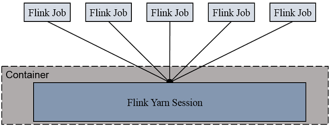

- 无论JobManager还是TaskManager，都是运行NodeManager Contanier容器中，以JVM 进程方式运行；
- 提交每个Flink Job执行时，找的就是JobManager（**AppMaster**），找运行在YARN上应用ID；

> [Session 会话模式：`yarn-session.sh`(开辟资源) + `flink run(`提交任务)]()

- 第一、Hadoop YARN 运行Flink 集群，开辟资源，使用：`yarn-session.sh`
  - 在NodeManager上，启动容器Container运行`JobManager和TaskManagers`
- 第二、提交Flink Job执行，使用：`flink run`

> 准备测试数据，测试运行批处理词频统计WordCount程序

```ini
[root@node1 ~]# vim /root/words.txt
添加数据
spark python spark hive spark hive
python spark hive spark python
mapreduce spark hadoop hdfs hadoop spark
hive mapreduce

[root@node1 ~]# hdfs dfs -mkdir -p /wordcount/input/
[root@node1 ~]# hdfs dfs -put /root/words.txt /wordcount/input/
```


> - 第一步、在yarn上启动一个Flink会话，`node1.itcast.cn`上执行以下命令

```ini
export HADOOP_CLASSPATH=`hadoop classpath`
/export/server/flink-yarn/bin/yarn-session.sh -d -jm 1024 -tm 1024 -s 2

# 参数说明
-d：后台执行
-s：	每个TaskManager的slot数量
-jm：JobManager的内存（单位MB)
-tm：每个TaskManager容器的内存（默认值：MB）

# 提交flink 集群运行yarn后，提示信息
JobManager Web Interface: http://node1.itcast.cn:44263
..................................................................
$ echo "stop" | ./bin/yarn-session.sh -id application_1633441564219_0001
If this should not be possible, then you can also kill Flink via YARN's web interface or via:
$ yarn application -kill application_1633441564219_0001
```

> - 第二步、查看UI界面，http://node1.itcast.cn:8088/cluster/apps

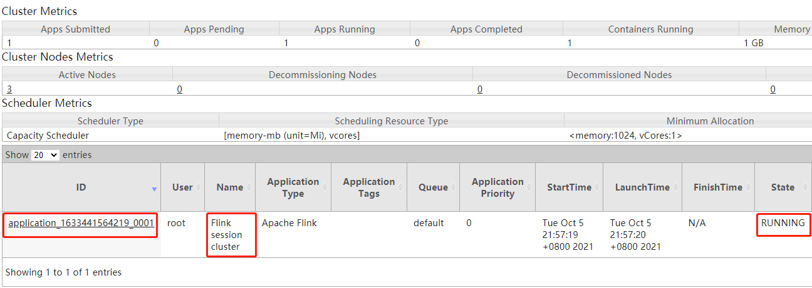

> JobManager提供WEB UI：http://node1.itcast.cn:8088/proxy/application_1614756061094_0002/#/overview

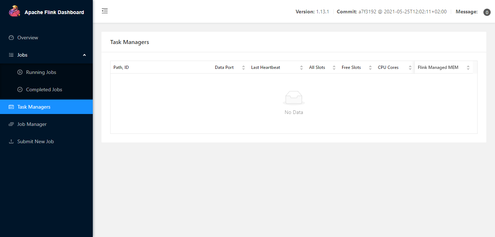

[此时，没有任何TaskManager运行在容器Container中，需要等待有Flink Job提交执行时，才运行TaskManager。]()

> - 第三步、使用`flink run`提交任务

```ini
/export/server/flink-yarn/bin/flink run \
-t yarn-session \
-Dyarn.application.id=application_1633441564219_0001 \
/export/server/flink-yarn/examples/batch/WordCount.jar \
--input hdfs://node1.itcast.cn:8020/wordcount/input/words.txt
```

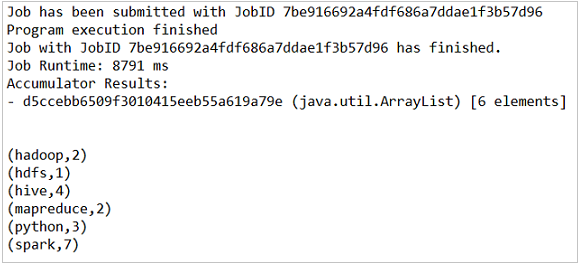

> - 第四步、通过上方的ApplicationMaster可以进入Flink的管理界面

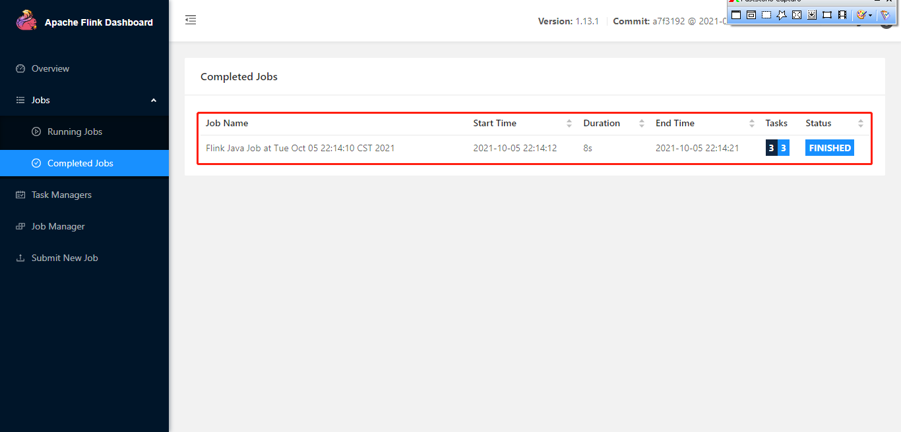

> - 第五步、关闭yarn-session

```ini
# 优雅 停止应用，如果设置重启次数，即使停止应用，也会重启，一直到超过次数以后，才能真正停止应用
echo "stop" | /export/server/flink-yarn/bin/yarn-session.sh -id application_1633441564219_0001

# kill 命令，直接将运行在yarn应用杀死，毫不留情
yarn application -kill application_1633441564219_0001
```

#### 5.4. Per-Job模式

> [每个Flink Job提交运行到Hadoop YARN集群时，根据自身的情况，单独向YARN申请资源，直到作业执行完成]()

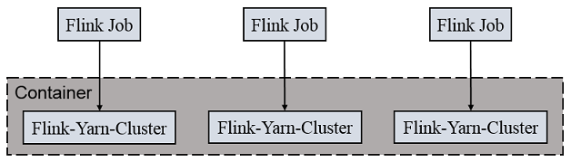

在Hadoop YARN中，每次提交job都会创建一个新的Flink集群，任务之间相互独立，互不影响并且方便管理。任务执行完成之后创建的集群也会消失。

[采用Job分离模式，**每个Flink Job运行，都会申请资源，运行属于自己的Flink 集群**。]()

> - 第一步、直接提交job

```ini
export HADOOP_CLASSPATH=`hadoop classpath`
/export/server/flink-yarn/bin/flink run \
-t yarn-per-job -m yarn-cluster \
-yjm 1024 -ytm 1024 -ys 1 \
/export/server/flink-yarn/examples/batch/WordCount.jar \
--input hdfs://node1.itcast.cn:8020/wordcount/input

# 参数说明
-m：指定需要连接的jobmanager(主节点)地址，指定为 yarn-cluster，启动一个新的yarn-session
-yjm：JobManager可用内存，单位兆
-ytm：每个TM所在的Container可申请多少内存，单位兆
-ys：每个TM会有多少个Slot
-yd：分离模式（后台运行，不指定-yd, 终端会卡在提交的页面上）
```

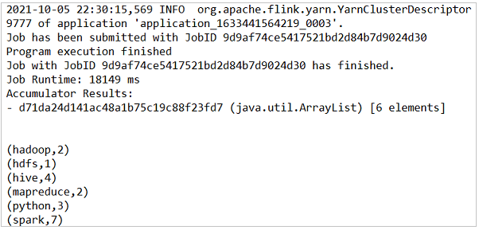

> - 第二步、查看UI界面：http://node1.itcast.cn:8088/cluster

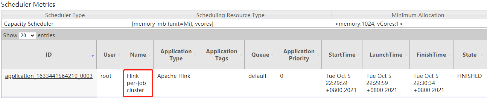

> 提交Flink Job在Hadoop YARN执行时，最后给出如下错误警告：

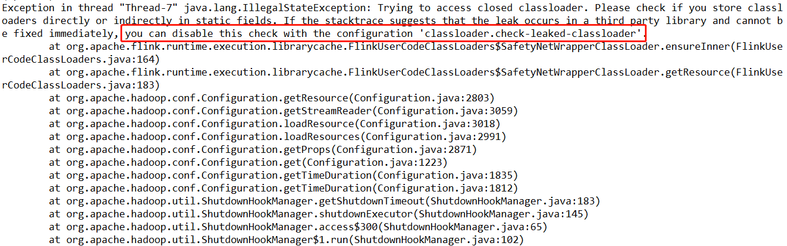

```ini
解决办法： 在 flink 配置文件里 flink-conf.yaml设置
	classloader.check-leaked-classloader: false
```

#### 5.5. Application模式运行

> **Flink 1.11** 引入了一种新的部署模式，即 **Application** 模式，目前可以支持基于 Hadoop YARN 和 Kubernetes 的 Application 模式。

```ini
# 1、Session 模式：
	所有作业Job共享1个集群资源，隔离性差，JM 负载瓶颈，每个Job中main 方法在客户端执行。

# 2、Per-Job 模式：
	每个作业单独启动1个集群，隔离性好，JM 负载均衡，Job作业main 方法在客户端执行。
```

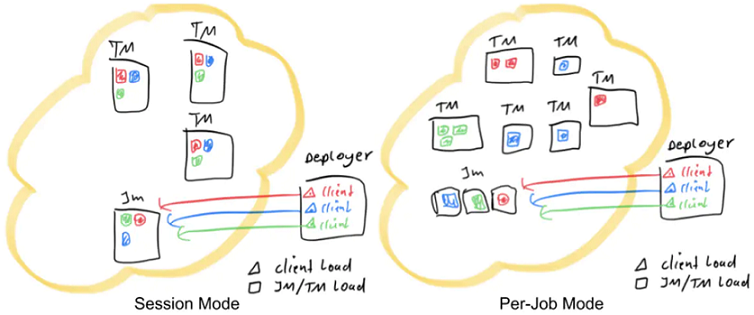

以上两种模式，==main方法都是在客户端执行==，需要**获取 flink 运行时所需的依赖项，并生成 JobGraph，提交到集群的操作都会在实时平台所在的机器上执行**，那么将会给服务器造成很大的压力。此外，提交任务的时候会**把本地flink的所有jar包先上传到hdfs上相应的临时目录**，带来==大量的网络的开销==，所以如果任务特别多的情况下，平台的吞吐量将会直线下降。

> Application 模式下，==用户程序的 main 方法将在`集群`中运行==，用户**将程序逻辑和依赖打包进一个可执行的 jar 包里**，集群的入口程序 (ApplicationClusterEntryPoint) 负责调用其中的 main 方法来生成 JobGraph。

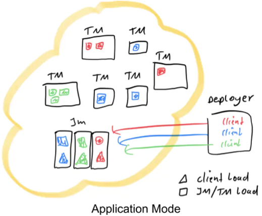

**Application 模式为每个提交的应用程序创建一个集群，并在应用程序完成时终止**。Application 模式在不同应用之间提供了资源隔离和负载平衡保证。在特定一个应用程序上，JobManager 执行 m**ain()** 可以[节省所需的 CPU 周期]()，还可以[节省本地下载依赖项所需的带宽]()。

> ==Application 模式==使用 `bin/flink run-application` 提交作业，本质上是Session和Per-Job模式的折衷。

- 通过 **`-t`** 指定部署环境，目前支持部署在 yarn 上(`-t yarn-application`) 和 k8s 上(`-t kubernetes-application`）；
- 通过 **`-D`** 参数指定通用的运行配置，比如 jobmanager/taskmanager 内存、checkpoint 时间间隔等。

```ini
export HADOOP_CLASSPATH=`hadoop classpath`

/export/server/flink-yarn/bin/flink run-application \
-t yarn-application \
-Djobmanager.memory.process.size=1024m \
-Dtaskmanager.memory.process.size=1024m \
-Dtaskmanager.numberOfTaskSlots=1 \
/export/server/flink-yarn/examples/batch/WordCount.jar \
--input hdfs://node1.itcast.cn:8020/wordcount/input

```

由于MAIN方法在JobManager（也就是NodeManager的容器Container）中执行，当Flink Job执行完成以后，启动`MRJobHistoryServer`历史服务器，查看AppMaster日志信息。

```ini
# node1.itcast.cn 上启动历史服务
[root@node1 ~]# mr-jobhistory-daemon.sh start historyserver 
```

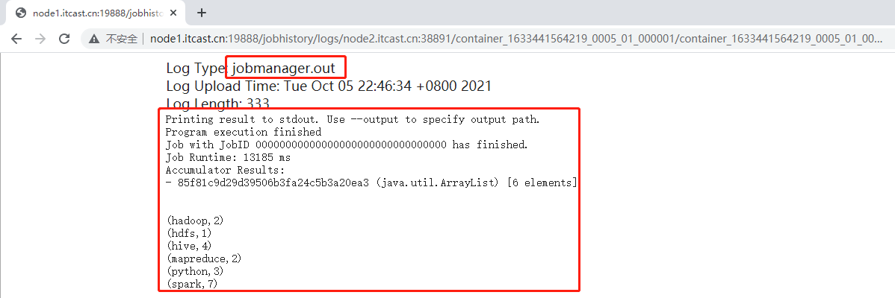

> - 第二步、查看UI界面：http://node1.itcast.cn:8088/cluster

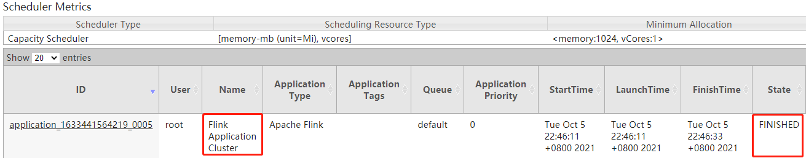

> Flink on YARN运行总结回顾：

```ini
Flink on YARN：
	1、本质：
		将Flink 集群运行到YARN Container容器中（JM和TMs在NodeManager容器中运行），此时JM和AppMaster合为一体

	2、提交流程
		a、上传jar和conf到hdfs
		b、提交应用给RM，启动AppMaster
		c、AppMaster下载jar和conf，启动JobManager
		d、AppMaster先RM申请资源，下载jar和conf，启动TMs

	3、部署模式：3种
		第1种：Session 模式
			多个Job共享一个集群资源
			先申请资源运行JM和TMs，再提交Job执行
		第2种：Per-Job 模式
			每个Job独享一个集群资源
			运行Job时，申请资源运行JM和TMs，当Job运行完成，释放资源，程序结束
		第3种：Application 模式
			解决Session模式和Pet-Job模式中，程序main方法在client执行性能问题
			将Main放在JM中执行，类似Pet-Job模式，每个Job独享集群资源
```

> 测试Flink Job不同运行模式时，注意事项如下：


## III. Flink入门案例

### 1. 编程模型

基于Flink计算引擎，分别用批处理（Batch Processing）和流处理（Streaming Process）中实现经典程序：==词频统计WordCount==。

> - ==第一点：Flink API== ，提供四个层次API，越在下面API，越复杂和灵活；越在上面API，使用越简单和抽象

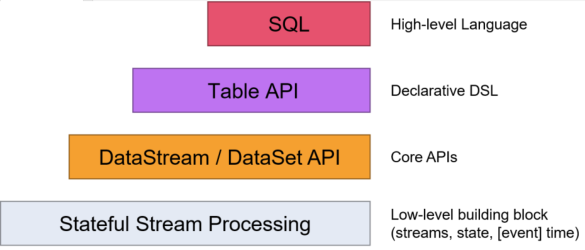

> - ==第二点：编程模型==，无论编写批处理还是流计算程序，分为三个部分：==Source、Transformation和Sink==


```ini
# 第一步、从数据源DataSource获取数据
	流计算：DataStream
	批处理：DataSet

# 第二步、对数据进行转换处理
	
# 第三步、结果数据输出DataSink
```

[无论批处理Batch，还是流计算Stream，首先需要创建`执行环境ExecutionEnvironment对象`，类似Spark中`SparkSession`或者`SparkContext`。]()


> 创建整个Flink基础课程Maven Project，[约定：每天创建一个Maven Module]()

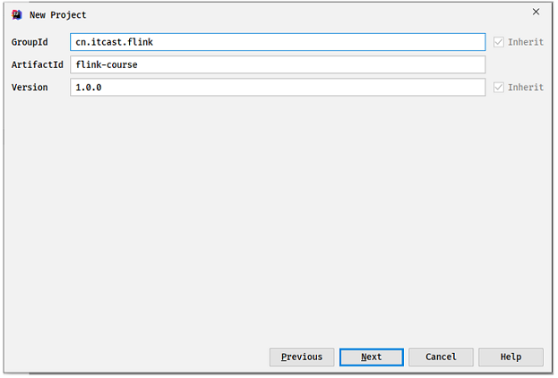

[设置MAVEN Repository仓库目录及Maven安装目录]()

> 创建第1天Maven Module，模块结构：

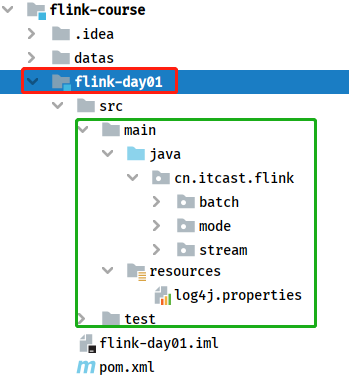

POM文件添加如下内容：

```xml
    <properties>
        <project.build.sourceEncoding>UTF-8</project.build.sourceEncoding>
        <maven.compiler.source>${java.version}</maven.compiler.source>
        <maven.compiler.target>${java.version}</maven.compiler.target>
        <java.version>1.8</java.version>
        <scala.binary.version>2.11</scala.binary.version>
        <flink.version>1.13.1</flink.version>
        <hadoop.version>3.3.0</hadoop.version>
    </properties>

    <repositories>
        <repository>
            <id>nexus-aliyun</id>
            <name>Nexus aliyun</name>
            <url>http://maven.aliyun.com/nexus/content/groups/public</url>
        </repository>
        <repository>
            <id>central_maven</id>
            <name>central maven</name>
            <url>https://repo1.maven.org/maven2</url>
        </repository>
        <repository>
            <id>cloudera</id>
            <url>https://repository.cloudera.com/artifactory/cloudera-repos/</url>
        </repository>
        <repository>
            <id>apache.snapshots</id>
            <name>Apache Development Snapshot Repository</name>
            <url>https://repository.apache.org/content/repositories/snapshots/</url>
            <releases>
                <enabled>false</enabled>
            </releases>
            <snapshots>
                <enabled>true</enabled>
            </snapshots>
        </repository>
    </repositories>

    <dependencies>
        <dependency>
            <groupId>org.apache.flink</groupId>
            <artifactId>flink-java</artifactId>
            <version>${flink.version}</version>
        </dependency>
        <dependency>
            <groupId>org.apache.flink</groupId>
            <artifactId>flink-streaming-java_${scala.binary.version}</artifactId>
            <version>${flink.version}</version>
        </dependency>
        <dependency>
            <groupId>org.apache.flink</groupId>
            <artifactId>flink-clients_2.11</artifactId>
            <version>${flink.version}</version>
        </dependency>
        <dependency>
            <groupId>org.apache.flink</groupId>
            <artifactId>flink-runtime-web_${scala.binary.version}</artifactId>
            <version>${flink.version}</version>
        </dependency>

        <dependency>
            <groupId>org.slf4j</groupId>
            <artifactId>slf4j-api</artifactId>
            <version>1.7.7</version>
            <scope>runtime</scope>
        </dependency>
        <dependency>
            <groupId>org.slf4j</groupId>
            <artifactId>slf4j-log4j12</artifactId>
            <version>1.7.7</version>
            <scope>runtime</scope>
        </dependency>
        <dependency>
            <groupId>log4j</groupId>
            <artifactId>log4j</artifactId>
            <version>1.2.17</version>
            <scope>runtime</scope>
        </dependency>

    </dependencies>

    <build>
        <sourceDirectory>src/main/java</sourceDirectory>
        <testSourceDirectory>src/test/java</testSourceDirectory>
        <plugins>
            <!-- 编译插件 -->
            <plugin>
                <groupId>org.apache.maven.plugins</groupId>
                <artifactId>maven-compiler-plugin</artifactId>
                <version>3.5.1</version>
                <configuration>
                    <source>1.8</source>
                    <target>1.8</target>
                    <!--<encoding>${project.build.sourceEncoding}</encoding>-->
                </configuration>
            </plugin>
            <plugin>
                <groupId>org.apache.maven.plugins</groupId>
                <artifactId>maven-surefire-plugin</artifactId>
                <version>2.18.1</version>
                <configuration>
                    <useFile>false</useFile>
                    <disableXmlReport>true</disableXmlReport>
                    <includes>
                        <include>**/*Test.*</include>
                        <include>**/*Suite.*</include>
                    </includes>
                </configuration>
            </plugin>
            <!-- 打jar包插件(会包含所有依赖) -->
            <plugin>
                <groupId>org.apache.maven.plugins</groupId>
                <artifactId>maven-shade-plugin</artifactId>
                <version>2.3</version>
                <executions>
                    <execution>
                        <phase>package</phase>
                        <goals>
                            <goal>shade</goal>
                        </goals>
                        <configuration>
                            <filters>
                                <filter>
                                    <artifact>*:*</artifact>
                                    <excludes>
                                        <!--
                                        zip -d learn_spark.jar META-INF/*.RSA META-INF/*.DSA META-INF/*.SF -->
                                        <exclude>META-INF/*.SF</exclude>
                                        <exclude>META-INF/*.DSA</exclude>
                                        <exclude>META-INF/*.RSA</exclude>
                                    </excludes>
                                </filter>
                            </filters>
                            <transformers>
                                <transformer implementation="org.apache.maven.plugins.shade.resource.ManifestResourceTransformer">
                                    <!-- <mainClass>com.itcast.flink.WordCount</mainClass> -->
                                </transformer>
                            </transformers>
                        </configuration>
                    </execution>
                </executions>
            </plugin>
        </plugins>
    </build>
```

日志配置文件：`log4j.properties`

```properties
# This affects logging for both user code and Flink
log4j.rootLogger=INFO, console

# Uncomment this if you want to _only_ change Flink's logging
#log4j.logger.org.apache.flink=INFO

# The following lines keep the log level of common libraries/connectors on
# log level INFO. The root logger does not override this. You have to manually
# change the log levels here.
log4j.logger.akka=INFO
log4j.logger.org.apache.kafka=INFO
log4j.logger.org.apache.hadoop=INFO
log4j.logger.org.apache.zookeeper=INFO

# Log all infos to the console
log4j.appender.console=org.apache.log4j.ConsoleAppender
log4j.appender.console.layout=org.apache.log4j.PatternLayout
log4j.appender.console.layout.ConversionPattern=%d{yyyy-MM-dd HH:mm:ss,SSS} %-5p %-60c %x - %m%n

# Suppress the irrelevant (wrong) warnings from the Netty channel handler
log4j.logger.org.apache.flink.shaded.akka.org.jboss.netty.channel.DefaultChannelPipeline=ERROR, console
```

> 配置IDEA远程连接服务器，比如：`node1.itcast.cn`

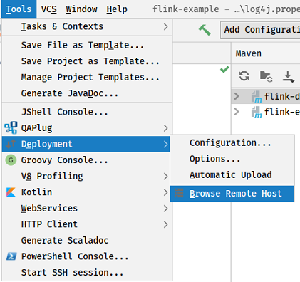

### 2. WordCount(批处理)

> 首先，基于Flink计算引擎，[实现离线批处理Batch：从文本文件读取数据，词频统计]()。

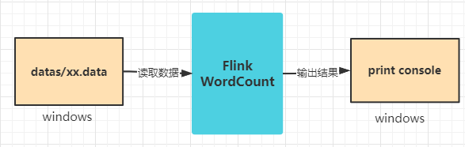

> 批处理时词频统计思路如下伪代码所示：

```ini
					spark flink flink flink spark
								|
								| flatMap
								|
			 3-1. 分割单词 spark, flink, flink, flink, spark
			 					|
			                    | map
			                    |
			 3-2. 转换二元组 (spark, 1) (flink, 1) (flink, 1) (flink, 1) (spark, 1)
			 					|
			                    | groupBy(0)
			                    |
			 3-3. 按照单词分组
			        spark -> [(spark, 1) (spark, 1)]
			        flink -> [(flink, 1) (flink, 1) (flink, 1) ]
			        			|
			                    |sum(1)
			                    |
			 3-4. 组内数据求和，第二元素值累加
			        spark -> 1 + 1 = 2
			        flink -> 1 + 1 + 1 =3
```

> 基于Flink编写批处理或流计算程序步骤如下：（5个步骤）

```ini
1.执行环境-env
2.数据源-source
3.数据转换-transformation
4.数据接收器-sink
5.触发执行-execute
```

> 编写批处理词频统计：`BatchWordCount`，创建Java类

```java
package cn.itcast.flink.batch;

import org.apache.flink.api.common.functions.FlatMapFunction;
import org.apache.flink.api.common.functions.MapFunction;
import org.apache.flink.api.java.ExecutionEnvironment;
import org.apache.flink.api.java.operators.AggregateOperator;
import org.apache.flink.api.java.operators.DataSource;
import org.apache.flink.api.java.operators.FlatMapOperator;
import org.apache.flink.api.java.operators.MapOperator;
import org.apache.flink.api.java.tuple.Tuple2;
import org.apache.flink.util.Collector;

/**
 * 使用Flink计算引擎实现离线批处理：词频统计WordCount
	 * 1.执行环境-env
	 * 2.数据源-source
	 * 3.数据转换-transformation
	 * 4.数据接收器-sink
	 * 5.触发执行-execute
 */
public class BatchWordCount {

	public static void main(String[] args) throws Exception {
		// 1.执行环境-env
		ExecutionEnvironment env = ExecutionEnvironment.getExecutionEnvironment() ;

		// 2.数据源-source
		DataSource<String> inputDataSet = env.readTextFile("datas/wordcount.data");

		// 3.数据转换-transformation
		/*
			spark flink spark hbase spark
						|flatMap
			分割单词: spark, flink, spark
						|map
			转换二元组：(spark, 1)  (flink, 1) (spark, 1)， TODO：Flink Java API中提供元组类Tuple
						|groupBy(0)
			分组：spark -> [(spark, 1), (spark, 1)]  flink -> [(flink, 1)]
						|sum(1)
			求和：spark -> 1 + 1 = 2,   flink = 1
		 */
		// 3-1. 分割单词
		FlatMapOperator<String, String> wordDataSet = inputDataSet.flatMap(new FlatMapFunction<String, String>() {
			@Override
			public void flatMap(String line, Collector<String> out) throws Exception {
				String[] words = line.trim().split("\\s+");
				for (String word : words) {
					out.collect(word);
				}
			}
		});

		// 3-2. 转换二元组
		MapOperator<String, Tuple2<String, Integer>> tupleDataSet = wordDataSet.map(new MapFunction<String, Tuple2<String, Integer>>() {
			@Override
			public Tuple2<String, Integer> map(String word) throws Exception {
				return Tuple2.of(word, 1);
			}
		});

		// 3-3. 分组及求和, TODO: 当数据类型为元组时，可以使用下标指定元素，从0开始
		AggregateOperator<Tuple2<String, Integer>> resultDataSet = tupleDataSet.groupBy(0).sum(1);

		// 4.数据接收器-sink
		resultDataSet.print();

		// 5.触发执行-execute， TODO：批处理时，无需触发，流计算必须触发执行
		//env.execute("BatchWordCount") ;
	}

}

```

### 3. WordCount(流计算)

> 编写Flink程序，**接收TCP Socket的单词数据，并以空格进行单词拆分，分组统计单词个数**。

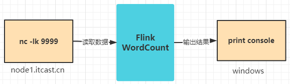

```java
package cn.itcast.flink.stream;

import org.apache.flink.api.common.functions.FlatMapFunction;
import org.apache.flink.api.common.functions.MapFunction;
import org.apache.flink.api.java.tuple.Tuple2;
import org.apache.flink.streaming.api.datastream.DataStreamSource;
import org.apache.flink.streaming.api.datastream.SingleOutputStreamOperator;
import org.apache.flink.streaming.api.environment.StreamExecutionEnvironment;
import org.apache.flink.util.Collector;

/**
 * 使用Flink计算引擎实现实时流计算：词频统计WordCount，从TCP Socket消费数据，结果打印控制台。
	 * 1.执行环境-env
	 * 2.数据源-source
	 * 3.数据转换-transformation
	 * 4.数据接收器-sink
	 * 5.触发执行-execute
 */
public class StreamWordCount {

	public static void main(String[] args) throws Exception {
		// 1.执行环境-env
		StreamExecutionEnvironment env = StreamExecutionEnvironment.getExecutionEnvironment();

		// 2.数据源-source
		DataStreamSource<String> inputDataStream = env.socketTextStream("node1.itcast.cn", 9999);

		// 3.数据转换-transformation
		SingleOutputStreamOperator<Tuple2<String, Integer>> resultDataStream = inputDataStream
			// 3-1. 分割单词
			.flatMap(new FlatMapFunction<String, String>() {
				@Override
				public void flatMap(String line, Collector<String> out) throws Exception {
					for (String word : line.trim().split("\\s+")) {
						out.collect(word);
					}
				}
			})
			// 3-2. 转换二元组
			.map(new MapFunction<String, Tuple2<String, Integer>>() {
				@Override
				public Tuple2<String, Integer> map(String word) throws Exception {
					return new Tuple2<>(word, 1);
				}
			})
			// 3-3. 分组和组内求和
			.keyBy(0).sum(1);

		// 4.数据接收器-sink
		resultDataStream.print();

		// 5.触发执行-execute
		env.execute("StreamWordCount");
	}

}
```

> Apache Flink `1.12.0` 正式发布，`流批一体`真正统一运行！[在 DataStream API 上添加了高效的批执行模式的支持。]()批处理和流处理实现真正统一的运行时的一个重要里程碑。


> 在 Flink 1.12 中，默认执行模式为 `STREAMING`，要将作业配置为以 `BATCH` 模式运行，可以在提交作业的时候，设置参数 `execution.runtime-mode`。
>
> 文档：https://nightlies.apache.org/flink/flink-docs-release-1.13/docs/dev/datastream/execution_mode/

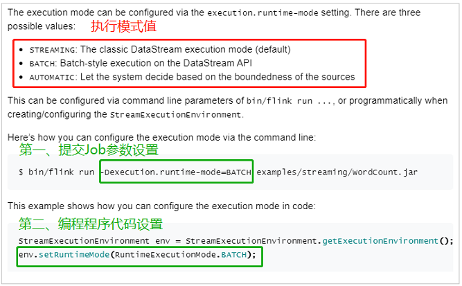

> 修改流计算词频统计，从本地系统文本文件加载数据，处理数据，设置执行模式为：`Batch`。

```java
package cn.itcast.flink.mode;

import org.apache.flink.api.common.RuntimeExecutionMode;
import org.apache.flink.api.common.functions.FlatMapFunction;
import org.apache.flink.api.common.functions.MapFunction;
import org.apache.flink.api.java.tuple.Tuple2;
import org.apache.flink.streaming.api.datastream.DataStreamSource;
import org.apache.flink.streaming.api.datastream.SingleOutputStreamOperator;
import org.apache.flink.streaming.api.environment.StreamExecutionEnvironment;
import org.apache.flink.util.Collector;

/**
 * 使用Flink计算引擎实现离线批处理：词频统计WordCount，TODO：从Flink 1.12开始，流批一体化，API统一，设置执行模式即可
	 * 1.执行环境-env
	 * 2.数据源-source
	 * 3.数据转换-transformation
	 * 4.数据接收器-sink
	 * 5.触发执行-execute
 */
public class ExecutionWordCount {

	public static void main(String[] args) throws Exception {
		// 1.执行环境-env
		StreamExecutionEnvironment env = StreamExecutionEnvironment.getExecutionEnvironment();
		// TODO: 设置执行模式execute-mode为Batch批处理
		env.setRuntimeMode(RuntimeExecutionMode.BATCH) ;

		// 2.数据源-source
		DataStreamSource<String> inputDataStream = env.readTextFile("datas/wordcount.data") ;

		// 3.数据转换-transformation
		SingleOutputStreamOperator<Tuple2<String, Integer>> resultDataStream = inputDataStream
			// 3-1. 分割单词
			.flatMap(new FlatMapFunction<String, String>() {
				@Override
				public void flatMap(String line, Collector<String> out) throws Exception {
					for (String word : line.trim().split("\\s+")) {
						out.collect(word);
					}
				}
			})
			// 3-2. 转换二元组
			.map(new MapFunction<String, Tuple2<String, Integer>>() {
				@Override
				public Tuple2<String, Integer> map(String word) throws Exception {
					return new Tuple2<>(word, 1);
				}
			})
			// 3-3. 分组和组内求和
			.keyBy(0).sum(1);

		// 4.数据接收器-sink
		resultDataStream.print();

		// 5.触发执行-execute
		env.execute("StreamWordCount");
	}

}


```

> 前面提交运行Flink Job时，通过 `--input、--output、--host`和 `--port` 传递参数，如下命令：

```ini
/export/server/flink-local/bin/flink run \
/export/server/flink-local/examples/batch/WordCount.jar --input /root/words.txt --output /root/output
```

> 修改流式程序，从应用程序传递参数：`host和port`，使用Flink中工具类：`ParameterTool`，解析参数，代码如下所示：

文档：https://ci.apache.org/projects/flink/flink-docs-release-1.13/docs/dev/datastream/application_parameters/


```java
package cn.itcast.flink;

import org.apache.flink.api.common.functions.FlatMapFunction;
import org.apache.flink.api.common.functions.MapFunction;
import org.apache.flink.api.java.tuple.Tuple2;
import org.apache.flink.api.java.utils.ParameterTool;
import org.apache.flink.streaming.api.datastream.DataStreamSource;
import org.apache.flink.streaming.api.datastream.SingleOutputStreamOperator;
import org.apache.flink.streaming.api.environment.StreamExecutionEnvironment;
import org.apache.flink.util.Collector;

/**
 * 使用Flink计算引擎实现实时流计算：词频统计WordCount，从TCP Socket消费数据，结果打印控制台。
	 * 1.执行环境-env
	 * 2.数据源-source
	 * 3.数据转换-transformation
	 * 4.数据接收器-sink
	 * 5.触发执行-execute
 */
public class WordCount {

	public static void main(String[] args) throws Exception {

		// TODO: 构建参数解析工具类实例对象
		ParameterTool parameterTool = ParameterTool.fromArgs(args);
		if(parameterTool.getNumberOfParameters() != 2){
			System.out.println("Usage: WordCount --host <hostname> --port <port> .........");
			System.exit(-1);
		}
		final String host = parameterTool.get("host") ; // 直接传递参数，获取值
		final int port = parameterTool.getInt("port", 9999) ; // 如果没有参数，使用默认值

		// 1.执行环境-env
		StreamExecutionEnvironment env = StreamExecutionEnvironment.getExecutionEnvironment();
		env.setParallelism(2) ; // 设置并行度

		// 2.数据源-source
		DataStreamSource<String> inputDataStream = env.socketTextStream(host, port);

		// 3.数据转换-transformation
		SingleOutputStreamOperator<Tuple2<String, Integer>> resultDataStream = inputDataStream
			// 3-1. 分割单词
			.flatMap(new FlatMapFunction<String, String>() {
				@Override
				public void flatMap(String line, Collector<String> out) throws Exception {
					for (String word : line.trim().split("\\s+")) {
						out.collect(word);
					}
				}
			})
			// 3-2. 转换二元组
			.map(new MapFunction<String, Tuple2<String, Integer>>() {
				@Override
				public Tuple2<String, Integer> map(String word) throws Exception {
					return new Tuple2<>(word, 1);
				}
			})
			// 3-3. 分组和组内求和
			.keyBy(0).sum(1);

		// 4.数据接收器-sink
		resultDataStream.print();

		// 5.触发执行-execute
		env.execute("StreamWordCount");
	}

}

```

### 4. 打包部署运行

> Flink 程序提交运行方式有两种：

- 1）、方式一：以命令行的方式提交：`flink run`
- 2）、方式二：以UI的方式提交

> [将开发应用程序编译打包：`flink-day01-1.0.0.jar`，不包含其他依赖jar包，删除log4j配置文件。]()

命令行方式提交Flink应用，可以运行至**Standalone集群和YARN集群**，以运行YARN的**Job分离模式**为例演示提交Flink应用程序。

> - 1）、启动HDFS集群和YARN集群

```ini
# 在node1.itcast.cn上启动服务
zookeeper-daemons.sh start

hadoop-daemon.sh start namenode
hadoop-daemons.sh start datanode

yarn-daemon.sh start resourcemanager
yarn-daemons.sh start nodemanager
```

> - 2）、上传作业jar包到linux服务器

```ini
cd /export/server/flink-yarn/
rz
```

> - 3）、提交运行

```ini
/export/server/flink-yarn/bin/flink run \
-t yarn-per-job \
-m yarn-cluster \
-yjm 1024 -ytm 1024 -ys 1 \
--class cn.itcast.flink.WordCount \
/export/server/flink-yarn/flink-day01-1.0.0.jar \
--host node1.itcast.cn --port 9999
```

> - 4）、第三步、查看任务运行概述

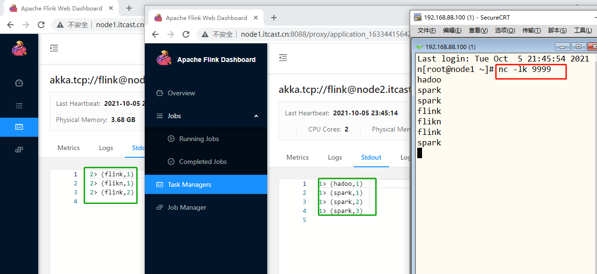

UI 方式提交，此种方式提交应用，可以提交Flink Job在`Flink Standalone集群和YARN Session会话模式`下，此处以YARN Session为例演示。

> - 1）、第一步、启动HDFS集群和YARN集群

```ini
# 在node1.itcast.cn上启动服务
zookeeper-daemons.sh start

hadoop-daemon.sh start namenode
hadoop-daemons.sh start datanode

yarn-daemon.sh start resourcemanager
yarn-daemons.sh start resourcemanager
```

> - 2）、第二步、启动YARN Session

```ini
export HADOOP_CLASSPATH=`hadoop classpath`
/export/server/flink-yarn/bin/yarn-session.sh -d -jm 1024 -tm 1024 -s 2
```

> - 3）、第三步、上传作业jar包及指定相关参数

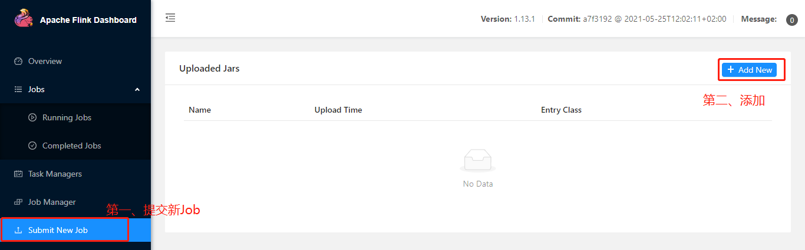

选择打成jar包，然后填写参数值，截图如下：

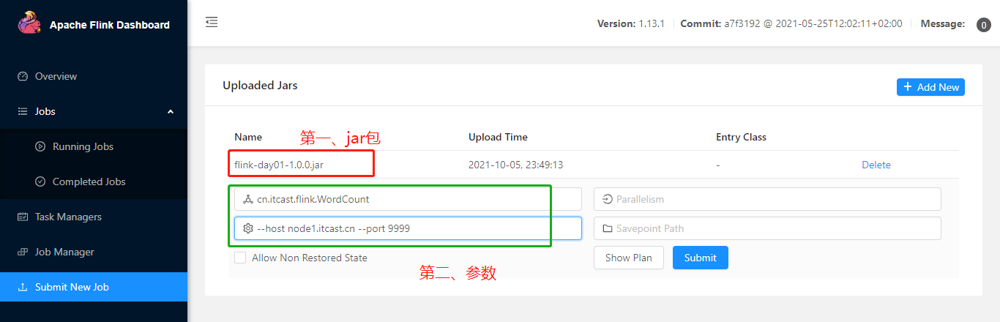

参数内容：

```ini
Entry Class：cn.itcast.flink.WordCount
Program Arguments：--host node1.itcast.cn --port 9999
```

点击显示计划【Show Plan】:

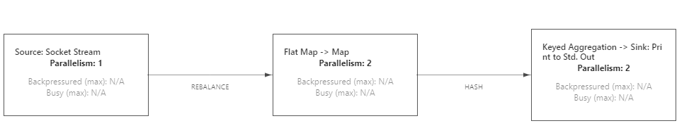

点击提交按钮【Submit】，运行Flink应用。

> 4）、第四步、查看任务运行概述

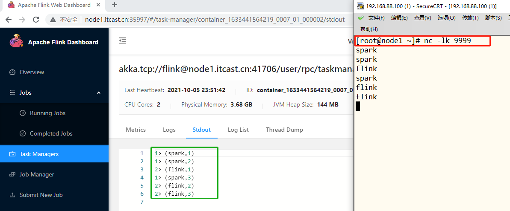

## 附I. 流计算引擎的演进

> 至今为止，大数据技术栈中，针对流式数据处理，主要有如下三代流式计算引擎：


- 第一代：`Apache Storm`（Alibaba `JStorm`）

  [流计算引擎进行了很多代的演进，第一代流计算引擎 Apache Storm 是一个纯流的设计，延迟非常的低，但是它的问题也比较明显，即没有办法避免消息的重复处理，从而导致数据正确性有一定的问题。]()

  `https://storm.apache.org/`

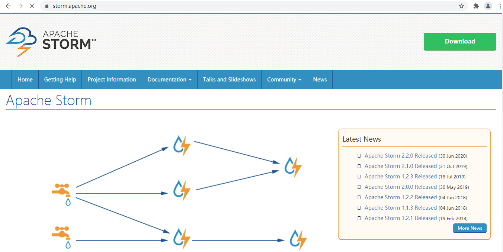

- 第二代：`Spark Streaming`，DStream = Seq[RDD]

  [Spark Streaming 是第二代流计算引擎，解决了流计算语义正确性的问题，但是它的设计理念是以批为核心，最大的问题是延迟比较高，只能做到 10 秒级别的延迟，端到端无法实现秒以内的延迟。]()

  `https://spark.apache.org/streaming/`

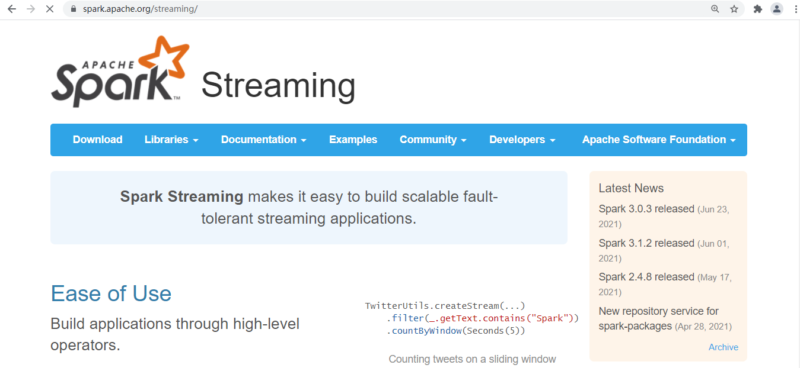

- 第三代：`Apache Flink`（Alibaba `Blink`）

  [Flink 是第三代流计算引擎，也是最新一代的流计算引擎。它既可以保证低延迟，同时又可以保证消息的一致性语义，对于内置状态的管理，也极大降低了应用程序的复杂度。]()

  `https://flink.apache.org/`

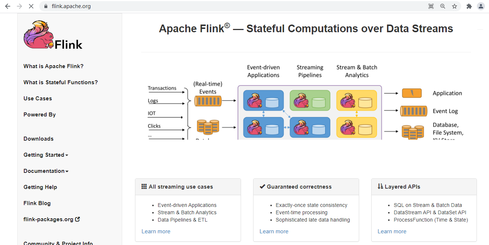

> Google 发布流式处理系统论文：`Google DataFlow`，定义流式计算引擎该有哪些功能。


## 附II. Flink框架技术栈

> 一个计算框架要有长远的发展，必须打造一个完整的`生态栈Stack`（生态圈）。

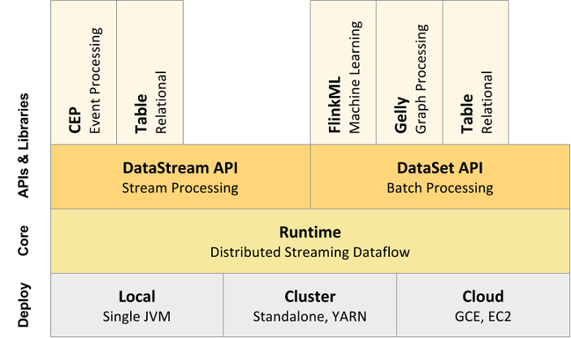

> - 1）、**物理部署层**：Flink 支持本地运行、能在独立集群或者在被 YARN 管理的集群上运行， 也能
>   部署在云上；
>
> [类似MapReduce程序和Spark 应用程序运行部署地方，要么本地Local，要么集群，要么云服务。]()
>
> 
>
> - 2）、**Runtime核心层**：提供了支持Flink计算的全部核心实现；
>
> 
>
> - 3）、**API&Libraries层**：DataStream、DataSet、Table、SQL API，在学习API中中，主要还是使用DataStreamAPI 和Table API & SQL；
>
> [类似`SparkCore：RDD API`和`SparkSQL：DataFrame SQL及DSL`]()
>
> ==从Flink 1.12版本开始，流批一体化，使用DataStream API进行流计算和批处理，并且Flink Table API和SQL稳定，官方建议使用处理数据。==
>
> 
>
> - 4）、**扩展库**：`复杂事件处理CEP`、机器学习库FlinkML、图处理库Gelly；

## 附III. Flink拓展阅读


## 附IV. Flink Standalone集群回顾


## 附V. Hadoop YARN回顾复习


## 附VI. Flink on YARN三种部署模式