# Flink流批一体&API开发

## -I. ExecutionEnvironment创建方式

> 在Flink 流计算程序中，程序入口：流式执行环境`StreamExecutionEnvironment`，有三种创建方式。


- 第1种：`getExecutionEnvironment`方法，**自动依据当前环境，获取执行环境**


- 第2种：`createLocalEnvironment` 方法，获取本地执行环境，启动1个JVM，运行多个线程


> 无论是`getExecutionEnvironment`还是`createLocalEnvironment`方法在本地模式运行时，创建执行环境，随机生成Web UI界面端口号，可以使用方法：`createLocalEnvironmentWithWebUI`，指定某个端口号，默认为`8081`。


```java
StreamExecutionEnvironment env = StreamExecutionEnvironment.createLocalEnvironmentWithWebUI(new Configuration());
env.setParallelism(2);
```

运行Flink 流计算程序，打开监控页面：


- 第三种：`createRemoteEnvironment` 方法，指定**JobManager**地址，获取远程执行环境，提交应用到集群


> 案例代码演示，针对词频统计WordCount修改，不同方式创建流式执行环境：

```Java
package cn.itcast.flink.start;

import org.apache.flink.api.common.functions.FlatMapFunction;
import org.apache.flink.api.java.tuple.Tuple2;
import org.apache.flink.configuration.Configuration;
import org.apache.flink.streaming.api.datastream.DataStreamSource;
import org.apache.flink.streaming.api.datastream.SingleOutputStreamOperator;
import org.apache.flink.streaming.api.environment.StreamExecutionEnvironment;
import org.apache.flink.util.Collector;

public class WordCountDemo {

	public static void main(String[] args) throws Exception{
		// 1. 执行环境-env
		// TODO: 此种方式，依据运行环境，自动确定创建本地环境还是集群环境
		// StreamExecutionEnvironment env = StreamExecutionEnvironment.getExecutionEnvironment();

		// TODO: 创建本地执行环境，启动一个JVM进程，其中Task任务（SubTask子任务）
		// StreamExecutionEnvironment env = StreamExecutionEnvironment.createLocalEnvironment();

		// TODO: 创建本地执行环境，启动WEB UI界面，默认端口号：8081
		StreamExecutionEnvironment env = StreamExecutionEnvironment.createLocalEnvironmentWithWebUI(new Configuration());
		env.setParallelism(1);

		// 2. 数据源-source
		DataStreamSource<String> inputStream = env.socketTextStream("node1.itcast.cn", 9999);

		// 3. 数据转换-transformation
		SingleOutputStreamOperator<Tuple2<String, Integer>> resultStream = inputStream
			.filter(line -> null != line && line.trim().length() > 0)
			.flatMap(new FlatMapFunction<String, Tuple2<String, Integer>>() {
				@Override
				public void flatMap(String value, Collector<Tuple2<String, Integer>> out) throws Exception {
					String[] words = value.trim().split("\\s+");
					for (String word : words) {
						out.collect(Tuple2.of(word, 1));
					}
				}
			})
			.keyBy(tuple -> tuple.f0)
			.sum("f1");

		// 4. 数据接收器-sink
		resultStream.printToErr();

		// 5. 触发执行-execute
		env.execute("Flink Stream WordCount");
	}

}
```

## I. DataStream Operators

### 1. Physical Partitioning

> 在Flink流计算中DataStream提供一些列分区函数


> 在DataStream函数中提供7种方式，具体如下所示：


- 第一、GlobalPartitioner

> 分区器功能：会**将所有的数据都发送到下游的某个算子实例**(subtask id = 0)。


- 第二、BroadcastPartitioner

> 分区器功能：发送到下游**所有**的算子实例。


- 第三、ForwardPartitioner

> 分区器功能：发送到下游对应的第1个task，保证上下游算子并行度一致，即**上游算子与下游算子是1:1关系**。


[在上下游的算子没有指定分区器的情况下，如果上下游的算子并行度一致，则使用ForwardPartitioner，否则使用RebalancePartitioner，对于ForwardPartitioner，必须保证上下游算子并行度一致，否则会抛出异常]()

- 第四、ShufflePartitioner

> 分区器功能：**随机选择**一个下游算子实例进行发送


- 第五、RebalancePartitioner

> 分区器功能：通过**循环**的方式依次发送到下游的task。


> [在Flink批处理中（离线数据分析中），如果数据倾斜，直接调用`rebalance`函数，将数据均衡分配。]()


- 第六、RescalePartitioner

> 分区器功能：基于上下游Operator并行度，将记录以循环的方式输出到下游Operator每个实例。


> 案例代码演示：DataStream中各种数据分区函数使用

```java
package cn.itcast.flink.transformation;

import org.apache.flink.api.common.functions.Partitioner;
import org.apache.flink.api.java.tuple.Tuple2;
import org.apache.flink.configuration.Configuration;
import org.apache.flink.streaming.api.datastream.DataStream;
import org.apache.flink.streaming.api.datastream.DataStreamSource;
import org.apache.flink.streaming.api.environment.StreamExecutionEnvironment;
import org.apache.flink.streaming.api.functions.source.RichParallelSourceFunction;

import java.util.Random;
import java.util.concurrent.TimeUnit;

/**
 * Flink 流计算中转换函数：对流数据进行分区，函数如下：
 *      global、broadcast、forward、shuffle、rebalance、rescale、partitionCustom
 */
public class _13StreamPartitionDemo {

	public static void main(String[] args) throws Exception {
		// 1. 执行环境-env
		StreamExecutionEnvironment env = StreamExecutionEnvironment.createLocalEnvironmentWithWebUI(new Configuration());
		env.setParallelism(1);

		// 2. 数据源-source
		DataStreamSource<Tuple2<Integer, String>> dataStream = env.addSource(
			new RichParallelSourceFunction<Tuple2<Integer, String>>() {
				private boolean isRunning = true ;

				@Override
				public void run(SourceContext<Tuple2<Integer, String>> ctx) throws Exception {
					int index = 1 ;
					Random random = new Random();
					String[] chars = new String[]{
						"A", "B", "C", "D", "E", "F", "G", "H", "I", "J", "K", "L", "M", "N", "O",
						"P", "Q", "R", "S", "T", "U", "V", "W", "X", "Y", "Z"
					};
					while (isRunning){
						Tuple2<Integer, String> tuple = Tuple2.of(index, chars[random.nextInt(chars.length)]);
						ctx.collect(tuple);

						TimeUnit.SECONDS.sleep(2);
						index ++ ;
					}
				}

				@Override
				public void cancel() {
					isRunning = false ;
				}
			}
		);
		//dataStream.printToErr();

		// 3. 数据转换-transformation
		// TODO: 1、global函数，将所有数据发往1个分区Partition
		DataStream<Tuple2<Integer, String>> globalDataStream = dataStream.global();
		//globalDataStream.print().setParallelism(3);

		// TODO: 2、broadcast函数， 广播数据
		DataStream<Tuple2<Integer, String>> broadcastDataStream = dataStream.broadcast();
		//broadcastDataStream.printToErr().setParallelism(3);

		// TODO: 3、forward函数，上下游并发一样时 一对一发送
		//DataStream<Tuple2<Integer, String>> forwardDataStream = dataStream.setParallelism(3).forward();
		//forwardDataStream.print().setParallelism(3) ;

		// TODO: 4、shuffle函数，随机均匀分配
		DataStream<Tuple2<Integer, String>> shuffleDataStream = dataStream.shuffle();
		//shuffleDataStream.printToErr().setParallelism(3);

		// TODO: 5、rebalance函数，轮流分配
		DataStream<Tuple2<Integer, String>> rebalanceDataStream = dataStream.rebalance();
		//rebalanceDataStream.print().setParallelism(3) ;

		// TODO: 6、rescale函数，本地轮流分配
//		DataStream<Tuple2<Integer, String>> rescaleDataStream = dataStream.setParallelism(4).rescale();
//		rescaleDataStream.printToErr().setParallelism(2);

		// TODO: 7、partitionCustom函数，自定义分区规则
		DataStream<Tuple2<Integer, String>> customDataStream = dataStream.partitionCustom(
			new Partitioner<Integer>() {
				@Override
				public int partition(Integer key, int numPartitions) {
					return key % 2;
				}
			},
			tuple -> tuple.f0
		);
		customDataStream.printToErr().setParallelism(2);

		// 4. 数据终端-sink

		// 5. 触发执行-execute
		env.execute("StreamRepartitionDemo");
	}
}
```

### 2. RichFunction

> “==富函数==”是DataStream API提供的一个函数类的接口，==所有Flink函数类都有其Rich版本==。它与常规函数的不同在于，可以**获取运行环境的上下文，并拥有一些生命周期方法**，所以可以实现更复杂的功能。


> `RichFunction`有一个生命周期的概念，典型的生命周期方法有：`open`和`close` 方法。


- `open()`方法：
  - rich function的初始化方法，当一个算子例如map或者filter被调用之前open()会被调用。
- `close()`方法：
  - 生命周期中的最后一个调用的方法，做一些清理工作。
- `getRuntimeContext()`方法：
  - 提供了函数的RuntimeContext的一些信息，例如函数执行的并行度，任务的名字，以及state状态。

> **案例代码演示**：从Socket读取数据，将字符串类型值，转换保存2位小数Double数值。


测试数据：

```ini
DataStream<String> inputStream = env.fromElements("0.124444", "0.899999", "0.345612", "0.870001");
```

具体代码如下：

```java
package cn.itcast.flink.transformation;

import org.apache.flink.api.common.functions.MapFunction;
import org.apache.flink.api.common.functions.RichMapFunction;
import org.apache.flink.configuration.Configuration;
import org.apache.flink.streaming.api.datastream.DataStream;
import org.apache.flink.streaming.api.datastream.DataStreamSource;
import org.apache.flink.streaming.api.datastream.SingleOutputStreamOperator;
import org.apache.flink.streaming.api.environment.StreamExecutionEnvironment;

import java.text.DecimalFormat;

public class _02StreamRichDemo {

	public static void main(String[] args) throws Exception{
		// 1. 执行环境-env
		StreamExecutionEnvironment env = StreamExecutionEnvironment.createLocalEnvironmentWithWebUI(new Configuration()) ;
		env.setParallelism(1);

		// 2. 数据源-source
		DataStreamSource<String> inputStream = env.fromElements("0.124444", "0.899999", "0.345612", "0.870001");

		// 3. 数据转换-transformation
		// TODO: 使用map函数处理流中每条数据
		DataStream<String> mapStream = inputStream.map(new MapFunction<String, String>() {
			DecimalFormat format = new DecimalFormat("#0.00");
			@Override
			public String map(String value) throws Exception {
				return format.format(Double.parseDouble(value));
			}
		});
		mapStream.print("map>");

		// TODO: 使用richMap函数，处理流中每条数据
		SingleOutputStreamOperator<String> richStream = inputStream.map(new RichMapFunction<String, String>() {
			DecimalFormat format = null ;

			@Override
			public void open(Configuration parameters) throws Exception {
				System.out.println("invoke：open() ............................");
				format = new DecimalFormat("#0.00");
			}

			@Override
			public String map(String value) throws Exception {
				return format.format(Double.parseDouble(value));
			}

			@Override
			public void close() throws Exception {
				System.out.println("invoke：close() ............................");
			}
		});
		richStream.printToErr("rich>");

		// 4. 数据接收器-sink
		// 5. 触发执行-execute
		env.execute("StreamRichDemo") ;
	}

}
```

执行程序，结果如下截图：


### 3. ProcessFunction

> [Flink DataStream API中最底层API，提供`process`方法，其中需要实现`ProcessFunction`函数]()


> 查看抽象类：`ProcessFunction`源码，最主要方法：`processElement`，对流中每条数据进行处理。


> 案例演示：使用`process`函数，代替filter函数，实现对数据过滤操作。


```java
package cn.itcast.flink.transformation;

import org.apache.flink.api.common.functions.FilterFunction;
import org.apache.flink.streaming.api.datastream.DataStreamSource;
import org.apache.flink.streaming.api.datastream.SingleOutputStreamOperator;
import org.apache.flink.streaming.api.environment.StreamExecutionEnvironment;
import org.apache.flink.streaming.api.functions.ProcessFunction;
import org.apache.flink.util.Collector;

/**
 * 使用Flink 计算引擎实现流式数据处理：从Socket接收数据，对数据进行过滤【filter】和【process】
 */
public class _03StreamFilterDemo {

	public static void main(String[] args) throws Exception {
		// 1. 执行环境-env
		StreamExecutionEnvironment env = StreamExecutionEnvironment.getExecutionEnvironment();
		env.setParallelism(1) ;

		// 2. 数据源-source
		DataStreamSource<String> inputStream = env.socketTextStream("node1.itcast.cn", 9999);

		// 3. 数据转换-transformation
		// TODO: DataStream中filter属于高级API函数
		SingleOutputStreamOperator<String> filterStream = inputStream.filter(
			new FilterFunction<String>() {
				@Override
				public boolean filter(String line) throws Exception {
					return null != line && line.trim().length() > 0;
				}
			}
		);
		filterStream.printToErr("filter>");

		// TODO: 可以使用底层API方法 -> process
		SingleOutputStreamOperator<String> processStream = inputStream.process(
			new ProcessFunction<String, String>() {
				@Override
				public void processElement(String line, Context ctx, Collector<String> out) throws Exception {
					if(null != line && line.trim().length() > 0){
						out.collect(line);
					}
				}
			}
		);
		processStream.printToErr("process>");

		// 4. 数据接收器-sink
		// 5. 执行应用-execute
		env.execute("StreamProcessDemo");
	}

}

```

> ​		在词频统计案例中，使用`filter/flatMap/map`三个方法处理DataStream数据，可以直接使用`process`方法完成。

```java
package cn.itcast.flink.transformation;

import org.apache.flink.api.common.functions.FilterFunction;
import org.apache.flink.api.common.functions.FlatMapFunction;
import org.apache.flink.api.common.functions.MapFunction;
import org.apache.flink.api.java.tuple.Tuple2;
import org.apache.flink.streaming.api.datastream.DataStream;
import org.apache.flink.streaming.api.datastream.DataStreamSource;
import org.apache.flink.streaming.api.environment.StreamExecutionEnvironment;
import org.apache.flink.streaming.api.functions.ProcessFunction;
import org.apache.flink.util.Collector;

/**
 * 使用Flink 计算引擎实现流式数据处理：从Socket接收数据，使用process方法数据处理
 */
public class _04StreamProcessDemo {

	public static void main(String[] args) throws Exception {
		// 1. 执行环境-env
		StreamExecutionEnvironment env = StreamExecutionEnvironment.getExecutionEnvironment();
		env.setParallelism(1) ;

		// 2. 数据源-source
		DataStreamSource<String> inputStream = env.socketTextStream("node1.itcast.cn", 9999);

		// 3. 数据转换-transformation
		DataStream<Tuple2<String, Integer>> tupleStream = inputStream
			// 3-1 过滤脏数据
			.filter(new FilterFunction<String>() {
				@Override
				public boolean filter(String line) throws Exception {
					return null != line && line.trim().length() > 0;
				}
			})
			// 3-2 将每行数据按照分隔符分割为单词
			.flatMap(new FlatMapFunction<String, String>() {
				@Override
				public void flatMap(String line, Collector<String> out) throws Exception {
					for (String word : line.trim().split("\\s+")) {
						out.collect(word);
					}
				}
			})
			// 3-3 转换每个单词为二元组，表示单词出现一次
			.map(new MapFunction<String, Tuple2<String, Integer>>() {
				@Override
				public Tuple2<String, Integer> map(String word) throws Exception {
					return Tuple2.of(word, 1);
				}
			});
		tupleStream.printToErr("filter-flatMap-map>");

		// TODO: 可以使用底层API方法 -> process
		DataStream<Tuple2<String, Integer>> processStream = inputStream.process(
			new ProcessFunction<String, Tuple2<String, Integer>>() {
				@Override
				public void processElement(String line, Context ctx, Collector<Tuple2<String, Integer>> out) throws Exception {
					// a. 过滤获取符合条件的数据
					if(null != line && line.trim().length() > 0){
						// b. 分割单词
						String[] words = line.trim().split("\\s+");
						// c. 转换二元组并输出
						for (String word : words) {
							out.collect(Tuple2.of(word, 1));
						}
					}
				}
			}
		);
		processStream.printToErr("process>");

		// 4. 数据终端-sink
		// 5. 执行应用-execute
		env.execute("StreamProcessDemo");
	}

}
```

## II. DataStream Connector

### 1. Kafka Connector

> 在Flink框架中，专门为一些存储系统提供**Connector连接器**，方便用户进行**读取**数据（Data Source 数据源）和**保存**数据(Data Sink数据接收器）。

https://nightlies.apache.org/flink/flink-docs-release-1.13/docs/connectors/datastream/overview/


> Kafka Connector连接器，既可以作为==数据源Source==加载数据，又可以作为==数据接收器Sink==保存数据。


> 使用Kafka Connector连接器，添加Maven 依赖：

```xml
<dependency>
    <groupId>org.apache.flink</groupId>
    <artifactId>flink-connector-kafka_2.11</artifactId>
    <version>1.13.1</version>
</dependency>
```

> 在Kafka Connector连接器中提供Source数据源和Sink接收器类，在**Flink 1.12**版本中提供基于新的类从Kafka消费数据：`KafkaSource`。


### 2. FlinkKafkaConsumer

> 当从Kafka消费数据时，工具类：`FlinkKafkaConsumer` ，相关说明如下：

https://nightlies.apache.org/flink/flink-docs-release-1.13/docs/connectors/datastream/kafka/#kafka-sourcefunction


1. 订阅的主题：`topic`，一个Topic名称或一个列表（多个Topic）
2. 反序列化规则：`deserialization`
3. 消费者属性-集群地址：`bootstrap.servers`
4. 消费者属性-消费者组id(如果不设置，会有默认的，但是默认的不方便管理)：`group.id`

> 当从Kafka消费数据时，需要指定反序列化实现类：**将Kafka读取二进制数据，转换为String对象**。


> Kafka Consumer消费数据，反序列化数据说明：


> 启动Zookeeper和Kafka集群，命令如下：

```bash
[root@node1 ~]# zookeeper-daemons.sh start
[root@node1 ~]# kafka-daemons.sh start

[root@node1 ~]# /export/server/kafka/bin/kafka-topics.sh --list --bootstrap-server node1.itcast.cn:9092

[root@node1 ~]# /export/server/kafka/bin/kafka-topics.sh --create --topic flink-topic --bootstrap-server node1.itcast.cn:9092,node2.itcast.cn:9092,node3.itcast.cn:9092 --replication-factor 1 --partitions 3

[root@node1 ~]# /export/server/kafka/bin/kafka-console-producer.sh --topic flink-topic --broker-list node1.itcast.cn:9092,node2.itcast.cn:9092,node3.itcast.cn:9092
```

> 编程实现从Kafka消费数据，演示代码如下：

```Java
package cn.itcast.flink.connector;

import org.apache.flink.api.common.serialization.SimpleStringSchema;
import org.apache.flink.streaming.api.datastream.DataStream;
import org.apache.flink.streaming.api.environment.StreamExecutionEnvironment;
import org.apache.flink.streaming.connectors.kafka.FlinkKafkaConsumer;

import java.util.Properties;

/**
 * Flink从Kafka消费数据，指定topic名称和反序列化类
 */
public class _05StreamFlinkKafkaConsumerDemo {

	public static void main(String[] args) throws Exception{
		// 1. 执行环境-env
		StreamExecutionEnvironment env = StreamExecutionEnvironment.getExecutionEnvironment();
		env.setParallelism(3);

		// 2. 数据源-source
		// 2-1. 创建消费Kafka数据时属性
		Properties props = new Properties();
		props.setProperty("bootstrap.servers", "node1.itcast.cn:9092,node2.itcast.cn:9092,node3.itcast.cn:9092");
		props.setProperty("group.id", "test");
		// 2-2. 构建FlinkKafkaConsumer实例对象
		FlinkKafkaConsumer<String> kafkaConsumer = new FlinkKafkaConsumer<String>(
			"flink-topic", //
			new SimpleStringSchema(), //
			props
		);
		// 2-3. 添加Source
		DataStream<String> kafkaStream = env.addSource(kafkaConsumer);

		// 3. 数据转换-transformation
		// 4. 数据接收器-sink
		kafkaStream.printToErr();

		// 5. 触发执行-execute
		env.execute("StreamFlinkKafkaConsumerDemo") ;
	}

}
```

> 其中最核心的部分就是：创建`FlinkKafkaConsumer`对象，传递参数值


### 3. Start Offset

> 从Kafka 消费数据时，可以设置从Kafka Topic中**哪个偏移量位置**开始消费数据，默认情况下，第一次运行，从Kafka Topic==最大偏移量==开始消费数据。


> - 第一、`earliest`：从最起始位置开始消费，当然不一定是从0开始，因为如果数据过期就清掉
>   了，所以可以理解为从现存的数据里最小位置开始消费；
> - 第二、`latest`：从最末位置开始消费；
> - 第三、`per-partition assignment`：对每个分区都指定一个offset，再从offset位置开始消费
>
> [在Kafka Consumer 参数中，有一个参数，可以进行设置，表示从哪里开始消费读取数据。]()


> Flink 提供**KafkaConnector**连接器中提供`5种方式`，指定从哪里开始消费数据。默认情况下，==从Kafka消费数据时，采用的是：`latest`，最新偏移量开始消费数据==。


> 1. `setStartFromGroupOffsets`：
>    - 从groupId上次消费数据记录开始消费，将上次消费偏移量存储在topic【`__consumer_offsets`】；
>    - 如果消费组时第一次消费数据，从最大偏移量开始消费。
> 2. `setStartFromEarliest`：从最小偏移量消费数据
> 3. `setStartFromLatest`：从最大偏移量消费数据
> 4. `setStartFromTimestamp`：消费每条数据时间戳大于指定时间戳
> 5. `setStartFromSpecificOffsets`：从指定偏移量开始消费数据，偏移量值大于设置偏移量


> 在代码中设置消费数据起始位置相关API如下所示：


> 案例演示代码如下所示：

```Java
package cn.itcast.flink.connector;

import org.apache.flink.api.common.serialization.SimpleStringSchema;
import org.apache.flink.streaming.api.datastream.DataStreamSource;
import org.apache.flink.streaming.api.environment.StreamExecutionEnvironment;
import org.apache.flink.streaming.connectors.kafka.FlinkKafkaConsumer;
import org.apache.flink.streaming.connectors.kafka.internals.KafkaTopicPartition;

import java.util.HashMap;
import java.util.Map;
import java.util.Properties;

/**
 * Flink从Kafka消费数据，指定topic名称和反序列化类，可以指定消费数据开始偏移量
 */
public class _06StreamFlinkKafkaConsumerOffsetDemo {

	public static void main(String[] args) throws Exception {
		// 1. 执行环境-env
		StreamExecutionEnvironment env = StreamExecutionEnvironment.getExecutionEnvironment() ;
		env.setParallelism(1) ;

		// 2. 数据源-source
		// 从Kafka消费数据时，设置参数值
		Properties props = new Properties() ;
		props.setProperty("bootstrap.servers", "node1.itcast.cn:9092");
		props.setProperty("group.id", "test1");
		// 传递参数，创建FlinkKafkaConsumer实例对象
		FlinkKafkaConsumer<String> kafkaConsumer = new FlinkKafkaConsumer<String>(
			"flink-topic",
			new SimpleStringSchema(),
			props
		) ;
		// TODO: 1、Flink从topic中最初的数据开始消费
		//kafkaConsumer.setStartFromEarliest() ;

		// TODO: 2、Flink从topic中最新的数据开始消费
		//kafkaConsumer.setStartFromLatest();

		// TODO: 3、Flink从topic中指定的group上次消费的位置开始消费，所以必须配置group.id参数
		//kafkaConsumer.setStartFromGroupOffsets() ;

		// TODO: 4、Flink从topic中指定的offset开始，这个比较复杂，需要手动指定offset
		Map<KafkaTopicPartition, Long> offsets = new HashMap<>();
		offsets.put(new KafkaTopicPartition("flink-topic", 0), 100L);
		offsets.put(new KafkaTopicPartition("flink-topic", 1), 90L);
		offsets.put(new KafkaTopicPartition("flink-topic", 2), 110L);
		//kafkaConsumer.setStartFromSpecificOffsets(offsets);

		// TODO: 5、指定时间戳消费数据
		kafkaConsumer.setStartFromTimestamp(1644935966961L) ;

		// 从Kafka消费数据
		DataStreamSource<String> kafkaDataStream = env.addSource(kafkaConsumer);

		// 3. 数据转换-transformation
		// 4. 数据终端-sink
		kafkaDataStream.printToErr();

		// 5. 触发执行-execute
		env.execute("StreamFlinkKafkaConsumerOffsetDemo") ;
	}

}
```

> [上面所设置消费偏移量位置，表示不考虑流式程序从Checkpoint检查点或保存点SavePoint恢复。]()


### 4. 新增Topic和分区发现

> 有一个 Flink Job需要将五份数据聚合到一起，五份数据对应**5个 kafka topic**，随着业务增长，**新增一类数据，同时新增1个 Kafka topic**，如何在==不重启作业==的情况下作业自动感知新的 topic。
>
> [新增TOPIC数据，如何Flink Job感知？]()


https://nightlies.apache.org/flink/flink-docs-release-1.13/docs/connectors/datastream/kafka/#topic-partition-subscription

> Flink Kafka Source数据源，提供对应机制：`topic 发现`。

- 对于新增Topic来说，可以设置消费Topic名称时，采用`正则表达式`即可；
- topic名称设置：`java.util.regex.Pattern.compile("test-topic-[0-9]")`


> Flink Job从一个固定的Kafka topic 读数据，开始该 topic 有**7 个 partition**，但随着业务的增长数据量变大，需要对**Kafka partition 个数进行扩容**，由 ==7 个扩容到 14==。该情况下如何在==不重启作业==情况下动态感知新扩容的 partition？
>
> ==对Topic增加分区，如何Flink job感知==


> 构建 ==FlinkKafkaConsumer== 时的 `Properties` 中设置`flink.partition-discovery.interval-millis` 参数为非负值，==表示开启动态发现的开关，及设置的时间间隔==，启动一个单独的线程定期去Kafka获取最新的meta信息。


### 5. KafkaSource

> **Flink 1.12** 版本中，提供基于新API接口`Data Source`实现Kafka 数据源：`KafkaSource`，消费数据更加简单

https://nightlies.apache.org/flink/flink-docs-release-1.13/docs/connectors/datastream/kafka/#kafka-source


> 案例演示：从Kafka消费数据，进行实时流式处理。

```Java
package cn.itcast.flink.connector;

import org.apache.flink.api.common.eventtime.WatermarkStrategy;
import org.apache.flink.api.common.serialization.SimpleStringSchema;
import org.apache.flink.connector.kafka.source.KafkaSource;
import org.apache.flink.connector.kafka.source.enumerator.initializer.OffsetsInitializer;
import org.apache.flink.streaming.api.datastream.DataStream;
import org.apache.flink.streaming.api.environment.StreamExecutionEnvironment;

/**
 * Flink从Kafka消费数据，指定topic名称和反序列化类
 */
public class _06StreamKafkaSourceDemo {

	public static void main(String[] args) throws Exception{
		// 1. 执行环境-env
		StreamExecutionEnvironment env = StreamExecutionEnvironment.getExecutionEnvironment();
		env.setParallelism(3);

		// 2. 数据源-source
		// 2-1. 创建KafkaSource对象，设置属性
		KafkaSource<String> kafkaSource = KafkaSource.<String>builder()
			.setBootstrapServers("node1.itcast.cn:9092,node2.itcast.cn:9092,node3.itcast.cn:9092")
			.setTopics("flink-topic")
			.setGroupId("my-group")
			.setStartingOffsets(OffsetsInitializer.earliest())
			.setValueOnlyDeserializer(new SimpleStringSchema())
			.build();
		// 2-2. 添加数据源
		DataStream<String> kafkaStream = env.fromSource(kafkaSource, WatermarkStrategy.noWatermarks(), "KafkaSource");

		// 3. 数据转换-transformation
		// 4. 数据接收器-sink
		kafkaStream.printToErr();

		// 5. 触发执行-execute
		env.execute("StreamKafkaSourceDemo") ;
	}

}

```

### 6. FlinkKafkaProducer

> Flink提供Connector连接器中支持Kafka的`Source数据源`和`数据终端Sink`。==Flink Kafka Sink核心类：`FlinkKafkaProducer`==。

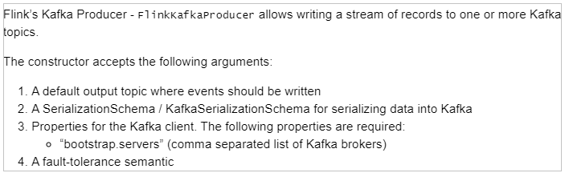

> 1. topic 名称
> 2. 序列化：将Java对象转byte[]
> 3. Kafka Server地址信息
> 4. 容错语义

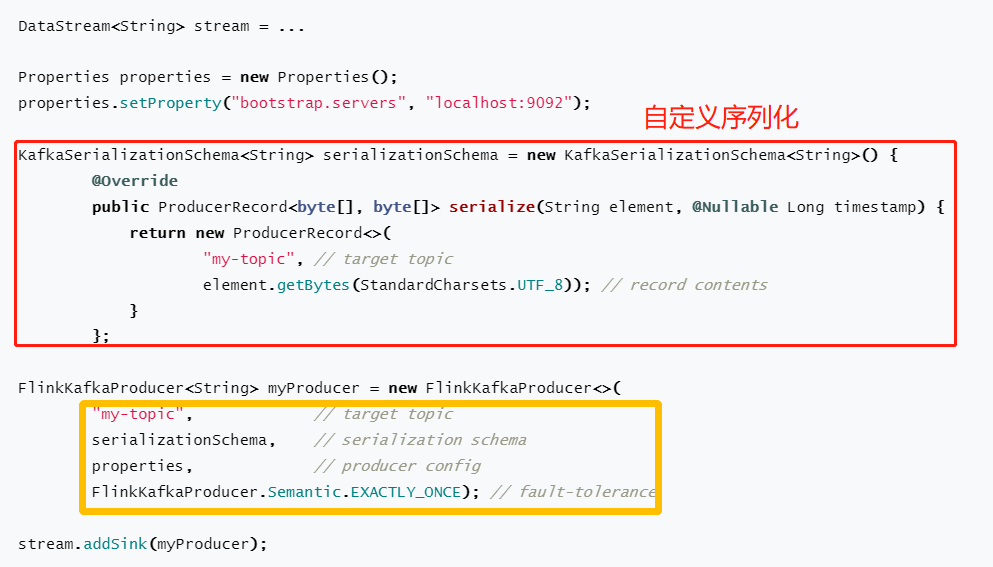

> **准备工作**：启动集群、创建Topic，命令如下

```bash
[root@node1 ~]# zookeeper-daemons.sh start
[root@node1 ~]# kafka-daemons.sh start

[root@node1 ~]# /export/server/kafka/bin/kafka-topics.sh --list --bootstrap-server node1.itcast.cn:9092

[root@node1 ~]# /export/server/kafka/bin/kafka-topics.sh --create --topic flink-topic --bootstrap-server node1.itcast.cn:9092 --replication-factor 1 --partitions 3

[root@node1 ~]# /export/server/kafka/bin/kafka-console-consumer.sh --topic flink-topic --bootstrap-server node1.itcast.cn:9092
```

> 案例演示：==自定义Source数据源，产生交易订单数据，将其转换为JSON字符串，实时保存到Kafka topic==

```Java
package cn.itcast.flink.connector;

import com.alibaba.fastjson.JSON;
import lombok.AllArgsConstructor;
import lombok.Data;
import lombok.NoArgsConstructor;
import org.apache.flink.api.common.functions.MapFunction;
import org.apache.flink.streaming.api.datastream.DataStreamSource;
import org.apache.flink.streaming.api.datastream.SingleOutputStreamOperator;
import org.apache.flink.streaming.api.environment.StreamExecutionEnvironment;
import org.apache.flink.streaming.api.functions.source.RichParallelSourceFunction;
import org.apache.flink.streaming.connectors.kafka.FlinkKafkaProducer;
import org.apache.flink.streaming.connectors.kafka.KafkaSerializationSchema;
import org.apache.kafka.clients.producer.ProducerRecord;

import javax.annotation.Nullable;
import java.util.Properties;
import java.util.Random;
import java.util.UUID;
import java.util.concurrent.TimeUnit;

/**
 * 案例演示：将数据保存至Kafka Topic中，直接使用官方提供Connector
 *      /export/server/kafka/bin/kafka-console-consumer.sh --bootstrap-server node1.itcast.cn:9092 --topic flink-topic
 */
public class _08StreamFlinkKafkaProducerDemo {

	public static void main(String[] args) throws Exception {
		// 1. 执行环境-env
		StreamExecutionEnvironment env = StreamExecutionEnvironment.getExecutionEnvironment();
		env.setParallelism(3) ;

		// 2. 数据源-source
		DataStreamSource<Order> orderDataStream = env.addSource(new OrderSource());

		// 3. 数据转换-transformation：将Order订单对象转换JSON字符串
		SingleOutputStreamOperator<String> jsonDataStream = orderDataStream.map(new MapFunction<Order, String>() {
			@Override
			public String map(Order order) throws Exception {
				// 将Order实例转换JSON字符串，使用fastJson库
				return JSON.toJSONString(order);
			}
		});

		// 4. 数据终端-sink
		// 4-1. 向Kafka写入数据时属性配置
		Properties props = new Properties();
		props.setProperty("bootstrap.servers", "node1.itcast.cn:9092,node2.itcast.cn:9092，node3.itcast.cn:9092");
		// 4-2. 创建FlinkKafkaProducer实例
		FlinkKafkaProducer<String> kafkaSink = new FlinkKafkaProducer<String>(
			"flink-topic", //
			new KafkaStringSchema("flink-topic"), //
			props, //
			FlinkKafkaProducer.Semantic.EXACTLY_ONCE
		);
		// 4-3. 数据流添加Sink
		jsonDataStream.addSink(kafkaSink);

		// 5. 触发执行-execute
		env.execute("StreamFlinkKafkaProducerDemo") ;
	}

	/**
	 * 实现接口KafkaSerializationSchema，将交易订单数据JSON字符串进行序列化操作
	 */
	private static class KafkaStringSchema implements KafkaSerializationSchema<String> {
		private String topic ;

		public KafkaStringSchema(String topic){
			this.topic = topic ;
		}

		public String getTopic() {
			return topic;
		}

		public void setTopic(String topic) {
			this.topic = topic;
		}

		@Override
		public ProducerRecord<byte[], byte[]> serialize(String element, @Nullable Long timestamp) {
			return new ProducerRecord<>(this.topic, element.getBytes());
		}
	}

	@Data
	@NoArgsConstructor
	@AllArgsConstructor
	public static class Order {
		private String id;
		private Integer userId;
		private Double money;
		private Long orderTime;
	}

	/**
	 * 自定义数据源：每隔1秒产生1条交易订单数据
	 */
	private static class OrderSource extends RichParallelSourceFunction<Order> {
		// 定义标识变量，表示是否产生数据
		private boolean isRunning = true;

		// 模拟产生交易订单数据
		@Override
		public void run(SourceContext<Order> ctx) throws Exception {
			Random random = new Random() ;
			while (isRunning){
				// 构建交易订单数据
				Order order = new Order(
					UUID.randomUUID().toString().substring(0, 18), //
					random.nextInt(2) + 1 , //
					random.nextDouble() * 100 ,//
					System.currentTimeMillis()
				);

				// 将数据输出
				ctx.collect(order);

				// 每隔1秒产生1条数据，线程休眠
				TimeUnit.SECONDS.sleep(1);
			}
		}

		@Override
		public void cancel() {
			isRunning = false ;
		}
	}

}
```

### 7. JdbcSink

> 从**Flink 1.11**版本开始，增加`JDBC Connector`连接器，可以将DataStream数据直接保存RDBMS表中。

https://nightlies.apache.org/flink/flink-docs-release-1.13/docs/connectors/datastream/jdbc/

> - 1）、添加Maven依赖

```xml
<dependency>
    <groupId>org.apache.flink</groupId>
    <artifactId>flink-connector-jdbc_2.11</artifactId>
    <version>1.13.1</version>
</dependency>
```

> - 2）、API使用说明：`JdbcSink.sink`

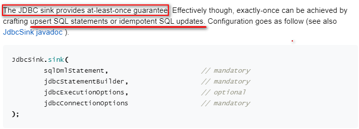

> - 3）、官方提供案例代码

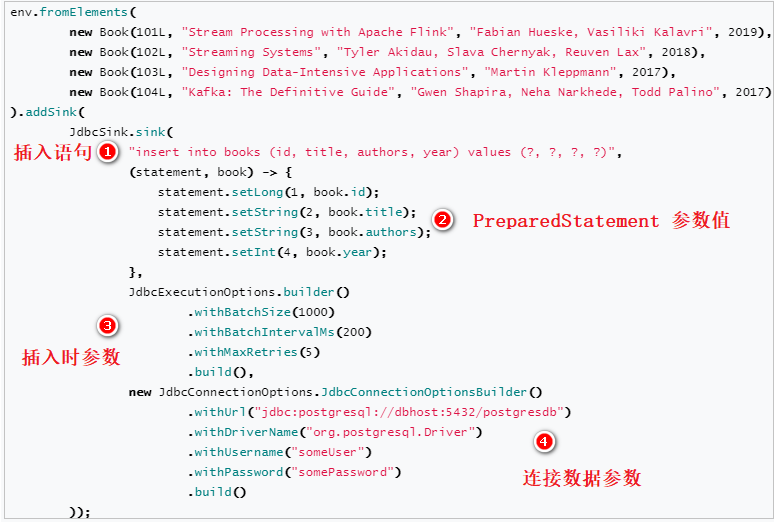

> 需求：==将Flink集合中的数据集DataStream，通过JDBCSink保存到MySQL。==

```JAva
package cn.itcast.flink.connector;

import lombok.AllArgsConstructor;
import lombok.Data;
import lombok.NoArgsConstructor;
import org.apache.flink.connector.jdbc.JdbcConnectionOptions;
import org.apache.flink.connector.jdbc.JdbcExecutionOptions;
import org.apache.flink.connector.jdbc.JdbcSink;
import org.apache.flink.connector.jdbc.JdbcStatementBuilder;
import org.apache.flink.streaming.api.datastream.DataStreamSource;
import org.apache.flink.streaming.api.environment.StreamExecutionEnvironment;
import org.apache.flink.streaming.api.functions.sink.SinkFunction;

import java.sql.PreparedStatement;
import java.sql.SQLException;

/**
 * 案例演示：使用JDBC Sink 连接器，将数据保存至MySQL表中，继承RichSinkFunction
 */
public class _09StreamJdbcSinkDemo {

	@Data
	@NoArgsConstructor
	@AllArgsConstructor
	private static class Student{
		private Integer id ;
		private String name ;
		private Integer age ;
	}

	public static void main(String[] args) throws Exception {
		// 1. 执行环境-env
		StreamExecutionEnvironment env = StreamExecutionEnvironment.getExecutionEnvironment();
		env.setParallelism(1) ;

		// 2. 数据源-source
		DataStreamSource<Student> inputDataStream = env.fromElements(
			new Student(23, "zhaoqi", 40),
			new Student(34, "zhaoliu", 19),
			new Student(35, "wangwu", 20),
			new Student(36, "zhaoliu", 19)
		);

		// 3. 数据转换-transformation
		// 4. 数据终端-sink
		// 4-1. 创建JdbcSink实例对象，传递参数信息
		SinkFunction<Student> jdbcSink = JdbcSink.sink(
			// a. 插入语句
			"REPLACE INTO db_flink.t_student (id, name, age) VALUES (?, ?, ?)", //
			// b. 构建Statement实例对象
			new JdbcStatementBuilder<Student>() {
				@Override
				public void accept(PreparedStatement pstmt, Student student) throws SQLException {
					pstmt.setInt(1, student.id);
					pstmt.setString(2, student.name);
					pstmt.setInt(3, student.age);
				}
			},
			// c. 设置执行插入参数
			JdbcExecutionOptions.builder()
				.withBatchSize(1000)
				.withBatchIntervalMs(200)
				.withMaxRetries(5)
				.build(),
			// d. 设置连接MySQL数据库信息
			new JdbcConnectionOptions.JdbcConnectionOptionsBuilder()
				.withDriverName("com.mysql.jdbc.Driver")
				.withUrl("jdbc:mysql://node1.itcast.cn:3306/?useUnicode=true&characterEncoding=utf-8&useSSL=false")
				.withUsername("root")
				.withPassword("123456")
				.build()
		);
		// 4-2. 为数据流DataStream添加Sink
		inputDataStream.addSink(jdbcSink) ;

		// 5. 触发执行-execute
		env.execute("StreamJdbcSinkDemo") ;
	}
}
```

### 8. Streaming File Sink

> 大数据业务场景中，经常有一种场景：[外部数据发送到kafka中，Flink作为中间件消费Kafka数据并进行业务处理，处理完成之后的数据可能还需要写入到数据库或者文件系统中，如写入HDFS中]()。

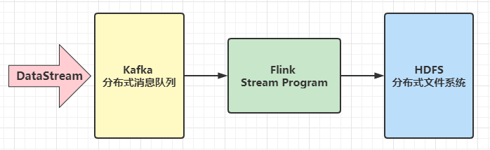

`StreamingFileSink`是**Flink1.7**中推出的新特性，可以用来**将分区文件写入到支持 Flink FileSystem 接口的文件系统**中，==支持Exactly-Once语义==。

https://nightlies.apache.org/flink/flink-docs-release-1.13/docs/connectors/datastream/streamfile_sink/

> Streaming File Sink 会将数据写入到桶Bucket（认可Hive中分区目录）中，可以设置存储目录名称、文件大小和文件名称。

- 由于输入流可能是无界的，因此每个桶中的数据被划分为多个有限大小的文件。
- 如何分桶是可以配置的，默认使用基于时间的分桶策略，这种策略每个小时创建一个新的桶，桶中包含的文件将记录所有该小时内从流中接收到的数据。

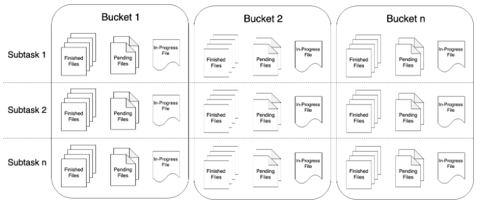

桶目录中的实际输出数据会被划分为多个部分文件（part file），每一个接收桶数据的 Sink Subtask ，至少包含一个部分文件（part file）。

- 额外的部分文件（part file）将根据滚动策略创建，滚动策略是可以配置的。
- 默认的策略是根据文件大小和超时时间来滚动文件。
- 超时时间指打开文件的最长持续时间，以及文件关闭前的最长非活动时间。


[使用 StreamingFileSink 时需要启用 Checkpoint ，每次做 Checkpoint 时写入完成。如果 Checkpoint 被禁用，部分文件（part file）将永远处于 'in-progress' 或 'pending' 状态，下游系统无法安全地读取。]()

> 案例演示：==编写Flink程序，自定义数据源产生交易订单数据，接收后的数据流式方式存储到本地文件系统==

```ini
# 1. 执行环境-env
	1-1.设置并行度为：3
	1-2.设置Checkpoint检查点，如果不设置，数据不会写入文件
	
# 2. 数据源-source
	自定义数据源，产生交易订单数据
	数据格式：e7057860-e88,u-14395,94.24,1630142114565
	
# 4. 数据接收器-sink
	4-1. 设置数据存储文件格式
	4-2. 设置输出文件大小滚动策略，什么时候产生新文件
	4-3. 设置文件的名称
	4-4. 添加Sink，设置并行度为：1
	
# 5.触发执行-execute
```

> 具体代码如下所示：

```Java
package cn.itcast.flink.connector;

import org.apache.commons.lang3.time.FastDateFormat;
import org.apache.flink.api.common.serialization.SimpleStringEncoder;
import org.apache.flink.core.fs.Path;
import org.apache.flink.streaming.api.datastream.DataStreamSource;
import org.apache.flink.streaming.api.environment.StreamExecutionEnvironment;
import org.apache.flink.streaming.api.functions.sink.filesystem.OutputFileConfig;
import org.apache.flink.streaming.api.functions.sink.filesystem.StreamingFileSink;
import org.apache.flink.streaming.api.functions.sink.filesystem.bucketassigners.DateTimeBucketAssigner;
import org.apache.flink.streaming.api.functions.sink.filesystem.rollingpolicies.DefaultRollingPolicy;
import org.apache.flink.streaming.api.functions.source.ParallelSourceFunction;

import java.math.BigDecimal;
import java.math.RoundingMode;
import java.util.Random;
import java.util.concurrent.TimeUnit;

/**
 * Flink Stream 流计算，将DataStream 保存至文件系统，使用FileSystem Connector
 */
public class _10StreamFileSinkDemo {

	public static void main(String[] args) throws Exception {
		// 1. 执行环境-env
		StreamExecutionEnvironment env = StreamExecutionEnvironment.getExecutionEnvironment();
		env.setParallelism(3);
		// TODO: 设置检查点
		env.enableCheckpointing(1000) ;

		// 2. 数据源-source
		DataStreamSource<String> orderDataStream = env.addSource(new OrderSource());
		//orderDataStream.print();

		// 3. 数据转换-transformation
		// 4. 数据终端-sink
		StreamingFileSink<String> fileSink = StreamingFileSink
			// 4-1. 设置存储文件格式，Row行存储
			.forRowFormat(
				new Path("datas/file-sink"), new SimpleStringEncoder<String>()
			)
			// 4-2. 设置桶分配政策,默认基于时间的分配器，每小时产生一个桶，格式如下yyyy-MM-dd--HH
			.withBucketAssigner(new DateTimeBucketAssigner<>())
			// 4-3. 设置数据文件滚动策略
			.withRollingPolicy(
				DefaultRollingPolicy.builder()
					.withRolloverInterval(TimeUnit.SECONDS.toMillis(5))
					.withInactivityInterval(TimeUnit.SECONDS.toMillis(10))
					.withMaxPartSize(2 * 1024 * 1024)
					.build()
			)
			// 4-4. 设置文件名称
			.withOutputFileConfig(
				OutputFileConfig.builder()
					.withPartPrefix("itcast")
					.withPartSuffix(".log")
					.build()
			)
			.build();
		// 4-4. 数据流DataStream添加Sink
		orderDataStream.addSink(fileSink).setParallelism(1);

		// 5. 触发执行
		env.execute("StreamFileSinkDemo");
	}

	/**
	 * 自定义数据源，实时产生交易订单数据
	 */
	private static class OrderSource implements ParallelSourceFunction<String> {
		private boolean isRunning = true ;
		private FastDateFormat format = FastDateFormat.getInstance("yyyyMMddHHmmssSSS");
		@Override
		public void run(SourceContext<String> ctx) throws Exception {
			Random random = new Random();
			while (isRunning){
				// 交易订单
				long timeMillis = System.currentTimeMillis();
				String orderId = format.format(timeMillis) + (10000 + random.nextInt(10000))  ;
				String userId = "u_" + (10000 + random.nextInt(10000)) ;
				double orderMoney = new BigDecimal(random.nextDouble() * 100).setScale(2, RoundingMode.HALF_UP).doubleValue() ;
				String output = orderId + "," + userId + "," + orderMoney + "," + timeMillis ;
				System.out.println(output);
				// 输出
				ctx.collect(output);
				TimeUnit.MILLISECONDS.sleep(100);
			}
		}

		@Override
		public void cancel() {
			isRunning = false ;
		}
	}
}
```

### 9. FileSink

> **Flink 1.12** 中，提供流批统一的 `FileSink connector`，以替换现有的 `StreamingFileSink connector` （FLINK-19758），允许为 **BATCH 和 STREAMING** 两种执行模式，实现不同的运行时策略，以达到仅使用一种 sink 实现。

https://nightlies.apache.org/flink/flink-docs-release-1.13/docs/connectors/datastream/file_sink/

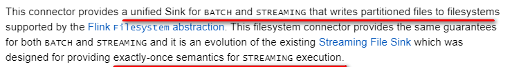

> - 1）、添加Maven依赖

```xml
<dependency>
    <groupId>org.apache.flink</groupId>
    <artifactId>flink-connector-files</artifactId>
    <version>1.13.1</version>
</dependency>
```

> - 2）、API使用：`FileSink`

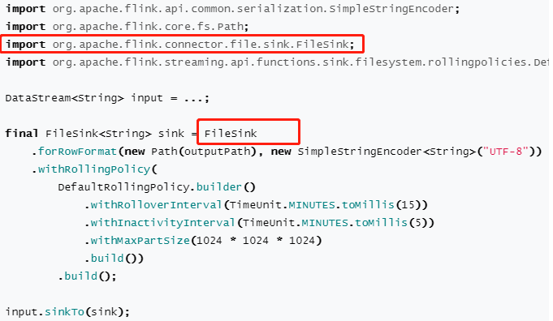

> - 3）、案例演示：自定义数据源产生交易订单数据，写入本地文件系统文件中

```Java
package cn.itcast.flink.connector;

import org.apache.commons.lang3.time.FastDateFormat;
import org.apache.flink.api.common.serialization.SimpleStringEncoder;
import org.apache.flink.connector.file.sink.FileSink;
import org.apache.flink.core.fs.Path;
import org.apache.flink.streaming.api.datastream.DataStreamSource;
import org.apache.flink.streaming.api.environment.StreamExecutionEnvironment;
import org.apache.flink.streaming.api.functions.sink.filesystem.OutputFileConfig;
import org.apache.flink.streaming.api.functions.sink.filesystem.bucketassigners.DateTimeBucketAssigner;
import org.apache.flink.streaming.api.functions.sink.filesystem.rollingpolicies.DefaultRollingPolicy;
import org.apache.flink.streaming.api.functions.source.ParallelSourceFunction;

import java.math.BigDecimal;
import java.math.RoundingMode;
import java.util.Random;
import java.util.concurrent.TimeUnit;

/**
 * Flink Stream 流计算，将DataStream 保存至文件系统，使用FileSystem Connector
 */
public class _11StreamBatchFileSinkDemo {

	public static void main(String[] args) throws Exception {
		// 1. 执行环境-env
		StreamExecutionEnvironment env = StreamExecutionEnvironment.getExecutionEnvironment();
		env.setParallelism(3);
		// TODO: 设置检查点
		env.enableCheckpointing(1000) ;

		// 2. 数据源-source
		DataStreamSource<String> orderDataStream = env.addSource(new OrderSource());
		//orderDataStream.print();

		// 3. 数据转换-transformation
		// 4. 数据终端-sink
		FileSink<String> fileSink = FileSink
			// 4-1. 设置存储文件格式，Row行存储
			.forRowFormat(
				new Path("datas/file-sink"), new SimpleStringEncoder<String>("UTF-8")
			)
			// 4-2. 设置桶分配政策,默认基于时间的分配器，每小时产生一个桶，格式如下yyyy-MM-dd--HH
			.withBucketAssigner(new DateTimeBucketAssigner<>())
			// 4-3. 设置数据文件滚动策略
			.withRollingPolicy(
				DefaultRollingPolicy.builder()
					.withRolloverInterval(TimeUnit.SECONDS.toMillis(5))
					.withInactivityInterval(TimeUnit.SECONDS.toMillis(10))
					.withMaxPartSize(2 * 1024 * 1024)
					.build()
			)
			// 4-4. 设置文件名称
			.withOutputFileConfig(
				OutputFileConfig.builder()
					.withPartPrefix("itcast")
					.withPartSuffix(".log")
					.build()
			)
			.build();
		// 4-4. 数据流DataStream添加Sink
		orderDataStream.sinkTo(fileSink).setParallelism(1) ;

		// 5. 触发执行
		env.execute("StreamFileSinkDemo");
	}

	/**
	 * 自定义数据源，实时产生交易订单数据
	 */
	private static class OrderSource implements ParallelSourceFunction<String> {
		private boolean isRunning = true ;
		private FastDateFormat format = FastDateFormat.getInstance("yyyyMMddHHmmssSSS");
		@Override
		public void run(SourceContext<String> ctx) throws Exception {
			Random random = new Random();
			while (isRunning){
				// 交易订单
				long timeMillis = System.currentTimeMillis();
				String orderId = format.format(timeMillis) + (10000 + random.nextInt(10000))  ;
				String userId = "u_" + (10000 + random.nextInt(10000)) ;
				double orderMoney = new BigDecimal(random.nextDouble() * 100).setScale(2, RoundingMode.HALF_UP).doubleValue() ;
				String output = orderId + "," + userId + "," + orderMoney + "," + timeMillis ;
				System.out.println(output);
				// 输出
				ctx.collect(output);
				TimeUnit.MILLISECONDS.sleep(100);
			}
		}

		@Override
		public void cancel() {
			isRunning = false ;
		}
	}
}
```

### 10. RedisSink

> Flink中提供`Connector：RedisSink`，将DataStream可以保存到Redis数据库中。

https://bahir.apache.org/docs/flink/current/flink-streaming-redis/

> - 1）、添加Maven 依赖

```xml
<dependency>
  <groupId>org.apache.bahir</groupId>
  <artifactId>flink-connector-redis_2.11</artifactId>
  <version>1.0</version>
</dependency>
```

> - 2）、核心类：`RedisSink`，创建对象，传递`RedisMapper`实例

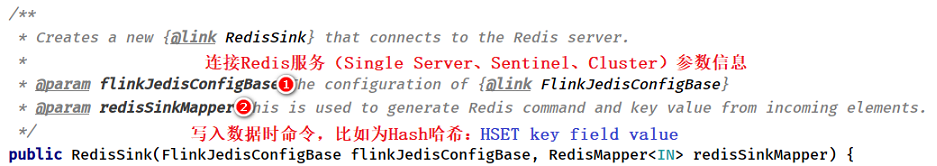

> - 3）、`RedisMapper`映射接口方法：

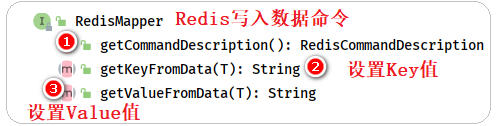

> - 4）、官方实例代码：

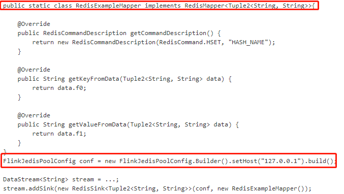

> 案例演示：==将Flink集合中的数据通过RedisSink进行保存==

```java
package cn.itcast.flink.connector;

import org.apache.flink.api.common.functions.FlatMapFunction;
import org.apache.flink.api.java.tuple.Tuple2;
import org.apache.flink.streaming.api.datastream.DataStreamSource;
import org.apache.flink.streaming.api.datastream.SingleOutputStreamOperator;
import org.apache.flink.streaming.api.environment.StreamExecutionEnvironment;
import org.apache.flink.streaming.connectors.redis.RedisSink;
import org.apache.flink.streaming.connectors.redis.common.config.FlinkJedisPoolConfig;
import org.apache.flink.streaming.connectors.redis.common.mapper.RedisCommand;
import org.apache.flink.streaming.connectors.redis.common.mapper.RedisCommandDescription;
import org.apache.flink.streaming.connectors.redis.common.mapper.RedisMapper;
import org.apache.flink.util.Collector;

/**
 * 案例演示：将数据保存至Redis中，直接使用官方提供Connector
 *      https://bahir.apache.org/docs/flink/current/flink-streaming-redis/
 */
public class _12StreamRedisSinkDemo {

	public static void main(String[] args) throws Exception {
		// 1. 执行环境-env
		StreamExecutionEnvironment env = StreamExecutionEnvironment.getExecutionEnvironment();
		env.setParallelism(1) ;

		// 2. 数据源-source
		DataStreamSource<String> inputDataStream = env.socketTextStream("node1.itcast.cn", 9999);

		// 3. 数据转换-transformation
		SingleOutputStreamOperator<Tuple2<String, Integer>> resultDataStream = inputDataStream
			// a. 过滤数据
			.filter(line -> null != line && line.trim().length() > 0)
			// b. 分割单词
			.flatMap(new FlatMapFunction<String, Tuple2<String, Integer>>() {
				@Override
				public void flatMap(String line, Collector<Tuple2<String, Integer>> out) throws Exception {
					String[] words = line.trim().split("\\W+");
					for (String word : words) {
						out.collect(Tuple2.of(word, 1));
					}
				}
			})
			// c. 按照单词分组及对组内聚合操作
			.keyBy(tuple -> tuple.f0).sum("f1");
		//resultDataStream.printToErr();

		// 4. 数据终端-sink
		/*
			spark -> 15
			flink -> 20
			hive -> 10
			--------------------------------------------
			Redis 数据结构：哈希Hash
				Key:
					flink:word:count
				Value: 哈希
					field  value
					spark  15
					flink  20
					hive   10
			命令：
				HSET flink:word:count spark 15
		 */
		// 4-1. 构建Redis Server配置
		FlinkJedisPoolConfig config = new FlinkJedisPoolConfig.Builder()
			.setHost("node1.itcast.cn")
			.setPort(6379)
			.setDatabase(0)
			.setMinIdle(3)
			.setMaxIdle(8)
			.setMaxTotal(8)
			.build();
		// 4-2. 构建RedisMapper实例
		RedisMapper<Tuple2<String, Integer>> redisMapper = new RedisMapper<Tuple2<String, Integer>>() {
			// HSET flink:word:count spark 15 -> 拆分到如下三个方法中
			@Override
			public RedisCommandDescription getCommandDescription() {
				return new RedisCommandDescription(RedisCommand.HSET, "flink:word:count");
			}

			@Override
			public String getKeyFromData(Tuple2<String, Integer> data) {
				return data.f0;
			}

			@Override
			public String getValueFromData(Tuple2<String, Integer> data) {
				return data.f1 + "";
			}
		};
		// 4-3. 创建RedisSink对象
		RedisSink<Tuple2<String, Integer>> redisSink = new RedisSink<Tuple2<String, Integer>>(
			config, redisMapper
		);
		// 4-4. 添加Sink
		resultDataStream.addSink(redisSink) ;

		// 5. 触发执行-execute
		env.execute("StreamRedisSinkDemo") ;
	}

}
```

## III. 批处理高级特性

### 1. Accamulator

Flink中的==累加器Accumulator== ，与Mapreduce counter的应用场景类似，可以很好地**观察task在运行期间的数据变化**，如在Flink job任务中的**算子函数**中操作累加器，在任务执行结束之后才能获得累加器的最终结果。

> Flink有以下内置累加器，每个累加器都实现了`Accumulator`接口：


> 使用累加器进行累加统计操作时，步骤如下：

```ini
1.创建累加器
	private IntCounter numLines = new IntCounter();
2.注册累加器
	getRuntimeContext().addAccumulator("num-lines", this.numLines);
3.使用累加器
	this.numLines.add(1);
4.获取累加器的结果
	myJobExecutionResult.getAccumulatorResult("num-lines")
```

> **编写程序**：对数据源读取的数据进行计数Counter，最终输出所出来的数据条目数。

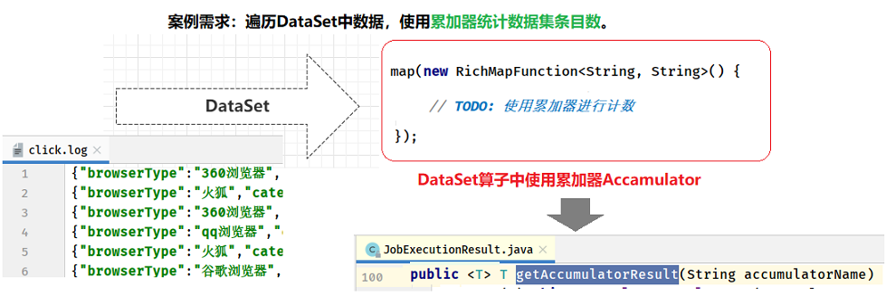

```Java
package cn.itcast.flink.other;

import org.apache.flink.api.common.JobExecutionResult;
import org.apache.flink.api.common.accumulators.IntCounter;
import org.apache.flink.api.common.functions.RichMapFunction;
import org.apache.flink.api.java.ExecutionEnvironment;
import org.apache.flink.api.java.operators.DataSource;
import org.apache.flink.api.java.operators.MapOperator;
import org.apache.flink.configuration.Configuration;

/**
 * 演示Flink中累加器Accumulator使用，统计处理的条目数
 */
public class _13BatchAccumulatorDemo {

	public static void main(String[] args) throws Exception {
		// 1. 执行环境-env
		ExecutionEnvironment env = ExecutionEnvironment.getExecutionEnvironment();
		env.setParallelism(1);

		// 2. 数据源-source
		DataSource<String> dataset = env.readTextFile("datas/click.log");

		/*
			累加器应用到转换函数中定义和使用的，当Job执行完成以后，可以获取值，必须使用Rich富函数
		 */
		// 3. 数据转换-transformation
		// TODO: 此处，使用map函数，不做任何处理，仅仅为了使用累加器
		MapOperator<String, String> mapDataSet = dataset.map(new RichMapFunction<String, String>() {
			// TODO：step1、定义累加器
			private IntCounter counter = new IntCounter() ;

			@Override
			public void open(Configuration parameters) throws Exception {
				// TODO: step2、注册累加器
				getRuntimeContext().addAccumulator("counter", counter);
			}

			@Override
			public String map(String value) throws Exception {
				// TODO: step3、使用累加器进行计数
				counter.add(1);

				return value;
			}
		});

		// 4. 数据终端-sink
		mapDataSet.writeAsText("datas/click.txt").setParallelism(1);

		// 5. 触发执行-execute
		JobExecutionResult jobResult = env.execute("BatchAccumulatorDemo");

		// TODO: step4. 获取累加器的值
		Object counter = jobResult.getAccumulatorResult("counter");
		System.out.println("Counter = " + counter);
	}

}
```


## 附I.  Maven模块创建


## 附II. Redis Hash数据类型