# Flink流批一体&API开发

## -I. ExecutionEnvironment创建方式

> 在Flink 流计算程序中，程序入口：流式执行环境`StreamExecutionEnvironment`，有三种创建方式。

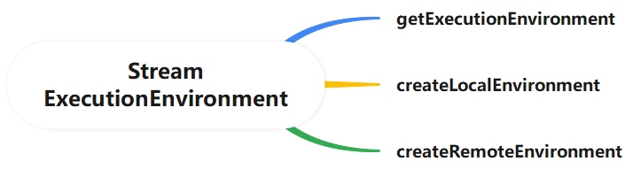

- 第1种：`getExecutionEnvironment`方法，**自动依据当前环境，获取执行环境**

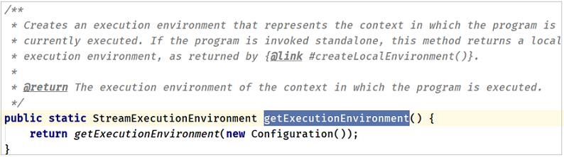

- 第2种：`createLocalEnvironment` 方法，获取本地执行环境，启动1个JVM，运行多个线程

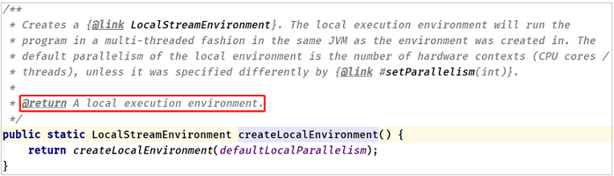

> 无论是`getExecutionEnvironment`还是`createLocalEnvironment`方法在本地模式运行时，创建执行环境，随机生成Web UI界面端口号，可以使用方法：`createLocalEnvironmentWithWebUI`，指定某个端口号，默认为`8081`。

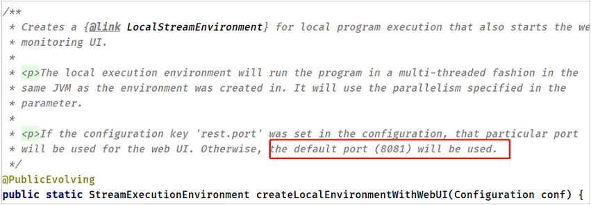

```java
StreamExecutionEnvironment env = StreamExecutionEnvironment.createLocalEnvironmentWithWebUI(new Configuration());
env.setParallelism(2);
```

运行Flink 流计算程序，打开监控页面：

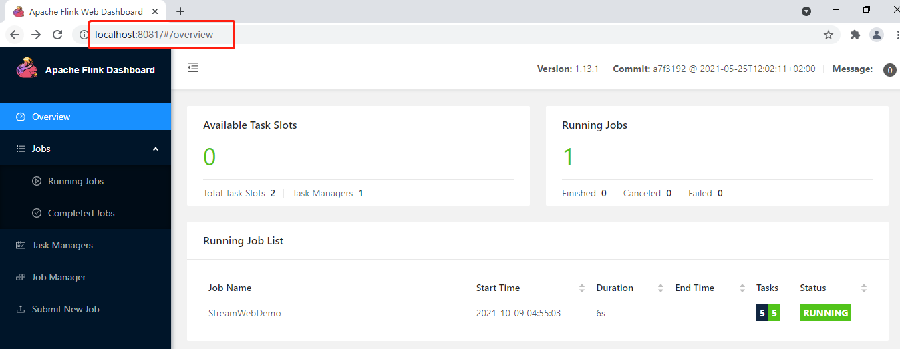

- 第三种：`createRemoteEnvironment` 方法，指定**JobManager**地址，获取远程执行环境，提交应用到集群

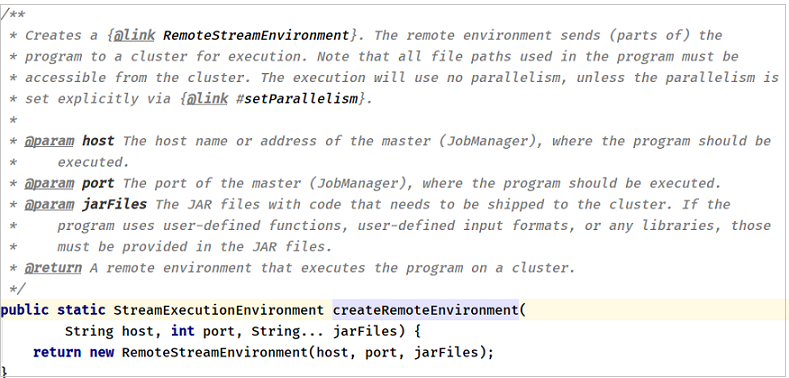

> 案例代码演示，针对词频统计WordCount修改，不同方式创建流式执行环境：

```Java
package cn.itcast.flink.start;

import org.apache.flink.api.common.functions.FlatMapFunction;
import org.apache.flink.api.java.tuple.Tuple2;
import org.apache.flink.configuration.Configuration;
import org.apache.flink.streaming.api.datastream.DataStreamSource;
import org.apache.flink.streaming.api.datastream.SingleOutputStreamOperator;
import org.apache.flink.streaming.api.environment.StreamExecutionEnvironment;
import org.apache.flink.util.Collector;

public class WordCountDemo {

	public static void main(String[] args) throws Exception{
		// 1. 执行环境-env
		// TODO: 此种方式，依据运行环境，自动确定创建本地环境还是集群环境
		// StreamExecutionEnvironment env = StreamExecutionEnvironment.getExecutionEnvironment();

		// TODO: 创建本地执行环境，启动一个JVM进程，其中Task任务（SubTask子任务）
		// StreamExecutionEnvironment env = StreamExecutionEnvironment.createLocalEnvironment();

		// TODO: 创建本地执行环境，启动WEB UI界面，默认端口号：8081
		StreamExecutionEnvironment env = StreamExecutionEnvironment.createLocalEnvironmentWithWebUI(new Configuration());
		env.setParallelism(1);

		// 2. 数据源-source
		DataStreamSource<String> inputStream = env.socketTextStream("node1.itcast.cn", 9999);

		// 3. 数据转换-transformation
		SingleOutputStreamOperator<Tuple2<String, Integer>> resultStream = inputStream
			.filter(line -> null != line && line.trim().length() > 0)
			.flatMap(new FlatMapFunction<String, Tuple2<String, Integer>>() {
				@Override
				public void flatMap(String value, Collector<Tuple2<String, Integer>> out) throws Exception {
					String[] words = value.trim().split("\\s+");
					for (String word : words) {
						out.collect(Tuple2.of(word, 1));
					}
				}
			})
			.keyBy(tuple -> tuple.f0)
			.sum("f1");

		// 4. 数据接收器-sink
		resultStream.printToErr();

		// 5. 触发执行-execute
		env.execute("Flink Stream WordCount");
	}

}
```

## I. DataStream Operators

### 1. Physical Partitioning

> 在Flink流计算中DataStream提供一些列分区函数

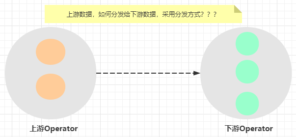

> 在DataStream函数中提供7种方式，具体如下所示：

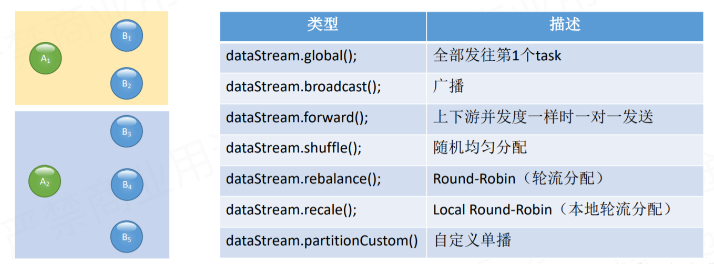

- 第一、GlobalPartitioner

> 分区器功能：会**将所有的数据都发送到下游的某个算子实例**(subtask id = 0)。

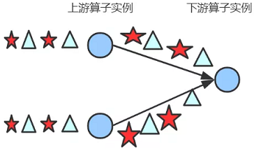

- 第二、BroadcastPartitioner

> 分区器功能：发送到下游**所有**的算子实例。

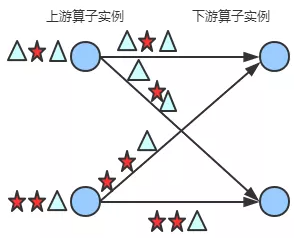

- 第三、ForwardPartitioner

> 分区器功能：发送到下游对应的第1个task，保证上下游算子并行度一致，即**上游算子与下游算子是1:1关系**。

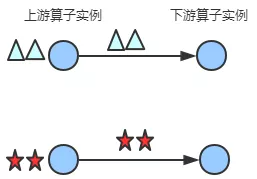

[在上下游的算子没有指定分区器的情况下，如果上下游的算子并行度一致，则使用ForwardPartitioner，否则使用RebalancePartitioner，对于ForwardPartitioner，必须保证上下游算子并行度一致，否则会抛出异常]()

- 第四、ShufflePartitioner

> 分区器功能：**随机选择**一个下游算子实例进行发送

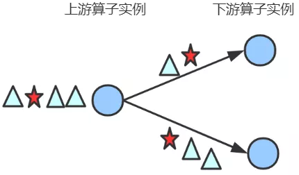

- 第五、RebalancePartitioner

> 分区器功能：通过**循环**的方式依次发送到下游的task。

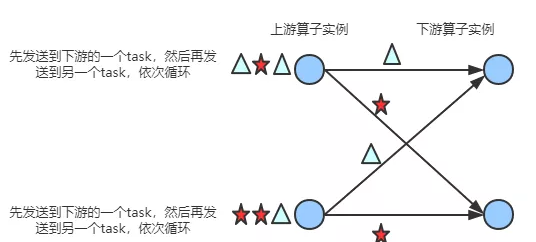

> [在Flink批处理中（离线数据分析中），如果数据倾斜，直接调用`rebalance`函数，将数据均衡分配。]()

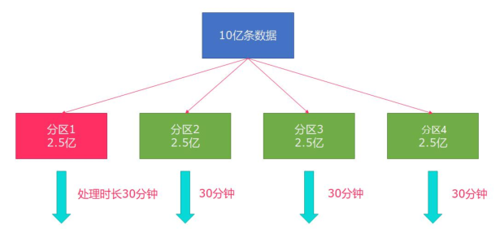

- 第六、RescalePartitioner

> 分区器功能：基于上下游Operator并行度，将记录以循环的方式输出到下游Operator每个实例。


> 案例代码演示：DataStream中各种数据分区函数使用

```java
package cn.itcast.flink.transformation;

import org.apache.flink.api.common.functions.Partitioner;
import org.apache.flink.api.java.tuple.Tuple2;
import org.apache.flink.configuration.Configuration;
import org.apache.flink.streaming.api.datastream.DataStream;
import org.apache.flink.streaming.api.datastream.DataStreamSource;
import org.apache.flink.streaming.api.environment.StreamExecutionEnvironment;
import org.apache.flink.streaming.api.functions.source.RichParallelSourceFunction;

import java.util.Random;
import java.util.concurrent.TimeUnit;

/**
 * Flink 流计算中转换函数：对流数据进行分区，函数如下：
 *      global、broadcast、forward、shuffle、rebalance、rescale、partitionCustom
 */
public class _13StreamPartitionDemo {

	public static void main(String[] args) throws Exception {
		// 1. 执行环境-env
		StreamExecutionEnvironment env = StreamExecutionEnvironment.createLocalEnvironmentWithWebUI(new Configuration());
		env.setParallelism(1);

		// 2. 数据源-source
		DataStreamSource<Tuple2<Integer, String>> dataStream = env.addSource(
			new RichParallelSourceFunction<Tuple2<Integer, String>>() {
				private boolean isRunning = true ;

				@Override
				public void run(SourceContext<Tuple2<Integer, String>> ctx) throws Exception {
					int index = 1 ;
					Random random = new Random();
					String[] chars = new String[]{
						"A", "B", "C", "D", "E", "F", "G", "H", "I", "J", "K", "L", "M", "N", "O",
						"P", "Q", "R", "S", "T", "U", "V", "W", "X", "Y", "Z"
					};
					while (isRunning){
						Tuple2<Integer, String> tuple = Tuple2.of(index, chars[random.nextInt(chars.length)]);
						ctx.collect(tuple);

						TimeUnit.SECONDS.sleep(2);
						index ++ ;
					}
				}

				@Override
				public void cancel() {
					isRunning = false ;
				}
			}
		);
		//dataStream.printToErr();

		// 3. 数据转换-transformation
		// TODO: 1、global函数，将所有数据发往1个分区Partition
		DataStream<Tuple2<Integer, String>> globalDataStream = dataStream.global();
		//globalDataStream.print().setParallelism(3);

		// TODO: 2、broadcast函数， 广播数据
		DataStream<Tuple2<Integer, String>> broadcastDataStream = dataStream.broadcast();
		//broadcastDataStream.printToErr().setParallelism(3);

		// TODO: 3、forward函数，上下游并发一样时 一对一发送
		//DataStream<Tuple2<Integer, String>> forwardDataStream = dataStream.setParallelism(3).forward();
		//forwardDataStream.print().setParallelism(3) ;

		// TODO: 4、shuffle函数，随机均匀分配
		DataStream<Tuple2<Integer, String>> shuffleDataStream = dataStream.shuffle();
		//shuffleDataStream.printToErr().setParallelism(3);

		// TODO: 5、rebalance函数，轮流分配
		DataStream<Tuple2<Integer, String>> rebalanceDataStream = dataStream.rebalance();
		//rebalanceDataStream.print().setParallelism(3) ;

		// TODO: 6、rescale函数，本地轮流分配
//		DataStream<Tuple2<Integer, String>> rescaleDataStream = dataStream.setParallelism(4).rescale();
//		rescaleDataStream.printToErr().setParallelism(2);

		// TODO: 7、partitionCustom函数，自定义分区规则
		DataStream<Tuple2<Integer, String>> customDataStream = dataStream.partitionCustom(
			new Partitioner<Integer>() {
				@Override
				public int partition(Integer key, int numPartitions) {
					return key % 2;
				}
			},
			tuple -> tuple.f0
		);
		customDataStream.printToErr().setParallelism(2);

		// 4. 数据终端-sink

		// 5. 触发执行-execute
		env.execute("StreamRepartitionDemo");
	}
}
```

### 2. RichFunction

> “==富函数==”是DataStream API提供的一个函数类的接口，==所有Flink函数类都有其Rich版本==。它与常规函数的不同在于，可以**获取运行环境的上下文，并拥有一些生命周期方法**，所以可以实现更复杂的功能。

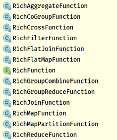

> `RichFunction`有一个生命周期的概念，典型的生命周期方法有：`open`和`close` 方法。

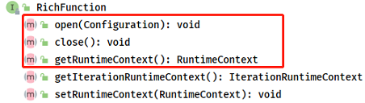

- `open()`方法：
  - rich function的初始化方法，当一个算子例如map或者filter被调用之前open()会被调用。
- `close()`方法：
  - 生命周期中的最后一个调用的方法，做一些清理工作。
- `getRuntimeContext()`方法：
  - 提供了函数的RuntimeContext的一些信息，例如函数执行的并行度，任务的名字，以及state状态。

> **案例代码演示**：从Socket读取数据，将字符串类型值，转换保存2位小数Double数值。

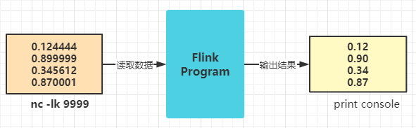

测试数据：

```ini
DataStream<String> inputStream = env.fromElements("0.124444", "0.899999", "0.345612", "0.870001");
```

具体代码如下：

```java
package cn.itcast.flink.transformation;

import org.apache.flink.api.common.functions.MapFunction;
import org.apache.flink.api.common.functions.RichMapFunction;
import org.apache.flink.configuration.Configuration;
import org.apache.flink.streaming.api.datastream.DataStream;
import org.apache.flink.streaming.api.datastream.DataStreamSource;
import org.apache.flink.streaming.api.datastream.SingleOutputStreamOperator;
import org.apache.flink.streaming.api.environment.StreamExecutionEnvironment;

import java.text.DecimalFormat;

public class _02StreamRichDemo {

	public static void main(String[] args) throws Exception{
		// 1. 执行环境-env
		StreamExecutionEnvironment env = StreamExecutionEnvironment.createLocalEnvironmentWithWebUI(new Configuration()) ;
		env.setParallelism(1);

		// 2. 数据源-source
		DataStreamSource<String> inputStream = env.fromElements("0.124444", "0.899999", "0.345612", "0.870001");

		// 3. 数据转换-transformation
		// TODO: 使用map函数处理流中每条数据
		DataStream<String> mapStream = inputStream.map(new MapFunction<String, String>() {
			DecimalFormat format = new DecimalFormat("#0.00");
			@Override
			public String map(String value) throws Exception {
				return format.format(Double.parseDouble(value));
			}
		});
		mapStream.print("map>");

		// TODO: 使用richMap函数，处理流中每条数据
		SingleOutputStreamOperator<String> richStream = inputStream.map(new RichMapFunction<String, String>() {
			DecimalFormat format = null ;

			@Override
			public void open(Configuration parameters) throws Exception {
				System.out.println("invoke：open() ............................");
				format = new DecimalFormat("#0.00");
			}

			@Override
			public String map(String value) throws Exception {
				return format.format(Double.parseDouble(value));
			}

			@Override
			public void close() throws Exception {
				System.out.println("invoke：close() ............................");
			}
		});
		richStream.printToErr("rich>");

		// 4. 数据接收器-sink
		// 5. 触发执行-execute
		env.execute("StreamRichDemo") ;
	}

}
```

执行程序，结果如下截图：

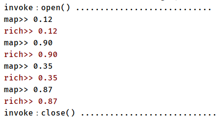

### 3. ProcessFunction

> [Flink DataStream API中最底层API，提供`process`方法，其中需要实现`ProcessFunction`函数]()

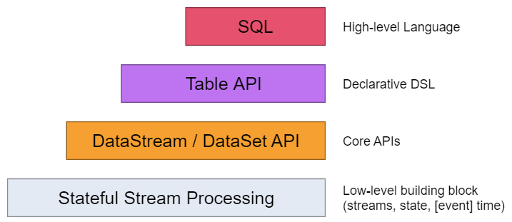

> 查看抽象类：`ProcessFunction`源码，最主要方法：`processElement`，对流中每条数据进行处理。

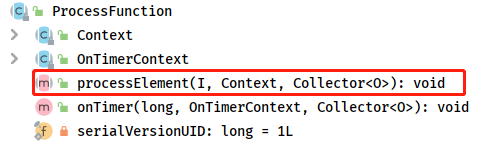

> 案例演示：使用`process`函数，代替filter函数，实现对数据过滤操作。

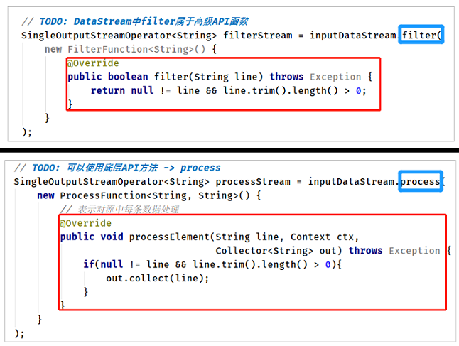

```java
package cn.itcast.flink.transformation;

import org.apache.flink.api.common.functions.FilterFunction;
import org.apache.flink.streaming.api.datastream.DataStreamSource;
import org.apache.flink.streaming.api.datastream.SingleOutputStreamOperator;
import org.apache.flink.streaming.api.environment.StreamExecutionEnvironment;
import org.apache.flink.streaming.api.functions.ProcessFunction;
import org.apache.flink.util.Collector;

/**
 * 使用Flink 计算引擎实现流式数据处理：从Socket接收数据，对数据进行过滤【filter】和【process】
 */
public class _03StreamFilterDemo {

	public static void main(String[] args) throws Exception {
		// 1. 执行环境-env
		StreamExecutionEnvironment env = StreamExecutionEnvironment.getExecutionEnvironment();
		env.setParallelism(1) ;

		// 2. 数据源-source
		DataStreamSource<String> inputStream = env.socketTextStream("node1.itcast.cn", 9999);

		// 3. 数据转换-transformation
		// TODO: DataStream中filter属于高级API函数
		SingleOutputStreamOperator<String> filterStream = inputStream.filter(
			new FilterFunction<String>() {
				@Override
				public boolean filter(String line) throws Exception {
					return null != line && line.trim().length() > 0;
				}
			}
		);
		filterStream.printToErr("filter>");

		// TODO: 可以使用底层API方法 -> process
		SingleOutputStreamOperator<String> processStream = inputStream.process(
			new ProcessFunction<String, String>() {
				@Override
				public void processElement(String line, Context ctx, Collector<String> out) throws Exception {
					if(null != line && line.trim().length() > 0){
						out.collect(line);
					}
				}
			}
		);
		processStream.printToErr("process>");

		// 4. 数据接收器-sink
		// 5. 执行应用-execute
		env.execute("StreamProcessDemo");
	}

}

```

> ​		在词频统计案例中，使用`filter/flatMap/map`三个方法处理DataStream数据，可以直接使用`process`方法完成。

```java
package cn.itcast.flink.transformation;

import org.apache.flink.api.common.functions.FilterFunction;
import org.apache.flink.api.common.functions.FlatMapFunction;
import org.apache.flink.api.common.functions.MapFunction;
import org.apache.flink.api.java.tuple.Tuple2;
import org.apache.flink.streaming.api.datastream.DataStream;
import org.apache.flink.streaming.api.datastream.DataStreamSource;
import org.apache.flink.streaming.api.environment.StreamExecutionEnvironment;
import org.apache.flink.streaming.api.functions.ProcessFunction;
import org.apache.flink.util.Collector;

/**
 * 使用Flink 计算引擎实现流式数据处理：从Socket接收数据，使用process方法数据处理
 */
public class _04StreamProcessDemo {

	public static void main(String[] args) throws Exception {
		// 1. 执行环境-env
		StreamExecutionEnvironment env = StreamExecutionEnvironment.getExecutionEnvironment();
		env.setParallelism(1) ;

		// 2. 数据源-source
		DataStreamSource<String> inputStream = env.socketTextStream("node1.itcast.cn", 9999);

		// 3. 数据转换-transformation
		DataStream<Tuple2<String, Integer>> tupleStream = inputStream
			// 3-1 过滤脏数据
			.filter(new FilterFunction<String>() {
				@Override
				public boolean filter(String line) throws Exception {
					return null != line && line.trim().length() > 0;
				}
			})
			// 3-2 将每行数据按照分隔符分割为单词
			.flatMap(new FlatMapFunction<String, String>() {
				@Override
				public void flatMap(String line, Collector<String> out) throws Exception {
					for (String word : line.trim().split("\\s+")) {
						out.collect(word);
					}
				}
			})
			// 3-3 转换每个单词为二元组，表示单词出现一次
			.map(new MapFunction<String, Tuple2<String, Integer>>() {
				@Override
				public Tuple2<String, Integer> map(String word) throws Exception {
					return Tuple2.of(word, 1);
				}
			});
		tupleStream.printToErr("filter-flatMap-map>");

		// TODO: 可以使用底层API方法 -> process
		DataStream<Tuple2<String, Integer>> processStream = inputStream.process(
			new ProcessFunction<String, Tuple2<String, Integer>>() {
				@Override
				public void processElement(String line, Context ctx, Collector<Tuple2<String, Integer>> out) throws Exception {
					// a. 过滤获取符合条件的数据
					if(null != line && line.trim().length() > 0){
						// b. 分割单词
						String[] words = line.trim().split("\\s+");
						// c. 转换二元组并输出
						for (String word : words) {
							out.collect(Tuple2.of(word, 1));
						}
					}
				}
			}
		);
		processStream.printToErr("process>");

		// 4. 数据终端-sink
		// 5. 执行应用-execute
		env.execute("StreamProcessDemo");
	}

}
```

## II. DataStream Connector

### 1. Kafka Connector

> 在Flink框架中，专门为一些存储系统提供**Connector连接器**，方便用户进行**读取**数据（Data Source 数据源）和**保存**数据(Data Sink数据接收器）。

https://nightlies.apache.org/flink/flink-docs-release-1.13/docs/connectors/datastream/overview/

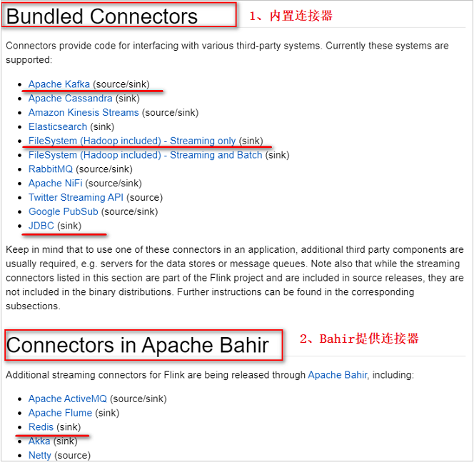

> Kafka Connector连接器，既可以作为==数据源Source==加载数据，又可以作为==数据接收器Sink==保存数据。

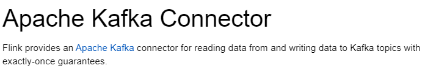

> 使用Kafka Connector连接器，添加Maven 依赖：

```xml
<dependency>
    <groupId>org.apache.flink</groupId>
    <artifactId>flink-connector-kafka_2.11</artifactId>
    <version>1.13.1</version>
</dependency>
```

> 在Kafka Connector连接器中提供Source数据源和Sink接收器类，在**Flink 1.12**版本中提供基于新的类从Kafka消费数据：`KafkaSource`。

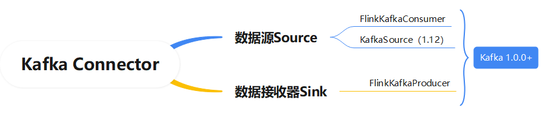


### 2. FlinkKafkaConsumer

> 当从Kafka消费数据时，工具类：`FlinkKafkaConsumer` ，相关说明如下：

https://nightlies.apache.org/flink/flink-docs-release-1.13/docs/connectors/datastream/kafka/#kafka-sourcefunction

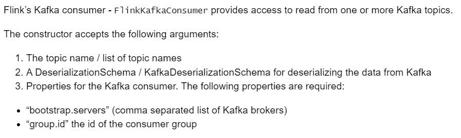

1. 订阅的主题：`topic`，一个Topic名称或一个列表（多个Topic）
2. 反序列化规则：`deserialization`
3. 消费者属性-集群地址：`bootstrap.servers`
4. 消费者属性-消费者组id(如果不设置，会有默认的，但是默认的不方便管理)：`group.id`

> 当从Kafka消费数据时，需要指定反序列化实现类：**将Kafka读取二进制数据，转换为String对象**。

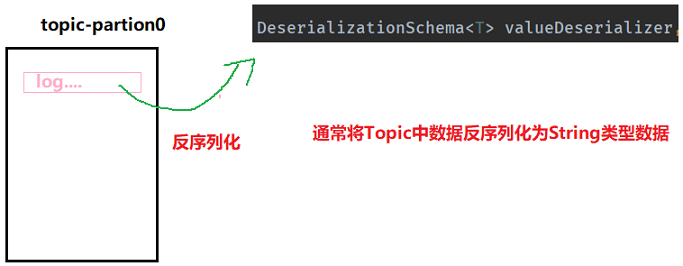

> Kafka Consumer消费数据，反序列化数据说明：

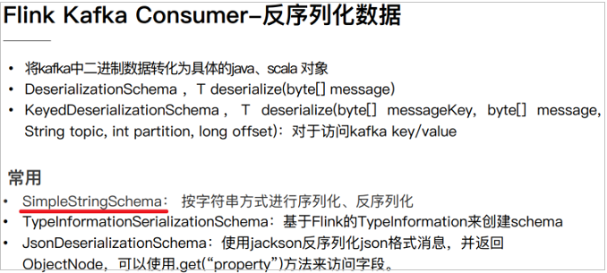

> 启动Zookeeper和Kafka集群，命令如下：

```bash
[root@node1 ~]# zookeeper-daemons.sh start
[root@node1 ~]# kafka-daemons.sh start

[root@node1 ~]# /export/server/kafka/bin/kafka-topics.sh --list --bootstrap-server node1.itcast.cn:9092

[root@node1 ~]# /export/server/kafka/bin/kafka-topics.sh --create --topic flink-topic --bootstrap-server node1.itcast.cn:9092,node2.itcast.cn:9092,node3.itcast.cn:9092 --replication-factor 1 --partitions 3

[root@node1 ~]# /export/server/kafka/bin/kafka-console-producer.sh --topic flink-topic --broker-list node1.itcast.cn:9092,node2.itcast.cn:9092,node3.itcast.cn:9092
```

> 编程实现从Kafka消费数据，演示代码如下：

```Java
package cn.itcast.flink.connector;

import org.apache.flink.api.common.serialization.SimpleStringSchema;
import org.apache.flink.streaming.api.datastream.DataStream;
import org.apache.flink.streaming.api.environment.StreamExecutionEnvironment;
import org.apache.flink.streaming.connectors.kafka.FlinkKafkaConsumer;

import java.util.Properties;

/**
 * Flink从Kafka消费数据，指定topic名称和反序列化类
 */
public class _05StreamFlinkKafkaConsumerDemo {

	public static void main(String[] args) throws Exception{
		// 1. 执行环境-env
		StreamExecutionEnvironment env = StreamExecutionEnvironment.getExecutionEnvironment();
		env.setParallelism(3);

		// 2. 数据源-source
		// 2-1. 创建消费Kafka数据时属性
		Properties props = new Properties();
		props.setProperty("bootstrap.servers", "node1.itcast.cn:9092,node2.itcast.cn:9092,node3.itcast.cn:9092");
		props.setProperty("group.id", "test");
		// 2-2. 构建FlinkKafkaConsumer实例对象
		FlinkKafkaConsumer<String> kafkaConsumer = new FlinkKafkaConsumer<String>(
			"flink-topic", //
			new SimpleStringSchema(), //
			props
		);
		// 2-3. 添加Source
		DataStream<String> kafkaStream = env.addSource(kafkaConsumer);

		// 3. 数据转换-transformation
		// 4. 数据接收器-sink
		kafkaStream.printToErr();

		// 5. 触发执行-execute
		env.execute("StreamFlinkKafkaConsumerDemo") ;
	}

}
```

> 其中最核心的部分就是：创建`FlinkKafkaConsumer`对象，传递参数值

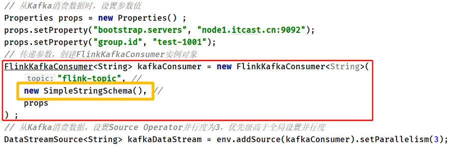

### 3. Start Offset

> 从Kafka 消费数据时，可以设置从Kafka Topic中**哪个偏移量位置**开始消费数据，默认情况下，第一次运行，从Kafka Topic==最大偏移量==开始消费数据。

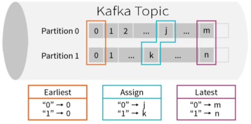

> - 第一、`earliest`：从最起始位置开始消费，当然不一定是从0开始，因为如果数据过期就清掉
>   了，所以可以理解为从现存的数据里最小位置开始消费；
> - 第二、`latest`：从最末位置开始消费；
> - 第三、`per-partition assignment`：对每个分区都指定一个offset，再从offset位置开始消费
>
> [在Kafka Consumer 参数中，有一个参数，可以进行设置，表示从哪里开始消费读取数据。]()

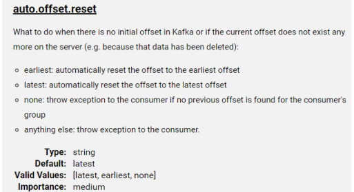

> Flink 提供**KafkaConnector**连接器中提供`5种方式`，指定从哪里开始消费数据。默认情况下，==从Kafka消费数据时，采用的是：`latest`，最新偏移量开始消费数据==。

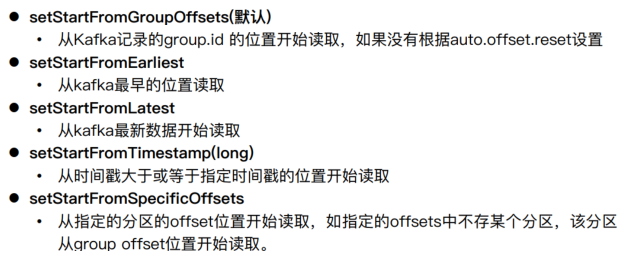

> 1. `setStartFromGroupOffsets`：
>    - 从groupId上次消费数据记录开始消费，将上次消费偏移量存储在topic【`__consumer_offsets`】；
>    - 如果消费组时第一次消费数据，从最大偏移量开始消费。
> 2. `setStartFromEarliest`：从最小偏移量消费数据
> 3. `setStartFromLatest`：从最大偏移量消费数据
> 4. `setStartFromTimestamp`：消费每条数据时间戳大于指定时间戳
> 5. `setStartFromSpecificOffsets`：从指定偏移量开始消费数据，偏移量值大于设置偏移量

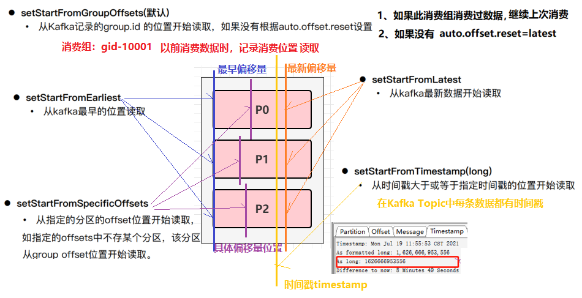

> 在代码中设置消费数据起始位置相关API如下所示：

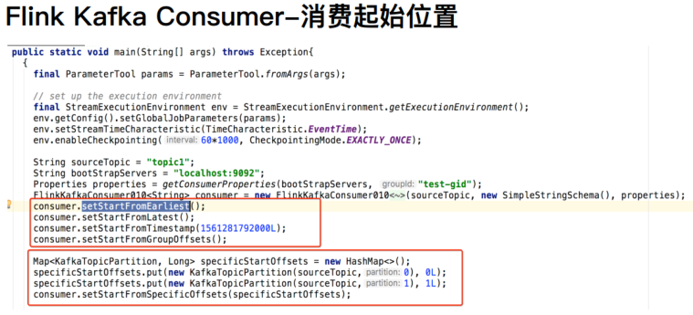

> 案例演示代码如下所示：

```Java
package cn.itcast.flink.connector;

import org.apache.flink.api.common.serialization.SimpleStringSchema;
import org.apache.flink.streaming.api.datastream.DataStreamSource;
import org.apache.flink.streaming.api.environment.StreamExecutionEnvironment;
import org.apache.flink.streaming.connectors.kafka.FlinkKafkaConsumer;
import org.apache.flink.streaming.connectors.kafka.internals.KafkaTopicPartition;

import java.util.HashMap;
import java.util.Map;
import java.util.Properties;

/**
 * Flink从Kafka消费数据，指定topic名称和反序列化类，可以指定消费数据开始偏移量
 */
public class _06StreamFlinkKafkaConsumerOffsetDemo {

	public static void main(String[] args) throws Exception {
		// 1. 执行环境-env
		StreamExecutionEnvironment env = StreamExecutionEnvironment.getExecutionEnvironment() ;
		env.setParallelism(1) ;

		// 2. 数据源-source
		// 从Kafka消费数据时，设置参数值
		Properties props = new Properties() ;
		props.setProperty("bootstrap.servers", "node1.itcast.cn:9092");
		props.setProperty("group.id", "test1");
		// 传递参数，创建FlinkKafkaConsumer实例对象
		FlinkKafkaConsumer<String> kafkaConsumer = new FlinkKafkaConsumer<String>(
			"flink-topic",
			new SimpleStringSchema(),
			props
		) ;
		// TODO: 1、Flink从topic中最初的数据开始消费
		//kafkaConsumer.setStartFromEarliest() ;

		// TODO: 2、Flink从topic中最新的数据开始消费
		//kafkaConsumer.setStartFromLatest();

		// TODO: 3、Flink从topic中指定的group上次消费的位置开始消费，所以必须配置group.id参数
		//kafkaConsumer.setStartFromGroupOffsets() ;

		// TODO: 4、Flink从topic中指定的offset开始，这个比较复杂，需要手动指定offset
		Map<KafkaTopicPartition, Long> offsets = new HashMap<>();
		offsets.put(new KafkaTopicPartition("flink-topic", 0), 100L);
		offsets.put(new KafkaTopicPartition("flink-topic", 1), 90L);
		offsets.put(new KafkaTopicPartition("flink-topic", 2), 110L);
		//kafkaConsumer.setStartFromSpecificOffsets(offsets);

		// TODO: 5、指定时间戳消费数据
		kafkaConsumer.setStartFromTimestamp(1644935966961L) ;

		// 从Kafka消费数据
		DataStreamSource<String> kafkaDataStream = env.addSource(kafkaConsumer);

		// 3. 数据转换-transformation
		// 4. 数据终端-sink
		kafkaDataStream.printToErr();

		// 5. 触发执行-execute
		env.execute("StreamFlinkKafkaConsumerOffsetDemo") ;
	}

}
```

> [上面所设置消费偏移量位置，表示不考虑流式程序从Checkpoint检查点或保存点SavePoint恢复。]()


### 4. 新增Topic和分区发现

> 有一个 Flink Job需要将五份数据聚合到一起，五份数据对应**5个 kafka topic**，随着业务增长，**新增一类数据，同时新增1个 Kafka topic**，如何在==不重启作业==的情况下作业自动感知新的 topic。
>
> [新增TOPIC数据，如何Flink Job感知？]()

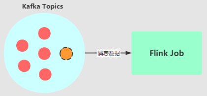

https://nightlies.apache.org/flink/flink-docs-release-1.13/docs/connectors/datastream/kafka/#topic-partition-subscription

> Flink Kafka Source数据源，提供对应机制：`topic 发现`。

- 对于新增Topic来说，可以设置消费Topic名称时，采用`正则表达式`即可；
- topic名称设置：`java.util.regex.Pattern.compile("test-topic-[0-9]")`

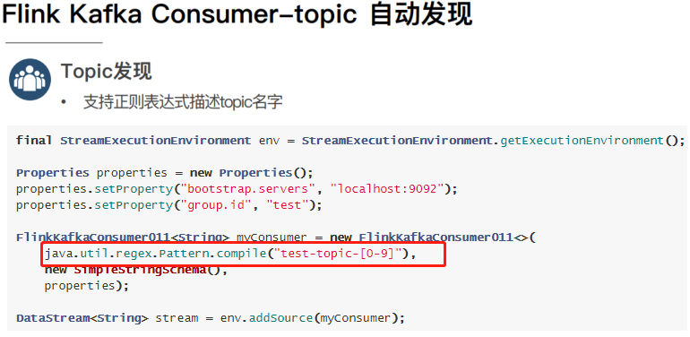

> Flink Job从一个固定的Kafka topic 读数据，开始该 topic 有**7 个 partition**，但随着业务的增长数据量变大，需要对**Kafka partition 个数进行扩容**，由 ==7 个扩容到 14==。该情况下如何在==不重启作业==情况下动态感知新扩容的 partition？
>
> ==对Topic增加分区，如何Flink job感知==

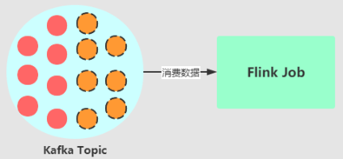

> 构建 ==FlinkKafkaConsumer== 时的 `Properties` 中设置`flink.partition-discovery.interval-millis` 参数为非负值，==表示开启动态发现的开关，及设置的时间间隔==，启动一个单独的线程定期去Kafka获取最新的meta信息。

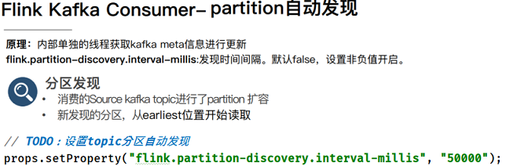

### 5. KafkaSource

> **Flink 1.12** 版本中，提供基于新API接口`Data Source`实现Kafka 数据源：`KafkaSource`，消费数据更加简单

https://nightlies.apache.org/flink/flink-docs-release-1.13/docs/connectors/datastream/kafka/#kafka-source

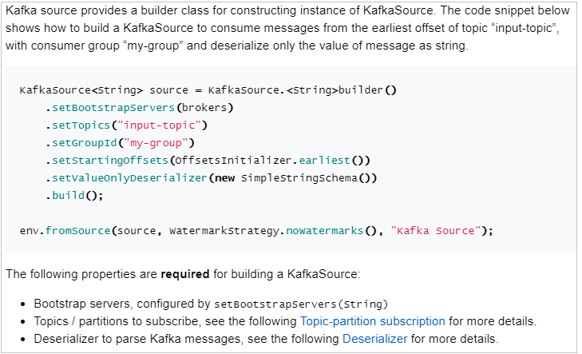

> 案例演示：从Kafka消费数据，进行实时流式处理。

```Java
package cn.itcast.flink.connector;

import org.apache.flink.api.common.eventtime.WatermarkStrategy;
import org.apache.flink.api.common.serialization.SimpleStringSchema;
import org.apache.flink.connector.kafka.source.KafkaSource;
import org.apache.flink.connector.kafka.source.enumerator.initializer.OffsetsInitializer;
import org.apache.flink.streaming.api.datastream.DataStream;
import org.apache.flink.streaming.api.environment.StreamExecutionEnvironment;

/**
 * Flink从Kafka消费数据，指定topic名称和反序列化类
 */
public class _06StreamKafkaSourceDemo {

	public static void main(String[] args) throws Exception{
		// 1. 执行环境-env
		StreamExecutionEnvironment env = StreamExecutionEnvironment.getExecutionEnvironment();
		env.setParallelism(3);

		// 2. 数据源-source
		// 2-1. 创建KafkaSource对象，设置属性
		KafkaSource<String> kafkaSource = KafkaSource.<String>builder()
			.setBootstrapServers("node1.itcast.cn:9092,node2.itcast.cn:9092,node3.itcast.cn:9092")
			.setTopics("flink-topic")
			.setGroupId("my-group")
			.setStartingOffsets(OffsetsInitializer.earliest())
			.setValueOnlyDeserializer(new SimpleStringSchema())
			.build();
		// 2-2. 添加数据源
		DataStream<String> kafkaStream = env.fromSource(kafkaSource, WatermarkStrategy.noWatermarks(), "KafkaSource");

		// 3. 数据转换-transformation
		// 4. 数据接收器-sink
		kafkaStream.printToErr();

		// 5. 触发执行-execute
		env.execute("StreamKafkaSourceDemo") ;
	}

}

```


## III. 批处理高级特性


## 附I.  Maven模块创建


## 附II. Redis Hash数据类型