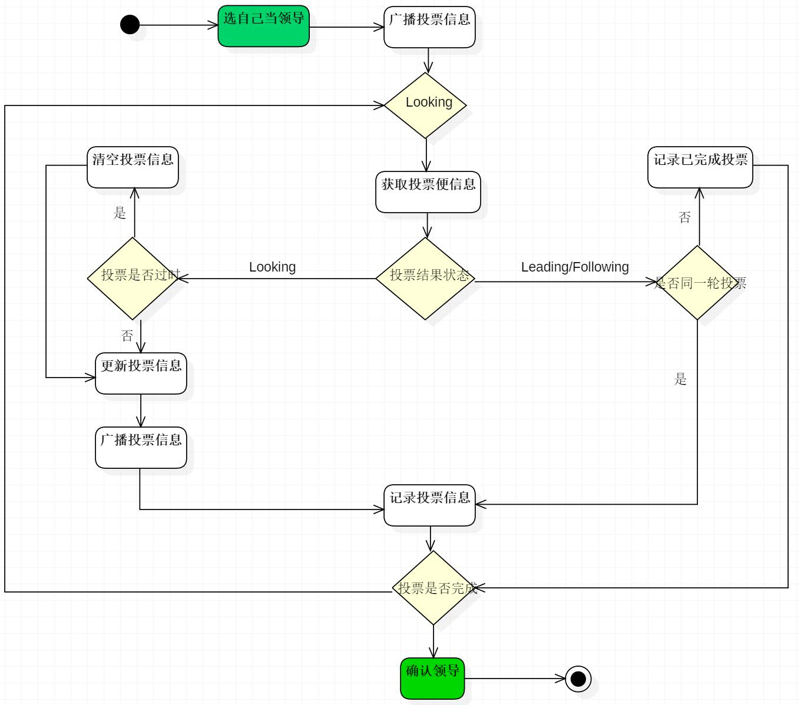

# I. Zookeeper的Leader选举机制

1. ## 人类选举基本原理

   ### 核心概念:

   - **候选人能力**: 投票的基本原则是选择能力最强的人
   - **遇强改投**: 如果有更强的候选人可以更改投票
   - **投票箱**: 所有人的票都会放在投票箱
   - **领导者**(**Leader**): 得票最多的人即为领导者

2. ## Zookeeper选举基本原理

   > #### 只有集群模式下才需要选举, 单机部署不需要选举

   ### 对照人类选举的核心概念:

   - **候选节点能力**: 节点的数据越新, 节点的能力越强

     zxid(Zookeeper Transaction ID), 即Zk事务ID. Zookeeper中通常以zxid来标识数据的新旧程度, zxid越大则数据越新则"能力"越强

   - **遇强改投**: 遇到zxid更大的节点则改投该节点

     集群选举开始时, 节点首先认为自己是最强的, 将选票写上自己的身份证号sid和zxid后传递给其他节点, 同时接受其他节点传递的选票, 若发现有节点zxid更大则改票投给zxid更大的节点

   - **投票箱**: 每个节点都有一个存在自己内存中的投票箱

     节点会将自己的选票和其他节点的选票信息都存储在自己内存中, 由于选票互相传阅所以最终每个节点内存中储存的选票信息会是一样的

   - **领导者**: 一旦有节点得票数过半则选举胜出, 投票结束

     节点会在投票过程中统计是否有超过半数节点和自己做出相同选择, 一旦有超过半数节点选择同一个节点, 则该节点当选Leader, 投票结束.

   ### Zk选举机制中的核心概念

   - **Server id**: 服务器id, 编号越大在选举选择算法中的权重越大
   - **Zxid**: 事务id, 服务器中存放的事务id值越大说明数据越新, 在选举算法中权重也就越大
   - **Epoch**: 逻辑时钟, 也叫投票的次数, 统一轮投票过程中的逻辑时钟值是相同的, 每投完一次票此值就会增加
   - **Server状态**: 选举状态
     - **LOOKING**, 竞选状态
     - **FOLLOWING**, 随从状态, 同步leader状态, 参与投票
     - **OBSERVING**, 观察状态, 同步leader状态, 不参与投票
     - **LEADING**, 领导者状态

   ### Zookeeper选举开始的时机

   当Zookeeper集群中的一台服务器出现以下两种情况之一时, 需要进入Leader选举:

   1. 服务器初始化启动

      初始化时集群服务器均无zxid记录, 故根据自己的sid大小进行投票

      对于三台服务器1,2,3, 最终投票结果为1零票, 2三票, 3零票, 2当选leader

   2. 服务器运行期间Leader故障

      

      #### 总的来说, 分三步走, 写自己, 收发选票, 确定投票.

      

# II. HDFS的读写流程

1. ## HDFS上传(写)文件流程

   1. #### Client客户端通过RPC协议向NN发送上传(写)文件请求, NN接收到请求后检查(校验)客户端权限, 目标是否存在, 校验通过继续上传

   2. #### 客户端请求上传第一个block及其副本

   3. #### NN根据副本策略(**默认3副本策略**)找出合适的DN位置信息返回给客户端

   4. #### 客户端根据DN位置信息建立**pipeline管道**, (Client------>A------>B------>C)

   5. #### 客户端读取文件后以默认64k大小的packet向管道中发送数据

   6. #### pipeline反方向上, 邻近的两个单位之间进行ACK校验确认数据安全

   7. #### 上传完一个block后, 客户端继续请求NN上传后续block, 建立pipeline ack

   8. #### 所有block上传完毕后, 客户端通知NN文件上传成功, NN记录文件的元数据信息

2. ## HDFS下载(读)文件流程

   1. #### Client客户端通过RPC协议向NN发送下载(读)文件请求, NN接收到请求后检查(校验)客户端权限, 目标是否存在, 校验通过继续下载

   2. #### NN视文件大小(分批)返回block位置信息, 返回的位置信息是有序的, 网络拓扑图中距离客户端近的靠前, DN状态好的靠前, 状态STALE的靠后

   3. #### 客户端通过输入流到返回的block上读取信息, 在读取完第一个block之==前==就连接到下一个block上继续读取

   4. #### 所有block读取完毕后, 在客户端按照block的顺序进行拼接并进行CRC校验

