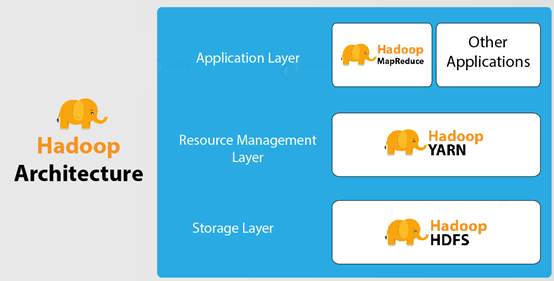
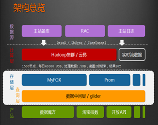

# Apache Hadoop

## I. Apache Hadoop

1. ### Hadoop介绍

   Hadoop是Apache旗下一个用Java实现的开源软件框架，是一个开发和运行处理大规模数据的软件平台。允许使用简单的编程模型在==**大量计算机集群**==上对大型数据集进行==**分布式处理**==。

   Hadoop的核心组件有：

   ##### 	HDFS（分布式文件系统）：解决海量数据存储

   ##### 	YARN（作业调度和集群资源管理的框架）：解决资源任务调度

   ##### 	MAPREDUCE（分布式运算编程框架）：解决海量数据计算

   

   广义上说，Hadoop也指==**Hadoop生态圈**==：

   

   当下的Hadoop已经成长为一个庞大的体系，随着生态系统的成长，新出现的项目越来越多，其中不乏一些非Apache主管的项目，这些项目对HADOOP是很好的补充或者更高层的抽象。

2. ### Hadoop发展简史

   ​	Hadoop是Apache Lucene创始人 Doug Cutting 创建的。最早起源于Nutch，它是Lucene的子项目。Nutch的设计目标是构建一个大型的全网搜索引擎，包括网页抓取、索引、查询等功能，但随着抓取网页数量的增加，遇到了严重的可扩展性问题：如何解决数十亿网页的存储和索引问题。

   ​	2003年Google发表了一篇论文为该问题提供了可行的解决方案。论文中描述的是谷歌的产品架构，该架构称为：谷歌分布式文件系统（GFS）,可以解决他们在网页爬取和索引过程中产生的超大文件的存储需求。

   ​	2004年 Google发表论文向全世界介绍了谷歌版的MapReduce系统。

   ​	同时期，Nutch的开发人员完成了相应的开源实现HDFS和MAPREDUCE，并从Nutch中剥离成为独立项目HADOOP，到2008年1月，HADOOP成为Apache顶级项目，迎来了它的快速发展期。

   ​	2006年Google发表了论文是关于BigTable的，这促使了后来的Hbase的发展。

   ​	因此，Hadoop及其生态圈的发展离不开Google的贡献。

3. ### Hadoop特性优点

   Scalable扩容能力：Hadoop是在可用的计算机集群间分配数据并完成计算任务的，这些集群可以方便地扩展到数以千计的节点中。

   Economical经济（成本低）：Hadoop通过普通廉价的及其组成服务器集群来分发以及处理数据，所以成本很低。

   Efficient效率高：通过并发数据，Hadoop可以在节点之间动态并行地移动数据，所以速度非常快。

   Reliable可靠性高：能自动维护数据的多份复制，并且在任务失败后能自动地重新部署（redeploy）计算任务，所以Hadoop的按位存储和处理数据的能力值得人们信赖。

4. ### Hadoop国内外应用

   ​	不管是国内还是国外，Hadoop最受青睐的行业是互联网领域，可以说互联网公司是hadoop的主要使用力量。

   ​	国外来说，Yahoo、Facebook、IBM等公司都大量使用hadoop集群来支撑业务。比如：

   ​		Yahoo的Hadoop应用在支持广告系统、用户行为分析、支持Web搜索等。

   ​		Facebook主要使用Hadoop存储内部日志与多维数据，并以此作为报告、分析和机器学习的数据源。

   ​		国内来说，BAT领头的互联网公司是当仁不让的Hadoop使用者、维护者。比如Ali云梯（14年国内最大Hadoop集群）、百度的日志分析平台、推荐引擎系统等。

   

   ​	国内其他非互联网领域也有不少hadoop的应用，比如：

   ​		金融行业： 个人征信分析

   ​		证券行业： 投资模型分析

   ​		交通行业： 车辆、路况监控分析

   ​		电信行业： 用户上网行为分析

   ​	总之：hadoop并不会跟某种具体的行业或者某个具体的业务挂钩，它只是一种用来做海量数据分析处理的工具。

## II. Hadoop集群搭建

1. ### 发行版本

2. ### 集群简介

3. ### 服务器基础环境准备

4. ### JDK环境安装

5. ### Hadoop重新编译

6. ### Hadoop安装包目录结构

7. ### Hadoop配置文件修改

   1. #### hadoop-env.sh

   2. #### core-site.xml

   3. #### hdfs-site.xml

   4. #### mapred-site.xml

   5. #### yarn-site.xml

   6. #### workers

8. ### scp同步安装包

9. ### Hadoop环境变量

## III. Hadoop集群启动、初体验

1. ### 启动方式

   1. 单节点逐个启动
   2. 脚本一键启动

2. ### 集群web-ui

3. ### Hadoop初体验

   1. HDFS使用
   2. 运行MapReduce程序

## IV. MapReduce jobHistory

1. ### 修改mapred-site.xml

2. ### 分发配置到其他机器

3. ### 启动jobHistoryServer服务进程

4. ### 页面访问jobhistoryserver

## V. HDFS的垃圾桶机制

1. ### 垃圾桶机制解析

2. ### 垃圾桶机制配置

3. ### 垃圾桶机制验证