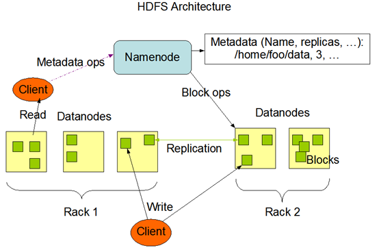

# Apache Hadoop HDFS

## I. HDFS入门

### 文件系统

- 文件系统是一种**存储**和**组织数据**的方法，实现了数据的存储、分级组织、访问和获取等操作，使得用户对文件访问和查找变得容易；

- 文件系统使用**树形目录**的抽象逻辑概念代替了硬盘等物理设备使用数据块的概念，用户不必关心数据底层存在硬盘哪里，只需要记住这个文件的所属目录和文件名即可；

- 文件系统通常使用硬盘和光盘这样的存储设备，并维护文件在设备中的物理位置。

- ##### 文件名：windows操作系统中文件名由文件主名和扩展名组成，之间以一个小圆点隔开；文件名可用于用于定位存储位置、区分不同文件，计算机实行按名存取的操作方式。

- ##### 元数据：元数据（metadata）又称之为解释性数据，记录数据的数据；文件系统元数据一般指文件大小、最后修改时间、底层存储位置、属性、所属用户、权限等信息。

- 分布式存储系统的**四大属性**：

  - **分布式存储**：多机横向扩展，理论上无限扩展
  - **元数据记录**：提高寻找文件效率
  - **分块存储**：提高上传下载效率，分块存储在不同机器，针对块并行操作提高效率
  - **副本机制**：硬件故障难以避免，数据丢失风险大，不同机器设置备份，冗余存储保障数据安全

1. ### HDFS基本概念

   1. #### HDFS介绍

      HDFS(Hadoop Distributed File System)，Hadoop分布式文件系统。是Hadoop核心组件之一，作为**最底层**的分布式存储服务而存在。

      HDFS解决的问题就是大数据存储。它们是横跨在多台计算机上的存储系统。分布式文件系统在大数据时代有着广泛的应用前景，它们为存储和处理超大规模数据提供所需的扩展能力。

      

   2. #### HDFS设计目标

      1. **故障的检测和自动快速恢复**是HDFS的**核心架构目标**
      2. HDFS上的应用主要以**流式**读取数据。其被设计成适合批量处理而不是用户交互式的。相较于数据访问的反应时间，更注重**数据访问的高吞吐量**
      3. HDFS支持大文件，典型的文件大小是GB到TB级别，故应提供很高的聚合数据带宽，一个集群中支持数百个节点，一个集群中指出千万级别的文件
      4. 文件访问模型为“write-one-read-many”。一个文件一旦创建、写入、关闭之后就不需要修改了。简化了数据一致性问题，使高吞吐量的数据访问成为可能
      5. 将计算应用移动到数据附近比将数据移动到计算应用附近代价更低
      6. 具备在异构的硬件和软件平台上的**可移植性**，这将推动需要大数据集的应用更广泛地采用HDFS作为平台

2. ### HDFS重要特性

   首先，它是一个文件系统，用于存储文件，通过统一的命名空间目录树来定位文件；

   其次，它是分布式的，由很多服务器联合起来实现其功能，集群中的服务器有各自的角色。

   

   1. #### master/slave架构

      ##### 	HDFS采用master/slave架构。一般一个HDFS集群是有一个Namenode和一定数目的Datanode组成。

      ##### 	Namenode是HDFS集群主节点，Datanode是HDFS集群从节点，两种角色各司其职，共同协调完成分布式的文件存储服务。

   2. #### 分块存储

      ##### 	HDFS中的文件在物理上是分块存储（block）的，块的大小可以通过配置参数来规定，默认大小在hadoop2.x版本中是128M。

   3. #### NameSpace命名空间

      ##### 	HDFS支持传统的层次型文件组织结构。用户或者应用程序可以创建目录，然后将文件保存在这些目录里。文件系统名字空间的层次结构和大多数现有的文件系统类似：用户可以创建、删除、移动或重命名文件。

      ##### 	Namenode负责维护文件系统的名字空间，任何对文件系统名字空间或属性的修改都将被Namenode记录下来。

      ##### 	HDFS会给客户端提供一个统一的抽象目录树，客户端通过路径来访问文件，形如：hdfs://namenode:port/dir-a/dir-b/dir-c/file.data。

   4. #### NameNode元数据管理

      ##### 	我们把目录结构及文件分块位置信息叫做元数据。Namenode负责维护整个hdfs文件系统的目录树结构，以及每一个文件所对应的block块信息（block的id，及所在的datanode服务器）。

   5. #### DataNode数据存储

      ##### 	文件的各个block的具体存储管理由datanode节点承担。每一个block都可以在多个datanode上。Datanode需要定时向Namenode汇报自己持有的block信息。

   6. #### 副本机制

      ##### 	为了容错，文件的所有block都会有副本。每个文件的block大小和副本系数都是可配置的。应用程序可以指定某个文件的副本数目。副本系数可以在文件创建的时候指定，也可以在之后改变。

      ##### 	副本数量也可以通过参数设置dfs.replication，默认是3。

   7. #### 一次写入，多次读出

      ​	HDFS是设计成适应一次写入，多次读出的场景，且不支持文件的修改。

      ​	正因为如此，HDFS适合用来做大数据分析的底层存储服务，并不适合用来做网盘等应用，因为，修改不方便，延迟大，网络开销大，成本太高。

3. ### HDFS基本操作

   1. #### Shell命令行客户端

   2. #### Shell命令选项

   3. #### Shell常用命令介绍

## II. HDFS基本原理

1. ### NameNode概述

2. ### DataNode概述

3. ### HDFS的工作机制

   1. #### HDFS写数据流程

   2. #### HDFS读数据流程

      

## III. HDFS其他功能

1. ### 不同集群之间的数据复制

   1. #### 集群内布文件拷贝scp

   2. #### 跨集群之间的数据拷贝distcp

2. ### Archive档案的使用

   1. #### 如何创建Archive

   2. #### 如何查看Archive

   3. #### 如何解压Archive

   4. #### Archive注意事项

## IV. HDFS元数据管理机制

1. ### 元数据管理概述

2. ### 元数据目录相关文件

3. ### Fsimage、Edits

   1. #### 概述

   2. #### 内容查看

## V. Secondary NameNode

1. ### Checkpoint

   1. #### Checkpoint详细步骤

   2. #### Checkpoint触发条件

## VI. HDFS安全模式

1. ### 安全模式概述

2. ### 安全模式配置

3. ### 安全模式命令