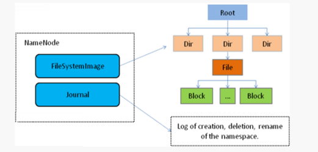
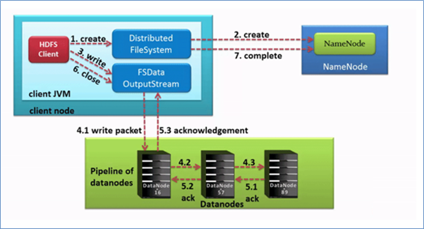
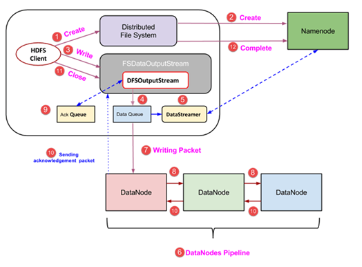
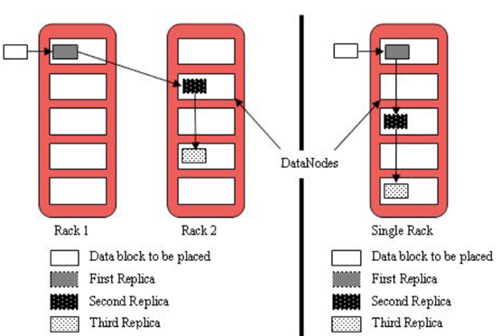

# Apache Hadoop HDFS

## I. HDFS入门

### 文件系统

- 文件系统是一种**存储**和**组织数据**的方法，实现了数据的存储、分级组织、访问和获取等操作，使得用户对文件访问和查找变得容易；

- 文件系统使用**树形目录**的抽象逻辑概念代替了硬盘等物理设备使用数据块的概念，用户不必关心数据底层存在硬盘哪里，只需要记住这个文件的所属目录和文件名即可；

- 文件系统通常使用硬盘和光盘这样的存储设备，并维护文件在设备中的物理位置。

- ##### 文件名：windows操作系统中文件名由文件主名和扩展名组成，之间以一个小圆点隔开；文件名可用于用于定位存储位置、区分不同文件，计算机实行按名存取的操作方式。

- ##### 元数据：元数据（metadata）又称之为解释性数据，记录数据的数据；文件系统元数据一般指文件大小、最后修改时间、底层存储位置、属性、所属用户、权限等信息。

- 分布式存储系统的**四大属性**：

  - **分布式存储**：多机横向扩展，理论上无限扩展
  - **元数据记录**：提高寻找文件效率
  - **分块存储**：提高上传下载效率，分块存储在不同机器，针对块并行操作提高效率
  - **副本机制**：硬件故障难以避免，数据丢失风险大，不同机器设置备份，冗余存储保障数据安全

1. ### HDFS基本概念

   1. #### HDFS介绍

      HDFS(Hadoop Distributed File System)，Hadoop分布式文件系统。是Hadoop核心组件之一，作为**最底层**的分布式存储服务而存在。

      HDFS解决的问题就是大数据存储。它们是横跨在多台计算机上的存储系统。分布式文件系统在大数据时代有着广泛的应用前景，它们为存储和处理超大规模数据提供所需的扩展能力。

      

   2. #### HDFS设计目标

      1. **故障的检测和自动快速恢复**是HDFS的**核心架构目标**
      2. HDFS上的应用主要以**流式**读取数据。其被设计成适合批量处理而不是用户交互式的。相较于数据访问的反应时间，更注重**数据访问的高吞吐量**
      3. HDFS支持大文件，典型的文件大小是GB到TB级别，故应提供很高的聚合数据带宽，一个集群中支持数百个节点，一个集群中指出千万级别的文件
      4. 文件访问模型为“write-one-read-many”。一个文件一旦创建、写入、关闭之后就不需要修改了。简化了数据一致性问题，使高吞吐量的数据访问成为可能
      5. 将计算应用移动到数据附近比将数据移动到计算应用附近代价更低
      6. 具备在异构的硬件和软件平台上的**可移植性**，这将推动需要大数据集的应用更广泛地采用HDFS作为平台

2. ### HDFS重要特性

   首先，它是一个文件系统，用于存储文件，通过统一的命名空间目录树来定位文件；

   其次，它是分布式的，由很多服务器联合起来实现其功能，集群中的服务器有各自的角色。

   

   1. #### master/slave架构

      ##### 	HDFS采用master/slave架构。一般一个HDFS集群是有一个Namenode和一定数目的Datanode组成。

      ##### 	Namenode是HDFS集群主节点，Datanode是HDFS集群从节点，两种角色各司其职，共同协调完成分布式的文件存储服务。

   2. #### 分块存储

      ##### 	HDFS中的文件在物理上是分块存储（block）的，块的大小可以通过配置参数来规定，默认大小在hadoop2.x版本中是128M。

   3. #### NameSpace命名空间：抽象统一的目录树结构

      ##### 	HDFS支持传统的层次型文件组织结构。用户或者应用程序可以创建目录，然后将文件保存在这些目录里。文件系统名字空间的层次结构和大多数现有的文件系统类似：用户可以创建、删除、移动或重命名文件。

      ##### 	Namenode负责维护文件系统的名字空间，任何对文件系统名字空间或属性的修改都将被Namenode记录下来。

      ##### 	HDFS会给客户端提供一个统一的抽象目录树，客户端通过路径来访问文件，形如：hdfs://namenode:port/dir-a/dir-b/dir-c/file.data。

   4. #### NameNode元数据管理

      ##### 	我们把目录结构及文件分块位置信息叫做元数据。Namenode负责维护整个hdfs文件系统的目录树结构，以及每一个文件所对应的block块信息（block的id，及所在的datanode服务器）。

   5. #### DataNode数据存储

      ##### 	文件的各个block的具体存储管理由datanode节点承担。每一个block都可以在多个datanode上。Datanode需要定时向Namenode汇报自己持有的block信息。

   6. #### 副本机制

      ##### 	为了容错，文件的所有block都会有副本。每个文件的block大小和副本系数都是可配置的。应用程序可以指定某个文件的副本数目。副本系数可以在文件创建的时候指定，也可以在之后改变。

      ##### 	副本数量也可以通过参数设置dfs.replication，默认是3。

   7. #### 一次写入，多次读出

      ##### 	HDFS是设计成适应一次写入，多次读出的场景，且不支持文件的修改。

      ##### 	正因为如此，HDFS适合用来做大数据分析的底层存储服务，并不适合用来做网盘等应用，因为，修改不方便，延迟大，网络开销大，成本太高。

3. ### HDFS基本操作

   1. #### Shell命令行客户端

      Hadoop提供了文件系统的shell命令行客户端，使用方法如下：

      ```shell
      hadoop  fs  <args>
      ```

      文件系统shell包括与Hadoop分布式文件系统（HDFS）以及Hadoop支持的其他文件系统（如本地FS，HFTP FS，S3 FS等）直接交互的各种类似shell的命令。所有FS shell命令都将路径URI作为参数。

      URI格式为scheme://authority/path。对于HDFS，该scheme是hdfs，对于本地FS，该scheme是file。scheme和authority是可选的。如果未指定，则使用配置中指定的默认方案。

      对于HDFS,命令示例如下：

      ```shell
      hadoop fs -ls file:///   #操作本地文件系统
      hadoop fs -ls hdfs://node1:8020/ #操作HDFS分布式文件系统
      hadoop fs -ls /   #直接根目录，没有指定协议 将加载读取fs.defaultFS值
      ```

      对于本地文件系统，命令示例如下：

      ```shell
      hadoop fs -ls file:///root/ 
      ```

      如果使用的文件系统是HDFS，则使用hdfs dfs也是可以的，此时

      ```shell
      hadoop fs <args> = hdfs dfs <args>
      ```

   2. #### Shell命令选项

      ### 1.1． Shell 命令选项

      | 选项名称       | 使用格式                                                     | 含义                       |
      | -------------- | ------------------------------------------------------------ | -------------------------- |
      | -ls            | -ls <路径>                                                   | 查看指定路径的当前目录结构 |
      | -lsr           | -lsr <路径>                                                  | 递归查看指定路径的目录结构 |
      | -du            | -du <路径>                                                   | 统计目录下个文件大小       |
      | -dus           | -dus <路径>                                                  | 汇总统计目录下文件(夹)大小 |
      | -count         | -count [-q] <路径>                                           | 统计文件(夹)数量           |
      | -mv            | -mv <源路径> <目的路径>                                      | 移动                       |
      | -cp            | -cp <源路径> <目的路径>                                      | 复制                       |
      | -rm            | -rm [-skipTrash] <路径>                                      | 删除文件/空白文件夹        |
      | -rmr           | -rmr [-skipTrash] <路径>                                     | 递归删除                   |
      | -put           | -put <多个linux上的文件> <hdfs路径>                          | 上传文件                   |
      | -copyFromLocal | -copyFromLocal <多个linux上的文件> <hdfs路径>                | 从本地复制                 |
      | -moveFromLocal | -moveFromLocal <多个linux上的文件> <hdfs路径>                | 从本地移动                 |
      | -getmerge      | -getmerge <源路径> <linux路径>                               | 合并到本地                 |
      | -cat           | -cat <hdfs路径>                                              | 查看文件内容               |
      | -text          | -text <hdfs路径>                                             | 查看文件内容               |
      | -copyToLocal   | -copyToLocal [-ignoreCrc] [-crc] [hdfs源路径] [linux目的路径] | 从本地复制                 |
      | -moveToLocal   | -moveToLocal [-crc] <hdfs源路径> <linux目的路径>             | 从本地移动                 |
      | -mkdir         | -mkdir <hdfs路径>                                            | 创建空白文件夹             |
      | -setrep        | -setrep [-R] [-w] <副本数> <路径>                            | 修改副本数量               |
      | -touchz        | -touchz <文件路径>                                           | 创建空白文件               |
      | -stat          | -stat [format] <路径>                                        | 显示文件统计信息           |
      | -tail          | -tail [-f] <文件>                                            | 查看文件尾部信息           |
      | -chmod         | -chmod [-R] <权限模式> [路径]                                | 修改权限                   |
      | -chown         | -chown [-R] [属主][:[属组]] 路径                             | 修改属主                   |
      | -chgrp         | -chgrp [-R] 属组名称 路径                                    | 修改属组                   |
      | -help          | -help [命令选项]                                             | 帮助                       |

   3. #### Shell常用命令介绍

      **-ls**

      使用方法：

      ```shell
      hadoop fs -ls [-h] [-R] <args>
      ```

      功能：显示文件、目录信息。

      示例：

      ```shell
      hadoop fs -ls /user/hadoop/file1
      ```

      **-mkdir**

      使用方法：

      ```shell
      hadoop fs -mkdir [-p] <paths>
      ```

      功能：在hdfs上创建目录，-p表示会创建路径中的各级父目录。

      示例：

      ```shell
      hadoop fs -mkdir –p /user/hadoop/dir1
      ```

      **-put**

      使用方法：

      ```shell
      hadoop fs -put [-f] [-p] [ -|<localsrc1> .. ]. <dst> 
      ```

      功能：将单个src或多个srcs从本地文件系统复制到目标文件系统。

      -p：保留访问和修改时间，所有权和权限。

      -f：覆盖目的地（如果已经存在）

      示例：

      ```shell
      hadoop fs -put -f localfile1 localfile2 /user/hadoop/hadoopdir
      ```

      **-get**

      使用方法：

      ```shell
      hadoop fs -get [-ignorecrc] [-crc] [-p] [-f] <src> <localdst>
      ```

      -ignorecrc：跳过对下载文件的CRC检查。

      -crc：为下载的文件写CRC校验和。

      功能：将文件复制到本地文件系统。

      示例：

      ```shell
      hadoop fs -get hdfs://host:port/user/hadoop/file localfile
      ```

      **-appendToFile**：小文件合并的方式之一

      使用方法：

      ```shell
      hadoop fs -appendToFile <localsrc> ... <dst>
      ```

      功能：追加一个文件到已经存在的文件末尾

      示例：

      ```shell
      hadoop fs -appendToFile localfile  /hadoop/hadoopfile
      ```

      **-cat**  

      使用方法：

      ```shell
      hadoop fs -cat [-ignoreCrc] URI [URI ...]
      ```

      功能：显示文件内容到stdout

      示例：

      ```shell
      hadoop fs -cat  /hadoop/hadoopfile
      ```

      **-tail**: 可以做数据的实时采集

      使用方法：

      ```shell
      hadoop fs -tail [-f] URI 
      ```

      功能：将文件的最后一千字节内容显示到stdout。

      -f选项将在文件增长时输出附加数据。

      示例：

      ```shell
      hadoop  fs  -tail  /hadoop/hadoopfile
      ```

      **-chgrp** 

      使用方法：

      ```shell
      hadoop fs -chgrp [-R] GROUP URI [URI ...]
      ```

      功能：更改文件组的关联。用户必须是文件的所有者，否则是超级用户。

      -R将使改变在目录结构下递归进行。

      示例：hadoop fs -chgrp othergroup /hadoop/hadoopfile

      **-chmod**

      功能：改变文件的权限。使用-R将使改变在目录结构下递归进行。

      示例：

      ```shell
      hadoop  fs  -chmod  666  /hadoop/hadoopfile
      ```

      **-chown**

      功能：改变文件的拥有者。使用-R将使改变在目录结构下递归进行。

      示例：

      ```shell
      hadoop  fs  -chown  someuser:somegrp   /hadoop/hadoopfile
      ```

      **-cp**              

      功能：从hdfs的一个路径拷贝hdfs的另一个路径

      示例： 

      ```shell
      hadoop  fs  -cp  /aaa/jdk.tar.gz  /bbb/jdk.tar.gz.2
      ```

      **-mv**                     

      功能：在hdfs目录中移动文件

      示例： 

      ```shell
      hadoop  fs  -mv  /aaa/jdk.tar.gz  /
      ```

      **-getmerge**    

      功能：合并下载多个文件

      示例：比如hdfs的目录 /aaa/下有多个文件:log.1, log.2,log.3,...

      ```shell
      hadoop fs -getmerge /aaa/log.*  ./log.sum
      ```

      **-rm**                

      功能：删除指定的文件。只删除非空目录和文件。-r 递归删除。

      示例：

      ```shell
      hadoop fs -rm -r /aaa/bbb/
      ```

      **-df**               

      功能：统计文件系统的可用空间信息

      示例：

      ```shell
      hadoop  fs  -df  -h  /
      ```

      **-du** 

      功能：显示目录中所有文件大小，当只指定一个文件时，显示此文件的大小。

      示例：

      ```shell
      hadoop fs -du /user/hadoop/dir1
      ```

      **-setrep**                

      功能：改变一个文件的副本系数。-R选项用于递归改变目录下所有文件的副本系数，-w选项用于等待。

      示例：

      ```shell
      hadoop fs -setrep -w 3 -R /user/hadoop/dir1
      ```

## II. HDFS基本原理

1. ### NameNode概述

   1. NameNode是HDFS的核心
   2. NameNode也称为Master
   3. NameNode进存储HDFS的**元数据**：文件系统中的所有文件的目录树，并跟踪整个集群中的文件
   4. NameNode不存储实际数据或数据集，数据本身存储在DataNode中
   5. NameNode知道HDFS中任何给定文件的块列表及其位置，使用此信息NameNode知道如何从块中构建文件
   6. NameNode并不持久化存储每个文件中各个块所在的DataNode的位置信息，这些信息会在系统启动时从数据节点重建
   7. NameNode对于HDFS至关重要，当NameNode关闭时，HDFS / Hadoop集群无法访问
   8. NameNode是Hadoop集群中的单点故障
   9. NameNode所在机器通常会配置有大量内存（RAM）

   

2. ### DataNode概述

   1. ##### DataNode负责将实际数据存储在HDFS中

   2. ##### DataNode也称为Slave

   3. ##### NameNode和DataNode会保持不断通信

   4. ##### DataNode启动时，它将自己发布到NameNode并汇报自己负责持有的块列表

   5. ##### 当某个DataNode关闭时，它不会影响数据或群集的可用性。NameNode将安排由其他DataNode管理的块进行副本复制

   6. ##### DataNode所在机器通常配置有大量的硬盘空间。因为实际数据存储在DataNode中

   7. ##### DataNode会定期（dfs.heartbeat.interval配置项配置，默认是3秒）向NameNode发送心跳，如果NameNode长时间没有接受到DataNode发送的心跳， NameNode就会认为该DataNode失效

   8. ##### block汇报时间间隔取参数dfs.blockreport.intervalMsec,参数未配置的话默认为6小时

   

3. ### HDFS的工作机制

   ​	NameNode负责管理整个文件系统元数据；DataNode负责管理具体文件数据块存储；Secondary NameNode协助NameNode进行元数据的备份。

   ​	HDFS的内部工作机制对客户端保持透明，客户端请求访问HDFS都是通过向NameNode申请来进行。

   1. #### HDFS写数据流程（上传）

      

      #### 核心概念：Pipeline管道

      - ##### Pipeline，中文翻译为管道。这是HDFS在上传文件写数据过程中采用的一种数据传输方式

      - ##### 客户端将数据块写入第一个数据节点，第一个数据节点保存数据之后再将块复制到第二个数据节点，后者保存后将其复制到第三个数据节点

      - ##### 数据以管道的方式，顺序的沿着一个方向传输，这样能够充分利用每个机器的带宽，避免网络瓶颈和高延迟时的连接，最小化推送所有数据的延时

      - ##### 在线性推送模式下，每台机器所有的出口宽带都用于以最快的速度传输数据，而不是在多个接受者之间分配宽带

      #### 核心概念：ACK应答响应

      

      #### 核心概念：默认3副本存储策略

      ##### 第一块副本：优先客户端本地，否则随机

      ##### 第二块副本：不同于第一块副本的不同机架

      ##### 第三块副本：第二块副本相同机架不同机器

      

      **详细步骤解析：**

      1、 client发起文件上传请求，通过RPC与NameNode建立通讯，NameNode检查目标文件是否已存在，父目录是否存在，返回是否可以上传；

      2、 client请求第一个 block该传输到哪些DataNode服务器上；

      3、 NameNode根据配置文件中指定的备份数量及副本放置策略进行文件分配，返回可用的DataNode的地址，如：A，B，C；

      *注：默认存储策略由BlockPlacementPolicyDefault类支持。也就是日常生活中提到最经典的**3副本策略。***

      

      4、 client请求3台DataNode中的一台A上传数据（本质上是一个RPC调用，建立pipeline），A收到请求会继续调用B，然后B调用C，将整个pipeline建立完成，后逐级返回client；

      5、 client开始往A上传第一个block（先从磁盘读取数据放到一个本地内存缓存），以packet为单位（默认64K），A收到一个packet就会传给B，B传给C；A每传一个packet会放入一个应答队列等待应答。

      6、 数据被分割成一个个packet数据包在pipeline上依次传输，在pipeline反方向上，逐个发送ack（命令正确应答），最终由pipeline中第一个DataNode节点A将pipeline ack发送给client;

      当一个block传输完成之后，client再次请求NameNode上传第二个block到服务器。

   2. #### HDFS读数据流程（下载）

      

      **详细步骤解析：**

      1、 Client向NameNode发起RPC请求，来确定请求文件block所在的位置；

      2、 NameNode会视情况返回文件的部分或者全部block列表，对于每个block，NameNode都会返回含有该block副本的DataNode地址；

      3、 这些返回的DN地址，会按照集群拓扑结构得出DataNode与客户端的距离，然后进行排序，排序两个规则：网络拓扑结构中距离Client近的排靠前；心跳机制中超时汇报的DN状态为STALE，这样的排靠后；

      4、 Client选取排序靠前的DataNode来读取block，如果客户端本身就是DataNode,那么将从本地直接获取数据；

      5、 底层上本质是建立FSDataInputStream，重复的调用父类DataInputStream的read方法，直到这个块上的数据读取完毕；一旦到达块的末尾，DFSInputStream 关闭连接并继续定位下一个块的下一个 DataNode；

      6、 当读完列表的block后，若文件读取还没有结束，客户端会继续向NameNode获取下一批的block列表；一旦客户端完成读取，它就会调用 close() 方法。

      7、 读取完一个block都会进行checksum验证，如果读取DataNode时出现错误，客户端会通知NameNode，然后再从下一个拥有该block副本的DataNode继续读。

      8、 NameNode只是返回Client请求包含块的DataNode地址，并不是返回请求块的数据；

      最终读取来所有的block会合并成一个完整的最终文件。

      ##### CRC校验

4. ### NameNode与DataNode之间的通信

   - #### 启动时，DataNode需要向NameNode注册自己并汇报自己持有的数据块信息；

   - #### 工作时，主从之间有心跳机制，数据块汇报机制；

   - #### DataNode会定期（dfs.heartbeat.interval配置项配置，默认是3秒）向NameNode发送心跳，如果NameNode长时间没有接受到DataNode发送的心跳， NameNode就会认为该DataNode失效。

   - #### DataNode会定期向NameNode进行自己持有的数据块信息汇报，汇报时间间隔取参数dfs.blockreport.intervalMsec,参数未配置的话默认为6小时。

