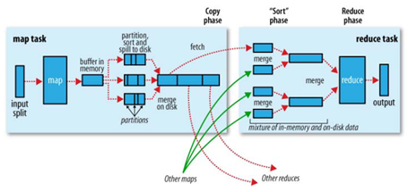
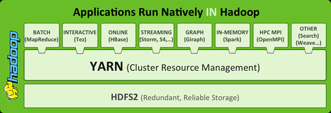
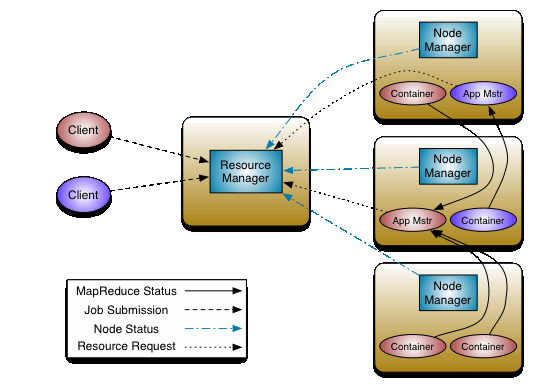
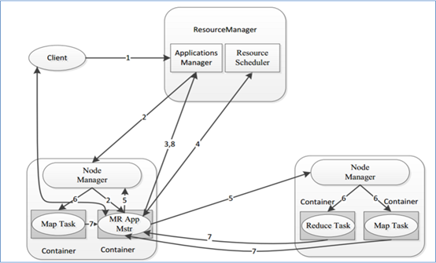
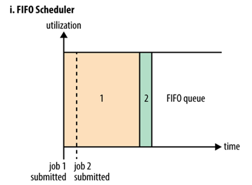
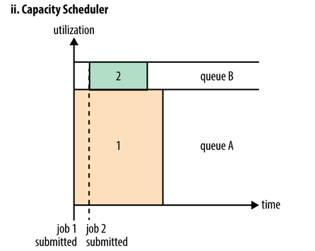
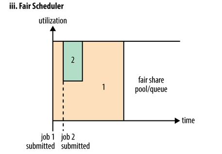
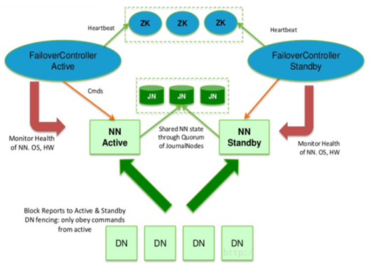
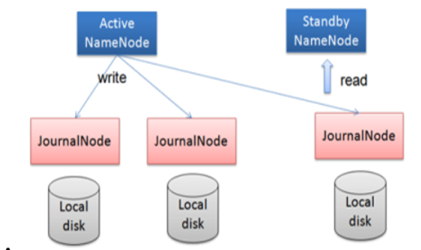
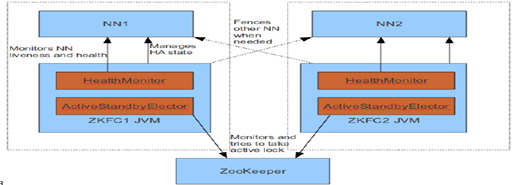

## I. Shuffle机制

**map阶段处理的数据如何传递给reduce阶段**，是MapReduce框架中最关键的一个流程，这个流程就叫**shuffle**。

shuffle: 洗牌、发牌——（核心机制：**数据分区，排序，合并**）。



shuffle是Mapreduce的核心，它分布在Mapreduce的map阶段和reduce阶段。一般把从**Map产生输出开始到Reduce取得数据作为输入之前的过程称作shuffle**。

Map阶段Shuffle: 

1. Collect阶段：将MapTask的结果输出到默认大小为100M的**环形缓冲区**，保存的是key/value，Partition分区信息等。

2. Spill阶段：当**内存**中的数据量达到一定的阀值的时候，就会将数据写入**本地磁盘**，在将数据写入磁盘之前需要对数据进行一次排序的操作，如果配置了combiner，还会将有相同分区号和key的数据进行排序。 

3. Merge阶段：把所有溢出的临时文件进行一次合并操作，以确保一个MapTask最终只产生一个中间数据文件。

Reduce阶段Shuffle:

4. Copy阶段： ReduceTask启动Fetcher线程到已经完成MapTask的节点上复制一份属于自己的数据，这些数据默认会保存在**内存**的缓冲区中，当内存的缓冲区达到一定的阀值的时候，就会将数据写到**磁盘**之上。

5. Merge阶段：在ReduceTask远程复制数据的同时，会在后台开启两个线程对**内存**到**本地**的数据文件进行合并操作。

6. Sort阶段：在对数据进行合并的同时，会进行排序操作，由于MapTask阶段已经对数据进行了局部的排序，ReduceTask只需保证Copy的数据的最终整体有效性即可。

Shuffle中的缓冲区大小会影响到mapreduce程序的执行效率，原则上说，缓冲区越大，磁盘io的次数越少，执行速度就越快, **Shuffle中频繁涉及数据在内存, 磁盘之间的多次往复**

### MR的弊端: 1. Shuffle过程繁琐; 2. 磁盘内存间反复横跳; 3. 业务复杂, 一个MR处理不完, 只能创建多个MR串行处理.

## II. Apache Hadoop YARN

### Yet Another Resource Negotiator, 一种新的Hadoop通用资源管理器

1. ### YARN通俗介绍

   

   YARN是一个**通用**资源管理系统和**调度**平台，可为上层应用提供统一的**资源管理**和**调度**，它的引入为集群在**利用率、资源统一管理和数据共享等方面**带来了巨大好处。

   可以把yarn理解为相当于一个分布式的操作系统平台，而mapreduce等运算程序则相当于运行于操作系统之上的应用程序，Yarn为这些程序提供运算所需的资源（内存、cpu）。

   - yarn并不清楚用户提交的程序的运行机制

   - yarn只提供运算资源的调度（用户程序向yarn申请资源，yarn就负责分配资源）

   - yarn中的主管角色叫ResourceManager

   - yarn中具体提供运算资源的角色叫NodeManager

   - yarn与运行的用户程序**完全解耦**，意味着yarn上可以运行各种类型的分布式运算程序，比如**mapreduce、storm，spark，tez**……

   - **spark**、**storm**等运算框架都可以整合在yarn上运行，只要他们各自的框架中有符合yarn规范的资源请求机制即可

   YARN成为一个通用的资源调度平台.企业中以前存在的各种运算集群都可以整合在一个物理集群上，提高资源利用率，方便数据共享

2. ### YARN基本架构

   

   YARN是一个资源管理、任务调度的框架，主要包含三大模块：ResourceManager（RM）、NodeManager（NM）、ApplicationMaster（AM）。

   **ResourceManager**负责所有资源的监控、分配和管理；

   **ApplicationMaster**负责每一个具体应用程序的调度和协调；

   **NodeManager**负责每一个节点的维护。

   对于所有的applications，RM拥有绝对的控制权和对资源的分配权。而每个AM则会和RM协商资源，同时和NodeManager通信来执行和监控task

3. ### YARN三大组件

   1. #### ResourceManager

      - ResourceManager负责整个集群的资源管理和分配，是一个全局的资源管理系统。
      - NodeManager以心跳的方式向ResourceManager汇报资源使用情况（目前主要是CPU和内存的使用情况）。RM只接受NM的资源回报信息，对于具体的资源处理则交给NM自己处理
      - YARN Scheduler根据application的请求为其分配资源，不负责application job的监控、追踪、运行状态反馈、启动等工作

   2. #### NodeManager

      - NodeManager是每个节点上的资源和任务管理器，它是管理这台机器的代理，负责该节点程序的运行，以及该节点资源的管理和监控。YARN集群每个节点都运行一个NodeManager
      - NodeManager定时向ResourceManager汇报本节点资源（CPU、内存）的使用情况和Container的运行状态。当ResourceManager宕机时NodeManager自动连接RM备用节点
      - NodeManager接收并处理来自ApplicationMaster的Container启动、停止等各种请求

   3. #### ApplicationMaster

      - 用户提交的每个应用程序均包含一个ApplicationMaster，它可以运行在ResourceManager以外的机器上

      - 负责与RM调度器协商以获取资源（用Container表示）

      - 将得到的任务进一步分配给内部的任务(资源的二次分配)

      - 与NM通信以启动/停止任务

      - 监控所有任务运行状态，并在任务运行失败时重新为任务申请资源以重启任务。

      - 当前YARN自带了两个ApplicationMaster实现，一个是用于演示AM编写方法的实例程序DistributedShell，它可以申请一定数目的Container以并行运行一个Shell命令或者Shell脚本；另一个是运行MapReduce应用程序的AM—MRAppMaster。

        **注**：RM只负责监控AM，并在AM运行失败时候启动它。RM不负责AM内部任务的容错，任务的容错由AM完成。

4. ### YARN运行流程

   - client向RM提交应用程序，其中包括启动该应用的ApplicationMaster的必须信息，例如ApplicationMaster程序、启动ApplicationMaster的命令、用户程序等。

   - ResourceManager启动一个container用于运行ApplicationMaster。

   - 启动中的ApplicationMaster向ResourceManager注册自己，启动成功后与RM保持心跳。

   - ApplicationMaster向ResourceManager发送请求，申请相应数目的container。

   - ResourceManager返回ApplicationMaster的申请的containers信息。申请成功的container，由ApplicationMaster进行初始化。container的启动信息初始化后，AM与对应的NodeManager通信，要求NM启动container。AM与NM保持心跳，从而对NM上运行的任务进行监控和管理。

   - container运行期间，ApplicationMaster对container进行监控。container通过RPC协议向对应的AM汇报自己的进度和状态等信息。

   - 应用运行期间，client直接与AM通信获取应用的状态、进度更新等信息。

   - 应用运行结束后，ApplicationMaster向ResourceManager注销自己，并允许属于它的container被收回。

   

5. ### YARN调度器Scheduler

   理想情况下，我们应用对Yarn资源的请求应该立刻得到满足，但现实情况资源往往是有限的，特别是在一个很繁忙的集群，一个应用资源的请求经常需要等待一段时间才能的到相应的资源。在**Yarn中，负责给应用分配资源的就是Scheduler**。其实调度本身就是一个难题，很难找到一个完美的策略可以解决所有的应用场景。为此，Yarn提供了多种调度器和可配置的策略供我们选择。

   在Yarn中有三种调度器可以选择：**FIFO Scheduler**，**Capacity Scheduler**，**Fair Scheduler**。

   1. #### FIFO Scheduler

      **FIFO** Scheduler把应用按提交的顺序排成一个队列，这是一个**先进先出**队列，在进行资源分配的时候，先给队列中最头上的应用进行分配资源，待最头上的应用需求满足后再给下一个分配，以此类推。

      

      FIFO Scheduler是最简单也是最容易理解的调度器，也不需要任何配置，但它并不适用于共享集群。大的应用可能会占用所有集群资源，这就导致其它应用被阻塞。在共享集群中，更适合采用Capacity Scheduler或Fair Scheduler，这两个调度器都允许大任务和小任务在提交的同时获得一定的系统资源

   2. #### Capacity Scheduler(Hadoop3.x默认调度策略)

      Capacity 调度器允许多个组织**共享**整个集群，每个组织可以获得集群的一部分计算能力。通过为每个组织分配专门的队列，然后再为每个队列分配一定的集群资源，这样整个集群就可以通过设置多个队列的方式给多个组织提供服务了。除此之外，队列内部又可以垂直划分，这样一个组织内部的多个成员就可以共享这个队列资源了，在一个队列内部，资源的调度是采用的是先进先出(FIFO)策略

      

      容量调度器 Capacity Scheduler 最初是由 Yahoo 最初开发设计使得 Hadoop 应用能够被多用户使用，且最大化整个集群资源的吞吐量，现被 IBM BigInsights 和 Hortonworks HDP 所采用。

      Capacity Scheduler被设计为允许应用程序在一个可预见的和简单的方式共享集群资源，即"作业队列"。Capacity Scheduler是根据租户的需要和要求把现有的资源分配给运行的应用程序。Capacity Scheduler 同时允许应用程序访问还没有被使用的资源，以确保队列之间共享其它队列被允许的使用资源。管理员可以控制每个队列的容量，Capacity Scheduler 负责把作业提交到队列中

   3. #### Fair Scheduler

      在Fair调度器中，我们不需要预先占用一定的系统资源，Fair调度器会为所有运行的job动态的调整系统资源。如下图所示，当第一个大job提交时，只有这一个job在运行，此时它获得了所有集群资源；当第二个小任务提交后，Fair调度器会分配一半资源给这个小任务，让这两个任务公平的共享集群资源。

      需要注意的是，在下图Fair调度器中，从第二个任务提交到获得资源会有一定的延迟，因为它需要等待第一个任务释放占用的Container。小任务执行完成之后也会释放自己占用的资源，大任务又获得了全部的系统资源。最终效果就是Fair调度器即得到了高的资源利用率又能保证小任务及时完成

      

      公平调度器 Fair Scheduler 最初是由 Facebook 开发设计使得 Hadoop 应用能够被多用户公平地共享整个集群资源，现被 Cloudera CDH 所采用。

      Fair Scheduler不需要保留集群的资源，因为它会动态在所有正在运行的作业之间平衡资源

   4. #### 示例: Capacity调度器配置使用

      调度器的使用是通过yarn-site.xml配置文件中的

      yarn.resourcemanager.scheduler.class参数进行配置的，默认采用Capacity Scheduler调度器。

      假设我们有如下层次的队列：

      root

      ├── prod	# 生产上需要的队列

      └── dev	# 开发上需要的队列

      ​    ├── mapreduce	# 开发中的mapreduce队列

      ​    └── spark	# 开发中的spark队列

      下面是一个简单的Capacity调度器的配置文件，文件名为capacity-scheduler.xml。在这个配置中，在root队列下面定义了两个子队列prod和dev，分别占40%和60%的容量。需要注意，一个队列的配置是通过属性`yarn.sheduler.capacity.<queue-path>.<sub-property>`指定的，`<queue-path>`代表的是队列的继承树，如`root.prod`队列，`<sub-property>`一般指capacity和maximum-capacity。

      ```xml
      <configuration>
       <property>
          <name>yarn.scheduler.capacity.root.queues</name>
          <value>prod,dev</value>
        </property>
       <property>
          <name>yarn.scheduler.capacity.root.dev.queues</name>
          <value>mapreduce,spark</value>
        </property>
          <property>
          <name>yarn.scheduler.capacity.root.prod.capacity</name>
          <value>40</value>
        </property>
          <property>
          <name>yarn.scheduler.capacity.root.dev.capacity</name>
          <value>60</value>
        </property>
          <property>
          <name>yarn.scheduler.capacity.root.dev.maximum-capacity</name>
          <value>75</value>
        </property>
        <property>
          <name>yarn.scheduler.capacity.root.dev.mapreduce.capacity</name>
          <value>50</value>
        </property>
         <property>
          <name>yarn.scheduler.capacity.root.dev.spark.capacity</name>
          <value>50</value>
        </property>
      </configuration>
      ```

      我们可以看到，dev队列又被分成了mapreduce和spark两个相同容量的子队列。dev的maximum-capacity属性被设置成了75%，所以即使prod队列完全空闲dev也不会占用全部集群资源，也就是说，prod队列仍有25%的可用资源用来应急。我们注意到，mapreduce和spark两个队列没有设置maximum-capacity属性，也就是说mapreduce或spark队列中的job可能会用到整个dev队列的所有资源（最多为集群的75%）。而类似的，prod由于没有设置maximum-capacity属性，它有可能会占用集群全部资源。

      关于队列的设置，这取决于我们具体的应用。比如，在MapReduce中，我们可以通过`mapreduce.job.queuename`属性指定要用的队列。如果队列不存在，我们在提交任务时就会收到错误。如果我们没有定义任何队列，所有的应用将会放在一个`default`队列中。

      注意：对于Capacity调度器，我们的队列名必须是队列树中的最后一部分，如果我们使用队列树则不会被识别。比如，在上面配置中，我们使用prod和mapreduce作为队列名是可以的，但是如果我们用`root.dev.mapreduce`或者`dev.mapreduce`是无效的

## III. Hadoop High Availability(HA)

HA(High Available), 高可用，是保证业务连续性的有效解决方案，一般有两个或两个以上的节点，分为**活动节点（Active）**及**备用节点（Standby）**。通常把正在执行业务的称为活动节点，而作为活动节点的一个备份的则称为备用节点。当活动节点出现问题，导致正在运行的业务（任务）不能正常运行时，备用节点此时就会侦测到，并立即接续活动节点来执行业务。从而实现业务的不中断或短暂中断。

Hadoop1.X版本，NN是HDFS集群的单点故障点，每一个集群只有一个NN,如果这个机器或进程不可用，整个集群就无法使用。为了解决这个问题，出现了一堆针对HDFS HA的解决方案（如：Linux HA, VMware FT, shared NAS+NFS, BookKeeper, QJM/Quorum Journal Manager, BackupNode等）。

在HA具体实现方法不同情况下，HA框架的流程是一致的, 不一致的就是如何存储、管理、同步edits编辑日志文件。

在Active NN和Standby NN之间要有个共享的存储日志的地方，Active NN把edit Log写到这个共享的存储日志的地方，Standby NN去读取日志然后执行，这样Active和Standby NN内存中的HDFS元数据保持着同步。一旦发生主从切换Standby NN可以尽快接管Active NN的工作

1. ### NameNode HA

   1. #### NameNode HA详解

      hadoop2.x之后，Clouera提出了QJM/Qurom Journal Manager，这是一个基于Paxos算法（分布式一致性算法）实现的HDFS HA方案，它给出了一种较好的解决思路和方案,QJM主要优势如下：

      不需要配置额外的高共享存储，降低了复杂度和维护成本。

      消除spof(单点故障)。

      系统鲁棒性(Robust)的程度可配置、可扩展。

      

      基本原理就是用2N+1台 JournalNode 存储EditLog，每次写数据操作有>=N+1返回成功时即认为该次写成功，数据不会丢失了。当然这个算法所能容忍的是最多有N台机器挂掉，如果多于N台挂掉，这个算法就失效了。这个原理是基于Paxos算法。

      在HA架构里面SecondaryNameNode已经不存在了，为了保持standby NN时时的与Active NN的元数据保持一致，他们之间交互通过JournalNode进行操作同步。

      任何修改操作在 Active NN上执行时，JournalNode进程同时也会记录修改log到至少半数以上的JN中，这时 Standby NN 监测到JN 里面的同步log发生变化了会读取 JN 里面的修改log，然后同步到自己的目录镜像树里面，如下图：

      

      当发生故障时，Active的 NN 挂掉后，Standby NN 会在它成为Active NN 前，读取所有的JN里面的修改日志，这样就能高可靠的保证与挂掉的NN的目录镜像树一致，然后无缝的接替它的职责，维护来自客户端请求，从而达到一个高可用的目的。

      在HA模式下，datanode需要确保同一时间有且只有一个NN能命令DN。为此：

      每个NN改变状态的时候，向DN发送自己的状态和一个序列号。

      DN在运行过程中维护此序列号，当failover时，新的NN在返回DN心跳时会返回自己的active状态和一个更大的序列号。DN接收到这个返回则认为该NN为新的active。

      如果这时原来的active NN恢复，返回给DN的心跳信息包含active状态和原来的序列号，这时DN就会拒绝这个NN的命令。

   2. #### Failover Controller

      HA模式下，会将FailoverController部署在每个NameNode的节点上，作为一个单独的进程用来监视NN的健康状态。**FailoverController****主要包括三个组件:**

      HealthMonitor: 监控NameNode是否处于unavailable或unhealthy状态。当前通过RPC调用NN相应的方法完成。

      ActiveStandbyElector: 监控NN在ZK中的状态。

      ZKFailoverController: 订阅HealthMonitor 和ActiveStandbyElector 的事件，并管理NN的状态,另外zkfc还负责解决fencing（也就是脑裂问题）。

      上述三个组件都在跑在一个JVM中，这个JVM与NN的JVM在同一个机器上。但是两个独立的进程。一个典型的HA集群，有两个NN组成，每个NN都有自己的ZKFC进程

      

      **ZKFailoverController主要职责：**

      - **健康监测：**周期性的向它监控的NN发送健康探测命令，从而来确定某个NameNode是否处于健康状态，如果机器宕机，心跳失败，那么zkfc就会标记它处于一个不健康的状态

      - **会话管理：**如果NN是健康的，zkfc就会在zookeeper中保持一个打开的会话，如果NameNode同时还是Active状态的，那么zkfc还会在Zookeeper中占有一个类型为短暂类型的znode，当这个NN挂掉时，这个znode将会被删除，然后备用的NN将会得到这把锁，升级为主NN，同时标记状态为Active

      - 当宕机的NN新启动时，它会再次注册zookeper，发现已经有znode锁了，便会自动变为Standby状态，如此往复循环，保证高可靠，需要注意，目前仅仅支持最多配置2个NN

      - **master选举**：通过在zookeeper中维持一个短暂类型的znode，来实现抢占式的锁机制，从而判断那个NameNode为Active状态

2. ### YARN HA

   Yarn作为资源管理系统，是上层计算框架（如MapReduce,Spark）的基础。在Hadoop 2.4.0版本之前，Yarn存在单点故障（即ResourceManager存在单点故障），一旦发生故障，恢复时间较长，且会导致正在运行的Application丢失，影响范围较大。从Hadoop 2.4.0版本开始，Yarn实现了ResourceManager HA，在发生故障时自动failover，大大提高了服务的可靠性。

   ResourceManager（简写为RM）作为Yarn系统中的主控节点，负责整个系统的资源管理和调度，内部维护了各个应用程序的ApplictionMannnnnster信息、NodeManager（简写为NM）信息、资源使用等。由于资源使用情况和NodeManager信息都可以通过NodeManager的心跳机制重新构建出来，因此只需要对ApplicationMaster相关的信息进行持久化存储即可。

   在一个典型的HA集群中，两台独立的机器被配置成ResourceManger。在任意时间，有且只允许一个活动的ResourceManger,另外一个备用。切换分为两种方式：

   **手动切换**：在自动恢复不可用时，管理员可用手动切换状态，或是从Active到Standby,或是从Standby到Active。

   **自动切换**：基于Zookeeper，但是区别于HDFS的HA，2个节点间无需配置额外的ZFKC守护进程来同步数据

   

3. ### Hadoop HA集群的搭建

   

   ## 名称梳理

   ```shell
   单点故障 SPOF
   主备架构
   容错
   故障转移
   高可用HA
   
   -----------------------------------------------
   1. 现象, 原因:
   	单点故障 SPOF 系统出现故障是难以避免的 局部故障会导致整体故障
   
   2. 解决方式:
   	设置备份, 形成主备架构 常见的是一主一备, 也可以是一主多备
   	目的: 当主挂掉 备份顶上成为主 继续提供服务
   
   3. 实现的效果
   	故障转移
   	容错能力 failover 容错: 形容系统可以容忍错误的发生
   	无容错能力: 一出错就凉凉
   	高可用 HA: 持续可用, 描述的是系统业务能力的不中断的特性
   	
   
   扩展:
   	UPS 不间断电源
   	异地容灾: 两地三中心 三地五中心
   ```

   

