# 数据仓库与Apache Hive

## I. 数据仓库

1. ### 数据仓库的基本概念

   ##### 数据仓库(Data Warehouse, 数仓, DW)是一个用于存储, **分析**, 报告的数据系统.

   ##### 数据仓库的目的是构建面向分析的集成化数据环境, 分析结果为企业提供决策支持.

   ##### 数据仓库本身并不"生产"任何数据, 也不"消费"任何数据, 数据来源于外部且开放给外部应用.

   消费数据: 分析完的结果并不是数仓自己使用, 而是开放给其他应用使用.

   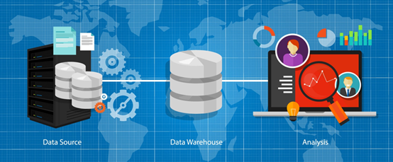

   数据源(业务数据, 友商数据等等)------>**数据仓库**------>数据**分析**

   联机事务处理系统(**OLTP**)的基本特征是前台接收的用户数据可以立即传送到后台进行处理, 并在很短的时间内给出处理结果, **关系型数据库(RDBMS)**是OLTP典型的应用(Oracle, MySQL, SQL Server...)

   联机分析处理系统(**OLAP**)是面向分析, 支持分析的系统, 数据仓库是OLAP的一种

2. ### 数据仓库的主要特征

   1. #### 面向主题(Sub-Oriented)

      数据仓库是面向主题的, **主题是一个抽象的概念, 是较高层次上企业信息系统中的数据综合, 归类并进行分析利用的抽象**. 在逻辑意义上, 它是对应企业中某一宏观分析领域所涉及的分析对象.

      对于保险公司, 主题可以是"**客户**", "**保险理赔**", "**承保**"等等.

   2. #### 集成性(Integrated)

      一个主题可能横跨多个数据源, 这些数据源之间可以能存在差异, 如字段的同名异义、异名同义、单位不统一、字长不一致等等, 集成就是在数据进入数据仓库之前必须要经过的**统一与综合，抽取、清理、转换和汇总**操作, 这是数据仓库建设中**最关键, 最复杂**的一步. 

      ETL: 抽取/转换/加载

   3. #### 非易失性(不可更新性)(Non-Volatile)

      - **数据仓库是分析数据的平台, 而不是创造数据的平台**,数据进入数据仓库后, 便稳定且不会改变(规律不能修改)
      - 数据仓库中只要保存过去的业务数据, 不需要每一笔业务都实时更新数据仓库, 而是根据商业需要每隔一段时间把一批较新的数据导入数据仓库
      - **数据仓库的数据反应的是一段相当长的时间内历史数据的内容**
      - **数据仓库中一般有大量的查询操作, 但修改和删除操作很少**

   4. #### 时变性(Time-Variant)

      **数据仓库的数据需要随着时间更新, 以适应决策的需要**.

      T+1, T+7, T+30

      - 数据仓库包含各种粒度的历史数据，数据可能与某个特定日期、星期、月份、季度或者年份有关。

      - 虽然数据仓库的用户不能修改数据，但并不是说数据仓库的数据是永远不变的。分析的结果只能反映过去的情况，当业务变化后，挖掘出的模式会失去时效性。因此数据仓库的数据需要随着时间更新，以适应决策的需要。从这个角度讲，数据仓库建设是一个项目，更是一个过程 。

      - 数据仓库的数据随时间的变化表现在以下几个方面。
        - 数据仓库的数据时限一般要远远长于操作型数据的数据时限。
        - 操作型系统存储的是当前数据，而数据仓库中的数据是历史数据。
        - 数据仓库中的数据是按照时间顺序追加的，它们都带有时间属性。

3. ### 数据仓库与数据库的区别

   #### OLTP与OLAP

   - 联机**事务**处理 OLTP（On-Line **Transaction** Processing）。**数据库**属于这里, 主要目标是做数据处理, 用户较为关心操作的响应时间, 数据的安全性, 完整性和并发支持的用户数等问题

   - 联机**分析**处理 OLAP（On-Line **Analytical** Processing）。**数据仓库**属于这里, 主要目标是做数据分析, 一般针对某些**主题**的**历史数据**进行复杂的多维分析, 支持管理决策.

   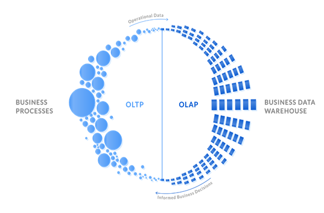

   |              | **OLTP**                     | **OLAP**                                        |
   | ------------ | ---------------------------- | ----------------------------------------------- |
   | **数据源**   | 仅包含当前运行日常业务数据   | 整合来自多个来源的数据，包括OLTP和外部来源      |
   | **目的**     | 面向应用，面向业务，支撑事务 | 面向主题，面向分析，支撑分析决策                |
   | **焦点**     | 当下                         | 主要面向过去、面向历史  实时数仓除外            |
   | **任务**     | 读写操作                     | 大量读而很少写操作                              |
   | **响应时间** | 毫秒                         | 秒、分钟、小时或者天   取决于数据量和查询复杂性 |
   | **数据量**   | 小数据，MB,GB                | 大数据，TP，PB                                  |

   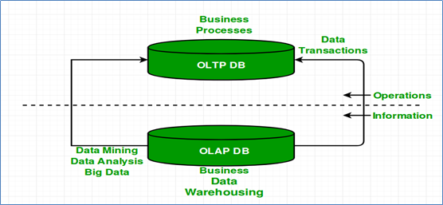

   #### **数据仓库与数据库的区别**:

   - ##### 数据仓库不是大型的数据库，虽然数据仓库存储数据规模大。

   - ##### 数据仓库的出现，并不是要取代数据库。

   - ##### 数据库是面向事务的设计，数据仓库是面向主题设计的。

   - ##### 数据库一般存储业务数据，数据仓库存储的一般是历史数据。

   - ##### 数据库是为捕获数据而设计，数据仓库是为分析数据而设计。

   #### 数据仓库, 数据集市

   - ##### 下图中，各种操作型系统数据和包括文件在内的等其他数据作为数据源，经过ETL(抽取转换加载)填充到数据仓库中；数据仓库中有不同主题数据，数据集市则根据部门特点面向指定主题，比如Purchasing（采购）、Sales（销售）、Inventory（库存）；

   - ##### 用户可以基于主题数据开展各种应用：数据分析、数据报表、数据挖掘。

   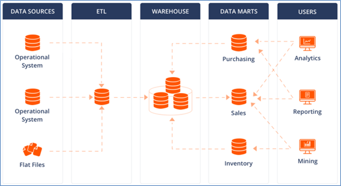

4. ### 数据仓库分层架构

   #### 数仓分层的好处: 

   - **清晰数据结构**: 每个数据分层都有其作用域, 使用表的时候能更方便地定位和理解
   - **数据血缘追踪**: 当数据来源表出问题的时候能快速定位到问题并清楚其危害范围
   - **减少重复开发**: 方便开发通用的中间层数据, 可以减少极大的重复计算
   - **把复杂问题简单化**: 每一层只处理单一的步骤, 比较简单和容易理解, 且便于维护数据的准确性, 出现问题时只需要从有问题的步骤开始修复
   - **屏蔽原始数据的异常**: 屏蔽业务的影响, 不必改一次业务就重新接入数据

   #### 分层思想和标准:

   - **按照数据流入流出数仓的过程进行分层**显得水到渠成, 因为数仓不产生数据, 也不消费数据
   - 最基础的分层思想, 理论上分为三个层: 操作型数据层(**O**peration **D**ata **S**tore), 数据仓库层(**DW**), 数据应用层(**DA**)

   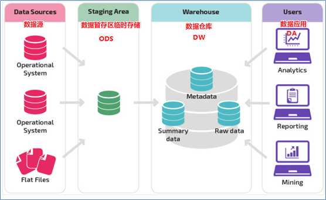

   #### 阿里数仓3层架构(ODS, DW, DA)

   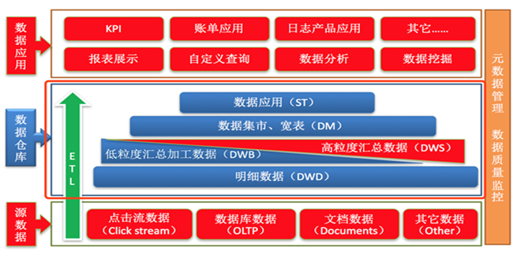

   ##### ODS层:

   - **操作型数据层**，也称之为源数据层、数据引入层、数据暂存层、临时缓存层。

   - ##### 此层存放未经过处理的原始数据至数据仓库系统，结构上与源系统保持一致，是数据仓库的数据准备区。

   - 主要完成基础数据引入到数仓的职责，和数据源系统进行解耦合，同时记录基础数据的历史变化。

   ##### DW层:

   - **数据仓库层**，由ODS层数据加工而成。主要完成数据加工与整合，建立一致性的维度，构建可复用的面向分析和统计的明细事实表，以及汇总公共粒度的指标。内部具体划分如下：
     - 公共维度层（DIM）：基于维度建模理念思想，建立整个企业一致性维度。
     - 公共汇总粒度事实层（DWS、DWB）：以分析的主题对象作为建模驱动，基于上层的应用和产品的指标需求，构建公共粒度的汇总指标事实表，以宽表化手段物理化模型
     - 明细粒度事实层（DWD）: 将明细事实表的某些重要维度属性字段做适当冗余，即宽表化处理。

   ##### DA层:

   - 数据应用层, 面向最终用户, 面向业务定制提供给产品和数据分析使用的数据
   - 包括前端报表, 分析图表, KPI, 仪表盘, OLAP专题, 数据挖掘等分析

5. ### ETL与ELT

   - 数据仓库从各数据源获取数据及在数据仓库内的数据转换和流动都可以认为是ETL（**抽取Extra, 转化Transfer, 装载Load**）的过程。

   - 但是在实际操作中将数据加载到仓库却产生了两种不同做法：**ETL**和**ELT**

   1. #### ETL(Extract, Transform, Load)

      首先从数据源池中提取数据，这些数据源通常是事务性数据库。数据保存在临时暂存数据库中（ODS）。然后执行转换操作，将数据结构化并转换为适合目标数据仓库系统的形式。然后将结构化数据加载到仓库中，以备分析。

      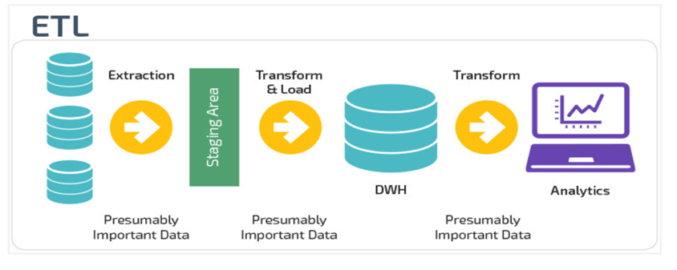

   2. #### ELT(Extract, Load, Transform)

      使用ELT，数据在从源数据池中提取后立即加载。没有专门的临时数据库（ODS），这意味着数据会立即加载到单一的集中存储库中。数据在数据仓库系统中进行转换，以便与商业智能工具（BI工具）一起使用。**大数据时代的数仓这个特点很明显。**

      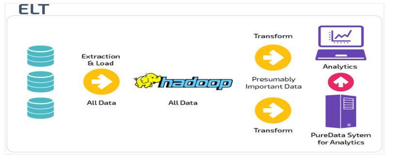

## II. Apache Hive

1. ### Hive简介

   1. #### 什么是Hive

      

      - Apache Hive是一款建立在Hadoop之上的开源**数据仓库**系统，可以将存储在Hadoop文件中的结构化、半结构化数据文件映射为一张数据库表，基于表提供了一种类似SQL的查询模型，称为Hive查询语言（HQL），用于访问和分析存储在Hadoop文件中的大型数据集。

      - Hive核心是将**HQL转换为MapReduce**程序，然后将程序提交到Hadoop群集执行。

      - Hive由**Facebook**实现并开源。

   2. #### 为什么使用Hive

      - 使用Hadoop MapReduce直接处理数据所面临的问题 

        人员**学习成本太高**, 需要掌握java语言

        **MapReduce实现复杂查询逻辑开发难度太大**

      - 使用Hive处理数据的**好处** 
        - 操作接口采用类SQL语法，提供快速开发的能力（**简单、容易上手**）
        - 避免直接写MapReduce，**减少**开发人员的**学习成本** 
        - 支持自定义函数，**功能扩展很方便**
        - 背靠Hadoop，擅长存储分析**海量数据集**

2. ### Hive架构

   1. #### Hive架构图

      **文件和表之间的对应关系**是一种**映射**, 映射信息专业的叫法称之为**元数据信息**(metadata)

      Hive软件本身承担了**SQL语法解析编译成为MapReduce程序**的**功能职责**

      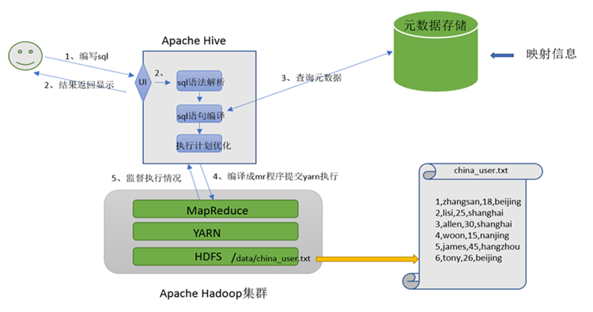

      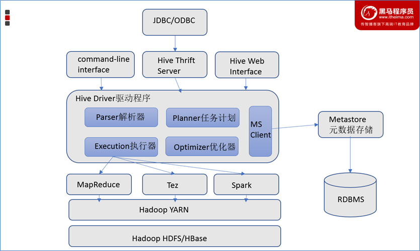

   2. #### Hive组件

      - ##### 用户接口

        包括 **CLI**、**JDBC**/**ODBC**、**WebGUI**。

        其中，CLI(command line interface)为shell命令行；Hive中的Thrift服务器允许外部客户端通过网络与Hive进行交互，类似于JDBC或ODBC协议。WebGUI是通过浏览器访问Hive。

      - ##### 元数据存储

        通常是存储在关系数据库如 mysql/derby中。Hive 中的元数据包括表的名字，表的列和分区及其属性，表的属性（是否为外部表等），表的数据所在目录等

      - ##### Driver驱动程序

        包括**语法解析器**, **计划编译器**, **优化器**, **执行器**

        完成HQL查询语句从词法分析, 语法分析, 编译, 优化以及查询计划的生成. 生成的查询计划存储在HDFS中, 并在随后由执行引擎调用执行

      - ##### 执行引擎

        Hive本身并**不直接处理数据文件**。而是**通过执行引擎处理**。当下Hive支持**MapReduce**、**Tez**、**Spark**3种执行引擎。

   3. #### Hive与Hadoop的关系

      - ##### 数据仓库软件, 至少需要具备以下两种能力:

        - **存储数据的能力**
        - **分析数据的能力**

      - ##### Hive是借助Hadoop实现了上述两种能力

        **Hive利用HDFS存储数据, 利用MapReduce查询分析数据**

      - Hive最大的魅力在于**用户专注于编写HQL, Hive帮助用户转换成MapReduce程序完成对数据的分析**

      

3. ### Hive与传统数据库(MySQL)对比

   - Hive虽然具有RDBMS数据库的外表，包括数据模型、SQL语法都十分相似，但应用场景却完全不同。

   - **Hive只适合用来做海量数据的离线分析。Hive的定位是数据仓库，面向分析的OLAP系统。**

   - 因此时刻告诉自己，**Hive不是大型数据库，也不是要取代MySQL承担业务数据处理**。

     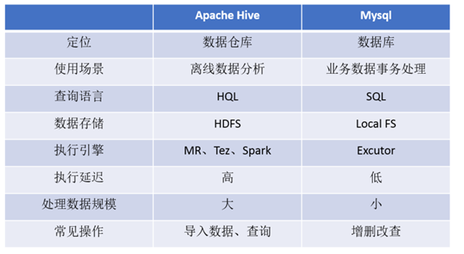

## III. Hive安装部署

1. ### metadata与metastore

   - **元数据（Metadata）**，又称中介数据、中继数据，为**描述数据的数据**（data about data），主要是描述数据属性（property）的信息，用来支持如指示存储位置、历史数据、资源查找、文件记录等功能。

     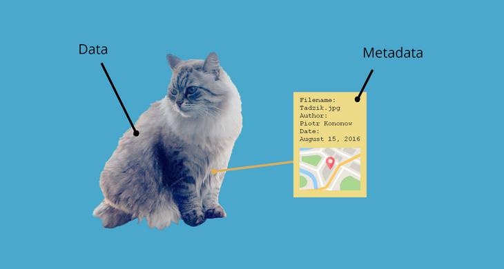

   - **Hive Metadata**: 

     - **Hive Metadata即Hive的元数据**。

     - 包含用Hive创建的database、table、表的位置、类型、属性，字段顺序类型等元信息。

     - 元数据存储在关系型数据库中。如hive内置的Derby、或者第三方如MySQL等。

   - **Hive Metastore**: 

     - Metastore即**元数据服务**。Metastore服务的作用是**管理metadata元数据**，对外暴露服务地址，让各种客户端通过连接metastore服务，由metastore再去连接MySQL数据库来存取元数据。

     - 有了metastore服务，就可以有多个客户端同时连接，而且这些客户端不需要知道MySQL数据库的用户名和密码，只需要连接metastore 服务即可。某种程度上也保证了hive元数据的安全。

       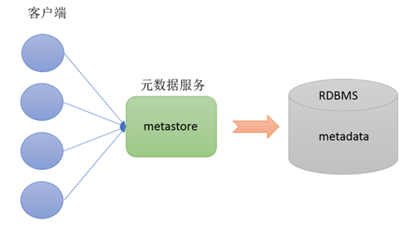

2. ### metastore三种配置方式

   - metastore服务配置有3种模式：**内嵌模式**、**本地模式**、**远程模式**。

   - 区分3种配置方式的关键是弄清楚两个问题：

     Metastore服务是否需要单独配置、单独启动？

     Metadata是存储在内置的derby中，还是第三方RDBMS,比如MySQL。

   - **本系列课程中使用企业推荐模式--远程模式部署**。

     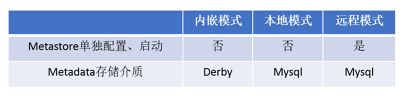

   1. #### 内嵌模式

      - **内嵌模式**（Embedded Metastore）是**metastore默认部署模式**。

      - 此种模式下，元数据存储在**内置的Derby数据库**，并且Derby数据库和metastore服务都嵌入在主HiveServer进程中，当启动HiveServer进程时，Derby和metastore都会启动。**不需要额外起Metastore服务**。

      - 但是一次只能支持一个活动用户，适用于测试体验，**不适用于生产环境**。

        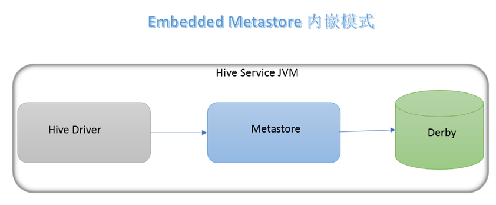

   2. #### 本地模式

      - **本地模式**（Local Metastore）下，**Metastore服务与主HiveServer进程在同一进程中运行**，但是存储元数据的数据库在单独的进程中运行，并且可以在单独的主机上。metastore服务将通过JDBC与metastore数据库进行通信。

      - 本地模式**采用外部数据库来存储元数据**，推荐使用MySQL。

      - hive根据hive.metastore.uris参数值来判断，如果为空，则为本地模式。

      - 缺点是：**每启动一次hive服务，都内置启动了一个metastore**。

        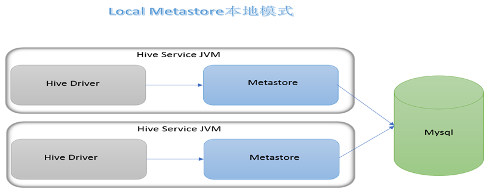

   3. #### 远程模式

      - **远程模式**（**Remote Metastore**）下，**Metastore服务在其自己的单独JVM上运行**，而不在HiveServer的JVM中运行。如果其他进程希望与Metastore服务器通信，则可以使用Thrift Network API进行通信。

      - 远程模式下，需要配置hive.metastore.uris参数来指定metastore服务运行的机器ip和端口，并且**需要单独手动启动metastore服务**。元数据也采用外部数据库来存储元数据，推荐使用MySQL。

      - 在生产环境中，建议用远程模式来配置Hive Metastore。在这种情况下，其他依赖hive的软件都可以通过Metastore访问hive。由于还可以完全屏蔽数据库层，因此这也带来了更好的可管理性/安全性。

        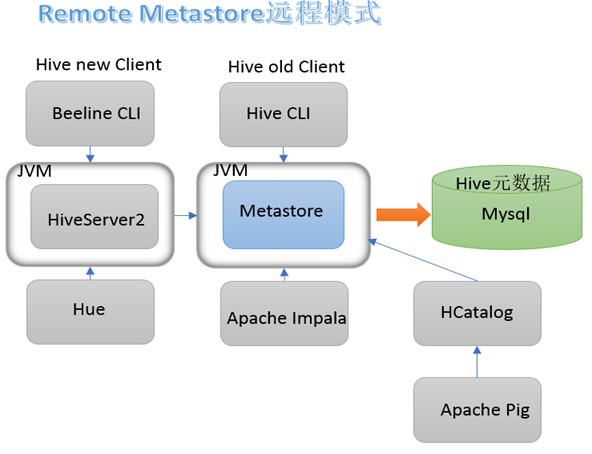

3. ### Hive metastore远程模式与安装部署

   安装前准备: 

   ```properties
   	由于Apache Hive是一款基于Hadoop的数据仓库软件，通常部署运行在Linux系统之上。因此不管使用何种方式配置Hive Metastore，必须要先保证服务器的基础环境正常，Hadoop集群健康可用。
   	服务器基础环境
   		集群时间同步、防火墙关闭、主机Host映射、免密登录、JDK安装
   	Hadoop集群健康可用
   		启动Hive之前必须先启动Hadoop集群。特别要注意，需等待HDFS安全模式关闭之后			再启动运行Hive。
   		Hive不是分布式安装运行的软件，其分布式的特性主要借由Hadoop完成。包括分布式	存储、分布式计算。
   ```

   1. #### Hadoop中添加用户代理配置

      

   2. #### 上传安装包并解压

      

   3. #### 修改配置文件hive-env.sh

      

   4. #### 添加配置文件hive-site.xml

      

   5. #### 上传MySQL驱动

      

   6. #### 初始化元数据

      

   7. #### 创建hive存储目录

      

4. ### metastore的启动方式

   

5. ### Hive Client与Beeline Client

   1. #### 第一代客户端Hive Client

      

   2. #### 第二代客户端Hive Beeline Client

      

