# Hive SQL- DDL, DML语法

## I. HQL数据定义语言(DDL)概述

### 1. DDL语法的作用

数据定义语言 (Data Definition Language, DDL)，是SQL语言集中对数据库内部的对象结构进行创建，删除，修改等的操作语言，这些数据库对象包括database（schema）、table、view、index等。核心语法由**CREATE**、**ALTER**与**DROP**三个所组成。DDL并不涉及表内部数据的操作。

在某些上下文中，该术语也称为数据描述语言，因为它描述了数据库表中的字段和记录。

```sql
create table uits
(id integer,
name char(20),
semester integer,
year integer);
```

### 2. Hive中DDL使用

Hive SQL（HQL）与SQL的语法大同小异，基本上是相通的，学过SQL的使用者可以无痛使用Hive SQL。只不过在学习HQL语法的时候，特别要注意Hive自己特有的语法知识点，比如partition相关的DDL操作。

基于Hive的设计、使用特点，**HQL中create语法（尤其create table）将是学习掌握DDL语法的重中之重**。可以说建表是否成功直接影响数据文件是否映射成功，进而影响后续是否可以基于SQL分析数据。通俗点说，没有表，表没有数据，你分析什么呢？

选择正确的方向,往往比盲目努力重要。

## II. Hive DDL建表基础

### 1. 完整建表语法树


> **蓝色**字体是建表语法的关键字，用于指定某些功能。

> **[ ]**中括号的语法表示可选。

> **|**表示使用的时候，左右语法二选一。

> 建表语句中的语法顺序要和上述语法规则保持一致。

### 2. Hive数据类型详解

#### 2.1. 整体概述

​	Hive中的数据类型指的是Hive表中的列字段类型。Hive数据类型整体分为两个类别：**原生数据类型**（primitive data type）和**复杂数据类型**（complex data type）。

​	原生数据类型包括：数值类型、时间类型、字符串类型、杂项数据类型；

​	复杂数据类型包括：array数组、map映射、struct结构、union联合体。


​	Hive的数据类型: 

 		1. 英文字母大小写不敏感
 		2. 除SQL数据类型外, 还支持Java数据类型, 比如String
 		3. int和string是使用最多的数据类型, 大多数函数都支持
 		4. 复杂数据类型的使用通常需要和分隔符指定语法配合使用
 		5. 如果定义的数据类型和文件不一致, hive会尝试隐式转换, 但是不保证成功

#### 2.2. 原生数据类型

Hive支持的原生数据类型如下图所示：


其中标注的数据类型是使用较多的，详细的描述请查询语法手册：

<https://cwiki.apache.org/confluence/display/Hive/LanguageManual+Types>

#### 2.3. 复杂数据类型

Hive支持的复杂数据类型如下图所示：


其中标注的数据类型是使用较多的，详细的描述请查询语法手册：

<https://cwiki.apache.org/confluence/display/Hive/LanguageManual+Types>

#### 2.4. 数据类型隐式, 显示转换

与SQL类似，HQL支持隐式和显式类型转换。 

原生类型从窄类型到宽类型的转换称为隐式转换，反之，则不允许。 

下表描述了类型之间允许的隐式转换：


<https://cwiki.apache.org/confluence/display/Hive/LanguageManual+Types>

显式类型转换使用CAST函数。

例如，CAST（'100'as INT）会将100字符串转换为100整数值。 如果强制转换失败，例如CAST（'INT'as INT），该函数返回NULL。

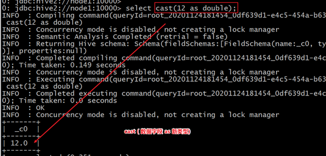

### 3. Hive读写文件机制

#### 3.1. SerDe是什么

SerDe是Serializer、Deserializer的简称，目的是用于序列化和反序列化。序列化是对象转化为字节码的过程；而反序列化是字节码转换为对象的过程。

Hive使用SerDe（和FileFormat）读取和写入行对象。


需要注意的是，“key”部分在读取时会被忽略，而在写入时key始终是常数。基本上**行对象存储在“value”中**。

可以通过desc formatted tablename查看表的相关SerDe信息。默认如下：


#### 3.2. Hive读写文件流程

**Hive读取文件机制**：首先调用InputFormat（默认TextInputFormat），返回一条一条kv键值对记录（默认是一行对应一条记录）。然后调用SerDe（默认LazySimpleSerDe）的Deserializer，将一条记录中的value根据分隔符切分为各个字段。

**Hive写文件机制**：将Row写入文件时，首先调用SerDe（默认LazySimpleSerDe）的Serializer将对象转换成字节序列，然后调用OutputFormat将数据写入HDFS文件中。

#### 3.3. SerDe相关语法

在Hive的建表语句中，和SerDe相关的语法为：


其中ROW FORMAT是语法关键字，DELIMITED和SERDE二选其一。

如果使用delimited表示使用默认的LazySimpleSerDe类来处理数据。如果数据文件格式比较特殊可以使用ROW FORMAT SERDE serde_name指定其他的Serde类来处理数据,甚至支持用户自定义SerDe类。

#### 3.4. LazySimpleSerDe分隔符指定

LazySimpleSerDe是Hive默认的序列化类，包含4种子语法，分别用于指定**字段之间**、**集合元素之间**、**map映射 kv之间**、**换行**的分隔符号。在建表的时候可以根据数据的特点灵活搭配使用。


#### 3.5. 默认分隔符

hive建表时如果没有row
format语法。此时**字段之间默认的分割符是'\001'**，是一种特殊的字符，使用的是ascii编码的值，键盘是打不出来的。


在vim编辑器中，连续按下Ctrl+v/Ctrl+a即可输入'\001' ，显示**^A**


在一些文本编辑器中将以SOH的形式显示：


### 4. Hive数据存储路径

#### 4.1. 默认存储路径

Hive表默认存储路径是由${HIVE_HOME}/conf/hive-site.xml配置文件的hive.metastore.warehouse.dir属性指定。默认值是：/user/hive/warehouse。


在该路径下，文件将根据所属的库、表，有规律的存储在对应的文件夹下。


#### 4.2. 指定存储路径

在Hive建表的时候，可以通过**location语法来更改数据在HDFS上的存储路径**，使得建表加载数据更加灵活方便。

语法：

```sql
LOCATION '<hdfs_location>'
```

对于已经生成好的数据文件，使用location指定路径将会很方便。

### 5. 案例: 王者荣耀

#### 5.1. 原生数据类型案例

文件archer.txt中记录了手游《王者荣耀》射手的相关信息，内容如下所示，其中字段之间分隔符为制表符\t,要求在Hive中建表映射成功该文件。

```shell
1	后羿	5986	1784	396	336	remotely	archer
2	马可波罗	5584	200	362	344	remotely	archer
3	鲁班七号	5989	1756	400	323	remotely	archer
4	李元芳	5725	1770	396	340	remotely	archer
5	孙尚香	6014	1756	411	346	remotely	archer
6	黄忠	5898	1784	403	319	remotely	archer
7	狄仁杰	5710	1770	376	338	remotely	archer
8	虞姬	5669	1770	407	329	remotely	archer
9	成吉思汗	5799	1742	394	329	remotely	archer
10	百里守约	5611	1784	410	329	remotely	archer	assassin
```

字段含义：id、name（英雄名称）、hp_max（最大生命）、mp_max（最大法力）、attack_max（最高物攻）、defense_max（最大物防）、attack_range（攻击范围）、role_main（主要定位）、role_assist（次要定位）。

分析一下：字段都是基本类型，字段的顺序需要注意一下。字段之间的分隔符是制表符，需要使用row format语法进行指定。

**建表语句**: 

```sql
--创建数据库并切换使用
create database itcast;
use itcast;

--ddl create table
create table t_archer(
    id int comment "ID",
    name string comment "英雄名称",
    hp_max int comment "最大生命",
    mp_max int comment "最大法力",
    attack_max int comment "最高物攻",
    defense_max int comment "最大物防",
    attack_range string comment "攻击范围",
    role_main string comment "主要定位",
    role_assist string comment "次要定位"
) comment "王者荣耀射手信息"
row format delimited fields terminated by "\t";
```

建表成功之后，在Hive的默认存储路径下就生成了表对应的文件夹，把archer.txt文件上传到对应的表文件夹下。

```shell
hadoop fs -put archer.txt  /user/hive/warehouse/honor_of_kings.db/t_archer
```

执行查询操作，可以看出数据已经映射成功。

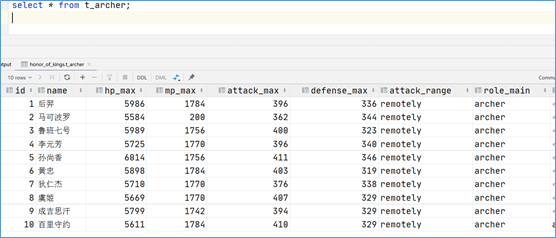

#### 5.2. 复杂数据类型案例

文件hot_hero_skin_price.txt中记录了手游《王者荣耀》热门英雄的相关皮肤价格信息，内容如下,要求在Hive中建表映射成功该文件。

```shell
1,孙悟空,53,西部大镖客:288-大圣娶亲:888-全息碎片:0-至尊宝:888-地狱火:1688
2,鲁班七号,54,木偶奇遇记:288-福禄兄弟:288-黑桃队长:60-电玩小子:2288-星空梦想:0
3,后裔,53,精灵王:288-阿尔法小队:588-辉光之辰:888-黄金射手座:1688-如梦令:1314
4,铠,52,龙域领主:288-曙光守护者:1776
5,韩信,52,飞衡:1788-逐梦之影:888-白龙吟:1188-教廷特使:0-街头霸王:888
```

字段：id、name（英雄名称）、win_rate（胜率）、skin_price（皮肤及价格）

分析一下：前3个字段原生数据类型、最后一个字段复杂类型map。需要指定字段之间分隔符、集合元素之间分隔符、map kv之间分隔符。

**建表语句**：

```sql
create table t_hot_hero_skin_price(
    id int,
    name string,
    win_rate int,
    skin_price map<string,int>
)
row format delimited
fields terminated by ','
collection items terminated by '-'
map keys terminated by ':' ;
```

建表成功后，把hot_hero_skin_price.txt文件上传到对应的表文件夹下。

```shell
hadoop fs -put hot_hero_skin_price.txt /user/hive/warehouse/honor_of_kings.db/t_hot_hero_skin_price
```

执行查询操作，可以看出数据已经映射成功。


#### 5.3. 默认分隔符案例

文件team_ace_player.txt中记录了手游《王者荣耀》主要战队内最受欢迎的王牌选手信息，内容如下,要求在Hive中建表映射成功该文件。


字段：id、team_name（战队名称）、ace_player_name（王牌选手名字）

分析一下：数据都是原生数据类型，且字段之间分隔符是\001，因此在建表的时候可以省去row format语句，因为hive默认的分隔符就是\001。

**建表语句**：

```sql
create table t_team_ace_player(
    id int,
    team_name string,
    ace_player_name string
);
```

建表成功后，把team_ace_player.txt文件上传到对应的表文件夹下。

```shell
hadoop fs -put team_ace_player.txt /user/hive/warehouse/honor_of_kings.db/t_team_ace_player
```

执行查询操作，可以看出数据已经映射成功。


## III. Hive DDL建表高阶

### 1. Hive内, 外部表

#### 1.1. 什么是内部表

**内部表（Internal table）**也称为被Hive拥有和管理的托管表（Managed table）。默认情况下创建的表就是内部表，Hive拥有该表的结构和文件。换句话说，Hive完全管理表（元数据和数据）的生命周期，类似于RDBMS中的表。

当删除内部表时，它会删除数据以及表的元数据。

```sql
create table student(
    num int,
    name string,
    sex string,
    age int,
    dept string) 
row format delimited 
fields terminated by ',';
```

#### 1.2. 什么是外部表

**外部表（External table）**中的数据不是Hive拥有或管理的，只管理表元数据的生命周期。要创建一个外部表，需要使用EXTERNAL语法关键字。

删除外部表只会删除元数据，而不会删除实际数据。在Hive外部仍然可以访问实际数据。

而且外部表更为方便的是可以搭配location语法指定数据的路径。

```sql
create external table student_ext(
    num int,
    name string,
    sex string,
    age int,
    dept string)
row format delimited
fields terminated by ','
location '/stu';
```

#### 1.3. 内部表, 外部表差异

无论内部表还是外部表，Hive都在Hive Metastore中管理表定义及其分区信息。删除内部表会从Metastore中删除表元数据，还会从HDFS中删除其所有数据/文件。

**删除外部表，只会从Metastore中删除表的元数据**，并保持HDFS位置中的实际数据不变。

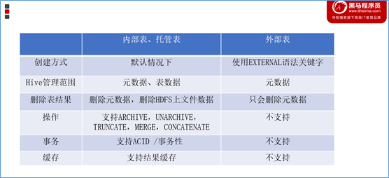

#### 1.4. 如何选择内部表, 外部表

当需要通过Hive完全管理控制表的整个生命周期时，请使用内部表。

当文件已经存在或位于远程位置时，请使用外部表，因为即使删除表，文件也会被保留。

### 2. Hive分区表

#### 2.1. 分区表的引入与产生背景

现有6份数据文件，分别记录了《王者荣耀》中6种位置的英雄相关信息。现要求通过建立一张表**t_all_hero**，把6份文件同时映射加载。

```sql
create table t_all_hero(
    id int,
    name string,
    hp_max int,
    mp_max int,
    attack_max int,
    defense_max int,
    attack_range string,
    role_main string,
    role_assist string
)
row format delimited
fields terminated by "\t";
```

加载数据文件到HDFS指定路径下：


现要求查询role_main主要定位是射手并且hp_max最大生命大于6000的有几个，sql语句如下：

```sql
select count(*) from t_all_hero where role_main="archer" and hp_max >6000;
```

where语句的背后需要进行全表扫描才能过滤出结果，对于hive来说需要扫描表下面的每一个文件。如果数据文件特别多的话，效率很慢也没必要。本需求中，只需要扫描archer.txt文件即可，需要优化可以加快查询，减少全表扫描.

#### 2.2. 分区表的概念与创建

当Hive表对应的数据量大、文件多时，为了避免查询时全表扫描数据，Hive支持根据用户指定的字段进行分区，分区的字段可以是日期、地域、种类等具有标识意义的字段。比如把一整年的数据根据月份划分12个月（12个分区），后续就可以查询指定月份分区的数据，尽可能避免了全表扫描查询。


分区表建表语法:

```sql
CREATE TABLE table_name (column1 data_type, column2 data_type) PARTITIONED BY (partition1 data_type, partition2 data_type,….);
```

针对《王者荣耀》英雄数据，重新创建一张分区表**t_all_hero_part**，以role角色作为分区字段。

```sql
create table t_all_hero_part(
       id int,
       name string,
       hp_max int,
       mp_max int,
       attack_max int,
       defense_max int,
       attack_range string,
       role_main string,
       role_assist string
) partitioned by (role string)
row format delimited
fields terminated by "\t";
```

需要注意：**分区字段不能是表中已经存在的字段**，因为分区字段最终也会以虚拟字段的形式显示在表结构上。


#### 2.3. 分区表数据加载--静态分区(手动分区)

所谓**静态分区**指的是分区的字段值是由用户在加载数据的时候手动指定的。

语法如下：

```sql
load data [local] inpath ' ' into table tablename partition(分区字段='分区值'...);
```

Local表示数据是位于本地文件系统还是HDFS文件系统。关于load语句后续详细展开讲解。

静态加载数据操作如下，文件都位于Hive服务器所在机器本地文件系统上。


```sql
load data local inpath '/root/hivedata/archer.txt' into table t_all_hero_part partition(role='sheshou');
load data local inpath '/root/hivedata/assassin.txt' into table t_all_hero_part partition(role='cike');
load data local inpath '/root/hivedata/mage.txt' into table t_all_hero_part partition(role='fashi');
load data local inpath '/root/hivedata/support.txt' into table t_all_hero_part partition(role='fuzhu');
load data local inpath '/root/hivedata/tank.txt' into table t_all_hero_part partition(role='tanke');
load data local inpath '/root/hivedata/warrior.txt' into table t_all_hero_part partition(role='zhanshi');
```

#### 2.4. 分区表数据加载--动态分区

往hive分区表中插入加载数据时，如果需要创建的分区很多，则需要复制粘贴修改很多sql去执行，效率低。因为hive是批处理系统，所以hive提供了一个动态分区功能，其可以基于查询参数的位置去推断分区的名称，从而建立分区。

所谓**动态分区**指的是分区的字段值是基于查询结果自动推断出来的。核心语法就是insert+select。

启用hive动态分区，需要在hive会话中设置两个参数：

> **set hive.exec.dynamic.partition=true;**
>
> **set hive.exec.dynamic.partition.mode=nonstrict;**

第一个参数表示开启动态分区功能，第二个参数指定动态分区的模式。分为nonstick非严格模式和strict严格模式。strict严格模式要求至少有一个分区为静态分区。

创建一张新的分区表**t_all_hero_part_dynamic**:

```sql
create table t_all_hero_part_dynamic(
         id int,
         name string,
         hp_max int,
         mp_max int,
         attack_max int,
         defense_max int,
         attack_range string,
         role_main string,
         role_assist string
) partitioned by (role string)
row format delimited
fields terminated by "\t";
```

执行动态分区插入

```sql
insert into table t_all_hero_part_dynamic partition(role) select tmp.*,tmp.role_main from t_all_hero tmp;
```

动态分区插入时，分区值是根据查询返回字段位置自动推断的。

#### 2.5. 分区表的本质

外表上看起来分区表好像没多大变化，只不过多了一个分区字段。实际上在底层管理数据的方式发生了改变。这里直接去HDFS查看区别。

非分区表：**t_all_hero**

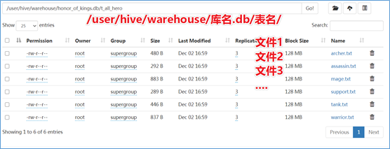

分区表：**t_all_hero_part**


分区的概念提供了一种将Hive表数据分离为多个文件/目录的方法。**不同分区对应着不同的文件夹，同一分区的数据存储在同一个文件夹下**。只需要根据分区值找到对应的文件夹，扫描本分区下的文件即可，避免全表数据扫描。

#### 2.6. 分区表的使用

分区表的使用重点在于：

一、建表时根据业务场景设置合适的分区字段。比如日期、地域、类别等；

二、查询的时候尽量先使用where进行分区过滤，查询指定分区的数据，避免全表扫描。

比如：查询英雄主要定位是射手并且最大生命大于6000的个数。使用分区表查询和使用非分区表进行查询，SQL如下：

```sql
--非分区表 全表扫描过滤查询
select count(*) from t_all_hero where role_main="archer" and hp_max >6000;
--分区表 先基于分区过滤 再查询
select count(*) from t_all_hero_part where role="sheshou" and hp_max >6000;
```

#### 2.7. 分区表的注意事项

1. 分区表不是建表的必要语法规则, 是一种**优化手段**表, 可选
2. **分区字段不能是表中已有的字段, 不能重复**
3. 分区字段是**虚拟字段**, 其数据并不存储在底层的文件中
4. 分区字段值的确定来自于用户价值数据手动指定(**静态分区**)或者根据查询结果自动推断(**动态分区**)
5. Hive支持**多重分区**, 在分区的基础上继续分区, 划分更加细的粒度

#### 2.8. 多重分区表

通过建表语句中关于分区的相关语法可以发现，Hive支持多个分区字段：PARTITIONED BY (partition1 data_type, partition2 data_type,….)。

多重分区下，**分区之间是一种递进关系，可以理解为在前一个分区的基础上继续分区**。从HDFS的角度来看就是**文件夹下继续划分子文件夹**。比如：把全国人口数据首先根据省进行分区，然后根据市进行划分，如果你需要甚至可以继续根据区县再划分，此时就是3分区表。

```sql
--单分区表，按省份分区
create table t_user_province (id int, name string,age int) partitioned by (province string);

--双分区表，按省份和市分区
create table t_user_province_city (id int, name string,age int) partitioned by (province string, city string);

--三分区表，按省份、市、县分区
create table t_user_province_city_county (id int, name string,age int) partitioned by (province string, city string,county string);
```

多分区表的数据插入和查询使用

```sql
load data local inpath '文件路径' into table t_user_province partition(province='shanghai');

load data local inpath '文件路径' into table t_user_province_city_county partition(province='zhejiang',city='hangzhou',county='xiaoshan');

select * from t_user_province_city_county where province='zhejiang' and city='hangzhou';
```

### 3. Hive分桶表

#### 3.1. 分桶表的概念

分桶表也叫做桶表，源自建表语法中bucket单词。是一种用于优化查询而设计的表类型。该功能可以让数据分解为若干个部分易于管理。

在分桶时，我们要指定根据哪个字段将数据分为几桶（几个部分）。默认规则是：Bucket number = hash_function(bucketing_column) mod num_buckets。

可以发现桶编号相同的数据会被分到同一个桶当中。hash_function取决于分桶字段bucketing_column的类型：

如果是int类型，hash_function(int) == int;

如果是其他类型，比如bigint,string或者复杂数据类型，hash_function比较棘手，将是从该类型派生的某个数字，比如hashcode值。

#### 3.2. 分桶表的语法

```sql
--分桶表建表语句
CREATE [EXTERNAL] TABLE [db_name.]table_name
[(col_name data_type, ...)]
CLUSTERED BY (col_name)
INTO N BUCKETS;
```

其中CLUSTERED BY (col_name)表示根据哪个字段进行分；

INTO N BUCKETS表示分为几桶（也就是几个部分）。

需要注意的是，**分桶的字段必须是表中已经存在的字段**。

#### 3.3. 分桶表的创建

现有美国2021-1-28号，各个县county的新冠疫情累计案例信息，包括确诊病例和死亡病例，数据格式如下所示：

```shell
2021-01-28,Juneau City and Borough,Alaska,02110,1108,3
2021-01-28,Kenai Peninsula Borough,Alaska,02122,3866,18
2021-01-28,Ketchikan Gateway Borough,Alaska,02130,272,1
2021-01-28,Kodiak Island Borough,Alaska,02150,1021,5
2021-01-28,Kusilvak Census Area,Alaska,02158,1099,3
2021-01-28,Lake and Peninsula Borough,Alaska,02164,5,0
2021-01-28,Matanuska-Susitna Borough,Alaska,02170,7406,27
2021-01-28,Nome Census Area,Alaska,02180,307,0
2021-01-28,North Slope Borough,Alaska,02185,973,3
2021-01-28,Northwest Arctic Borough,Alaska,02188,567,1
2021-01-28,Petersburg Borough,Alaska,02195,43,0
```

字段含义如下：count_date（统计日期）,county（县）,state（州）,fips（县编码code）,cases（累计确诊病例）,deaths（累计死亡病例）。

根据state州把数据分为5桶，建表语句如下：

```sql
CREATE TABLE itcast.t_usa_covid19(
    count_date string,
    county string,
    state string,
    fips int,
    cases int,
    deaths int)
CLUSTERED BY(state) INTO 5 BUCKETS;
```

在创建分桶表时，还可以指定分桶内的数据排序规则

```sql
--根据state州分为5桶 每个桶内根据cases确诊病例数倒序排序
CREATE TABLE itcast.t_usa_covid19_bucket_sort(
      count_date string,
      county string,
      state string,
      fips int,
      cases int,
      deaths int)
CLUSTERED BY(state) sorted by (cases desc) INTO 5 BUCKETS;
```

#### 3.4. 分桶表的数据加载

```sql
--step1:开启分桶的功能 从Hive2.0开始不再需要设置
set hive.enforce.bucketing=true;

--step2:把源数据加载到普通hive表中
CREATE TABLE itcast.t_usa_covid19(
       count_date string,
       county string,
       state string,
       fips int,
       cases int,
       deaths int)
row format delimited fields terminated by ",";
--将源数据上传到HDFS，t_usa_covid19表对应的路径下
hadoop fs -put us-covid19-counties.dat /user/hive/warehouse/itcast.db/t_usa_covid19

--step3:使用insert+select语法将数据加载到分桶表中
insert into t_usa_covid19_bucket select * from t_usa_covid19;
```

到HDFS上查看t_usa_covid19_bucket底层数据结构可以发现，数据被分为了5个部分。

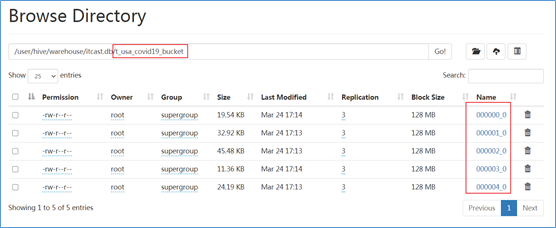

并且从结果可以发现，只要hash_function(bucketing_column)一样的，就一定被分到同一个桶中。

#### 3.5. 分桶表的使用好处

和非分桶表相比，分桶表的使用好处有以下几点：

1、基于分桶字段查询时，减少全表扫描

```sql
--基于分桶字段state查询来自于New York州的数据
--不再需要进行全表扫描过滤
--根据分桶的规则hash_function(New York) mod 5计算出分桶编号
--查询指定分桶里面的数据 就可以找出结果  此时是分桶扫描而不是全表扫描
select *
from t_usa_covid19_bucket where state="New York";
```

2、JOIN时可以提高MR程序效率，减少笛卡尔积数量

对于JOIN操作两个表有一个相同的列，如果对这两个表都进行了分桶操作。那么将保存相同列值的桶进行JOIN操作就可以，可以大大较少JOIN的数据量。

3、分桶表数据进行抽样

当数据量特别大时，对全体数据进行处理存在困难时，抽样就显得尤其重要了。抽样可以从被抽取的数据中估计和推断出整体的特性，是科学实验、质量检验、社会调查普遍采用的一种经济有效的工作和研究方法。

## IV. Hive DDL其他语法

### 1. Database|schema(数据库) DDL操作

#### 1.1. create database

Hive中DATABASE的概念和RDBMS中类似，我们称之为数据库。在Hive中， DATABASE和SCHEMA是可互换的，使用DATABASE或SCHEMA都可以。

```sql
CREATE (DATABASE|SCHEMA) [IF NOT EXISTS] database_name
[COMMENT database_comment]
[LOCATION hdfs_path]
[WITH DBPROPERTIES (property_name=property_value, ...)];
```

**COMMENT**：数据库的注释说明语句

**LOCATION**：指定数据库在HDFS存储位置，默认/user/hive/warehouse

**WITH DBPROPERTIES**：用于指定一些数据库的属性配置。

下面创建一个数据库：itheima

```sql
create database if not exists itheima
comment "this is my first db"
with dbproperties ('createdBy'='AllenWoon');
```


**注意：使用location指定路径的时候，最好是一个新创建的空文件夹。**

#### 1.2. describe database

Hive中的**DESCRIBE DATABASE**语句用于显示Hive中数据库的名称，其注释（如果已设置）及其在文件系统上的位置等信息。

```sql
DESCRIBE DATABASE/SCHEMA [EXTENDED] db_name;
```

**EXTENDED**：用于显示更多信息。


#### 1.3. use database

Hive中的**USE DATABASE**语句用于选择特定的数据库,切换当前会话使用哪一个数据库进行操作。

```sql
USE database_name;
```


#### 1.4. drop database

Hive中的**DROP DATABASE**语句用于删除（删除）数据库。

默认行为是RESTRICT，这意味着仅在数据库为空时才删除它。要删除带有表的数据库，我们可以使用**CASCADE**。

```sql
DROP (DATABASE|SCHEMA) [IF EXISTS] database_name [RESTRICT|CASCADE];
```

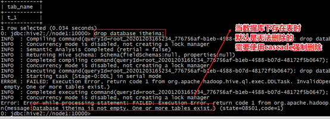

#### 1.5 alter database

Hive中的**ALTER DATABASE**语句用于更改与Hive中的数据库关联的元数据。

```sql
--更改数据库属性
ALTER (DATABASE|SCHEMA) database_name SET DBPROPERTIES (property_name=property_value, ...);

--更改数据库所有者
ALTER (DATABASE|SCHEMA) database_name SET OWNER [USER|ROLE] user_or_role;

--更改数据库位置
ALTER (DATABASE|SCHEMA) database_name SET LOCATION hdfs_path;
```


### 2. Table(表) DDL操作

#### 2.1. describe table

Hive中的**DESCRIBE table**语句用于显示Hive中表的元数据信息。

```sql
describe formatted [db_name.]table_name;
describe extended [db_name.]table_name;
```

如果指定了EXTENDED关键字，则它将以Thrift序列化形式显示表的所有元数据。如果指定了FORMATTED关键字，则它将以表格格式显示元数据。


#### 2.2. drop table

DROP TABLE删除该表的元数据和数据。如果已配置垃圾桶（且未指定PURGE），则该表对应的数据实际上将移动到.Trash/Current目录，而元数据完全丢失。删除EXTERNAL表时，该表中的数据不会从文件系统中删除，只删除元数据。

如果指定了PURGE，则表数据不会进入.Trash/Current目录，跳过垃圾桶直接被删除。因此如果DROP失败，则无法挽回该表数据。

```sql
DROP TABLE [IF EXISTS] table_name [PURGE];    -- (Note: PURGE available in Hive 0.14.0 and later)
```

#### 2.3. truncate table

从表中删除所有行。可以简单理解为清空表的所有数据但是保留表的元数据结构。如果HDFS启用了垃圾桶，数据将被丢进垃圾桶，否则将被删除。

```
`TRUNCATE [TABLE] table_name;`
```

#### 2.4. alter table

```sql
--1、更改表名
ALTER TABLE table_name RENAME TO new_table_name;
--2、更改表属性
ALTER TABLE table_name SET TBLPROPERTIES (property_name = property_value, ... );
--更改表注释
ALTER TABLE student SET TBLPROPERTIES ('comment' = "new comment for student table");
--3、更改SerDe属性
ALTER TABLE table_name SET SERDE serde_class_name [WITH SERDEPROPERTIES (property_name = property_value, ... )];
ALTER TABLE table_name [PARTITION partition_spec] SET SERDEPROPERTIES serde_properties;
ALTER TABLE table_name SET SERDEPROPERTIES ('field.delim' = ',');
--移除SerDe属性
ALTER TABLE table_name [PARTITION partition_spec] UNSET SERDEPROPERTIES (property_name, ... );

--4、更改表的文件存储格式 该操作仅更改表元数据。现有数据的任何转换都必须在Hive之外进行。
ALTER TABLE table_name  SET FILEFORMAT file_format;
--5、更改表的存储位置路径
ALTER TABLE table_name SET LOCATION "new location";

--6、更改列名称/类型/位置/注释
CREATE TABLE test_change (a int, b int, c int);
// First change column a's name to a1.
ALTER TABLE test_change CHANGE a a1 INT;
// Next change column a1's name to a2, its data type to string, and put it after column b.
ALTER TABLE test_change CHANGE a1 a2 STRING AFTER b;
// The new table's structure is:  b int, a2 string, c int.
// Then change column c's name to c1, and put it as the first column.
ALTER TABLE test_change CHANGE c c1 INT FIRST;
// The new table's structure is:  c1 int, b int, a2 string.
// Add a comment to column a1
ALTER TABLE test_change CHANGE a1 a1 INT COMMENT 'this is column a1';

--7、添加/替换列
--使用ADD COLUMNS，您可以将新列添加到现有列的末尾但在分区列之前。
--REPLACE COLUMNS 将删除所有现有列，并添加新的列集。
ALTER TABLE table_name ADD|REPLACE COLUMNS (col_name data_type,...);
```

### 3. Partition(分区) DDL操作

#### 3.1. add partition

分区值仅在为字符串时才应加引号。位置必须是数据文件所在的目录。

ADD PARTITION会更改表元数据，但不会加载数据。如果分区位置中不存在数据，查询将不会返回任何结果。

```sql
--1、增加分区
ALTER TABLE table_name ADD PARTITION (dt='20170101') location
    '/user/hadoop/warehouse/table_name/dt=20170101'; 
--一次添加一个分区

ALTER TABLE table_name ADD PARTITION (dt='2008-08-08', country='us') location '/path/to/us/part080808'
                       PARTITION (dt='2008-08-09', country='us') location '/path/to/us/part080809';  
--一次添加多个分区
```

#### 3.2. rename partition

```sql
--2、重命名分区
ALTER TABLE table_name PARTITION partition_spec RENAME TO PARTITION partition_spec;
ALTER TABLE table_name PARTITION (dt='2008-08-09') RENAME TO PARTITION (dt='20080809');
```

#### 3.3. delete partition

可以使用ALTER
TABLE DROP PARTITION删除表的分区。这将删除该分区的数据和元数据。

```sql
--3、删除分区
ALTER TABLE table_name DROP [IF EXISTS] PARTITION (dt='2008-08-08', country='us');
ALTER TABLE table_name DROP [IF EXISTS] PARTITION (dt='2008-08-08', country='us') PURGE; --直接删除数据 不进垃圾桶
```

#### 3.4. msck partition

Hive将每个表的分区列表信息存储在其metastore中。但是，如果将新分区直接添加到HDFS（例如通过使用hadoop fs -put命令）或从HDFS中直接删除分区文件夹，则除非用户ALTER TABLE table_name ADD/DROP PARTITION在每个新添加的分区上运行命令，否则metastore（也就是Hive）将不会意识到分区信息的这些更改。

但是，用户可以使用修复表选项运行metastore check命令。

```sql
--4、修复分区
MSCK [REPAIR] TABLE table_name [ADD/DROP/SYNC PARTITIONS];
```

MSC命令的默认选项是“添加分区”。使用此选项，它将把HDFS上存在但元存储中不存在的所有分区添加到元存储中。DROP PARTITIONS选项将从已经从HDFS中删除的metastore中删除分区信息。SYNC PARTITIONS选项等效于调用ADD和DROP PARTITIONS。

如果存在大量未跟踪的分区，则可以批量运行MSCK REPAIR TABLE，以避免OOME（内存不足错误）。

#### 3.5. alter partition

```sql
--5、修改分区
--更改分区文件存储格式
ALTER TABLE table_name PARTITION (dt='2008-08-09') SET FILEFORMAT file_format;
--更改分区位置
ALTER TABLE table_name PARTITION (dt='2008-08-09') SET LOCATION "new location";
```

## V. Hive Show显示语法

Show相关的语句提供了一种查询Hive metastore的方法。可以帮助用户查询相关信息。

```sql
--1、显示所有数据库 SCHEMAS和DATABASES的用法 功能一样
show databases;
show schemas;

--2、显示当前数据库所有表/视图/物化视图/分区/索引
show tables;
SHOW TABLES [IN database_name]; --指定某个数据库

--3、显示当前数据库下所有视图
Show Views;
SHOW VIEWS 'test_*'; -- show all views that start with "test_"
SHOW VIEWS FROM test1; -- show views from database test1
SHOW VIEWS [IN/FROM database_name];

--4、显示当前数据库下所有物化视图
SHOW MATERIALIZED VIEWS [IN/FROM database_name];

--5、显示表分区信息，分区按字母顺序列出，不是分区表执行该语句会报错
show partitions table_name;

--6、显示表/分区的扩展信息
SHOW TABLE EXTENDED [IN|FROM database_name] LIKE table_name;
show table extended like student;

--7、显示表的属性信息
SHOW TBLPROPERTIES table_name;
show tblproperties student;

--8、显示表、视图的创建语句
SHOW CREATE TABLE ([db_name.]table_name|view_name);
show create table student;

--9、显示表中的所有列，包括分区列。
SHOW COLUMNS (FROM|IN) table_name [(FROM|IN) db_name];
show columns  in student;

--10、显示当前支持的所有自定义和内置的函数
show functions;

--11、Describe desc
--查看表信息
desc extended table_name;
--查看表信息（格式化美观）
desc formatted table_name;
--查看数据库相关信息
describe database database_name;
```

## VI. HQL数据操作语言(DML)

### 1. DML-Load加载数据

#### 1.1. 背景

回想一下，当在Hive中创建好表之后，默认就会在HDFS上创建一个与之对应的文件夹，默认路径是由参数hive.metastore.warehouse.dir控制，默认值是/user/hive/warehouse。


要想让hive的表和结构化的数据文件产生映射，就需要把文件移到到表对应的文件夹下面，当然，可以在建表的时候使用location语句指定数据文件的路径。但是不管路径在哪里，必须把数据文件移动到对应的路径下面。

最原始暴力直接的方式就是使用hadoop fs –put等方式将数据移动到路径下面。

Hive官方推荐使用Load命令将数据加载到表中。

#### 1.2. Load语法

在将数据load加载到表中时，Hive不会进行任何转换。

加载操作是将数据文件移动到与Hive表对应的位置的纯复制/移动操作。

```sql
LOAD DATA [LOCAL] INPATH 'filepath' [OVERWRITE] INTO TABLE tablename [PARTITION (partcol1=val1, partcol2=val2 ...)]

LOAD DATA [LOCAL] INPATH 'filepath' [OVERWRITE] INTO TABLE tablename [PARTITION (partcol1=val1, partcol2=val2 ...)] [INPUTFORMAT 'inputformat' SERDE 'serde'] (3.0 or later)
```

1. ##### filepath

   filepath表示的待移动数据的路径，可以引用一个文件（在这种情况下，Hive将文件移动到表中），也可以是一个目录（在这种情况下，Hive将把该目录中的所有文件移动到表中）。

   相对路径，例如：project/data1 

   绝对路径，例如：/user/hive/project/data1 

   具有schema的完整URI，例如：hdfs://namenode:9000/user/hive/project/data1

2. ##### LOCAL

   如果指定了LOCAL， load命令将在本地文件系统中查找文件路径。如果指定了相对路径，它将相对于用户的当前工作目录进行解释。用户也可以为本地文件指定完整的URI-例如：<file:///user/hive/project/data1>。

   注意，如果对HiveServer2服务运行此命令。这里的**本地文件系统指的是Hiveserver2服务所在机器的本地Linux文件系统**，不是Hive客户端所在的本地文件系统。

   如果没有指定LOCAL关键字，如果filepath指向的是一个完整的URI，hive会直接使用这个URI。 否则如果没有指定schema或者authority，Hive会使用在hadoop配置文件中定义的schema 和 authority，即参数fs.default.name指定的（不出意外，都是HDFS）。 

3. ##### OVERWRITE

   如果使用了OVERWRITE关键字，则目标表（或者分区）中的内容会被删除，然后再将 filepath 指向的文件/目录中的内容添加到表/分区中。

#### 1.3. 案例: Load加载数据到Hive表

```sql
--------练习:Load Data From Local FS or HDFS------
--step1:建表
--建表student_local 用于演示从本地加载数据
create table student_local(num int,name string,sex string,age int,dept string) row format delimited fields terminated by ',';
--建表student_HDFS  用于演示从HDFS加载数据
create external table student_HDFS(num int,name string,sex string,age int,dept string) row format delimited fields terminated by ',';
--建表student_HDFS_p 用于演示从HDFS加载数据到分区表
create table student_HDFS_p(num int,name string,sex string,age int,dept string) partitioned by(country string) row format delimited fields terminated by ',';

--建议使用beeline客户端 可以显示出加载过程日志信息
--step2:加载数据
-- 从本地加载数据  数据位于HS2（node1）本地文件系统  本质是hadoop fs -put上传操作
LOAD DATA LOCAL INPATH '/root/hivedata/students.txt' INTO TABLE student_local;

--从HDFS加载数据  数据位于HDFS文件系统根目录下  本质是hadoop fs -mv 移动操作
--先把数据上传到HDFS上  hadoop fs -put /root/hivedata/students.txt /
LOAD DATA INPATH '/students.txt' INTO TABLE student_HDFS;

----从HDFS加载数据到分区表中并制定分区  数据位于HDFS文件系统根目录下
--先把数据上传到HDFS上 hadoop fs -put /root/hivedata/students.txt /
LOAD DATA INPATH '/students.txt' INTO TABLE student_HDFS_p partition(country ="CHina");
```

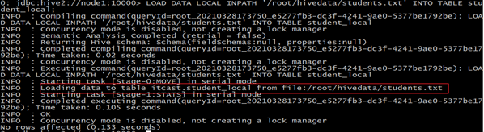

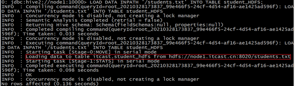


### 2. DML-Insert插入数据

#### 2.1. 背景: RDBMS中insert使用(insert+values)

在MySQL这样的RDBMS中，通常是insert+values的方式来向表插入数据，并且速度很快。这也是RDBMS中插入数据的核心方式。

```sql
INSERT INTO table_name ( field1, field2,...fieldN )
VALUES
(value1, value2,...valueN);
```

假如说对Hive的定位不清，把Hive当成RDBMS来使用，也使用insert+values的方式插入数据，会如何呢？

```sql
--hive中insert+values
create table t_test_insert(id int,name string,age int);
insert into table t_test_insert values(1,"allen",18);
```

你会发现执行过程非常非常慢，底层是使用MapReduce把数据写入HDFS的。

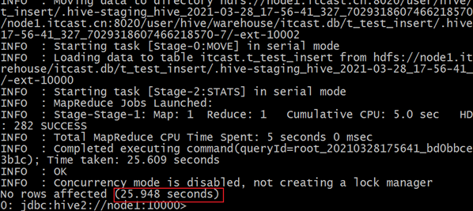

试想一下，如何在Hive中这样玩，对于大数据分析，海量数据一条条插入是不是非常刺激。因此在Hive中我们通过将数据清洗成为结构化文件，再Load加载到表中。

​       但是并不意味着insert语法在Hive中没有使用地位了，通常在Hive中我们使用insert+select语句。即插入表的数据来自于后续select查询语句返回的结果。

#### 2.2. insert+select

Hive中insert主要是结合select查询语句使用，将查询结果插入到表中，例如：

```sql
INSERT OVERWRITE TABLE tablename1 [PARTITION (partcol1=val1, partcol2=val2 ...) [IF NOT EXISTS]] select_statement1 FROM from_statement;

INSERT INTO TABLE tablename1 [PARTITION (partcol1=val1, partcol2=val2 ...)] select_statement1 FROM from_statement;
```

INSERT OVERWRITE将覆盖表或分区中的任何现有数据。

需要保证查询结果列的数目和需要插入数据表格的列数目一致。

如果查询出来的数据类型和插入表格对应的列数据类型不一致，将会进行转换，但是不能保证转换一定成功，转换失败的数据将会为NULL。

```sql
--step1:创建一张源表student
drop table if exists student;
create table student(num int,name string,sex string,age int,dept string)
row format delimited
fields terminated by ',';
--加载数据
load data local inpath '/root/hivedata/students.txt' into table student;

--step2：创建一张目标表  只有两个字段
create table student_from_insert(sno int,sname string);
--使用insert+select插入数据到新表中
insert into table student_from_insert select num,name from student;

select *
from student_insert1;
```

#### 2.3. multiple inserts 多重插入

multiple inserts可以翻译成为多次插入，多重插入，核心是：一次扫描，多次插入。其功能也体现出来了就是减少扫描的次数。

```sql
------------multiple inserts----------------------
--当前库下已有一张表student
select * from student;
--创建两张新表
create table student_insert1(sno int);
create table student_insert2(sname string);
--多重插入
from student
insert overwrite table student_insert1
select num
insert overwrite table student_insert2
select name;
```

#### 2.4. dynamic partition insert 动态分区插入

1. 功能

   对于分区表的数据导入加载，最常见最基础的是通过load命令加载数据。如下：

   ```SQK
   create table student_HDFS_p(Sno int,Sname string,Sex string,Sage int,Sdept string) partitioned by(country string) row format delimited fields terminated by ',';
   --注意 分区字段country的值是在导入数据的时候手动指定的 China
   LOAD DATA INPATH '/students.txt' INTO TABLE student_HDFS_p partition(country ="China");
   
   ```

   接下来我们考虑一下性能问题：

   假如说现在有全球224个国家的人员名单（每个国家名单单独一个文件），让你导入数据到分区表中，不同国家不同分区，如何高效实现？使用load语法导入224次？

   再假如，现在有一份名单students.txt，内容如下：

   ```shell
   95001,李勇,男,20,CS
   95002,刘晨,女,19,IS
   95003,王敏,女,22,MA
   95004,张立,男,19,IS
   95005,刘刚,男,18,MA
   95006,孙庆,男,23,CS
   95007,易思玲,女,19,MA
   95008,李娜,女,18,CS
   95009,梦圆圆,女,18,MA
   95010,孔小涛,男,19,CS
   95011,包小柏,男,18,MA
   95012,孙花,女,20,CS
   95013,冯伟,男,21,CS
   95014,王小丽,女,19,CS
   95015,王君,男,18,MA
   95016,钱国,男,21,MA
   95017,王风娟,女,18,IS
   95018,王一,女,19,IS
   95019,邢小丽,女,19,IS
   95020,赵钱,男,21,IS
   95021,周二,男,17,MA
   95022,郑明,男,20,MA
   ```

   让你创建一张分区表，根据最后一个字段（选修专业）进行分区，同一个专业的同学分到同一个分区中，如何实现？如果还是load加载手动指定，即使最终可以成功，效率也是极慢的。

   为此，Hive提供了**动态分区插入**的语法。

   所谓动态分区插入指的是：**分区的值是由后续的select查询语句的结果来动态确定的。根据查询结果自动分区**。

2. 配置参数

   | hive.exec.dynamic.partition      | true   | 需要设置true为启用动态分区插入                               |
   | -------------------------------- | ------ | ------------------------------------------------------------ |
   | hive.exec.dynamic.partition.mode | strict | 在strict模式下，用户必须至少指定一个静态分区，以防用户意外覆盖所有分区；在nonstrict模式下，允许所有分区都是动态的 |

   关于严格模式、非严格模式，演示如下：

   ```sql
   FROM page_view_stg pvs
   INSERT OVERWRITE TABLE page_view PARTITION(dt='2008-06-08', country)
   SELECT pvs.viewTime, pvs.userid, pvs.page_url, pvs.referrer_url, null, null, pvs.ip, pvs.cnt
   
   --在这里，country分区将由SELECT子句（即pvs.cnt）的最后一列动态创建。
   --而dt分区是手动指定写死的。
   --如果是nonstrict模式下，dt分区也可以动态创建。
   ```

3. 案例: 动态分区插入

   ```sql
   --动态分区插入
   --1、首先设置动态分区模式为非严格模式 默认已经开启了动态分区功能
   set hive.exec.dynamic.partition = true;
   set hive.exec.dynamic.partition.mode = nonstrict;
   
   --2、当前库下已有一张表student
   select * from student;
   
   --3、创建分区表 以sdept作为分区字段
   --注意：分区字段名不能和表中的字段名重复。
   create table student_partition(Sno int,Sname string,Sex string,Sage int) partitioned by(Sdept string);
   
   --4、执行动态分区插入操作
   insert into table student_partition partition(Sdept)
   select Sno,Sname,Sex,Sage,Sdept from student;
   --其中，Sno,Sname,Sex,Sage作为表的字段内容插入表中
   --Sdept作为分区字段值
   ```

   最终执行结果如下，可以发现实现了自动分区：

   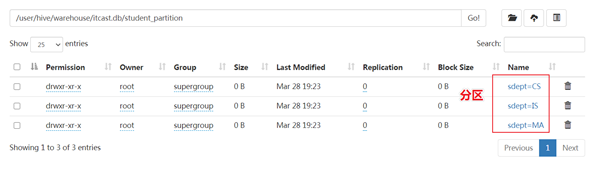

#### 2.5. insert+directory 导出数据

Hive支持将select查询的结果导出成文件存放在文件系统中。语法格式如下：

```sql
--标准语法:
INSERT OVERWRITE [LOCAL] DIRECTORY directory1
    [ROW FORMAT row_format] [STORED AS file_format] (Note: Only available starting with Hive 0.11.0)
SELECT ... FROM ...

--Hive extension (multiple inserts):
FROM from_statement
INSERT OVERWRITE [LOCAL] DIRECTORY directory1 select_statement1
[INSERT OVERWRITE [LOCAL] DIRECTORY directory2 select_statement2] ...

--row_format
: DELIMITED [FIELDS TERMINATED BY char [ESCAPED BY char]] [COLLECTION ITEMS TERMINATED BY char]
[MAP KEYS TERMINATED BY char] [LINES TERMINATED BY char]
```

注意，**导出操作是一个****OVERWRITE****覆盖操作。慎重。**

目录可以是完整的URI。如果未指定scheme或Authority，则Hive将使用hadoop配置变量fs.default.name中的方案和Authority，该变量指定Namenode URI。

如果使用LOCAL关键字，则Hive会将数据写入本地文件系统上的目录。

写入文件系统的数据被序列化为文本，列之间用^ A隔开，行之间用换行符隔开。如果任何列都不是原始类型，那么这些列将序列化为JSON格式。也可以在导出的时候指定分隔符换行符和文件格式。

```sql
--当前库下已有一张表student
select * from student;

--1、导出查询结果到HDFS指定目录下
insert overwrite directory '/tmp/hive_export/e1' select * from student;

--2、导出时指定分隔符和文件存储格式
insert overwrite directory '/tmp/hive_export/e2' row format delimited fields terminated by ','
stored as orc
select * from student;

--3、导出数据到本地文件系统指定目录下
insert overwrite local directory '/root/hive_export/e1' select * from student;
```

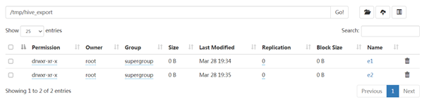

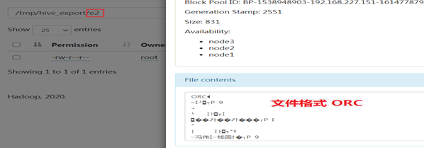