# Apache Hive DQL及其他

## I. HQL数据查询(DQL)语句

### 1. 基础查询

#### 1.1. 语法树

```sql
[WITH CommonTableExpression (, CommonTableExpression)*] 
SELECT [ALL | DISTINCT] select_expr, select_expr, ...
  FROM table_reference
  [WHERE where_condition]
  [GROUP BY col_list]
  [ORDER BY col_list]
  [CLUSTER BY col_list
    | [DISTRIBUTE BY col_list] [SORT BY col_list]
  ]
 [LIMIT [offset,] rows]
```

table_reference指示查询的输入。它可以是普通物理表，视图，join查询结果或子查询结果。

表名和列名不区分大小写。

#### 1.2. 案例: 美国Covid-19新冠select查询

在附件资料中有一份数据文件"us-covid19-counties.dat"，里面记录了2021-01-28美国各个县累计新冠确诊病例数和累计死亡病例数。

在Hive中创建表，加载该文件到表中：

```sql
--step1:创建普通表t_usa_covid19
drop table t_usa_covid19;
CREATE TABLE  t_usa_covid19(
       count_date string,
       county string,
       state string,
       fips int,
       cases int,
       deaths int)
row format delimited fields terminated by ",";
--将源数据load加载到t_usa_covid19表对应的路径下
load data local inpath '/root/hivedata/us-covid19-counties.dat' into table t_usa_covid19;

--step2:创建一张分区表 基于count_date日期,state州进行分区
CREATE TABLE itcast.t_usa_covid19_p(
     county string,
     fips int,
     cases int,
     deaths int)
partitioned by(count_date string,state string)
row format delimited fields terminated by ",";

--step3:使用动态分区插入将数据导入t_usa_covid19_p中
set hive.exec.dynamic.partition.mode = nonstrict;

insert into table t_usa_covid19_p partition (count_date,state)
select county,fips,cases,deaths,count_date,state from t_usa_covid19;
```

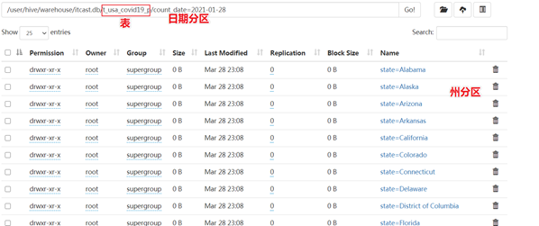

#### 1.3. select_expr

```sql
--select_expr
--查询所有字段或者指定字段
select * from t_usa_covid19_p;
select county, cases, deaths from t_usa_covid19_p;

--查询匹配正则表达式的所有字段
SET hive.support.quoted.identifiers = none; --带反引号的名称被解释为正则表达式
select `^c.*` from t_usa_covid19_p;
--查询当前数据库
select current_database(); --省去from关键字
--查询使用函数
select count(county) from t_usa_covid19_p;
```

#### 1.4. all/distinct

ALL和DISTINCT选项指定是否应返回重复的行。如果没有给出这些选项，则默认值为ALL（返回所有匹配的行）。DISTINCT指定从结果集中删除重复的行。

```sql
--ALL DISTINCT
--返回所有匹配的行
select state
from t_usa_covid19_p;
--相当于
select all state
from t_usa_covid19_p;
--返回所有匹配的行 去除重复的结果
select distinct state
from t_usa_covid19_p;
--多个字段distinct 整体去重
select distinct county,state from t_usa_covid19_p;
```

#### 1.5. where

WHERE条件是一个布尔表达式。在WHERE表达式中，您可以使用Hive支持的任何函数和运算符，但聚合函数除外。

从Hive 0.13开始，WHERE子句支持某些类型的子查询。

```sql
select * from t_usa_covid19_p where state ="California" and deaths > 1000;
select * from t_usa_covid19_p where 1 > 2;  -- 1 > 2 返回false
select * from t_usa_covid19_p where 1 = 1;  -- 1 = 1 返回true

--where条件中使用函数 找出州名字母超过10个
select * from t_usa_covid19_p where length(state) >10 ;

--WHERE子句支持子查询
SELECT *
FROM A
WHERE A.a IN (SELECT foo FROM B);

--where条件中不能使用聚合函数
--报错 SemanticException:Not yet supported place for UDAF 'sum'
select state,sum(deaths)
from t_usa_covid19_p where sum(deaths) >100 group by state;
```

**聚合函数要使用它的前提是结果集已经确定。而where子句还处于“确定”结果集的过程中，因而不能使用聚合函数**

#### 1.6. 分区查询, 分区裁剪

通常，SELECT查询将扫描整个表（所谓的全表扫描）。如果使用PARTITIONED BY子句创建的分区表，则在查询时可以指定分区查询，减少全表扫描，也叫做分区裁剪。

所谓分区裁剪指的是：对分区表进行查询时，会检查WHERE子句或JOIN中的ON子句中是否存在对分区字段的过滤，如果存在，则仅访问查询符合条件的分区，即裁剪掉没必要访问的分区。

```sql
--找出来自加州，累计死亡人数大于1000的县 state字段就是分区字段 进行分区裁剪 避免全表扫描
select * from t_usa_covid19_p where state ="California" and deaths > 1000;

--多分区裁剪
select * from t_usa_covid19_p where count_date = "2021-01-28" and state ="California" and deaths > 1000;
```

#### 1.7. group by

GROUP BY 语句用于结合聚合函数，根据一个或多个列对结果集进行分组。需要注意的是，出现在GROUP BY中select_expr的字段：**要么是GROUP BY分组的字段；要么是被聚合函数应用的字段。**原因很简单，避免出现一个字段多个值的歧义。

分组字段出现select_expr中，一定没有歧义，因为就是基于该字段分组的，同一组中必相同；被聚合函数应用的字段，也没歧义，因为聚合函数的本质就是多进一出，最终返回一个结果。

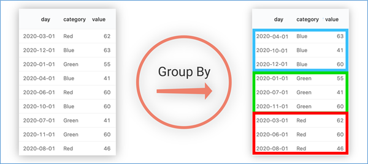

如上图所示，基于category进行分组，相同颜色的分在同一组中。

在select_expr中，如果出现category字段，则没有问题，因为同一组中category值一样，但是返回day就有问题了，day的结果不一样。

下面针对t_usa_covid19_p进行演示：

```sql
--根据state州进行分组

--SemanticException:Expression not in GROUP BY key 'deaths'
--deaths不是分组字段 报错
--state是分组字段 可以直接出现在select_expr中
select state,deaths
from t_usa_covid19_p where count_date = "2021-01-28" group by state;

--被聚合函数应用
select state,count(deaths)
from t_usa_covid19_p where count_date = "2021-01-28" group by state;

```

#### 1.8. having

在SQL中增加HAVING子句原因是，WHERE关键字无法与聚合函数一起使用。

HAVING子句可以让我们筛选分组后的各组数据,并且可以在Having中使用聚合函数，因为此时where，group by已经执行结束，结果集已经确定。

```sql
--having
--统计死亡病例数大于10000的州
--where语句中不能使用聚合函数 语法报错
select state,sum(deaths)
from t_usa_covid19_p
where count_date = "2021-01-28" and sum(deaths) >10000 group by state;

--先where分组前过滤（此处是分区裁剪），再进行group by分组（含聚合）， 分组后每个分组结果集确定 再使用having过滤
select state,sum(deaths)
from t_usa_covid19_p
where count_date = "2021-01-28"
group by state
having sum(deaths) > 10000;

--这样写更好 即在group by的时候聚合函数已经作用得出结果 having直接引用结果过滤 不需要再单独计算一次了
select state,sum(deaths) as cnts
from t_usa_covid19_p
where count_date = "2021-01-28"
group by state
having cnts> 10000;
```

having与where的区别:

having是在分组后对数据进行过滤

where是在分组前对数据进行过滤

having后面可以使用聚合函数

where后面不可以使用聚合

#### 1.9 limit

LIMIT子句可用于约束SELECT语句返回的行数。

LIMIT接受一个或两个数字参数，这两个参数都必须是非负整数常量。

第一个参数指定要返回的第一行的偏移量（从 Hive 2.0.0开始），第二个参数指定要返回的最大行数。当给出单个参数时，它代表最大行数，并且偏移量默认为0。

```sql
--limit
--没有限制返回2021.1.28 加州的所有记录
select * from t_usa_covid19_p
where count_date = "2021-01-28"
and state ="California";

--返回结果集的前5条
select * from t_usa_covid19_p
where count_date = "2021-01-28"
  and state ="California"
limit 5;

--返回结果集从第3行开始 共3行
select * from t_usa_covid19_p
where count_date = "2021-01-28"
  and state ="California"
limit 2,3; --注意 第一个参数偏移量是从0开始的
```

#### 1.10. Hive SQL查询执行顺序

```sql
SELECT [ALL | DISTINCT] select_expr, select_expr, ...
  FROM table_reference
  [WHERE where_condition]
  [GROUP BY col_list]
  [ORDER BY col_list]
  [CLUSTER BY col_list
    | [DISTRIBUTE BY col_list] [SORT BY col_list]
  ]
 [LIMIT [offset,] rows]
```

在查询过程中执行顺序：**from>where>group（含聚合）>having>order>select**。

所以聚合语句(sum,min,max,avg,count)要比having子句优先执行，而where子句在查询过程中执行优先级别优先于聚合语句(sum,min,max,avg,count)。

结合下面SQL感受一下：

```sql
select state,sum(deaths) as cnts
from t_usa_covid19_p
where count_date = "2021-01-28"
group by state
having cnts> 10000;
```

### 2. 高阶查询

#### 2.1. sort/order/cluster/distributed by

##### order by

ORDER BY [ASC|DESC]

Hive SQL中的ORDER BY语法类似于SQL语言中的ORDER BY语法。会对输出的结果进行全局排序，因此底层使用MapReduce引擎执行的时候，只会有一个reducetask执行。也因此，如果输出的行数太大，会导致需要很长的时间才能完成全局排序。

默认排序顺序为升序（ASC），也可以指定为DESC降序。

在Hive 2.1.0和更高版本中，支持在“ order by”子句中为每个列指定null类型结果排序顺序。ASC顺序的默认空排序顺序为NULLS FIRST，而DESC顺序的默认空排序顺序为NULLS LAST。

```sql
---order by
--根据字段进行排序
select * from t_usa_covid19_p
where count_date = "2021-01-28"
and state ="California"
order by deaths; --默认asc null first

select * from t_usa_covid19_p
where count_date = "2021-01-28"
and state ="California"
order by deaths desc; --指定desc null last

--强烈建议将LIMIT与ORDER BY一起使用。避免数据集行数过大
--当hive.mapred.mode设置为strict严格模式时，使用不带LIMIT的ORDER BY时会引发异常。
select * from t_usa_covid19_p
where count_date = "2021-01-28"
  and state ="California"
order by deaths desc
limit 3;
```

##### cluster by

SELECT expression… FROM table CLUSTER BY col_name;

Hive SQL中的**CLUSTER BY**语法可以指定根据后面的字段将数据分组，每组内再根据这个字段正序排序（不允许指定排序规则），概况起来就是：**根据同一个字段，分且排序**。

分组的规则hash散列。hash_func(col_name) % reduce task nums

分为几组取决于reduce task的个数。下面在Hive beeline客户端中针对student表进行演示。

```sql
--cluster by
select * from student;
--不指定reduce task个数
--日志显示：Number of reduce tasks not specified. Estimated from input data size: 1
select * from student cluster by num;

--手动设置reduce task个数
set mapreduce.job.reduces =2;
select * from student cluster by num;
```

假如说，现在想法如下：把学生表数据根据性别分为两个部分，每个分组内根据年龄的倒序排序。你会发现CLUSTER BY无法完成了。而order by更不能在这里使用，因为它是全局排序，一旦使用order by，编译期间就会强制把reduce task个数设置为1。无法满足分组的需求。

##### distribute by + sort by

如果说CLUSTER BY的功能是分且排序（同一个字段），那么DISTRIBUTE BY +SORT BY就相当于把cluster by的功能一分为二：**DISTRIBUTE BY负责分，SORT BY负责分组内排序**，并且可以是不同的字段。如果DISTRIBUTE BY +SORT BY的字段一样，可以得出下列结论：

**CLUSTER BY = DISTRIBUTE BY + SORT BY（字段一样）**

```sql
--案例：把学生表数据根据性别分为两个部分，每个分组内根据年龄的倒序排序。
select * from student distribute by sex sort by age desc;

--下面两个语句执行结果一样
select * from student distribute by num sort by num;
select * from student cluster by num;
```

##### 总结

- order by会对输入做全局排序，因此只有一个reducer，会导致当输入规模较大时，需要较长的计算时间。

- sort by不是全局排序，其在数据进入reducer前完成排序。因此，如果用sort by进行排序，并且设置mapred.reduce.tasks>1，则sort by只保证每个reducer的输出有序，不保证全局有序。

- distribute by(字段)根据指定字段将数据分到不同的reducer，分发算法是hash散列。

- Cluster by(字段) 除了具有Distribute by的功能外，还会对该字段进行排序。

  如果distribute和sort的字段是同一个时，此时，cluster by = distribute by + sort by

  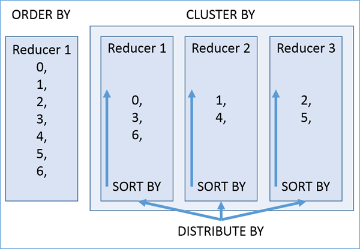

- distribute by(字段)根据指定字段将数据分到不同的reducer，分发算法是hash散列。

- 

  

#### 2.2. union联合查询

UNION用于将来自多个SELECT语句的结果合并为一个结果集。语法如下：

```sql
select_statement UNION [ALL | DISTINCT] select_statement UNION [ALL | DISTINCT] select_statement ...
```

使用DISTINCT关键字与只使用UNION默认值效果一样，都会删除重复行。

使用ALL关键字，不会删除重复行，结果集包括所有SELECT语句的匹配行（包括重复行）。

1.2.0之前的Hive版本仅支持UNION ALL，在这种情况下不会消除重复的行。

每个select_statement返回的列的数量和名称必须相同。

```sql
--union
--使用DISTINCT关键字与使用UNION默认值效果一样，都会删除重复行。
select num,name from student_local
UNION
select num,name from student_hdfs;
--和上面一样
select num,name from student_local
UNION DISTINCT
select num,name from student_hdfs;

--使用ALL关键字会保留重复行。
select num,name from student_local
UNION ALL
select num,name from student_hdfs;

--如果要将ORDER BY，SORT BY，CLUSTER BY，DISTRIBUTE BY或LIMIT应用于单个SELECT
--请将子句放在括住SELECT的括号内
SELECT num,name FROM (select num,name from student_local LIMIT 2) subq1
UNION
SELECT num,name FROM (select num,name from student_hdfs LIMIT 3) subq2;

--如果要将ORDER BY，SORT BY，CLUSTER BY，DISTRIBUTE BY或LIMIT子句应用于整个UNION结果
--请将ORDER BY，SORT BY，CLUSTER BY，DISTRIBUTE BY或LIMIT放在最后一个之后。
select num,name from student_local
UNION
select num,name from student_hdfs
order by num desc;
```

#### 2.3. Common Table Expressions(CTE)

##### CTE介绍

公用表表达式（CTE）是一个临时结果集，该结果集是从WITH子句中指定的简单查询派生而来的，该查询紧接在SELECT或INSERT关键字之前。

CTE仅在单个语句的执行范围内定义。一个或多个CTE可以在Hive SELECT，INSERT，  CREATE TABLE AS SELECT或CREATE VIEW AS SELECT语句中使用。

##### CTE案例

```sql
--选择语句中的CTE
with q1 as (select num,name,age from student where num = 95002)
select *
from q1;

-- from风格
with q1 as (select num,name,age from student where num = 95002)
from q1
select *;

-- chaining CTEs 链式
with q1 as ( select * from student where num = 95002),
     q2 as ( select num,name,age from q1)
select * from (select num from q2) a;


-- union案例
with q1 as (select * from student where num = 95002),
     q2 as (select * from student where num = 95004)
select * from q1 union all select * from q2;

--视图，CTAS和插入语句中的CTE
-- insert
create table s1 like student;

with q1 as ( select * from student where num = 95002)
from q1
insert overwrite table s1
select *;

select * from s1;

-- ctas
create table s2 as
with q1 as ( select * from student where num = 95002)
select * from q1;

-- view
create view v1 as
with q1 as ( select * from student where num = 95002)
select * from q1;

select * from v1;
```

## II. HQL join连接查询

### 1. join概念回顾

根据数据库的三范式设计要求和日常工作习惯来说，我们通常不会设计一张大表把所有类型的数据都放在一起，而是不同类型的数据设计不同的表存储。比如在设计一个订单数据表的时候，可以将客户编号作为一个外键和订单表建立相应的关系。而不可以在订单表中添加关于客户其它信息（比如姓名、所属公司等）的字段。

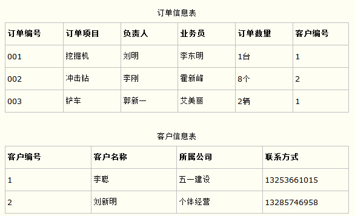

在这种情况下，有时需要基于多张表查询才能得到最终完整的结果，SQL中join语法的出现是**用于根据两个或多个表中的列之间的关系，从这些表中共同组合查询数据**，因此有时为了得到完整的结果，我们就需要执行 join。

Hive作为面向分析的数据仓库软件，为了更好的支持数据分析的功能丰富，也实现了join的语法，整体上来看和RDBMS中的join语法类似，只不过在某些点有自己的特色。需要特别注意。

### 2. Hive join语法

Hive 3.1.2 中共支持6中join语法, 分别是:

**inner** join（内连接）、**left** join（左连接）、**right** join（右连接）、**full outer** join（全外连接）、**left semi** join（左半开连接）、**cross** join（交叉连接，也叫做笛卡尔乘积）。

#### 2.1. 规则树

```sql
join_table:
    table_reference [INNER] JOIN table_factor [join_condition]
  | table_reference {LEFT|RIGHT|FULL} [OUTER] JOIN table_reference join_condition
  | table_reference LEFT SEMI JOIN table_reference join_condition
  | table_reference CROSS JOIN table_reference [join_condition] (as of Hive 0.10)

table_reference:
    table_factor
  | join_table

table_factor:
    tbl_name [alias]
  | table_subquery alias
  | ( table_references )

join_condition:
    ON expression
```

**table_reference**：是join查询中使用的表名，也可以是子查询别名（查询结果当成表参与join）。

**table_factor**：与table_reference相同,是联接查询中使用的表名,也可以是子查询别名。

**join_condition**：join查询关联的条件， 如果在两个以上的表上需要连接，则使用AND关键字。

#### 2.2. 语法丰富

Hive中join语法从面世开始其实并不丰富，不像在RDBMS中那么灵活，很多早期接触Hive的用户在使用join的时候，一个最大的感受就是不支持不相等连接。

从Hive 0.13.0开始，支持**隐式联接表示法**（请参阅HIVE-5558）。这允许FROM子句连接以逗号分隔的表列表，而省略JOIN关键字。例如：

```sql
SELECT *
FROM table1 t1, table2 t2, table3 t3
WHERE t1.id = t2.id AND t2.id = t3.id AND t1.zipcode = '02535';
```

从Hive 2.2.0开始，**支持ON子句中的复杂表达式，支持不相等连接**（请参阅HIVE-15211和HIVE-15251）。在此之前，Hive不支持不是相等条件的联接条件。

```sql
SELECT a.* FROM a JOIN b ON (a.id = b.id)
SELECT a.* FROM a JOIN b ON (a.id = b.id AND a.department = b.department)
SELECT a.* FROM a LEFT OUTER JOIN b ON (a.id <> b.id)
```

### 3. join查询数据环境准备

为了更好的练习、学习掌握Hive中的join语法，下面我们去创建3张表并且加载数据到表中。

表1：**employee 员工表**；

```sql
--table1: 员工表
CREATE TABLE employee(
   id int,
   name string,
   deg string,
   salary int,
   dept string
 ) row format delimited
fields terminated by ',';
```

表2：**employee_address 员工住址信息表**；

```sql
--table2:员工住址信息表
CREATE TABLE employee_address (
    id int,
    hno string,
    street string,
    city string
) row format delimited
fields terminated by ',';
```

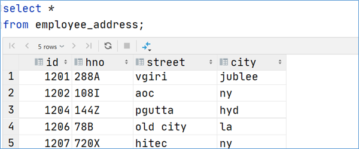

表3：**employee_connection 员工联系方式表**；

```sql
CREATE TABLE employee_connection (
    id int,
    phno string,
    email string
) row format delimited
fields terminated by ',';
```

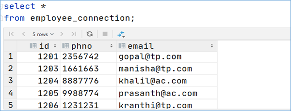

```sql
--加载数据到表中
load data local inpath '/root/hivedata/employee.txt' into table employee;
load data local inpath '/root/hivedata/employee_address.txt' into table employee_address;
load data local inpath '/root/hivedata/employee_connection.txt' into table employee_connection;
```

### 4. Hive inner join

**内连接**是最常见的一种连接，它也被称为普通连接，而关系模型提出者E.FCodd（埃德加•科德）最早称之为自然连接。其中inner可以省略。**inner join == join** 等价于早期的连接语法。

内连接，只有进行连接的两个表中都存在与连接条件相匹配的数据才会被留下来。

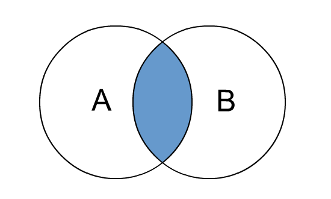

```sql
--1、inner join
select e.id,e.name,e_a.city,e_a.street
from employee e inner join employee_address e_a
on e.id =e_a.id;
--等价于 inner join=join
select e.id,e.name,e_a.city,e_a.street
from employee e join employee_address e_a
on e.id =e_a.id;

--等价于 隐式连接表示法
select e.id,e.name,e_a.city,e_a.street
from employee e , employee_address e_a
where e.id =e_a.id;
```

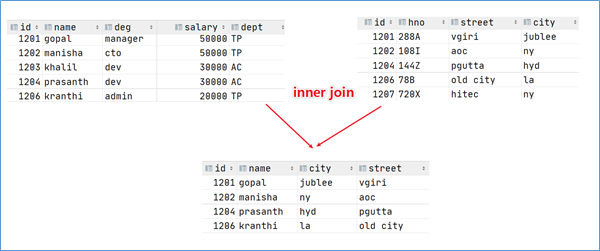

### 5. Hive left join

**left join**中文叫做是左外连接(Left Outer Jion)或者**左连接**，其中outer可以省略，left outer join是早期的写法。

left join的核心就在于left左。左指的是join关键字左边的表，简称左表。

通俗解释：join时以左表的全部数据为准，右边与之关联；左表数据全部返回，右表关联上的显示返回，关联不上的显示null返回。

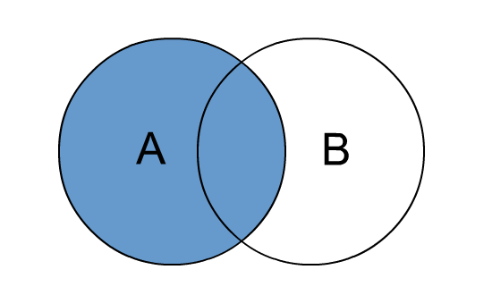

```sql
--2、left join
select e.id,e.name,e_conn.phno,e_conn.email
from employee e left join employee_connection e_conn
on e.id =e_conn.id;

--等价于 left outer join
select e.id,e.name,e_conn.phno,e_conn.email
from employee e left outer join  employee_connection e_conn
on e.id =e_conn.id;
```

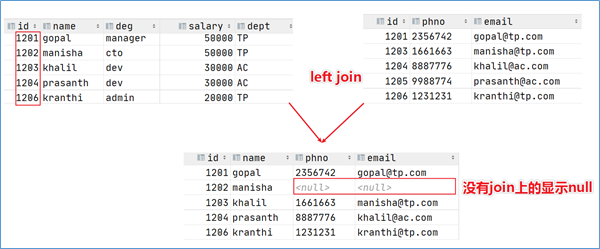

### 6. Hive right join

**right join**中文叫做是右外连接(Right Outer Jion)或者**右连接**，其中outer可以省略。

right join的核心就在于Right右。右指的是join关键字右边的表，简称右表。

通俗解释：join时以右表的全部数据为准，左边与之关联；右表数据全部返回，左表关联上的显示返回，关联不上的显示null返回。

很明显，right join和left join之间很相似，重点在于以哪边为准，也就是一个方向的问题。


```sql
--3、right join
select e.id,e.name,e_conn.phno,e_conn.email
from employee e right join employee_connection e_conn
on e.id =e_conn.id;

--等价于 right outer join
select e.id,e.name,e_conn.phno,e_conn.email
from employee e right outer join employee_connection e_conn
on e.id =e_conn.id;
```

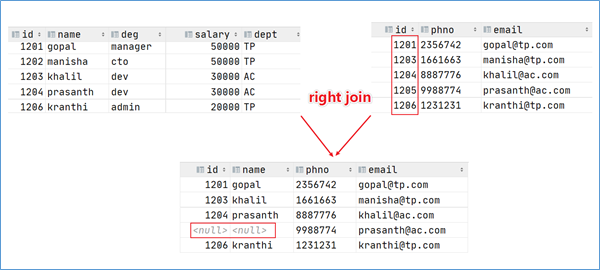

### 7. Hive full outer join

**full outer join 等价 full join**  ,中文叫做全外连接或者外连接。

包含左、右两个表的全部行，不管另外一边的表中是否存在与它们匹配的行

在功能上，它等价于对这两个数据集合分别进行左外连接和右外连接，然后再使用消去重复行的操作将上述两个结果集合并为一个结果集。

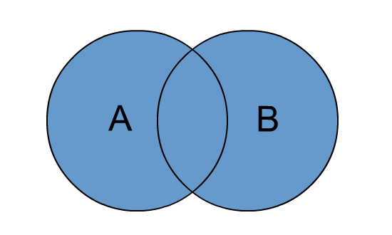

```sql
--4、full outer join
select e.id,e.name,e_a.city,e_a.street
from employee e full outer join employee_address e_a
on e.id =e_a.id;
--等价于
select e.id,e.name,e_a.city,e_a.street
from employee e full  join employee_address e_a
on e.id =e_a.id;
```

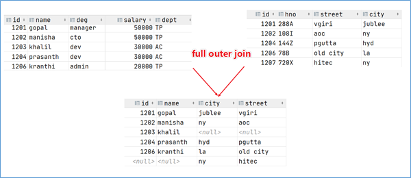

### 8. Hive left semi join

**左半开连接**（LEFT SEMI JOIN）会返回左边表的记录，前提是其记录对于右边的表满足ON语句中的判定条件。

从效果上来看有点像inner join之后只返回左表的结果。

```sql
--5、left semi join
select *
from employee e left semi join employee_address e_addr
on e.id =e_addr.id;

--相当于 inner join 只不过效率高一些
select e.*
from employee e inner join employee_address e_addr
on e.id =e_addr.id;
```


### 9. Hive cross join

**交叉连接cross join**，将会返回被连接的两个表的笛卡尔积，返回结果的行数等于两个表行数的乘积。对于**大表来说，cross join慎用**。

在SQL标准中定义的cross join就是无条件的inner join。返回两个表的笛卡尔积,无需指定关联键。

在HiveSQL语法中，cross join 后面可以跟where子句进行过滤，或者on条件过滤。

```sql
--6、cross join
--下列A、B、C 执行结果相同，但是效率不一样：
--A:
select a.*,b.* from employee a,employee_address b where a.id=b.id;
--B:
select * from employee a cross join employee_address b on a.id=b.id;
select * from employee a cross join employee_address b where a.id=b.id;

--C:
select * from employee a inner join employee_address b on a.id=b.id;

--一般不建议使用方法A和B，因为如果有WHERE子句的话，往往会先进行笛卡尔积返回数据然后才根据WHERE条件从中选择。
--因此，如果两个表太大，将会非常非常慢，不建议使用。
```

### 10. Hive join使用注意事项

总体来说，随着Hive的版本发展，join语法的功能也愈加丰富。当下我们课程使用的是3.1.2版本，有以下几点需要注意：

##### a. 允许使用复杂的联接表达式

```sql
SELECT a.* FROM a JOIN b ON (a.id = b.id)
SELECT a.* FROM a JOIN b ON (a.id = b.id AND a.department = b.department)
SELECT a.* FROM a LEFT OUTER JOIN b ON (a.id <> b.id)
```

##### b. 同一查询中可以连接2个以上的表

```sql
SELECT a.val, b.val, c.val FROM a JOIN b ON (a.key = b.key1) JOIN c ON (c.key = b.key2)
```

##### c. 如果每个表在联接子句中使用相同的列，则Hive将多个表上的联接转换为单个MR作业

```sql
SELECT a.val, b.val, c.val FROM a JOIN b ON (a.key = b.key1) JOIN c ON (c.key = b.key1)
--由于联接中仅涉及b的key1列，因此被转换为1个MR作业来执行
SELECT a.val, b.val, c.val FROM a JOIN b ON (a.key = b.key1) JOIN c ON (c.key = b.key2)
--会转换为两个MR作业，因为在第一个连接条件中使用了b中的key1列，而在第二个连接条件中使用了b中的key2列。第一个map / reduce作业将a与b联接在一起，然后将结果与c联接到第二个map / reduce作业中。
```

##### d. join时的最后一个表会通过reducer流式传输，并在其中缓冲之前的其他表，因此，将大表放置在最后有助于减少reducer阶段缓存数据所需要的内存

```sql
SELECT a.val, b.val, c.val FROM a JOIN b ON (a.key = b.key1) JOIN c ON (c.key = b.key1)
--由于联接中仅涉及b的key1列，因此被转换为1个MR作业来执行，并且表a和b的键的特定值的值被缓冲在reducer的内存中。然后，对于从c中检索的每一行，将使用缓冲的行来计算联接。
SELECT a.val, b.val, c.val FROM a JOIN b ON (a.key = b.key1) JOIN c ON (c.key = b.key2)
--计算涉及两个MR作业。其中的第一个将a与b连接起来，并缓冲a的值，同时在reducer中流式传输b的值。
在第二个MR作业中，将缓冲第一个连接的结果，同时将c的值通过reducer流式传输。
```

##### e. 在join的时候，可以通过语法STREAMTABLE提示指定要流式传输的表。如果省略STREAMTABLE提示，则Hive将流式传输最右边的表。

```sql
SELECT /*+ STREAMTABLE(a) */ a.val, b.val, c.val FROM a JOIN b ON (a.key = b.key1) JOIN c ON (c.key = b.key1)
--a,b,c三个表都在一个MR作业中联接，并且表b和c的键的特定值的值被缓冲在reducer的内存中。然后，对于从a中检索到的每一行，将使用缓冲的行来计算联接。如果省略STREAMTABLE提示，则Hive将流式传输最右边的表。

```

##### f. join在WHERE条件之前进行。

##### g. 如果除一个要连接的表之外的所有表都很小，则可以将其作为仅map作业执行

```sql
SELECT /*+ MAPJOIN(b) */ a.key, a.value FROM a JOIN b ON a.key = b.key
--不需要reducer。对于A的每个Mapper，B都会被完全读取。限制是不能执行FULL / RIGHT OUTER JOIN b。
```

还有一些其他相关的使用注意事项，可以参考官方

<https://cwiki.apache.org/confluence/display/Hive/LanguageManual+Joins>

## III. Hive参数配置

### 1. CLIs and Commands客户端和命令

#### 1.1. Hive CLI

$HIVE_HOME/bin/hive是一个shellUtil,通常称之为hive的第一代客户端或者旧客户端，主要功能有两个：

一：用于以**交互式**或**批处理模式**运行**Hive查询**，注意，此时作为客户端，需要并且能够访问的是Hive metastore服务，而不是hiveserver2服务。

二：用于hive相关**服务的启动**，比如metastore服务。

可以通过运行"hive -H" 或者 "hive 5--help"来查看命令行选项。


```shell
-e <quoted-query-string>        执行命令行-e参数后指定的sql语句 运行完退出。(重要)
-f <filename>                  执行命令行-f参数后指定的sql文件 运行完退出。(重要)
-H,--help                      打印帮助信息
    --hiveconf <property=value>   设置参数(重要)
-S,--silent                     静默模式
-v,--verbose                   详细模式，将执行sql回显到console
   --service service_name        启动hive的相关服务(重要)
```

##### Batch Mode 批处理模式

当使用**-e或-f选项**运行$ HIVE_HOME / bin / hive时，它将以批处理模式执行SQL命令。所谓的批处理可以理解为一次性执行，执行完毕退出。

```shell
#-e
$HIVE_HOME/bin/hive -e 'show databases'

#-f
cd ~
#编辑一个sql文件 里面写上合法正确的sql语句
vim hive.sql
show databases;
#执行 从客户端所在机器的本地磁盘加载文件
$HIVE_HOME/bin/hive -f /root/hive.sql
#也可以从其他文件系统加载sql文件执行
$HIVE_HOME/bin/hive -f hdfs://<namenode>:<port>/hive-script.sql
$HIVE_HOME/bin/hive -f s3://mys3bucket/s3-script.sql
#使用静默模式将数据从查询中转储到文件中
$HIVE_HOME/bin/hive -S -e 'select * from itheima.student' > a.txt
```

##### Interactive Shell 交互式模式

所谓交互式模式可以理解为客户端和hive服务一直保持连接，除非手动退出客户端。

```shell
/export/server/hive/bin/hive

hive> show databases;
OK
default
itcast
itheima
Time taken: 0.028 seconds, Fetched: 3 row(s)

hive> use itcast;
OK
Time taken: 0.027 seconds

hive> exit;
```

##### 启动服务, 修改配置

远程模式部署方式下，hive metastore服务需要单独配置手动启动，此时就可以使用Hive CLI来进行相关服务的启动，hiveserver2服务类似。

```shell
#--service
$HIVE_HOME/bin/hive --service metastore
$HIVE_HOME/bin/hive --service hiveserver2

#--hiveconf
$HIVE_HOME/bin/hive --hiveconf hive.root.logger=DEBUG,console
```

#### 1.2. Beeline CLI

$HIVE_HOME/**bin/beeline**被称之为第二代客户端或者新客户端，是一个JDBC客户端，是官方强烈推荐使用的Hive命令行工具，和第一代客户端相比，性能加强安全性提高。Beeline在嵌入式模式和远程模式下均可工作。

在嵌入式模式下，它运行嵌入式Hive(类似于Hive CLI)；

**远程模式下beeline通过Thrift连接到单独的HiveServer2服务上**，这也是官方推荐在生产环境中使用的模式。

常见的使用方式如下所示，在启动hiveserver2服务的前提下使用beeline远程连接：

```shell
[root@node3 ~]# /export/server/hive/bin/beeline 
Beeline version 3.1.2 by Apache Hive
beeline> ! connect jdbc:hive2://node1:10000
Connecting to jdbc:hive2://node1:10000
Enter username for jdbc:hive2://node1:10000: root
Enter password for jdbc:hive2://node1:10000: 
Connected to: Apache Hive (version 3.1.2)
Driver: Hive JDBC (version 3.1.2)
Transaction isolation: TRANSACTION_REPEATABLE_READ
0: jdbc:hive2://node1:10000>

```

beeline支持的参数非常多，可以通过官方文档进行查询

[https://cwiki.apache.org/confluence/display/Hive/HiveServer2+Clients#HiveServer2Clients-Beeline%E2%80%93NewCommandLineShell](https://cwiki.apache.org/confluence/display/Hive/HiveServer2+Clients%23HiveServer2Clients-Beeline%E2%80%93NewCommandLineShell)

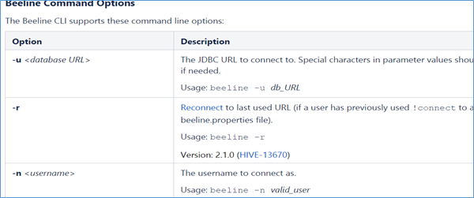

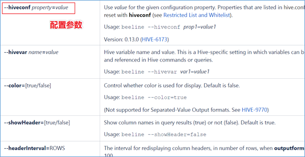

### 2. Configuration Properties配置属性

#### 2.1. 配置属性概述

Hive作为一款复杂的数据仓库软件，除了一些默认的属性行为之外，还支持用户配置属性进行修改，使得在某些场景下满足用户的需求。

作为用户我们需要掌握两件事：

一是：Hive有哪些属性支持修改，修改了有什么功能；

二是：Hive支持哪种方式进行修改，修改是临时生效还是永久生效的。

**Hive配置属性的规范列表是在HiveConf.Java类中管理**的，因此请参考该HiveConf.java文件，以获取Hive当前使用的发行版中可用的配置属性的完整列表。从Hive 0.14.0开始，会从HiveConf.java类中直接生成配置模板文件hive-default.xml.template，它是当前版本配置及其默认值的可靠来源。

详细的配置参数大全可以参考Hive官网配置参数，在页面使用ctrl+f进行搜索。

<https://cwiki.apache.org/confluence/display/Hive/Configuration+Properties>

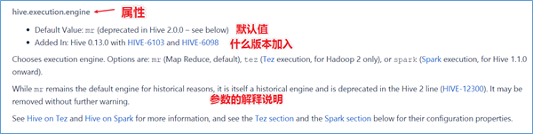

#### 2.2. 修改配置属性方式

##### 方式1: hive-site.xml配置文件

在$HIVE_HOME/conf路径下，可以添加一个hive-site.xml文件，把需要定义修改的配置属性添加进去，这个配置文件会影响到这个Hive安装包的任何一种服务启动、客户端使用方式，可以理解为是Hive的全局配置。

比如我们指定使用MySQL作为Hive元数据的存储介质，那么就需要把Hive连接MySQL的相关属性配置在hive-site.xml文件中，这样不管是本地模式还是远程模式启动，不管客户端本地连接还是远程连接，都将访问同一个元数据存储介质，大家使用的元数据都是一致的。

```xml
<configuration>
    <!-- 存储元数据mysql相关配置 -->
    <property>
        <name>javax.jdo.option.ConnectionURL</name>
        <value> jdbc:mysql://node1:3306/hive?createDatabaseIfNotExist=true&amp;useSSL=false&amp;useUnicode=true&amp;characterEncoding=UTF-8</value>
    </property>

    <property>
        <name>javax.jdo.option.ConnectionDriverName</name>
        <value>com.mysql.jdbc.Driver</value>
    </property>

    <property>
        <name>javax.jdo.option.ConnectionUserName</name>
        <value>root</value>
    </property>

    <property>
        <name>javax.jdo.option.ConnectionPassword</name>
        <value>hadoop</value>
    </property>
</configuration>
```

##### 方式2: --hiveconf命令行参数

hiveconf是一个命令行的参数，用于在使用Hive CLI或者Beeline CLI的时候指定配置参数。这种方式的配置在整个的会话session中有效，会话结束，失效。

比如在启动hive服务的时候，为了更好的查看启动详情，可以通过hiveconf参数修改日志级别：

```shell
$HIVE_HOME/bin/hive --hiveconf hive.root.logger=DEBUG,console
```

##### 方式3: set命令(不出意外就用这种方式)

在Hive CLI或Beeline中使用s**et****命令**为set命令之后的所有SQL语句设置配置参数，这个也是会话级别的。

这种方式也是用户日常开发中使用最多的一种配置参数方式。因为Hive倡导一种：**谁需要、谁配置、谁使用**的一种思想，避免你的属性修改影响其他用户的修改。

```sql
#启用hive动态分区，需要在hive会话中设置两个参数：
set hive.exec.dynamic.partition=true;
set hive.exec.dynamic.partition.mode=nonstrict;
```

##### 方式4: 服务器特定的配置文件

可以设置特定metastore的配置值hivemetastore-site.xml中，并在HiveServer2特定的配置值hiveserver2-site.xml中。

Hive Metastore服务器读取$ HIVE_CONF_DIR或类路径中可用的hive-site.xml以及hivemetastore-site.xml配置文件。

HiveServer2读取$ HIVE_CONF_DIR或类路径中可用的hive-site.xml以及hiveserver2-site.xml。

如果HiveServer2以嵌入式模式使用元存储，则还将加载hivemetastore-site.xml。

##### 概括总结:

配置文件的优先顺序如下，后面的优先级越高：

hive-site.xml-> hivemetastore-site.xml-> hiveserver2-site.xml->' -hiveconf'命令行参数

从Hive 0.14.0开始，会从HiveConf.java类中直接生成配置模板文件hive-default.xml.template，它是当前版本配置变量及其默认值的可靠来源。

hive-default.xml.template 位于安装根目录下的conf目录中，并且 hive-site.xml 也应在同一目录中创建。

从 Hive 0.14.0开始， 您可以使用SHOW CONF命令显示有关配置变量的信息。

配置方式的优先级顺序，优先级依次递增：

set参数生命>hiveconf命令行参数>hive-site.xml配置文件。

即**set参数声明覆盖命令行参数hiveconf，命令行参数覆盖配置文件hive-site.xml设定。**

日常的开发使用中，如果不是核心的需要全局修改的参数属性，建议大家使用**set命令**进行设置。

另外，Hive也会读入Hadoop的配置，因为Hive是作为Hadoop的客户端启动的，Hive的配置会覆盖Hadoop的配置。

## IV. Hive内置运算符

随着Hive版本的不断发展，在Hive SQL中支持的、内置的运算符也越来越多。可以使用下面的命令查看当下支持的运算符和函数，并且查看其详细的使用方式。

<https://cwiki.apache.org/confluence/display/Hive/LanguageManual+UDF>

也可以使用课程附件中的中文版本运算符函数说明文档进行查看。

```sql
--显示所有的函数和运算符
show functions;
--查看运算符或者函数的使用说明
describe function +;
--使用extended 可以查看更加详细的使用说明
describe function extended +;
```

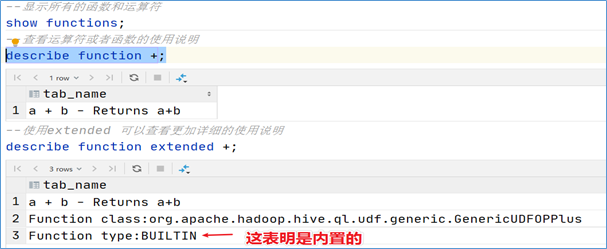

从Hive 0.13.0开始，select查询语句FROM关键字是可选的（例如SELECT 1+1）。因此可以使用这种方式来练习测试内置的运算符、函数的功能。

除此之外，还可以通过创建一张虚表dual来满足于测试需求。

```sql
--1、创建表dual
create table dual(id string);
--2、加载一个文件dual.txt到dual表中
--dual.txt只有一行内容：内容为一个空格
--3、在select查询语句中使用dual表完成运算符、函数功能测试
select 1+1 from dual;
```

### 1. 关系运算符

**关系运算符**是二元运算符，执行的是两个操作数的比较运算。每个关系运算符都返回boolean类型结果（TRUE或FALSE）。

```shell
•等值比较: = 、==
•不等值比较: <> 、!=
•小于比较: <
•小于等于比较: <=
•大于比较: >
•大于等于比较: >=
•空值判断: IS NULL 
•非空判断: IS NOT NULL
•LIKE比较: LIKE
•JAVA的LIKE操作: RLIKE
•REGEXP操作: REGEXP
```

```sql
--is null空值判断
select 1 from dual where 'itcast' is null;

--is not null 非空值判断
select 1 from dual where 'itcast' is not null;

--like比较： _表示任意单个字符 %表示任意数量字符
--否定比较： NOT A like B
select 1 from dual where 'itcast' like 'it_';
select 1 from dual where 'itcast' like 'it%';
select 1 from dual where not 'itcast' like 'hadoo_';

--rlike：确定字符串是否匹配正则表达式，是REGEXP_LIKE()的同义词。
select 1 from dual where 'itcast' rlike '^i.*t$';
select 1 from dual where '123456' rlike '^\\d+$';  --判断是否全为数字
select 1 from dual where '123456aa' rlike '^\\d+$';

--regexp：功能与rlike相同 用于判断字符串是否匹配正则表达式
select 1 from dual where 'itcast' regexp '^i.*t$';
```

### 2. 算术运算符

算术运算符操作数必须是数值类型。 分为一元运算符和二元运算符; 一元运算符,只有一个操作数; 二元运算符有两个操作数,运算符在两个操作数之间。

```shell
•加法操作: +
•减法操作: -
•乘法操作: *
•除法操作: /
•取整操作: div
•取余操作: %
•位与操作: &
•位或操作: |
•位异或操作: ^
•位取反操作: ~
```

```sql
--取整操作: div  给出将A除以B所得的整数部分。例如17 div 3得出5。
select 17 div 3;

--取余操作: %  也叫做取模  A除以B所得的余数部分
select 17 % 3;

--位与操作: &  A和B按位进行与操作的结果。 与表示两个都为1则结果为1
select 4 & 8 from dual;  --4转换二进制：0100 8转换二进制：1000
select 6 & 4 from dual;  --4转换二进制：0100 6转换二进制：0110

--位或操作: |  A和B按位进行或操作的结果  或表示有一个为1则结果为1
select 4 | 8 from dual;
select 6 | 4 from dual;

--位异或操作: ^ A和B按位进行异或操作的结果 异或表示两个不同则结果为1
select 4 ^ 8 from dual;
select 6 ^ 4 from dual;
```

### 3. 逻辑运算符

```shell
•与操作: A AND B
•或操作: A OR B
•非操作: NOT A 、!A
•在:A IN (val1, val2, ...)
•不在:A NOT IN (val1, val2, ...)
•逻辑是否存在: [NOT] EXISTS (subquery)
```

```sql
--与操作: A AND B   如果A和B均为TRUE，则为TRUE，否则为FALSE。如果A或B为NULL，则为NULL。
select 1 from dual where 3>1 and 2>1;
--或操作: A OR B   如果A或B或两者均为TRUE，则为TRUE，否则为FALSE。
select 1 from dual where 3>1 or 2!=2;
--非操作: NOT A 、!A   如果A为FALSE，则为TRUE；如果A为NULL，则为NULL。否则为FALSE。
select 1 from dual where not 2>1;
select 1 from dual where !2=1;
--在:A IN (val1, val2, ...)  如果A等于任何值，则为TRUE。
select 1 from dual where 11 in(11,22,33);
--不在:A NOT IN (val1, val2, ...) 如果A不等于任何值，则为TRUE
select 1 from dual where 11 not in(22,33,44);
--逻辑是否存在: [NOT] EXISTS (subquery) 如果子查询返回至少一行，则为TRUE。
select A.* from A
where exists (select B.id from B where A.id = B.id)
```

## V. Hive函数入门

### 1. 函数概述

如同RDBMS中标准SQL语法一样，Hive SQL也内建了不少函数，满足于用户在不同场合下的数据分析需求，提高开发SQL数据分析的效率。

可以使用show functions查看当下版本支持的函数，并且可以通过**describe function extended funcname**来查看函数的使用方式和方法。

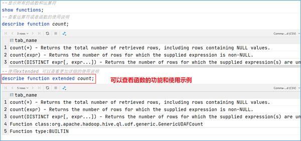

### 2. 函数分类概述

Hive的函数很多，除了自己内置所支持的函数之外，还支持用户自己定义开发函数。

针对**内置的函数**，可以根据函数的应用类型进行归纳分类，比如：数值类型函数、日期类型函数、字符串类型函数、集合函数、条件函数等；

针对**用户自定义函数**，可以根据函数的输入输出行数进行分类，比如：UDF、UDAF、UDTF。

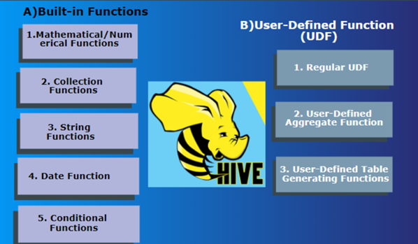

### 3. 内置函数分类

所谓的**内置函数（buildin）**指的是Hive开发实现好，直接可以使用的函数,也叫做内建函数。

官方文档地址：<https://cwiki.apache.org/confluence/display/Hive/LanguageManual+UDF>

内置函数根据应用归类整体可以分为以下8大种类型，我们将对其中重要的，使用频率高的函数使用进行详细讲解。

##### String Functions 字符串函数

主要针对字符串数据类型进行操作，比如下面这些：

```shell
•字符串长度函数：length
•字符串反转函数：reverse
•字符串连接函数：concat
•带分隔符字符串连接函数：concat_ws
•字符串截取函数：substr,substring
•字符串转大写函数：upper,ucase
•字符串转小写函数：lower,lcase
•去空格函数：trim
•左边去空格函数：ltrim
•右边去空格函数：rtrim
•正则表达式替换函数：regexp_replace
•正则表达式解析函数：regexp_extract
•URL解析函数：parse_url
•json解析函数：get_json_object
•空格字符串函数：space
•重复字符串函数：repeat
•首字符ascii函数：ascii
•左补足函数：lpad
•右补足函数：rpad
•分割字符串函数: split
•集合查找函数: find_in_set
```

```sql
------------String Functions 字符串函数------------
describe function extended find_in_set;

--字符串长度函数：length(str | binary)
select length("angelababy");

--字符串反转函数：reverse
select reverse("angelababy");

--字符串连接函数：concat(str1, str2, ... strN)
select concat("angela","baby");

--带分隔符字符串连接函数：concat_ws(separator, [string | array(string)]+)
select concat_ws('.', 'www', array('itcast', 'cn'));

--字符串截取函数：substr(str, pos[, len]) 或者  substring(str, pos[, len])
select substr("angelababy",-2); --pos是从1开始的索引，如果为负数则倒着数
select substr("angelababy",2,2);

--字符串转大写函数：upper,ucase
select upper("angelababy");
select ucase("angelababy");

--字符串转小写函数：lower,lcase
select lower("ANGELABABY");
select lcase("ANGELABABY");

--去空格函数：trim 去除左右两边的空格
select trim(" angelababy ");

--左边去空格函数：ltrim
select ltrim(" angelababy ");

--右边去空格函数：rtrim
select rtrim(" angelababy ");

--正则表达式替换函数：regexp_replace(str, regexp, rep)
select regexp_replace('100-200', '(\\d+)', 'num');

--正则表达式解析函数：regexp_extract(str, regexp[, idx]) 提取正则匹配到的指定组内容
select regexp_extract('100-200', '(\\d+)-(\\d+)', 2);

--URL解析函数：parse_url 注意要想一次解析出多个 可以使用parse_url_tuple这个UDTF函数
select parse_url('http://www.itcast.cn/path/p1.php?query=1', 'HOST');

--json解析函数：get_json_object
--空格字符串函数：space(n) 返回指定个数空格
select space(4);

--重复字符串函数：repeat(str, n) 重复str字符串n次
select repeat("angela",2);

--首字符ascii函数：ascii
select ascii("angela");  --a对应ASCII 97

--左补足函数：lpad
select lpad('hi', 5, '??');  --???hi
select lpad('hi', 1, '??');  --h

--右补足函数：rpad
select rpad('hi', 5, '??');

--分割字符串函数: split(str, regex)
select split('apache hive', '\\s+');

--集合查找函数: find_in_set(str,str_array)
select find_in_set('a','abc,b,ab,c,def');
```

##### Date Functions 日期函数

主要针对时间, 日期数据类型进行操作, 比如:

```shell
•获取当前日期: current_date
•获取当前时间戳: current_timestamp
•UNIX时间戳转日期函数: from_unixtime
•获取当前UNIX时间戳函数: unix_timestamp
•日期转UNIX时间戳函数: unix_timestamp
•指定格式日期转UNIX时间戳函数: unix_timestamp
•抽取日期函数: to_date
•日期转年函数: year
•日期转月函数: month
•日期转天函数: day
•日期转小时函数: hour
•日期转分钟函数: minute
•日期转秒函数: second
•日期转周函数: weekofyear
•日期比较函数: datediff
•日期增加函数: date_add
•日期减少函数: date_sub
```

```sql
--获取当前日期: current_date
select current_date();

--获取当前时间戳: current_timestamp
--同一查询中对current_timestamp的所有调用均返回相同的值。
select current_timestamp();

--获取当前UNIX时间戳函数: unix_timestamp
select unix_timestamp();

--UNIX时间戳转日期函数: from_unixtime
select from_unixtime(1618238391);
select from_unixtime(0, 'yyyy-MM-dd HH:mm:ss');

--日期转UNIX时间戳函数: unix_timestamp
select unix_timestamp("2011-12-07 13:01:03");

--指定格式日期转UNIX时间戳函数: unix_timestamp
select unix_timestamp('20111207 13:01:03','yyyyMMdd HH:mm:ss');

--抽取日期函数: to_date
select to_date('2009-07-30 04:17:52');

--日期转年函数: year
select year('2009-07-30 04:17:52');

--日期转月函数: month
select month('2009-07-30 04:17:52');

--日期转天函数: day
select day('2009-07-30 04:17:52');

--日期转小时函数: hour
select hour('2009-07-30 04:17:52');

--日期转分钟函数: minute
select minute('2009-07-30 04:17:52');

--日期转秒函数: second
select second('2009-07-30 04:17:52');

--日期转周函数: weekofyear 返回指定日期所示年份第几周
select weekofyear('2009-07-30 04:17:52');

--日期比较函数: datediff  日期格式要求'yyyy-MM-dd HH:mm:ss' or 'yyyy-MM-dd'
select datediff('2012-12-08','2012-05-09');

--日期增加函数: date_add
select date_add('2012-02-28',10);

--日期减少函数: date_sub
select date_sub('2012-01-1',10);
```

##### Methematical Functions 数学函数

主要针对数值类型的数据进行数学计算，比如下面这些：

```shell
•取整函数: round
•指定精度取整函数: round
•向下取整函数: floor
•向上取整函数: ceil
•取随机数函数: rand
•二进制函数: bin
•进制转换函数: conv
•绝对值函数: abs
```

```sql
--取整函数: round  返回double类型的整数值部分 （遵循四舍五入）
select round(3.1415926);

--指定精度取整函数: round(double a, int d) 返回指定精度d的double类型
select round(3.1415926,4);

--向下取整函数: floor
select floor(3.1415926);
select floor(-3.1415926);

--向上取整函数: ceil
select ceil(3.1415926);
select ceil(-3.1415926);

--取随机数函数: rand 每次执行都不一样 返回一个0到1范围内的随机数
select rand();

--指定种子取随机数函数: rand(int seed) 得到一个稳定的随机数序列
select rand(2);

--二进制函数:  bin(BIGINT a)
select bin(18);

--进制转换函数: conv(BIGINT num, int from_base, int to_base)
select conv(17,10,16);

--绝对值函数: abs
select abs(-3.9);
```

##### Collection Functions 集合函数

主要针对集合这样的复杂数据类型进行操作，比如下面这些：

```shell
•集合元素size函数: size(Map<K.V>) size(Array<T>)
•取map集合keys函数: map_keys(Map<K.V>)
•取map集合values函数: map_values(Map<K.V>)
•判断数组是否包含指定元素: array_contains(Array<T>, value)
•数组排序函数:sort_array(Array<T>)
```

```sql
--集合元素size函数: size(Map<K.V>) size(Array<T>)
select size(`array`(11,22,33));
select size(`map`("id",10086,"name","zhangsan","age",18));

--取map集合keys函数: map_keys(Map<K.V>)
select map_keys(`map`("id",10086,"name","zhangsan","age",18));

--取map集合values函数: map_values(Map<K.V>)
select map_values(`map`("id",10086,"name","zhangsan","age",18));

--判断数组是否包含指定元素: array_contains(Array<T>, value)
select array_contains(`array`(11,22,33),11);
select array_contains(`array`(11,22,33),66);

--数组排序函数:sort_array(Array<T>)
select sort_array(`array`(12,2,32));
```

##### Conditional Functions 条件函数

主要用于条件判断、逻辑判断转换这样的场合，比如：

```shell
•if条件判断: if(boolean testCondition, T valueTrue, T valueFalseOrNull)
•空判断函数: isnull( a )
•非空判断函数: isnotnull ( a )
•空值转换函数: nvl(T value, T default_value)
•非空查找函数: COALESCE(T v1, T v2, ...)
•条件转换函数: CASE a WHEN b THEN c [WHEN d THEN e]* [ELSE f] END
•nullif( a, b ): 如果a = b，则返回NULL；否则返回NULL。否则返回一个
•assert_true: 如果'condition'不为真，则引发异常，否则返回null
```

```sql
--使用之前课程创建好的student表数据
select * from student limit 3;

--if条件判断: if(boolean testCondition, T valueTrue, T valueFalseOrNull)
select if(1=2,100,200);
select if(sex ='男','M','W') from student limit 3;

--空判断函数: isnull( a )
select isnull("allen");
select isnull(null);

--非空判断函数: isnotnull ( a )
select isnotnull("allen");
select isnotnull(null);

--空值转换函数: nvl(T value, T default_value)
select nvl("allen","itcast");
select nvl(null,"itcast");

--非空查找函数: COALESCE(T v1, T v2, ...)
--返回参数中的第一个非空值；如果所有值都为NULL，那么返回NULL
select COALESCE(null,11,22,33);
select COALESCE(null,null,null,33);
select COALESCE(null,null,null);

--条件转换函数: CASE a WHEN b THEN c [WHEN d THEN e]* [ELSE f] END
select case 100 when 50 then 'tom' when 100 then 'mary' else 'tim' end;
select case sex when '男' then 'man' else 'women' end from student limit 3;

--nullif( a, b ):
-- 果a = b，则返回NULL；否则返回NULL。否则返回一个
select nullif(11,11);
select nullif(11,12);

--assert_true(condition)
--如果'condition'不为真，则引发异常，否则返回null
SELECT assert_true(11 >= 0);
SELECT assert_true(-1 >= 0);
```

##### Type Conversion Functions 类型转换函数

主要用于显式的数据类型转换, 有下面两种函数: 

```sql
--任意数据类型之间转换:cast
select cast(12.14 as bigint);
select cast(12.14 as string);
```

##### Data Masking Functions 数据脱敏函数: 

主要完成对数据脱敏转换功能, 屏蔽原始数据, 主要如下: 

```shell
•mask
•mask_first_n(string str[, int n]
•mask_last_n(string str[, int n])
•mask_show_first_n(string str[, int n])
•mask_show_last_n(string str[, int n])
•mask_hash(string|char|varchar str)
```

```sql
--mask
--将查询回的数据，大写字母转换为X，小写字母转换为x，数字转换为n。
select mask("abc123DEF");
select mask("abc123DEF",'-','.','^'); --自定义替换的字母

--mask_first_n(string str[, int n]
--对前n个进行脱敏替换
select mask_first_n("abc123DEF",4);

--mask_last_n(string str[, int n])
select mask_last_n("abc123DEF",4);

--mask_show_first_n(string str[, int n])
--除了前n个字符，其余进行掩码处理
select mask_show_first_n("abc123DEF",4);

--mask_show_last_n(string str[, int n])
select mask_show_last_n("abc123DEF",4);

--mask_hash(string|char|varchar str)
--返回字符串的hash编码。
select mask_hash("abc123DEF");
```

##### Misc. Functions 其他杂项函数

```shell
•hive调用java方法: java_method(class, method[, arg1[, arg2..]])
•反射函数: reflect(class, method[, arg1[, arg2..]])
•取哈希值函数:hash
•current_user()、logged_in_user()、current_database()、version()
•SHA-1加密: sha1(string/binary)
•SHA-2家族算法加密：sha2(string/binary, int)  (SHA-224, SHA-256, SHA-384, SHA-512)
•crc32加密:
•MD5加密: md5(string/binary)
```

```sql
--hive调用java方法: java_method(class, method[, arg1[, arg2..]])
select java_method("java.lang.Math","max",11,22);

--反射函数: reflect(class, method[, arg1[, arg2..]])
select reflect("java.lang.Math","max",11,22);

--取哈希值函数:hash
select hash("allen");

--current_user()、logged_in_user()、current_database()、version()

--SHA-1加密: sha1(string/binary)
select sha1("allen");

--SHA-2家族算法加密：sha2(string/binary, int)  (SHA-224, SHA-256, SHA-384, SHA-512)
select sha2("allen",224);
select sha2("allen",512);

--crc32加密:
select crc32("allen");

--MD5加密: md5(string/binary)
select md5("allen");
```

### 4. 用户自定义函数分类

​	虽然说Hive内置了很多函数，但是不见得一定可以满足于用户各种各样的分析需求场景。为了解决这个问题，Hive推出来用户自定义函数功能，让用户实现自己希望实现的功能函数。

​	**用户自定义函数简称UDF**，源自于英文user-defined function。自定义函数总共有3类，是根据函数输入输出的行数来区分的，分别是：

**UDF**（User-Defined-Function）普通函数，一进一出

**UDAF**（User-Defined Aggregation Function）聚合函数，多进一出

**UDTF**（User-Defined Table-Generating Functions）表生成函数，一进多出

**UDF分类标准扩大化**

​	虽然说UDF叫做用户自定义函数，其分类标准主要针对的是用户编写开发的函数。

​	但是这套UDF分类标准可以扩大到Hive的所有函数中：**包括内置函数和自定义函数**。因为不管是什么类型的行数，一定满足于输入输出的要求，那么从输入几行和输出几行上来划分没有任何毛病。千万不要被UD（User-Defined）这两个字母所迷惑，照成视野的狭隘。

​	比如Hive官方文档中，针对聚合函数的标准就是内置的UDAF类型。

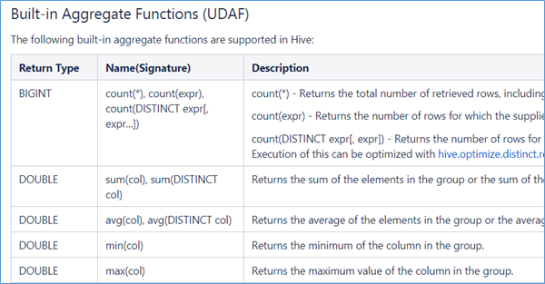

#### 4.1. UDF普通函数

UDF函数通常把它叫做普通函数，最大的特点是一进一出，也就是输入一行输出一行。比如round这样的取整函数，接收一行数据，输出的还是一行数据。

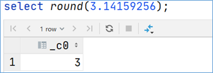

#### 4.2. UDAF聚合函数


#### 4.3. UDTF表生成函数

