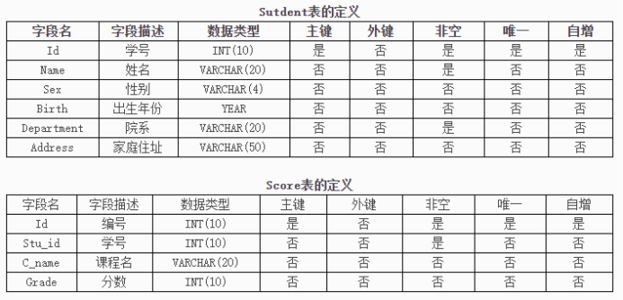

[TOC]

## Day01-MySQL基础

### 今日课程学习目标

```
熟悉 数据库的作用和分类
熟悉 DataGrip软件的基本使用
常握 DDL数据定义语言：建库、建表
常握 DML数据操作语言：表记录增、改、删
常握 DQL数据查询语言：简单查询和条件查询
```

### 今日课程内容大纲

```shell
# 1. MySQL数据库简介
	数据库介绍：作用和分类
	MySQL数据库简介和安装
	MySQL数据库登录和退出
	DataGrip软件基本使用
	SQL语句介绍
# 2. DDL数据定义语言
	数据库(DataBase)操作语句
	数据表(Table)操作语句
	数据类型和约束介绍
	表结构(字段)操作语句
# 3. DML数据操作语言
	表记录增、改、删操作
	SQL约束进阶
# 4. DQL数据查询语言【重点】
	简单查询语句
	条件查询语句
```

### 基础概念题

#### 1. 选择题

**题干：**在MySQL中，通常使用（）语句来指定一个已有数据库作为当前工作数据库。

- [ ] USING
- [ ] USED
- [ ] USES
- [x] USE

#### 2. 简答题

**题干：**MySQL安装成功后，在系统中回默认建立一个叫做____的管理员用户

```sql
# 你的答案
root
```


### SQL 操作题

#### 1. 题目1

**题干：**

1）登录 mysql 然后创建一个名为 **py33** 数据库，要求数据库的编码字符集为：UTF-8，并且数据库若已存在不会报错

```mysql
# 你的答案
CREATE DATABASE IF NOT EXISTS py33 CHARSET=utf8;
```

2）然后在这个数据库下创建一个 职工表**worker**(工号id、姓名name、能力值 level、所属部门dep_id）

> 要求：
>
> 1）id为主键，整型且设置自动增加
>
> 2）name是字符串，长度不固定，最大长度为32，且不允许为NULL
>
> 3）level是整型，默认值为0
>
> 4）dep_id是整型

```sql
# 你的答案
CREATE TABLE worker(
	id INT PRIMARY KEY AUTO_INCREMENT,
    name VARCHAR(32) NOT NULL,
    level INT DEFAULT 0,
    dep_id INT
);
```

3）创建一个 部门表department(部门编号id、部门名称name、主管工号mid)

> 要求：
>
> 1）id为主键，整型且设置自动增加
>
> 2）name是字符串，长度不固定，最大长度为32，且不允许为NULL
>
> 3）mid是整型

```sql
# 你的答案
CREATE department(
    id INT PRIMARY KEY AUTO_INCREMENT,
    name VARCHAR(32) NOT NULL,
    mid INT
);
```

4）现有部门数据如下，请使用 insert 语句插入到department表中

> (100, '桃花岛'), (200, '全真教');

```sql
# 你的答案
INSERT INTO department(id, name)
VALUES
	(100, '桃花岛'), 
	(200, '全真教');
```

5）现有职工数据如下 ，请使用 insert 语句插入到worker表中

> (1, '黄蓉', 80, 100), (2, '东邪', 95, 100), (3, '梅超风' , 90, 100);

```mysql
# 你的答案
INSERT INTO worker
VALUES
	(1, '黄蓉', 80, 100),
	(2, '东邪', 95, 100),
	(3, '梅超风' , 90, 100);
```

6）现有职工数据如下，请使用 insert 语句插入到worker表中 

> ('尹志平', 67, 200), ('丘处机', 85, 200), ('周伯通', 93, 200);

```mysql
# 你的答案
INSERT INTO worker(name, level, dep_id)
VALUES
	('尹志平', 67, 200),
	('丘处机', 85, 200),
	('周伯通', 93, 200);
```

7）查询出所有 职工中 能力值高于70的人的信息

```mysql
# 你的答案
SELECT * FROM worker WHERE level > 70;
```

8）查询 dep_id 为 200 的部门的所有职工信息

```sql
# 你的答案
SELECT * FROM worker WHERE dep_id = 200;
```

9）使用 SQL 语句将 东邪  设置为桃花岛组的主管

```sql
# 你的答案
UPDATE department SET mid = 2 WHERE id = 100;
```

10）使用 SQL 语句将丘处机设置为全真教组的主管

```sql
# 你的答案
UPDATE department SET mid = 5 WHERE id = 200;
```

#### 2. 题目2

根据题目要求，完成以下SQL语句的编写：



现有两张表的定义如上图，请根据要求写入对应的SQL：

1）创建一个数据库：db_student，如果数据库已存在不能报错

```mysql
# 你的答案
CREATE DATABASE IF NOT EXISTS db_student CHARSET=utf8;
```

2）根据图中两张表的定义，在db_student中创建两张表

```mysql
# 你的答案
USE db_student;
CREATE TABLE IF NOT EXISTS Student(
	Id INT(10) PRIMARY KEY AUTO_INCREMENT,
    Name VARCHAR(20) NOT NULL,
    Sex VARCHAR(4),
    Birth YEAR,
    Department VARCHAR(20) NOT NULL,
    Address VARCHAR(50)
);

CREATE TABLE IF NOT EXISTS Score(
	Id INT(10) PRIMARY KEY AUTO_INCREMENT,
    Stu_id INT(10) NOT NULL,
    C_name VARCHAR(20),
    Grade INT(10)
);
```

3）查询student表结构

```mysql
# 你的答案
DESC student;
```

4）修改student表中的字段名Sex为：Gender

```mysql
# 你的答案
ALTER TABLE Student CHANGE Sex Gender VARCHAR(4); 
```

5）修改score表，新增一个Remark字段，类型为varchar(500)

```sql
# 你的答案
ALTER TABLE Score ADD Remark VARCHAR(500);
```
