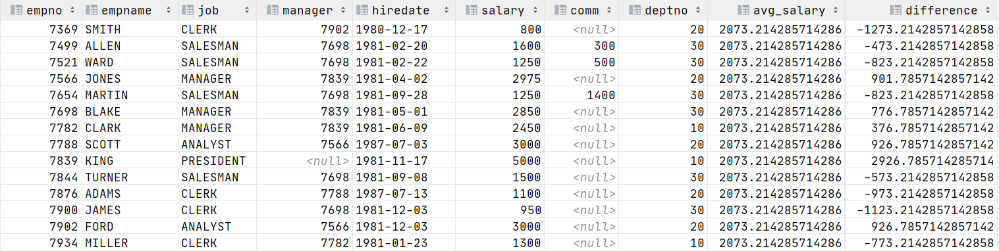
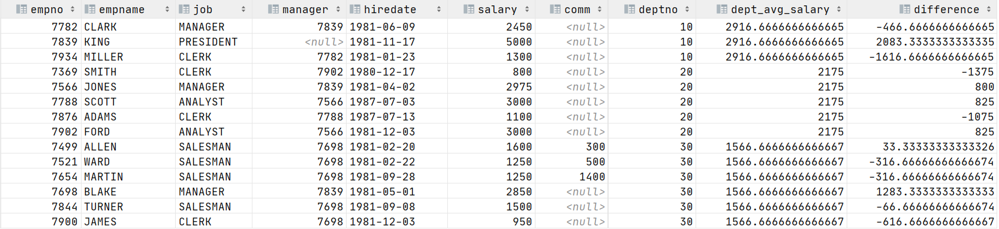
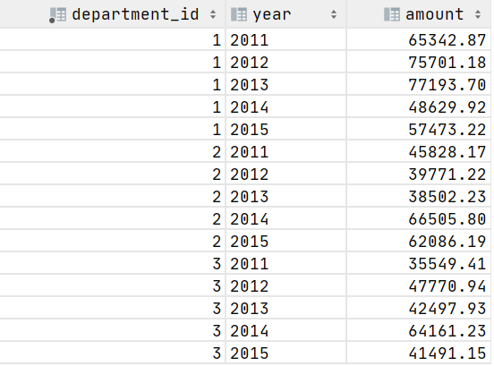
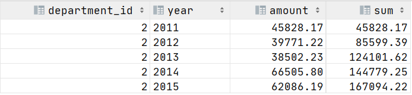

[TOC]

## Day03-MySQL基础

### 今日课程学习目标

```
常握 SQL查询时使用AS关键字起别名
常握 SQL子查询的使用
掌握 窗口函数的基础用法
掌握 PARTITION BY分区操作
掌握 排序函数的使用(产生排名)
掌握 自定义window frame操作
```

### 今日课程内容大纲

```shell
# 1. 子查询【重点】
	AS 起别名
	子查询操作
# 2. 窗口函数【重点】
	窗口函数简介
	窗口函数基础用法：OVER关键字
	PARTITION BY分区
	排序函数：产生排名
	自定义window frame
```

### 基础概念题

#### 1. 简答题

**题干：**简述窗口函数-排序函数中RANK()、DENSE_RANK()、ROW_NUMBER()的区别？

**参考答案**：

```bash
10人排名,第三名有3个人
RANK(): (1,2,3,3,3,6,7,8,9,10)
DENSE_RANK(): (1,2,3,3,3,4,5,6,7,8)
ROW_NUMBER(): (1,2,3,4,5,6,7,8,9,10)
```


### SQL 操作题

#### 1. 练习1

根据题目要求完成以下题目

**emp：员工信息表**

| 列名     | 含义         | 类型        | 约束 |
| -------- | ------------ | ----------- | ---- |
| empno    | 员工编号     | int         | 主键 |
| empname  | 员工姓名     | varchar(10) | 非空 |
| job      | 员工工作     | varchar(10) | 非空 |
| manager  | 员工领导编号 | int         |      |
| hiredate | 入职日期     | date        |      |
| salary   | 工资         | double      |      |
| comm     | 奖金         | double      |      |
| deptno   | 部门编号     | int         |      |

**dept表：部门信息表**

| 列名   | 含义     | 类型        | 约束 |
| ------ | -------- | ----------- | ---- |
| deptno | 部门编号 | int         | 主键 |
| dname  | 部门名称 | varchar(20) | 非空 |
| loc    | 部门地址 | varchar(20) |      |

**salgrade表：工资等级表**

| 列名  | 含义     | 类型   | 约束 |
| ----- | -------- | ------ | ---- |
| grade | 工资等级 | int    | 主键 |
| losal | 最低薪资 | double |      |
| hisal | 最高薪资 | double |      |

1）查询销售部(SALES)所有员工的姓名【利用子查询】


**参考答案**：

```mysql
# 你的答案
SELECT *
FROM emp
WHERE deptno = (
    SELECT deptno
    FROM dept
    WHERE dname = 'SALES'
    );
```

2）查询工资高于平均工资的员工信息【利用子查询】


**参考答案**：

```mysql
# 你的答案
SELECT *
FROM emp
WHERE salary > (
    SELECT AVG(salary)
    FROM emp
    );
```

3）查询每个人的工资和平均工资的差值【分别利用子查询和窗口函数实现】



**参考答案**：

```mysql
-- 子查询实现
SELECT *,
       (
           SELECT AVG(salary)
           FROM emp) `avg_salary`,
       salary - (
           SELECT AVG(salary)
           FROM emp
       )             `difference`
FROM emp;


-- 窗口函数实现
SELECT *,
       AVG(salary) OVER () `avg_salary`,
       salary - AVG(salary) OVER () `difference`
FROM emp;
```

4）计算不同部门的员工工资和该部门平均工资的差值【窗口函数实现】



**参考答案**：

```mysql
# 你的答案
SELECT *,
       AVG(salary) OVER (PARTITION BY deptno) `dept_avg_salary`,
       salary - AVG(salary) OVER (PARTITION BY deptno) `difference`
FROM emp;
```

5）将所有员工按照工资从高到底进行排序，要求排名序号连续和重复【窗口函数实现】


**参考答案**：

```mysql
# 你的答案
-- 连续和重复DENSE_RANK()
SELECT *,
       DENSE_RANK() over (ORDER BY salary DESC) `dense_rank`
FROM emp;
```

6）查询每个部门薪资最高的员工信息【窗口函数实现】


**参考答案**：

```mysql
# 你的答案
SELECT *
FROM (SELECT *,
             DENSE_RANK() OVER (
                 PARTITION BY deptno
                 ORDER BY salary DESC) `dense_rank`
    FROM emp
         ) `d`
WHERE `dense_rank` = 1;

-- CTE公用表表达式结果排序函数
WITH ranking AS (
    SELECT *,
           DENSE_RANK() over (
               PARTITION BY deptno
               ORDER BY salary DESC ) `dense_rank`
    FROM emp
)
SELECT empno,
       empname,
       job,
       hiredate,
       salary,
       deptno
FROM ranking
WHERE `dense_rank` = 1;
```

#### 2. 练习2

先介绍一下数据，**revenue(部门营收表)**：

- `department_id`：部门ID
- `year`：年份 
- `amount`：营收金额



1）题目1

> 需求：统计id 为2的部门的营收情况
>
> 查询结果字段：
>
> * department_id、year、amount(当年营收)、sum每三年收入总额（当前年份加上前两年）



**参考答案**：

```mysql
# 你的答案
SELECT department_id,
       `year`,
       amount,
       SUM(amount) OVER (
           PARTITION BY `year`
           ORDER BY `year`
           ROWS 2 PRECEDING
           ) `sum`
FROM revenue
WHERE department_id = 2;
```

2）题目2

> 需求：统计id为1的部门，每年的移动平均营收
>
> 查询结果字段：
>
> * department_id、year、amount、avg移动平均营收 (按年排序，统计当前年份之前的所有年份的收入平均值)


**参考答案**：

```mysql
# 你的答案
SELECT department_id,
       `year`,
       amount,
       AVG(amount) OVER (
           ORDER BY `year`
           ) `avg`
FROM revenue
WHERE department_id = 1;
```


