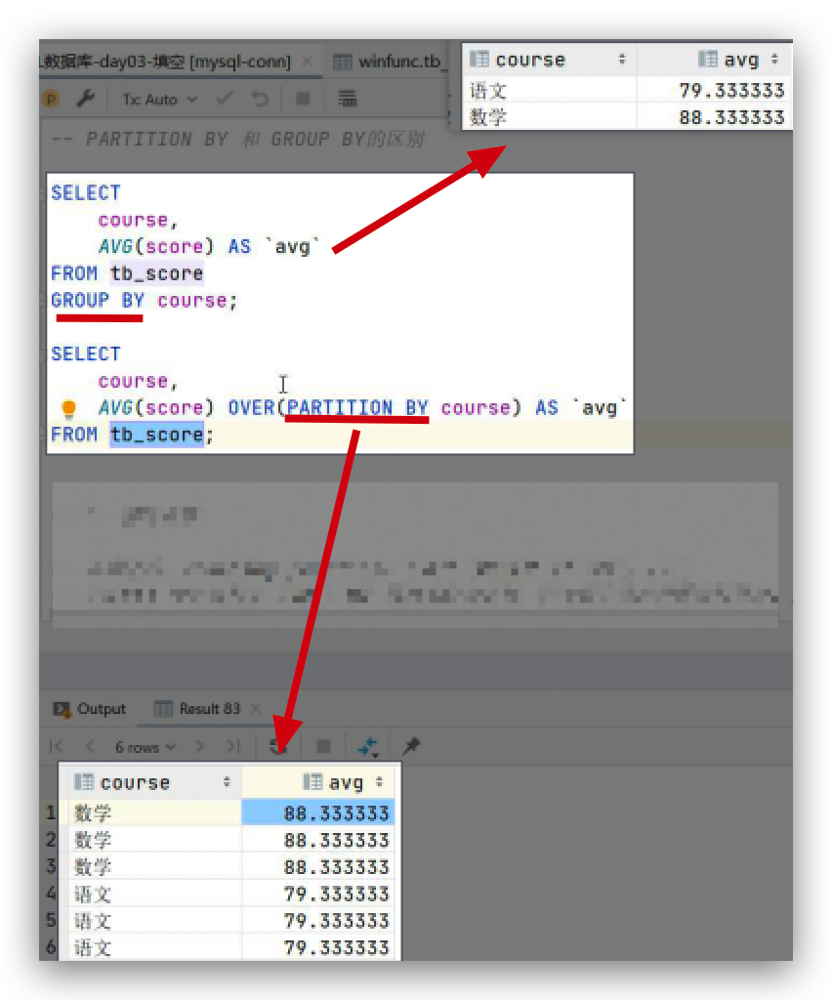
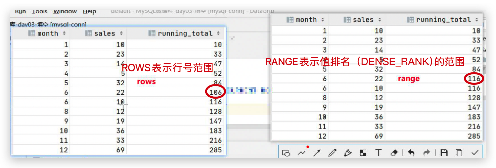

## I. 子查询

1. ### AS起别名

    - #### 给字段起别名

    ```mysql
    -- 示例1：查询每个分类的商品数量
    SELECT
           category_id,
           COUNT(*) product_count
    FROM products
    GROUP BY category_id;
    
    -- 注意: 别名和关键字同名时, 别名两侧要加反引号
    SELECT category_id, COUNT(*) `desc`
    FROM products
    GROUP BY category_id;
    ```

    - #### 给表起别名

    ```mysql
    -- 示例2：查询每个分类名称所对应的商品数量(没有商品的分类的也要显示)
    SELECT
    c.cname, COUNT(*) product_count
    FROM
    category c
    LEFT JOIN products p
    ON c.cid = p.category_id
    GROUP BY c.cname;
    ```

    > ##### 可以给所有别名两端都加反引号``, 确保不会报错

2. ### 子查询操作

    > #####  在一个SELECT语句中, 嵌入了另外一个SELECT语句, 那么被嵌入的SELECT语句称为子查询语句, 外部的SELECT语句称为主查询

    #### 主查询和子查询的关系:

     1. 子查询嵌入到主查询中

     2. ##### 子查询是辅助主查询的, 要么充当条件, 要么充当数据源, 要么充当查询字段

     3. 子查询是可以独立存在的, 是一条完整的SELECT语句

    - ##### 充当条件

    ```mysql
    -- 示例1：查询当前商品大于平均价格的商品
    SELECT pname, price
    FROM products
    WHERE price > (
        SELECT AVG(price)
        FROM products
    );
    
    -- 示例2：获取所有商品中，平均价格大于800的分类的全部商品
    SELECT *
    FROM products
    WHERE category_id IN (
        SELECT category_id
        FROM products
        GROUP BY category_id
        HAVING AVG(price) > 800
    );
    
    -- 示例3：获取所有商品中价格最高的商品(价格最高的商品不只一个)
    -- STEP1. 查询商品最高价格
    SELECT pname,
           price
    FROM products
    WHERE price = (SELECT MAX(price) FROM products);
    ```

    - ##### 充当数据源: 子查询必须起别名

    ```mysql
    -- 示例4：查询不同类型商品的平均价格
    -- 查询结果字段：
    --  category_id(分类id)、cname(分类名称)、avg(分类商品平均价格)
    SELECT category_id `分类id`,
           cname       `分类名称`,
           `avg`       `分类商品平均价格`
    FROM (
             SELECT category_id,
                    AVG(price) `avg`
             FROM products
             GROUP BY category_id
         ) `a`
             JOIN category `b`
                  ON a.category_id = b.cid;   
    ```

    - ##### 充当查询字段

    ```mysql
    -- 示例5：针对 students 表的数据，计算每个同学的Score分数和整体平均分数的差值
    SELECT ID                                        `学生ID`,
           Name                                      `学生姓名`,
           (SELECT AVG(Score) FROM students)         `平均分`,
           Score - (SELECT AVG(Score) FROM students) `差值`
    FROM students;
    ```

## II. 窗口函数(面试高频考点)

1. ### 窗口函数简介

    窗口函数时MySQL8.0后加入的功能, 之前需要通过定义临时变量和大量的自查询才能完成的工作, 使用窗口函数实现起来更加简洁高效.

    优点:

     - 简单
     - 快速
     - 多功能性

2. ### 窗口函数基础用法: OVER关键字

    ```mysql
    -- 基础语法
    <window function> OVER(...)
    ```

    `<window function>`表示使用的窗口函数, 窗口函数可以使聚合函数或者其他函数

    ##### `OVER(…)`的作用就是设置每行数据关联的窗口数据范围, `OVER()`时, 每行关联的数据都是整张表的数据.

    ```mysql
    SELECT
    	*,
    	AVG(Score) OVER() AS `avg`,
    	Score - AVG(Score) OVER() AS `difference`
    FROM students;
    ```

    典型应用场景:

    1. 计算每个值和整体平均值的差值

    ```mysql
    -- 示例1
    # 需求：计算每个学生的 Score 分数和所有学生整体平均分的差值。
    # 查询结果字段：
    #   ID、Name、Gender、Score、AVG_Score(学生整体平均分)、difference(每位学生分数和整体平均分的差值)
    SELECT ID,
           Name,
           Gender,
           Score,
           -- OVER()：表示每行关联的窗口数据范围都是整张表的数据
           -- AVG(Score)：表示处理每行数据时，应用 AVG 对每行关联的窗口数据中的 Score 求平均
           AVG(Score) OVER () AS `AVG_Score`,
           Score - AVG(Score) OVER() AS `difference`
    FROM students;
    ```

    2. 计算每个值占整体之和的占比

    ```mysql
    -- 典型应用场景2：计算每个值占整体之和的占比
    
    # 需求：计算每个学生的Score分数占所有学生分数之和的百分比
    # 查询结果字段：
    #   ID、Name、Gender、Score、sum(所有学生分数之和)、ratio(每位学生分数占所有学生分数之和的百分比)
    SELECT ID,
           Name,
           Gender,
           Score,
           -- OVER()：表示每行关联的窗口数据范围都是整张表的数据
           -- AVG(Score)：表示处理每行数据时，应用 AVG 对每行关联的窗口数据中的 Score 求平均
           SUM(Score) OVER () AS `SUM`,
           Score * 100 / SUM(Score) OVER() AS `ratio`
    FROM students;
    ```

3. ### PARTITION BY分区

    ```mysql
    -- 基础语法
    <window function> OVER(PARTITION BY 列名, ...)
    ```

    - `PARTITION BY 列名, ...`: 按照指定的列对整张表的数据进行分区
    - 分区之后, 在处理每行数据时, `<window function>`是作用在该行数据关联的分区上, 不再是整张表上

    ```mysql
    -- 示例1
    -- 需求：计算每个学生的 Score 分数和同性别学生平均分的差值
    -- 查询结果字段：
    --  ID、Name、Gender、Score、Avg(同性别学生的平均分)、difference(每位学生分数和同性别学生平均分的差值)
    SELECT ID,
           Name,
           Gender,
           Score,
           -- PARTITION BY Gender：按照性别对整张表的数据进行分区，此处会分成2个区
           -- AVG(Score)：处理每行数据时，应用 AVG 对该行关联分区数据中的 Score 求平均
           AVG(Score) OVER (PARTITION BY Gender) AS `分性别学生平均分`,
           Score - AVG(Score) OVER (PARTITION BY Gender) `与同性别学生平均分的差值`
    FROM students;
    
    -- 示例2
    -- 需求：计算每人各科分数与对应科目最高分的占比
    -- 查询结果字段：
    --  name、course、score、max(对应科目最高分数)、ratio(每人各科分数与对应科目最高分的占比)
    SELECT Name,
           course,
           Score,
           MAX(Score) OVER (PARTITION BY course) AS      `各科最高分`,
           Score / MAX(Score) OVER (PARTITION BY course) `与对应科目最高分的占比`
    FROM tb_score;
    ```

    `PARTITION BY`和`GROUP BY`的区别:

    GROUP BY为多进一处, 去重; PARTITION BY多进多出

    

4. ### 排序函数: 产生排名

    ```mysql
    -- 基础语法
    <ranking function> OVER(ORDER BY 列名, ...)
    ```

    - ##### OVER()中可以指定ORDER BY按照指定列对每一行关联的分区数据进行排序, 然后使用排序函数对分区内的每行数据产生一个排名序号

    - ##### 不同的排序函数: 

    ```mysql
    -- RANK()：产生的排名序号 ，有并列的情况出现时序号不连续(1,2,3,3,5,6,6,6,9)
    
    -- DENSE_RANK() ：产生的排序序号是连续的，有并列的情况出现时序号会重复(1,2,3,3,4,5,5,6,7,7,8)
    
    -- ROW_NUMBER() ：返回连续唯一的行号，排名序号不会重复(按照行先后赋予名次)
    ```

    - ##### PARTITION BY和排序函数配合使用:

    ```mysql
    -- 示例1：
    -- 需求：按照不同科目(PARTITION BY course)，对学生的分数从高到低进行排名(要求：连续可重复 --> dense_rank)
    -- 查询结果字段：
    -- name、course、score、dense_rank(排名序号)
    SELECT name,
           course,
           score,
           DENSE_RANK() OVER (
               PARTITION BY course
               ORDER BY score DESC) `dense_rank`
    FROM tb_score;
    ```

    - ##### 典型应用场景: 获取指定排名数据(子查询含排序函数作为数据源)

    ```mysql
    -- 示例1
    -- 需求：获取每个科目，排名第二的学生信息
    -- 查询结果字段：
    --  name、course、score
    SELECT name,
           course,
           score
    FROM (
             SELECT name,
                    course,
                    score,
                    DENSE_RANK() OVER (
                        PARTITION BY course
                        ORDER BY score DESC
                        ) `dense_rank`
             FROM tb_score
         ) `s`
    WHERE `dense_rank` = 2;		# 切记要加反引号, 不是单引号或双引号, 那样会被认为是字符串
    ```

    - ##### **_CTE公用表表达式_**: Common Table Expression, 类似于子查询, 也相当于一张临时表, 可以在CTE结果的基础上, 进行进一步的查询操作

        ```mysql
        -- 标准语法
        WITH some_name AS (
        	--- your cte---
        )
        SELECT
        	...
        FROM some_name
        ```

        - ##### 需要给CTE起一个名字(上例中使用了`some_name`), 具体的查询语句写在括号中

        - ##### 在括号后即可使用`SELECT`将CTE作为一张表来使用

        - > ##### 将CTE称为'内部查询', 其后部分称为'外部查询'.

        - ##### 需要在外部查询的`SELECT`之前定义CTE

    ```mysql
    -- 示例1
    -- 需求：获取每个科目，排名第二的学生信息
    -- 查询结果字段：
    --  name、course、score
    WITH ranking AS (
        SELECT name,
               course,
               score,
               DENSE_RANK() over (
                   PARTITION BY course
                   ORDER BY score DESC
                   ) AS `dense_rank`
        FROM tb_score
    )
    SELECT name,
           course,
           score
    FROM ranking
    WHERE `dense_rank` = 2;
    ```

5. ### 自定义window frame

    ##### 分区数据范围和window frame范围:

    在使用窗口函数处理表中的每行数据时, 每行数据关联的数据有两种:

    1. ##### 每行数据关联的分区数据(PARTITION BY 列名)

    2. ##### 每行数据关联的分区中的window frame数据

        每行数据关联的分区window frame数据范围 <= 每行关联的分区数据范围

    ##### 自定义window frame范围:

    > 自定义window frame有两种方式: `ROWS`和`RANGE`

    ```mysql
    -- 基本语法
    <window function> OVER(
        PARTITION BY 列名, ...
        ORDER BY 列名, ...
        [ROWS|RANGE] BETWEEN 上线 AND 下限
    )
    ```

    ##### 上限和下限的设置:

    `UNBOUNDED PRECEDING`: 对上限无限制

    `n PRECEDING`: 当前行之前的n行, n为具体数字

    `CURRENT ROW`: 仅当前行

    `n FOLLOWING`: 当前行之后的n行, n为具体数字

    `UNBOUNDED FOLLOWING`: 对下限无限制

    **注意**: **上限要在下限之前! ! !**

    `ROWS`: 

    ```mysql
    -- 示例1
    -- 需求：计算截止到每个月的累计销量。1月：1月销量，2月：1月销量 + 2月销量，3月：1月销量 + 2月销量 + 3月销量，依次类推
    -- 查询结果字段：
    --  month(月份)、sales(当月销量)、running_total(截止当月累计销量)
    SELECT month,
           sales,
           SUM(sales) OVER (
               ORDER BY month
               ROWS BETWEEN UNBOUNDED PRECEDING AND CURRENT ROW
               ) AS `running_total`
    FROM tb_sales;
    ```

    > ##### 简略写法: 当使用了`CURRENT ROW` 作为上边界或下边界, 可以使用, 但`不适合于FOLLOWING`的情况:

    `ROWS UNBOUNDED PRECEDING == ROWS BETWEEN UNBOUNDED PRECEDING AND CURRENT ROW`

    `ROWS 5 PRECEDING == ROWS BETWEEN 5 PRECEDING AND CURRENT ROW`

    `ROWS CURRENT ROW == ROWS BETWEEN CURRENT ROW AND CURRENT ROW`

    ##### 上面的例子可以简写为: 

    ```mysql
    SELECT month,
           sales,
           SUM(sales) OVER (
               ORDER BY month
               ROWS UNBOUNDED PRECEDING
               ) AS `running_total`
    FROM tb_sales;
    ```

    `RANGE`: 

    ##### ROWS和RANGE的区别: 

    ##### 	ROWS是根据分区数据ROW_NUMBER()排序值确定每行关联的window frame范围

    ##### 	RANGE是根据分区数据DENSE_RANK()排序值确定每行关联的window frame范围

    ```mysql
    SELECT month,
           sales,
           SUM(sales) OVER (
               ORDER BY month
               ROWS UNBOUNDED PRECEDING
               ) AS `running_total`
    FROM tb_sales;
    
    SELECT month,
           sales,
           SUM(sales) OVER (
               ORDER BY month
               RANGE UNBOUNDED PRECEDING
               ) AS `running_total`
    FROM tb_sales;	# RANGE表示和当前行排序列的值相同的所有行
    ```

    

    ##### 默认的window frame:

    1. 在OVER中只要添加了ORDER BY并没有指定ROWS或RANGE的情况下, 默认的window frame范围是: 

        `RANGE BETWEEN UNBOUNDED PRECEDING AND CURRENT ROW`

    > ##### OVER()中不写ORDER BY只写RANGE是没有效果的, 但是只写ROWS是有效果的

    ```mysql
    -- 示例1：需求：计算截止到每个月的累计销量。1月：1月销量，2月：1月销量+2月销量，3月：1月销量+2月销量+3月销量，依次类推
    -- 查询结果字段：
    --  month(月份)、sales(当月销量)、running_total(截止当月累计销量)
    SELECT month `月份`,
           sales `当月销量`,
           SUM(sales) OVER (
               ORDER BY month
               ) AS `截止当前累计销量`
    FROM tb_sales;
    ```

    ##### PARTITION BY和自定义window frame:

    ```mysql
    -- 示例1
    -- 需求：计算每个商店截止到每个月的累计销售额。1月：1月销量，2月：1月销量+2月销量，3月：1月销量+2月销量+3月销量，依次类推
    -- 查询结果字段：
    --  store_id(商店id)、month(月份)、revenue(当月销售额)、sum(截止当月累计销售额)
    SELECT store_id,
           month,
           revenue,
           SUM(revenue) OVER (
               PARTITION BY store_id
               ORDER BY month
               ROWS UNBOUNDED PRECEDING
               ) AS `sum`
    FROM tb_revenue;
    ```

    ### 注意: 排序函数不受window frame影响, 聚合函数受window frame影响

    原地复习: 

    ​	排序函数: `RANK()`, `DENSE_RANK()`, `ROW()`

    ​	聚合函数: `MAX()`, `MIN()`, `SUM()`, `AVG()`, `COUNT()`等等.


