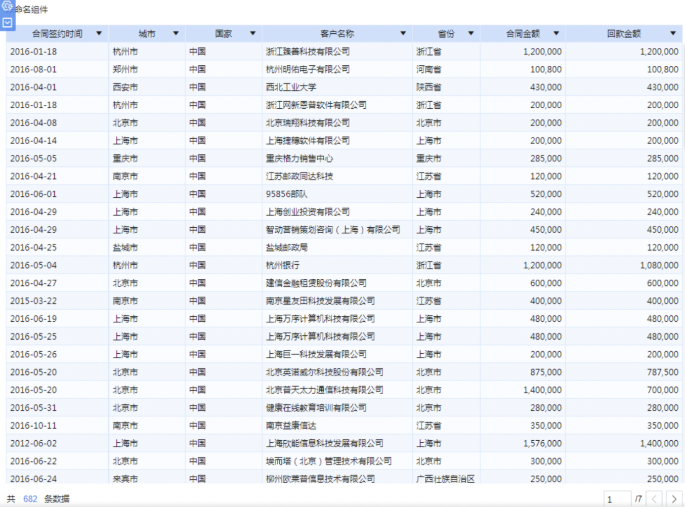
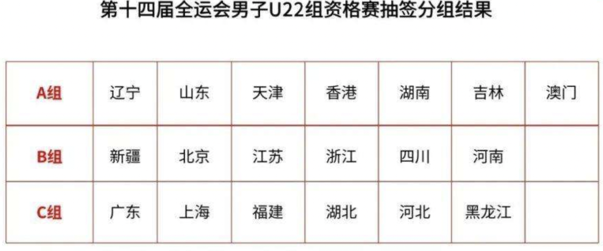
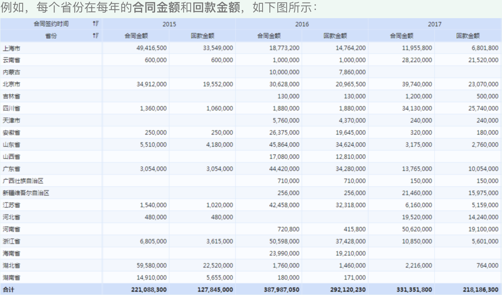
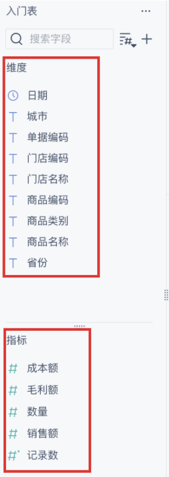
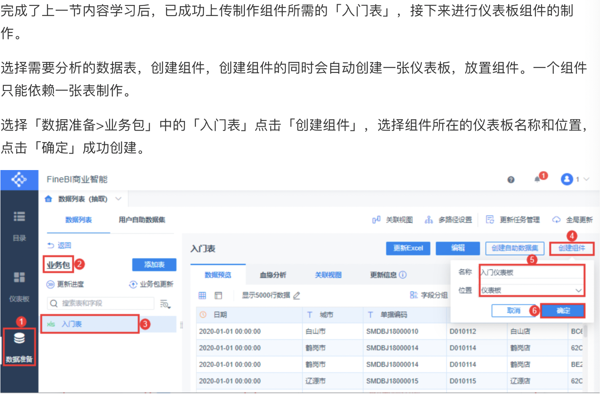
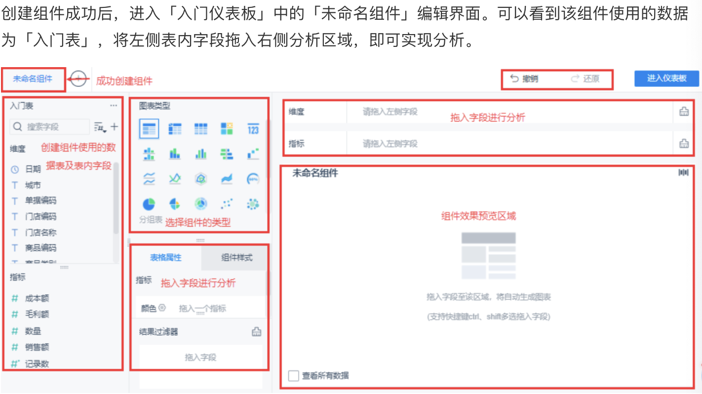
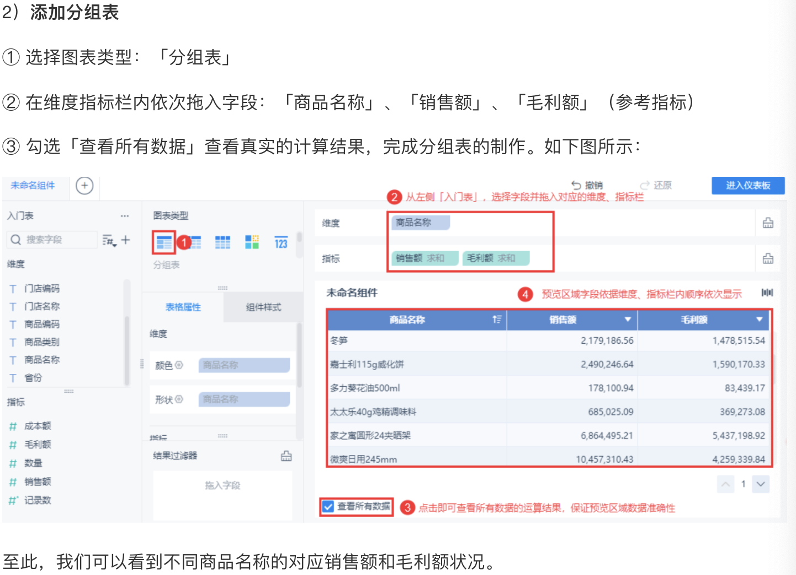
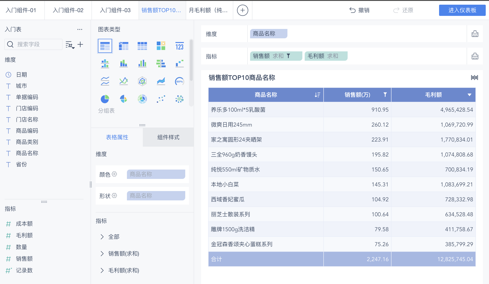
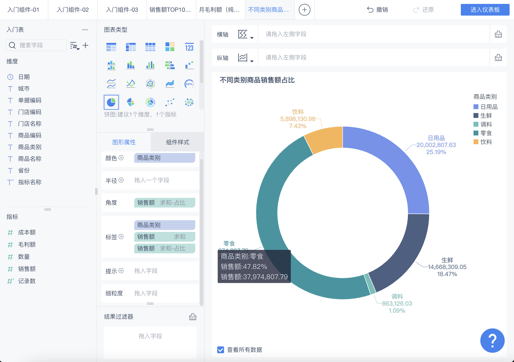

# FineBI

#### BI概念: Business Intelligence, 商业智能(数据驱动决策), 是一套完整的解决方案, 用来将企业中现有的数据进行有效的整合, 快速准确地提供报表并提出决策依据, 帮助企业做出明智的经营决策.

> ##### 通俗的说: 商业智能是一整套方案, 充分利用企业在日常经营过程中产生的大量数据, 让企业的每一个决定, 管理细节, 战略规划都有数据可依, 避免瞎猜行为和无知状态.

从**数据分析从业者**来说, 最重要的的是根据企业的数据做出**数据报表**.

#### FineBI是帆软出品的自助式分析BI工具, 是实现数据报表的工具. 实现数据可视化的工具有很多, 比如Tableau, Qlik, Smartbi等.

FineBI的优势: 

 1. ##### 市场占有率高

 2. ##### 简单易上手

 3. ##### 有用户社区

> ##### FineBI是一款纯**B/S**的商业智能分析服务平台; 支持通过Web应用服务器将其部署在服务器上, 提供企业云服务器. 用户端只需要使用浏览器即可进行服务平台的访问和使用.

## I. FineBI的使用流程

```shell
# FineBI使用流程
Step1. 数据准备
	管理员连接到数据库并准备分配数据
Step2. 数据加工(数据处理)
	业务人员进行数据的再处理加工
Step3. 可视化分析(生成各种图表)
	业务员构建的可视化多维分析, 图表, 表格, 过滤组件等
Step4. 仪表盘(把各种图表整合在一起)
	设计出色的整体仪表盘来展现分析结果
Step5. 分享仪表盘
	将仪表盘分享给其他人

# FineBI学习流程
Step1. 连接数据
Step2. 创建组件和分析数据
Step3. 可视化组件
Step4. 添加交互效果
Step5. 仪表盘的制作和分享
```

## II. FineBI连接数据

##### 多种方式获取数据:

- 数据库(直接从数据库中获取数据)
- SQL数据集(导入SQL数据集)
- Excel数据集(导入Excel数据集)
- 自主数据集(可自行对已有数据集进行处理产生新的数据集)

##### 数据连接步骤: 

1. 添加业务包
2. 添加表
3. 更新数据

## III. 表格分类&维度和指标

展示数据的方式多种多样, 最常见的方式就是**表格**的形式, FineBI提供了三种表格形式:

1. ##### 明细表

    支持对数据进行纵向扩展，将数据展示为一个列表式的表格，能够直观的看出所有数据的明细。最大的特点就是将数据一条一条的展示出来。

    

2. ##### 分组表

    分组表将报表中的数据按相同指标并为一组显示，例如按照男女这个指标，把男性数据和女性数据分别显示出来。

    

3. ##### 交叉表

    交叉表一组作为行标题显示在表的左部，另一组作为列标题显示在表的顶部，而行与列的交叉点的单元格则显示数值。可以让数据进行横向扩展和纵向扩展，支持从两个维度（变量）定位一个指标。

    

#### 维度和指标:

##### 维度: 说明数据, 说明数据是什么. 比如这个数据是销售量还是利润等

##### 指标: 衡量数据, 对数据的量化, 比如销售量是100元, 利润是50元等



## IV. 创建组件和分组表分析

太方便了.

1. 创建组件
    - 数据准备 —> 业务包 —> 数据表 —> 创建组件







2. 分组表分析

- 选择分组表 —> 维度和指标字段添加 —> 查看分析结果

## V. 分组表分析案例

1. 销售额top10商品名称

    

2. 月毛利额(纯利润)环比增长率

    

## VI. 可视化组件分析

1. 饼图

    

## VII. 钻取案例

## VIII. 仪表盘制作