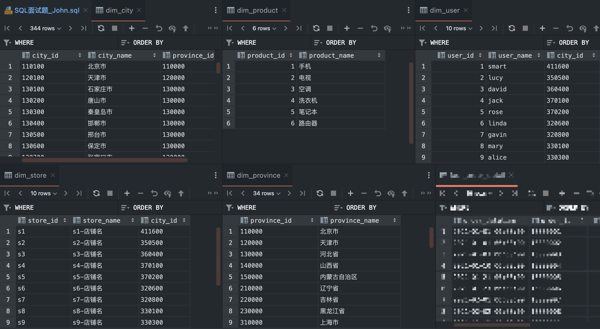
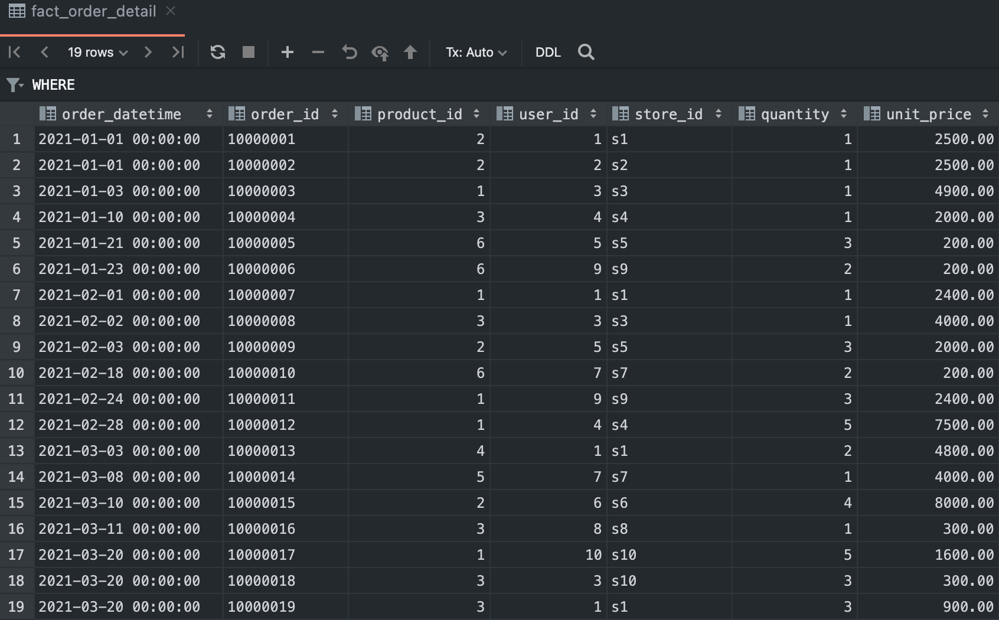

## Q1. 求每个月的每个省份的店销销售额 （单个订单的销售额=quantity * unit_price)

### 思路解析: 

1. ##### 按照月份和省份分组

2. ##### 月份 —> 订单表

3. ##### 省份 —> 省份表

4. ##### 订单表 —> 店铺表 —> 城市表 —> 省份表

```mysql
SELECT MONTH(order_datetime) '月份',
       province_name '省份',
       SUM(quantity * unit_price) '销售额'
FROM fact_order_detail
LEFT JOIN dim_store ds on fact_order_detail.store_id = ds.store_id
LEFT JOIN dim_city dc on ds.city_id = dc.city_id
LEFT JOIN dim_province dp on dc.province_id = dp.province_id
GROUP BY MONTH(order_datetime), province_name;
```

## Q2. 求每个月的每个产品的销售额及其在当月的销售额占比

### 思路解析:

1. ##### 

```mysql

```


## Q3. 求每个月的销售额及其环比（销售额环比 =（本月销售额 - 上月销售额）/上月销售额）

### 思路解析:

1. ##### 

```mysql
WITH dim_orders AS (
    SELECT MONTH(order_datetime) `month`,
           order_id,
           product_id,
           user_id,
           store_id,
           quantity,
           unit_price
    FROM fact_order_detail
),
     dim_month_revenue AS (
         SELECT `month`,
                SUM(quantity * unit_price) `month_revenue`
         FROM dim_orders
         GROUP BY `month`
     )
SELECT a.month,
       a.month_revenue                                                                    `当前月销售额`,
       b.month_revenue                                                                    `上个月销售额`,
       CONCAT(ROUND((a.month_revenue - b.month_revenue) * 100 / b.month_revenue, 2), '%') `环比`
FROM dim_month_revenue a
         LEFT JOIN dim_month_revenue b
                   ON a.month = b.month + 1;
```


## Q4. 求每个月比较其上月的新增用户量及其留存率（新增用户"定义为上月未产生购买行为且木月产生了购买行为的用户，“留存用户”定义为上月产生过购买行为且本月也产生了购买行为的人，留存名=本月留存用户数量/上月产生过购买用户数量)

### 思路解析:

1. ##### 

```mysql
WITH month_order_user AS (SELECT DISTINCT MONTH(order_datetime) `month`,
                                          user_id
                          FROM fact_order_detail
),
     tb_temp1 AS (SELECT a.month `current_month`,
                         a.user_id,
                         b.month `previous_month`
                  FROM month_order_user a
                           LEFT JOIN month_order_user b
                                     ON a.user_id = b.user_id
                                         AND a.month = b.month + 1),
     tb_temp2 AS (SELECT current_month,
                         -- 计算每个月的新增用户
                         COUNT(*) - COUNT(previous_month)                             `新增用户`,
                         -- 计算每个月的留存用户
                         COUNT(CASE WHEN previous_month IS NOT NULL THEN user_id END) `留存用户`,
                         COUNT(user_id)                                               `总购买用户数`
                  FROM tb_temp1
                  GROUP BY current_month)
SELECT current_month,
       新增用户,
       留存用户,
       总购买用户数,
       LAG(总购买用户数) over (ORDER BY current_month)                                     `pre_total`,
       CONCAT(ROUND(留存用户 * 100 / LAG(总购买用户数) over (ORDER BY current_month), 2), '%') `RATIO`
FROM tb_temp2;
```


