# Redis内存数据库

## I. 初识Redis

### 1. Redis概述

> 官方定义：**Redis 是一个开源（BSD许可）的，内存中的数据结构存储系统，它可以用作数据库、缓存和消息中间件。** 
>
> - ==所有数据存储在内存中==，并且有**持久化机制**
> - 每次redis重启，会从文件中重新加载数据到内存，**所有读写都只基于内存**

1. 支持多种类型的数据结构，字符串（strings）， 散列（hashes）， 列表（lists）， 集合（sets）， 有序集合（sorted sets） 与范围查询， bitmaps， hyperloglogs 和 地理空间（geospatial） 索引半径查询。
2. Redis 内置了 复制（replication），LUA脚本（Lua scripting）， LRU驱动事件（LRU eviction），事务（transactions） 和不同级别的 磁盘持久化（persistence）， 并通过 Redis哨兵（Sentinel）和自动 分区（Cluster）提供高可用性（high availability）。

> Redis 数据库主要应用场景：

- **缓存**：用于实现大数据量高并发的大数据量缓存【临时性存储】

  - 网站架构中：接受高并发的缓存读写请求

- **数据库**：用于实现高性能的小数据量读写【永久性存储】

  - 大数据平台中：高性能，一般用于作为实时计算结果的存储

  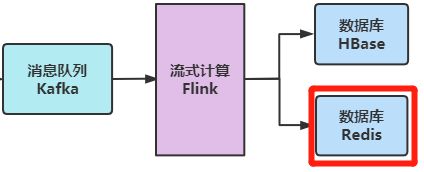

### 2. Redis安装

> 大多数企业都是基于Linux服务器来部署项目，而且Redis官方也没有提供Windows版本的安装包。因此课程中基于Linux系统来安装Redis，此处选择的Linux版本为CentOS 7。
>
> 下载地址：https://download.redis.io/releases/

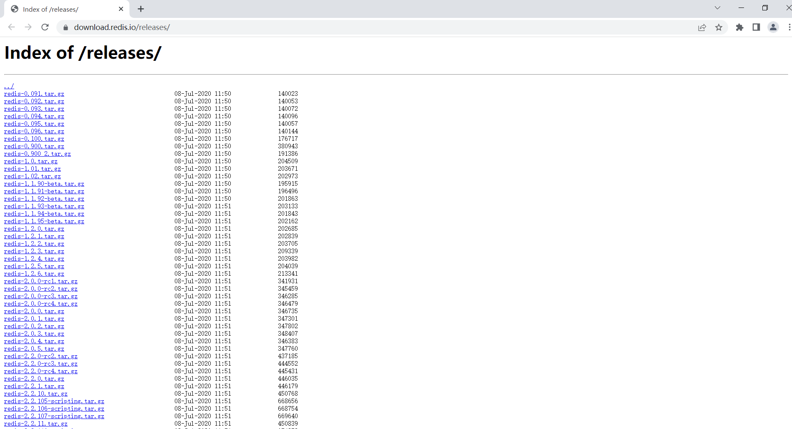

- **安装依赖**

  Redis是基于C语言编写的，因此首先需要安装Redis所需要的gcc依赖：

  ```ini
  yum -y install gcc-c++ tcl
  ```

  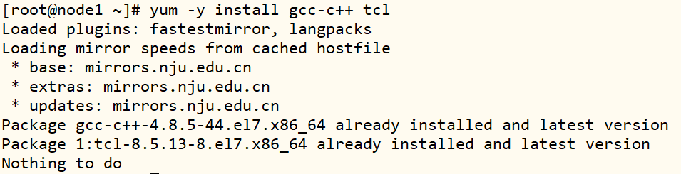

- **上传**源码

  ```ini
  cd /export/software/
  rz
  	redis-5.0.8.tar.gz
  ```

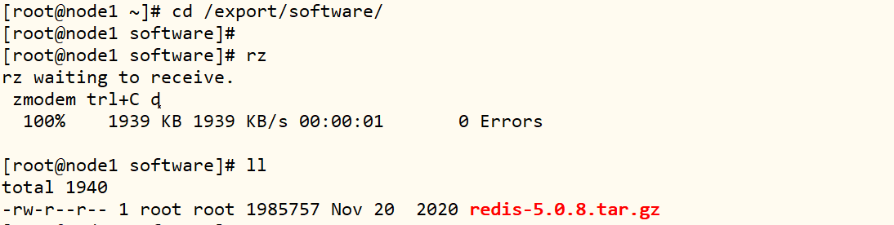

- **解压**

  ```ini
  tar -zxvf redis-5.0.8.tar.gz -C /export/server/
  ```

- **编译安装**

  ```ini
  # 进入源码目录
  cd /export/server/redis-5.0.8/
  
  # 编译
  make
  ```

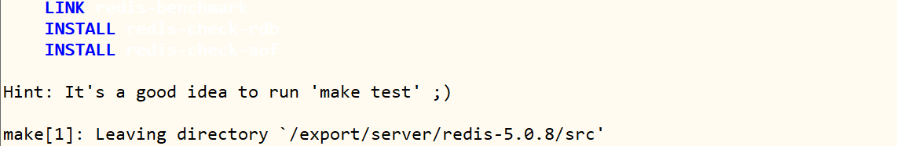

```ini
# 安装，并指定安装目录
make PREFIX=/export/server/redis install
```


- **修改配置**

  - 复制配置文件

    ```bash
    cp /export/server/redis-5.0.8/redis.conf /export/server/redis/
    ```

    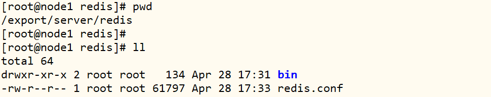

  - 创建目录

    ```shell
    # redis日志目录
    mkdir -p /export/server/redis/logs
    # redis数据目录
    mkdir -p /export/server/redis/datas
    ```

    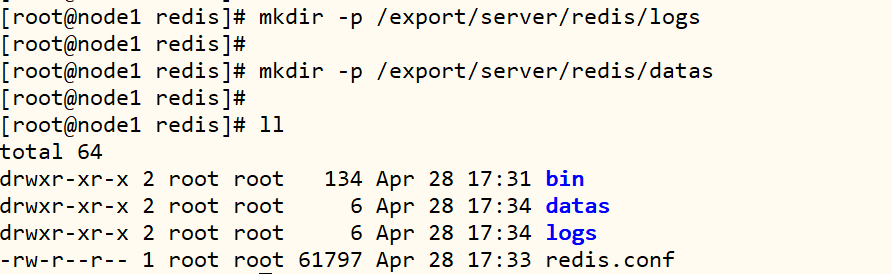

  - 修改配置

    ```bash
    vim /export/server/redis/redis.conf
    ```

    ```shell
    ## 69行，配置redis服务器接受链接的网卡
    bind 0.0.0.0
    
    ## 136行，redis是否后台运行，设置为yes
    daemonize yes
    
    ## 171行，设置redis服务日志存储路径
    logfile "/export/server/redis/logs/redis.log"
    
    ## 263行，设置redis持久化数据存储目录
    dir /export/server/redis/datas/
    ```

  - 配置环境变量

    ```bash
    vim /etc/profile
    ```

    ```bash
    # REDIS HOME
    export REDIS_HOME=/export/server/redis
    export PATH=:$PATH:$REDIS_HOME/bin
    ```

    ```bash
    source /etc/profile
    ```

- **服务启动**

  ```bash
  # 启动，指定配置文件
  /export/server/redis/bin/redis-server /export/server/redis/redis.conf
  # 查看启动
  ps -ef|grep redis
  ```

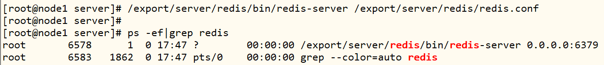

- 命令行客户端

  ```bash
  redis-cli -h node1.itcast.cn -p 6379
  ```

  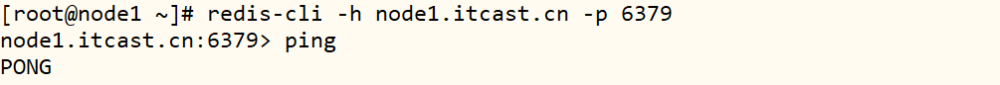

- 测试

  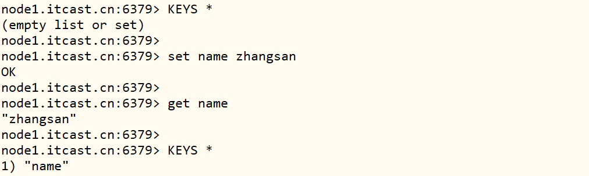

- 关闭服务

  - 方式一：客户端中

  ```bash
  shutdown
  ```

  - 方式二：Linux命令行

  ```bash
  kill -9 redis的pid
  ```

  - 方式三：通过客户端命令进行关闭

  ```bash
  redis-cli -h node1.itcast.cn -p 6379  shutdown
  ```

- 启动脚本

  ```bash
  vim /export/server/redis/bin/redis-start.sh
  ```

  添加内容

  ```bash
  #!/bin/bash
  
  REDIS_HOME=/export/server/redis
  ${REDIS_HOME}/bin/redis-server ${REDIS_HOME}/redis.conf
  ```

  执行权限

  ```bash
  chmod u+x /export/server/redis/bin/redis-start.sh 
  ```

### 3. Redis客户端

> 安装完成Redis，可以操作Redis，实现数据的CRUD，需要用到Redis客户端，包括：
>
> - 命令行客户端
> - 图形化桌面客户端
> - 编程客户端

#### Redis命令行客户端

Redis安装完成后就自带了命令行客户端：`redis-cli`，使用方式如下：

```shell
redis-cli [options] [commonds]
```

其中常见的options有：

- `-h node1.itcast.cn`：指定要连接的redis节点的IP地址，默认是127.0.0.1
- `-p 6379`：指定要连接的redis节点的端口，默认是6379

其中的commonds就是Redis的操作命令，例如：

- `ping`：与redis服务端做心跳测试，服务端正常会返回`pong`

不指定commond时，会进入`redis-cli`的交互控制台：

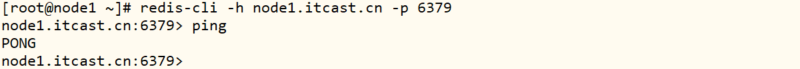

#### 图形化桌面客户端

GitHub上的大神编写了Redis的图形化桌面客户端，地址：https://github.com/uglide/RedisDesktopManager

不过该仓库提供的是**RedisDesktopManager**的源码，并未提供windows安装包。

在下面这个仓库可以找到安装包：https://github.com/lework/RedisDesktopManager-Windows/releases

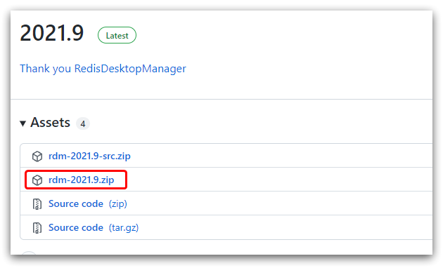

> 安装RedisDesktopManager

在课程【05_软件及配置】中可以找到Redis的图形化桌面客户端：

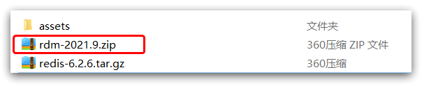

解压缩后，运行安装程序即可安装，此处略。

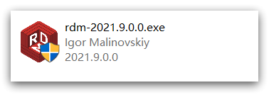

安装完成后，在安装目录下找到rdm.exe文件：

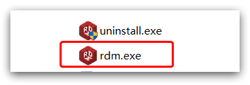

双击即可运行：

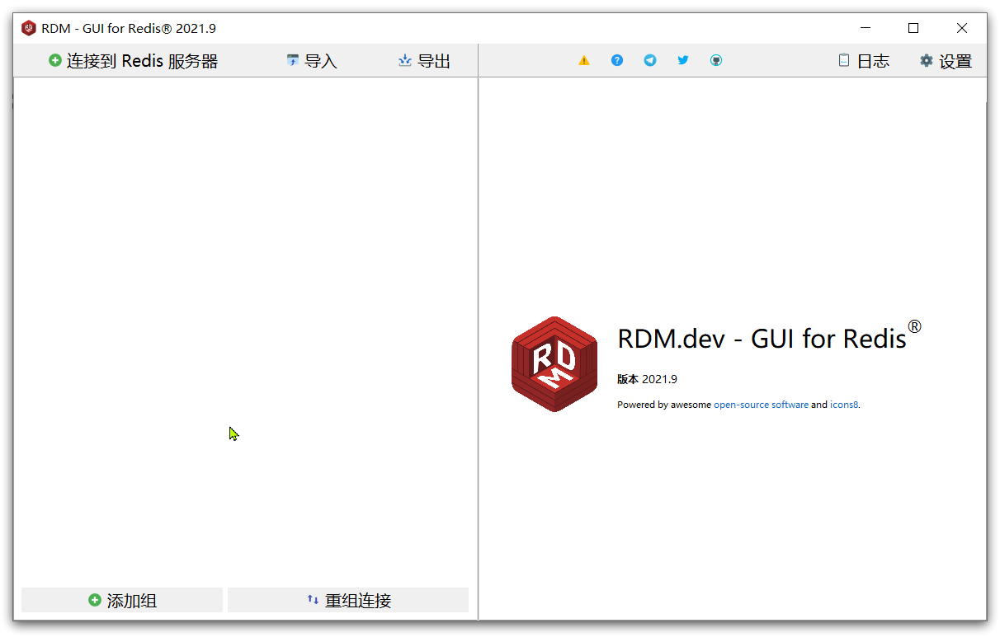

> 建立连接

点击左上角的`连接到Redis服务器`按钮：

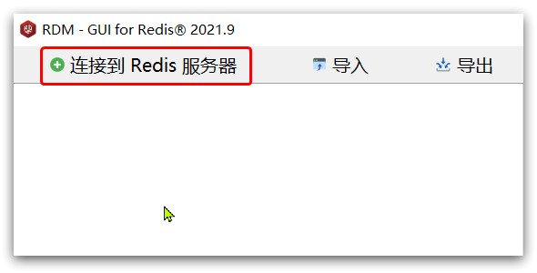

在弹出的窗口中填写Redis服务信息：

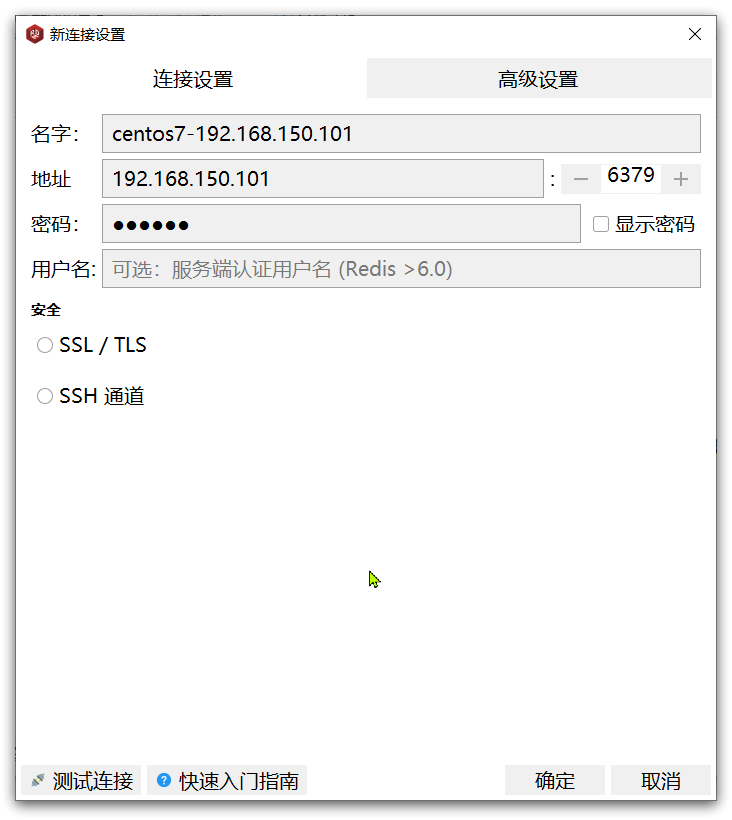

点击确定后，在左侧菜单会出现这个链接：

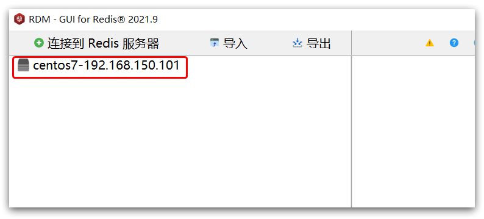

点击即可建立连接了：

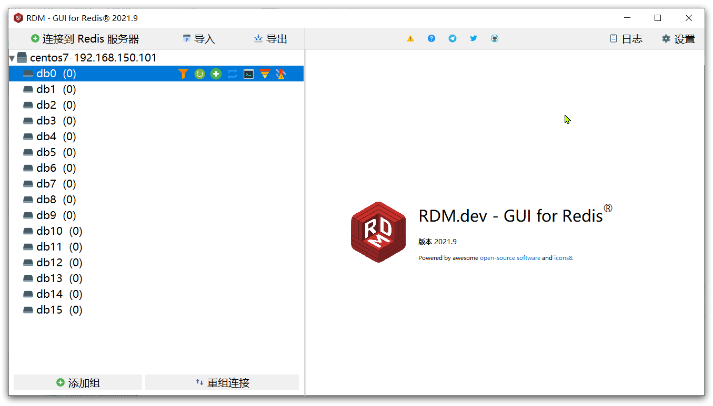

Redis默认有16个仓库，编号从0至15，配置文件可以设置仓库数量，但是不超过16，并且不能自定义仓库名称。

## II. Redis常见命令

### 1. Redis数据结构

> Redis是一个key-value的数据库，**key一般是String类型，不过value的类型多种多样**：

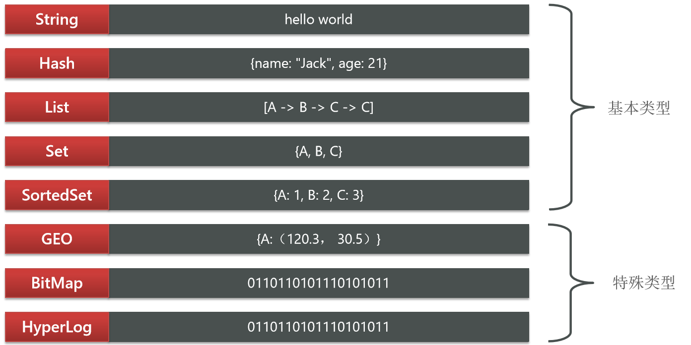

> Redis为了方便我们学习，将操作不同数据类型的命令也做了分组，在官网（ https://redis.io/commands ）可以查看到不同的命令：https://redis.io/commands/

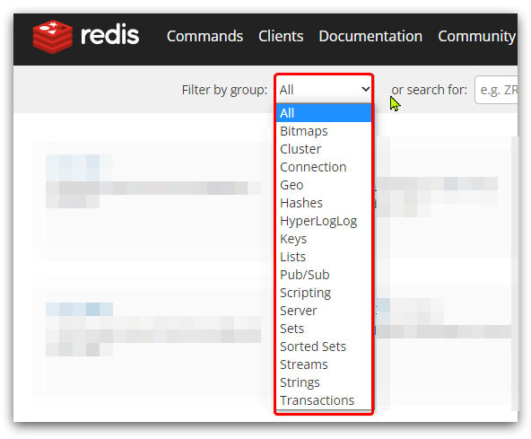

> 帮助命令：**help**

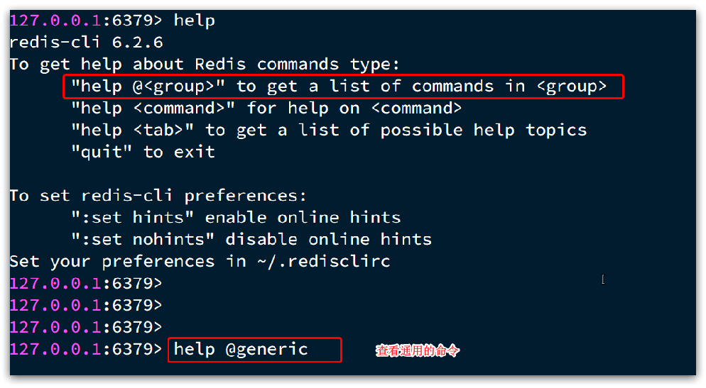

### 2. Redis通用命令

> Redis中通用命令语法：

- ==**keys**==：列举当前数据库中所有Key
  - 语法：keys  通配符
- ==**del key**==：删除某个KV
- **exists key** ：判断某个Key是否存在
  - 返回值：1，表示存在
  - 返回值：0，表示不存在
- **type key**：判断这个K对应的V的类型的
- ==**expire K** 过期时间==：设置某个K的过期时间，一旦到达过期时间，这个K会被自动删除
- **ttl K**：查看某个K剩余的存活时间
- **select N**：切换数据库的
  - Redis默认由16个数据：db0 ~ db15，个数可以通过配置文件修改，名称不能改
  - **Redis是一层数据存储结构：所有KV直接存储在数据库中**
  - 默认进入db0
- **flushdb**：清空当前数据库的所有Key
- **flushall**：清空所有数据库的所有Key

### 3. String类型命令

> String 类型数据底层：三种存储类型 -> [string 字符串、int整数类型，float 浮点类型]()

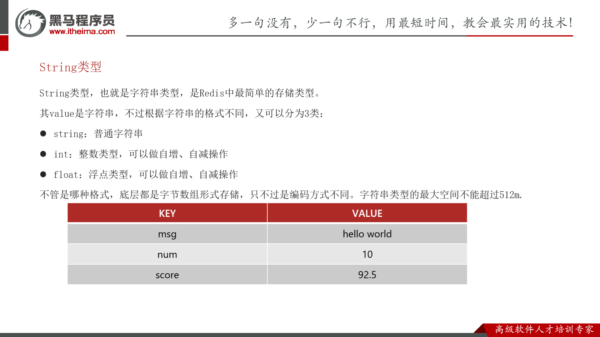

> String 类型中常见命令

- set：给String类型的Value的进行赋值或者更新
  - 语法：`set  K      V`
- get：读取String类型的Value的值
  - 语法：`get K`
- mset：用于批量写多个String类型的KV
  - 语法：`mset  K1 V1  K2 V2 ……`
- mget：用于批量读取String类型的Value
  - 语法：`mget   K1  K2  K3 ……`
- setnx：只能用于新增数据，当K不存在时可以进行新增
  - 语法：`setnx  K  V`
- incr：用于对==数值类型==的字符串进行递增，递增1，一般用于做计数器
  - 语法：`incr  K`
- incrby：指定对数值类型的字符串增长固定的步长
  - 语法：`incrby  K   N`
- decr：对数值类型的数据进行递减，递减1
  - 语法：`decr K`
- decrby：按照指定步长进行递减
  - 语法：`decrby  K  N`
- incrbyfloat：基于浮点数递增
  - 语法：`incrbyfloat   K   N` 
- strlen：统计字符串的长度
  - 语法：`strlen  K`
- getrange：用于截取字符串
  - 语法：`getrange  s2  start   end`，包头包尾

> Redis 中key结构设置建议：

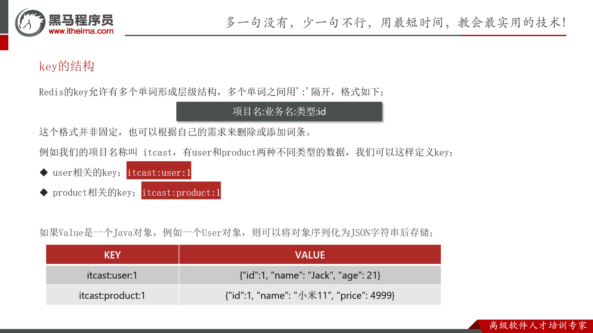

### 4. Hash类型命令

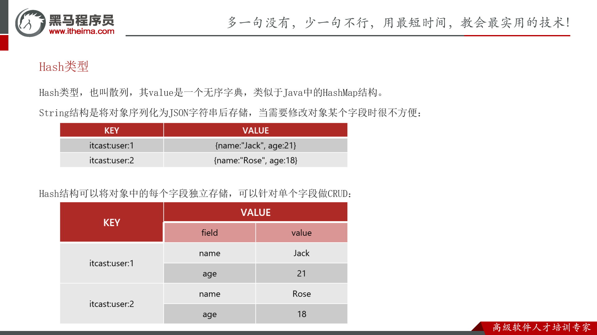

> Hash 类型常用命令：

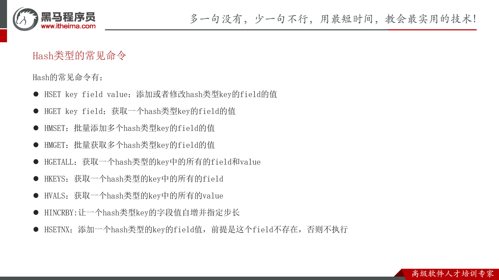

- hset：用于为某个K添加一个属性
  - 语法：`hset  K   k  v`
- hget：用于获取某个K的某个属性的值
  - 语法：`hget K  k`
- hmset：批量的为某个K赋予新的属性
  - 语法：`hmset  K   k1 v1 k2 v2 ……`
- hmget：批量的获取某个K的多个属性的值
  - 语法：`hmget  K  k1 k2 k3……`
- hgetall：获取所有属性的值
  - 语法：`hgetall  K`
- hdel：删除某个属性
  - 语法：`hdel   K   k1 k2 ……`
- hlen：统计K对应的Value总的属性的个数
  - 语法：`hlen  K`
- hexists：判断这个K的V中是否包含这个属性
  - 语法：`hexists  K  k`
- hvals：获取所有属性的value的
  - 语法：`hvals   K`

### 5. List类型命令

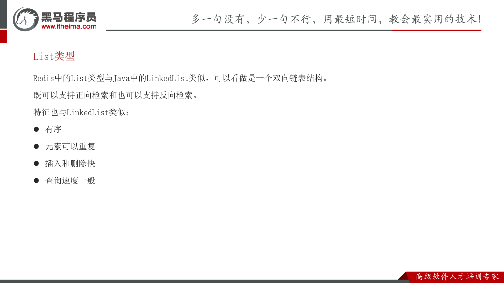

> List 类型中常见命令：

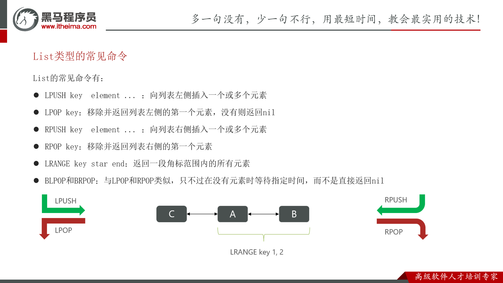

- lpush：将每个元素放到集合的左边，左序放入
  - 语法：`lpush   K    e1  e2  e3……`
- rpush：将每个元素放到集合的右边，右序放入
  - 语法：`rpush   K    e1  e2  e3……`
- **lrange**：通过下标的范围来获取元素的数据
  - 语法：`lrange  K  start   end`
  - 注意：从左往右的下标从0开始，从右往左的下标从-1开始，一定是从小的到大的下标
  - `lrange K  0  -1`：所有元素
- **llen：**统计集合的长度
  - 语法：`llen   K`
- lpop：删除左边的一个元素
  - 语法：`lpop  K`
- rpop：删除右边的一个元素
  - 语法：`rpop  K`

### 6. Set类型命令

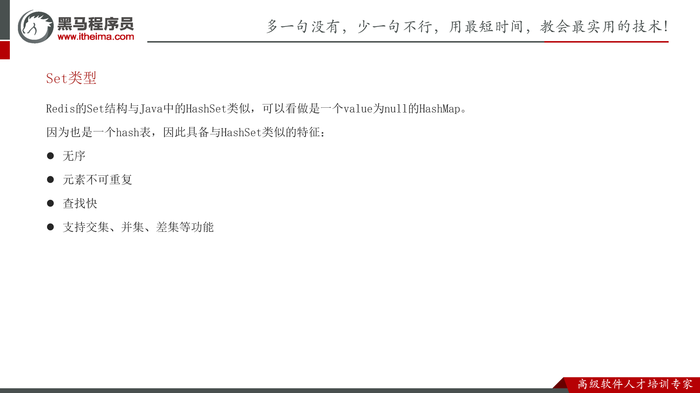

> Set 类型常见命令：

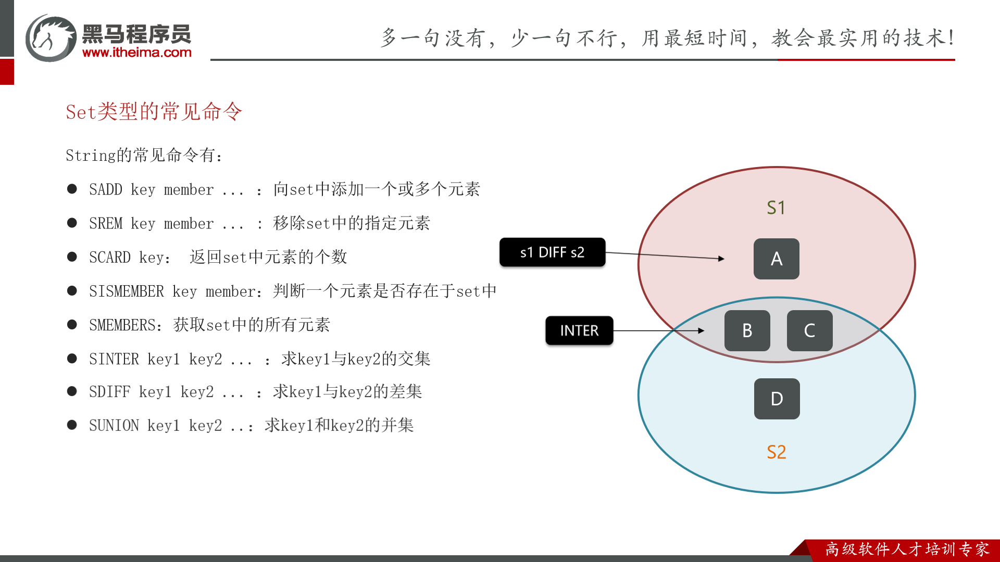

- sadd：用于添加元素到Set集合中
  - 语法：`sadd  K   e1 e2 e3 e4 e5……`
- smembers：用于查看Set集合的所有成员
  - 语法：`smembers  K`
- sismember：判断是否包含这个成员
  - 语法：`sismember K   e1`
- srem：删除其中某个元素
  - 语法：`srem  K  e`
- **scard：统计集合长度**
  - 语法：`scard  K` 
- sunion：取两个集合的并集
  - 语法：`sunion  K1  K2`
- sinter：取两个集合的交集
  - 语法：`sinter  K1 K2`

> Set 类型命令练习：

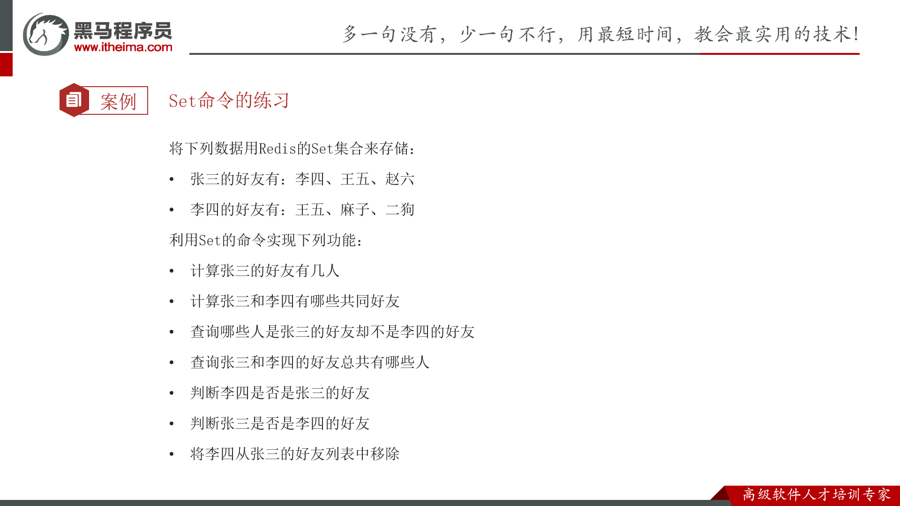

### 7. SortedSet类型命令

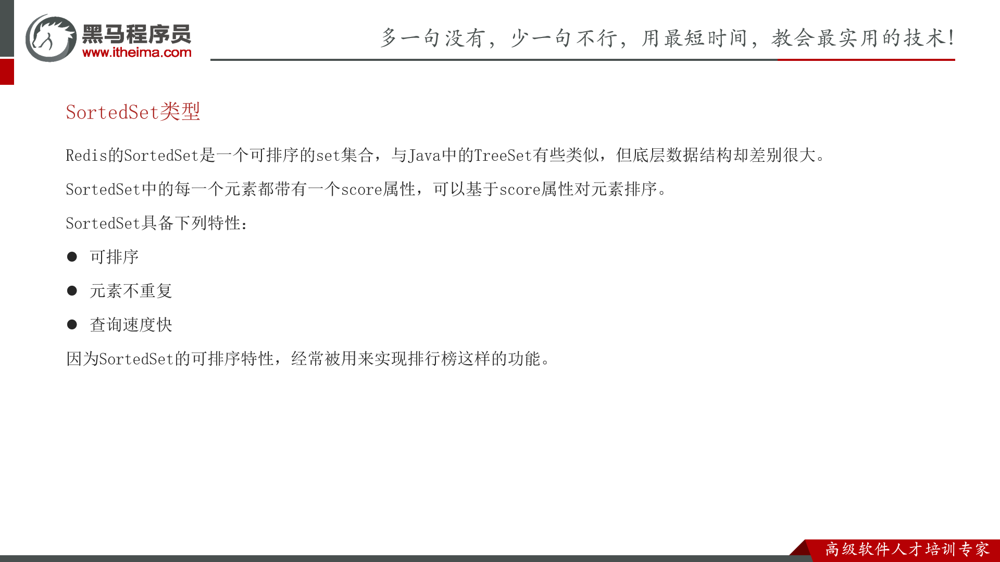

> SortedSet 类型常用命令

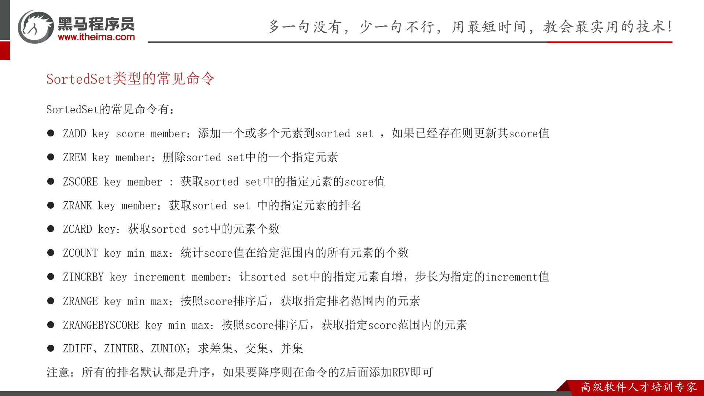

- zadd：用于添加元素到Zset集合中
  - 语法：`zadd  K   score1  k1  score2  k2  ……`
- zrange：范围查询
  - 语法：`zrange   K    start   end   [withscores]`
- zrevrange：倒序查询
  - 语法：`zrevrange   K    start   end   [withscores]`
- zrem：移除一个元素
  - 语法：`zrem  K   k1`
- zcard：统计集合长度
  - 语法：`zcard K`
- zscore：获取评分
  - 语法：`zscore  K  k`

> SortedSet 练习


## III. Jedis客户端

### 1. Jedis连接

> Jedis的官网地址： https://github.com/redis/jedis，先来个快速入门：

1. 引入依赖

   ```xml
   <dependency>
   	<groupId>redis.clients</groupId>
   	<artifactId>jedis</artifactId>
   	<version>3.2.0</version>
   </dependency>
   ```

2. 建立连接

   ```Java
   // 建立连接
   Jedis jedis = new Jedis("192.168.88.100", 6379);
   // 选择库
   jedis.select(0);
   ```

3. 关闭连接，释放资源

   ```Java
   // 释放资源
   if (jedis != null) {
     jedis.close();
   }
   ```

> 案例演示：构建Jedis连接，发送命令ping，查看是否连接。

```Java
package cn.itcast.redis;

import redis.clients.jedis.Jedis;

/**
 * 获取Jedis连接，直接传递参数获取
 */
public class JedisConnTest {

	public static void main(String[] args) {
		// TODO: step1. 创建Jedis连接对象，创建参数
		Jedis jedis = new Jedis("node1.itcast.cn", 6379);
		// 选择数据库
		jedis.select(0) ;

		// TODO: step2. 测试连接
		String pingValue = jedis.ping();
		System.out.println(pingValue);

		// TODO: step3. 关闭连接
		jedis.close();
	}
}
```

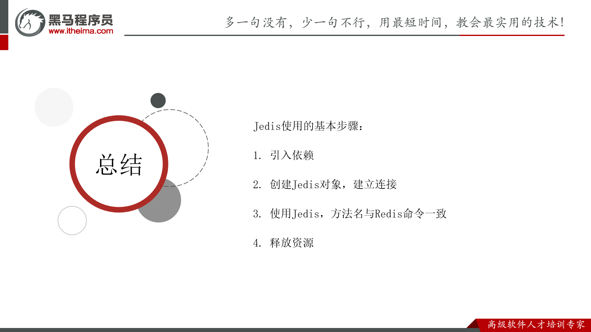

### 2. String操作


> 以Redis中String类型为例，使用Jedis API操作数据，进行set设置和get获取值。


- Jedis API实现功能

------

```bash
set/get/exists/expire/ttl
```


- 演示代码：

```java
package cn.itcast.redis;

import org.junit.After;
import org.junit.Before;
import org.junit.Test;
import redis.clients.jedis.Jedis;

import java.util.concurrent.TimeUnit;

/**
 * Jedis API操作Jedis数据库中数据
 */
public class JedisApiTest {

	// 定义Jedis变量
	private Jedis jedis = null ;

	@Before
	public void open(){
		// TODO: step1. 获取连接
		jedis = new Jedis("node1.itcast.cn", 6379);
	}

	@Test
	public void testString() throws Exception{
		// TODO: step2. 使用连接，操作Redis数据，数据类型为String
		/*
			set/get/exists/expire/ttl
		 */
		jedis.set("name","Jack");
		System.out.println(jedis.get("name"));

		System.out.println(jedis.exists("name"));
		System.out.println(jedis.exists("age"));

		jedis.expire("name",10);
		Long ttl = -1L ;
		while(-2 != ttl){
			ttl = jedis.ttl("name") ;
			System.out.println("ttl = " + ttl);

			TimeUnit.SECONDS.sleep(1);
		}
	}


	@After
	public void close(){
		// TODO: step3. 关闭连接
		if(null != jedis) jedis.close();
	}
}
```

### 3. JedisPool连接池

> 