# HBase分布式数据库

## I. Redis分布式缓存

### 1. RDB持久化

> RDB全称Redis Database Backup file（Redis数据备份文件），也被叫做Redis数据快照。简单来说就是[把内存中的所有数据都记录到磁盘中]()。
>
> - 当Redis实例故障重启后，从磁盘读取快照文件，恢复数据。
> - 快照文件称为RDB文件，默认是保存在当前运行目录。
> - RDB持久化在四种情况下会执行：
>   - 执行save命令
>   - 执行bgsave命令
>   - Redis停机时
>   - 触发RDB条件时

**1）save命令**

执行下面的命令，可以立即执行一次RDB, save命令会导致主进程执行RDB，这个过程中其它所有命令都会被阻塞。只有在数据迁移时可能用到。

**2）bgsave命令**

命令：`bgsave` 可以异步执行RDB, 这个命令执行后会开启独立进程完成RDB，主进程可以持续处理用户请求，不受影响。

**3）停机时**

Redis停机时会执行一次save命令，实现RDB持久化。

**4）触发RDB条件**

Redis内部有触发RDB的机制，可以在redis.conf文件中找到，格式如下：

```properties
# 900秒内，如果至少有1个key被修改，则执行bgsave ， 如果是save "" 则表示禁用RDB
save 900 1  
save 300 10  
save 60 10000 
```

RDB的其它配置也可以在redis.conf文件中设置：

```properties
# 是否压缩 ,建议不开启，压缩也会消耗cpu，磁盘的话不值钱
rdbcompression yes

# RDB文件名称
dbfilename dump.rdb  

# 文件保存的路径目录
dir ./ 
```

> bgsave开始时会fork主进程得到子进程，子进程共享主进程的内存数据。完成fork后读取内存数据并写入 RDB 文件。

fork采用的是copy-on-write技术：

- 当主进程执行读操作时，访问共享内存；
- 当主进程执行写操作时，则会拷贝一份数据，执行写操作。


### 2. AOF持久化

> AOF全称为Append Only File（追加文件）。Redis处理的**每一个写命令都会记录在AOF文件**，可以看做是**命令日志文件**。


AOF默认是关闭的，需要修改redis.conf配置文件来开启AOF：

```properties
# 是否开启AOF功能，默认是no
appendonly yes
# AOF文件的名称
appendfilename "appendonly.aof"
```

AOF的命令记录的频率也可以通过redis.conf文件来配：

```properties
# 表示每执行一次写命令，立即记录到AOF文件
appendfsync always 
# 写命令执行完先放入AOF缓冲区，然后表示每隔1秒将缓冲区数据写到AOF文件，是默认方案
appendfsync everysec 
# 写命令执行完先放入AOF缓冲区，由操作系统决定何时将缓冲区内容写回磁盘
appendfsync no
```

三种策略对比：


> RDB和AOF各有自己的优缺点，如果对数据安全性要求较高，在实际开发中往往会**结合**两者来使用。


### 3. Redis集群: 主从复制

> 单节点Redis的**并发能力**是有上限的，要进一步提高Redis的并发能力，就需要搭建**主从集群Master-Slaves**，实现**读写分离ReadWrite**。


> 三个节点：一个主节点Master、两个从节点Slave

|              IP               | PORT |  角色  |
| :---------------------------: | :--: | :----: |
| 192.168.88.100/nod1.itcast.cn | 6379 | master |
| 192.168.88.101/nod2.itcast.cn | 6379 | slave  |
| 192.168.88.102/nod3.itcast.cn | 6379 | slave  |

- 1、解压和重命名

```ini
[root@node1 ~]# cd /root
[root@node1 ~]# rz
	redis-5.0.8-bin.tar.gz

[root@node1 ~]# tar -zxf redis-5.0.8-bin.tar.gz 
[root@node1 ~]# mv redis redis-replica
```

- 2、修改配置文件：`redis.conf`

```ini
# 69 行
bind 0.0.0.0

# 263 行
dir /root/redis-replica/datas

# 493 行
replica-announce-ip 192.168.88.100
```

- 3、发送其他机器

```ini
scp -r /root/redis-replica root@node2.itcast.cn:/root

scp -r /root/redis-replica root@node2.itcast.cn:/root
```

- 4、node2和node3修改配置

node2配置文件修改

```ini
vim /root/redis-replica/redis.conf

# 493 行
replica-announce-ip 192.168.88.101
```

node3配置文件修改

```ini
vim /root/redis-replica/redis.conf

# 493 行
replica-announce-ip 192.168.88.102
```

- 5、启动服务

每台机器单独启动服务

```ini
 /root/redis-replica/bin/redis-server /root/redis-replica/redis.conf
```

> 三个实例没有任何关系，配置主从：`replicaof` 或`slaveof`（5.0以前）命令，有临时和永久两种模式：

- 修改配置文件（永久生效）

  - 在`redis.conf`中添加一行配置：```slaveof <masterip> <masterport>```

- 使用`redis-cli`客户端连接到redis服务，执行slaveof命令（重启后失效）：

  ```ini
  slaveof <masterip> <masterport>
  ```

- 6、添加node2为从节点

```ini
[root@node2 ~]# redis-replica/bin/redis-cli 
127.0.0.1:6379> KEYS *
(empty list or set)
127.0.0.1:6379> 
127.0.0.1:6379> slaveof 192.168.88.100 6379
OK
127.0.0.1:6379> 
```

node1上Redis服务日志：Master

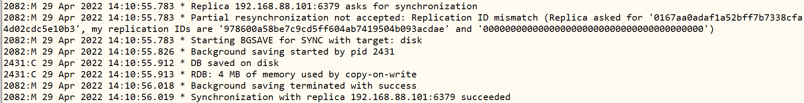

node2上Redis服务日志：Slave

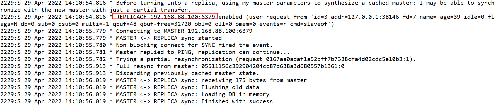

- 7、添加node3为从节点

```ini
[root@node3 ~]# redis-replica/bin/redis-cli 
127.0.0.1:6379> KEYS *
(empty list or set)
127.0.0.1:6379> 
127.0.0.1:6379> SLAVEOF 192.168.88.100 6379
OK
127.0.0.1:6379> 
```

node1上Redis服务日志：Master


node3上Redis服务日志：Slave

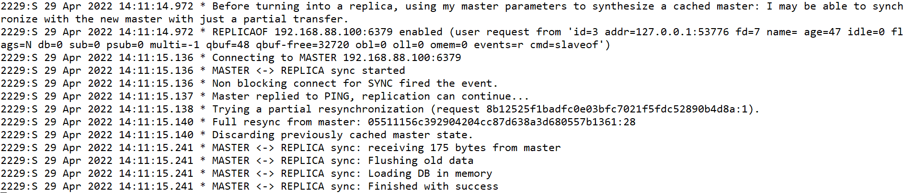

- 8、node1主节点查看集群状态

```ini
[root@node1 ~]# cd redis-replica/
[root@node1 redis-replica]# 
[root@node1 redis-replica]# bin/redis-cli   
127.0.0.1:6379> 
127.0.0.1:6379> INFO replication
```

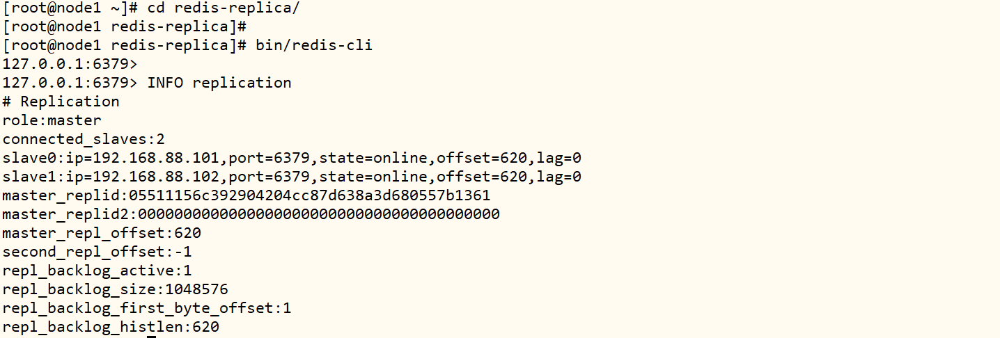

- 9、测试

```ini
# node1 主节点设置值
set name zhangsan
# node2和node3 从节点获取值
get name
```

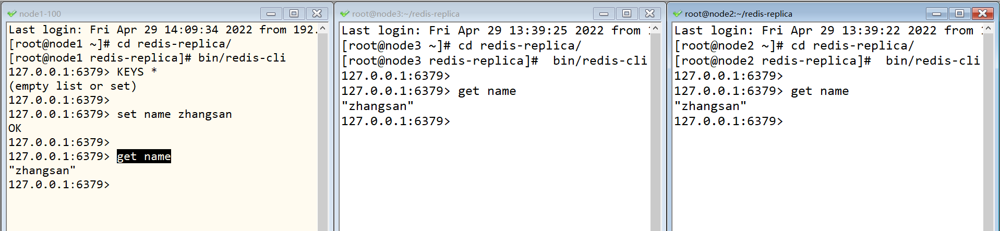

### 4. Redis哨兵集群

> Redis提供了**哨兵（Sentinel）机制**来实现**主从集群的自动故障恢复**，哨兵的结构和作用如下：

- **监控 **：Sentinel 会不断检查您的master和slave是否按预期工作
- **自动故障恢复**：如果master故障，Sentinel会将一个slave提升为master
- **通知**：Sentinel充当Redis客户端的服务发现来源，当集群发生故障转移时，将最新信息推送给Redis的客户端


> Sentinel基于心跳机制监测服务状态，每隔1秒向集群的每个实例发送ping命令：

- ==主观下线==：如果某sentinel节点发现某实例未在规定时间响应，则认为该实例**主观下线**。
- ==客观下线==：若超过指定数量（quorum）的sentinel都认为该实例主观下线，则该实例**客观下线**。quorum值最好超过Sentinel实例数量的一半。


> 当选中了其中一个slave为新的master后（例如slave1），故障的转移的步骤如下：

- sentinel给备选的slave1节点发送slaveof no one命令，让该节点成为master
- sentinel给所有其它slave发送slaveof 192.168.150.101 7002 命令，让这些slave成为新master的从节点，开始从新的master上同步数据。
- 最后，sentinel将故障节点标记为slave，当故障节点恢复后会自动成为新的master的slave节点


### 5. Redis分片集群

> 主从复制和哨兵集群可以解决**高可用、高并发读**的问题，但是依然有两个问题没有解决：

- **海量数据存储**问题
- **高并发写**的问题

[使用分片集群可以解决上述问题：https://redis.io/docs/manual/scaling/]()

#### 架构设计

> 分片集群Sharded Cluster：[将多个Redis小集群从逻辑上合并为一个大集群，每个小集群管理部分数据，并且主从架构。]()


> 分片集群特征：

- 集群中有多个master，每个master保存不同数据
- 每个master都可以有多个slave节点
- master之间通过ping监测彼此健康状态
- 客户端请求可以访问集群任意节点，最终都会被转发到正确节点

> 每个小集群分摊一部分槽位Slot，对每一条Redis的数据进行槽位计算，这条数据属于哪个槽位，就存储对应槽位的小集群中

- 分片的规则：**根据Key进行槽位运算：`CRC16[K] &  16383 =  0  ~ 16383`**


#### 安装部署

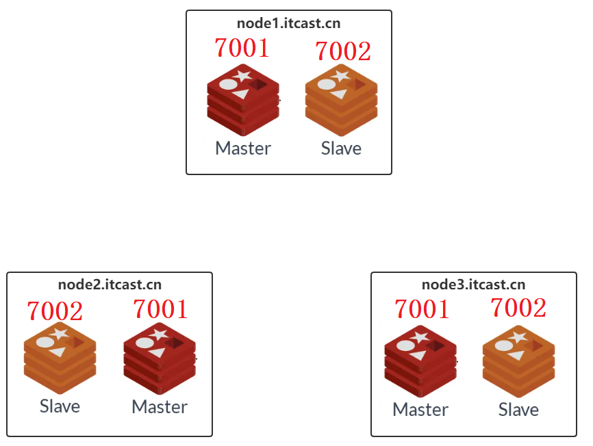

|               IP               | PORT |  角色  |
| :----------------------------: | :--: | :----: |
| 192.168.88.100/node1.itcast.cn | 7001 | master |
| 192.168.88.101/node2.itcast.cn | 7001 | master |
| 192.168.88.102/node3.itcast.cn | 7001 | master |
| 192.168.88.100/node1.itcast.cn | 7002 | slave  |
| 192.168.88.101/node2.itcast.cn | 7002 | slave  |
| 192.168.88.102/node3.itcast.cn | 7002 | slave  |

> 第一步、node1上配置**7001**端口服务

- 1、解压和重命名

```ini
[root@node1 ~]# cd /root
[root@node1 ~]# rz
	redis-5.0.8-bin.tar.gz

[root@node1 ~]# tar -zxf redis-5.0.8-bin.tar.gz 
[root@node1 ~]# mv redis redis-7001
```

- 2、修改配置文件

```ini
vim /root/redis-7001/redis.conf
```

```shell
#69行
bind 0.0.0.0

#88行
protected-mode no

#92行
port 7001

#136行
daemonize yes

#158行
pidfile /var/run/redis_7001.pid

#171行
logfile "/root/redis-7001/logs/redis.log"

#263行
dir /root/redis-7001/datas/

#832行
cluster-enabled yes

#840行
cluster-config-file nodes-7001.conf

#846行
cluster-node-timeout 15000
```

> 第二步、node1上配置**7002**端口服务

- 3、拷贝目录

```ini
[root@node1 ~]# cd /root/

[root@node1 ~]# cp -r redis-7001 redis-7002
```

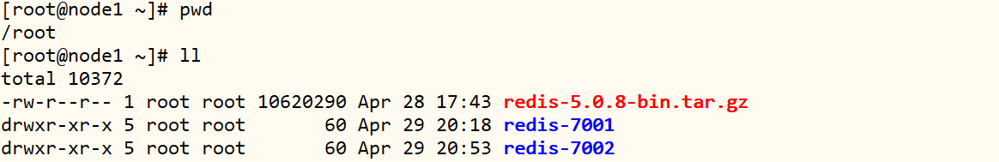

- 4、修改配置文件

```ini
vim /root/redis-7002/redis.conf
```

[配置文件中：所有7001换成7002]()

```ini
#92行
port 7002

#158行
pidfile /var/run/redis_7002.pid

#171行
logfile "/root/redis-7002/logs/redis.log"

#263行
dir /root/redis-7002/datas/

#840行
cluster-config-file nodes-7002.conf
```

> 第三步、将7001端口服务和7002端口服务同步到node2和node3

- 5、同步目录scp命令

```ini
# 7001端口服务
scp -r /root/redis-7001 root@node2.itcast.cn:/root/
scp -r /root/redis-7001 root@node3.itcast.cn:/root/

# 7002端口服务
scp -r /root/redis-7002 root@node2.itcast.cn:/root/
scp -r /root/redis-7002 root@node3.itcast.cn:/root/
```

#### 启动服务

- 三台机器启动所有redis进程

```ini
# 启动7001服务
/root/redis-7001/bin/redis-server /root/redis-7001/redis.conf

# 启动7002服务
/root/redis-7002/bin/redis-server /root/redis-7002/redis.conf
```

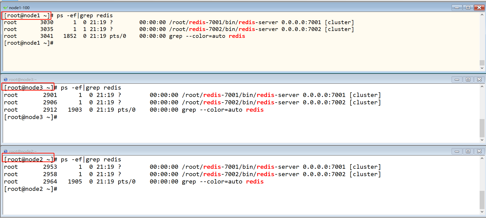

> 虽然服务启动了，但是目前每个服务之间都是独立的，没有任何关联。

- 初始化配置集群：

  ```ini
  /root/redis-7001/bin/redis-cli --cluster create --cluster-replicas 1 \
  192.168.88.100:7001 192.168.88.100:7002 \
  192.168.88.101:7001 192.168.88.101:7002 \
  192.168.88.102:7001 192.168.88.102:7002
  
  # --cluster-replicas,每个小的集群有几个副本，不包含master
  ```

  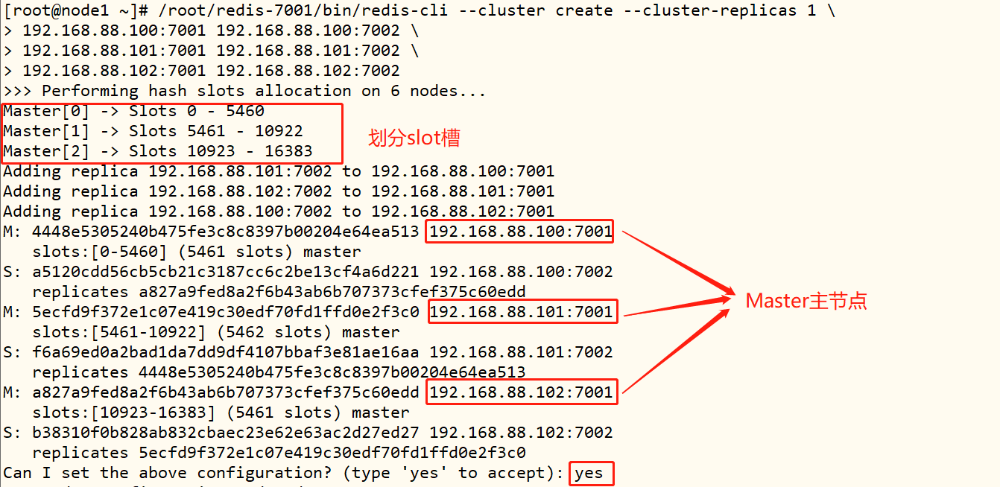

- 连接集群

  ```ini
  /root/redis-7001/bin/redis-cli -c -h node1.itcast.cn -p 7001
  ```

  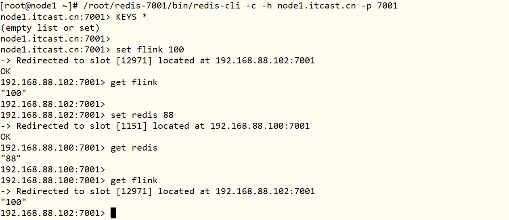

#### Jedis连接

> Jedis 客户端中提供类：JedisCluster，连接Redis Cluster集群，演示代码如下：

```java
import redis.clients.jedis.*;
import java.util.HashSet;

/**
 * Jedis连接Redis Cluster集群，进行操作数据
 */
public class JedisClusterTest {

	public static void main(String[] args) {
		// TODO: 1. 获取连接
		// 1-1. 连接池设置
		JedisPoolConfig config = new JedisPoolConfig();
		config.setMaxTotal(8); // 连接池中总的连接数
		config.setMaxIdle(5); // 连接池中最大连接空闲数，连接未被使用数目
		config.setMinIdle(2); // 连接池中最小连接空闲数
		config.setMaxWaitMillis(5000); // 最大等待时间
		// 1-2. 集群地址和端口号
		HashSet<HostAndPort> set = new HashSet<>() ;
		set.add(new HostAndPort("node1.itcast.cn",7001));
		set.add(new HostAndPort("node1.itcast.cn",7002));
		set.add(new HostAndPort("node2.itcast.cn",7001));
		set.add(new HostAndPort("node2.itcast.cn",7002));
		set.add(new HostAndPort("node3.itcast.cn",7001));
		set.add(new HostAndPort("node3.itcast.cn",7002));

		// 1-3. 获取连接
		JedisCluster jedisCluster = new JedisCluster(set, 2000, 2000, 5, config);

		// TODO: 2. 使用连接，操作数据
		jedisCluster.set("name", "zhangsan");
		System.out.println(jedisCluster.get("name"));

		// TODO: 3. 关闭连接
		jedisCluster.close();
	}

}
```

## II. HBase快速入门

> **HBase**是一种分布式、可扩展、支持海量数据存储的NoSQL数据库。

### 1. HBase功能概述

> Google发布大数据三大论文：GFS文件系统、MapReduce分布式计算框架及BigTable大表。


> `BigTable`【Chubby】：**HBase+Zookeeper**


```
BigTable 思想：
	https://blog.csdn.net/qq_41773806/article/details/111875509
理解BigTable：
	https://zhuanlan.zhihu.com/p/150266419
```

> HBase是一个基于Hadoop的==分布式==的==可扩展的==大数据存储的**基于内存**==列存储==NoSQL数据库

官网：https://hbase.apache.org/

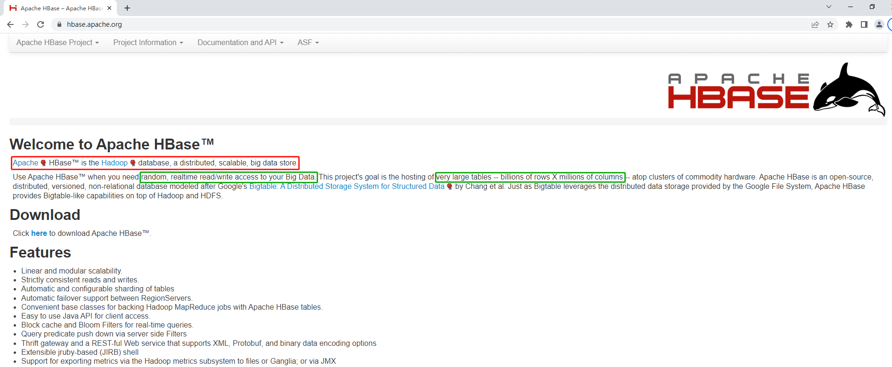

> HBase 数据库，提供**分布式的实时realtime、随机的Random、大数据持久性存储（读写数据）**，主要应用于海量数据存储和实时查询业务场景中。

```ini
# 1. 电商：
	交易订单，例如双11交易订单
# 2. 交通：
	实时交通卡口流量数据
	滴滴打车订单数据
		https://blog.csdn.net/imgxr/article/details/80130075
# 3. 金融：
	交易信息
# 4. 太平保险险单数据
	直接存储HBase表
```

### 2. HBase数据模型

> MySQL 数据库数据存储对象：**database**和**table**

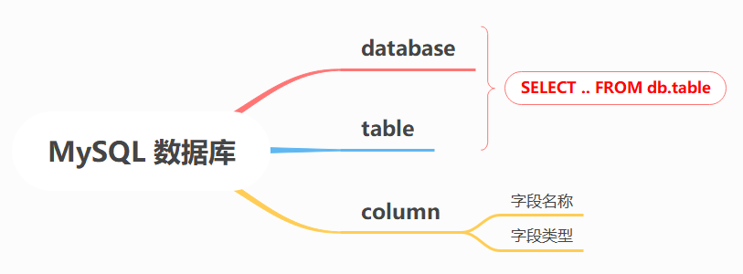

> HBase 数据库数据存储对象：**namespace**和**table**

- **HBase中的表是分布式的**，表的数据划分不同部分，分布式存储在不同的机器上；
- **所有的表在访问时，都必须加上namespace名称，除非表在default默认namespace下**，可以不加namespace名称来进行访问；
  - 有一个namespace叫做`itcast`，有一张表叫做`heima`，访问：**itcast:heima**
  - HBase中自带一个namespace叫做`default`，有一张表叫`t1`，访问：**default:t1** 或者 **t1**
  - 在HBase数据库中，默认存在2个namespace：`default`（类似Hive中defualt数据库，默认创建表都是在此namespace中，）和`hbase`（属于HBase数据库元数据表所属命名空间）

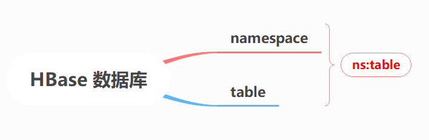

> HBase中表Table结构：列簇**ColumnFamily**和列**Column/Qualifier**组成，每一列数据类型为字节数组`byte[]`。

- **行键/主键RowKey**：
  - 类似于MySQL主键（Primary Key）概念，唯一标记一行、作为主键索引
  - 每张HBase表都有行健，行健这一列是HBase表创建以后自带的
- **列族ColumnFamily**：
  - 对除了Rowkey以外的==列进行分组，将列划分不同的组中==
  - 任何一张HBase的表，都==至少要有一个列族==，**除了Rowkey以外的任何一列，都必须属于某个列族**，Rowkey不属于任何一个列族
  - 分组：**将拥有相似属性的列放入同一个列族**【要读一起读，要写一起写】
    - 设计原因：划分列族，读取数据时可以**加快读取的性能**
    - 如果没有列族，没有划分班级教室：找一个人，告诉你这个人就在这栋楼
    - 如果有了列族，划分了教室：找一个人，告诉你这个人在这栋楼某个房间
- **列Qualifier/Column**：
  - 与MySQL中的列是一样
  - **除了rowkey以外的任何一列都必须属于某个列族**，==**引用列的时候，必须加上列族的名称**==
  - 如果有一个列族：`info`，如果info列族中有两列：`name，age`，访问：`info:name，info:age` 

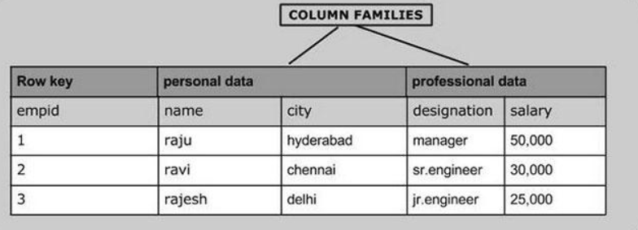

> **多版本VERSIONS**：HBase可以允许某一行的某一列存储多个版本的值的，默认每一列都只能存储1个版本。如果某个列有多个版本值，默认情况下查询，根据时间戳返回最新版本的值。

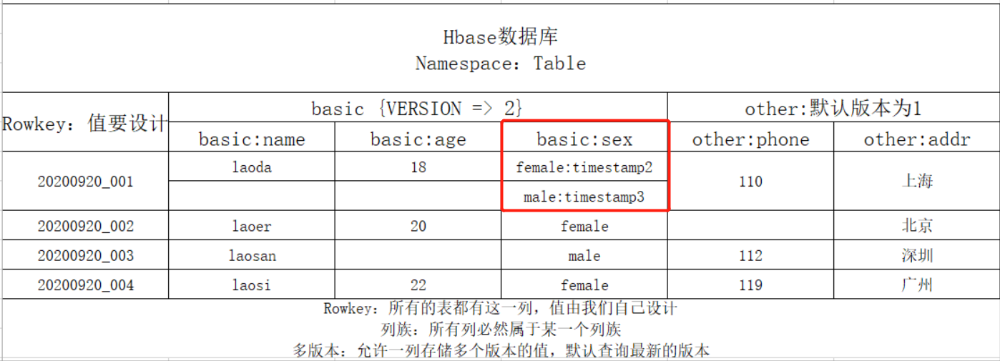

> MySQL数据库与HBase数据库对比：

|   概念   |        MySQL        |                  Hbase                  |
| :------: | :-----------------: | :-------------------------------------: |
|  数据库  |      DataBase       |                NameSpace                |
|  数据表  |        Table        |            Table【分布式的】            |
| 数据分区 |          -          |         Region，表中数据一部分          |
|  数据行  | 数据【主键+其他列】 |          Rowkey+数据【其他列】          |
|   列族   |          -          |              ColumnFamily               |
|  数据列  |  普通列与对应的值   | 列【timestamp】与对应的值【支持多版本】 |

### 3. HBase集群架构

> HBase 数据库中表Table数据，划分为很多部分进行单独存储管理，每部分数据称为：**Region分区/区域**。

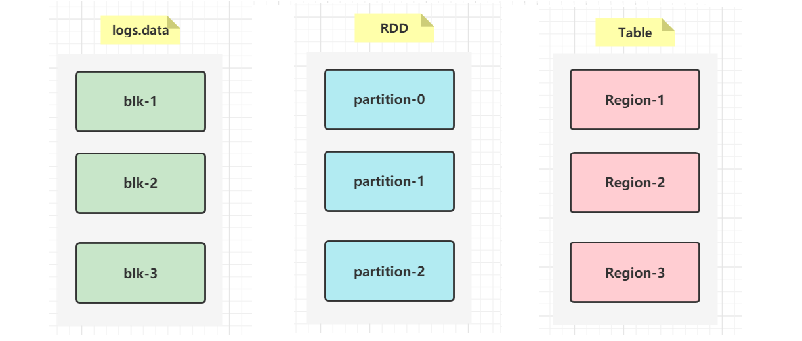

> HBase 数据库，与HDFS一样，都是分布式主从架构，主节点：**HMaster**，从节点**HRegionServer**。

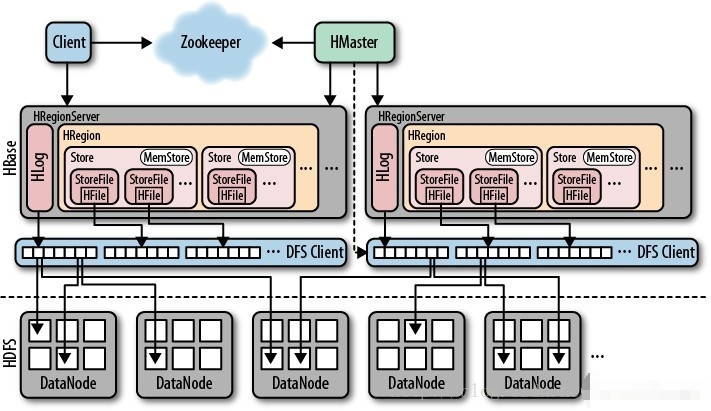

- **HMaster**：主节点，管理节点
  - 负责==元数据==的管理，比如namespace、table、列簇，region等
  - 负责所有从节点的管理
- **HRegionServer**：从节点，存储节点
  - 负责管理每张表的分区数据：Region
  - 对外提供Region的读写请求

- **Zookeeper**：分布式协作框架
  - HBase 分布式集群，依赖Zookeeper框架进行协作服务，存储元数据，实现高可用HA
- **HDFS**：分布式文件系统
  - HBase表中数据存储到HDFS文件中，文件称为HFile文件

### 4. HBase安装部署

> 基于三台虚拟机，在HDFS和Zookeeper集群基础之上，搭建HBase集群，示意图如下。

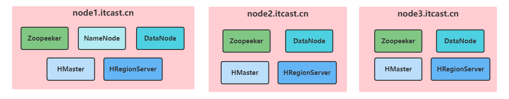

- 1、上传解压

```ini
# 上传软件包
cd /export/software/
rz

# 解压
tar -zxf hbase-2.1.0.tar.gz -C /export/server/

# 软链接
cd /export/server
ln -s hbase-2.1.0 hbase

# 赋权限
chown -R root:root /export/server/hbase/

# 删除文档
rm -rf /export/server/hbase/docs/
```

- 2、修改配置

```ini
# 进入目录
cd /export/server/hbase/conf/
```

修改`hbase-env.sh`

```ini
vim hbase-env.sh
```

```ini
#28行
export JAVA_HOME=/export/server/jdk

#125行
export HBase_MANAGES_ZK=false
```

创建存储目录

```ini
mkdir -p /export/server/hbase/datas
```

修改`hbase-site.xml`

```ini
vim hbase-site.xml
```

```xml
    <property >
        <name>hbase.tmp.dir</name>
        <value>/export/server/hbase/datas</value>
    </property>
    <property >
        <name>hbase.rootdir</name>
        <value>hdfs://node1.itcast.cn:8020/hbase</value>
    </property>
    <property >
        <name>hbase.cluster.distributed</name>
        <value>true</value>
    </property>
    <property>
        <name>hbase.zookeeper.quorum</name>
        <value>node1.itcast.cn,node2.itcast.cn,node3.itcast.cn</value>
    </property>
    <property>
        <name>hbase.unsafe.stream.capability.enforce</name>
        <value>false</value>
    </property>
```

修改`regionservers`

```ini
vim regionservers
```

```ini
node1.itcast.cn
node2.itcast.cn
node3.itcast.cn
```

复制jar包

```ini
cp /export/server/hbase/lib/client-facing-thirdparty/htrace-core-3.1.0-incubating.jar /export/server/hbase/lib/
```

- 3、分发集群

```ini
scp -r /export/server/hbase root@node2.itcast.cn:/export/server/
scp -r /export/server/hbase root@node3.itcast.cn:/export/server/
```

- 4、配置环境变量，[三台虚拟机都配置]()

```ini
vim /etc/profile
```

```ini
# HBASE_HOME
export HBASE_HOME=/export/server/hbase
export PATH=:$PATH:$HBASE_HOME/bin
```

```ini
 source /etc/profile
```

- 5、启动服务

```ini
# 启动Zookeeper集群服务，每台机器都启动
/export/server/zookeeper/bin/zkServer.sh start

# 启动HDFS集群服务，node1上执行
hadoop-daemon.sh start namenode
hadoop-daemons.sh start datanode 

# 启动HBase集群服务，node1上执行
hbase-daemon.sh start master
hbase-daemons.sh start regionserver   
```

- 6、访问HBase WEB UI
  - 网址：http://node1.itcast.cn:16010
  - Apache HBase 1.x之前是60010，1.x开始更改为16010，CDH版本：一直使用60010

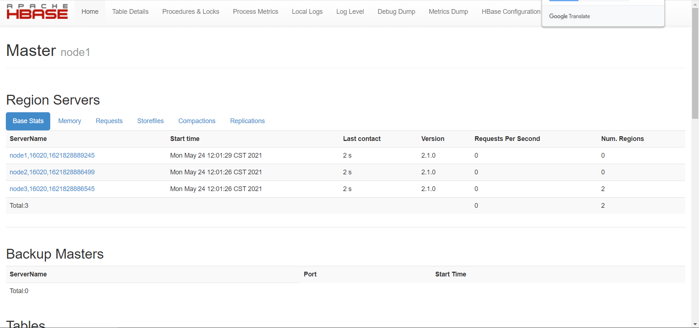

## 附录部分: 注意事项及扩展内容

### [附录1]-Redis【RDB 持久化】测试

- 上传解压redis目录

```ini
[root@node1 ~]# cd /root
[root@node1 ~]# rz
	redis-5.0.8-bin.tar.gz

[root@node1 ~]# tar -zxf redis-5.0.8-bin.tar.gz
[root@node1 ~]# mv redis redis-rdb
```

- 修改配置文件：`redis.conf`

```ini
# 221行
save 5 1

# 254行
dbfilename dump.rdb

# 264行
dir /root/redis-rdb/datas/
```

- 启动服务

```ini
[root@node1 ~]# /root/redis-rdb/bin/redis-server /root/redis-rdb/redis.conf  
```

- 运行客户端

```ini
[root@node1 ~]# cd redis-rdb/
[root@node1 redis-rdb]# bin/redis-cli 
127.0.0.1:6379> KEYS *
(empty list or set)
127.0.0.1:6379> set k1 va
OK
```

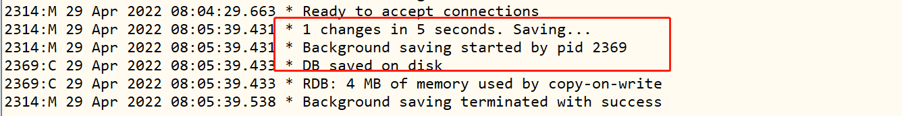

### [附录2]-Redis【AOF 持久化】测试

- 上传解压redis目录

```ini
[root@node1 ~]# cd /root
[root@node1 ~]# rz
	redis-5.0.8-bin.tar.gz

[root@node1 ~]# tar -zxf redis-5.0.8-bin.tar.gz
[root@node1 ~]# mv redis redis-aof
```

- 修改配置文件：`redis.conf`

```ini
# 218、219、220行 注释掉
	#save 900 1
	#save 300 10
	#save 60 10000

# 264行
dir /root/redis-aof/datas/

# 699行
appendonly yes
# 703行
appendfilename "appendonly.aof"
# 729行
appendfsync everysec
```

- 启动服务

```ini
/root/redis-aof/bin/redis-server /root/redis-aof/redis.conf  
```

- 运行客户端

```ini
[root@node1 ~]# cd /root/redis-aof
[root@node1 redis-aof]# bin/redis-cli 
127.0.0.1:6379> KEYS *
(empty list or set)
127.0.0.1:6379> 
127.0.0.1:6379> set k1 v1
OK
127.0.0.1:6379> set k2 v2
OK
127.0.0.1:6379> KEYS *
1) "k2"
2) "k1"
127.0.0.1:6379> exit
```

- 查看aof文件

```ini
[root@node1 ~]# cd /root/redis-aof
[root@node1 redis-aof]# cd datas/
[root@node1 datas]# ll
total 4
-rw-r--r-- 1 root root 81 Apr 29 08:15 appendonly.aof
[root@node1 datas]# more appendonly.aof 
*2
$6
SELECT
$1
0
*3
$3
set
$2
k1
$2
v1
*3
$3
set
$2
k2
$2
v2
```

