# HBase CRUD

## I. HBase命令行操作

> HBase 数据库提供命令行：hbase shell，对数据库进行DDL、DML及管理操作。

```ini
[root@node1 ~]# hbase shell
```

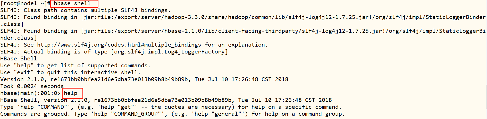

> 命令行输入命令：`help` ，显示支持命令，可以查看帮助。 

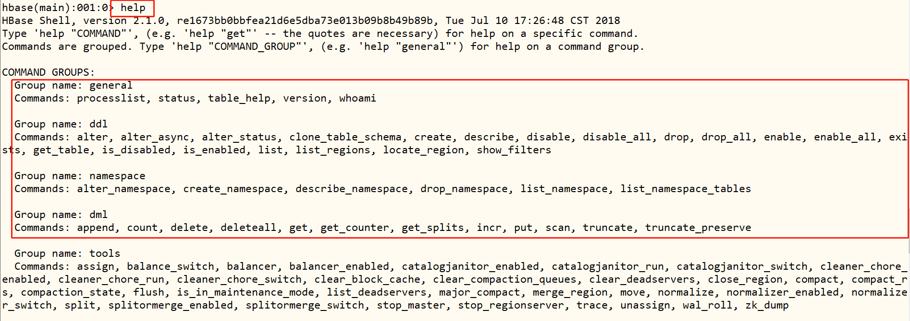

### 1. NameSpace DDL

> HBase中命名空间：**namespace**，支持命令如下所示

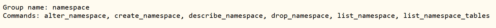

**列举所有Namespace**

命令：`list_namespace`，类似MySQL：**show databases**

```ini
list_namespace
```

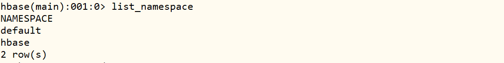

**列举某个NameSpace中的表**

命令：`list_namespace_tables`，类似MySQL：**show tables  in dbname**

- 语法

  ```shell
  list_namespace_tables 'Namespace的名称'
  ```

- 示例

  ```shell
  list_namespace_tables 'hbase'
  ```

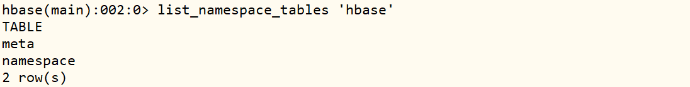

**创建NameSpace**

命令：`create_namespace`，类似MySQL：**create database  dbname**

- 语法

  ```ini
  create_namespace 'Namespace的名称'
  ```

- 示例

  ```shell
  create_namespace 'heima'
  
  create_namespace 'ITCAST'
  ```

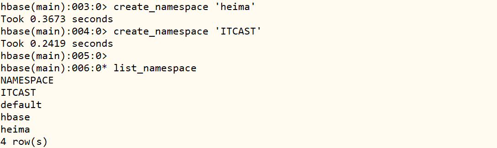

**删除NameSpace**

命令：`drop_namespace`，**只能删除空命名空间**，如果命名空间中存在表，不允许删除

- 语法：

  ```
  drop_namespace 'Namespace的名称'
  ```

- 示例

```ini
drop_namespace 'ITCAST'
```

### 2. Table DDL

> 表Table的管理命令：创建表、删除表、修改表，启用和停用表等

```ini
Group name: ddl
Commands: alter, alter_async, alter_status, clone_table_schema, create, describe, disable, disable_all, drop, drop_all, enable, enable_all, exists, get_table, is_disabled, is_enabled, list, list_regions, locate_region, show_filters
```

**列举所有用户表**

命令：`list`，类似MySQL：**show tables**

```
list
```

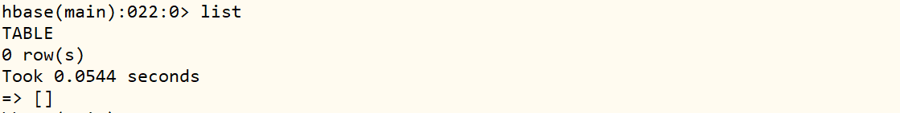

**创建表**

命令：`create`，类似MySQL：**表名 + 列的信息【名称和类型】**

- [必须指定表名 + 至少一个列族]()

- 语法

  ```shell
  #表示在ns1的namespace中创建一张表t1,这张表有一个列族叫f1，这个列族中的所有列可以存储5个版本的值
  create 'ns1:t1', {NAME => 'f1', VERSIONS => 5}
  
  #在default的namespace中创建一张表t1,这张表有三个列族，f1,f2,f3，每个列族的属性都是默认的
  create 't1', 'f1', 'f2', 'f3'
  ```

- 示例

  ```shell
  # 创建表，可以更改列族的属性
  
    create 't1', {NAME => 'cf1'}, {NAME => 'cf2', VERSIONS => 3}
  
  # 创建表，不需要更改列族属性
  
    create 'heima:t2', 'cf1', 'cf2',' cf3' 
  
    create 'users', 'info'
  ```

**查看某个表信息**

命令：`desc`，类似MySQL ：**desc  tbname**

- 语法

  ```ini
  desc '表名'
  ```

- 示例

  ```ini
  desc 't1'
  ```

  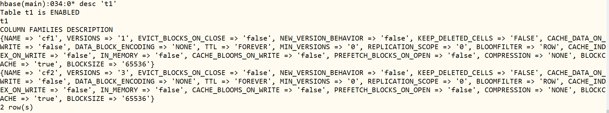

**判断存在某个表是否存储**

命令：`exists`

- 语法

  ```ini
  exists '表名'
  ```

- 示例

  ```ini
  exists 't1'
  ```

  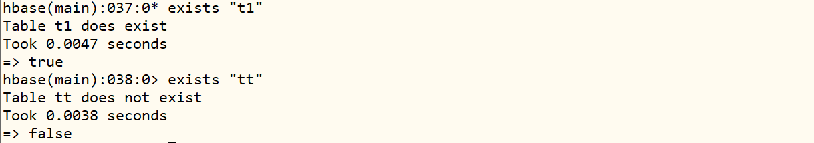

**表的禁用和启用**

命令：`disable /  enable`

- 功能

  - HBase为了**避免修改或者删除表，影响这张表正在对外提供读写服务**
  - [规定约束：修改或者删除表时，必须先禁用表，表示这张表暂时不能对外提供服务]()
  - 如果是删除：禁用以后删除
  - 如果是修改：先禁用，然后修改，修改完成以后启用

- 语法

  ```ini
  disable '表名'
  enable '表名'
  ```

- 示例

  ```ini
  # 禁用表
  disable 't1'
  
  # 启用表
  enable 't1'
  ```

**删除某个表**

命令：`drop`，类似MySQL：**drop table tbname**

- 语法

  ```ini
  drop '表名'
  ```

- 示例

  ```ini
  drop 't1'
  ```

- 注意

  如果要对表进行删除，必须**先禁用表，再删除表**

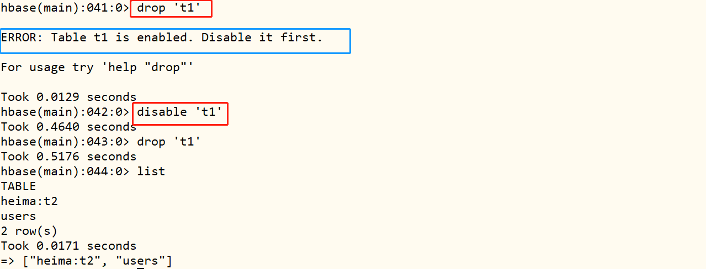

### 3. DML put

> 掌握HBase插入更新的数据命令**put**的使用

- **功能**

  插入  /  更新数据【某一行的某一列】

- **语法**

  ```ini
  # 表名+rowkey+列族+列+值
  put 'ns:tbname', 'rowkey', 'cf:col', 'value'
  ```

- **示例**

  ```ini
  create 'people', 'info'
  ```

  ```sql
  put 'people', '1001', 'info:name', 'laoda'
  put 'people', '1001', 'info:age', '25'
  put 'people', '1001', 'info:gender', 'male'
  put 'people', '1001', 'info:address', 'shanghai'
  
  put 'people', '1002','info:name', 'laoer'
  put 'people', '1002','info:address', 'beijing'
  
  put 'people', '1003','info:name', 'laosan'
  put 'people', '1003','info:age', '20'
  
  -- 扫描表数据
  scan "people"
  ```

- **注意**

  - put时如果不存在，就插入，如果存在就更新

    ```ini
    put 'people', '1003', 'info:name', '老三'
    put 'people', '1003', 'info:addr', '北京'
    
    scan 'people'
    ```

    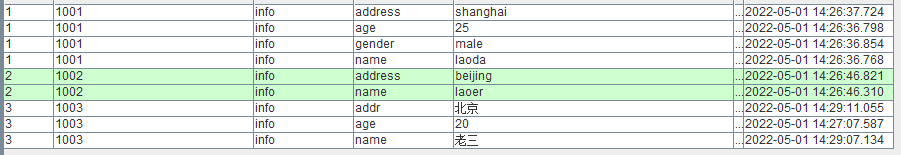

- **观察结果**

  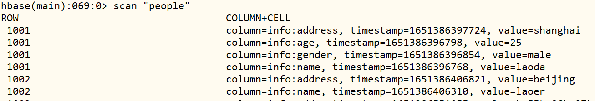

- HBase表数据：[按照Rowkey构建字典有序]()

  - 排序规则：
    - **先依据RowKey升序，再按照列簇CF升序，最后列名Column升序**
  - 底层存储也是KV结构：每一列就是一条KV数据
    - ==K：Rowkey + 列族 + 列 + 时间【降序】==
    - ==V：值==
  - ==没有更新和删除==：**通过插入来代替的，做了标记不再显示**

### 4. DML get

> 掌握HBase查询的数据命令get的使用

- 功能：**读取某个Rowkey的数据**

  - 优点：Get是HBase中**查询数据最快的方式**，并不是最常用的方式
  - 缺点：get命令最多**只能返回一个rowkey的数据**，根据Rowkey进行检索数据

- 语法

  ```ini
  get	表名	rowkey	[列族,列]
  
  get 'ns:tbname','rowkey'
  get 'ns:tbname','rowkey',[cf]
  get 'ns:tbname','rowkey',[cf:col]
  ```

- 示例

  ```ini
  # 获取RowKey所有列数据
  get 'people','1001'
  
  # 获取指定列簇中所有列数据
  get 'people','1001', 'info'
  
  # 获取指定列名称数据
  get 'people','1001', 'info:name'
  ```

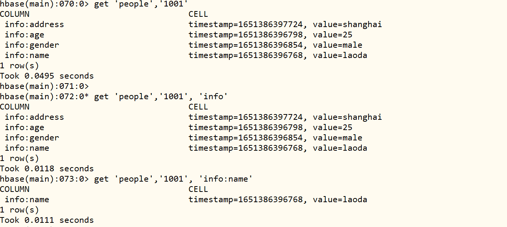

### 5. DML scan

> 掌握HBase的查询数据命令scan的使用

- 功能：**根据条件匹配读取多个Rowkey的数据**

- 语法

  ```shell
  #读取整张表的所有数据，一般不用
  scan 'tbname'
  
  #根据条件查询：工作中主要使用的场景， 用到最多
  scan 'tbname', {Filter} 
  ```

- 示例

  - 全表扫描，生产环境不要使用

  ```ini
  scan 'people'
  ```

  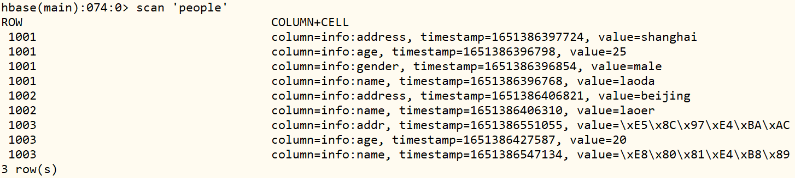

  - 全表扫描，指定条目数，类似MySQL中limit

  ```ini
  scan 'people', {LIMIT => 2}
  ```

  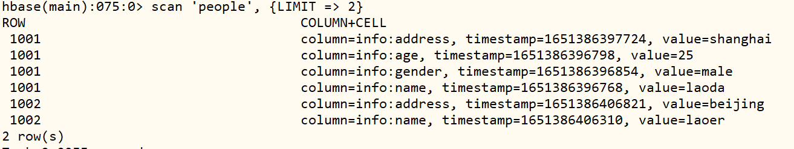

  - rowkey前缀过滤器，在HBase数据查询中，使用最多

  ```ini
  scan 'people', {ROWPREFIXFILTER => '1001'}
  
  scan 'people', {ROWPREFIXFILTER => '100'}
  ```

  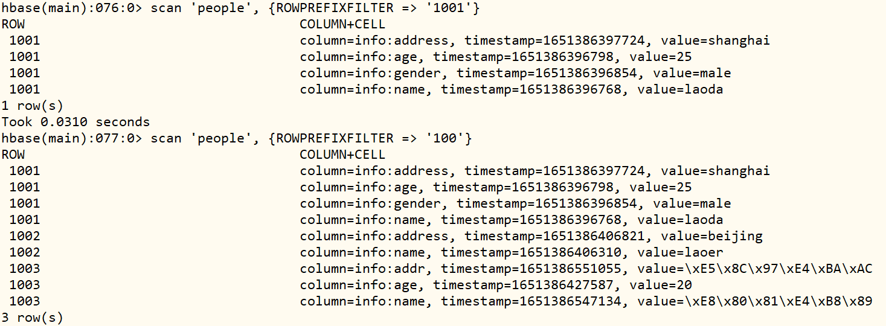

  - rowkey范围过滤器

  ```ini
  # STARTROW：从某个rowkey开始，包含，闭区间
  # STOPROW：到某个rowkey结束，不包含，开区间
  scan 'people', {STARTROW=>'1001'}
  
  scan 'people', {STARTROW=>'1001', STOPROW=>'1003'}
  ```

  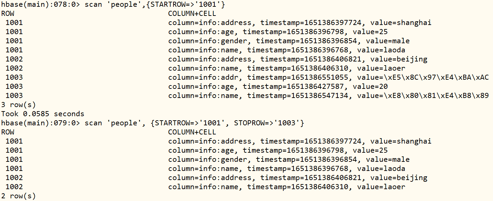

> 面试题：HBase数据库数据查询方式有哪些？？

- 1、get查询，依据具体RowKey直接查询数据，[查询速度最快]()
- 2、Scan全部扫描查询，[性能最差，几乎不建议使用]()
- 3、Scan范围查询，过滤器查询，[前缀匹配查询，设置查询RowKey范围]()

### 6. DML count

> 了解HBase的count命令的使用

- **count：统计命令**

  - 功能：**统计某张表的行数【rowkey的个数】**

  - 语法

    ```ini
    count  '表名'
    ```

  - 示例

    ```
    count 'people'
    ```

    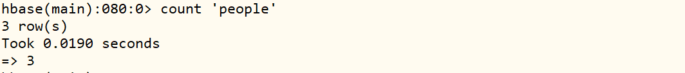

- **面试题：HBase中如何统计一张表的行数最快**

  - 方案一：分布式计算程序，读取HBase数据，统计rowkey的个数

    ```ini
    #在第一台机器启动
    start-yarn.sh
    
    #在第一台机器运行
    hbase org.apache.hadoop.HBase.mapreduce.RowCounter 'people'
    ```

  - 方案二：count命令，相对比较常用，速度中等

    ```ini
    count 'people'
    ```

### 7. DML delete

> 掌握HBase的删除数据命令delete的使用

- 功能：删除HBase中的数据

- 语法

  ```shell
  #删除某列的数据
  delete  tbname, rowkey, cf:col
  
  #删除某个rowkey数据
  deleteall tbname, rowkey
  
  #清空所有数据：生产环境不建议使用，建议删表重建
  truncate  tbname
  ```

- 示例

  ```ini
  # 删除某一列数据
  delete 'people', '1001', 'info:address'
  
  # 删除某一行row数据
  deleteall 'people','1002'
  
  # 清空表数据
  truncate 'people'
  ```

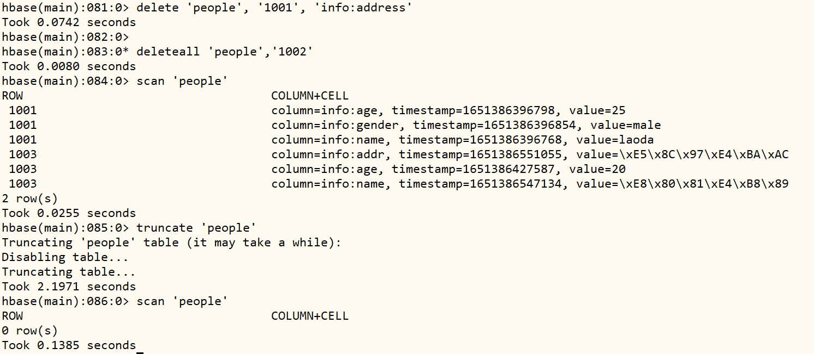

## II. HBase Java API

### 1. 构建连接

> 实现HBase Java API的开发构建连接

- 连接HBase数据库，进行数据操作，三部曲：

  ```ini
  // TODO: 1. 设置参数，获取连接
  
  // TODO：2. 使用连接，进行数据操作
  
  // TODO: 3. 关闭连接，释放资源
  ```

- 案例演示，代码如下：

```java
package cn.itcast.hbase;

import org.apache.hadoop.conf.Configuration;
import org.apache.hadoop.hbase.HBaseConfiguration;
import org.apache.hadoop.hbase.client.Connection;
import org.apache.hadoop.hbase.client.ConnectionFactory;

/**
 * 使用HBase Client API获取连接，类似Java JDBC获取MySQL数据库连接
 */
public class HBaseClientTest {

	public static void main(String[] args) throws Exception {
		// TODO: 1. 设置参数，获取连接
		// 1-1. 设置连接属性
		Configuration conf = HBaseConfiguration.create();
		// 设置HBase依赖ZK集群地址
		conf.set("hbase.zookeeper.quorum", "node1.itcast.cn,node2.itcast.cn,node3.itcast.cn");
		// 1-2. 传递配置，构建连接
		Connection conn = ConnectionFactory.createConnection(conf);
		System.out.println(conn);

		// TODO：2. 使用连接，进行数据操作

		// TODO: 3. 关闭连接，释放资源
		conn.close();
	}

}
```

### 2. DDL操作

> 使用HBase Java API实现DDL的管理

- 创建命名空间：namespace

  ```Java
  // TODO: 创建命名空间namespace
  @Test
  public void createNamespace() throws Exception {
  	// a. 获取Admin对象
  	HBaseAdmin admin = (HBaseAdmin)conn.getAdmin();
  	// b. 构建命令空间描述符，设置属性
  	NamespaceDescriptor descriptor = NamespaceDescriptor
  		.create("itcast")
  		.build() ;
  	// c. 创建NS
  	admin.createNamespace(descriptor);
  	// d. 关闭
  	admin.close();
  }
  ```

- 创建表table

  ```bash
  create "itcast:students", "basic", "other"
  ```

  Java 代码：

  ```Java
  // TODO: 创建表，如果表存在，先删除，再创建
  @Test
  public void createTable() throws Exception {
  	// a. 获取Admin对象
  	HBaseAdmin admin = (HBaseAdmin)conn.getAdmin();
  	// b. 构建表的对象
  	TableName tableName = TableName.valueOf("itcast:students");
  	// c. 判断表是否存在，如果存在，将其删除
  	if(admin.tableExists(tableName)){
  		// 禁用表
  		admin.disableTable(tableName);
  		// 删除表
  		admin.deleteTable(tableName);
  	}
  	// d. 创建表
  	ColumnFamilyDescriptor familyBasic = ColumnFamilyDescriptorBuilder
  		.newBuilder(Bytes.toBytes("basic"))
  		.build();
  	ColumnFamilyDescriptor familyOther = ColumnFamilyDescriptorBuilder
  		.newBuilder(Bytes.toBytes("other"))
  		.build();
  	TableDescriptor desc = TableDescriptorBuilder
  		.newBuilder(tableName)
  		.setColumnFamily(familyBasic)
  		.setColumnFamily(familyOther)
  		.build() ;
  	admin.createTable(desc);
  	// c. 关闭连接
  	admin.close();
  }
  ```

- 完整代码

```Java
package cn.itcast.hbase;

import org.apache.hadoop.conf.Configuration;
import org.apache.hadoop.hbase.HBaseConfiguration;
import org.apache.hadoop.hbase.NamespaceDescriptor;
import org.apache.hadoop.hbase.TableName;
import org.apache.hadoop.hbase.client.*;
import org.apache.hadoop.hbase.util.Bytes;
import org.junit.After;
import org.junit.Before;
import org.junit.Test;

/**
 * 使用HBase Java Client API对数据进行DDL操作：
 *      TODO: 创建命名空间namespace\创建表table(如果表存在, 先禁用, 再删除)
 */
public class HBaseDdlTest {
	// 定义连接Connection
	private Connection conn = null ;

	@Before
	public void open() throws Exception {
		// 1-1. 设置连接属性
		Configuration conf = HBaseConfiguration.create();
		// 设置HBase依赖ZK集群地址
		conf.set("hbase.zookeeper.quorum", "node1.itcast.cn,node2.itcast.cn,node3.itcast.cn");
		// 1-2. 传递配置，构建连接
		conn = ConnectionFactory.createConnection(conf);
	}

	// TODO: 创建命名空间namespace
	@Test
	public void createNamespace() throws Exception {
		// a. 获取Admin对象
		HBaseAdmin admin = (HBaseAdmin)conn.getAdmin();
		// b. 构建命令空间描述符，设置属性
		NamespaceDescriptor descriptor = NamespaceDescriptor
			.create("itcast")
			.build() ;
		// c. 创建NS
		admin.createNamespace(descriptor);
		// d. 关闭
		admin.close();
	}

	// TODO: 创建表，如果表存在，先删除，再创建
	@Test
	public void createTable() throws Exception {
		// a. 获取Admin对象
		HBaseAdmin admin = (HBaseAdmin)conn.getAdmin();
		// b. 构建表的对象
		TableName tableName = TableName.valueOf("itcast:students");
		// c. 判断表是否存在，如果存在，将其删除
		if(admin.tableExists(tableName)){
			// 禁用表
			admin.disableTable(tableName);
			// 删除表
			admin.deleteTable(tableName);
		}
		// d. 创建表
		ColumnFamilyDescriptor familyBasic = ColumnFamilyDescriptorBuilder
			.newBuilder(Bytes.toBytes("basic"))
			.build();
		ColumnFamilyDescriptor familyOther = ColumnFamilyDescriptorBuilder
			.newBuilder(Bytes.toBytes("other"))
			.build();
		TableDescriptor desc = TableDescriptorBuilder
			.newBuilder(tableName)
			.setColumnFamily(familyBasic)
			.setColumnFamily(familyOther)
			.build() ;
		admin.createTable(desc);
		// c. 关闭连接
		admin.close();
	}

	@After
	public void close() throws Exception {
		if(null != conn) conn.close();
	}

}
```

### 3. DML Table

> 使用HBase Java API实现Table的实例开发

- DML操作都必须构建HBase 表的对象来进行操作

  `hbase shell` 创建表：

  ```bash
  create 'itcast:students', 'basic', 'other'
  ```

- 测试类代码：`HBaseDmlTest`

  ```java
  package cn.itcast.hbase;
  
  import org.apache.hadoop.conf.Configuration;
  import org.apache.hadoop.hbase.HBaseConfiguration;
  import org.apache.hadoop.hbase.TableName;
  import org.apache.hadoop.hbase.client.Connection;
  import org.apache.hadoop.hbase.client.ConnectionFactory;
  import org.apache.hadoop.hbase.client.Table;
  import org.junit.After;
  import org.junit.Before;
  import org.junit.Test;
  
  /**
   * 使用HBase Java Client API 对数据库进行DML操作：
   *      TODO：插入数据put, 删除数据delete, 查询数据get及扫描数据scan
   */
  public class HBaseDmlTest {
  
  	// 定义连接Connection
  	private Connection conn = null ;
  
  	@Before
  	public void open() throws Exception {
  		// 1-1. 设置连接属性
  		Configuration conf = HBaseConfiguration.create();
  		// 设置HBase依赖ZK集群地址
  		conf.set("hbase.zookeeper.quorum", "node1.itcast.cn,node2.itcast.cn,node3.itcast.cn");
  		// 1-2. 传递配置，构建连接
  		conn = ConnectionFactory.createConnection(conf);
  	}
  
  	// 创建HBase Table表的对象
  	public Table getHTable() throws Exception {
  		// TableName对象
  		TableName tableName = TableName.valueOf("itcast:students");
  		// 获取Table表句柄对象
  		Table table = conn.getTable(tableName);
  		// 返回实例
  		return table ;
  	}
  
  	// 测试Table对象
  	@Test
  	public void testTable() throws Exception {
  		System.out.println(getHTable());
  	}
  
  	@After
  	public void close() throws Exception{
  		if(null != conn) conn.close();
  	}
  }
  ```

  ### 4. DML put

  > 使用HBase Java API实现Put插入或者更新数据

  ```Java
  // 插入数据Put
  @Test
  public void testPut() throws Exception {
  	// a. 获取Table对象
  	Table table = getHTable();
  	// b. TODO: 构建Put对象，表示1个RowKey数据，指定RowKey
  	Put put = new Put(Bytes.toBytes("20220501_001")) ;
  	// 添加列
  	put.addColumn(Bytes.toBytes("basic"), Bytes.toBytes("name"), Bytes.toBytes("laoda"));
  	put.addColumn(Bytes.toBytes("basic"), Bytes.toBytes("age"), Bytes.toBytes("18"));
  	put.addColumn(Bytes.toBytes("other"), Bytes.toBytes("phone"), Bytes.toBytes("110"));
  	put.addColumn(Bytes.toBytes("other"), Bytes.toBytes("address"), Bytes.toBytes("beijing"));
  	// c. 插入数据
  	table.put(put);
  	// d. 关闭连接
  	table.close();
  }
  ```

  - 批量插入多条数据，方便后续测试

  ```Java
  // 批量插入数据Put
  @Test
  public void testBatchPut() throws Exception {
  	// a. 获取Table对象
  	Table table = getHTable();
  	// b. TODO: 构建Put对象，表示1个RowKey数据，指定RowKey
  	List<Put> listPut = new ArrayList<>();
  	// 第1条数据
  	Put put1 = new Put(Bytes.toBytes("20220501_002")) ;
  	put1.addColumn(Bytes.toBytes("basic"), Bytes.toBytes("name"), Bytes.toBytes("laoer"));
  	put1.addColumn(Bytes.toBytes("basic"), Bytes.toBytes("age"), Bytes.toBytes("16"));
  	put1.addColumn(Bytes.toBytes("basic"), Bytes.toBytes("gender"), Bytes.toBytes("male"));
  	put1.addColumn(Bytes.toBytes("other"), Bytes.toBytes("phone"), Bytes.toBytes("120"));
  	put1.addColumn(Bytes.toBytes("other"), Bytes.toBytes("address"), Bytes.toBytes("shanghai"));
  	listPut.add(put1);
  	// 第2条数据
  	Put put2 = new Put(Bytes.toBytes("20220501_003")) ;
  	put2.addColumn(Bytes.toBytes("basic"), Bytes.toBytes("name"), Bytes.toBytes("laosan"));
  	put2.addColumn(Bytes.toBytes("basic"), Bytes.toBytes("age"), Bytes.toBytes("16"));
  	put2.addColumn(Bytes.toBytes("other"), Bytes.toBytes("address"), Bytes.toBytes("hangzhou"));
  	listPut.add(put2);
  	// 第3条数据
  	Put put3 = new Put(Bytes.toBytes("20220501_004")) ;
  	put3.addColumn(Bytes.toBytes("basic"), Bytes.toBytes("name"), Bytes.toBytes("laosi"));
  	put3.addColumn(Bytes.toBytes("basic"), Bytes.toBytes("age"), Bytes.toBytes("24"));
  	put3.addColumn(Bytes.toBytes("other"), Bytes.toBytes("job"), Bytes.toBytes("programmer"));
  	put3.addColumn(Bytes.toBytes("other"), Bytes.toBytes("address"), Bytes.toBytes("shanghai"));
  	listPut.add(put3);
  	// 第4条数据
  	Put put4 = new Put(Bytes.toBytes("20220501_005")) ;
  	put4.addColumn(Bytes.toBytes("basic"), Bytes.toBytes("name"), Bytes.toBytes("laoer"));
  	put4.addColumn(Bytes.toBytes("other"), Bytes.toBytes("job"), Bytes.toBytes("doctor"));
  	listPut.add(put4);
  	// c. 插入数据
  	table.put(listPut);
  	// d. 关闭连接
  	table.close();
  }
  ```

  - 命令行查看表中数据

  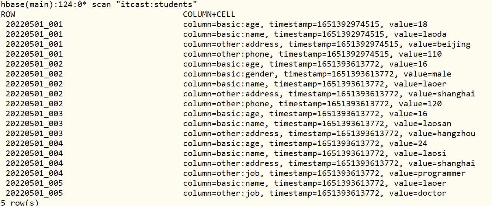


## 附录: 注意事项及拓展内容

### 1. 服务启动停止命令

> 查看集群所有机器启动Java服务进程命令：`jpsall.sh`

- 上传脚本

```ini
[root@node1 ~]# cd /export/server/jdk/bin/

[root@node1 bin]# rz

[root@node1 bin]# chmod u+x jpsall.sh
```

- 测试脚本

------

```ini
[root@node1 ~]# jpsall.sh 
====================== node1.itcast.cn ====================
2108 Jps
====================== node2.itcast.cn ====================
2188 Jps
====================== node3.itcast.cn ====================
2230 Jps
```

> Zookeeper集群一键启动和停止命令：`start-zk.sh` 和 `stop-zk.sh`

- 上传脚本

```ini
[root@node1 ~]# cd /export/server/zookeeper/bin

[root@node1 bin]# rz

[root@node1 bin]# chmod u+x start-zk.sh 

[root@node1 bin]# chmod u+x stop-zk.sh 
```

- 测试脚本

```ini
[root@node1 ~]# start-zk.sh 
JMX enabled by default
Using config: /export/server/zookeeper/bin/../conf/zoo.cfg
Starting zookeeper ... STARTED
node1.itcast.cn starting...............................
JMX enabled by default
Using config: /export/server/zookeeper/bin/../conf/zoo.cfg
Starting zookeeper ... STARTED
node2.itcast.cn starting...............................
JMX enabled by default
Using config: /export/server/zookeeper/bin/../conf/zoo.cfg
Starting zookeeper ... STARTED
node3.itcast.cn starting...............................
```

### 2. HBase Maven依赖

创建Maven Module模块

------

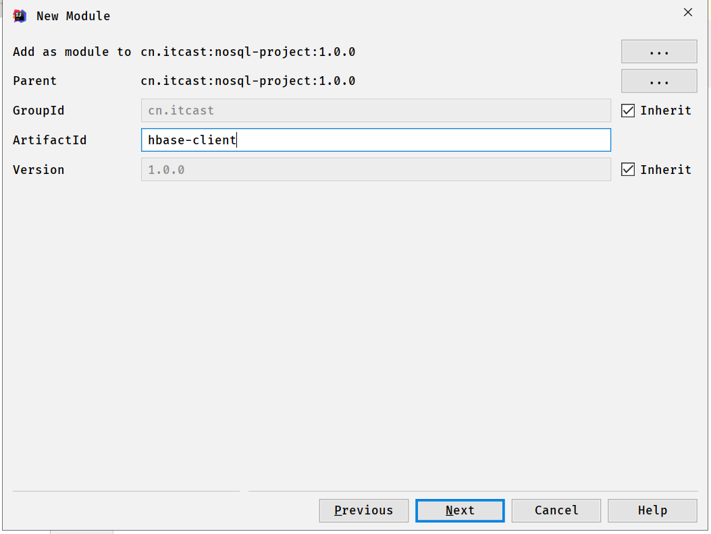

向pom文件添加依赖

------

```xml
    <repositories>
        <repository>
            <id>aliyun</id>
            <url>http://maven.aliyun.com/nexus/content/groups/public/</url>
        </repository>
    </repositories>

    <dependencies>
        <dependency>
            <groupId>org.apache.hbase</groupId>
            <artifactId>hbase-client</artifactId>
            <version>2.1.2</version>
        </dependency>
        <dependency>
            <groupId>commons-io</groupId>
            <artifactId>commons-io</artifactId>
            <version>2.6</version>
        </dependency>
        <!-- JUnit 4 依赖 -->
        <dependency>
            <groupId>junit</groupId>
            <artifactId>junit</artifactId>
            <version>4.13</version>
        </dependency>
    </dependencies>

    <build>
        <plugins>
            <plugin>
                <groupId>org.apache.maven.plugins</groupId>
                <artifactId>maven-compiler-plugin</artifactId>
                <version>3.0</version>
                <configuration>
                    <source>1.8</source>
                    <target>1.8</target>
                    <encoding>UTF-8</encoding>
                </configuration>
            </plugin>
        </plugins>
    </build>
```

