# HBase存储原理与优化

## I. HBase存储原理

### 1. Table、Region、RS

> **问题**：客户端操作的是表，数据最终存在RegionServer中，表和RegionServer的关系是什么？

- **Table：是一个逻辑对象**，物理上不存在，供用户实现逻辑操作，存储在元数据的一个概念

  - 数据写入表以后的物理存储：分区Region

  2. 一张表会有多个分区Region，每个分区存储在不同的机器上
  3. 默认每张表只有1个Region分区

- **Region：Hbase中数据`负载均衡`的最小单元**

  - 类似于HDFS中Block,用于实现Hbase中分布式

- 就是分区的概念，每张表都可以划分为多个Region，实现分布式存储，默认一张表只有一个分区

  3. 每个Region由一台RegionServer所管理，Region存储在RegionServer
  4. 一台RegionServer可以管理多个Region

  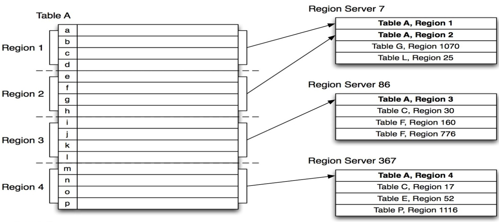

- **RegionServer：是一个物理对象**，Hbase中的一个进程，管理一台机器的存储

  - 类似于HDFS中DataNode或者Kafka中的Broker

- 一个Regionserver可以管理多个Region

  - 一个Region只能被一个RegionServer所管理

  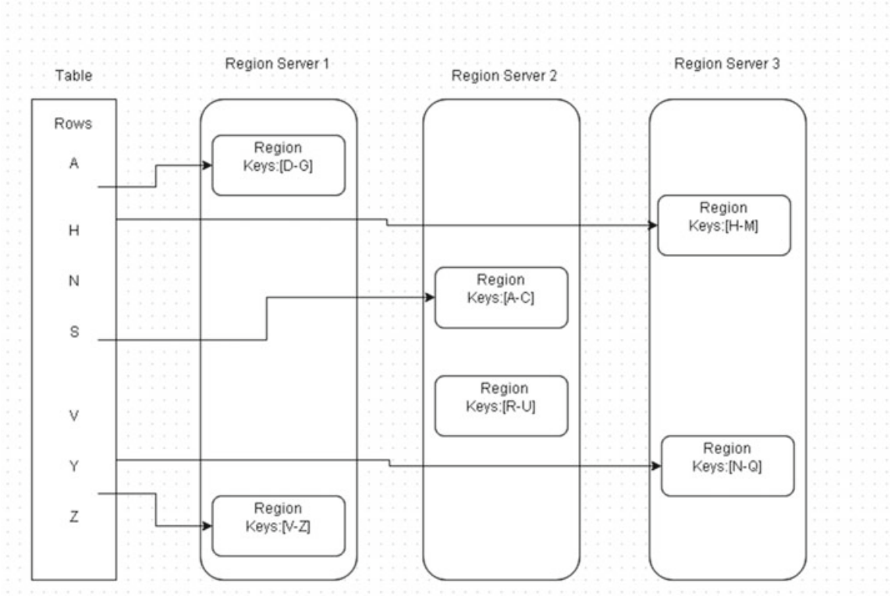

> 创建表后，打开HBase WEB UI页面，查看表的分区Region信息

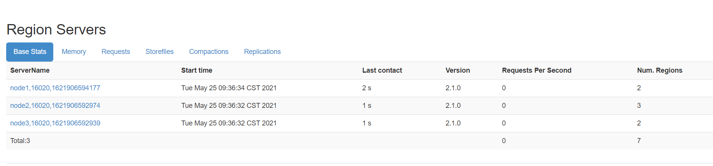

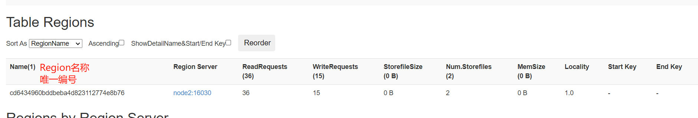

```ini
# t1,,1636172386242.9acd323bdbd17d77edda298c2dfaf32f.
    表的名称：
        t1
  Region管理数据起始RowKey
        如果是表的第1个Region，值为空
    时间戳
        Long类型数值，表示的是Region被RS管理时间（上线online时间）
    Region唯一标识符
        字符串，随机生成的
```

> 总结：HBase中Table与Region、RegionServer三者之间的关系是什么？

```ini
# Table：提供用户读写的逻辑概念
 
# Region：分区的概念
	一张表可以划分为多个分区
	每个分区都被某一台Regionserver所管理
 
# RegionServer：真正存储数据的物理概念
```

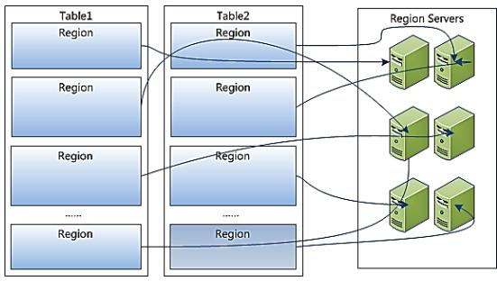

### 2. Region划分规则

> **问题**：一张表划分为多个Region，划分的规则是什么？写一条数据到表中，这条数据会写入哪个Region，分配规则是什么？

- **回顾HDFS和Redis划分规则**

  ```ini
  # 1. HDFS：划分分区的规则，按照大小划分
  	文件按照每128M划分一个Block
  	
  # 2. Redis：将0 ~ 16383划分成多个段，每个小的集群分配一个段的内容
  	CRC16（K） & 16383
  ```

- **HBase分区划分规则**：**范围划分【根据Rowkey范围】**

  ```ini
  # 1. 任何一个Region都会对应一个范围
    	如果只有一个Region，范围：-oo  ~  +oo
  	
  # 2. 范围划分：从整个-oo ~  +oo区间上进行范围划分
  
  #3. 每个分区都会有一个范围：根据Rowkey属于哪个范围就写入哪个分区
  	[startKey,stopKey)	 -> 前闭后开区间
  	
  默认：一张表创建时，只有一个Region，范围：-oo  ~ +oo
  ```

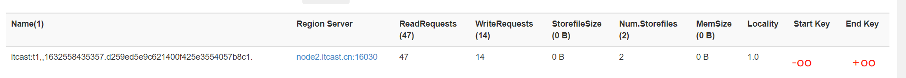

- 自定义：创建表时，指定有多少个分区，每个分区的范围

  ```ini
  创建一张表，有2个分区Region
  	create 't3', 'f1', SPLITS => ['50']
  分区范围
    	region0：-oo ~  50
    	region1：50  ~ +oo
  ```

- 数据分配的规则：**==根据Rowkey属于哪个范围就写入哪个分区==**

```ini
# 举个栗子：创建一张表，有4个分区Region，20,40,60
  	create 'itcast:t3', {SPLITS => [20, 40, 60]}
  	
# 规则：前闭后开
	region0：-oo ~ 20
	region1：20   ~ 40
	region2：40   ~ 60
	region3：60  ~ +oo

# 写入数据的rowkey：
	# 比较是按照ASCII码比较的，不是数值比较
	# 比较规则：ASCII码逐位比较
    A1234：region3
    c6789：region3
    00000001：region0
    2：region0
    99999999：region3
	
```

> 创建表后，打开HBase WEB UI页面，查看表的分区Region信息

```ini
# 1. 默认只有1个分区

# 2. 注意：随着数据越来越多，达到阈值，这个分区会自动分裂为两个分裂
```

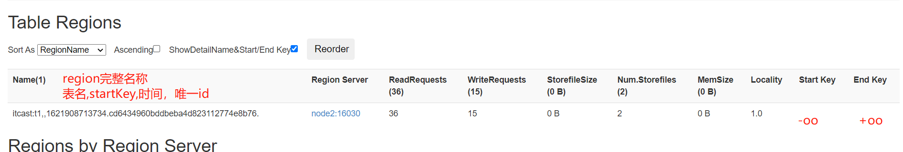

```ini
# 3. 手动创建多个分区
create 'itcast:t3','cf',SPLITS => ['20', '40', '60', '80']
```

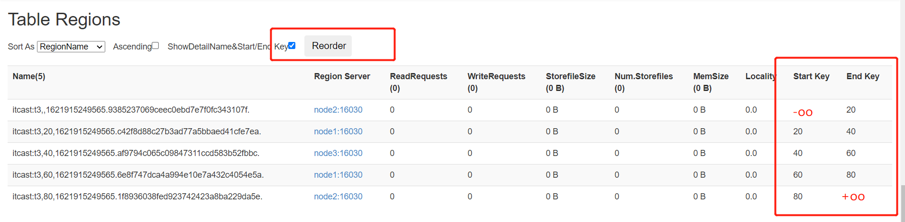

```ini
# 4. 写入数据
put 'itcast:t3','0300000','cf:name','laoda'
put 'itcast:t3','7890000','cf:name','laoer'
```

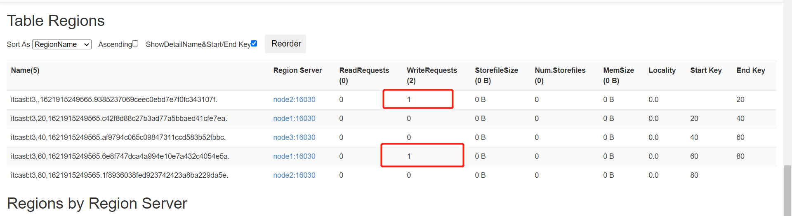

### 3. Region内部结构

> **问题**：数据在Region的内部是如何存储的？

```ini
put tbname, rowkey, cf:col, value

# tbname：决定了这张表的数据最终要读写哪些分区
# rowkey：决定了具体读写哪个分区
# cf：决定具体写入哪个Store
```

- Region：对整张表的数据划分，按照范围划分，实现分布式存储     


```ini
# Store：
    对分区的数据进行划分，按照列族划分，一个列族对应一个Store
    不同列族的数据写入不同的Store中，实现了按照列族将列进行分组
    根据用户查询时指定的列族，可以快速的读取对应的store

# MemStore：
    每个Store都有一个: 内存存储区域
    数据写入memstore就直接返回

# StoreFile：
    每个Store中可能有0个或者多个StoreFile文件
    逻辑上：Store
    物理上：HDFS，HFILE【二进制文件】
```

> **问题：Hbase的数据在HDFS中是如何存储的？**

- 整个Hbase在HDFS中的存储目录

  ```properties
  hbase.rootdir=hdfs://node1.itcast.cn:8020/hbase
  ```

  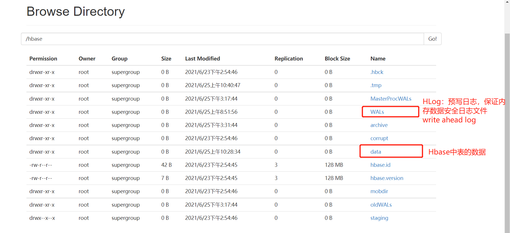

  - NameSpace：目录结构

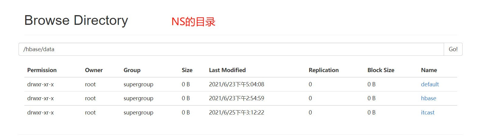

- Table：目录结构

  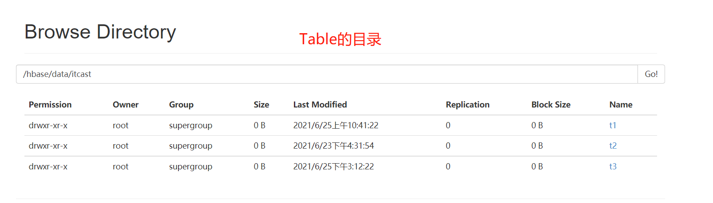

- Region：目录结构

  

- Store/ColumnFamily：目录结构

  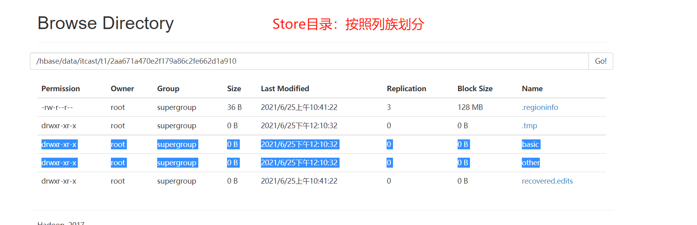

- StoreFile

  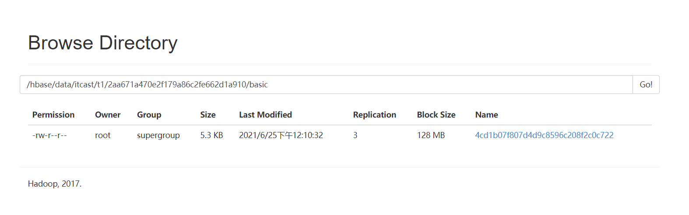

  - 如果HDFS上没有storefile文件，可以通过flush，手动将表中的数据从内存刷写到HDFS中

    ```
    flush 'itcast:t3'    
    ```

> Region的内部存储结构是什么样的？

```ini
# 1. NS:Table|RegionServer：整个Hbase数据划分

# 2. Region：划分表的数据，按照Rowkey范围划分
      - Store：划分分区数据，按照列族划分
        - MemStore：物理内存存储
        - StoreFile：物理磁盘存储
          - 逻辑：Store
          - 物理：HDFS[HFile]
```

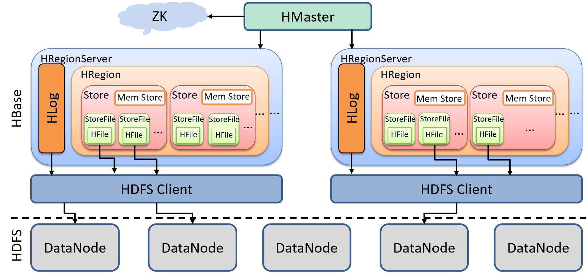

### 4. Store内部原理: MemStore Flush

> Hbase利用Flush实现**将内存数据溢写到HDFS**，保持内存中不断存储最新的数据。

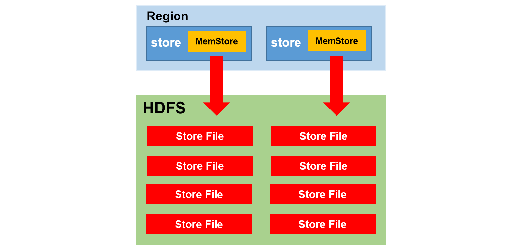

- **将内存memstore中的数据溢写到HDFS中变成磁盘文件storefile【HFILE】**
  - 关闭集群：自动Flush
  - 参数配置：自动触发机制

- 自动触发机制：HBase 2.0之前参数

  ```properties
  #region的memstore的触发
  #判断如果某个region中的某个memstore达到这个阈值，那么触发flush，flush这个region的所有memstore
  hbase.hregion.memstore.flush.size=128M
  
  #region的触发级别：如果没有memstore达到128，但是所有memstore的大小加在一起大于等于128*4
  #触发整个region的flush
  hbase.hregion.memstore.block.multiplier=4
  
  #regionserver的触发级别：所有region所占用的memstore达到阈值，就会触发整个regionserver中memstore的溢写
  #从memstore占用最多的Regin开始flush
  hbase.regionserver.global.memstore.size=0.4 --RegionServer中Memstore的总大小
  
  #低于水位后停止
  hbase.regionserver.global.memstore.size.upper.limit=0.99
  hbase.regionserver.global.memstore.size.lower.limit = 0.4*0.95 =0.38
  ```

- 自动触发机制：HBase 2.0之后

  ```properties
  #设置了一个flush的最小阈值
  #memstore的判断发生了改变：max("hbase.hregion.memstore.flush.size / column_family_number",hbase.hregion.percolumnfamilyflush.size.lower.bound.min)
  #如果memstore高于上面这个结果，就会被flush，如果低于这个值，就不flush，如果整个region所有的memstore都低于，全部flush
  #水位线 = max（128 / 列族个数,16）,列族一般给3个 ~ 42M
  #如果memstore的空间大于42,就flush，如果小于就不flush；如果都小于，全部flush
  
  举例：3个列族，3个memstore,90/30/30   90会被Flush
  
  举例：3个列族，3个memstore,30/30/30   全部flush
  
  hbase.hregion.percolumnfamilyflush.size.lower.bound.min=16M
  ```

  ```ini
  # 2.x中多了一种机制：In-Memory-compact,如果开启了【不为none】，会在内存中对需要flush的数据进行合并
  #合并后再进行flush，将多个小文件在内存中合并后再flush
    hbase.hregion.compacting.memstore.type=None|basic|eager|adaptive
  ```

> **注意**：工作中一般进行手动Flush

- 原因：避免大量的Memstore将大量的数据同时Flush到HDFS上，占用大量的内存和磁盘的IO带宽，会影响业务

- 解决：手动触发，定期执行

  ```shell
  hbase> flush 'TABLENAME'
  hbase> flush 'REGIONNAME'
  hbase> flush 'ENCODED_REGIONNAME'
  hbase> flush 'REGION_SERVER_NAME'
  ```

- 封装一个文件，通过`hbase shell filepath`来定期的运行这个脚本

### 5. Store 内部原理: StoreFile Compaction

> Hbase通过**Compaction**实现**将零散的有序数据合并为整体有序大文件，提高对HDFS数据的查询性能**

- **功能**：什么是Compaction？

  ```ini
  # 将多个单独有序StoreFile文件进行合并，合并为整体有序的大文件，加快读取速度
      file1: 1 2 3 4 5
      file2: 6 7 9
      file3: 1 8 10
  
  # 每个文件都读取，可能读取无效的数据
  	file：1 1 2 3 4 5 6 7 8 9 10
  ```

- **版本功能**

  ```ini
  # 2.0版本之前，只有StoreFile文件的合并
    磁盘中合并：minor compaction、major compaction
    
  # 2.0版本开始，内存中的数据也可以先合并后Flush
    内存中合并：In-memory compaction
    磁盘中合并：minor compaction、major compaction
  ```

> HBase 2.0之前Compaction，分为Minor Compaction和Major Compaction。

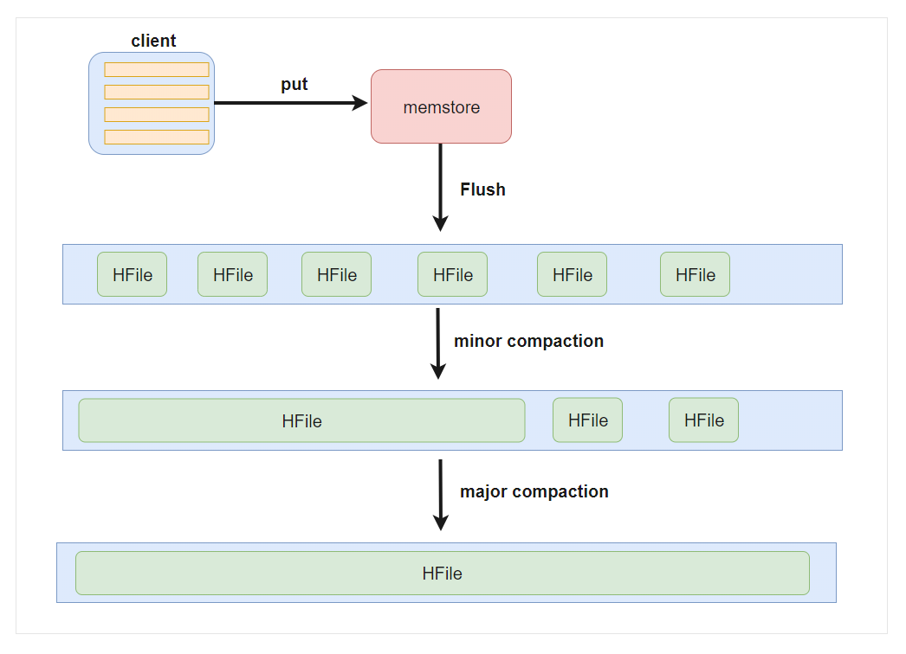

- **minor compaction**：轻量级

  - 功能：将最早生成的几个小的StoreFile文件进行合并，成为一个大文件，不定期触发

  - 特点

    - 只实现将多个小的StoreFile合并成一个相对较大的StoreFile，占用的资源不多
    - 不会将标记为更新或者删除的数据进行处理

  - 属性

    ```ini
    hbase.hstore.compaction.min=3
    ```

- **major compaction**：重量级合并

  - 功能：将**整个Store**中所有StoreFile进行合并为一个StoreFile文件，整体有序的一个大文件

  - 特点

    - 将所有文件进行合并，构建整体有序
    - 合并过程中会进行**清理过期和标记为删除的数据**
    - 资源消耗比较大

  - 参数配置

    ```ini
    hbase.hregion.majorcompaction=7天
    ```

> HBase 2.0开始，新增：**In-memory compaction**。

- 原理：将当前写入的数据划分segment【数据段】

  - 当数据不断写入MemStore，划分不同的segment，最终变成storefile文件

- 如果开启内存合并，先将第一个segment放入一个队列中，与其他的segment进行合并

  - 合并以后的结果再进行flush

- 内存中合并的方式

  ```properties
  hbase.hregion.compacting.memstore.type=None|basic|eager|adaptive
  
  none：不开启，不合并
  ```

- basic（基础型）

  ```shell
  Basic compaction策略不清理多余的数据版本，无需对cell的内存进行考核
  	basic适用于所有大量写模式
  ```

- eager（饥渴型）

  ```
  eager compaction会过滤重复的数据，清理多余的版本，这会带来额外的开销
  	eager模式主要针对数据大量过期淘汰的场景，例如：购物车、消息队列等
  ```

- **adaptive（适应型）**

  ```
  adaptive compaction根据数据的重复情况来决定是否使用eager策略
  	找出cell个数最多的一个，然后计算一个比例，如果比例超出阈值，则使用eager策略，否则使用basic策略
  ```

> 在工作中要避免**自动触发major compaction**，影响业务，所以禁用自动进行major compaction。

```ini
hbase.hregion.majorcompaction=0
```

- 在不影响业务的时候，手动处理，每天在业务不繁忙的时候，调度工具实现手动进行`major_compact`

  ```shell
  Run major compaction on passed table or pass a region row
            to major compact an individual region. To compact a single
            column family within a region specify the region name
            followed by the column family name.
            Examples:
            
            Compact all regions in a table:
            hbase> major_compact 't1'
            hbase> major_compact 'ns1:t1'
            
            Compact an entire region:
            hbase> major_compact 'r1'
            
            Compact a single column family within a region:
            hbase> major_compact 'r1', 'c1'
            
            Compact a single column family within a table:
            hbase> major_compact 't1', 'c1'
            
            Compact table with type "MOB"
            hbase> major_compact 't1', nil, 'MOB'
            
            Compact a column family using "MOB" type within a table
            hbase> major_compact 't1', 'c1', 'MOB'
  ```

### 6. Region Split

> HBase通过Region Split策略来保证一个Region存储的数据量不会过大，通过**分裂实现分摊负载，避免热点**，降低故障率。

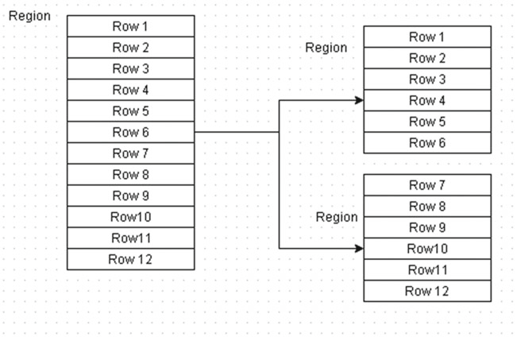

> 什么是Split分裂机制？

- 为了避免一个Region存储的数据过多，提供了Region分裂机制
- 实现将一个Region分裂为两个Region
- 由RegionServer实现Region的分裂，得到两个新的Region(Region下线)
- 由Master负责将两个新的Region分配到Regionserver上（Region上线

> 相关参数配置

- region阈值

```ini
hbase.hregion.max.filesize=10GB
```

- 0.94之前：判断region中是否有一个storefile文件是否达到阈值，如果达到，就分裂

```ini
hbase.regionserver.region.split.policy=org.apache.hadoop.hbase.regionserver.ConstantSizeRegionSplitPolicy
```

- 0.94开始：如果region个数在**0 ` 100**之间

```ini
# 规则：Math.min(getDesiredMaxFileSize(),initialSize * tableRegionsCount * tableRegionsCount * tableRegionsCount)
# initialSize = 128 X 2
# min(10GB, 256 x region个数的3次方)
hbase.regionserver.region.split.policy=org.apache.hadoop.hbase.regionserver.IncreasingToUpperBoundRegionSplitPolicy
```

- 2.x开始

```properties
# 规则：return tableRegionsCount  1  ? this.initialSize : getDesiredMaxFileSize();
# 判断region个数是否为1，如果为1，就按照256分，如果不为1，就按照10GB来分
hbase.regionserver.region.split.policy=org.apache.hadoop.hbase.regionserver.SteppingSplitPolicy
```

> **注意**：工作作中避免自动触发，影响集群读写，建议关闭

```properties
hbase.regionserver.region.split.policy=org.apache.hadoop.hbase.regionserver.DisabledRegionSplitPolicy
```

- 手动操作

  ```shell
  split 'tableName'
  split 'namespace:tableName'
  split 'regionName' # format: 'tableName,startKey,id'
  split 'tableName', 'splitKey'
  split 'regionName', 'splitKey'
  ```

### 7. 元数据表hbase:meta


> 当执行一条Put操作，数据是如何写入Hbase表或执行一条Get操作，如何从HBase表读取数据？

```ini
# 写入数据
	put 表名 rowkey 列族:列 值

# 读取数据
	get 表名 rowkey
```

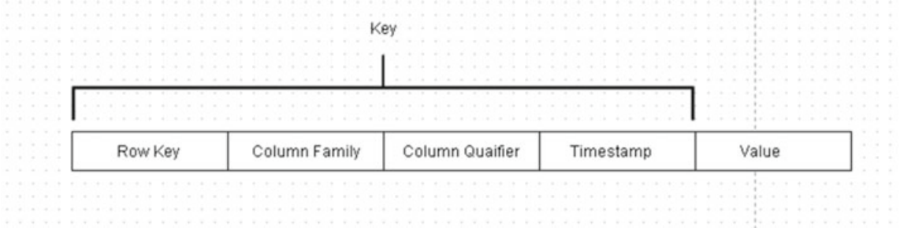

- step1：根据**表名**获取这张表对应的**所有Region的信息**
  - 整个Hbase的所有Regionserver中有很多个Region：100
  - 先根据表名找到这张表有哪些region：5
- step2：根据**Rowkey**判断具体写入哪个Region
  - 知道表的所有region
  - 根据rowkey属于哪个**region范围**，来确定具体写入哪个region
- step3：将put操作提交给这个**Region所在的RegionServer**
  - 获取这个Region所在的RegionServer地址
- step4：RegionServer将数据写入Region根据**列族**判断写入**哪个Store**
- step5：将数据写入**MemStore**中

> 读写HBase表数据，3个思考题：

- 问题1：如何知道这张表对应的region有哪些？
- 问题2：如何知道每个Region的范围的？
- 问题3：如何知道Region所在的RegionServer地址的？

> HBase自带的两张系统表

- **hbase:namespace**：存储HBase中所有namespace的信息

  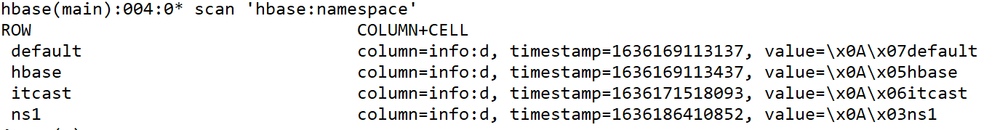

- **hbase:meta**：存储表的元数据

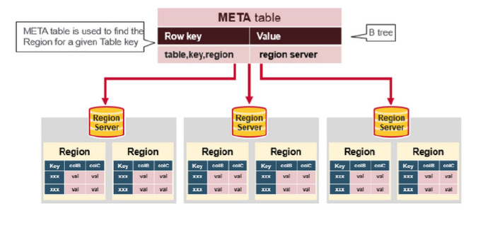

> `hbase:meta`表结构

- Rowkey：每张表每个Region的名称

  ```ini
  itcast:t3,20,1632627488682.fba4b18252cfa72e48ffe99cc63f7604
  表名,startKey,时间，唯一id
  ```

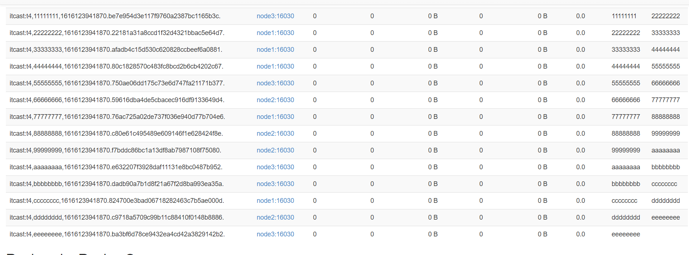

- HBase中每张表的每个region对应元数据表中的一个Rowkey

  ```ini
  # info:regioninfo
  	STARTKEY => 'eeeeeeee', ENDKEY => ''
  	
  # info:server
  	column=info:server, timestamp=1651559521977, value=node2.itcast.cn:16020 
  ```

> 根据表名读取meta表，基于rowkey的前缀匹配，获取这张表的所有region信息

- 第一点： 系统表【`hbase:meta`】只有1个Region
- 第二点：Region所在RegionServer地址信息，被保存到Zookeeper上


[所以读写HBase表数据时，创建连接Connection时，指定依赖Zookeper集群地址。]()