# HBase on Hive&Phoenix

Apache Phoenix是构建在HBase上的一个SQL层，能让我们用**标准的JDBC API**s而不是HBase客户端APIs来**创建表，插入数据和对HBase数据进行查询**。


Phoenix完全使用Java编写，**作为HBase内嵌的JDBC驱动**，Phoenix查询引擎会==将SQL查询转换为一个或多个HBase扫描Scan，并编排执行以生成标准的JDBC结果集==。

```ini
官网：http://phoenix.apache.org/
```

## I. HBase与Hive集成

### 1. SQL on HBase

> 使用HBase 数据库存储数据和查询数据时，遇到问题：

- HBase是按列存储NoSQL，不支持SQL，开发接口不方便大部分用户使用，怎么办？
- 大数据开发：==HBase 命令、HBase Java API==
- Java开发【JDBC】、数据分析师【SQL】：怎么用HBase？

> **需要一个工具能让HBase支持SQL，支持JDBC方式对HBase进行处理**

- SQL：结构化查询语言

- HBase 数据结构是否能实现基于SQL的查询操作？

  - 普通表数据：按行操作

    ```ini
     id      name        age     sex     addr
     001     zhangsan    18      null    shanghai
     002     lisi        20      female  null
     003     wangwu      null    male    beijing
     ……
    ```

  - HBase数据：按列操作

    ```ini
     rowkey       	info:id   info:name   info:age   info:sex   info:addr
     zhangsan_001    001      zhangsan      18          null      shanghai
     lisi_002        002      lisi          20          female    null
     wangwu_003      003      wangwu        null        male      beijing
     ……
    ```

- 可以==基于HBase 数据构建结构化的数据形式==，使用SQL进行分析处理

> **具体实现方式：**[集成Hive，集成Impala，使用Phoenix框架]()

- 将HBase表中每一行对应的所有列构建一张完整的结构化表
  - 如果这一行没有这一列，就补null
- 集成框架：
  - Hive：通过MapReduce来实现
  - Impala：基于内存分布式计算实现
  - Phoenix：通过HBase API封装实现的

### 2. Hive on HBase

> **实现Hive与HBase  集成，使用Hive SQL对HBase  的数据进行处理**

```ini
# HBase【itcast:t1】
	构建一个映射关系：数据存储在Hbase
	scan 'itcast:t1'

# Hive【itcast.t1】
	用户可以通过SQL操作Hive中表
	select * from itcast.t1
```

> **在Hive中对HBase关联的Hive表执行SQL语句，底层通过Hadoop中的Input和Output对HBase表进行处理**


> HBase 集成Hive优缺点：

- 优点：**支持完善的SQL语句**，可以实现各种复杂SQL的数据处理及计算，通过分布式计算程序实现，对大数据量的数据处理比较友好
- 缺点：**不支持二级索引**，数据量不是特别大的情况下，性能一般

> **实现Hive on HBase 配置**

- 1、修改`hive-site.xml`

  Hive通过SQL访问HBase ，就是HBase 的客户端，就要连接zookeeper

  ```shell
  vim /export/server/hive/conf/hive-site.xml
  ```

  ```xml
  <property>
        <name>hive.zookeeper.quorum</name>
        <value>node1.itcast.cn,node2.itcast.cn,node3.itcast.cn</value>
    </property>
    <property>
        <name>hbase.zookeeper.quorum</name>
        <value>node1.itcast.cn,node2.itcast.cn,node3.itcast.cn</value>
    </property>
    <property>
        <name>hive.server2.enable.doAs</name>
        <value>false</value>
    </property>
  ```

- 2、修改`hive-env.sh`

  ```ini
  # Set HBASE_HOME
  export HBASE_HOME=/export/server/hbase
  ```

- 3、同步集群

  ```ini
  scp /export/server/hive/conf/hive-site.xml node2.itcast.cn:/export/server/hive/conf/
  scp /export/server/hive/conf/hive-env.sh node2.itcast.cn:/export/server/hive/conf/
  
  scp /export/server/hive/conf/hive-site.xml node3.itcast.cn:/export/server/hive/conf/
  scp /export/server/hive/conf/hive-env.sh node3.itcast.cn:/export/server/hive/conf/
  ```

- 4、启动HDFS、ZK、HBase

  ```ini
  start-zk.sh
  
  start-dfs.sh
  
  start-hbase.sh
  ```

- 5、启动Hive和YARN

  ```shell
  #启动YARN
  start-yarn.sh
  
  #先启动metastore服务
  start-metastore.sh
  #然后启动hiveserver
  start-hiveserver2.sh
  
  #然后启动beeline
  /export/server/hive/bin/beeline
  !connect jdbc:hive2://node1.itcast.cn:10000
  root 123456
  ```

  

> **实现Hive on HBase 的测试**

- **如果HBase 中表已存在，只能创建外部表**

  ```sql
  --创建测试数据库
  create database db_hbase;
  use db_hbase;
  
  --创建测试表
  create external table db_hbase.bank_records(
  key string,
  code string,
  money  string,
  pay_account string,
  pay_channel string,
  pay_comments string,
  pay_name string,
  pay_way string,
  rec_account string,
  rec_bank_name string,
  rec_name string,
  status string,
  ts string
  )  
  stored by 'org.apache.hadoop.hive.hbase.HBaseStorageHandler'  
  with serdeproperties("hbase.columns.mapping" = ":key,info:code,info:money,info:pay_account,info:pay_channel,info:pay_comments,info:pay_name,info:pay_way,info:rec_account,info:rec_bank_name,info:rec_name,info:status,info:timestamp") 
  tblproperties("hbase.table.name" = "default:bank_records");
  ```

- 查询

  ```SQL
  SELECT * FROM db_hbase.bank_records LIMIT 10 ;
    
  SELECT rec_bank_name, COUNT(*) AS total FROM db_hbase.bank_records GROUP BY rec_bank_name ORDER BY total DESC;
  ```

> **注意**

- Hive中的只是关联表，并没有数据，数据存储在HBase 表中
- 在Hive中创建HBase 的关联表，关联成功后，使用SQL通过MapReduce处理关联表
- 如果HBase 中表已存在，只能建外部表，使用**:key**来表示**rowkey**
- Hive中与HBase 关联的表，**不能使用load写入数据**，只能使用insert，通过MR读写数据

## II. Phoenix快速使用

### 1. 框架介绍

```
http://phoenix.apache.org
```

> **Aapche Phoenix** 是==构建在 HBase 之上的高效的 SQL 引擎，==同时具备 OLTP 和 OLAP 能力，作为 HBase 生态系统中非常重要的组件，重点的特性包括：

- 底层存储基于 HBase，并提供一套标准的 JDBC API 作为 HBase SQL 层；
- 支持标准 SQL，以及完整 ACID 事务特性；
  - [底层全部通过Hbase Java API来实现，通过构建一系列的Scan和Put来实现数据的读写]()
- 为 HBase 提供了二级索引解决方案；
  - [底层封装了大量的内置的协处理器，可以实现各种复杂的处理需求]()

> Apache Phoenix 与 Hive on HBase比较：

- Hive：SQL更加全面，但是不支持二级索引，底层通过分布式计算工具来实现
- Phoenix：SQL相对支持不全面，但是性能比较好，直接使用HbaseAPI，支持索引实现


### 2. 安装配置

> Phoenix安装本质：[将jars包放到HBase lib目录下，重启HBase集群即可，使用客户端连接SQLlite即可]()


```
文档：https://phoenix.apache.org/installation.html#
```

- 1、修改三台Linux文件句柄数

  ```shell
  vim /etc/security/limits.conf
  #在文件的末尾添加以下内容，*号不能去掉
  
  * soft nofile 65536
  * hard nofile 131072
  * soft nproc 2048
  * hard nproc 4096
  ```

  

- 2、上传解压，选择node1机器

  ```shell
  cd /export/software/
  rz
  
  tar -zxvf apache-phoenix-5.0.0-HBase-2.0-bin.tar.gz -C /export/server/
  
  cd /export/server/
  chown -R root:root apache-phoenix-5.0.0-HBase-2.0-bin/
  ln -s apache-phoenix-5.0.0-HBase-2.0-bin phoenix
  ```

- 3、将Phoenix所有jar包分发到Hbase的**lib**目录下

  ```ini
  #拷贝到第一台机器
  cp -r /export/server/phoenix/phoenix-* /export/server/hbase/lib/
  ```

- 4、分发集群，远程拷贝node2和node3

```ini
# node2
scp -r /export/server/hbase/lib/phoenix-* root@node2.itcast.cn:/export/server/hbase/lib
# node3
scp -r /export/server/hbase/lib/phoenix-* root@node3.itcast.cn:/export/server/hbase/lib
```

- 5、修改`hbase-site.xml`，添加一下属性

  ```ini
  vim /export/server/hbase/conf/hbase-site.xml
  ```

  ```xml
  <!-- 关闭流检查，从2.x开始使用async -->
  <property>
      <name>hbase.unsafe.stream.capability.enforce</name>
      <value>false</value>
  </property>
  <!-- 支持HBase命名空间映射 -->
  <property>
      <name>phoenix.schema.isNamespaceMappingEnabled</name>
      <value>true</value>
  </property>
  <!-- 支持索引预写日志编码 -->
  <property>
      <name>hbase.regionserver.wal.codec</name>
    <value>org.apache.hadoop.hbase.regionserver.wal.IndexedWALEditCodec</value>
  </property>
  ```

  - 6、配置文件同步给其他两台机器

    ```ini
    cd /export/server/hbase/conf/
    scp hbase-site.xml root@node2.itcast.cn:$PWD
    scp hbase-site.xml root@node3.itcast.cn:$PWD
    ```

- 7、配置文件同步给Phoenix 

  ```shell
  # 删除
  rm -rf /export/server/phoenix/bin/hbase-site.xml 
  
  # 在拷贝
  cp /export/server/hbase/conf/hbase-site.xml /export/server/phoenix/bin/
  ```

- 8、重启HBase集群

  ```ini
  stop-hbase.sh
  start-hbase.sh
  ```

> 启动运行Phoenix自带命令行客户端：`sqlline`

- 安装依赖，在node1上

```ini
yum -y install python-argparse
```

- 启动运行命令

```ini
/export/server/phoenix/bin/sqlline.py node1.itcast.cn,node2.itcast.cn,node3.itcast.cn:2181
```

[执行Python脚本，使用Python2，如果虚拟机上安装Python3，此时运行，将会出现错误。]()

```ini
# 修改python脚本，指定具体Python解释器未知即可
[root@node1 ~]# vim /export/server/phoenix/bin/sqlline.py 

```


- 测试

  ```ini
  !tables
  ```


- 退出

  ```ini
  !quit
  ```

### 3. DDL操作

> 实现基于SQL的数据库管理：创建、切换、删除


- 创建NS（创建数据库)

```SQL
CREATE SCHEMA IF NOT EXISTS TEST_PHOENIX;
```

- 切换NS

  ```sqlite
  USE TEST_PHOENIX ;
  ```

- 删除NS

  ```sqlite
  DROP SCHEMA IF EXISTS TEST_PHOENIX;
  ```

- **注意：Phoenix中默认会将所有字符转换为大写，如果想要使用小写字母，必须加上双引号**

> 实现基于SQL的数据表管理：创建、列举、查看、删除

- **列举**

  ```
  !tables
  ```

  

- **创建**

  - 语法：http://phoenix.apache.org/language/index.html#create_table

  

  - **注意规则**

    - 建表的时候需要指定字段
    - ==谁是primary key谁就是rowkey，每张表必须有主键==

  - 定义字段时，要指定列族，列族的属性可以在建表语句中指定

    - split：指定建表构建多个分区，每个分区段划分

    ```sql
     CREATE TABLE my_table ( 
         id INTEGER not null primary key desc, 
         m.date DATE not null,
         m.db_utilization DECIMAL, 
         i.db_utilization
     ) m.VERSIONS='3';
    ```

  - 如果Hbase中没有这个表【一般不用】

    ```sql
    USE TEST_PHOENIX;
    CREATE TABLE IF NOT EXISTS TEST_PHOENIX.ORDER_DTL(
        RK varchar primary key,
        INFO.STATUS varchar,
        INFO.PAY_MONEY float,
        INFO.PAYWAY integer,
        INFO.USER_ID varchar,
        INFO.OPERATION_DATE varchar,
        INFO.CATEGORY varchar
    );
    ```

    

- 查看表

  ```SQL
  !desc ORDER_DTL;
  ```

  

- 表删除

  

  ```SQL
  DROP TABLE IF EXISTS TEST_PHOENIX.ORDER_DTL;
  ```

  

> 如果HBase中表已存在会自动关联【**常用**】

- HBase中建表并导入数据

  ```ini
  hbase shell ORDER_INFO.txt 
  ```

- Phoenix中建表

  ```sql
  CREATE TABLE IF NOT EXISTS ORDER_INFO(
      ID varchar primary key,
      INFO.USER_ID varchar,
      INFO.OPERATION_DATE varchar,
      INFO.PAYWAY varchar,
      INFO.PAY_MONEY varchar,
      INFO.STATUS varchar,
      INFO.CATEGORY varchar
  ) column_encoded_bytes=0;
  ```

  [表名与列名都必须一致，大小写严格区分]()


- 查看表中数据

```SQL
SELECT * FROM ORDER_INFO LIMIT 10 ;

SELECT COUNT(*) AS total FROM ORDER_INFO ;
```


> 注意：创建表时，必须指定主键作为Rowkey，主键列不能加列族

- Phoenix 4.8版本之前，只要**创建同名的Hbase表，会自动关联数据**

- Phoenix 4.8版本以后，不推荐关联表的方式

  - 推荐使用视图关联的方式来实现，如果要使用关联表的方式，必须加上以下参数

  ```ini
   column_encoded_bytes=0;
  ```

### 4. 视图View

> **问题**：直接关联HBase中的表，会导致==误删除==，容易出现问题，如何避免？

- Phoenix中建议使用**视图view**的方式来关联HBase中已有的表
- 通过构建关联视图，可以解决大部分数据查询的数据，不影响数据
- ==视图：理解为只读的表==

```SQL
CREATE VIEW "my_hbase_table"
    ( k VARCHAR primary key, "v" UNSIGNED_LONG) default_column_family='a';
    
CREATE VIEW my_view ( new_col SMALLINT )
    AS SELECT * FROM my_table WHERE k = 100;
    
CREATE VIEW my_view_on_view
    AS SELECT * FROM my_view WHERE new_col > 70;


DROP VIEW my_view ;
DROP VIEW IF EXISTS my_schema.my_view ;
DROP VIEW IF EXISTS my_schema.my_view CASCADE ;


```

> 实现测试

- 1、删除Phoenix中的ORDER_INFO

  ```sql
  DROP TABLE IF EXISTS ORDER_INFO;
  ```

- 2、观察Hbase中的ORDER_INFO

- 3、Hbase中的表也会被删除，重新加载

  ```
  hbase shell ORDER_INFO.txt 
  ```

- 4、创建视图，关联Hbase中已经存在的表

  ```sql
  CREATE VIEW IF NOT EXISTS ORDER_INFO(
      ID varchar primary key,
      INFO.USER_ID varchar,
      INFO.OPERATION_DATE varchar,
      INFO.PAYWAY varchar,
      INFO.PAY_MONEY varchar,
      INFO.STATUS varchar,
      INFO.CATEGORY varchar
  ) ;
  ```

- 5、查询数据

  ```sql
  SELECT ID, USER_ID, PAYWAY, CATEGORY FROM ORDER_INFO LIMIT 10;
  ```

> 视图与表应用场景：

- 视图：==Hbase中已经有这张表，写都是操作Hbase，Phoenix只提供读==
- 建表：对这张表既要读也要使用Phoenix来写
- 在实际项目中，先在HBase中创建表，再在Phoenix中创建视图；写入数据时，基于HBase 操作，查询数据使用Phoenix基于SQL操作。

### 5. 数据CRUD

> 基于order_info订单数据实现DQL查询数据

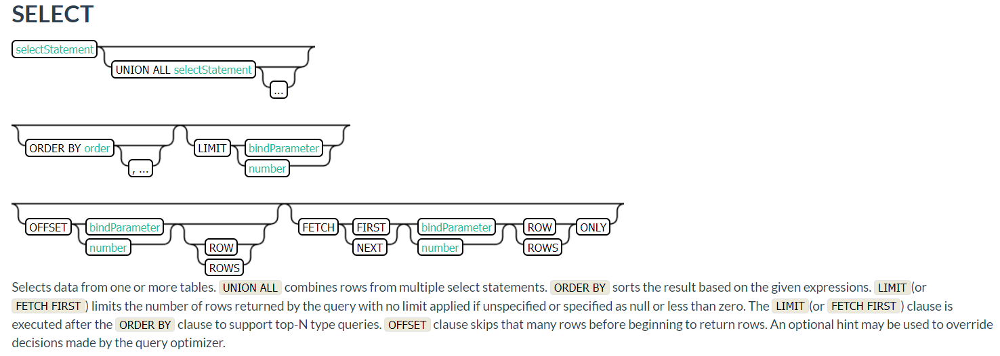

```sql
SELECT * FROM TEST LIMIT 1000;

SELECT * FROM TEST LIMIT 1000 OFFSET 100;

SELECT full_name FROM SALES_PERSON WHERE ranking >= 5.0 
UNION ALL 
SELECT reviewer_name FROM CUSTOMER_REVIEW WHERE score >= 8.0
```

- 需求一：查询支付方式为1的数据

  ```sql
  SELECT ID, USER_ID, PAYWAY, CATEGORY FROM ORDER_INFO WHERE PAYWAY = '1';
  ```

  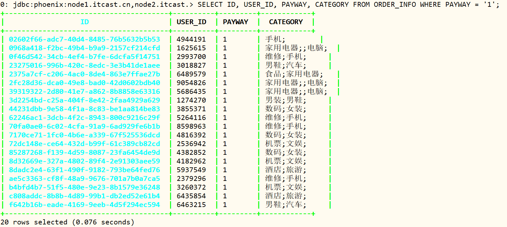

  

- 需求二：查询每种支付方式对应的用户人数，并且按照用户人数降序排序

  ```sql
  SELECT PAYWAY, COUNT(DISTINCT USER_ID) AS total
  FROM ORDER_INFO GROUP BY PAYWAY 
  ORDER BY total DESC;
  ```

  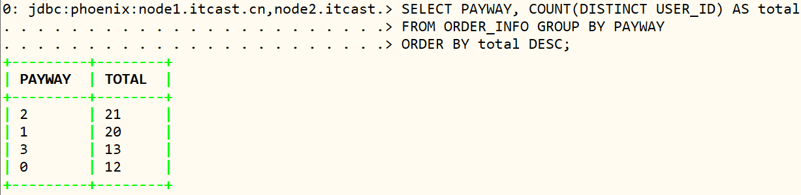

- 需求三：查询数据的第60行到66行

  ```sql
   --以前的写法：limit M,N
   --M：开始位置
   --N：显示的条数
   --Phoenix的写法：limit N offset M
  SELECT * FROM ORDER_INFO LIMIT 6 OFFSET 60;   -- 总共66行，显示最后6行
  ```

  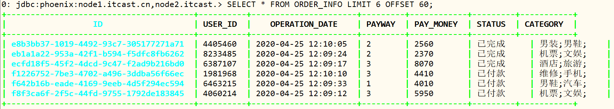

- **小结**

- 函数支持：http://phoenix.apache.org/language/functions.html

  - 基本查询与MySQL也是一致的
  - 写的时候注意数据类型以及大小写的问题即可
  - 如果遇到SQL报错，检查语法是否支持

> 创建订单ORDER_DATA表，进行DML插入数据操作

- 语法及示例

  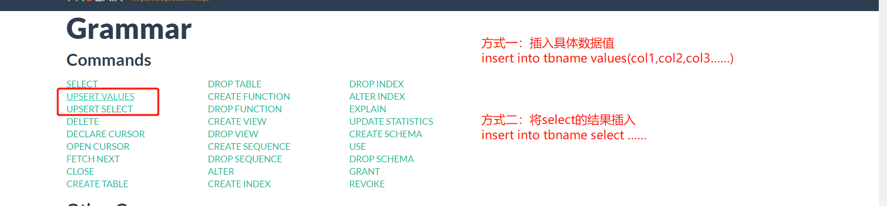

  ```sql
  -- 插入数据，未指定字段
  UPSERT INTO TEST VALUES('foo','bar',3);
  
  -- 插入数据，指定字段名称
  UPSERT INTO TEST(NAME,ID) VALUES('foo',123);
  
  -- 插入数据，如果主键存在，指定如何更新数据
  UPSERT INTO TEST(ID, COUNTER) VALUES(123, 0) ON DUPLICATE KEY UPDATE COUNTER = COUNTER;
  
  ```

- 创建表

  ```SQL
  CREATE TABLE IF NOT EXISTS TEST_PHOENIX.ORDER_DATA(
      ID varchar primary key,
      INFO.USER_ID varchar,
      INFO.OPERATION_DATE varchar,
      INFO.PAYWAY varchar,
      INFO.PAY_MONEY varchar,
      INFO.STATUS varchar,
      INFO.CATEGORY varchar
  );
  ```

- 方式一：插入一条数据

  ```sql
  UPSERT INTO TEST_PHOENIX.ORDER_DATA VALUES('z8f3ca6f-2f5c-44fd-9755-1792de183845','4944191','2020-04-25 12:09:16','1','4070','未提交','电脑');
  ```

  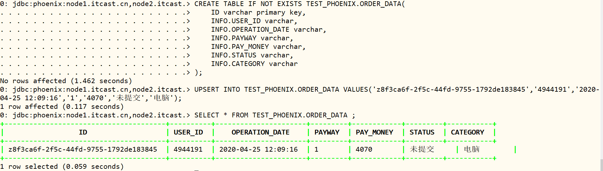

- 方式二：更新USERID为123456

  ```sql
  UPSERT INTO TEST_PHOENIX.ORDER_DATA(ID, USER_ID) values('z8f3ca6f-2f5c-44fd-9755-1792de183845','123456');
  ```

  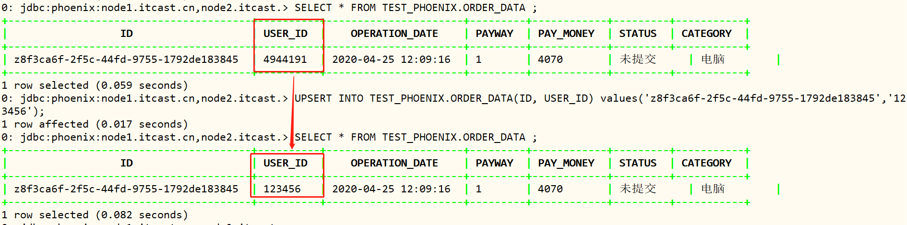

> 基于ORDER_DATA订单数据实现DML删除数据

- 语法及示例

  ```sql
  DELETE FROM TEST;
  
  DELETE FROM TEST WHERE ID=123;
  
  DELETE FROM TEST WHERE NAME LIKE 'foo%';
  ```

  

- 删除USER_ID为123456的rowkey数据

  ```sql
  DELETE FROM TEST_PHOENIX.ORDER_DATA WHERE USER_ID = '123456';
  ```

  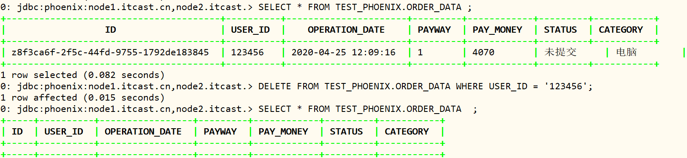

### 6. 表预分区

> 创建表的时候，需要根据Rowkey来设计多个分区

- Hbase命令建表

  ```ini
  CREATE 命名空间名称:表名称, 列族，预分区
  ```

- Phoenix提供创建表时，指定分区范围的语法

  ```sql
   CREATE TABLE IF NOT EXISTS "my_case_sensitive_table"( 
       "id" char(10) not null primary key, 
       "value" integer
   )
   DATA_BLOCK_ENCODING='NONE',VERSIONS=5, MAX_FILESIZE=2000000 split on (?, ?, ?)
  ```

- 创建数据表，四个分区

  ```sql
  DROP TABLE IF EXISTS ORDER_REGION;
  CREATE TABLE IF NOT EXISTS ORDER_REGION(
      ID varchar primary key,
      INFO.STATUS varchar,
      INFO.MONEY float,
      INFO.PAY_WAY integer,
      INFO.USER_ID varchar,
      INFO.OPERATION_TIME varchar,
      INFO.CATEGORY varchar
  ) 
  CONPRESSION='GZ'
  SPLIT ON ('3','5','7');
  ```

  

- 插入数据

  ```sql
  UPSERT INTO "ORDER_REGION" VALUES('02602f66-adc7-40d4-8485-76b5632b5b53','已提交',4070,1,'4944191','2020-04-25 12:09:16','手机;');
  UPSERT INTO "ORDER_REGION" VALUES('0968a418-f2bc-49b4-b9a9-2157cf214cfd','已完成',4350,1,'1625615','2020-04-25 12:09:37','家用电器;;电脑;');
  UPSERT INTO "ORDER_REGION" VALUES('0e01edba-5e55-425e-837a-7efb91c56630','已提交',6370,3,'3919700','2020-04-25 12:09:39','男装;男鞋;');
  UPSERT INTO "ORDER_REGION" VALUES('0f46d542-34cb-4ef4-b7fe-6dcfa5f14751','已付款',9380,1,'2993700','2020-04-25 12:09:46','维修;手机;');
  UPSERT INTO "ORDER_REGION" VALUES('1fb7c50f-9e26-4aa8-a140-a03d0de78729','已完成',6400,2,'5037058','2020-04-25 12:10:13','数码;女装;');
  UPSERT INTO "ORDER_REGION" VALUES('23275016-996b-420c-8edc-3e3b41de1aee','已付款',280,1,'3018827','2020-04-25 12:09:53','男鞋;汽车;');
  UPSERT INTO "ORDER_REGION" VALUES('2375a7cf-c206-4ac0-8de4-863e7ffae27b','已完成',5600,1,'6489579','2020-04-25 12:08:55','食品;家用电器;');
  UPSERT INTO "ORDER_REGION" VALUES('269fe10c-740b-4fdb-ad25-7939094073de','已提交',8340,2,'2948003','2020-04-25 12:09:26','男装;男鞋;');
  UPSERT INTO "ORDER_REGION" VALUES('2849fa34-6513-44d6-8f66-97bccb3a31a1','已提交',7060,2,'2092774','2020-04-25 12:09:38','酒店;旅游;');
  UPSERT INTO "ORDER_REGION" VALUES('28b7e793-6d14-455b-91b3-0bd8b23b610c','已提交',640,3,'7152356','2020-04-25 12:09:49','维修;手机;');
  UPSERT INTO "ORDER_REGION" VALUES('2909b28a-5085-4f1d-b01e-a34fbaf6ce37','已提交',9390,3,'8237476','2020-04-25 12:10:08','男鞋;汽车;');
  UPSERT INTO "ORDER_REGION" VALUES('2a01dfe5-f5dc-4140-b31b-a6ee27a6e51e','已提交',7490,2,'7813118','2020-04-25 12:09:05','机票;文娱;');
  UPSERT INTO "ORDER_REGION" VALUES('2b86ab90-3180-4940-b624-c936a1e7568d','已付款',5360,2,'5301038','2020-04-25 12:08:50','维修;手机;');
  UPSERT INTO "ORDER_REGION" VALUES('2e19fbe8-7970-4d62-8e8f-d364afc2dd41','已付款',6490,0,'3141181','2020-04-25 12:09:22','食品;家用电器;');
  UPSERT INTO "ORDER_REGION" VALUES('2fc28d36-dca0-49e8-bad0-42d0602bdb40','已付款',3820,1,'9054826','2020-04-25 12:10:04','家用电器;;电脑;');
  UPSERT INTO "ORDER_REGION" VALUES('31477850-8b15-4f1b-9ec3-939f7dc47241','已提交',4650,2,'5837271','2020-04-25 12:08:52','机票;文娱;');
  UPSERT INTO "ORDER_REGION" VALUES('39319322-2d80-41e7-a862-8b8858e63316','已提交',5000,1,'5686435','2020-04-25 12:08:51','家用电器;;电脑;');
  UPSERT INTO "ORDER_REGION" VALUES('3d2254bd-c25a-404f-8e42-2faa4929a629','已完成',5000,1,'1274270','2020-04-25 12:08:43','男装;男鞋;');
  UPSERT INTO "ORDER_REGION" VALUES('42f7fe21-55a3-416f-9535-baa222cc0098','已完成',3600,2,'2661641','2020-04-25 12:09:58','维修;手机;');
  UPSERT INTO "ORDER_REGION" VALUES('44231dbb-9e58-4f1a-8c83-be1aa814be83','已提交',3950,1,'3855371','2020-04-25 12:08:39','数码;女装;');
  UPSERT INTO "ORDER_REGION" VALUES('526e33d2-a095-4e19-b759-0017b13666ca','已完成',3280,0,'5553283','2020-04-25 12:09:01','食品;家用电器;');
  UPSERT INTO "ORDER_REGION" VALUES('5a6932f4-b4a4-4a1a-b082-2475d13f9240','已提交',50,2,'1764961','2020-04-25 12:10:07','家用电器;;电脑;');
  UPSERT INTO "ORDER_REGION" VALUES('5fc0093c-59a3-417b-a9ff-104b9789b530','已提交',6310,2,'1292805','2020-04-25 12:09:36','男装;男鞋;');
  UPSERT INTO "ORDER_REGION" VALUES('605c6dd8-123b-4088-a047-e9f377fcd866','已完成',8980,2,'6202324','2020-04-25 12:09:54','机票;文娱;');
  UPSERT INTO "ORDER_REGION" VALUES('613cfd50-55c7-44d2-bb67-995f72c488ea','已完成',6830,3,'6977236','2020-04-25 12:10:06','酒店;旅游;');
  UPSERT INTO "ORDER_REGION" VALUES('62246ac1-3dcb-4f2c-8943-800c9216c29f','已提交',8610,1,'5264116','2020-04-25 12:09:14','维修;手机;');
  UPSERT INTO "ORDER_REGION" VALUES('625c7fef-de87-428a-b581-a63c71059b14','已提交',5970,0,'8051757','2020-04-25 12:09:07','男鞋;汽车;');
  UPSERT INTO "ORDER_REGION" VALUES('6d43c490-58ab-4e23-b399-dda862e06481','已提交',4570,0,'5514248','2020-04-25 12:09:34','酒店;旅游;');
  UPSERT INTO "ORDER_REGION" VALUES('70fa0ae0-6c02-4cfa-91a9-6ad929fe6b1b','已付款',4100,1,'8598963','2020-04-25 12:09:08','维修;手机;');
  UPSERT INTO "ORDER_REGION" VALUES('7170ce71-1fc0-4b6e-a339-67f525536dcd','已完成',9740,1,'4816392','2020-04-25 12:09:51','数码;女装;');
  UPSERT INTO "ORDER_REGION" VALUES('71961b06-290b-457d-bbe0-86acb013b0e3','已完成',6550,3,'2393699','2020-04-25 12:08:49','男鞋;汽车;');
  UPSERT INTO "ORDER_REGION" VALUES('72dc148e-ce64-432d-b99f-61c389cb82cd','已提交',4090,1,'2536942','2020-04-25 12:10:12','机票;文娱;');
  UPSERT INTO "ORDER_REGION" VALUES('7c0c1668-b783-413f-afc4-678a5a6d1033','已完成',3850,3,'6803936','2020-04-25 12:09:20','酒店;旅游;');
  UPSERT INTO "ORDER_REGION" VALUES('7fa02f7a-10df-4247-9935-94c8b7d4dbc0','已提交',1060,0,'6119810','2020-04-25 12:09:21','维修;手机;');
  UPSERT INTO "ORDER_REGION" VALUES('820c5e83-f2e0-42d4-b5f0-83802c75addc','已付款',9270,2,'5818454','2020-04-25 12:10:09','数码;女装;');
  UPSERT INTO "ORDER_REGION" VALUES('83ed55ec-a439-44e0-8fe0-acb7703fb691','已完成',8380,2,'6804703','2020-04-25 12:09:52','男鞋;汽车;');
  UPSERT INTO "ORDER_REGION" VALUES('85287268-f139-4d59-8087-23fa6454de9d','已取消',9750,1,'4382852','2020-04-25 12:10:00','数码;女装;');
  UPSERT INTO "ORDER_REGION" VALUES('8d32669e-327a-4802-89f4-2e91303aee59','已提交',9390,1,'4182962','2020-04-25 12:09:57','机票;文娱;');
  UPSERT INTO "ORDER_REGION" VALUES('8dadc2e4-63f1-490f-9182-793be64fed76','已付款',9350,1,'5937549','2020-04-25 12:09:02','酒店;旅游;');
  UPSERT INTO "ORDER_REGION" VALUES('94ad8ee0-8898-442c-8cb1-083a4b609616','已提交',4370,0,'4666456','2020-04-25 12:09:13','维修;手机;');
  UPSERT INTO "ORDER_REGION" VALUES('994cbb44-f0ee-45ff-a4f4-76c87bc2b972','已付款',3190,3,'3200759','2020-04-25 12:09:25','数码;女装;');
  UPSERT INTO "ORDER_REGION" VALUES('9ff3032c-8679-4247-9e6f-4caf2dc93aff','已提交',850,0,'8835231','2020-04-25 12:09:40','男鞋;汽车;');
  UPSERT INTO "ORDER_REGION" VALUES('9ff4032c-1223-4247-9e6f-123456dfdsds','已付款',850,0,'8835231','2020-04-25 12:09:45','食品;家用电器;');
  UPSERT INTO "ORDER_REGION" VALUES('a467ba42-f91e-48a0-865e-1703aaa45e0e','已提交',8040,0,'8206022','2020-04-25 12:09:50','家用电器;;电脑;');
  UPSERT INTO "ORDER_REGION" VALUES('a5302f47-96d9-41b4-a14c-c7a508f59282','已付款',8570,2,'5319315','2020-04-25 12:08:44','机票;文娱;');
  UPSERT INTO "ORDER_REGION" VALUES('a5b57bec-6235-45f4-bd7e-6deb5cd1e008','已提交',5700,3,'6486444','2020-04-25 12:09:27','酒店;旅游;');
  UPSERT INTO "ORDER_REGION" VALUES('ae5c3363-cf8f-48a9-9676-701a7b0a7ca5','已付款',7460,1,'2379296','2020-04-25 12:09:23','维修;手机;');
  UPSERT INTO "ORDER_REGION" VALUES('b1fb2399-7cf2-4af5-960a-a4d77f4803b8','已提交',2690,3,'6686018','2020-04-25 12:09:55','数码;女装;');
  UPSERT INTO "ORDER_REGION" VALUES('b21c7dbd-dabd-4610-94b9-d7039866a8eb','已提交',6310,2,'1552851','2020-04-25 12:09:15','男鞋;汽车;');
  UPSERT INTO "ORDER_REGION" VALUES('b4bfd4b7-51f5-480e-9e23-8b1579e36248','已提交',4000,1,'3260372','2020-04-25 12:09:35','机票;文娱;');
  UPSERT INTO "ORDER_REGION" VALUES('b63983cc-2b59-4992-84c6-9810526d0282','已提交',7370,3,'3107867','2020-04-25 12:08:45','数码;女装;');
  UPSERT INTO "ORDER_REGION" VALUES('bf60b752-1ccc-43bf-9bc3-b2aeccacc0ed','已提交',720,2,'5034117','2020-04-25 12:09:03','机票;文娱;');
  UPSERT INTO "ORDER_REGION" VALUES('c808addc-8b8b-4d89-99b1-db2ed52e61b4','已提交',3630,1,'6435854','2020-04-25 12:09:10','酒店;旅游;');
  UPSERT INTO "ORDER_REGION" VALUES('cc9dbd20-cf9f-4097-ae8b-4e73db1e4ba1','已付款',5000,0,'2007322','2020-04-25 12:08:38','维修;手机;');
  UPSERT INTO "ORDER_REGION" VALUES('ccceaf57-a5ab-44df-834a-e7b32c63efc1','已提交',2660,2,'7928516','2020-04-25 12:09:42','数码;女装;');
  UPSERT INTO "ORDER_REGION" VALUES('d7be5c39-e07c-40e8-bf09-4922fbc6335c','已付款',8750,2,'1250995','2020-04-25 12:09:09','食品;家用电器;');
  UPSERT INTO "ORDER_REGION" VALUES('dfe16df7-4a46-4b6f-9c6d-083ec215218e','已完成',410,0,'1923817','2020-04-25 12:09:56','家用电器;;电脑;');
  UPSERT INTO "ORDER_REGION" VALUES('e1241ad4-c9c1-4c17-93b9-ef2c26e7f2b2','已付款',6760,0,'2457464','2020-04-25 12:08:54','数码;女装;');
  UPSERT INTO "ORDER_REGION" VALUES('e180a9f2-9f80-4b6d-99c8-452d6c037fc7','已完成',8120,2,'7645270','2020-04-25 12:09:32','男鞋;汽车;');
  UPSERT INTO "ORDER_REGION" VALUES('e4418843-9ac0-47a7-bfd8-d61c4d296933','已付款',8170,2,'7695668','2020-04-25 12:09:11','家用电器;;电脑;');
  UPSERT INTO "ORDER_REGION" VALUES('e8b3bb37-1019-4492-93c7-305177271a71','已完成',2560,2,'4405460','2020-04-25 12:10:05','男装;男鞋;');
  UPSERT INTO "ORDER_REGION" VALUES('eb1a1a22-953a-42f1-b594-f5dfc8fb6262','已完成',2370,2,'8233485','2020-04-25 12:09:24','机票;文娱;');
  UPSERT INTO "ORDER_REGION" VALUES('ecfd18f5-45f2-4dcd-9c47-f2ad9b216bd0','已付款',8070,3,'6387107','2020-04-25 12:09:04','酒店;旅游;');
  UPSERT INTO "ORDER_REGION" VALUES('f1226752-7be3-4702-a496-3ddba56f66ec','已付款',4410,3,'1981968','2020-04-25 12:10:10','维修;手机;');
  UPSERT INTO "ORDER_REGION" VALUES('f642b16b-eade-4169-9eeb-4d5f294ec594','已提交',4010,1,'6463215','2020-04-25 12:09:29','男鞋;汽车;');
  UPSERT INTO "ORDER_REGION" VALUES('f8f3ca6f-2f5c-44fd-9755-1792de183845','已付款',5950,3,'4060214','2020-04-25 12:09:12','机票;文娱;');
  ```

- 查看分区请求

  

- 查看表的数据

```SQL
SELECT COUNT(1) AS TOTAL FROM ORDER_REGION ;

SELECT * FROM ORDER_REGION LIMIT 10 ;
```

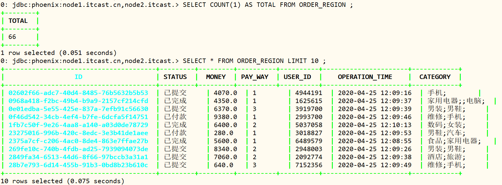

### 7. JDBC Client

> Phoenix支持使用JDBC的方式来提交SQL语句

```ini
//JDBC
step1：申明驱动类，获取连接Connection
step2：获取PrepareStatement语句对象
step3：构建SQL语句，使用prep执行SQL语句
step4：释放资源
```

- **注意：在resource中要添加hbase-site.xml配置文件**

- 构建JDBC连接Phoenix

  ```java
  package cn.itcast.phoenix;
  
  import java.sql.Connection;
  import java.sql.DriverManager;
  import java.sql.PreparedStatement;
  import java.sql.ResultSet;
  
  /**
   * 基于Phoenix 提供JDBC API实现从HBase表加载数据
   */
  public class PhoenixJdbcDemo {
  
  	public static void main(String[] args) throws Exception{
  
  		// 定义变量
  		Connection conn = null ;
  		PreparedStatement pstmt = null ;
  		ResultSet result = null ;
  		try{
  			// 1. 加载驱动类
  			Class.forName("org.apache.phoenix.jdbc.PhoenixDriver") ;
  
  			// 2. 获取连接
  			conn = DriverManager.getConnection("jdbc:phoenix:node1.itcast.cn,node2.itcast.cn,node3.itcast.cn:2181") ;
  
  			// 3. 创建Statement对象
  			pstmt = conn.prepareStatement("SELECT USER_ID, PAY_WAY, CATEGORY FROM ORDER_REGION LIMIT 10");
  
  			// 4. 执行操作，此处查询
  			result = pstmt.executeQuery();
  
  			// 5. 获取数据
  			while (result.next()){
  				String userId = result.getString("USER_ID");
  				String payway = result.getString("PAY_WAY");
  				String category = result.getString("CATEGORY");
  				System.out.println(userId + ", " + payway + ", " + category);
  			}
  		}catch (Exception e){
  			e.printStackTrace();
  		}finally {
  			// 6. 关闭连接
  			if(null != result) result.close();
  			if(null != pstmt) pstmt.close();
  			if(null != conn) conn.close();
  		}
  	}
  }
  ```

- 运行查看结果

  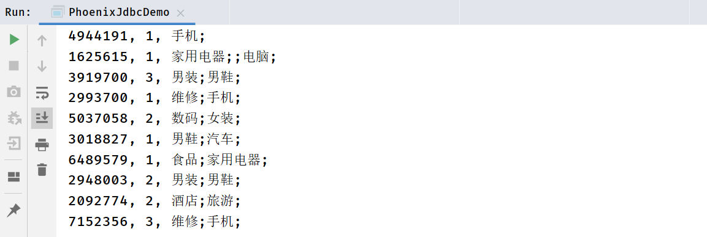

## III. Phoenix二级索引

### 1. 功能概述

- 卡口流量表：`ROAD_TRAFFIC_FLOW`，满足主要业务查询，依据**车牌号码和时间查询**

| RowKey                             | info:车牌 | info:时间               | info:编号 | info:速度 |
| ---------------------------------- | --------- | ----------------------- | --------- | --------- |
| 苏A-7D8E7_20220501090000234_KB1001 | 苏A-7D8E7 | 2022-05-01 09:00:00.234 | KB1001    | 40 km/h   |
| 苏A-7D8E7_20220501090300123_KB1002 | 苏A-7D8E7 | 2022-05-01 09:03:00.123 | KB1002    | 38 km/h   |
| 苏A-7D8E7_20220501090600567_KB1003 | 苏A-7D8E7 | 2022-05-01 09:06:00.567 | KB1003    | 45 km/h   |
| 皖C-YA890_20220501102005876_KB1002 | 皖C-YA890 | 2022-05-01 10:20:05.876 | KB1002    | 42 km/h   |
| 皖C-YA890_20220501102320235_KB1003 | 皖C-YA890 | 2022-05-01 10:23:20.235 | KB1003    | 50 km/h   |

- 卡口流量辅助表：`ROAD_TRAFFIC_FLOW_QKBH`，满足辅助查询，依据**卡口编号和时间查询**

| RowKey                             | info:车牌 | info:时间               | info:编号 | info:速度 |
| ---------------------------------- | --------- | ----------------------- | --------- | --------- |
| KB1001_20220501090000234_苏A-7D8E7 | 苏A-7D8E7 | 2022-05-01 09:00:00.234 | KB1001    | 40 km/h   |
| KB1002_20220501090300123_苏A-7D8E7 | 苏A-7D8E7 | 2022-05-01 09:03:00.123 | KB1002    | 38 km/h   |
| KB1003_20220501090600567_苏A-7D8E7 | 苏A-7D8E7 | 2022-05-01 09:06:00.567 | KB1003    | 45 km/h   |
| KB1002_20220501102005876_皖C-YA890 | 皖C-YA890 | 2022-05-01 10:20:05.876 | KB1002    | 42 km/h   |
| KB1003_20220501102320235_皖C-YA890 | 皖C-YA890 | 2022-05-01 10:23:20.235 | KB1003    | 50 km/h   |

- 卡口流量索引表：`ROAD_TRAFFIC_FLOW_INDEX`，构建流量索引表，实现**二级索引查询**

| RowKey                             | info:rk                            |
| ---------------------------------- | ---------------------------------- |
| KB1001_20220501090000234_苏A-7D8E7 | 苏A-7D8E7_20220501090000234_KB1001 |
| KB1002_20220501090300123_苏A-7D8E7 | 苏A-7D8E7_20220501090300123_KB1002 |
| KB1003_20220501090600567_苏A-7D8E7 | 苏A-7D8E7_20220501090600567_KB1003 |
| KB1002_20220501102005876_皖C-YA890 | 皖C-YA890_20220501102005876_KB1002 |
| KB1003_20220501102320235_皖C-YA890 | 皖C-YA890_20220501102320235_KB1003 |

- 卡口流量索引表：`ROAD_TRAFFIC_FLOW_SECONDARY_INDEX`，构建流量索引表，实现**二级索引查询**

| RowKey                                    | info:速度 | info:经度 | info:纬度 |
| ----------------------------------------- | --------- | --------- | --------- |
| KB1001#苏A-7D8E7_20220501090000234_KB1001 | 40 km/h   |           |           |
| KB1002#苏A-7D8E7_20220501090300123_KB1002 | 38 km/h   |           |           |
| KB1003#苏A-7D8E7_20220501090600567_KB1003 | 45 km/h   |           |           |
| KB1002#皖C-YA890_20220501102005876_KB1002 | 42 km/h   |           |           |
| KB1003#皖C-YA890_20220501102320235_KB1003 | 50 km/h   |           |           |

> **问题**：为什么需要构建二级索引？

- HBase使用Rowkey作为唯一索引，==只能按照rowkey前缀查询才走索引查询==，其他查询都是全表扫描，性能差

  - 快速查询：车牌号码、车牌号码+时间
  - 全表扫描：卡口编号、卡口 编号+时间

  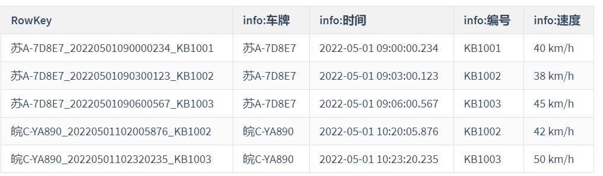

- 解决：构建索引表，**查询时通过走两次索引来代替全表扫描**。

  - [先构建索引表，查询时：查询索引表数据，再查询原始表数据]()。

    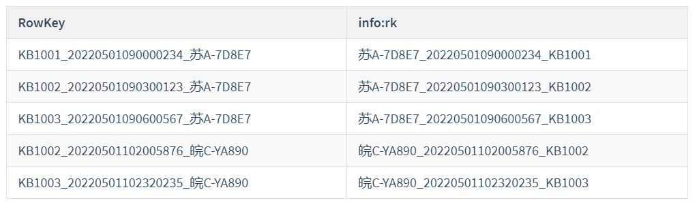

> **问题**：Phoenix如何实现二级索引？

- step1：根据数据存储需求，创建原始数据表，将数据写入原始数据表

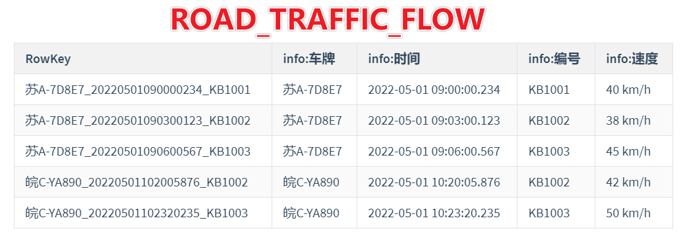

- step2：根据数据查询需求，构建二级索引，**Phoenix自动创建索引表**

  ```sql
  CREATE INDEX indexName ON tableName(colName);
  ```

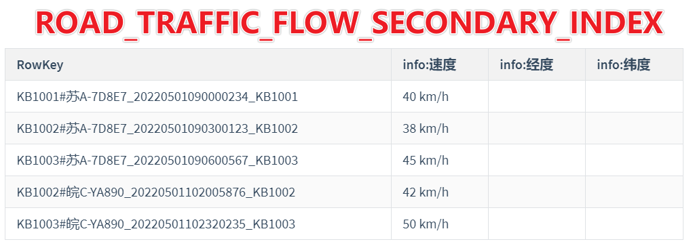

- step3：查询数据时，Phoenix根据过滤条件是否存在二级索引，优先判断走二级索引代替全表扫描
  - step1、先查询索引表，根据**卡口编号qkbh**查询索引表的rowkey
    - 分割得到原表的rowkey
  - step2、再查询原表，通过rowkey，走索引查询得到所有列信息
- step4：原始数据表发生数据变化时，**Phoenix会自动更新索引表的数据**
  - 底层实现：协处理器

> Phoenix中**索引类型**：Phoenix中二级索引实现完全由Phoenix自主实现，文档 http://phoenix.apache.org/secondary_indexing.html。

- **全局索引**：Global Index
- **覆盖索引**：Coverd Index
- **本地索引**：Local Index
- 函数索引：一般不用

### 2. 全局索引

> **全局索引功能**：当为==某一列创建全局索引==时，Phoenix==自动创建一张索引表，将创建索引的这一列加上原表的rowkey作为新的rowkey==

- 原始数据表

  ```ini
  rowkey：车牌号码_时间_卡口编号		车牌号码		时间		卡口编号	  行驶速度
  
  ```

- 需求：根据**卡口编号**进行数据查询，[不走索引]()

- 创建全局索引

  ```ini
  CREATE INDEX qkbh_index ON ROAD_TRAFFIC_FLOW(卡口编号);
  ```

- 自动构建索引表

  ```ini
  rowkey：卡口编号#车牌号码_时间_卡口编号		col：占位值
  ```

- **查询**

  - 先查询索引表：通过rowkey获取名称对应的id
  - 再查询数据表：通过id查询对应的数据

- **特点：**

  - 默认==只能对构建索引的字段做索引查询==
  - 如果**查询中包含不是索引的字段**或者**条件不是索引字段**，不走索引

- **应用：**==写少读多==

  - 当原表的数据发生更新操作提交时，会被拦截
  - 先更新所有索引表，然后再更新原表

> 基于Phoenix实现全局索引的测试

- 1、创建表、插入数据

```SQL
-- 创建表
create 'ROAD_TRAFFIC_FLOW', 'INFO'

-- 插入数据
put 'ROAD_TRAFFIC_FLOW', '苏A-7D8E7_20220501090000234_KB1001', 'INFO:CPHM', '苏A-7D8E7'
put 'ROAD_TRAFFIC_FLOW', '苏A-7D8E7_20220501090000234_KB1001', 'INFO:TS', '2022-05-01 09:00:00.234'
put 'ROAD_TRAFFIC_FLOW', '苏A-7D8E7_20220501090000234_KB1001', 'INFO:QKBH', 'KB1001'
put 'ROAD_TRAFFIC_FLOW', '苏A-7D8E7_20220501090000234_KB1001', 'INFO:SPEED', '40 km/h'

put 'ROAD_TRAFFIC_FLOW', '苏A-7D8E7_20220501090300123_KB1002', 'INFO:CPHM', '苏A-7D8E7'
put 'ROAD_TRAFFIC_FLOW', '苏A-7D8E7_20220501090300123_KB1002', 'INFO:TS', '2022-05-01 09:03:00.123'
put 'ROAD_TRAFFIC_FLOW', '苏A-7D8E7_20220501090300123_KB1002', 'INFO:QKBH', 'KB1002'
put 'ROAD_TRAFFIC_FLOW', '苏A-7D8E7_20220501090300123_KB1002', 'INFO:SPEED', '38 km/h'

put 'ROAD_TRAFFIC_FLOW', '苏A-7D8E7_20220501090600567_KB1003', 'INFO:CPHM', '苏A-7D8E7'
put 'ROAD_TRAFFIC_FLOW', '苏A-7D8E7_20220501090600567_KB1003', 'INFO:TS', '2022-05-01 09:06:00.567'
put 'ROAD_TRAFFIC_FLOW', '苏A-7D8E7_20220501090600567_KB1003', 'INFO:QKBH', 'KB1003'
put 'ROAD_TRAFFIC_FLOW', '苏A-7D8E7_20220501090600567_KB1003', 'INFO:SPEED', '45 km/h'

put 'ROAD_TRAFFIC_FLOW', '皖C-YA890_20220501102005876_KB1002', 'INFO:CPHM', '皖C-YA890'
put 'ROAD_TRAFFIC_FLOW', '皖C-YA890_20220501102005876_KB1002', 'INFO:TS', '2022-05-01 10:20:05.876'
put 'ROAD_TRAFFIC_FLOW', '皖C-YA890_20220501102005876_KB1002', 'INFO:QKBH', 'KB1002'
put 'ROAD_TRAFFIC_FLOW', '皖C-YA890_20220501102005876_KB1002', 'INFO:SPEED', '42 km/h'

put 'ROAD_TRAFFIC_FLOW', '皖C-YA890_20220501102320235_KB1003', 'INFO:CPHM', '皖C-YA890'
put 'ROAD_TRAFFIC_FLOW', '皖C-YA890_20220501102320235_KB1003', 'INFO:TS', '2022-05-01 10:23:20.235'
put 'ROAD_TRAFFIC_FLOW', '皖C-YA890_20220501102320235_KB1003', 'INFO:QKBH', 'KB1003'
put 'ROAD_TRAFFIC_FLOW', '皖C-YA890_20220501102320235_KB1003', 'INFO:SPEED', '50 km/h'

```

- 2、Phoenix查询视图，关联HBase表

```SQL
CREATE VIEW IF NOT EXISTS ROAD_TRAFFIC_FLOW(
    RK varchar primary key,
    INFO.CPHM varchar,
    INFO.TS varchar,
    INFO.QKBH varchar,
    INFO.SPEED varchar
) ;

SELECT * FROM ROAD_TRAFFIC_FLOW LIMIT 10 ；
```

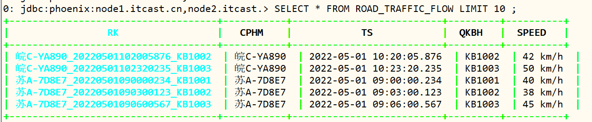

- 3、不构建索引，先查询，查看执行计划

  ```sql
  SELECT * FROM ROAD_TRAFFIC_FLOW WHERE QKBH = 'KB1002' LIMIT 10 ;
  ```

  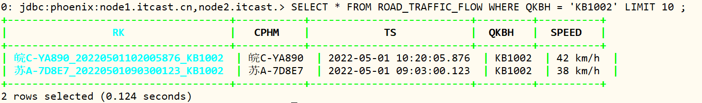

  ```SQL
  explain SELECT * FROM ROAD_TRAFFIC_FLOW WHERE QKBH = 'KB1002' LIMIT 10 ;
  ```

  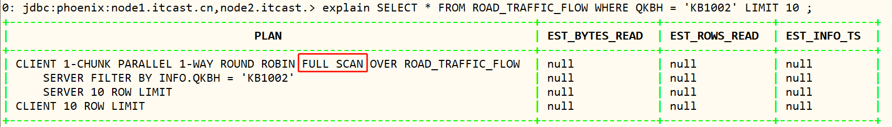

- 4、基于`QKBH`构建全局索引

  ```sql
  CREATE INDEX GBL_IDX_QKBH_ROAD_TRAFFIC_FLOW on ROAD_TRAFFIC_FLOW(INFO.QKBH);
  ```

  hbase 中查看索引表数据

  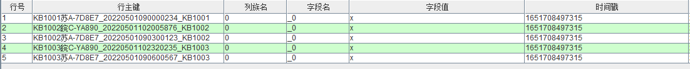

  查看索引表和数据

  ```SQL
  !tables
  
  SELECT * FROM GBL_IDX_QKBH_ROAD_TRAFFIC_FLOW LIMIT 10 ;
  ```

  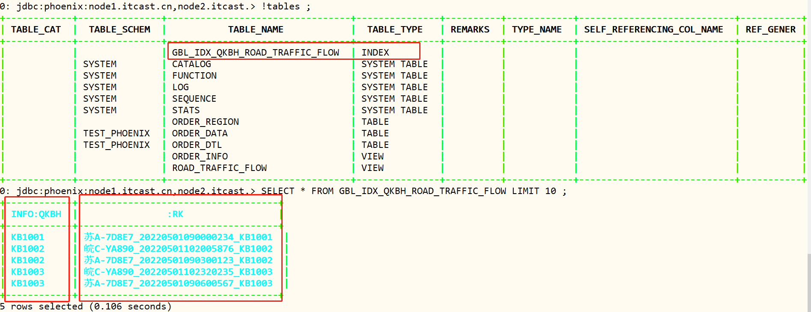

- 5、查询数据及查询计划

  ```sql
  explain SELECT QKBH FROM ROAD_TRAFFIC_FLOW WHERE QKBH = 'KB1002' LIMIT 10 ;
  ```

  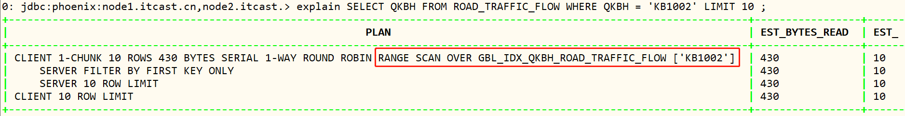

- 如果查询内容不是索引字段，查看执行计划

  ```sql
  explain SELECT * FROM ROAD_TRAFFIC_FLOW WHERE QKBH = 'KB1002' LIMIT 10 ;
  ```

  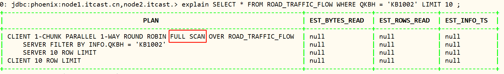

- 删除索引

  ```sql
  DROP INDEX GBL_IDX_QKBH_ROAD_TRAFFIC_FLOW on ROAD_TRAFFIC_FLOW;
  ```

> **小结**

- 全局索引是**最常用的基础二级索引**类型
- 索引表结构
  - rowkey：查询条件字段【索引字段】 + 原表rowkey
- 应用：适合于读多写少的场景
- 特点：如果查询内容中包含非索引字段，将不走索引

### 3. 覆盖索引


### 4. 本地索引


## 附录

### Phoenix Maven依赖