# HBase on Hive&Phoenix

Apache Phoenix是构建在HBase上的一个SQL层，能让我们用**标准的JDBC API**s而不是HBase客户端APIs来**创建表，插入数据和对HBase数据进行查询**。

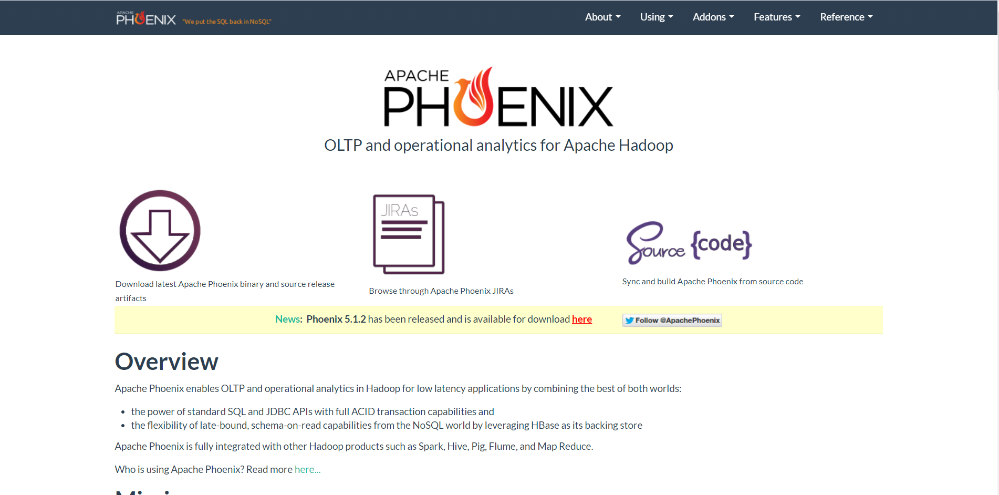

Phoenix完全使用Java编写，**作为HBase内嵌的JDBC驱动**，Phoenix查询引擎会==将SQL查询转换为一个或多个HBase扫描Scan，并编排执行以生成标准的JDBC结果集==。

```ini
官网：http://phoenix.apache.org/
```

## I. HBase与Hive集成

### 1. SQL on HBase

> 使用HBase 数据库存储数据和查询数据时，遇到问题：

- HBase是按列存储NoSQL，不支持SQL，开发接口不方便大部分用户使用，怎么办？
- 大数据开发：==HBase 命令、HBase Java API==
- Java开发【JDBC】、数据分析师【SQL】：怎么用HBase？

> **需要一个工具能让HBase支持SQL，支持JDBC方式对HBase进行处理**

- SQL：结构化查询语言

- HBase 数据结构是否能实现基于SQL的查询操作？

  - 普通表数据：按行操作

    ```ini
     id      name        age     sex     addr
     001     zhangsan    18      null    shanghai
     002     lisi        20      female  null
     003     wangwu      null    male    beijing
     ……
    ```

  - HBase数据：按列操作

    ```ini
     rowkey       	info:id   info:name   info:age   info:sex   info:addr
     zhangsan_001    001      zhangsan      18          null      shanghai
     lisi_002        002      lisi          20          female    null
     wangwu_003      003      wangwu        null        male      beijing
     ……
    ```

- 可以==基于HBase 数据构建结构化的数据形式==，使用SQL进行分析处理

> **具体实现方式：**[集成Hive，集成Impala，使用Phoenix框架]()

- 将HBase表中每一行对应的所有列构建一张完整的结构化表
  - 如果这一行没有这一列，就补null
- 集成框架：
  - Hive：通过MapReduce来实现
  - Impala：基于内存分布式计算实现
  - Phoenix：通过HBase API封装实现的

### 2. Hive on HBase

> **实现Hive与HBase  集成，使用Hive SQL对HBase  的数据进行处理**

```ini
# HBase【itcast:t1】
	构建一个映射关系：数据存储在Hbase
	scan 'itcast:t1'
	
# Hive【itcast.t1】
	用户可以通过SQL操作Hive中表
	select * from itcast.t1
```

> **在Hive中对HBase关联的Hive表执行SQL语句，底层通过Hadoop中的Input和Output对HBase表进行处理**

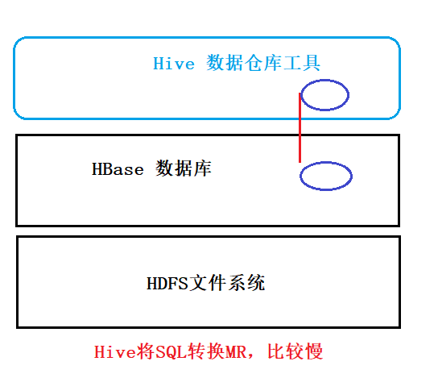

> HBase 集成Hive优缺点：

- 优点：**支持完善的SQL语句**，可以实现各种复杂SQL的数据处理及计算，通过分布式计算程序实现，对大数据量的数据处理比较友好
- 缺点：**不支持二级索引**，数据量不是特别大的情况下，性能一般

> **实现Hive on HBase 配置**

- 1、修改`hive-site.xml`

  Hive通过SQL访问HBase ，就是HBase 的客户端，就要连接zookeeper

  ```shell
  vim /export/server/hive/conf/hive-site.xml
  ```

  ```xml
  <property>
        <name>hive.zookeeper.quorum</name>
        <value>node1.itcast.cn,node2.itcast.cn,node3.itcast.cn</value>
    </property>
    <property>
        <name>hbase.zookeeper.quorum</name>
        <value>node1.itcast.cn,node2.itcast.cn,node3.itcast.cn</value>
    </property>
    <property>
        <name>hive.server2.enable.doAs</name>
        <value>false</value>
    </property>
  ```

- 2、修改`hive-env.sh`

  ```ini
  # Set HBASE_HOME
  export HBASE_HOME=/export/server/hbase
  ```

- 3、同步集群

  ```ini
  scp /export/server/hive/conf/hive-site.xml node2.itcast.cn:/export/server/hive/conf/
  scp /export/server/hive/conf/hive-env.sh node2.itcast.cn:/export/server/hive/conf/
  
  scp /export/server/hive/conf/hive-site.xml node3.itcast.cn:/export/server/hive/conf/
  scp /export/server/hive/conf/hive-env.sh node3.itcast.cn:/export/server/hive/conf/
  ```

- 4、启动HDFS、ZK、HBase

  ```ini
  start-zk.sh
  
  start-dfs.sh
  
  start-hbase.sh
  ```

- 5、启动Hive和YARN

  ```shell
  #启动YARN
  start-yarn.sh
  
  #先启动metastore服务
  start-metastore.sh
  #然后启动hiveserver
  start-hiveserver2.sh
  
  #然后启动beeline
  /export/server/hive/bin/beeline
  !connect jdbc:hive2://node1.itcast.cn:10000
  root 123456
  ```

  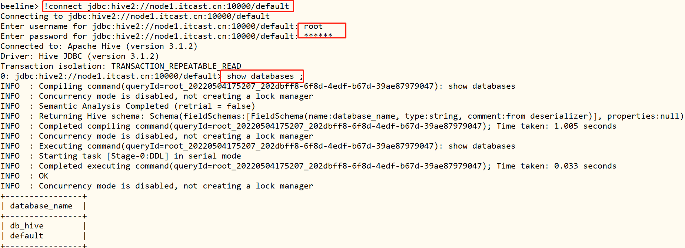

> **实现Hive on HBase 的测试**

- **如果HBase 中表已存在，只能创建外部表**

  ```sql
  --创建测试数据库
  create database db_hbase;
  use db_hbase;
  
  --创建测试表
  create external table db_hbase.bank_records(
  key string,
  code string,
  money  string,
  pay_account string,
  pay_channel string,
  pay_comments string,
  pay_name string,
  pay_way string,
  rec_account string,
  rec_bank_name string,
  rec_name string,
  status string,
  ts string
  )  
  stored by 'org.apache.hadoop.hive.hbase.HBaseStorageHandler'  
  with serdeproperties("hbase.columns.mapping" = ":key,info:code,info:money,info:pay_account,info:pay_channel,info:pay_comments,info:pay_name,info:pay_way,info:rec_account,info:rec_bank_name,info:rec_name,info:status,info:timestamp") 
  tblproperties("hbase.table.name" = "default:bank_records");
  ```

- 查询

  ```SQL
  SELECT * FROM db_hbase.bank_records LIMIT 10 ;
    
  SELECT rec_bank_name, COUNT(*) AS total FROM db_hbase.bank_records GROUP BY rec_bank_name ORDER BY total DESC;
  ```

> **注意**

- Hive中的只是关联表，并没有数据，数据存储在HBase 表中
- 在Hive中创建HBase 的关联表，关联成功后，使用SQL通过MapReduce处理关联表
- 如果HBase 中表已存在，只能建外部表，使用**:key**来表示**rowkey**
- Hive中与HBase 关联的表，**不能使用load写入数据**，只能使用insert，通过MR读写数据

## II. Phoenix快速使用

### 1. 框架介绍

```
http://phoenix.apache.org
```

> **Aapche Phoenix** 是==构建在 HBase 之上的高效的 SQL 引擎，==同时具备 OLTP 和 OLAP 能力，作为 HBase 生态系统中非常重要的组件，重点的特性包括：

- 底层存储基于 HBase，并提供一套标准的 JDBC API 作为 HBase SQL 层；
- 支持标准 SQL，以及完整 ACID 事务特性；
  - [底层全部通过Hbase Java API来实现，通过构建一系列的Scan和Put来实现数据的读写]()
- 为 HBase 提供了二级索引解决方案；
  - [底层封装了大量的内置的协处理器，可以实现各种复杂的处理需求]()

> Apache Phoenix 与 Hive on HBase比较：

- Hive：SQL更加全面，但是不支持二级索引，底层通过分布式计算工具来实现
- Phoenix：SQL相对支持不全面，但是性能比较好，直接使用HbaseAPI，支持索引实现


### 2. 安装配置

> Phoenix安装本质：[将jars包放到HBase lib目录下，重启HBase集群即可，使用客户端连接SQLlite即可]()

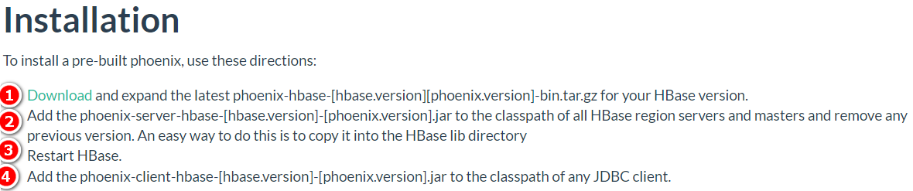

```
文档：https://phoenix.apache.org/installation.html#
```

- 1、修改三台Linux文件句柄数

  ```shell
  vim /etc/security/limits.conf
  #在文件的末尾添加以下内容，*号不能去掉
  
  * soft nofile 65536
  * hard nofile 131072
  * soft nproc 2048
  * hard nproc 4096
  ```

  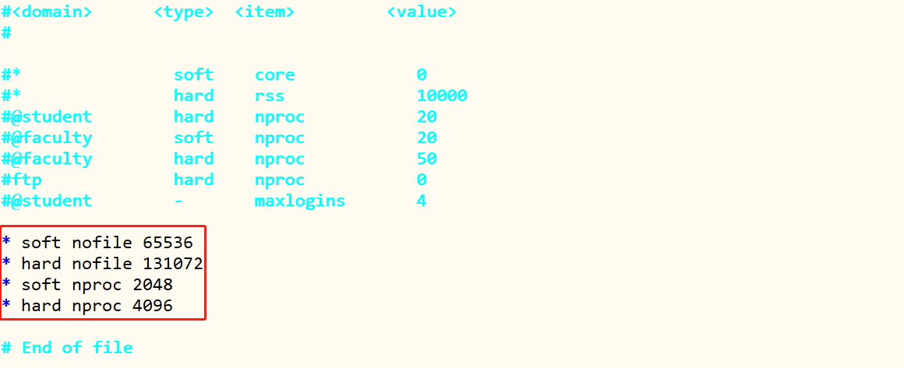

- 2、上传解压，选择node1机器

  ```shell
  cd /export/software/
  rz
  
  tar -zxvf apache-phoenix-5.0.0-HBase-2.0-bin.tar.gz -C /export/server/
  
  cd /export/server/
  chown -R root:root apache-phoenix-5.0.0-HBase-2.0-bin/
  ln -s apache-phoenix-5.0.0-HBase-2.0-bin phoenix
  ```

- 3、将Phoenix所有jar包分发到Hbase的**lib**目录下

  ```ini
  #拷贝到第一台机器
  cp -r /export/server/phoenix/phoenix-* /export/server/hbase/lib/
  ```

- 4、分发集群，远程拷贝node2和node3

```ini
# node2
scp -r /export/server/hbase/lib/phoenix-* root@node2.itcast.cn:/export/server/hbase/lib
# node3
scp -r /export/server/hbase/lib/phoenix-* root@node3.itcast.cn:/export/server/hbase/lib
```

- 5、修改`hbase-site.xml`，添加一下属性

  ```ini
  vim /export/server/hbase/conf/hbase-site.xml
  ```

  ```xml
  <!-- 关闭流检查，从2.x开始使用async -->
  <property>
      <name>hbase.unsafe.stream.capability.enforce</name>
      <value>false</value>
  </property>
  <!-- 支持HBase命名空间映射 -->
  <property>
      <name>phoenix.schema.isNamespaceMappingEnabled</name>
      <value>true</value>
  </property>
  <!-- 支持索引预写日志编码 -->
  <property>
      <name>hbase.regionserver.wal.codec</name>
    <value>org.apache.hadoop.hbase.regionserver.wal.IndexedWALEditCodec</value>
  </property>
  ```

  - 6、配置文件同步给其他两台机器

    ```ini
    cd /export/server/hbase/conf/
    scp hbase-site.xml root@node2.itcast.cn:$PWD
    scp hbase-site.xml root@node3.itcast.cn:$PWD
    ```

- 7、配置文件同步给Phoenix 

  ```shell
  # 删除
  rm -rf /export/server/phoenix/bin/hbase-site.xml 
  
  # 在拷贝
  cp /export/server/hbase/conf/hbase-site.xml /export/server/phoenix/bin/
  ```

- 8、重启HBase集群

  ```ini
  stop-hbase.sh
  start-hbase.sh
  ```

> 启动运行Phoenix自带命令行客户端：`sqlline`

- 安装依赖，在node1上

```ini
yum -y install python-argparse
```

- 启动运行命令

```ini
/export/server/phoenix/bin/sqlline.py node1.itcast.cn,node2.itcast.cn,node3.itcast.cn:2181
```

[执行Python脚本，使用Python2，如果虚拟机上安装Python3，此时运行，将会出现错误。]()

```ini
# 修改python脚本，指定具体Python解释器未知即可
[root@node1 ~]# cd /export/server/phoenix/bin

```

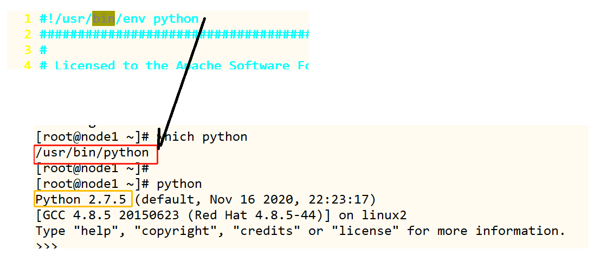

- 测试

  ```ini
  !tables
  ```

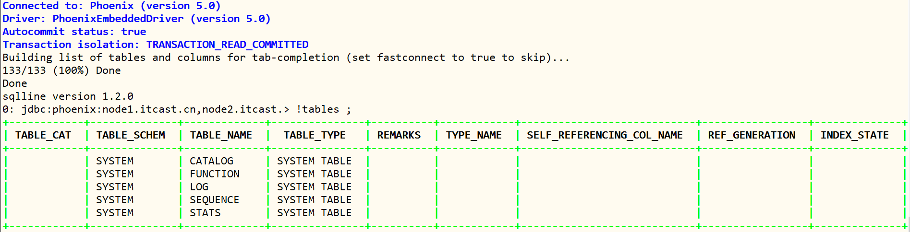

- 退出

  ```ini
  !quit
  ```

### 3. DDL操作

> 实现基于SQL的数据库管理：创建、切换、删除

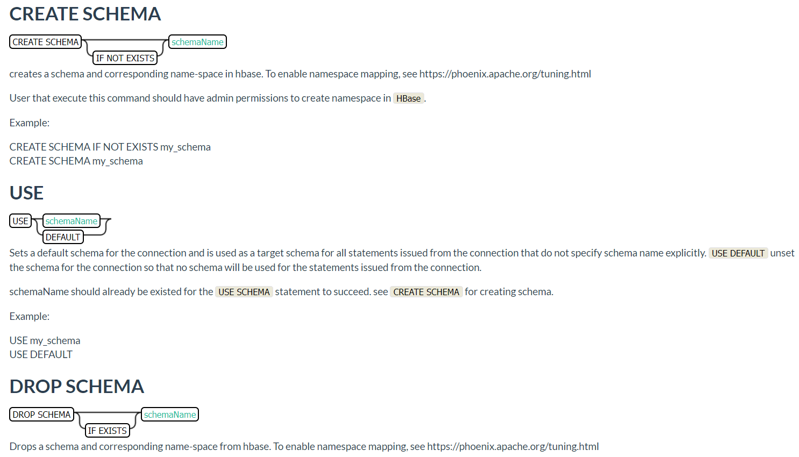

- 创建NS（创建数据库)

```SQL
CREATE SCHEMA IF NOT EXISTS TEST_PHOENIX;
```

- 切换NS

  ```sqlite
  USE TEST_PHOENIX ;
  ```

- 删除NS

  ```sqlite
  DROP SCHEMA IF EXISTS TEST_PHOENIX;
  ```

- **注意：Phoenix中默认会将所有字符转换为大写，如果想要使用小写字母，必须加上双引号**

> 实现基于SQL的数据表管理：创建、列举、查看、删除

- **列举**

  ```
  !tables
  ```

  

- **创建**

  - 语法：http://phoenix.apache.org/language/index.html#create_table

  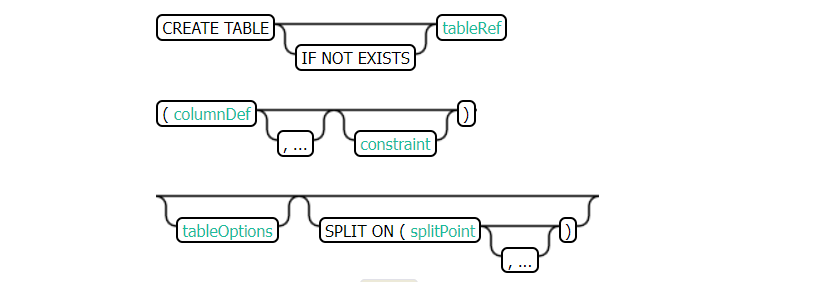

  - **注意规则**

    - 建表的时候需要指定字段
    - ==谁是primary key谁就是rowkey，每张表必须有主键==

  - 定义字段时，要指定列族，列族的属性可以在建表语句中指定

    - split：指定建表构建多个分区，每个分区段划分

    ```sql
     CREATE TABLE my_table ( 
         id INTEGER not null primary key desc, 
         m.date DATE not null,
         m.db_utilization DECIMAL, 
         i.db_utilization
     ) m.VERSIONS='3';
    ```

  - 如果Hbase中没有这个表【一般不用】

    ```sql
    USE TEST_PHOENIX;
    CREATE TABLE IF NOT EXISTS TEST_PHOENIX.ORDER_DTL(
        RK varchar primary key,
        INFO.STATUS varchar,
        INFO.PAY_MONEY float,
        INFO.PAYWAY integer,
        INFO.USER_ID varchar,
        INFO.OPERATION_DATE varchar,
        INFO.CATEGORY varchar
    );
    ```

    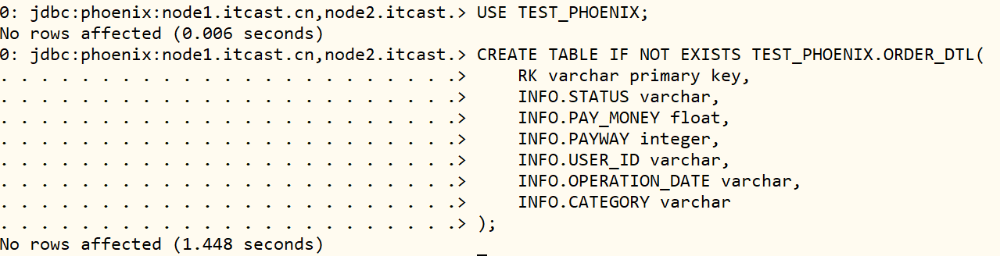

- 查看表

  ```SQL
  !desc ORDER_DTL;
  ```

  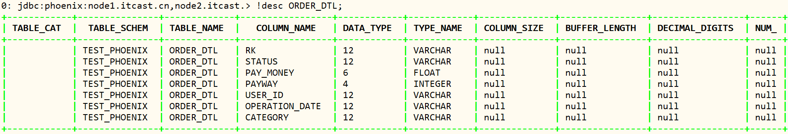

- 表删除

  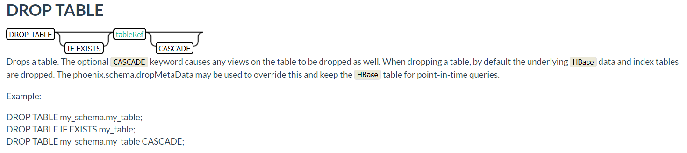

  ```SQL
  DROP TABLE IF EXISTS TEST_PHOENIX.ORDER_DTL;
  ```

  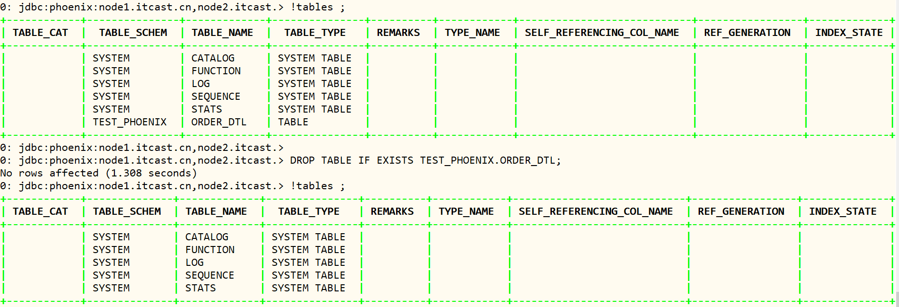

> 如果HBase中表已存在会自动关联【**常用**】

- HBase中建表并导入数据

  ```ini
  hbase shell ORDER_INFO.txt 
  ```

- Phoenix中建表

  ```sql
  CREATE TABLE IF NOT EXISTS ORDER_INFO(
      ID varchar primary key,
      INFO.USER_ID varchar,
      INFO.OPERATION_DATE varchar,
      INFO.PAYWAY varchar,
      INFO.PAY_MONEY varchar,
      INFO.STATUS varchar,
      INFO.CATEGORY varchar
  ) column_encoded_bytes=0;
  ```

  [表名与列名都必须一致，大小写严格区分]()


- 查看表中数据

```SQL
SELECT * FROM ORDER_INFO LIMIT 10 ;

SELECT COUNT(*) AS total FROM ORDER_INFO ;
```

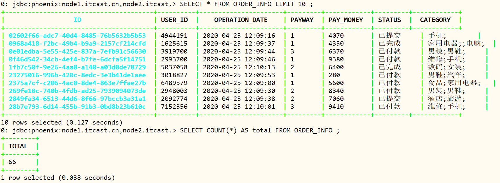

> 注意：创建表时，必须指定主键作为Rowkey，主键列不能加列族

- Phoenix 4.8版本之前，只要**创建同名的Hbase表，会自动关联数据**

- Phoenix 4.8版本以后，不推荐关联表的方式

  - 推荐使用视图关联的方式来实现，如果要使用关联表的方式，必须加上以下参数

  ```ini
   column_encoded_bytes=0 ;
  ```

### 4. 视图View


### 5. 数据CRUD


### 6. 表预分区


### 7. JDBC Client


## III. Phoenix二级索引

### 1. 功能概述


### 2. 全局索引


### 3. 覆盖索引


### 4. 本地索引


## 附录

### Phoenix Maven依赖