# 分布式消息队列Kafka

## I. Kafka基本概念

### 1. 消息队列

> **消息队列（Message Queue）**，经常缩写为MQ，从字面上来理解，消息队列是一种==用来存储消息的队列==。

#### 什么是消息队列

- 队列是一种**先进先出**的数据结构。

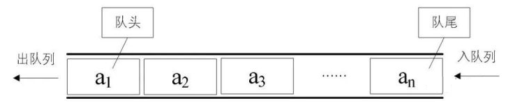

- 消息队列可以简单理解为：**把要传输的数据放在队列中**。
  - 概念一：把数据放到消息队列叫做**生产者（Producer）**
  - 概念二：从消息队列里边取数据叫做**消费者（Consumer）**

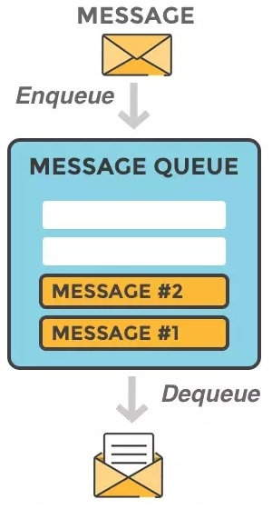

#### 消息队列好处

- 第一点、**系统解耦**

  - 使用 MQ，==A 系统产生一条数据，发送到 MQ== 里面去，哪个系统需要数据自己去 MQ 里面消费。如果新系统需要数据，直接从 MQ 里消费即可；如果某个系统不需要这条数据了，就取消对 MQ 消息的消费即可。

  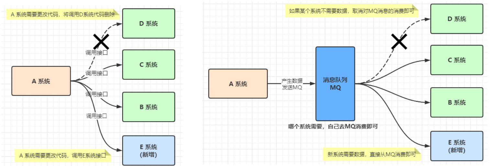

- 第二点、**异步处理**

  - 电商网站中，新的用户注册时，需要将用户的信息保存到数据库中，同时还需要额外发送注册的邮件通知、以及短信注册码给用户。
  - 使用消息队列来进行异步处理，从而实现快速响应。

  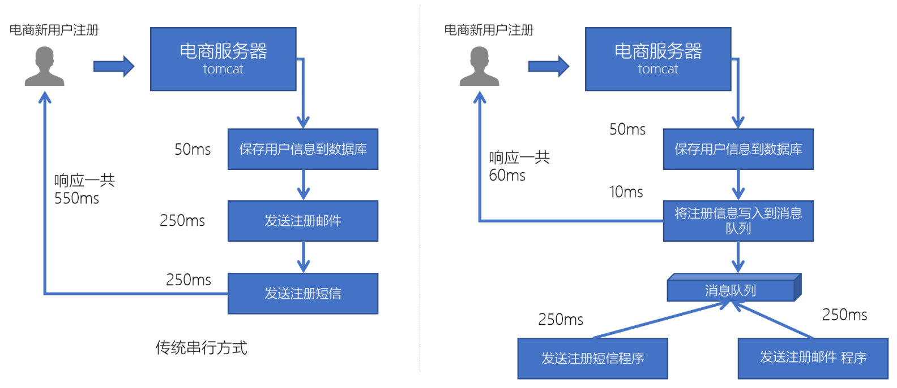

- 第三点、**流量削峰**

  - 电商秒杀活动时，使用消息队列缓冲数据，增大吞吐量

  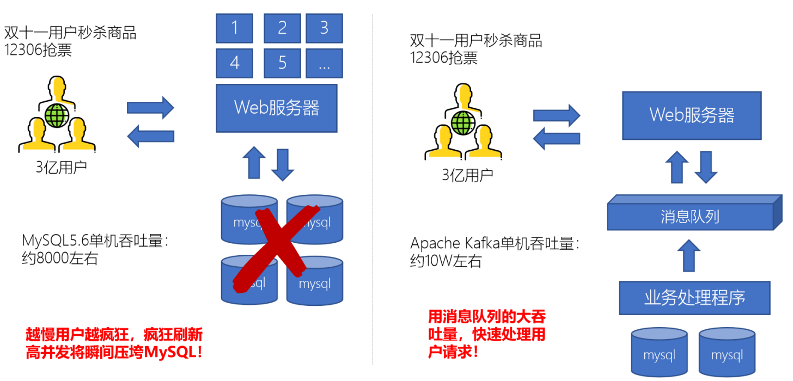

- 第四点、**日志处理**

  - 实时计算场景中将数据缓存到消息队列中，解决大量日志传输的问题。

  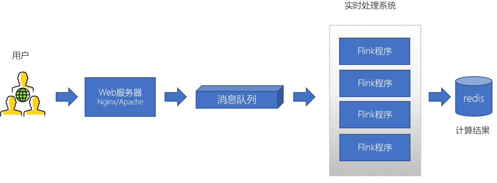

[总结：消息队列MQ用于实现两个系统之间或者两个模块之间传递消息数据时，实现数据缓存。]()

#### 消息传递模式

> 消息队列的两种模式：P2P（Point to Point ：点对点）,Publish/Subscribe（Pub/Sub：发布订阅）

- 消息传递：**点对点模式**

  - 数据只能被一个消费者使用，消费成功以后数据就会被删除，**无法实现消费数据的共享**

  

- 消息传递：订阅发布模式

  - 多个发布者将消息发送到队列，系统将这些消息传递给多个订阅者，类似于微信公众号

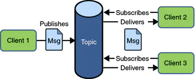

### 2. Kafka功能

Kafka的诞生，是为了**解决Linkedin的数据管道**问题，起初Linkedin采用ActiveMQ来进行数据交换，大约是在2010年前后，那时的ActiveMQ还远远无法满足Linkedin对数据传递系统的要求，经常由于**各种缺陷而导致消息阻塞或者服务无法正常访问**，为了能够解决这个问题，Linkedin决定研发自己的消息传递系统，当时Linkedin的首席架构师jay kreps便开始组织团队进行消息传递系统的研发。

官网：https://kafka.apache.org/

> Kafka是一个**分布式的基于发布/订阅模式的消息队列（Message Queue）**，主要应用于**大数据实时处理**领域。

- **发布订阅**：消息的发布者不会将消息直接发送给特定订阅者，而是**将发布的消息分为不同的类别**，订阅者**只接收感兴趣的消息**。
- Kafka 最新定义：Kafka 是一个开源的**分布式事件流式平台（Event Streaming Platform）**，被数千家公司用于高性能**数据管道、流分析、数据集成和关键人物应用**。

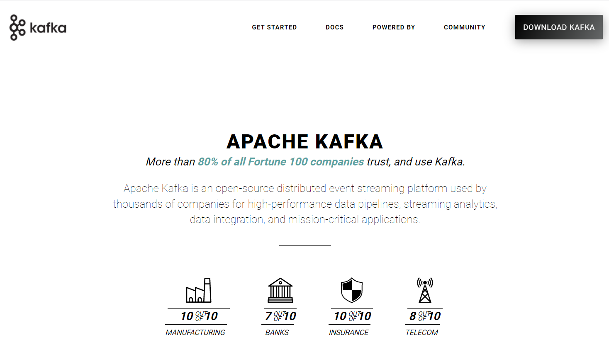

> Apache Kafka 分布式消息队列**特点**

- **高性能**：对数据进行实时读写
- **高并发**：分布式并行读写
  - **高吞吐**：使用分布式磁盘存储
  - **高可靠**：分布式主从架构
  - **高安全性**：数据安全保障机制
- **高灵活性**：根据需求，随意添加生产者和消费者

> Kafka在大数据中专门用于实现**实时的数据**缓冲存储，实现**大数据实时流式计算**。

### 3. 架构组件

> **Kafka中的Producer、Broker、Consumer概念**


- **Broker**：Kafka是一个分布式集群，多台机器构成，每台Kafka的节点就是一个Broker
  - 类比为HDFS中从节点：DataNode

- **Producer**：生产者
  - 负责将数据写入Kafka中，==Kafka写入数据的客户端==
  - Kafka的每条数据格式：`KV`格式，其中**V才是真正写入的数据**，K决定数据写到队列中哪个位置

- **Consumer：消费者**
  - 负责从Kafka中消费数据，==Kafka读取数据的客户端==
  - 消费数据：主要消费的数据是`V`，在实际项目中V的数据类型为`字符串`，往往是`JSON字符串`。

- **Consumer Group**：==**Kafka中必须以消费者组的形式从Kafka中消费数据**==
  - 消费者组（group id）到Kafka消费数据
  - **任何一个消费者必须属于某一个消费者组**
  - 一个消费者组中可以有多个消费者：**多个消费者共同并行消费数据，提高消费性能**
    - **消费者组中多个消费者消费的数据是不一样的**
    - **整个消费者组中所有消费者消费的数据加在一起是一份完整的数据**

### 4. Topic存储

> **Kafka中的Topic、Partition和Replication概念**


- **Topic：数据主题**，用于区分不同的数据，**对数据进行分类**
  - 类似于MySQL中会将数据划分到不同的表：不同的数据存储在不同的表中
  - **一个Topic可以划分多个分区Partition**，每个不同分区存储在不同的Kafka节点上
  - 写入Topic的数据实现分布式存储
  - 生产者写入一条KV结构数据，这条数据写入这个Topic的哪个分区由分区规则来决定
  - 有多种分区规则：不同场景对应的分区规则不一样

- **Partition：数据分区**，用于实现Topic的分布式存储，对Topic的数据进行划分
  - 每个分区存储在不同的Kafka节点Broker上
  - 例如上图中：Topic名称为T1，T1有三个分区：P0、P1、P2
  - 写入Topic：根据一定的规则决定写入哪个具体的分区

- Replication：数据副本，保证数据的安全性

  - Kafka每一个分区都可以有多个副本，类似于HDFS的副本机制，一个块构建多个副本
  - **注意：Kafka中一个分区的副本个数最多只能等于机器的个数**，相同分区的副本不允许放在同一台机器
  - Kafka将一个分区的多个副本，划分为两种角色：Leader副本和Follower副本
    - **Leader副本**：负责对外提供`读写`，可以认为：Master 副本，生产者和消费者只对leader副本进行读写
    - **Follower副本**：与Leader同步数据，如果leader故障，从follower新的leader副本对外提供读写

  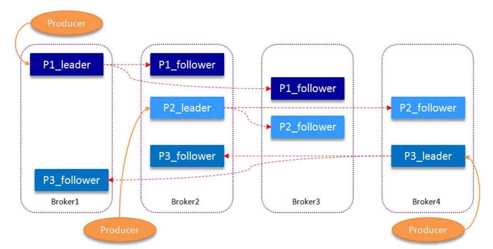

> Kafka 中基本概念：

|     Kafka     | 解释                                                         |        HDFS         |
| :-----------: | :----------------------------------------------------------- | :-----------------: |
|   Producer    | 生产者，写入数据到Kafka的Topic                               |   写入数据客户端    |
|   Consumer    | 消费者，消费Kafka的Topic的Partition数据                      |   读取数据客户端    |
| ConsumerGroup | 消费者组，消费Kafka的Topic                                   |          -          |
|    Broker     | Kafka节点                                                    | NameNode + DataNode |
|     Topic     | 逻辑数据分类的对象，类似于数据库或者表的概念，Topic是分布式的，一个Topic可以有多个分区 |        文件         |
|   Partition   | 分区结构，物理概念，数据按照写入先后顺序写入分区，一个Topic有多个分区，每个分区有多个副本 |        Block        |
|  Replication  | 副本机制，通过副本来保证分区数据安全，相同分区的副本不能再同一台机器 |      副本机制       |

### 5. 集群架构

> Kafka 集群基础架构角色：**Zookeeper 集群**和**Kafka集群**


- **架构角色**
  - Kafka 集群：分布式主从架构，实现消息队列的构建
  - Zookeeper 集群：辅助选举Controller、元数据存储

- **Kafka中的每个角色以及对应的功能**
  - 分布式**主从架构**，节点：Broker，进程：Kafka
  - 主节点：**Kafka** ==Controller==
    - 一种特殊的Broker，从所有Broker中选举出来的
    - 负责普通Broker的工作
    - 负责管理所有从节点：Topic、分区和副本
    - 每次启动集群，会从所有Broker中选举一个Controller，由Zookeeper实现
  - 从节点：**Kafka Broker**
    - 对外提供读写请求
    - 如果Controller故障，会重新从Broker选举一个新的Controller
- **Zookeeper 的功能**
  - 辅助选举Controller节点
  - 存储元数据，比如Brokers信息、topic名称、分区及副本等等

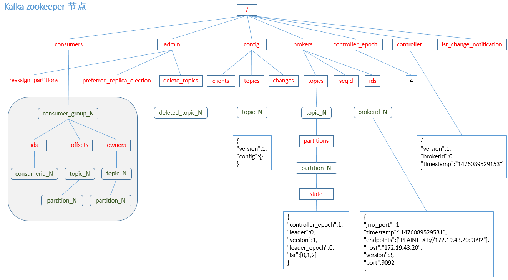

## II. Kafka快速上手

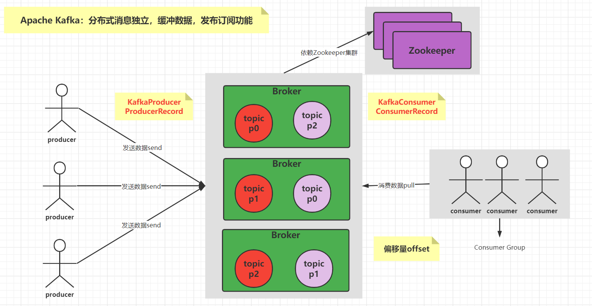

### 1. 安装部署

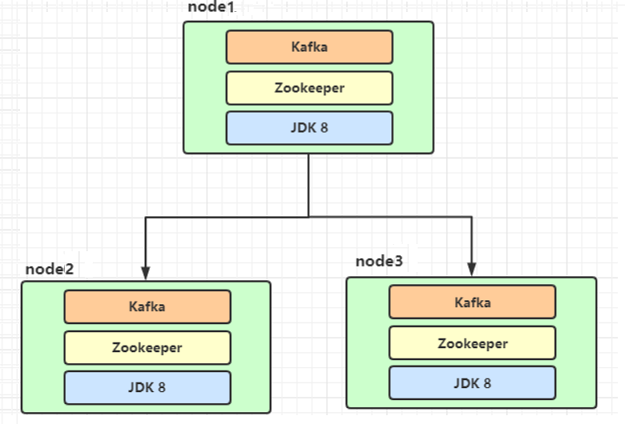

> **目标**：**实现Kafka分布式集群的搭建部署**

- 版本选择：`kafka_2.12-2.4.1.tgz`
  - Kafka：2.4.1
  - Scala：2.12，Kafka是由Scala语言和Java语言开发
  - 下载：http://archive.apache.org/dist/kafka/

- 1、上传解压，在node1操作

  ```shell
  cd /export/software/
  rz
  
  tar -zxvf kafka_2.12-2.4.1.tgz -C /export/server
  
  cd /export/server
  ln -s kafka_2.12-2.4.1 kafka
  ```

  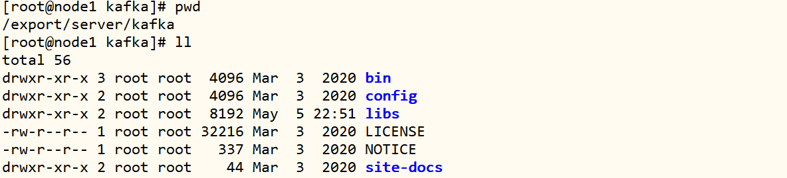

  - `bin`：一般用于存放客户端操作命令脚本
  - `sbin`：一般用于存放集群的启动和关闭的命令脚本，如果没有这个命令，脚本放在bin目录中
  - `config`：配置文件目录
  - `lib`：jar包的存放目录
  - `logs`：一般用于存放服务日志

- 2、创建存储目录

  ```ini
  mkdir -p /export/server/kafka/kafka-logs
  ```

- 3、修改配置

  - 切换到配置文件目录

    ```ini
    cd /export/server/kafka/config
    ```

  - 修改`server.properties`

    ```ini
    vim server.properties
    ```

    ```properties
    #21行：唯一的 服务端id
    broker.id=1
    
    #60行：指定kafka的数据存储的位置
    log.dirs=/export/server/kafka/kafka-logs
    
    #123行：指定zookeeper的地址
    zookeeper.connect=node1.itcast.cn:2181,node2.itcast.cn:2181,node3.itcast.cn:2181/kafka
    
    #在最后添加两个配置，允许删除topic，当前kafkaServer的主机名
    delete.topic.enable=true
    host.name=node1.itcast.cn
    ```

- 4、安装包分发集群

  ```ini
  scp -r /export/server/kafka root@node2.itcast.cn:/export/server/
  scp -r /export/server/kafka root@node3.itcast.cn:/export/server/
  ```

- 5、修改配置

  - node2机器：`server.properties`

  ```properties
  #21行：唯一的 服务端id
  broker.id=2
  
  #最后
  host.name=node2.itcast.cn
  
  ```

  - node3机器：`server.properties`

  ```ini
  #21行：唯一的 服务端id
  broker.id=3
  
  #最后
  host.name=node3.itcast.cn
  ```

- 6、添加环境变量，集群所有机器

  ```shell
  vim /etc/profile
  ```

  ```shell
  #KAFKA_HOME
  export KAFKA_HOME=/export/server/kafka
  export PATH=:$PATH:$KAFKA_HOME/bin
  ```

  ```shell
  source /etc/profile
  ```

- 7、启动Kafka集群，先启动Zookeeper集群

  ```ini
  # 启动ZK集群
  start-zk.sh
  
  # 启动Kafka服务，三台机器
  /export/server/kafka/bin/kafka-server-start.sh -daemon /export/server/kafka/config/server.properties
  ```

  查看三台机器服务

  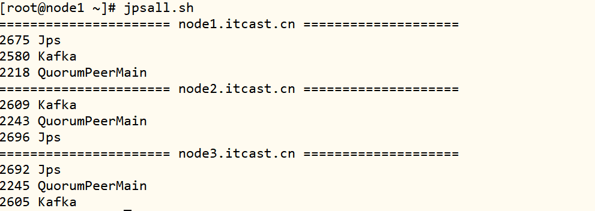

### 2. Topic操作

> **Kafka集群中Topic的管理命令，实现创建Topic及列举Topic**

- Topic管理脚本

  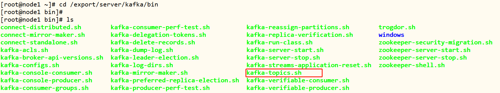

  - 查看用法

    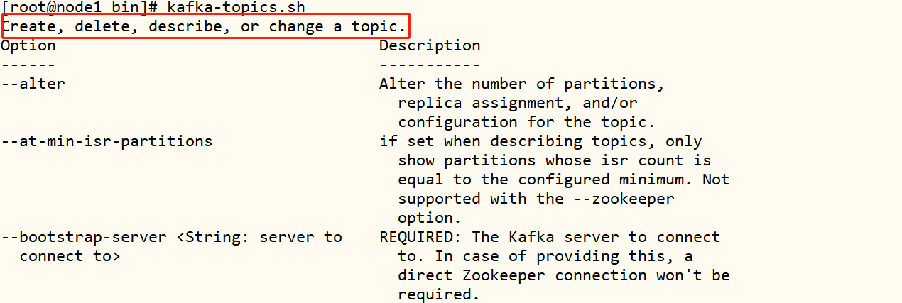

    ```ini
    [root@node1 bin]# kafka-topics.sh 
    Create, delete, describe, or change a topic.
    Option                                   Description                            
    ------                                   -----------                            
    --alter                                  Alter the number of partitions,        
                                               replica assignment, and/or           
                                               configuration for the topic.         
    --at-min-isr-partitions                  if set when describing topics, only    
                                               show partitions whose isr count is   
                                               equal to the configured minimum. Not 
                                               supported with the --zookeeper       
                                               option.                              
    --bootstrap-server <String: server to    REQUIRED: The Kafka server to connect  
      connect to>                              to. In case of providing this, a     
                                               direct Zookeeper connection won't be 
                                               required.                            
    --command-config <String: command        Property file containing configs to be 
      config property file>                    passed to Admin Client. This is used 
                                               only with --bootstrap-server option  
                                               for describing and altering broker   
                                               configs.                             
    --config <String: name=value>            A topic configuration override for the 
                                               topic being created or altered.The   
                                               following is a list of valid         
                                               configurations:                      
                                                    cleanup.policy                        
                                                    compression.type                      
                                                    delete.retention.ms                   
                                                    file.delete.delay.ms                  
                                                    flush.messages                        
                                                    flush.ms                              
                                                    follower.replication.throttled.       
                                               replicas                             
                                                    index.interval.bytes                  
                                                    leader.replication.throttled.replicas 
                                                    max.compaction.lag.ms                 
                                                    max.message.bytes                     
                                                    message.downconversion.enable         
                                                    message.format.version                
                                                    message.timestamp.difference.max.ms   
                                                    message.timestamp.type                
                                                    min.cleanable.dirty.ratio             
                                                    min.compaction.lag.ms                 
                                                    min.insync.replicas                   
                                                    preallocate                           
                                                    retention.bytes                       
                                                    retention.ms                          
                                                    segment.bytes                         
                                                    segment.index.bytes                   
                                                    segment.jitter.ms                     
                                                    segment.ms                            
                                                    unclean.leader.election.enable        
                                             See the Kafka documentation for full   
                                               details on the topic configs.It is   
                                               supported only in combination with --
                                               create if --bootstrap-server option  
                                               is used.                             
    --create                                 Create a new topic.                    
    --delete                                 Delete a topic                         
    --delete-config <String: name>           A topic configuration override to be   
                                               removed for an existing topic (see   
                                               the list of configurations under the 
                                               --config option). Not supported with 
                                               the --bootstrap-server option.       
    --describe                               List details for the given topics.     
    --disable-rack-aware                     Disable rack aware replica assignment  
    --exclude-internal                       exclude internal topics when running   
                                               list or describe command. The        
                                               internal topics will be listed by    
                                               default                              
    --force                                  Suppress console prompts               
    --help                                   Print usage information.               
    --if-exists                              if set when altering or deleting or    
                                               describing topics, the action will   
                                               only execute if the topic exists.    
                                               Not supported with the --bootstrap-  
                                               server option.                       
    --if-not-exists                          if set when creating topics, the       
                                               action will only execute if the      
                                               topic does not already exist. Not    
                                               supported with the --bootstrap-      
                                               server option.                       
    --list                                   List all available topics.             
    --partitions <Integer: # of partitions>  The number of partitions for the topic 
                                               being created or altered (WARNING:   
                                               If partitions are increased for a    
                                               topic that has a key, the partition  
                                               logic or ordering of the messages    
                                               will be affected). If not supplied   
                                               for create, defaults to the cluster  
                                               default.                             
    --replica-assignment <String:            A list of manual partition-to-broker   
      broker_id_for_part1_replica1 :           assignments for the topic being      
      broker_id_for_part1_replica2 ,           created or altered.                  
      broker_id_for_part2_replica1 :                                                
      broker_id_for_part2_replica2 , ...>                                           
    --replication-factor <Integer:           The replication factor for each        
      replication factor>                      partition in the topic being         
                                               created. If not supplied, defaults   
                                               to the cluster default.              
    --topic <String: topic>                  The topic to create, alter, describe   
                                               or delete. It also accepts a regular 
                                               expression, except for --create      
                                               option. Put topic name in double     
                                               quotes and use the '\' prefix to     
                                               escape regular expression symbols; e.
                                               g. "test\.topic".                    
    --topics-with-overrides                  if set when describing topics, only    
                                               show topics that have overridden     
                                               configs                              
    --unavailable-partitions                 if set when describing topics, only    
                                               show partitions whose leader is not  
                                               available                            
    --under-min-isr-partitions               if set when describing topics, only    
                                               show partitions whose isr count is   
                                               less than the configured minimum.    
                                               Not supported with the --zookeeper   
                                               option.                              
    --under-replicated-partitions            if set when describing topics, only    
                                               show under replicated partitions     
    --version                                Display Kafka version.                 
    --zookeeper <String: hosts>              DEPRECATED, The connection string for  
                                               the zookeeper connection in the form 
                                               host:port. Multiple hosts can be     
                                               given to allow fail-over.            
    ```

- 1、创建Topic

  ```ini
  /export/server/kafka/bin/kafka-topics.sh --create \
  --topic test-topic \
  --partitions 3 \
  --replication-factor 2 \
  --bootstrap-server node1.itcast.cn:9092,node2.itcast.cn:9092,node3.itcast.cn:9092
  ```

  - `--create`：创建
  - --topic：指定名称
  - --partitions ：分区个数
  - --replication-factor：分区的副本个数
  - --bootstrap-server：指定Kafka服务端地址
  - `--list`：列举

  

- 2、列举Topic

  ```ini
  /export/server/kafka/bin/kafka-topics.sh --list \
  --bootstrap-server node1.itcast.cn:9092,node2.itcast.cn:9092,node3.itcast.cn:9092
  ```

  

- 3、查看Topic信息

  ```ini
  /export/server/kafka/bin/kafka-topics.sh --describe \
  --topic test-topic  \
  --bootstrap-server node1.itcast.cn:9092,node2.itcast.cn:9092,node3.itcast.cn:9092
  ```

  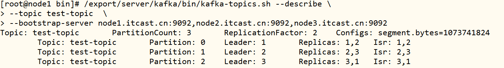

  - 每个分区都有一个唯一的标号：从`0`开始
  - 怎么唯一标识一个分区：**Topic名称+分区编号**
  - Leader：这个分区的Leader副本所在的**Broker id**
  - Replicas：这个分区的所有副本所在的**Broker id**
  - `ISR`：in -sync -replicas，可用副本

- 4、删除Topic

  ```ini
  /export/server/kafka/bin/kafka-topics.sh --delete \
  --topic test-topic  \
  --bootstrap-server node1.itcast.cn:9092,node2.itcast.cn:9092,node3.itcast.cn:9092
  ```

  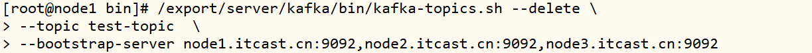

### 3. 生产消费

> 了解命令行如何模拟测试生产者和消费者

- 命令行提供的脚本

  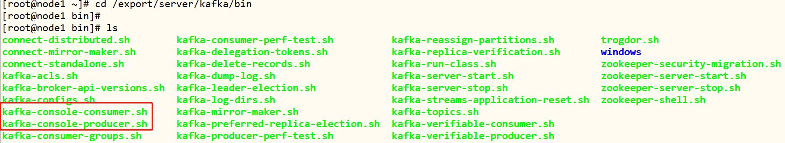

- Console生产者

  ```ini
  /export/server/kafka/bin/kafka-console-producer.sh \
  --topic test-topic \
  --broker-list node1.itcast.cn:9092,node2.itcast.cn:9092,node3.itcast.cn:9092
  ```

- Console消费者

  ```ini
  /export/server/kafka/bin/kafka-console-consumer.sh \
  --topic test-topic \
  --bootstrap-server node1.itcast.cn:9092,node2.itcast.cn:9092,node3.itcast.cn:9092  \
  --from-beginning
  ```

  - `--from-beginning`：从每个分区的最初开始消费，默认从最新的offset进行消费
  - 如果不指定【--from-beginning】，默认从最新位置开始消费

- 生产者发送数据，消费者消费数据

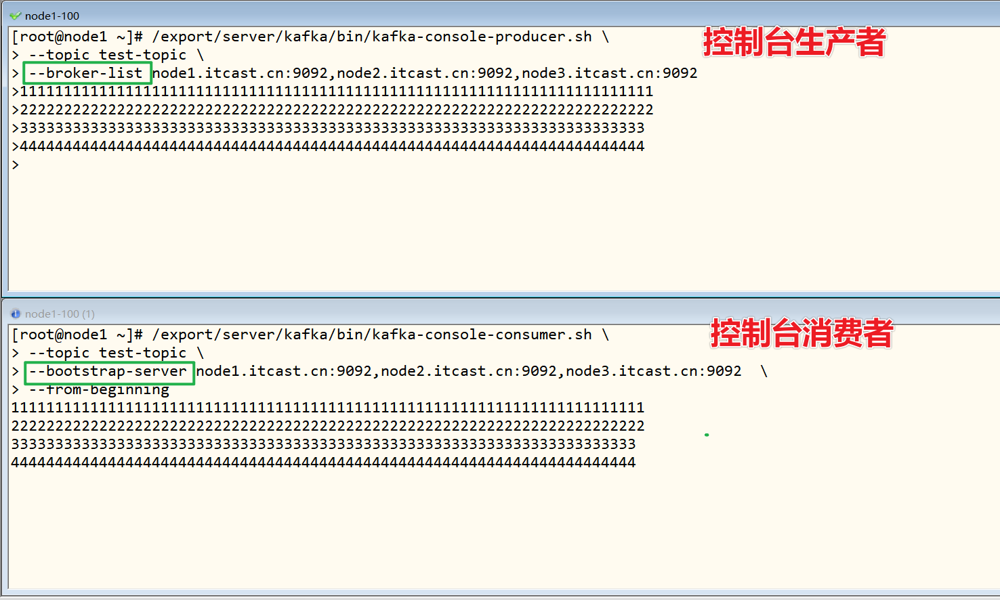

> **了解如何实现Kafka集群的吞吐量及压力测试**

- 创建Topic

  ```ini
  /export/server/kafka/bin/kafka-topics.sh --create \
  --topic logs-data \
  --partitions 3 \
  --replication-factor 2 \
  --bootstrap-server node1.itcast.cn:9092,node2.itcast.cn:9092,node3.itcast.cn:9092
  ```

- 生产测试：`kafka-producer-perf-test.sh`

  ```shell
  /export/server/kafka/bin/kafka-producer-perf-test.sh \
  --topic logs-data \
  --num-records 1000000 \
  --throughput -1 \
  --record-size 1000 \
  --producer-props \
  bootstrap.servers=node1.itcast.cn:9092,node2.itcast.cn:9092,node3.itcast.cn:9092 \
  acks=1
  ```

  - `--num-records`：写入数据的条数
  - `--throughput`：是否做限制，-1表示不限制
  - `--record-size`：每条数据的字节大小

  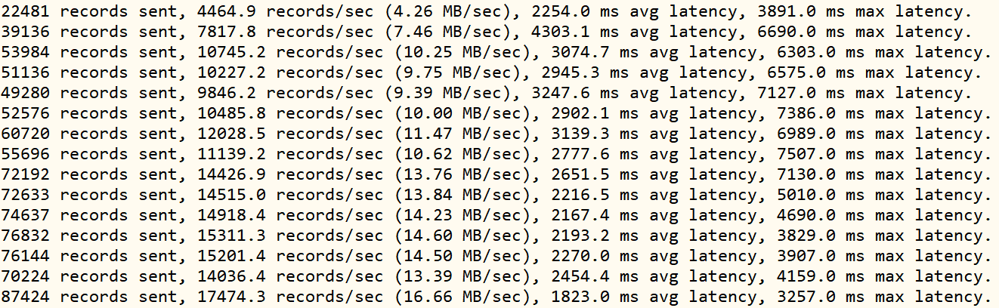

  ```ini
  1000000 records sent,
  12502.344190 records/sec (11.92 MB/sec), 
  2548.20 ms avg latency, 7507.00 ms max latency, 
  2310 ms 50th, 6423 ms 95th, 7252 ms 99th, 7459 ms 99.9th
  ```

- 消费测试

  ```shell
  /export/server/kafka/bin/kafka-consumer-perf-test.sh \
  --topic logs-data \
  --broker-list node1.itcast.cn:9092,node2.itcast.cn:9092,node3.itcast.cn:9092  \
  --fetch-size 1048576 \
  --messages 1000000
  ```

  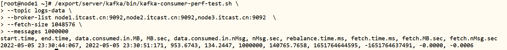

> 工作中一般根据实际的需求来调整参数，测试kafka集群的最高性能，判断是否能满足需求

### 4. Kafka Tool

> **可视化工具Kafka Tool的使用** ：https://www.kafkatool.com/

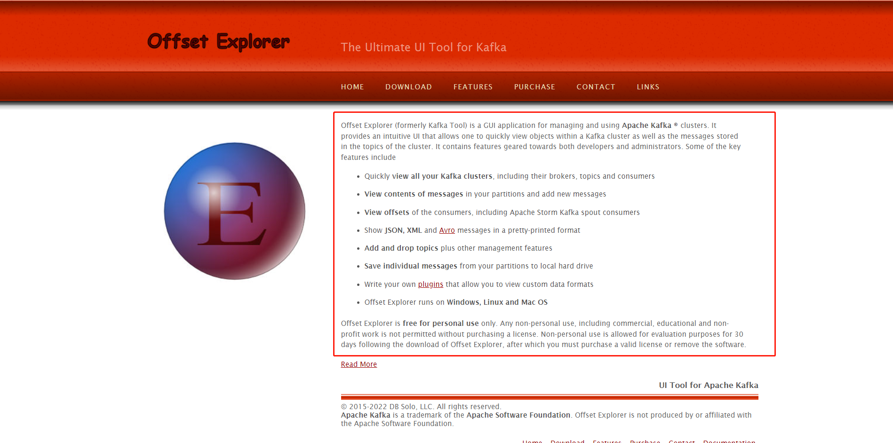

- **安装Kafka Tool：不断下一步即可**

  

- 打开软件工具，添加集群，指定Kafka依赖ZK集群地址

  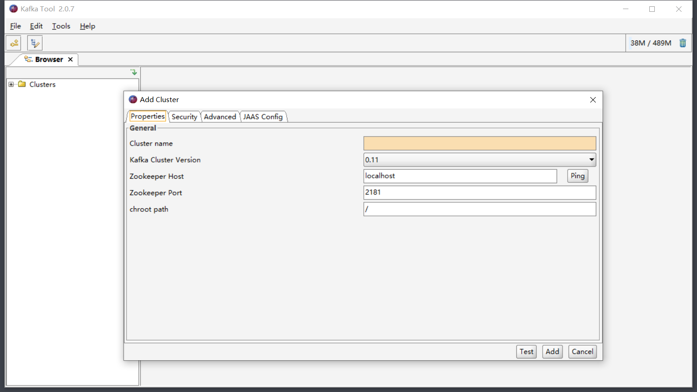

- **构建集群连接：连接Kafka集群**

  

  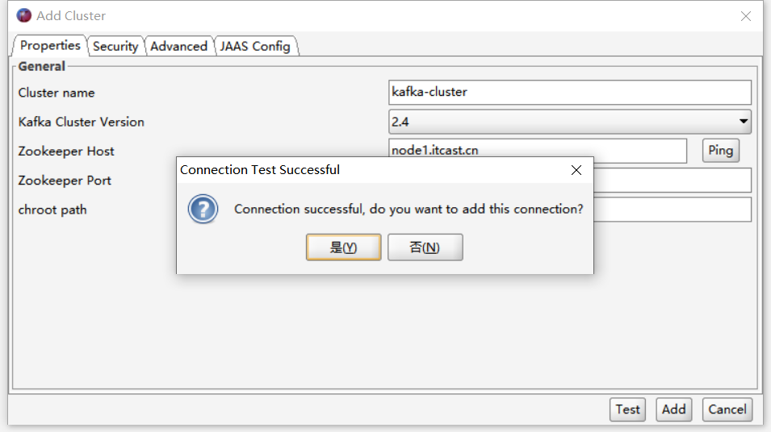

  - 查看集群信息

  

- **查看topic信息**

  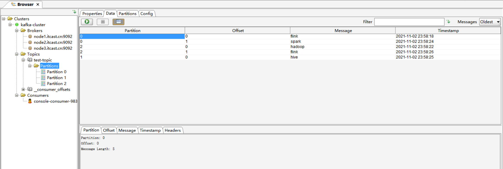

- 设置Message消息显示方式：String 字符串

  - 全局设置

  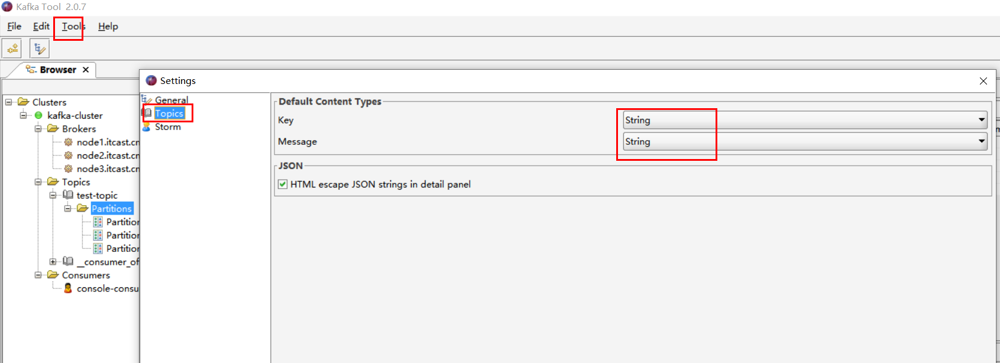

  - topic设置

  

## III. Kafka API开发

### 1. 环境准备

> 从Kafka 0.10版本开始，重构生产者和消费 Java API，使用用户使用时更加简单。

- 生产者Producer：

  - `KafkaProducer`（连接Kafka集群），`ProducerRecord`（每条数据）

  https://kafka.apache.org/24/javadoc/index.html?org/apache/kafka/clients/producer/KafkaProducer.html

- 消费者Consuemr:

  - `KafkaConsumer`(连接Kafka集群)，`ConsumerRecord`（每条消息）

  https://kafka.apache.org/24/javadoc/index.html?org/apache/kafka/clients/consumer/KafkaConsumer.html

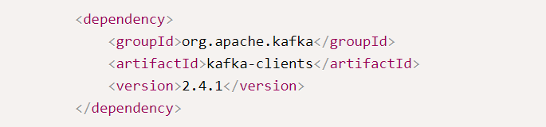

> 创建Maven Module模块，添加依赖

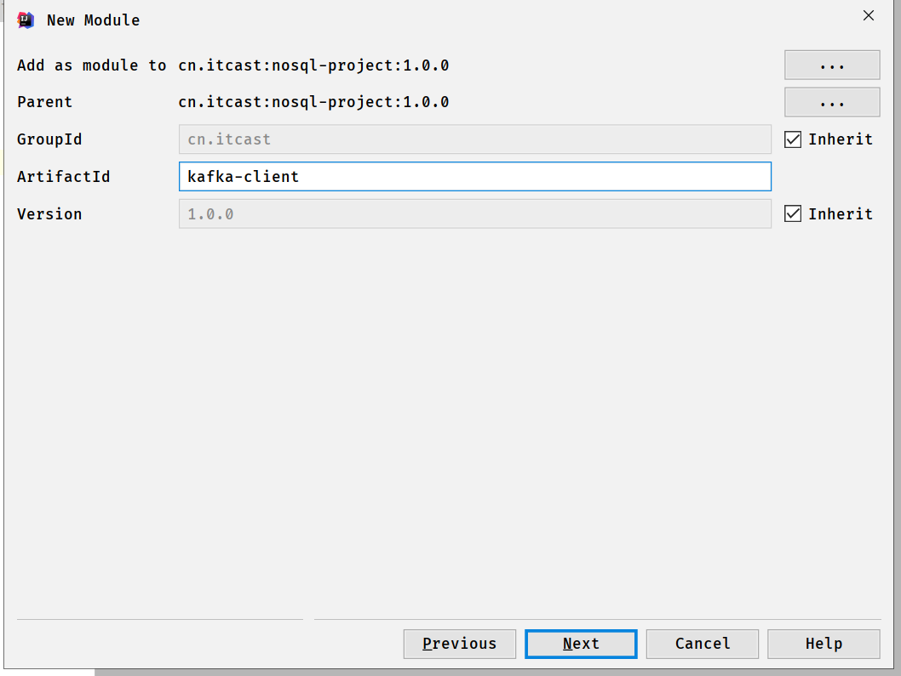

Maven Module模块中pom文件内容

```xml
    <repositories>
        <repository>
            <id>aliyun</id>
            <url>http://maven.aliyun.com/nexus/content/groups/public/</url>
        </repository>
    </repositories>

    <dependencies>
        <!-- Kafka 依赖 -->
        <dependency>
            <groupId>org.apache.kafka</groupId>
            <artifactId>kafka-clients</artifactId>
            <version>2.4.1</version>
        </dependency>
    </dependencies>

    <build>
        <plugins>
            <plugin>
                <groupId>org.apache.maven.plugins</groupId>
                <artifactId>maven-compiler-plugin</artifactId>
                <version>3.0</version>
                <configuration>
                    <source>1.8</source>
                    <target>1.8</target>
                    <encoding>UTF-8</encoding>
                </configuration>
            </plugin>
        </plugins>
    </build>
```

> 创建相关目录结构，按照功能代码进行划分：

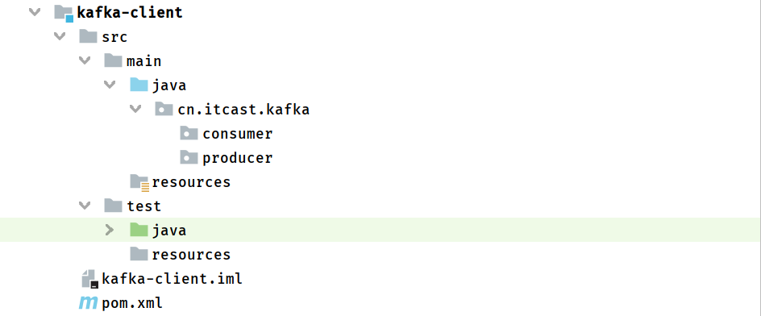

### 2. 生产者API

> **任务：**基于Kafka Producer API将数据写入Kafka Topic。

- **开发步骤**
  - step1：创建`KafkaProducer`连接对象
  - step2：构建`ProducerRecord`记录实例
  - step3：调用KafkaProducer的`send`方法将数据写入Kafka

- KafkaProducer 生产者连接对象，传递参数设置

  - 文档：

    http://kafka.apache.org/24/documentation.html#producerconfigs

  - 重要参数：

    **bootstrap.servers**、**key.serializer**、**value.serializer**及**acks**

  - ProducerRecord记录对象，创建时构造方法

    

  - 案例代码

  ```java
  package cn.itcast.kafka.producer;
  
  import org.apache.kafka.clients.producer.KafkaProducer;
  import org.apache.kafka.clients.producer.ProducerConfig;
  import org.apache.kafka.clients.producer.ProducerRecord;
  
  import java.util.Properties;
  
  /**
   * 使用Java API 开发Kafka 生产者
   */
  public class KafkaWriteTest {
  
  	public static void main(String[] args) {
  		// TODO: 1.构建KafkaProducer连接对象
  		// 1-1. 设置Producer属性
  		Properties props = new Properties();
  		// Kafka Brokers地址信息
  		props.put(ProducerConfig.BOOTSTRAP_SERVERS_CONFIG, "node1.itcast.cn:9092,node2.itcast.cn:9092,node3.itcast.cn:9092");
  		// 写入数据时序列化和反序列化方式
  		props.put(ProducerConfig.KEY_SERIALIZER_CLASS_CONFIG, "org.apache.kafka.common.serialization.StringSerializer");
  		props.put(ProducerConfig.VALUE_SERIALIZER_CLASS_CONFIG, "org.apache.kafka.common.serialization.StringSerializer");
  		// 1-2. 传递配置，创建Producer实例
  		KafkaProducer<String, String> producer = new KafkaProducer<>(props);
  
  		// TODO: 2. 构建ProducerRecord记录实例
  		ProducerRecord<String, String> record = new ProducerRecord<String, String>("test-topic", "hello world");
  
  		// TODO: 3. 调用send方法，发送数据至Topic
  		producer.send(record) ;
  
  		// TODO: 4. 关闭资源
  		producer.close();
  	}
  
  }
  ```

### 3. 消费者API

> **任务：**基于Java API从Kafka中消费数据

- **路径**
  - step1：消费者订阅Topic
  - step2：调用poll方法从Kafka中拉取数据，获取返回值
  - step3：从返回值中输出：Topic、Partition、Offset、Key、Value

- `KafkaConsumer` 消费者连接对象，传递参数设置

  - 文档：

    http://kafka.apache.org/24/documentation.html#consumerconfigs

  - 重要参数：

    **bootstrap.servers**、**key.deserializer**、**value.deserializer**、**group.id**

  - `ConsumerRecord`：

    从topic中获取数据封装，包含topic名称、partitionid、偏移量offset、key和value值等

  - 案例代码

  ```java
  package cn.itcast.kafka.consumer;
  
  import org.apache.kafka.clients.consumer.ConsumerConfig;
  import org.apache.kafka.clients.consumer.ConsumerRecord;
  import org.apache.kafka.clients.consumer.ConsumerRecords;
  import org.apache.kafka.clients.consumer.KafkaConsumer;
  
  import java.time.Duration;
  import java.util.Collections;
  import java.util.Properties;
  
  /**
   * 基于Java API实现Kafka 消费者的构建
   */
  public class KafkaReadTest {
  
  	public static void main(String[] args){
  		// TODO: 1. 构建KafkaConsumer连接对象
  		// 1-1. 构建Consumer配置信息
  		Properties props = new Properties();
  		// 指定服务端地址
  		props.setProperty(ConsumerConfig.BOOTSTRAP_SERVERS_CONFIG, "node1.itcast.cn:9092,node2.itcast.cn:9092,node3.itcast.cn:9092");
  		// 指定当前消费者属于哪个组
  		props.setProperty(ConsumerConfig.GROUP_ID_CONFIG, "gid-10001");
  		// 读取数据对KV进行反序列化
  		props.setProperty(ConsumerConfig.KEY_DESERIALIZER_CLASS_CONFIG, "org.apache.kafka.common.serialization.StringDeserializer");
  		props.setProperty(ConsumerConfig.VALUE_DESERIALIZER_CLASS_CONFIG, "org.apache.kafka.common.serialization.StringDeserializer");
  		// 1-2. 构建消费者对象
  		KafkaConsumer<String, String> consumer = new KafkaConsumer<>(props);
  
  		// TODO: 2. 消费数据
  		// 2-1. 设置订阅topic
  		consumer.subscribe(Collections.singletonList("test-topic"));
  		// 2-2. 拉取数据
  		while (true) {
  			// 拉取订阅topic中数据，设置超时时间
  			ConsumerRecords<String, String> records = consumer.poll(Duration.ofMillis(100));
  			// 循环遍历拉取的数据
  			for (ConsumerRecord<String, String> record : records) {
  				String topic = record.topic();
  				int part = record.partition();
  				String key = record.key();
  				String value = record.value();
  				//模拟处理：输出
  				System.out.println(topic + "\t" + part + "\t" + key + "\t" + value);
  			}
  		}
  	}
  
  }
  ```

## 附录

### 1. Kafka启停脚本

> 编写Shell脚本，Kafka集群启动和停止：

- 启动脚本：`start-kafka.sh`

  ```shell
  vim /export/server/kafka/bin/start-kafka.sh
  ```

  ```shell
  #!/bin/bash
  KAFKA_HOME=/export/server/kafka
  
  for number in {1..3}
  do
          host=node${number}.itcast.cn
          /usr/bin/ssh ${host} "source /etc/profile; ${KAFKA_HOME}/bin/kafka-server-start.sh -daemon ${KAFKA_HOME}/config/server.properties"
          echo "${host} starting..............................."
  done
  ```

  ```ini
  chmod u+x /export/server/kafka/bin/start-kafka.sh
  ```

- 关闭脚本：`stop-kafka.sh`

  ```shell
  vim /export/server/kafka/bin/stop-kafka.sh
  ```

  ```shell
  #!/bin/bash
  KAFKA_HOME=/export/server/kafka
  
  for number in {1..3}
  do
  	host=node${number}.itcast.cn
  	/usr/bin/ssh ${host} "source /etc/profile; ${KAFKA_HOME}/bin/kafka-server-stop.sh"
  	echo "${host} stoping................................"
  done
  ```

  ```shell
  chmod u+x /export/server/kafka/bin/stop-kafka.sh
  ```

### 2. Kafka Maven依赖

```xml
    <repositories>
        <repository>
            <id>aliyun</id>
            <url>http://maven.aliyun.com/nexus/content/groups/public/</url>
        </repository>
    </repositories>

    <dependencies>
        <!-- Kafka的依赖 -->
        <dependency>
            <groupId>org.apache.kafka</groupId>
            <artifactId>kafka-clients</artifactId>
            <version>2.4.1</version>
        </dependency>
    </dependencies>

    <build>
        <plugins>
            <plugin>
                <groupId>org.apache.maven.plugins</groupId>
                <artifactId>maven-compiler-plugin</artifactId>
                <version>3.0</version>
                <configuration>
                    <source>1.8</source>
                    <target>1.8</target>
                    <encoding>UTF-8</encoding>
                </configuration>
            </plugin>
        </plugins>
    </build>
```


