# Kafka存储原理, 生产者与消费者

## I. Kafka存储原理

### 1. 存储结构

> Apache Kafka 集群架构：

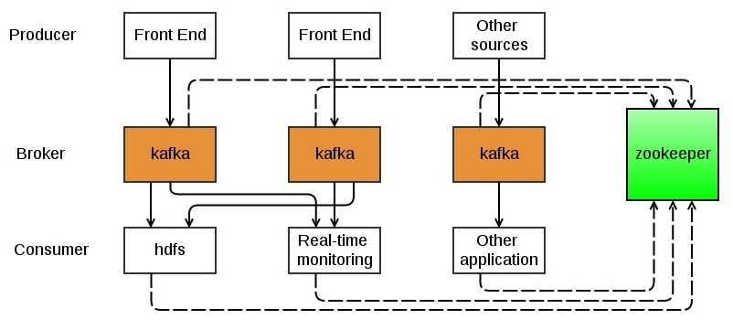

- Broker：物理存储节点，用于存储Kafka中Topic队列的每个分区数据
- Producer：生产者，向Topic队列中写入数据
- Consumer：消费者，从Topic队列中读取数据
- Topic：缓冲队列，用于区分不同数据的的存储
- Partition：Topic 对应子队列，一个topic可以设置为多个partition
  - 每个分区存储在Broker节点
  - 名称构成：**Topic名称+partition分区编号**

> Producer把日志信息推送（push）到Broker节点上，然后Consumer（可以是写入到hdfs或者其他的一些应用）再从Broker拉取（pull）信息。

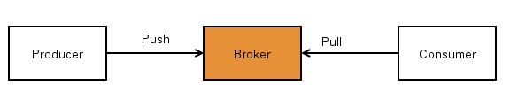

> 每个topic又可分为几个不同的partition，每一个partition实际上都是一个有序的，不可变的消息序列，producer发送到broker的消息会写入到相应的partition目录下，每个partition都会有一个有序的id（`offset`），这个offset确定这个消息在partition中的具体位置。


> 每个分区partition存储时，有多个**segment** 文件组成：

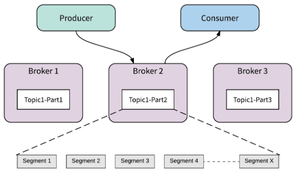

- Segment：分区段，每个分区的数据存储在1个或者多个Segment中，每个Segment由一对文件组成
  - `.log`：数据文件，以log日志形式存储
  - `.index`：索引文件，方便快速查询检索
  - `.timeindex`：时间索引文件

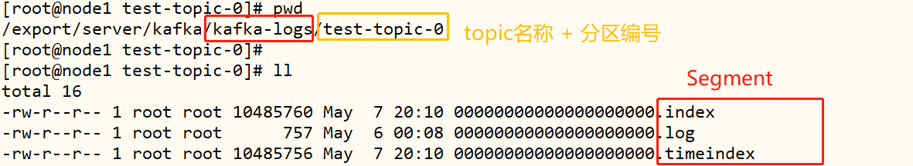

> 总结：Kafka中每个队列Topic，分为多个分区Partition，每个分区数据存储时有多个Segment。

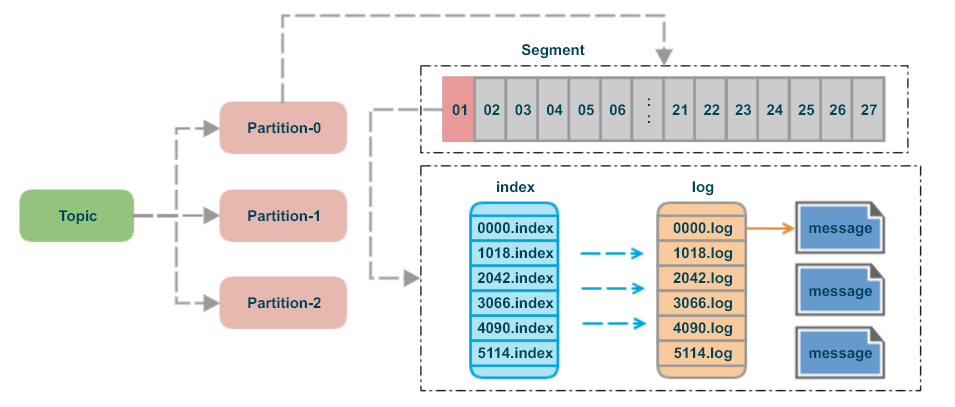

### 2. 写入流程

> **生产者Producer向Topic队列中发送数据【写入流程】：**

- **step1**：生产者生产每一条数据，将数据**放入一个batch批次**中，如果batch满了或者达到一定的时间，提交写入请求
- 批次大小：`batch.size`
  - 发送消息前等待时间：`linger.ms`

- **step2**：生产者根据规则确定写入分区Partition，获取对应的元数据，将请求提交给leader副本所在的Broker

  - 一个Topic的分区Partition会有多个副本，**只向写leader副本**

  - 从元数据中获取当前这个分区对应的leader副本的位置，提交写入请求

  - Kafka 元数据存储在ZK中

    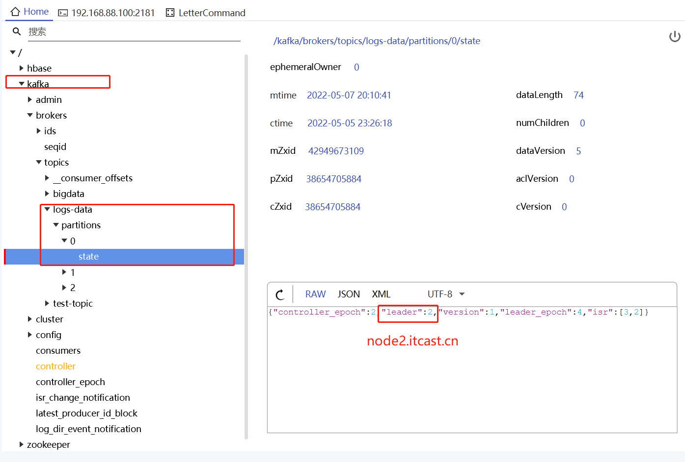

- **step3**：数据先写入Broker的**PageCache【操作系统级别内存】**

  - Kafka使用**内存机制**来实现数据的快速的读写
  - 选用了操作系统自带的缓存区域：`PageCache`
  - ==由操作系统来管理所有内存，即使Kafka Broker故障，数据依旧存在PageCache中==

- **step4**：操作系统后台，自动将**页缓存PageCache**中的数据SYNC同步到磁盘文件中：**最新Segment的中.log**

  - Kafka通过操作系统内存刷新调用机制来实现：内存存储容量 + 时间
  - **顺序写磁盘**：不断将每一条数据追加到.log文件中

- **step5**：其他的Follower 副本到Leader 副本中同步数据

### 3. 读取流程

> Kafka中队列Topic每个分区Partition数据存储在磁盘上，分为很多Segment片段，包含数据文件和索引数据。
>
> - `.log`：存储真正的数据
> - `.index`：存储对应的.log文件的索引

- **Segment的划分规则**：满足任何一个条件都会划分segment

  - 按照时间周期生成

    ```properties
    #如果达到7天，重新生成一个新的Segment
    log.roll.hours = 168
    ```

  - 按照文件大小生成

    ```properties
    #如果一个Segment存储达到1G，就构建一个新的Segment
    log.segment.bytes = 1073741824  
    ```

- **Segment文件的命名规则**

  - 以**当前文件存储的最小offset**来命名的

    ```
    00000000000000000000.log			offset : 0 ~ 2344
    00000000000000000000.index
    
    00000000000000002345.log			offset : 2345 ~ 6788
    00000000000000002345.index
    
    00000000000000006789.log			offset : 6789 ~
    00000000000000006789.index
    ```

- **索引内容**

  - 第一列：此条数据在`.log`文件中的位置，编号（序号），从1开始

  - 第二列：此条数据在`.log`文件中的物理偏移量，从0开始

    ```
    文件中的第几条,数据在这个文件中的物理位置
    1,0				--表示log文件中的第1条，在文件中的位置是第0个字节开始
    
    3,497			--表示这个文件中的第3条，在文件中的位置是第497个字节开始
    ```

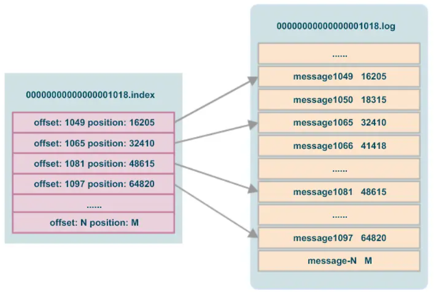

- 什么时候生成一条索引？

  - `.log`日志文件中数据每隔多久在`.index`文件添加一条索引

  ```properties
  #.log文件每增加4096字节，在.index中增加一条索引
  log.index.interval.bytes=4096
  ```

> **消费者Consumer从Topic队列中拉取数据【读取流程】：**

- **step1**：消费者根据**Topic、Partition、Offset**提交给Kafka请求读取数据
- **step2**：Kafka根据元数据信息，找到对应分区Partition对应的Leader副本节点
- **step3**：请求Leader副本所在的Broker，**先读PageCache**，通过**零拷贝机制**【Zero Copy】读取PageCache
  - 实现零磁盘读写
  - 直接将内存数据发送到网络端口，实现传输
- **step4**：如果PageCache中没有，读取Segment文件段，先根据offset找到要读取的Segment
  - 先根据offset和segment文件段名称定位这个offset在哪个segment文件段中
- **step5**：将.log文件对应的.index文件加载到内存中，根据.index中索引的信息找到Offset在.log文件中的最近位置
- **step6**：读取.log，根据索引读取对应Offset的数据

> 面试题：向Kafka中写入数据和读取数据，为什么很快？

- Kafka为什么写入很快？
  - [PageCahce + 顺序写]()
- Kafka为什么读取和快？
  - [PageCache + 零拷贝]()
  - [index索引机制 + offset]()

知乎文档：https://zhuanlan.zhihu.com/p/183808742

### 4. 数据清理

> Kafka消息队列Topic主要用于数据缓存，不需要永久性的存储数据，如何将过期数据进行清理？

- **属性配置**

  ```properties
  #开启清理
  log.cleaner.enable = true
  #清理规则
  log.cleanup.policy = delete | compact
  ```

- **清理规则：delete**

  - **基于存活时间规则：**

    ```properties
    log.retention.ms
    log.retention.minutes
    log.retention.hours=168/7天
    ```

  - **基于文件大小规则**

    ```properties
    #删除文件阈值，如果整个数据文件大小，超过阈值的一个segment大小，将会删除最老的segment,-1表示不使用这种规则
    log.retention.bytes = -1
    ```

  - **基于offset消费规则**

    - 功能：将明确已经消费的offset的数据删除

    - 如何判断已经消费到什么位置

      - step1：编写一个文件`offset.json`

        ```json
        {
          "partitions":[
             {"topic": "bigdata", "partition": 0,"offset": 2000},
             {"topic": "bigdata", "partition": 1,"offset": 2000}
           ],
           "version":1
        }
        ```

      - step2：指定标记这个位置

        ```shell
        kafka-delete-records.sh \
        --bootstrap-server node1.itcast.cn:9092,node2.itcast.cn:9092,node3.itcast.cn:9092 \
        --offset-json-file offset.json 
        ```

- **清理规则：compact**

  - 也称为压缩，==将重复的更新数据的老版本删除，保留新版本，要求每条数据必须要有Key，根据Key来判断是否重复==

  

### 5. 分区副本概念: AR, ISR, OSR

> **问题**：Kafka中的分区数据如何保证数据安全？

- **分区副本机制**：每个kafka中分区都可以构建多个副本，相同分区的副本存储在不同的节点上

  - 为了**保证数据安全和写的性能**：分区有多个副本角色
  - leader副本：对外提供==读写数据==
  - follower副本：==与Leader同步数据==，如果leader故障，选举一个新的leader
  - 选举leader副本：Kafka主节点Controller实现

  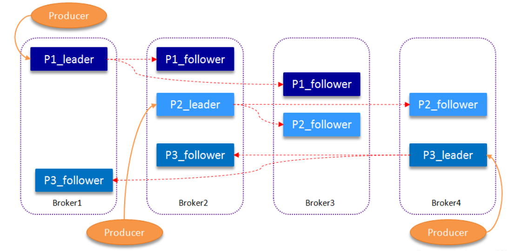

- **AR：All - Replicas**（`Assigned Replicas`）

  - 所有副本：**一个分区在所有节点上的副本**

    ```ini
    Partition: 0   Replicas: 1,0 
    ```

- **ISR：In - Sync - Replicas**

  - ==可用副本==：所有正在与Leader同步的Follower副本

    ```ini
    Partition: 0    Leader: 1       Replicas: 1,0   Isr: 1,0
    ```

  - 列表中：按照优先级排列【Controller根据副本同步状态以及Broker健康状态】，越靠前越会成为leader

  - 如果leader故障，是从ISR列表中选择新的leader

- **OSR：Out - Sync  - Replicas**

  - ==不可用副本==：与Leader副本的同步差距很大，成为一个OSR列表的不可用副本

  - 原因：**网路故障等外部环境因素，某个副本与Leader副本的数据差异性很大**

  - 判断是否是一个OSR副本？

    - 0.9之前：时间和数据差异

      ```ini
      replica.lag.time.max.ms = 10000   # 可用副本的同步超时时间
      replica.lag.max.messages = 4000   # 可用副本的同步记录差，该参数在0.9以后被删除
      ```

    - 0.9以后：只按照时间来判断

      ```ini
      replica.lag.time.max.ms = 10000   # 可用副本的同步超时时间
      ```

> **小结**：Kafka中的分区数据如何保证数据安全：[分区副本机制]()

```ini
AR：所有副本
ISR：可用副本
OSR：不可用副本
AR = ISR + OSR
```

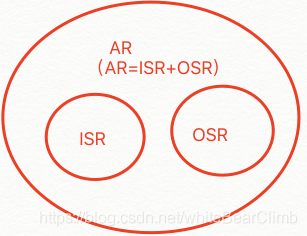

### 6. 数据同步概念: HW, LEO, LSO

> **Topic队列分区Partition副本同步过中的概念：HW、LEO和LSO。**

- 什么是HW、LEO？

  ```ini
  # HW：High Watermark的缩写，俗称高水位
  	标识一个特定的消息偏移量（offset），消费者只能拉取到这个offset之前的消息。
  	HW = 当前这个分区所有副本同步的最低位置 + 1
  		消费者能消费到的最大位置
  
  
  # LEO：Log End Offset 缩写
  	标识当前日志文件中下一条待写入消息的offset
  	LEO = 当前每个副本已经写入数据的最新位置 + 1
  
  ```

  

  ```ini
  # 假设topic 分区有3个副本
  	Leader：0 1 2 3 4 5 6 7 8 
  		LEO：9
  	Follower1: 0  1 2  3 4 5
  		LEO：6
  	Follower2：0  1  2  3  4  5 6
  		LEO = 7
  	HW = 6
  	
  
  # 分区HW高水位 =  所有副本中LEO最小值
      low_watermark：最低消费的offset
      high_watermark：最高消费的offset
  ```

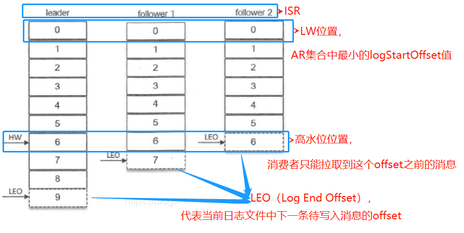

- **数据写入Leader及同步过程**

  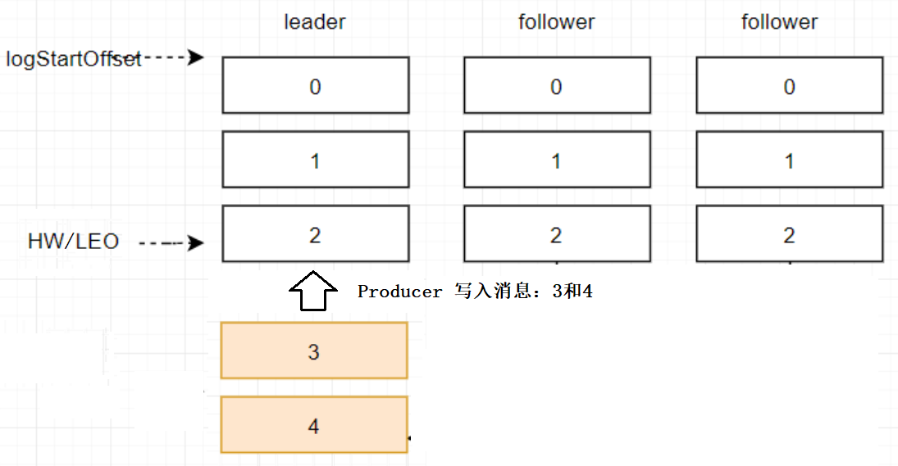

- step1、数据写入分区的Leader副本


```ini
leader：LEO = 5 
follower1：LEO = 3
follower2：LEO = 3
```

- step2：Follower到Leader副本中同步数据

  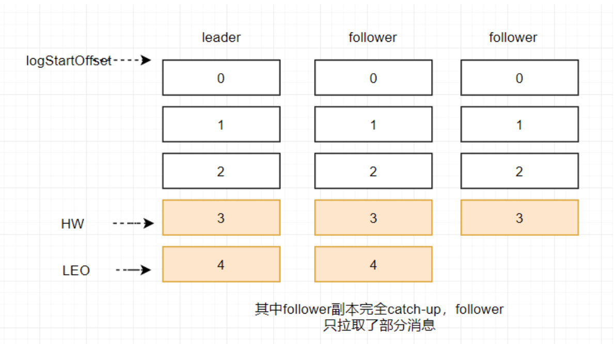

```ini
  leader：LEO = 5 
  follower1：LEO = 5
  follower2：LEO = 4
```

- step3：所有的副本都成功写入了消息3和消息4，整个分区的HW和LEO都变为5，因此消费者可以消费到offset为4的消息。

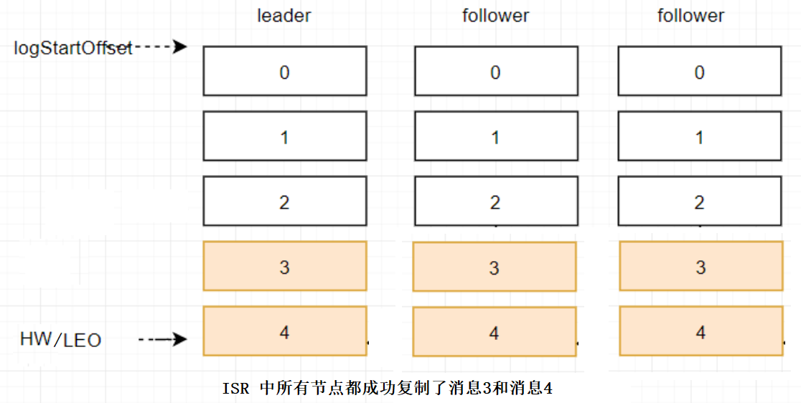

```ini
leader：LEO = 5 
follower1：LEO = 5
follower2：LEO = 5
  
HW = LEO = 5
```

### 7. 可视化工具: Kafka Eagle

> **Kafka Eagle 监控工具**：可以管理监控kafka集群，面板可视化，管理Kafka主题（包含查看、删除、创建等）、消费者组合消费者实例监控、消息阻塞告警、Kafka集群健康状态查看等，告警功能，同时支持邮件、微信、钉钉告警通知。

```ini
# 官网：
	https://www.kafka-eagle.org/
# 文档：
	https://www.kafka-eagle.org/articles/docs/documentation.html
# 下载：
	http://download.kafka-eagle.org/
```

- 1、下载解压，在node3集群

  ```shell
  cd /export/software/
  rz
  
  tar -zxvf kafka-eagle-web-1.4.6-bin.tar.gz -C /export/server/
  cd /export/server/kafka-eagle-web-1.4.6
  ```

- 2、准备数据库：存储eagle的元数据，在Mysql中创建一个数据库

  ```ini
  [root@node1 ~]# mysql -uroot -p123456
  ```

  ```sql
  CREATE DATABASE eagle;
  ```

- 3、修改配置文件：

  ```shell
  cd /export/server/kafka-eagle-web-1.4.6/conf/
  vim  system-config.properties
  ```

  ```properties
  ######################################
  # multi zookeeper & kafka cluster list
  ######################################
  kafka.eagle.zk.cluster.alias=cluster1
  node1.itcast.cn:2181,node2.itcast.cn:2181,node3.itcast.cn:2181/kafka
  
  ######################################
  # broker size online list
  ######################################
  cluster1.kafka.eagle.broker.size=20
  
  ######################################
  # zk client thread limit
  ######################################
  kafka.zk.limit.size=25
  
  ######################################
  # kafka eagle webui port
  ######################################
  kafka.eagle.webui.port=8048
  
  ######################################
  # kafka offset storage
  ######################################
  cluster1.kafka.eagle.offset.storage=kafka
  cluster2.kafka.eagle.offset.storage=zk
  
  ######################################
  # kafka metrics, 30 days by default
  ######################################
  kafka.eagle.metrics.charts=true
  kafka.eagle.metrics.retain=30
  
  
  ######################################
  # kafka sql topic records max
  ######################################
  kafka.eagle.sql.topic.records.max=5000
  kafka.eagle.sql.fix.error=false
  
  ######################################
  # delete kafka topic token
  ######################################
  kafka.eagle.topic.token=keadmin
  
  ######################################
  # kafka sasl authenticate
  ######################################
  cluster1.kafka.eagle.sasl.enable=false
  cluster1.kafka.eagle.sasl.protocol=SASL_PLAINTEXT
  cluster1.kafka.eagle.sasl.mechanism=SCRAM-SHA-256
  cluster1.kafka.eagle.sasl.jaas.config=org.apache.kafka.common.security.scram.ScramLoginModule required username="kafka" password="kafka-eagle";
  cluster1.kafka.eagle.sasl.client.id=
  cluster1.kafka.eagle.sasl.cgroup.enable=false
  cluster1.kafka.eagle.sasl.cgroup.topics=
  
  ######################################
  # kafka mysql jdbc driver address
  ######################################
  kafka.eagle.driver=com.mysql.jdbc.Driver
  kafka.eagle.url=jdbc:mysql://node1.itcast.cn:3306/eagle?useUnicode=true&characterEncoding=UTF-8&zeroDateTimeBehavior=convertToNull
  kafka.eagle.username=root
  kafka.eagle.password=123456
  ```

- 4、配置环境变量

  ```shell
  vim /etc/profile
  ```

  ```ini
  # KE_HOME
  export KE_HOME=/export/server/kafka-eagle-web-1.4.6
  export PATH=$PATH:$KE_HOME/bin
  ```

  ```ini
  source /etc/profile
  ```

- 5、添加执行权限

  ```shell
  chmod u+x /export/server/kafka-eagle-web-1.4.6/bin/ke.sh
  ```

- 6、启动服务

  ```ini
  /export/server/kafka-eagle-web-1.4.6/bin/ke.sh start
  ```

  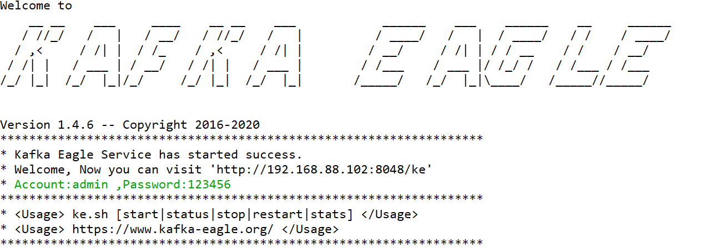

- 7、登陆

  ```ini
  # 网页：
  	http://node3.itcast.cn:8048/ke
  # 用户名：
  	admin
  # 密码：
  	123456
  ```

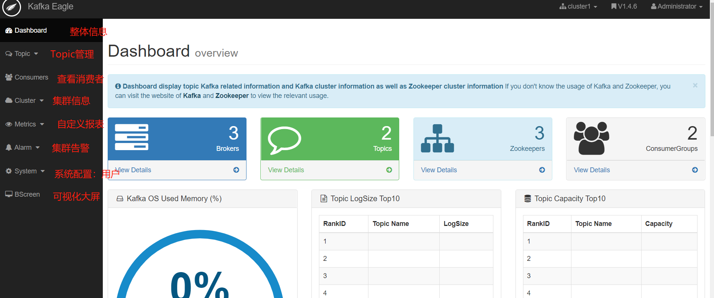

- 8、Kafka Eagle使用

  - 监控Kafka集群

    

    

  - 监控Zookeeper集群

    

    

  - 监控Topic

    

    

    

    

  - **查看数据积压**

    - 现象：消费跟不上生产速度，导致处理的延迟
    - **原因**
      - 消费者组的并发能力不够
    - 消费者处理失败

- 网络故障，导致数据传输较慢

- 解决

  - 提高消费者组中消费者的并行度

  - 分析处理失败的原因

  - 找到网络故障的原因

  - 查看监控

    

    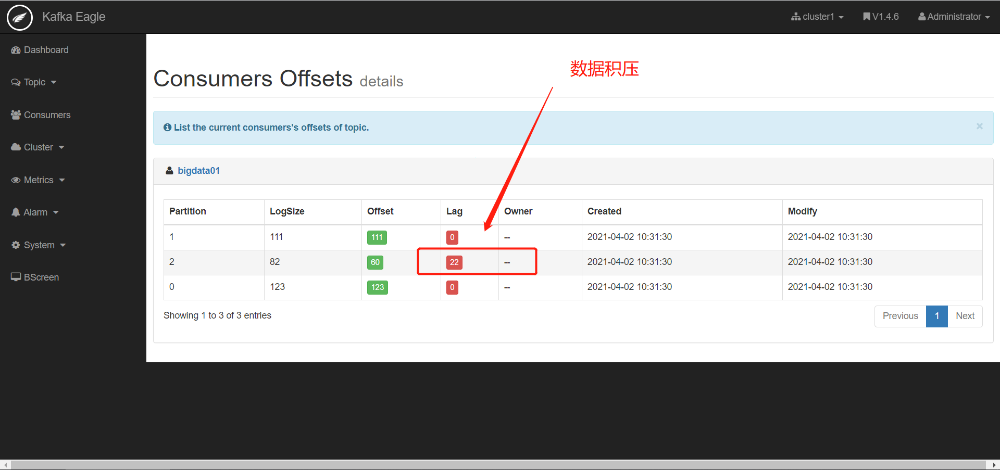

- 检查集群状态情况报表

  

## II. Kafka Producer

### 1. ACK机制

> **ack机制**：producer发送消息的确认机制，会影响到kafka的消息吞吐量和安全可靠性。


- 参数：`ack`，数据传输的**确认码**，用于==定义生产者如何将数据写入Kafka==
  - `0`：生产者发送一条数据写入Kafka，不管Kafka有没有写入这条数据，都直接发送下一条【**快，不安全，不用的**】
  - `1`：中和性方案，生产者发送一条数据写入Kafka，Kafka将这条数据写入对应分区Leader副本，就返回一个ack，生产者收到ack，发送下一条【**性能和安全性之间做了权衡**】
  - `all/-1`：生产者发送一条数据写入Kafka，Kafka将这条数据写入对应分区Leader副本，并且等待所有Follower同步成功，就返回一个ack，生产者收到ack，发送下一条【**安全，慢**】
  - [如果ack为-1或者为all，生产者没有收到ack，就认为数据丢失，重新发送这条数据]()

```Java
package cn.itcast.kafka.producer;

import org.apache.kafka.clients.producer.KafkaProducer;
import org.apache.kafka.clients.producer.ProducerConfig;
import org.apache.kafka.clients.producer.ProducerRecord;

import java.util.Properties;

/**
 * 使用Java API开发Kafka 生产者，发送数据到Topic队列
 */
public class KafkaWriteAckTest {

	public static void main(String[] args) {
		// TODO: 1. 构建KafkaProducer对象
		Properties props = new Properties() ;
		// Kafka Brokers地址
		props.put(ProducerConfig.BOOTSTRAP_SERVERS_CONFIG, "node1.itcast.cn:9092,node2.itcast.cn:9092,node3.itcast.cn:9092") ;
		// 写入数据时Key和Value类型
		props.put(ProducerConfig.KEY_SERIALIZER_CLASS_CONFIG, "org.apache.kafka.common.serialization.StringSerializer") ;
		props.put(ProducerConfig.VALUE_SERIALIZER_CLASS_CONFIG, "org.apache.kafka.common.serialization.StringSerializer") ;
		// TODO: 设置数据发送确认机制ack
		props.put(ProducerConfig.ACKS_CONFIG, "-1") ;
		// 传递属性，创建对象
		KafkaProducer<String, String> kafkaProducer = new KafkaProducer<String, String>(props) ;

		// TODO: 2. 构建ProducerRecord实例，封装数据
		ProducerRecord<String, String> producerRecord = new ProducerRecord<>("test-topic", "hello world");

		// TODO: 3. 调用send方法，发送数据至Topic
		kafkaProducer.send(producerRecord);

		// TODO: 4. 关闭资源
		kafkaProducer.close();
	}

}
```

> **面试题**：Kafka的生产者如何保证生产数据不丢失的机制原理：**ACK + 重试机制**

- 第一点：**ACK 机制**

  - [生产者生产数据写入kafka，等待kafka返回ack确认，收到ack，生产者发送下一条]()
  - **0**：不等待ack，直接发送下一条
    - 优点：快
    - 缺点：数据易丢失
  - **1**：生产者将数据写入Kafka，Kafka等待这个分区Leader副本，返回ack，发送下一条
    - 优点：性能和安全做了中和的选项
    - 缺点：依旧存在一定概率的数据丢失的情况
  - **all**：生产者将数据写入Kafka，Kafka等待这个分区所有ISR副本同步成功，返回ack，发送下一条
    - 优点：安全
    - 缺点：性能比较差
    - 问题：如果ISR中只有leader一个，leader写入成功，直接返回，leader故障数据丢失怎么办？
    - 解决：搭配`min.insync.replicas`来使用，表示最少要有几个ISR的副本

- 第二点：**重试机制**

  ```ini
  retries = 0 发送失败的重试次数
  ```

  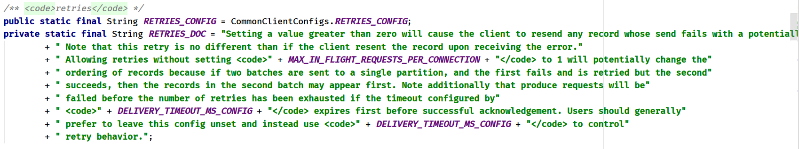

### 2. 分区规则

> **问题**：当Producer生产者向Topic队列中发送数据时，如何确定发送到哪个分区Partition呢？

- 第1、**如果指定分区：写入所指定的分区中**

  

- 第2、如果没指定分区：默认调用的是`DefaultPartitioner`分区器中`partition`这个方法

  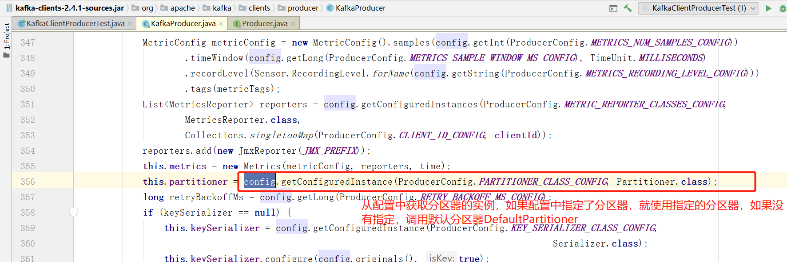

  - 第一点、**如果指定Key：按照Key的Hash取余分区的个数，来写入对应的分区**

  - 第二点、 **如果没有指定Key：按照黏性分区**

    

    > 在Kafka 不同版本中，Produer生产者发送数据时，如果没有分区和Key时，分区规则有区别的。

    - **2.4之前：轮询分区**，数据分配相对均衡

      ```ini
      Topic			part		key		value
      test-topic		0			1		itcast1
      test-topic		1			2		itcast2
      test-topic		2			3		itcast3
      
      test-topic		0			4		itcast4
      test-topic		1			5		itcast5
      test-topic		2			6		itcast6
      
      test-topic		0			7		itcast7
      test-topic		1			8		itcast8
      test-topic		2			9		itcast9
      ```

      - 缺点：性能非常差

      ```ini
      # step1：先将数据放入一个批次中，判断是否达到条件，达到条件才将整个批次的数据写入kafka
      	批次满【batch.size】
      	达到一定时间【linger.ms】
      
      # step2：根据数据属于哪个分区，就与分区构建一个连接，发送这个分区的批次的数据
          第一条数据：先构建0分区的连接，第二条不是0分区的，所以直接构建一个批次，发送第一条
          第二条数据：先构建1分区的连接，第三条不是1分区的，所以直接构建一个批次，发送第二条
          ……
          每条数据需要构建一个批次，9条数据，9个批次，每个批次一条数据
          
          # 批次多，每个批次数据量少，性能比较差
      ```

  - **2.4之后：黏性分区**，==实现少批次多数据==

    - 规则：**判断缓存中是否有这个topic的分区连接，如果有，直接使用，如果没有随机写入一个分区，并且放入缓存**

      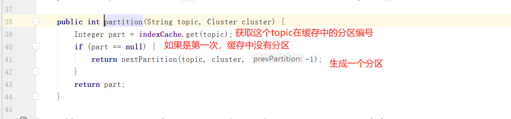

      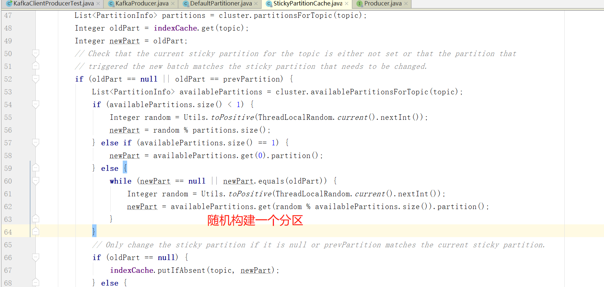      

    - 第一次：将所有数据随机选择一个分区，全部写入这个分区中，将这次的分区编号放入缓存中

      ```
      test-topic	1	37	null	itcast0
      test-topic	1	38	null	itcast1
      test-topic	1	39	null	itcast2
      test-topic	1	40	null	itcast3
      test-topic	1	41	null	itcast4
      test-topic	1	42	null	itcast5
      test-topic	1	43	null	itcast6
      test-topic	1	44	null	itcast7
      test-topic	1	45	null	itcast8
      test-topic	1	46	null	itcast9
      ```

    - 第二次开始根据缓存中是否有上一次的编号

      ```ini
      # 有：
      	直接使用上一次的编号
      
      # 没有：
      	重新随机选择一个
      ```

### 3. 自定义分区器

> **Kafka自定义生产分区器，以随机分区为例**

- **开发步骤：**
- step1：开发一个类实现Partitioner接口
  - step2：实现partition方法
  - step3：生产者加载分区器

- 随机分区器：`RandomPartitioner`

  ```java
  package cn.itcast.kafka.partitioner;
  
  import org.apache.kafka.clients.producer.Partitioner;
  import org.apache.kafka.common.Cluster;
  
  import java.util.Map;
  import java.util.Random;
  
  /**
   * 用户自定义的分区器，实现用户自定义随机分区
   */
  public class RandomPartitioner implements Partitioner {
  
  	/**
  	 * TODO: 依据数据信息，构建分区编号并返回
  	 */
  	@Override
  	public int partition(String topic, Object key, byte[] keyBytes, Object value, byte[] valueBytes, Cluster cluster) {
  		// 获取Topic中分区数目
  		Integer count = cluster.partitionCountForTopic(topic);
  		// 构建随机数
  		Random random = new Random() ;
  		// 随机生成一个分区编号
  		int partitionId = random.nextInt(count);
  		// 返回分区编号ID
  		return partitionId;
  	}
  
  	// 释放资源
  	@Override
  	public void close() {
  
  	}
  
  	// 获取配置
  	@Override
  	public void configure(Map<String, ?> configs) {
  
  	}
  }
  ```

- 使用分区器，设置属性

  ```java
  // todo: 设置分区器
  props.put(ProducerConfig.PARTITIONER_CLASS_CONFIG, "cn.itcast.kafka.partitioner.RandomPartitioner");
  ```

- 查看数据结果

  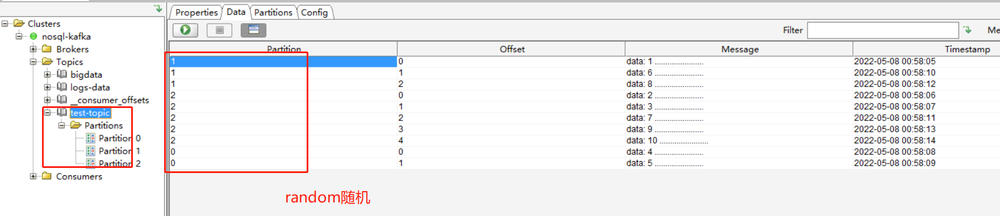

### 4. 事务幂等性

> **问题**：Kafka如何保证生产者生产数据不重复呢？

- **数据重复的情况**

  - step1：生产发送一条数据A给Kafka
  - step2：Kafka存储数据A，返回Ack给生产者
  - step3：如果ack丢失，生产者没有收到ack或超时，生产者认为数据丢失没有写入Kafka
  - step4：生产者基于重试机制重新发送这条数据A，Kafka写入数据A，返回Ack
  - step5：生产者收到ack，发送下一条B
  - ==问题：A在Kafka中写入两次，产生数据重复的问题==

- **Kafka的解决方案**

  

  - 实现：**在每条数据中增加一个数据id，下一条数据会比上一条数据id多1，Kafka会根据id进行判断是否写入过了**
    - 如果没有写入：写入kafka
    - 如果已经写入：直接返回ack

- ==**幂等性机制**==

  - 一个操作被执行多次，结果是一致的

  - 举例说明1：

    ```ini
    向Redis中插入数据数据，数据类型为String字符串
    	set k1 v1
    set k1 v1
    	set k1 v1
    	set k1 v1
    	set k1 v1
    	
    	get k1
    ```

  - 举例说明2：

    ```
    向MySQL数据库中使用，插入数据，是否可以实现幂等性呢？？？
    ```

    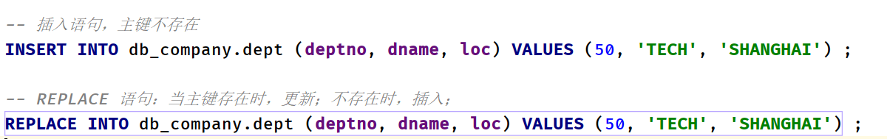

## III. Kafka Consumer

### 1. 消费分配策略

> **问题：**：Kafka 消费组Consumer Group中多个消费者Consumer如何消费Topic队列中数据？

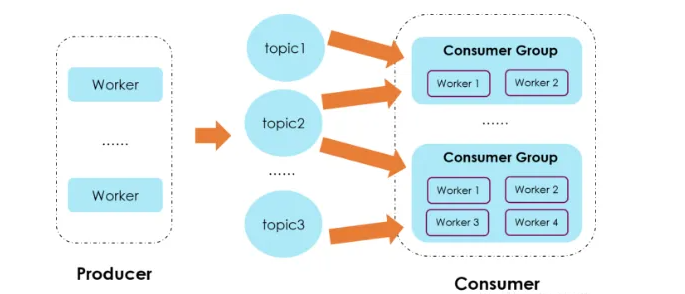

> 消费者ConsumerGroup中消费者消费Topic分区数据**基本规则**：

- **规则一**：[一个分区的数据只能由一个消费组中的某一个消费者消费]()

  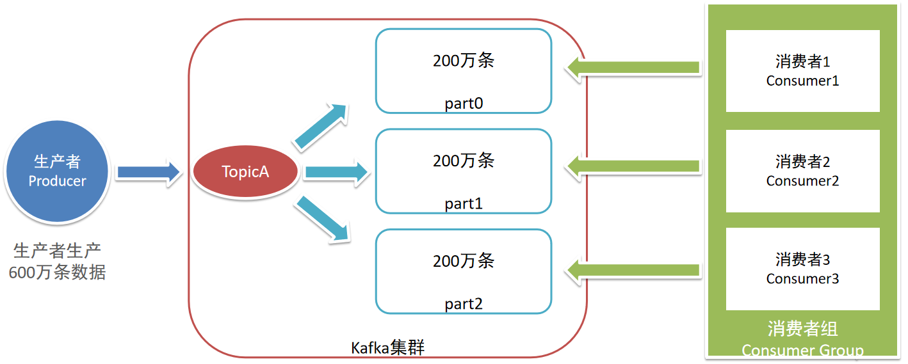

  - 一个消费组中的消费者的个数最多等于消费分区个数

  - 不能实现多个消费者消费一个分区的数据

  - 怎么实现一个消费者组中有多个消费者？

    - 第一个消费者代码

      ```Java
      prop.set("group.id","test01")
      KafkaConsumer consumer01 = new KafkaConsumer(prop)
      ```

    - 第二个消费者代码

      ```JAva
      prop.set("group.id","test01")
      KafkaConsumer consumer02 = new KafkaConsumer(prop)
      ```

- **规则二**：[一个消费者可以消费多个分区的数据]()

  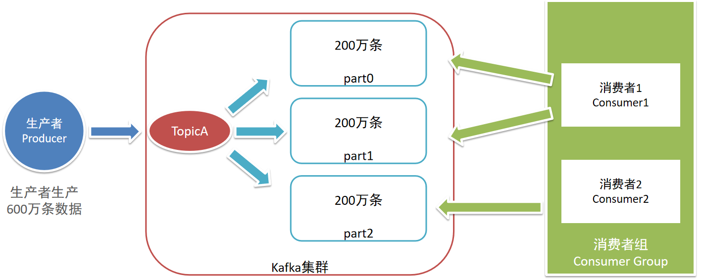

  - 消费者会挨个分区进行消费

> 消费组如何消费者消费Topic队列中数据策略：

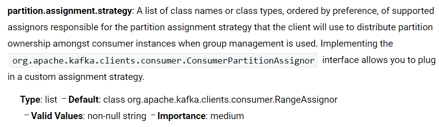

- **属性**

  ```Properties
  partition.assignment.strategy = org.apache.kafka.clients.consumer.RangeAssignor
  ```

- **策略**

  - **RangeAssignor**：范围分配，默认的分配策略

    ```ini
    org.apache.kafka.clients.consumer.RangeAssignor
    ```

  - **RoundRobinAssignor**：轮询分配，常见于Kafka2.0之前的版本

    ```ini
    org.apache.kafka.clients.consumer.RoundRobinAssignor
    ```

  - **StickyAssignor**：黏性分配，Kafka2.0之后建议使用

    ```ini
    org.apache.kafka.clients.consumer.StickyAssignor
    ```

#### RangeAssignor 分配策略

> 范围分配策略的规则及应用场景

- **范围分配规则**

  - **Kafka中默认的分配规则**
  - 每个消费者消费一定范围的分区，尽量的实现**将分区均分给不同的消费者**，如果不能均分，**优先将分区分配给编号小的消费者**
  - 针对每个消费者的每个Topic进行范围分配

  ```ini
  # 6个分区：part0 ~ part5
  	情况一：2个消费者
        - C1：part0 ~ part2
        - C2：part3 ~ part5
        
      情况二：4个消费者
        - C1：part0  part1
        - C2：part2  part3
        - C3：part4
        - C4：part5
  ```

- 举例

  - **假设一：**三个消费者，消费1个Topic，Topic有6个分区

    | 消费者 |   分区    |
    | :----: | :-------: |
    |   C1   | T1【0,1】 |
    |   C2   | T1【2,3】 |
    |   C3   | T1【4,5】 |

    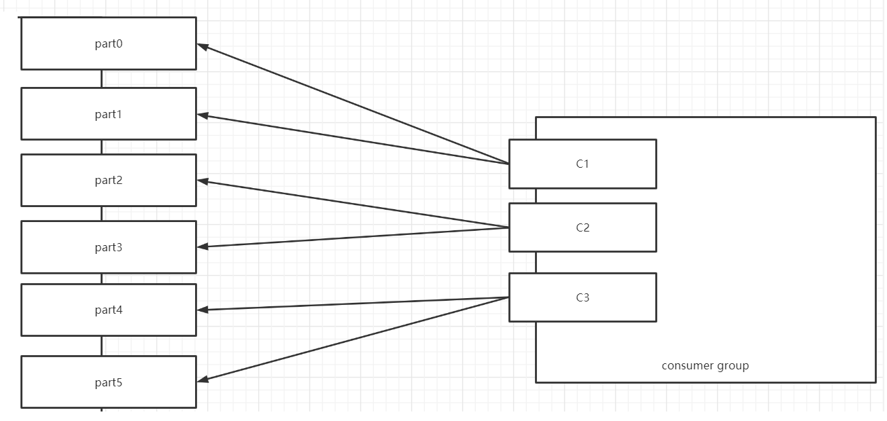

  - **假设二：**三个消费者，消费1个Topic，Topic有7个分区

    | 消费者 |    分区     |
    | :----: | :---------: |
    |   C1   | T1【0,1,2】 |
    |   C2   |  T1【3,4】  |
    |   C3   |  T1【5,6】  |

    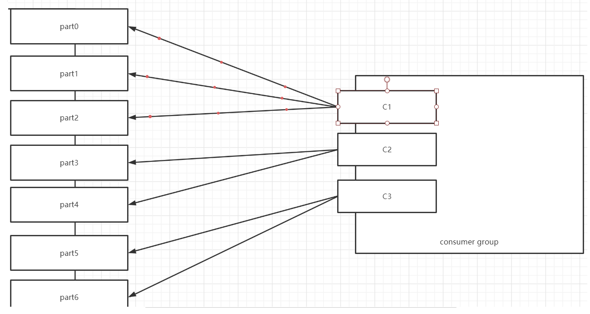

  - **假设三：**三个消费者，消费3个Topic队列，Topic1、Topic2、Topic3各有7个分区

    | 消费者 |                分区                 |
    | :----: | :---------------------------------: |
    |   C1   | T1【0,1,2】 T2【0,1,2】 T3【0,1,2】 |
    |   C2   |    T1【3,4】 T2【3,4】 T3【3,4】    |
    |   C3   |    T1【5,6】 T2【5,6】 T3【5,6】    |

    - 问题：负载不均衡

- 优点：如果Topic的个数比较少，分配会相对比较均衡

- 缺点：如果Topic的个数比较多，而且不能均分，导致负载不均衡问题

- [应用：Topic个数少或者每个Topic都均分的场景]()

#### RoundRobinAssignor  分配策略

> **轮询分配的规则**

- 按照Topic**名称和分区编号排序，轮询分配给每个消费者**

- **假设一**：3个消费者，消费2个Topic，每个Topic有3个分区

| 消费者 |       分区       |
| :----: | :--------------: |
|   C1   | T1【0】  T2【0】 |
|   C2   | T1【1】  T2【1】 |
|   C3   | T1【2】  T2【2】 |

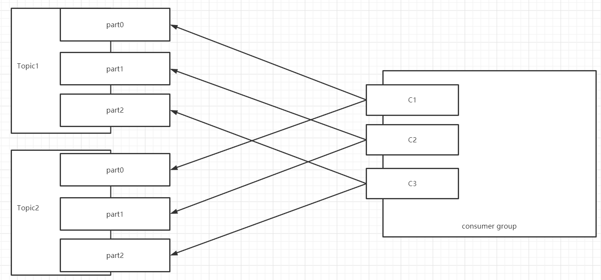

- **假设二：**

  - 3个消费者，消费3个Topic
  - 第一个Topic：1个分区，第二个Topic：2个分区，第三个Topic：3个分区

  ```ini
  # Topic：
  	T1[0]、    T2[0,1]、    T3[0,1,2]
        
  # 排序
     T1【0】
     T2【0】
     T2【1】
     T3【0】
     T3【1】
     T3【2】
  ```

  | 消费者 |              分区               |
  | :----: | :-----------------------------: |
  |   C1   |             T1【0】             |
  |   C2   |             T2【0】             |
  |   C3   | T2【1】 T3【0】 T3【1】 T3【2】 |

  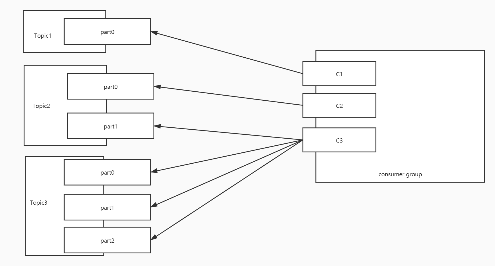

  - 问题：负载不均衡
  - 优点：如果有多个消费者，消费的Topic都是一样的，实现将所有Topic的所有分区轮询分配给所有消费者，尽量的实现负载的均衡
  - 缺点：遇到消费者订阅的Topic是不一致的，不同的消费者订阅不同Topic，只能基于订阅的消费者进行轮询分配，导致整体消费者负载不均衡的
  - 应用：**所有消费者都订阅共同的Topic，能实现让所有Topic的分区轮询分配所有的消费者**

#### StickyAssignor  分配策略

> **黏性分配策略的规则**

- 黏性分配的规则：类似于轮询分配，**尽量的将分区均衡的分配给消费者**
- 黏性分配的特点
  - **相对的保证的分配的均衡**
  - **如果某个消费者故障，尽量的避免网络传输**
- 尽量保证原来的消费的分区不变，将多出来分区均衡给剩余的消费者
  - 假设原来有3个消费者，消费6个分区，平均每个消费者消费2个分区
  - 如果有一个消费者故障了，这个消费者负责的分区交给剩下的消费者来做：消费重平衡

- **场景一：**3个消费者，消费2个Topic，每个Topic：3个分区

| 消费者 |       分区       |
| :----: | :--------------: |
|   C1   | T1【0】  T2【0】 |
|   C2   | T1【1】  T2【1】 |
|   C3   | T1【2】  T2【2】 |

​	效果类似于轮询，比较均衡的分配，但底层实现原理有些不一样

- **场景二：**
  - 3个消费者，消费3个Topic
  - 第一个Topic：1个分区，第二个Topic：2个分区，第三个Topic：3个分区

| 消费者 |          分区           |
| :----: | :---------------------: |
|   C1   |         T1【0】         |
|   C2   |     T2【0】 T2【1】     |
|   C3   | T3【0】 T3【1】 T3【2】 |

  

- **负载均衡的场景**：==某个消费者故障，其他的消费者要重新分配所有分区==

  - **场景三：**如果场景一中的C3出现故障

    - 3个消费者，消费2个Topic，每个Topic：3个分区

      | 消费者 |       分区       |
      | :----: | :--------------: |
      |   C1   | T1【0】  T2【0】 |
      |   C2   | T1【1】  T2【1】 |
      |   C3   | T1【2】  T2【2】 |

    - 轮询：将所有分区重新分配

      | 消费者 |          分区           |
      | :----: | :---------------------: |
      |   C1   | T1【0】 T1【2】 T2【1】 |
      |   C2   | T1【1】 T2【0】 T2【2】 |

    - 黏性：直接故障的分区均分给其他的消费者，其他消费者不用改变原来的分区，降低网络IO消耗

      | 消费者 |           分区           |
      | :----: | :----------------------: |
      |   C1   | T1【0】  T2【0】 T1【2】 |
      |   C2   | T1【1】  T2【1】 T2【2】 |

  - **场景四：**如果假设二中的C1出现故障

    - 场景二：轮询

      | 消费者 |              分区               |
      | :----: | :-----------------------------: |
      |   C1   |             T1【0】             |
      |   C2   |             T2【0】             |
      |   C3   | T2【1】 T3【0】 T3【1】 T3【2】 |

    - 轮询负载均衡

      | 消费者 |              分区              |
      | :----: | :----------------------------: |
      |   C2   |        T1【0】 T2【1】         |
      |   C3   | T2【0】T3【0】 T3【1】 T3【2】 |

    - 场景二：黏性

      | 消费者 |          分区           |
      | :----: | :---------------------: |
      |   C1   |         T1【0】         |
      |   C2   |     T2【0】 T2【1】     |
      |   C3   | T3【0】 T3【1】 T3【2】 |

      - 黏性负载均衡

      | 消费者 |          分区           |
      | :----: | :---------------------: |
      |   C2   | T2【0】 T2【1】 T1【0】 |
      |   C3   | T3【0】 T3【1】 T3【2】 |

  - 特点

    - 分配更加均衡
    - 如果消费者出现故障，提高性能，避免重新分配，将多余的分区均衡的分配给剩余的消费者

### 2. 消费Offset

> **问题**：当消费者Consumer从Topic队列的分区Partition中消费数据时，从哪里开始消费读取数据？

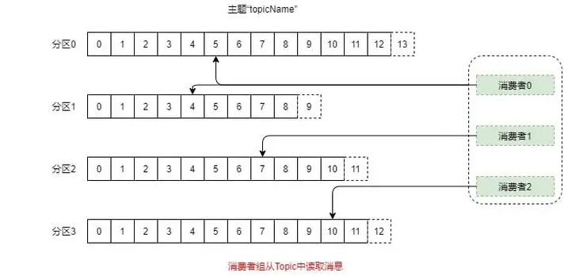

#### 消费者消费过程

> 消费者消费Kafka中的Topic数据：根据==每个分区的Offset==进行消费

- ==第一次消费规则：由属性决定【==[auto.offset.reset = latest | earliest | none]()】

  - `latest`：默认的值，从Topic每个分区的最新的位置开始消费
  - `earliest`：从最早的位置开始消费，每个分区的offset为0开始消费
  - `none`：如果是第一次消费，属性为none，Kafka会抛出异常

  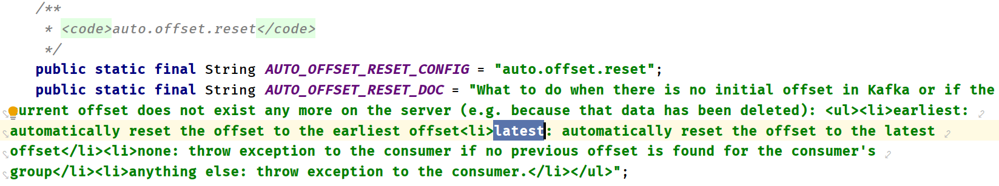

- 第二次消费开始：根据==**上一次消费的Offset**==位置**+1**继续进行消费

  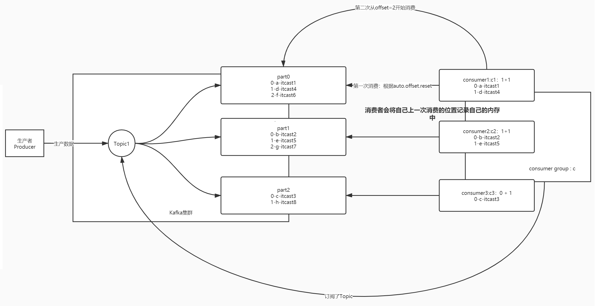

- **问题1：消费者如何知道上一次消费的位置是什么？**

  - 消费者每次成功消费会在内存中记录offset的值，下次直接请求上一次消费的位置

- **问题2：如果因为一些原因，消费者故障了，重启消费者，原来内存中offset就没有，消费者怎么知道上一次消费的位置？**

  - 如果不知道上一次的位置，就无法接着上次的位置继续消费
  - 原因：offset只放在内存中，进程故障，内存的数据丢失
  - 解决：**将offset持久化存储**

#### Kafka Offset偏移量管理

- Kafka将每个消费者消费的位置主动记录在一个Topic中：**__consumer_offsets**
  - Consumer Offset：消费者已经消费到的offset
  - Commit Offset：下一次请求消费的offset
  - Commit Offset = Consumer Offset + 1
- 如果下次消费者没有给定请求offset，kafka就根据自己记录的offset来提供消费的位置

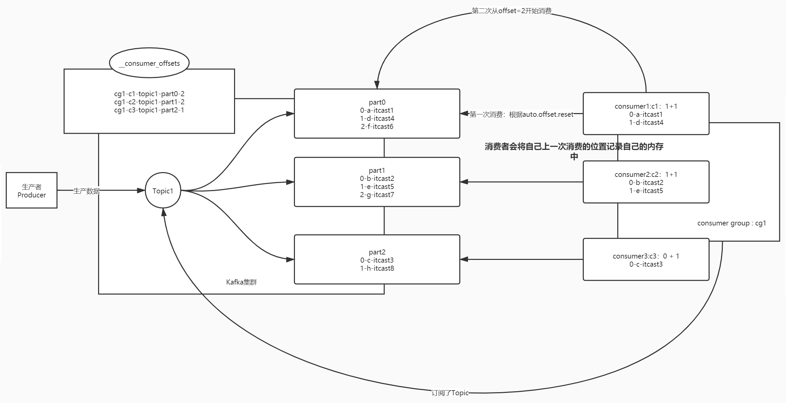

- 提交的规则：根据时间自动提交

  ```java
  props.setProperty("enable.auto.commit", "true");//是否自动提交offset
  props.setProperty("auto.commit.interval.ms", "1000");//提交的间隔时间
  ```

  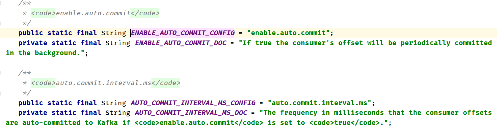

#### 自动提交问题

- **自动提交的规则**

  - 根据时间周期来提交下一次要消费的offset，记录在`__consumer_offsets`中
  - 默认值：每5s提交记录一次

  

- **数据丢失的情况**

  - 如果刚消费，还没处理，就达到提交周期，记录了当前 的offset

  - 最后处理失败，需要重启，重新消费处理

  - Kafka中已经记录消费过了，从上次消费的后面进行消费

    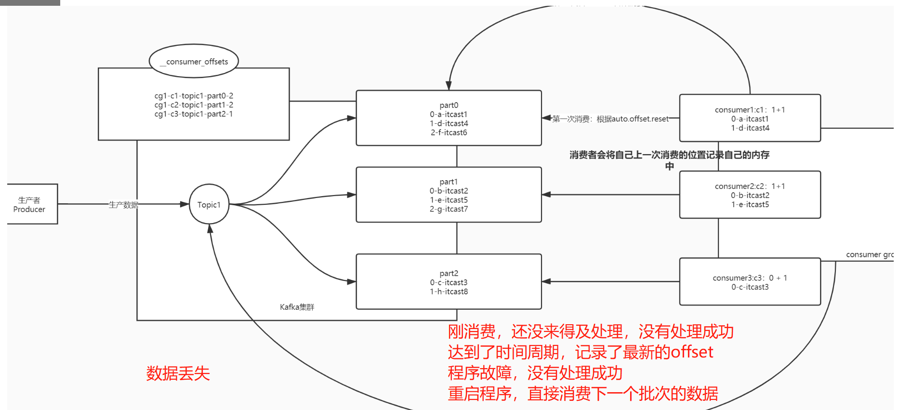

  - **数据重复的情况**

    - 如果消费并处理成功，但是没有提交offset，程序故障

    - 重启以后，kafka中记录的还是之前的offset，重新又消费一遍

    - 数据重复问题

      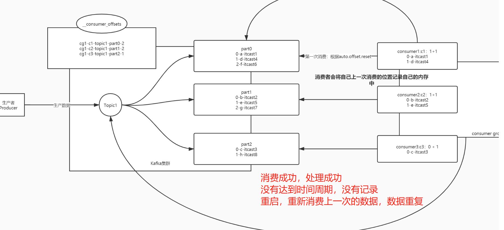

- 原因分析

  - **自动提交：按照时间来进行提交**
  - 需求：按照消费处理的结果
    - 如果消费并处理成功，提交
    - 如果消费失败或者处理失败，不提交

#### 手动提交Topic Offset

- 关闭自动提交

  ```java
  //关闭自动提交
  props.setProperty("enable.auto.commit", "false");
  ```

  

- 手动提交Offset

  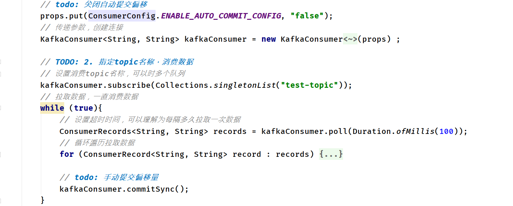

  ```JAva
  package cn.itcast.kafka.offset;
  
  import org.apache.kafka.clients.consumer.ConsumerConfig;
  import org.apache.kafka.clients.consumer.ConsumerRecord;
  import org.apache.kafka.clients.consumer.ConsumerRecords;
  import org.apache.kafka.clients.consumer.KafkaConsumer;
  
  import java.time.Duration;
  import java.util.Collections;
  import java.util.Properties;
  
  /**
   * 使用Java API开发Kafka消费者，从队列Topic中消费数据，实时消费，队列中一有数据理解获取
   */
  public class KafkaReadCommitOffsetTest {
  
  	public static void main(String[] args) {
  		// TODO: 1. 构建KafkaConsumer连接对象
  		Properties props = new Properties() ;
  		// 指定Kafka 服务集群地址
  		props.put(ConsumerConfig.BOOTSTRAP_SERVERS_CONFIG, "node1.itcast.cn:9092,node2.itcast.cn:9092,node3.itcast.cn:9092");
  		// 指定消费数据key和value类型，此处从topic文件中读数据，反序列化
  		props.put(ConsumerConfig.KEY_DESERIALIZER_CLASS_CONFIG, "org.apache.kafka.common.serialization.StringDeserializer");
  		props.put(ConsumerConfig.VALUE_DESERIALIZER_CLASS_CONFIG, "org.apache.kafka.common.serialization.StringDeserializer");
  		// 指定消费组ID
  		props.put(ConsumerConfig.GROUP_ID_CONFIG, "gid-1001") ;
  		// todo: 第一次消费起始位置
  		props.put(ConsumerConfig.AUTO_OFFSET_RESET_CONFIG, "latest") ;
  		// todo: 关闭自动提交偏移
  		props.put(ConsumerConfig.ENABLE_AUTO_COMMIT_CONFIG, "false");
  		// 传递参数，创建连接
  		KafkaConsumer<String, String> kafkaConsumer = new KafkaConsumer<String, String>(props) ;
  
  		// TODO: 2. 指定topic名称，消费数据
  		// 设置消费topic名称，可以时多个队列
  		kafkaConsumer.subscribe(Collections.singletonList("test-topic"));
  		// 拉取数据，一直消费数据
  		while (true){
  			// 设置超时时间，可以理解为每隔多久拉取一次数据
  			ConsumerRecords<String, String> records = kafkaConsumer.poll(Duration.ofMillis(100));
  			// 循环遍历拉取数据
  			for (ConsumerRecord<String, String> record : records) {
  				// TODO: 3. 获取每条消息具体值
  				String topic = record.topic();
  				int partition = record.partition();
  				String key = record.key();
  				String message = record.value();
  				long timestamp = record.timestamp();
  				// 获取偏移量
  				long offset = record.offset();
  				System.out.println(topic + "\t" + partition + "\t" + offset + "\t" + key + "\t" + message + "\t" + timestamp);
  			}
  
  		// todo: 手动提交偏移量
  			kafkaConsumer.commitSync();
  		}
  
  		// TODO: 4. 关闭连接
  		//kafkaConsumer.close();
  	}
  
  }
  ```

#### 手动提交Topic Offset问题

> 手动提交Topic Offset的过程中会出现数据重复

- **Offset的设计**

  - Offset是分区级别，每个分区单独管理一套offset

- 举个栗子：1个消费者，消费1个Topic，Topic有3个分区

  - 第一次消费

    - part0

      ```
      0	hadoop
      1	hive
      ```

    - part1

      ```
      0	hive
      1	spark
      2	hue
      ```

    - part2

      ```
      0	spark
      1	hadoop
      ```

  - 问题：part0和part1都处理成功，当处理part2时候，程序故障，重启

    - offset有没有提交？**没有提交**

  - 重启消费者：Kafka中没有消费记录，但是消费者刚刚分区0和分区1已经消费成功了

    - 所有分区都重新消费

- **原因**：Offset是分区级别的
- 提交offset是按照整个Topic级别来提交的

- **解决**：提交offset的时候，**按照分区来提交**
- 消费成功一个分区，就提交一个分区的offset

#### 手动提交分区Offset

> **Kafka实现手动提交Partition的Offset**

- **开发步骤**

  - step1：消费每个分区的数据
  - step2：处理输出每个分区的数据
  - step3：手动提交每个分区的Offset

- **编程代码**

  ```java
  package cn.itcast.kafka.offset;
  
  import org.apache.kafka.clients.consumer.*;
  import org.apache.kafka.common.TopicPartition;
  
  import java.time.Duration;
  import java.util.*;
  
  /**
   * 使用Java API开发Kafka消费者，从队列Topic中消费数据，实时消费，队列中一有数据理解获取
   */
  public class KafkaReadCommitPartitionOffsetTest {
  
  	public static void main(String[] args) {
  		// TODO: 1. 构建KafkaConsumer连接对象
  		Properties props = new Properties() ;
  		// 指定Kafka 服务集群地址
  		props.put(ConsumerConfig.BOOTSTRAP_SERVERS_CONFIG, "node1.itcast.cn:9092,node2.itcast.cn:9092,node3.itcast.cn:9092");
  		// 指定消费数据key和value类型，此处从topic文件中读数据，反序列化
  		props.put(ConsumerConfig.KEY_DESERIALIZER_CLASS_CONFIG, "org.apache.kafka.common.serialization.StringDeserializer");
  		props.put(ConsumerConfig.VALUE_DESERIALIZER_CLASS_CONFIG, "org.apache.kafka.common.serialization.StringDeserializer");
  		// 指定消费组ID
  		props.put(ConsumerConfig.GROUP_ID_CONFIG, "gid-1001") ;
  		// todo: 第一次消费起始位置
  		props.put(ConsumerConfig.AUTO_OFFSET_RESET_CONFIG, "latest") ;
  		// todo: 关闭自动提交偏移
  		props.put(ConsumerConfig.ENABLE_AUTO_COMMIT_CONFIG, "false");
  		// 传递参数，创建连接
  		KafkaConsumer<String, String> kafkaConsumer = new KafkaConsumer<String, String>(props) ;
  
  		// TODO: 2. 指定topic名称，消费数据
  		// 设置消费topic名称，可以时多个队列
  		kafkaConsumer.subscribe(Collections.singletonList("test-topic"));
  		// 拉取数据，一直消费数据
  		while (true){
  			// 设置超时时间，可以理解为每隔多久拉取一次数据
  			ConsumerRecords<String, String> records = kafkaConsumer.poll(Duration.ofMillis(100));
  			// 第1步、获取拉取数据的分区信息
  			Set<TopicPartition> partitions = records.partitions();
  			// -----------------------------------1 start--------------------------------------------------
  			// 第2步、获取每个分区数据，进行消费
  			for (TopicPartition partition: partitions){
  				// 分区数据
  				List<ConsumerRecord<String, String>> partitionRecords = records.records(partition);
  				// 遍历消费
  				long consumerOffset = 0 ;
  				for (ConsumerRecord<String, String> record : partitionRecords) {
  					String topic = record.topic();
  					int part = record.partition();
  					long offset = record.offset();
  					String key = record.key();
  					String value = record.value();
  					//模拟处理：输出
  					System.out.println(topic + "\t" + part + "\t" + offset + "\t" + key + "\t" + value);
  					// 记录消费偏移量
  					consumerOffset = offset ;
  				}
  				// TODO: 每个分区数据处理完成，手动提交offset
  				Map<TopicPartition, OffsetAndMetadata> offsets = new HashMap<>();
  				offsets.put(partition, new OffsetAndMetadata(consumerOffset)) ;
  				kafkaConsumer.commitSync(offsets);
  			}
  			// -----------------------------------1 end--------------------------------------------------
  		}
  
  		// TODO: 4. 关闭连接
  		//kafkaConsumer.close();
  	}
  
  }
  ```

### 3. 消费Topic


### 4. 消费语义


## 附录: Kafka集群常用配置

