# 实时日志采集及综合案例

## I. Flume快速上手

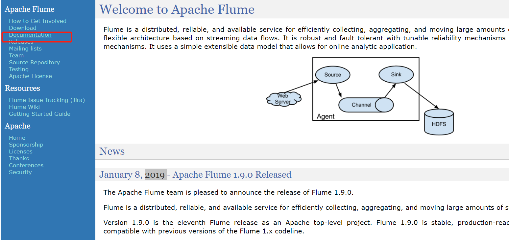

### 1. 功能概述

> Aapche Flume是由Cloudera提供的一个高可用的，高可靠的，分布式的海量日志采集、聚合和传输的软件，网址：<http://flume.apache.org/>


> Apache Flume的核心是**把数据从数据源(source)收集过来，再将收集到的数据送到指定的目的地(sink)**。为了保证输送的过程一定成功，在送到目的地(sink)之前，会**先缓存数据(channel)**，待数据真正到达目的地(sink)后，flume在删除自己缓存的数据。

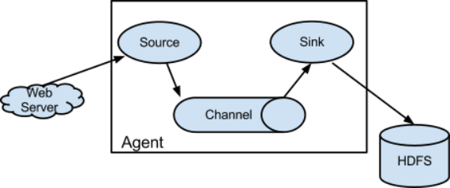

- 当前Flume有两个版本：Flume 0.9X版本的统称Flume OG（original generation）和Flume1.X版本的统称Flume NG（next generation）。
- 由于Flume NG经过核心组件、核心配置以及代码架构重构，与Flume OG有很大不同。改动的另一原因是将Flume纳入 apache 旗下，Cloudera Flume 改名为 Apache Flume。

> Flume系统中核心的角色是**agent**，agent本身是**一个Java进程**，一般运行在日志收集节点。


每一个agent相当于一个数据传递员，内部有三个组件：

- **Source**：采集源，用于跟数据源对接，以获取数据；
- **Sink**：下沉地，采集数据的传送目的，用于往下一级agent或者往最终存储系统传递数据；
- **Channel**：agent内部的数据传输通道，用于从source将数据传递到sink；

> 在整个数据的传输的过程中，流动的是**event**，它是Flume内部数据传输的最基本单元。

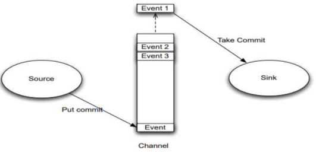

[event将传输的数据进行封装，如果是文本文件，通常是一行记录，event也是事务的基本单位。]()event从source，流向channel，再到sink，本身为一个字节数组，并可携带headers(头信息)信息。**event代表着一个数据的最小完整单元，从外部数据源来，向外部的目的地去。**


[一个完整的event包括：event headers、event body，其中event body是flume收集到的日记记录。]()

> Flume 应用场景：

- 场景一：实时数据采集
- 场景二：数据量很大，实时的小部分小部分的采集，节省时间

```ini
# 美团的Flume设计架构
https://tech.meituan.com/2013/12/09/meituan-flume-log-system-architecture-and-design.html
```

### 2. 安装部署

> Apache Flume 的安装非常简单，直接解压，然后配置JDK环境变量即可。

- 1、上传安装包，node1机器上安装

  ```ini
  cd /export/software/
  rz
  ```

  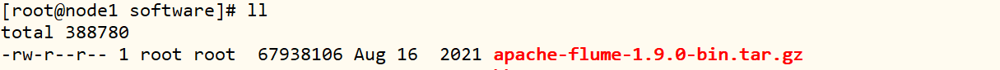

- 2、解压安装

  ```shell
  tar -zxf apache-flume-1.9.0-bin.tar.gz -C /export/server/
  
  cd /export/server
  ln -s apache-flume-1.9.0-bin flume
  
  chown -R root:root flume/
  ```

- 3、修改Flume环境变量

  ```shell
  cd /export/server/flume/conf/
  mv flume-env.sh.template flume-env.sh
  vim flume-env.sh 
  ```

  ```ini
  # 修改22行
  export JAVA_HOME=/export/server/jdk
  # 修改34行
  export HADOOP_HOME=/export/server/hadoop
  ```

- 4、集成HDFS，拷贝HDFS配置文件

  ```shell
  cp /export/server/hadoop/etc/hadoop/core-site.xml /export/server/hadoop/etc/hadoop/hdfs-site.xml /export/server/flume/conf/
  ```

  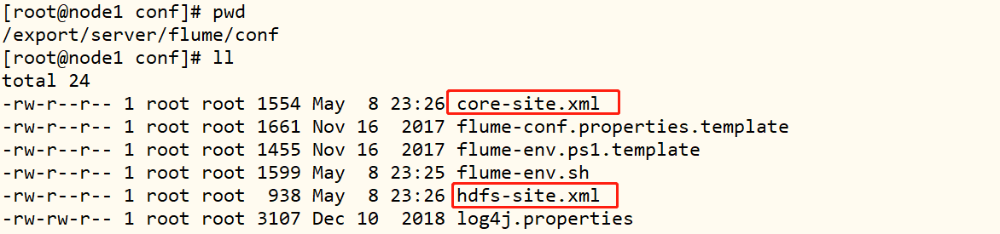

- 5、删除Flume自带的guava包，替换成Hadoop的

  ```ini
  # 删除低版本jar包
  rm -rf /export/server/flume/lib/guava-11.0.2.jar
  
  # 拷贝高版本jar包
  cp /export/server/hadoop/share/hadoop/common/lib/guava-27.0-jre.jar /export/server/flume/lib/
  ```

> Flume Agent开发步骤：编写Agent配置文件和启动运行Agent程序。


- **step1：编写Agent配置文件**
  - 在配置文件中定义Agent，定义这个agent的名称，定义agent的三个基本组件
  - Source是什么？
    - 决定程序**从哪里采集数据**
    - https://flume.apache.org/releases/content/1.7.0/FlumeUserGuide.html#flume-sources
  - Channel是什么？
    - 决定程序**将采集到的数据缓存在什么地方**
    - https://flume.apache.org/releases/content/1.7.0/FlumeUserGuide.html#flume-channels
  - Sink是什么？
    - 决定程序**将数据发送到什么地方**
    - https://flume.apache.org/releases/content/1.7.0/FlumeUserGuide.html#flume-sinks 

- **step2：运行Agent程序**

  - 用法

    ```ini
    Usage:  flume-ng <command> [options]...
    ```

  - 使用

    ```ini
    flume-ng agent  -c Flume配置文件目录 -f 指定运行的文件 -n 运行的Agent的名称
    ```

  - 案例

    ```ini
    flume-ng agent -n xx_name -c /export/server/flume/conf -f xxx.properties
    ```

### 3. 入门案例

> **需求**：采集Hive的日志，临时缓存在内存中，将日志写入Flume的日志中并打印在命令行

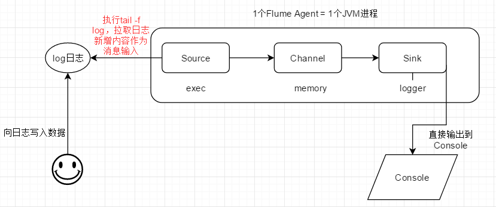

- **source**：Exec Source
  - 功能：[通过执行一条Linux命令来实现数据动态采集]()
  - 固定搭配`tail -F`命令来使用，实现数据增量采集
  - 动态监听单个文件的数据采集
  - 文档：https://flume.apache.org/releases/content/1.9.0/FlumeUserGuide.html#exec-source
- **channel**：memory channel，
  - 将数据缓存在内存中
  - 文档：https://flume.apache.org/releases/content/1.9.0/FlumeUserGuide.html#memory-channel
- **sink**：Logger Sink
  - 将数据日志打印控制台
  - 文档：https://flume.apache.org/releases/content/1.9.0/FlumeUserGuide.html#logger-sink

> 开发Flume Agent配置文件，并运行Agent程序，实时采集数据。

- 1、创建Agent配置文件

  ```ini
  touch /export/server/flume/conf/exec-mem-log.properties
  ```

- 2、配置Agent组成，指定source、channel和sink

  ```ini
  vim /export/server/flume/conf/exec-mem-log.properties
  ```

  ```properties
  # The configuration file needs to define the sources, 
  # the channels and the sinks.
  # Sources, channels and sinks are defined per a1, 
  
  # in this case called 'a1'
  
  #define the agent
  a1.sources = s1
  a1.channels = c1
  a1.sinks = k1
  
  #define the source
  a1.sources.s1.type = exec
  a1.sources.s1.command = tail -f /export/server/flume/datas/test.log
  
  #define the channel
  a1.channels.c1.type = memory
  a1.channels.c1.capacity = 10000
  
  #define the sink
  a1.sinks.k1.type = logger
  
  #bond
  a1.sources.s1.channels = c1
  a1.sinks.k1.channel = c1
  ```

- 3、启动Hive服务，运行SQL，产生日志

  ```ini
  # 创建数据目录
  mkdir -p /export/server/flume/datas
  
  # 创建日志文件
  touch /export/server/flume/datas/test.log
  
  # 追加数据
  echo "111111111" >> /export/server/flume/datas/test.log
  echo "222222222" >> /export/server/flume/datas/test.log
  echo "333333333" >> /export/server/flume/datas/test.log
  echo "444444444" >> /export/server/flume/datas/test.log
  ```

- 4、运行Agent程序，参数：`-Dflume.root.logger=INFO,console`，让Flume的日志打印在命令行

```ini
/export/server/flume/bin/flume-ng agent -n a1 \
-c /export/server/flume/conf/ \
-f /export/server/flume/conf/exec-mem-log.properties \
-Dflume.root.logger=INFO,console
```

- 5、查看控制台打印数据

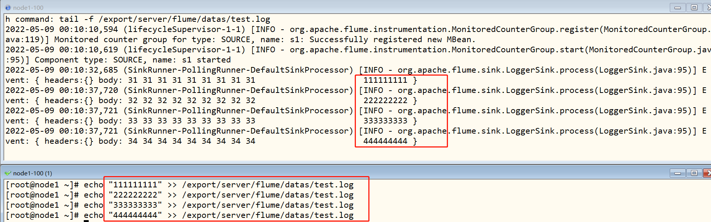

### 4. Taildir Source

> **需求**：当前日志文件是一天一个，需要每天将数据实时采集到HDFS上，如何采集呢？

```ini
/nginx/logs/
	2022-05-01.log
    2022-05-02.log
    ……
    2022-05-10.log
```

> **问题**：能不能exec source进行采集？

- 不能，`exec`只能监听采集单个文件
- `Taildir Source`：从**Apache Flume1.7**版本开始支持，**==动态监听采集多个文件==**
- 文档：https://flume.apache.org/releases/content/1.9.0/FlumeUserGuide.html#taildir-source

```ini
TailDir Soucre
	监控文件、监控目录
	1. Tail，在Unix系统中，实时读取文件最后内容
		tail -F xxx.log
	
	2. Dir
		监控某个目录，当目录中有文件出现时，立即读取文件数据	
```

> **业务实现**：让Flume动态监听一个文件和一个目录下的所有文件

- 1、数据准备

  存储元数据目录

  ```ini
  mkdir -p /export/server/flume/datas/position
  ```

  创建监控目录和文件

  ```shell
  # 监控目录
  mkdir -p /export/server/flume/datas/nginx
   
  # 监控文件
  touch /export/server/flume/datas/logs.data
  ```

- 2、开发Agent配置文件

  创建文件

  ```ini
  touch /export/server/flume/conf/tail-mem-log.properties
  ```

    编辑文件

  ```ini
  vim /export/server/flume/conf/tail-mem-log.properties
  ```

  ```ini
    # define sourceName/channelName/sinkName for the agent 
    a1.sources = s1
    a1.channels = c1
    a1.sinks = k1
    
    # define the s1
    a1.sources.s1.type = TAILDIR
    #指定一个元数据记录文件
    a1.sources.s1.positionFile = /export/server/flume/datas/position/taildir_position.json
    #将所有需要监控的数据源变成一个组，这个组内有两个数据源
    a1.sources.s1.filegroups = f1 f2
    #指定了f1是谁：监控一个文件
    a1.sources.s1.filegroups.f1 = /export/server/flume/datas/logs.data
    #指定f2是谁：监控一个目录下的所有文件
    a1.sources.s1.filegroups.f2 = /export/server/flume/datas/nginx/.*
    
    # define the c1
    a1.channels.c1.type = memory
    a1.channels.c1.capacity = 1000
    a1.channels.c1.transactionCapacity = 100
    
    # define the k1
    a1.sinks.k1.type = logger
    
    # source、channel、sink bond
    a1.sources.s1.channels = c1
    a1.sinks.k1.channel = c1 
  ```

- 3、Agent程序运行

  ```ini
  /export/server/flume/bin/flume-ng agent -n a1 \
  -c /export/server/flume/conf/ \
  -f /export/server/flume/conf/tail-mem-log.properties \
  -Dflume.root.logger=INFO,console
  ```

- 4、测试数据

  ```ini
  # 日志文件追加数据
  echo "AAAAAAA" >> /export/server/flume/datas/logs.data
  echo "BBBBBBB" >> /export/server/flume/datas/logs.data
  echo "CCCCCCC" >> /export/server/flume/datas/logs.data
  
  # 目录写入文件
  echo "hello flume" >> /export/server/flume/datas/nginx/1.log
  echo "hello kafka" >> /export/server/flume/datas/nginx/2.log
  echo "hello hbase" >> /export/server/flume/datas/nginx/3.log
  ```

  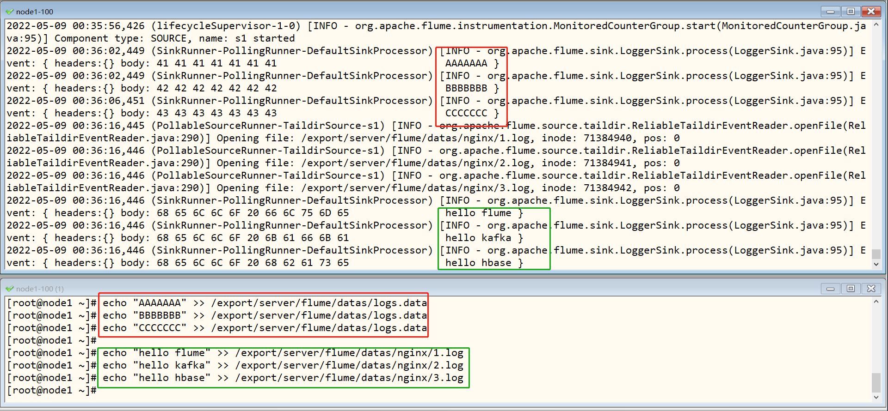

- 5、元数据文件的功能：`/export/server/flume/datas/position/taildir_position.json`

  - 问题：**如果Flume程序故障，重启Flume程序，已经被采集过的数据还要不要采集**？

  - 需求：不需要，不能导致数据重复

  - 功能：记录Flume所监听的每个文件已经被采集的位置

    ```
    [
    	{"inode":1051122,"pos":24,"file":"/export/server/flume/datas/logs.data"},
    	{"inode":71384940,"pos":12,"file":"/export/server/flume/datas/nginx/1.log"},
    	{"inode":71384941,"pos":12,"file":"/export/server/flume/datas/nginx/2.log"},
    	{"inode":71384942,"pos":12,"file":"/export/server/flume/datas/nginx/3.log"}
    ]
    ```

> **补充**：工作中可能会见到其他的source

- **Kafka Source**：
  - 监听读取Kafka数据
  - 文档：https://flume.apache.org/releases/content/1.9.0/FlumeUserGuide.html#kafka-source
- **Spooldir Source**：
  - 监控一个目录，只要这个目录中产生一个文件，就会全量采集一个文件
  - 文档：https://flume.apache.org/releases/content/1.9.0/FlumeUserGuide.html#spooling-directory-source
  - 缺点：不能动态监控文件，被采集的文件是不能发生变化的

### 5. Channel缓存


> **在Flume中，编写Agent，最常见使用Channel缓存：Memory内存和File文件**，负责临时缓存数据。

- **Memory Channel**：将数据缓存在内存中

  - 特点：==读写快、容量小、安全性较差==
  - 文档：https://flume.apache.org/releases/content/1.9.0/FlumeUserGuide.html#memory-channel

  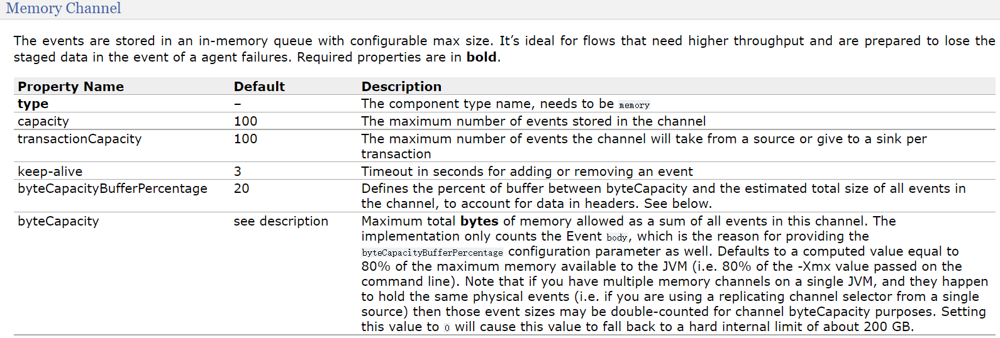

  - 应用：**小数据量的高性能的传输**

- **File Channel**：将数据缓存在文件中

  - 特点：==读写相对慢、容量大、安全性较高==
  - 文档：https://flume.apache.org/releases/content/1.9.0/FlumeUserGuide.html#file-channel

  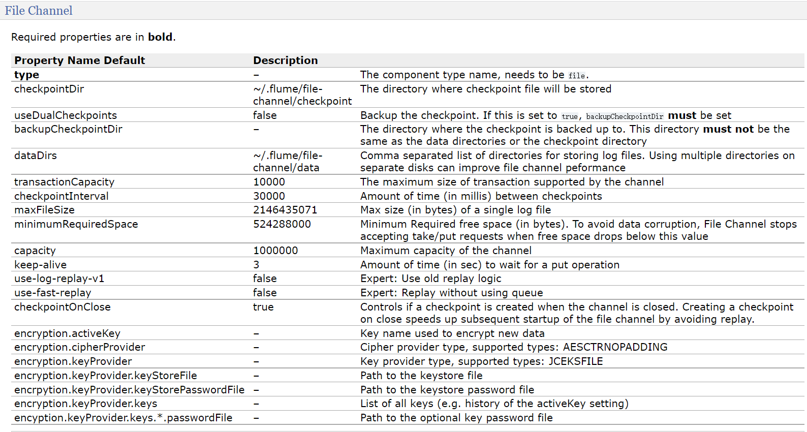

  - 应用：**数据量大，读写性能要求不高的场景下**

### 6. HDFS Sink

```
在Flume中，日志数据实时采集时，常用Sink接收器：
	1. HDFS sink
		将采集数据Event写入到HDFS文件系统文件中
		
	2. Kafka Sink
		将采集数据Event写入到Kafka Topic中
```

> **将Flume采集的数据写入HDFS**，使用Sink为：**HDFS Sink**

- 文档：https://flume.apache.org/releases/content/1.9.0/FlumeUserGuide.html#hdfs-sink

- Demo 案例

  ```ini
  a1.channels = c1
  a1.sinks = k1
  a1.sinks.k1.type = hdfs
  a1.sinks.k1.channel = c1
  a1.sinks.k1.hdfs.path = /flume/events/%y-%m-%d/%H%M/%S
  a1.sinks.k1.hdfs.filePrefix = events-
  a1.sinks.k1.hdfs.round = true
  a1.sinks.k1.hdfs.roundValue = 10
  a1.sinks.k1.hdfs.roundUnit = minute
  ```

#### 写入HDFS

- 1、创建Agent 配置文件

```ini
touch /export/server/flume/conf/hdfs-mem-log.properties
```

- 2、开发配置文件内容

  ```ini
  vim /export/server/flume/conf/hdfs-mem-log.properties
  ```

  ```ini
  # The configuration file needs to define the sources, 
  # the channels and the sinks.
  # Sources, channels and sinks are defined per a1, 
  # in this case called 'a1'
  
  
  #定义当前的agent的名称，以及对应source、channel、sink的名字
  a1.sources = s1
  a1.channels = c1
  a1.sinks = k1
  
  #定义s1:从哪读数据，读谁
  a1.sources.s1.type = exec
  a1.sources.s1.command = tail -f /export/server/flume/datas/test.log
  
  #定义c1:缓存在什么地方
  a1.channels.c1.type = memory
  a1.channels.c1.capacity = 1000
  
  
  #定义k1:将数据发送给谁
  a1.sinks.k1.type = hdfs
  a1.sinks.k1.hdfs.path = hdfs://node1.itcast.cn:8020/flume/test1
  #指定生成的文件的前缀
  a1.sinks.k1.hdfs.filePrefix = nginx
  #指定生成的文件的后缀
  a1.sinks.k1.hdfs.fileSuffix = .log
  #指定写入HDFS的文件的类型：普通的文件
  a1.sinks.k1.hdfs.fileType = DataStream 
  
  #s1将数据给哪个channel
  a1.sources.s1.channels = c1
  #k1从哪个channel中取数据
  a1.sinks.k1.channel = c1
  ```

- 3、启动Agent服务

```ini
/export/server/flume/bin/flume-ng agent -n a1 \
-c /export/server/flume/conf/ \
-f /export/server/flume/conf/hdfs-mem-log.properties \
-Dflume.root.logger=INFO,console
```

- 4、测试数据

  ```ini
  echo "1................................" >> /export/server/flume/datas/test.log
  echo "2................................" >> /export/server/flume/datas/test.log
  echo "3................................" >> /export/server/flume/datas/test.log
  echo "4................................" >> /export/server/flume/datas/test.log
  echo "5................................" >> /export/server/flume/datas/test.log
  echo "6................................" >> /export/server/flume/datas/test.log
  echo "7................................" >> /export/server/flume/datas/test.log
  echo "8................................" >> /export/server/flume/datas/test.log
  echo "9................................" >> /export/server/flume/datas/test.log
  ```

- 5、查看HDFS目录中文件

  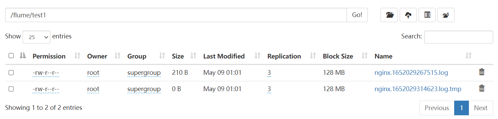

#### 文件大小

> Flume默认写入HDFS上会产生很多小文件，都在1KB左右，不利用HDFS存储

- **解决**：指定文件大小

```ini
# hdfs.rollInterval：
	按照时间间隔生成文件
	
# hdfs.rollSize：
	指定HDFS生成的文件大小
	
# hdfs.rollCount：
	按照event个数生成文件
```

- 1、复制Agent配置文件

  ```ini
  cp /export/server/flume/conf/hdfs-mem-log.properties /export/server/flume/conf/hdfs-mem-size.properties
  ```

- 2、修改文件内容

  ```ini
  vim /export/server/flume/conf/hdfs-mem-size.properties
  ```

  ```ini
  # The configuration file needs to define the sources, 
  # the channels and the sinks.
  # Sources, channels and sinks are defined per a1, 
  # in this case called 'a1'
  
  
  #定义当前的agent的名称，以及对应source、channel、sink的名字
  a1.sources = s1
  a1.channels = c1
  a1.sinks = k1
  
  #定义s1:从哪读数据，读谁
  a1.sources.s1.type = exec
  a1.sources.s1.command = tail -f /export/server/flume/datas/test.log
  
  #定义c1:缓存在什么地方
  a1.channels.c1.type = memory
  a1.channels.c1.capacity = 1000
  
  #定义k1:将数据发送给谁
  a1.sinks.k1.type = hdfs
  a1.sinks.k1.hdfs.path = hdfs://node1.itcast.cn:8020/flume/test2
  #指定生成的文件的前缀
  a1.sinks.k1.hdfs.filePrefix = nginx
  #指定生成的文件的后缀
  a1.sinks.k1.hdfs.fileSuffix = .log
  #指定写入HDFS的文件的类型：普通的文件
  a1.sinks.k1.hdfs.fileType = DataStream 
  #指定按照时间生成文件，一般关闭
  a1.sinks.k1.hdfs.rollInterval = 0
  #指定文件大小生成文件，一般120 ~ 125M对应的字节数
  a1.sinks.k1.hdfs.rollSize = 1024
  #指定event个数生成文件，一般关闭
  a1.sinks.k1.hdfs.rollCount = 0
  
  #s1将数据给哪个channel
  a1.sources.s1.channels = c1
  #k1从哪个channel中取数据
  a1.sinks.k1.channel = c1
  ```

- 3、启动Agent服务

```ini
/export/server/flume/bin/flume-ng agent -n a1 \
-c /export/server/flume/conf/ \
-f /export/server/flume/conf/hdfs-mem-size.properties \
-Dflume.root.logger=INFO,console
```

- 4、测试数据

  ```ini
  echo "A................................" >> /export/server/flume/datas/test.log
  echo "B................................" >> /export/server/flume/datas/test.log
  echo "C................................" >> /export/server/flume/datas/test.log
  echo "D................................" >> /export/server/flume/datas/test.log
  echo "E................................" >> /export/server/flume/datas/test.log
  echo "F................................" >> /export/server/flume/datas/test.log
  echo "X................................" >> /export/server/flume/datas/test.log
  echo "F................................" >> /export/server/flume/datas/test.log
  echo "Z................................" >> /export/server/flume/datas/test.log
  ```

- 5、查看HDFS目录中文件

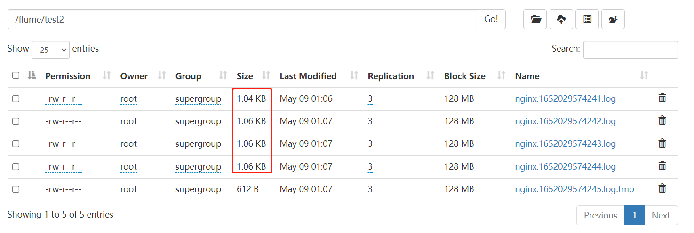

#### 分区目录

> 问题：如何实现分区存储，每天一个或者每小时一个目录？

```ini
/flume/test3/
	daystr=2022-05-01/nginx.log
	daystr=2022-05-02/nginx.log
```

- 解决：**添加时间标记目录**

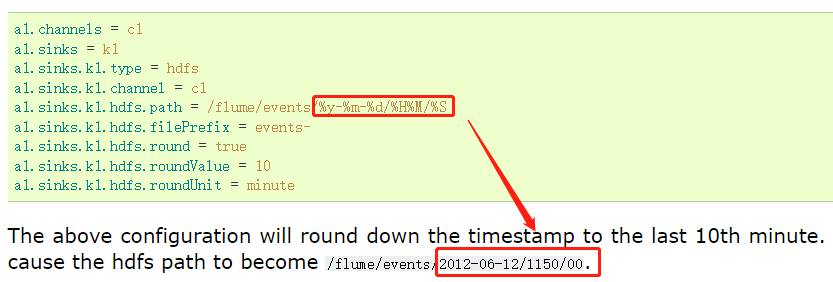

```ini
 For all of the time related escape sequences, a header with the key “timestamp” must exist among the headers of the event (unless hdfs.useLocalTimeStamp is set to true). 
```

- 1、复制Agent配置文件

  ```ini
  cp /export/server/flume/conf/hdfs-mem-size.properties /export/server/flume/conf/hdfs-mem-partition.properties
  ```

- 2、修改文件内容

  ```ini
  vim /export/server/flume/conf/hdfs-mem-partition.properties
  ```

  ```ini
  # The configuration file needs to define the sources, 
  # the channels and the sinks.
  # Sources, channels and sinks are defined per a1, 
  # in this case called 'a1'
  
  
  #定义当前的agent的名称，以及对应source、channel、sink的名字
  a1.sources = s1
  a1.channels = c1
  a1.sinks = k1
  
  #定义s1:从哪读数据，读谁
  a1.sources.s1.type = exec
  a1.sources.s1.command = tail -f /export/server/flume/datas/test.log
  
  #定义c1:缓存在什么地方
  a1.channels.c1.type = memory
  a1.channels.c1.capacity = 1000
  
  #定义k1:将数据发送给谁
  a1.sinks.k1.type = hdfs
  a1.sinks.k1.hdfs.path = hdfs://node1.itcast.cn:8020/flume/test3/daystr=%Y-%m-%d
  a1.sinks.k1.hdfs.useLocalTimeStamp = true
  #指定生成的文件的前缀
  a1.sinks.k1.hdfs.filePrefix = nginx
  #指定生成的文件的后缀
  a1.sinks.k1.hdfs.fileSuffix = .log
  #指定写入HDFS的文件的类型：普通的文件
  a1.sinks.k1.hdfs.fileType = DataStream 
  #指定按照时间生成文件，一般关闭
  a1.sinks.k1.hdfs.rollInterval = 0
  #指定文件大小生成文件，一般120 ~ 125M对应的字节数
  a1.sinks.k1.hdfs.rollSize = 1024
  #指定event个数生成文件，一般关闭
  a1.sinks.k1.hdfs.rollCount = 0
  
  #s1将数据给哪个channel
  a1.sources.s1.channels = c1
  #k1从哪个channel中取数据
  a1.sinks.k1.channel = c1
  ```

- 3、启动Agent服务

```ini
/export/server/flume/bin/flume-ng agent -n a1 \
-c /export/server/flume/conf/ \
-f /export/server/flume/conf/hdfs-mem-partition.properties \
-Dflume.root.logger=INFO,console
```

- 4、测试数据

  ```ini
  echo "A123................................" >> /export/server/flume/datas/test.log
  echo "B123................................" >> /export/server/flume/datas/test.log
  echo "C123................................" >> /export/server/flume/datas/test.log
  echo "D123................................" >> /export/server/flume/datas/test.log
  echo "E123................................" >> /export/server/flume/datas/test.log
  echo "F123................................" >> /export/server/flume/datas/test.log
  echo "X123................................" >> /export/server/flume/datas/test.log
  echo "F123................................" >> /export/server/flume/datas/test.log
  echo "Z123................................" >> /export/server/flume/datas/test.log
  ```

- 5、查看HDFS目录中文件


## II. 综合案例

### 1.  业务需求

> mm综合案例，业务数据流程图：mm用户聊天数据存储到日志log文件中，实时采集到Kafka消息队列，实时消费数据存储到HBase表，最后关联Hive表和Phoenix表进行离线分析和即席查询。

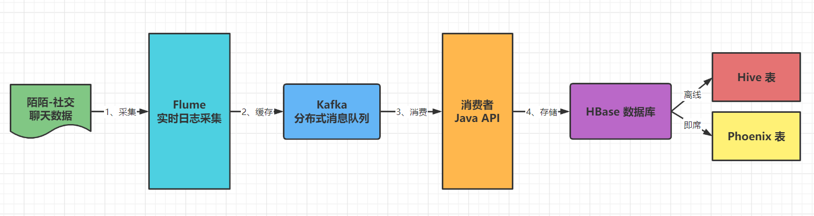

```ini
数据采集：Flume
实时存储：Kafka
离线存储：HBase
离线分析：Hive 离线分析
即时查询：Phoenix 即席查询
```

> [为什么不直接将Flume的数据给HBase，而统一的给了Kafka，再由Kafka到HBase？]()

- 避免高并发写导致机器负载过高、实现架构解耦、实现异步高效
- 保证数据一致性

#### mm社交数据

> 用户聊天数据以文本格式存储日志文件中，包含20个字段，下图所示：

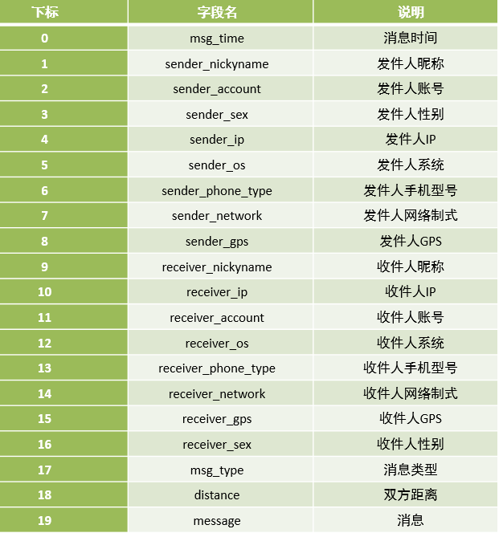

> 样本数据：

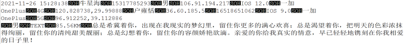

上述数据各个字段之间分割符号为：**\001**

#### 模拟社交数据

> 本次案例，直接提供专门用于生产mm社交消息数据的工具，可以直接部署在业务端进行数据生成即可，接下来部署用于生产数据的工具jar包。

- 1、创建原始文件目录

  ```ini
  mkdir -p /export/data/momo_init
  ```

- 2、上传模拟数据程序

  ```ini
  cd /export/data/momo_init
  rz
  ```

  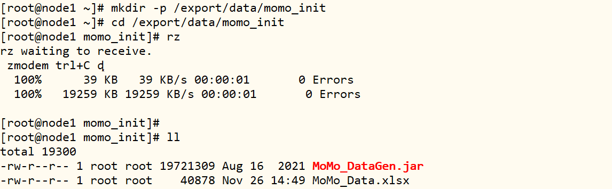

  

- 3、创建模拟数据目录

  ```ini
  mkdir -p /export/data/momo_data
  ```

- 4、运行程序生成数据

  ```ini
  # 1. 语法
  java -jar /export/data/momo_init/MoMo_DataGen.jar 原始数据路径 模拟数据路径 随机产生数据间隔ms时间
    	
  # 2. 测试：每500ms生成一条数据
  java -jar /export/data/momo_init/MoMo_DataGen.jar \
  /export/data/momo_init/MoMo_Data.xlsx \
  /export/data/momo_data \
  500
  
  # 3. 结果
  生成模拟数据文件MOMO_DATA.dat，并且每条数据中字段分隔符为\001
  ```

- 5、查看生成社交数据

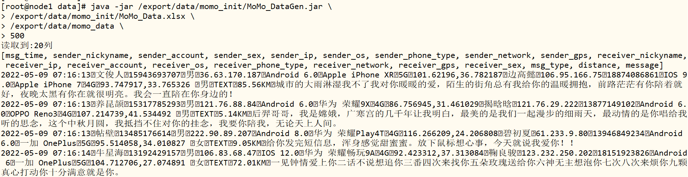

### 2. 实时采集日志

> 使用Flume进行实时采集mm聊天数据，实时写入Kafka消息队列，Agent各部分组件如下：

- **Source**：`taildir`，动态监听多个文件实现实时数据采集；
- **Channel**：`mem`，将数据缓存在内存；
- **Sink**：`KafkaSink`，分布式消息队列

- 1、创建Agent属性配置文件：`momo_mem_kafka.properties`，

  ```ini
  # 创建目录
  mkdir -p /export/data/momo_conf
  
  # 创建配置文件目录
  touch /export/data/momo_conf/momo_mem_kafka.properties
  ```

- 2、编写Agent配置内容

  ```ini
  vim /export/data/momo_conf/momo_mem_kafka.properties
  ```

  ```ini
  # define a1
  a1.sources = s1 
  a1.channels = c1
  a1.sinks = k1
  
  #define s1
  a1.sources.s1.type = TAILDIR
  #指定一个元数据记录文件
  a1.sources.s1.positionFile = /export/data/momo_conf/taildir_momo_kafka.json
  #将所有需要监控的数据源变成一个组
  a1.sources.s1.filegroups = f1
  #指定了f1是谁：监控目录下所有文件
  a1.sources.s1.filegroups.f1 = /export/data/momo_data/.*
  #指定f1采集到的数据的header中包含一个KV对
  a1.sources.s1.headers.f1.type = momo
  a1.sources.s1.fileHeader = true
  
  #define c1
  a1.channels.c1.type = memory
  a1.channels.c1.capacity = 10000
  a1.channels.c1.transactionCapacity = 1000
  
  #define k1
  a1.sinks.k1.type = org.apache.flume.sink.kafka.KafkaSink
  a1.sinks.k1.kafka.topic = momo-msg
  a1.sinks.k1.kafka.bootstrap.servers = node1.itcast.cn:9092,node2.itcast.cn:9092,node3.itcast.cn:9092
  a1.sinks.k1.kafka.flumeBatchSize = 10
  a1.sinks.k1.kafka.producer.acks = 1
  a1.sinks.k1.kafka.producer.linger.ms = 100
  
  #bind
  a1.sources.s1.channels = c1
  a1.sinks.k1.channel = c1
  ```

- 4、启动ZK集群和Kafka集群

  ```ini
  [root@node1 ~]# start-zk.sh  start
  
  [root@node1 ~]# start-kafka.sh 
  ```

  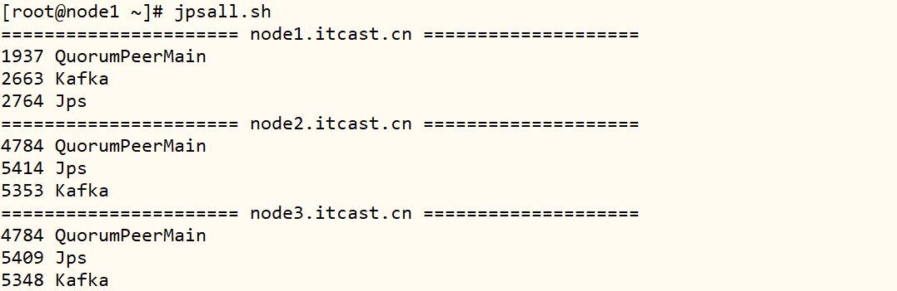

- 5、创建Topic

  ```ini
  /export/server/kafka/bin/kafka-topics.sh --create \
  --topic momo-msg  \
  --partitions 3 \
  --replication-factor 2 \
  --bootstrap-server node1.itcast.cn:9092,node2.itcast.cn:9092,node3.itcast.cn:9092
  ```

- 6、启动Flume程序

  ```shell
  /export/server/flume/bin/flume-ng agent \
  -c /export/server/flume/conf/ \
  -n a1 \
  -f /export/data/momo_conf/momo_mem_kafka.properties \
  -Dflume.root.logger=INFO,console
  ```

- 7、启动模拟数据

  ```ini
  java -jar /export/data/momo_init/MoMo_DataGen.jar \
  /export/data/momo_init/MoMo_Data.xlsx \
  /export/data/momo_data/ \
  500
  ```

- 8、观察Kafka Topic中是否有数据

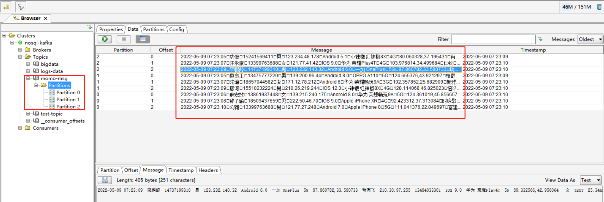

### 3. 实时存储HBase

> 编写Java 程序，调用Kafka ConsumerAPI和HBase Java API，从Kafka Topic队列中实时消费数据，进行解析转换，存储到HBase表中。

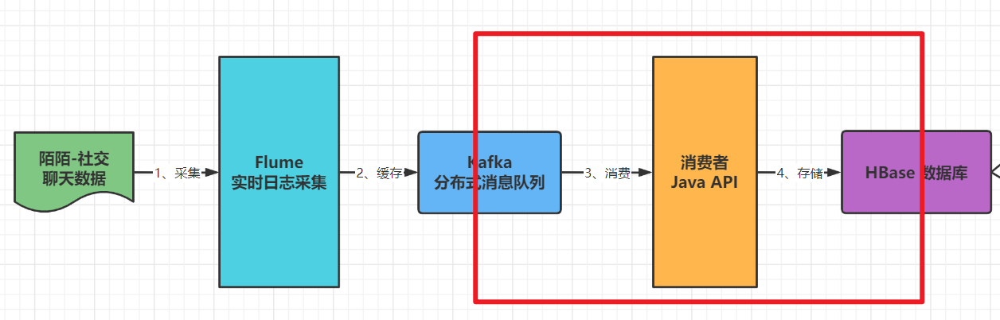

#### HBase 表设计

> mm社交数据存储HBase表，用于即席查询时，主要查询：依据**用户ID + 日期查询** 聊天记录。

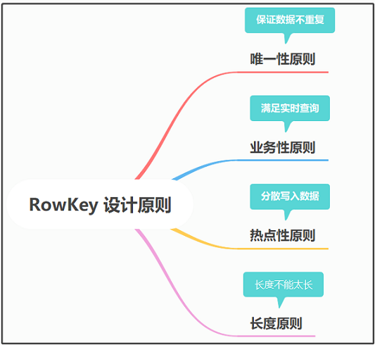

- **Rowkey设计**

  ```ini
  # 查询需求：
  	根据【发件人id、收件人id + 消息日期】查询聊天记录
          发件人账号
          时间
          收件人账号（唯一性）
      RowKey = 发件人id + 消息日期 + 收件人id
      列簇：info
      字段：所有字段，20个字段
    	
  # 设计规则：
  	业务、唯一、长度、散列、组合
  	[唯一性、业务性、热点性（考虑写数据）]
  	
  # 从HBase表查询数据
  	1. RowKey查询最快的：Get
  	2. 前缀匹配查询：Range
  ```

- **建表**

  - 启动HDFS集群、Zookeeper集群和HBase集群

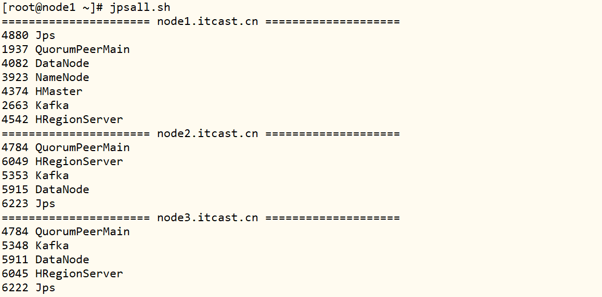

- 进入客户端`hbase shell`

```SQL
  -- 建表
  create 'htbl_momo_msg', {NAME => "info", COMPRESSION => "GZ"}, { NUMREGIONS => 6, SPLITALGO => 'HexStringSplit'}
```

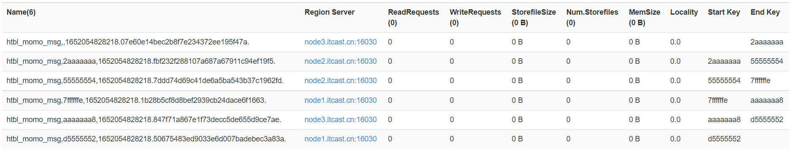

#### 消费Kafka数据

> 创建Java类：MomoKafkaToHBase，调用Kafka Consumer API从Topic队列中消费数据。

```Java
package cn.itcast.momo;

import org.apache.commons.lang3.StringUtils;
import org.apache.kafka.clients.consumer.*;
import org.apache.kafka.common.TopicPartition;

import java.time.Duration;
import java.util.*;

/**
 * 实时程序：从Kafka 消费mm社交数据，解析ETL后，存储HBase表。
 */
public class MomoKafkaToHBase {

	public static void main(String[] args) throws Exception {
		// todo: 1. 从Kafka Topic队列实时消费数据
		// 1-1. 设置Kafka消费属性
		Properties props = new Properties();
		props.put(ConsumerConfig.BOOTSTRAP_SERVERS_CONFIG, "node1.itcast.cn:9092,node2.itcast.cn:9092,node3.itcast.cn:9092");
		props.put(ConsumerConfig.KEY_DESERIALIZER_CLASS_CONFIG, "org.apache.kafka.common.serialization.StringDeserializer");
		props.put(ConsumerConfig.VALUE_DESERIALIZER_CLASS_CONFIG, "org.apache.kafka.common.serialization.StringDeserializer");
		props.put(ConsumerConfig.GROUP_ID_CONFIG, "gid-momo-2");
		props.put(ConsumerConfig.AUTO_OFFSET_RESET_CONFIG, "latest");
		props.put(ConsumerConfig.ENABLE_AUTO_COMMIT_CONFIG, "false");
		// 1-2. 创建KafkaConsumer连接对象
		KafkaConsumer<String, String> kafkaConsumer = new KafkaConsumer<>(props);
		// 1-3. 设置消费Topic
		kafkaConsumer.subscribe(Collections.singletonList("momo-msg"));
		// 1-4. 实时拉取pull数据
		while (true){
			// 向Kafka请求拉取数据，等待Kafka响应，在100ms以内如果响应，就拉取数据，如果100ms内没有响应，就提交下一次请求
			ConsumerRecords<String, String> consumerRecords = kafkaConsumer.poll(Duration.ofMillis(100));
			/*
				todo: 1-5. 获取每个分区数据，存储HBase表，最后手动提交分区偏移量
			 */
			// a. 获取所有分区信息
			Set<TopicPartition> partitions = consumerRecords.partitions();
			// b. 循环遍历分区信息，获取每个分区数据
			for (TopicPartition partition : partitions) {
				// c. 依据分区信息，获取分区数据
				List<ConsumerRecord<String, String>> records = consumerRecords.records(partition);
				// d. 循环遍历分区数据，获取每天数据单独处理
				long consumerOffset = 0L ;
				for (ConsumerRecord<String, String> record : records) {
					// 获取信息Message
					String message = record.value();
					System.out.println(message);

					// todo: 2. 实时存储数据至HBase表
					if(StringUtils.isNotEmpty(message) && message.split("\001").length == 20){
						writeMessageToHBase(message) ;
					}

					// 获取偏移量
					consumerOffset = record.offset();
				}
				// e. 手动提交分区偏移量
				Map<TopicPartition, OffsetAndMetadata> offsets = Collections.singletonMap(
					partition, new OffsetAndMetadata(consumerOffset + 1)
				);
				kafkaConsumer.commitSync(offsets);
			}
		}
	}

}
```

#### 数据写入HBase

> 定义方法：writeMessageToHBase，传入每条社交信息数据，解析转换封装Put对象，写入Hbase表。

- 获取HBase Table对象，定义静态变量和静态代码块

```Java
import org.apache.hadoop.conf.Configuration;
import org.apache.hadoop.hbase.HBaseConfiguration;
import org.apache.hadoop.hbase.TableName;
import org.apache.hadoop.hbase.client.Connection;
import org.apache.hadoop.hbase.client.ConnectionFactory;
import org.apache.hadoop.hbase.client.Table;
import org.apache.hadoop.hbase.util.Bytes;	
```

```Java
	private static TableName tableName = TableName.valueOf("htbl_momo_msg");
	private static byte[] cfBytes = Bytes.toBytes("info");
	private static Table table;

	// todo: 静态代码块, 构建HBase连接
	static {
		try {
			// 构建配置对象
			Configuration conf = HBaseConfiguration.create();
			conf.set("hbase.zookeeper.quorum", "node1.itcast.cn,node2.itcast.cn,node3.itcast.cn");
			// 构建连接
			Connection conn = ConnectionFactory.createConnection(conf);
			// 获取表对象
			table = conn.getTable(tableName);
		} catch (Exception e) {
			e.printStackTrace();
		}
	}
```

- 转换Message为Put对象，插入HBase表

```Java
import org.apache.hadoop.hbase.client.Put;
import org.apache.hadoop.hbase.util.Bytes;
```

```Java
	/**
	 * 将mm社交聊天数据实时写入HBase表中： message 消息 -> Put 对象 -> 写入表
	 */
	private static void writeMessageToHBase(String message) throws Exception {
		// step1. 分割数据
		String[] items = message.split("\001");

		// step2. 构建RowKey
		/*
            RowKey = 发件人id + 消息日期 + 收件人id
		 */
		String senderAccount = items[2] ;
		String msgTime = items[0] ;
		String receiverAccount = items[11] ;
		String rowKey = StringUtils.reverse(senderAccount) + "_" + msgTime + "_" + receiverAccount ;

		// step3. 创建Put对象
		Put put = new Put(Bytes.toBytes(rowKey)) ;

		// step4. 添加列
		put.addColumn(cfBytes, Bytes.toBytes("msg_time"), Bytes.toBytes(items[0]));
		put.addColumn(cfBytes, Bytes.toBytes("sender_nickyname"), Bytes.toBytes(items[1]));
		put.addColumn(cfBytes, Bytes.toBytes("sender_account"), Bytes.toBytes(items[2]));
		put.addColumn(cfBytes, Bytes.toBytes("sender_sex"), Bytes.toBytes(items[3]));
		put.addColumn(cfBytes, Bytes.toBytes("sender_ip"), Bytes.toBytes(items[4]));
		put.addColumn(cfBytes, Bytes.toBytes("sender_os"), Bytes.toBytes(items[5]));
		put.addColumn(cfBytes, Bytes.toBytes("sender_phone_type"), Bytes.toBytes(items[6]));
		put.addColumn(cfBytes, Bytes.toBytes("sender_network"), Bytes.toBytes(items[7]));
		put.addColumn(cfBytes, Bytes.toBytes("sender_gps"), Bytes.toBytes(items[8]));
		put.addColumn(cfBytes, Bytes.toBytes("receiver_nickyname"), Bytes.toBytes(items[9]));
		put.addColumn(cfBytes, Bytes.toBytes("receiver_ip"), Bytes.toBytes(items[10]));
		put.addColumn(cfBytes, Bytes.toBytes("receiver_account"), Bytes.toBytes(items[11]));
		put.addColumn(cfBytes, Bytes.toBytes("receiver_os"), Bytes.toBytes(items[12]));
		put.addColumn(cfBytes, Bytes.toBytes("receiver_phone_type"), Bytes.toBytes(items[13]));
		put.addColumn(cfBytes, Bytes.toBytes("receiver_network"), Bytes.toBytes(items[14]));
		put.addColumn(cfBytes, Bytes.toBytes("receiver_gps"), Bytes.toBytes(items[15]));
		put.addColumn(cfBytes, Bytes.toBytes("receiver_sex"), Bytes.toBytes(items[16]));
		put.addColumn(cfBytes, Bytes.toBytes("msg_type"), Bytes.toBytes(items[17]));
		put.addColumn(cfBytes, Bytes.toBytes("distance"), Bytes.toBytes(items[18]));
		put.addColumn(cfBytes, Bytes.toBytes("message"), Bytes.toBytes(items[19]));

		// step5. 执行写入
		table.put(put);
	}

```

- 运行Java程序：MomoKafkaToHBase，并且运行Flume Agent和模拟产生社交聊天数据。

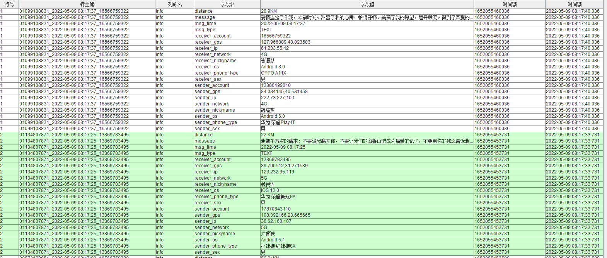

### 4. Hive离线分析

> **使用Hive关联Hbase实现离线分析**


- 1、启动服务：YARN和Hive

  ```ini
  #启动YARN
  start-yarn.sh
  
  #先启动metastore服务
  start-metastore.sh
  #然后启动hiveserver
  start-hiveserver2.sh
  
  #然后启动beeline
  /export/server/hive/bin/beeline
  !connect jdbc:hive2://node1.itcast.cn:10000
  root 123456
  ```

- 2、Hive创建表，关联HBase表

  ```sql
  CREATE EXTERNAL TABLE IF NOT EXISTS tbl_momo_msg (
    id string,
    msg_time string ,
    sender_nickyname string ,
    sender_account string ,
    sender_sex string ,
    sender_ip string ,
    sender_os string ,
    sender_phone_type string ,
    sender_network string ,
    sender_gps string ,
    receiver_nickyname string ,
    receiver_ip string ,
    receiver_account string ,
    receiver_os string ,
    receiver_phone_type string ,
    receiver_network string ,
    receiver_gps string ,
    receiver_sex string ,
    msg_type string ,
    distance string ,
    message string
  ) stored by 'org.apache.hadoop.hive.hbase.HBaseStorageHandler'
  with serdeproperties('hbase.columns.mapping'=':key,info:msg_time,info:sender_nickyname, info:sender_account,info:sender_sex,info:sender_ip,info:sender_os,info:sender_phone_type,info:sender_network,info:sender_gps,info:receiver_nickyname,info:receiver_ip,info:receiver_account,info:receiver_os,info:receiver_phone_type,info:receiver_network,info:receiver_gps,info:receiver_sex,info:msg_type,info:distance,info:message') tblproperties('hbase.table.name'='htbl_momo_msg');
  ```

- 3、**分析查询**

  ```sql
  -- 基础查询
  SELECT id, msg_time, sender_nickyname,receiver_nickyname, distance
  FROM momo_msg 
  LIMIT 10;
  
  
  -- 统计每个小时的消息数
  SELECT SUBSTR(msg_time, 0, 13) AS hour, count(*) AS total
  FROM momo_msg
  GROUP BY SUBSTR(msg_time, 0, 13);
  ```

### 5. Phoenix即席查询

> **使用Phoenix关联Hbase实现即时查询**

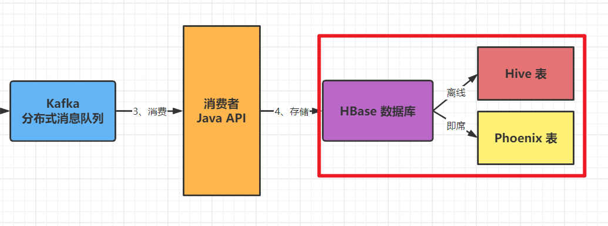

- 1、服务启动

  ```ini
  /export/server/phoenix/bin/sqlline.py node1.itcast.cn,node2.itcast.cn,node3.itcast.cn:2181
  ```

- 2、创建视图view，关联HBase表

  ```sql
  CREATE VIEW IF NOT EXISTS "momo_msg" (
      "rk" varchar primary key,
      "info"."msg_time" varchar ,
      "info"."sender_nickyname" varchar ,
      "info"."sender_account" varchar ,
      "info"."sender_sex" varchar ,
      "info"."sender_ip" varchar ,
      "info"."sender_os" varchar ,
      "info"."sender_phone_type" varchar ,
      "info"."sender_network" varchar ,
      "info"."sender_gps" varchar ,
      "info"."receiver_nickyname" varchar ,
      "info"."receiver_ip" varchar ,
      "info"."receiver_account" varchar ,
      "info"."receiver_os" varchar ,
      "info"."receiver_phone_type" varchar ,
      "info"."receiver_network" varchar ,
      "info"."receiver_gps" varchar ,
      "info"."receiver_sex" varchar ,
      "info"."msg_type" varchar ,
      "info"."distance" varchar ,
      "info"."message" varchar
      );
  ```

- 3、**即时查询**

  ```sql
  -- 基础查询
  SELECT
      "id", "info"."sender_account", "info"."receiver_account"
  FROM momo_msg
  LIMIT 10;
  
  -- 查询每个发送人发送的消息数
  SELECT
      "info"."sender_account" ,
      count(*) as total
  FROM momo_msg
  GROUP BY "info"."sender_account"
  ORDER BY total DESC
  LIMIT 10;
  
  -- 查询每个发送人聊天的人数
  SELECT
      "info"."sender_account" ,
      COUNT(DISTINCT "info"."receiver_account") AS total
  FROM momo_msg
  GROUP BY "info"."sender_account"
  ORDER BY total DESC LIMIT 10;
  ```

## 附录:

### 1. 案例Maven依赖

- 创建Maven Module模块

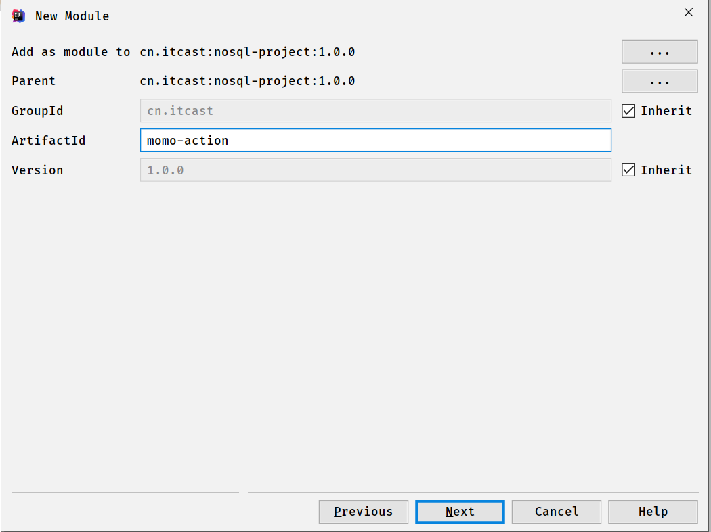

- pom文件添加依赖

```xml
    <!--远程仓库-->
    <repositories>
        <repository>
            <id>aliyun</id>
            <url>http://maven.aliyun.com/nexus/content/groups/public/</url>
            <releases><enabled>true</enabled></releases>
            <snapshots>
                <enabled>false</enabled>
                <updatePolicy>never</updatePolicy>
            </snapshots>
        </repository>
    </repositories>

    <dependencies>

        <!--Hbase 客户端-->
        <dependency>
            <groupId>org.apache.hbase</groupId>
            <artifactId>hbase-client</artifactId>
            <version>2.1.0</version>
        </dependency>

        <!--kafka 客户端-->
        <dependency>
            <groupId>org.apache.kafka</groupId>
            <artifactId>kafka-clients</artifactId>
            <version>2.4.1</version>
        </dependency>

    </dependencies>

    <build>
        <plugins>
            <plugin>
                <groupId>org.apache.maven.plugins</groupId>
                <artifactId>maven-compiler-plugin</artifactId>
                <version>3.1</version>
                <configuration>
                    <target>1.8</target>
                    <source>1.8</source>
                </configuration>
            </plugin>
        </plugins>
    </build>
```

### 2. 完整代码

> 综合案例中，编写Java程序，实时从Kafka消费数据，进行ETL转换后，存储到HBase表，完整代码。

```Java
package cn.itcast.momo;

import org.apache.commons.lang3.StringUtils;
import org.apache.hadoop.conf.Configuration;
import org.apache.hadoop.hbase.HBaseConfiguration;
import org.apache.hadoop.hbase.TableName;
import org.apache.hadoop.hbase.client.Connection;
import org.apache.hadoop.hbase.client.ConnectionFactory;
import org.apache.hadoop.hbase.client.Put;
import org.apache.hadoop.hbase.client.Table;
import org.apache.hadoop.hbase.util.Bytes;
import org.apache.kafka.clients.consumer.*;
import org.apache.kafka.common.TopicPartition;

import java.time.Duration;
import java.util.*;

/**
 * 实时程序：从Kafka 消费社交数据，解析ETL后，存储HBase表。
 */
public class MomoKafkaToHBase {

	private static TableName tableName = TableName.valueOf("htbl_momo_msg");
	private static byte[] cfBytes = Bytes.toBytes("info");
	private static Table table;

	// todo: 静态代码块, 构建HBase连接
	static {
		try {
			// 构建配置对象
			Configuration conf = HBaseConfiguration.create();
			conf.set("hbase.zookeeper.quorum", "node1.itcast.cn,node2.itcast.cn,node3.itcast.cn");
			// 构建连接
			Connection conn = ConnectionFactory.createConnection(conf);
			// 获取表对象
			table = conn.getTable(tableName);
		} catch (Exception e) {
			e.printStackTrace();
		}
	}

	public static void main(String[] args) throws Exception {
		// todo: 1. 从Kafka Topic队列实时消费数据
		// 1-1. 设置Kafka消费属性
		Properties props = new Properties();
		props.put(ConsumerConfig.BOOTSTRAP_SERVERS_CONFIG, "node1.itcast.cn:9092,node2.itcast.cn:9092,node3.itcast.cn:9092");
		props.put(ConsumerConfig.KEY_DESERIALIZER_CLASS_CONFIG, "org.apache.kafka.common.serialization.StringDeserializer");
		props.put(ConsumerConfig.VALUE_DESERIALIZER_CLASS_CONFIG, "org.apache.kafka.common.serialization.StringDeserializer");
		props.put(ConsumerConfig.GROUP_ID_CONFIG, "gid-momo-2");
		props.put(ConsumerConfig.AUTO_OFFSET_RESET_CONFIG, "latest");
		props.put(ConsumerConfig.ENABLE_AUTO_COMMIT_CONFIG, "false");
		// 1-2. 创建KafkaConsumer连接对象
		KafkaConsumer<String, String> kafkaConsumer = new KafkaConsumer<>(props);
		// 1-3. 设置消费Topic
		kafkaConsumer.subscribe(Collections.singletonList("momo-msg"));
		// 1-4. 实时拉取pull数据
		while (true){
			// 向Kafka请求拉取数据，等待Kafka响应，在100ms以内如果响应，就拉取数据，如果100ms内没有响应，就提交下一次请求
			ConsumerRecords<String, String> consumerRecords = kafkaConsumer.poll(Duration.ofMillis(100));
			/*
				todo: 1-5. 获取每个分区数据，存储HBase表，最后手动提交分区偏移量
			 */
			// a. 获取所有分区信息
			Set<TopicPartition> partitions = consumerRecords.partitions();
			// b. 循环遍历分区信息，获取每个分区数据
			for (TopicPartition partition : partitions) {
				// c. 依据分区信息，获取分区数据
				List<ConsumerRecord<String, String>> records = consumerRecords.records(partition);
				// d. 循环遍历分区数据，获取每天数据单独处理
				long consumerOffset = 0L ;
				for (ConsumerRecord<String, String> record : records) {
					// 获取信息Message
					String message = record.value();
					System.out.println(message);

					// todo: 2. 实时存储数据至HBase表
					if(StringUtils.isNotEmpty(message) && message.split("\001").length == 20){
						writeMessageToHBase(message) ;
					}

					// 获取偏移量
					consumerOffset = record.offset();
				}
				// e. 手动提交分区偏移量
				Map<TopicPartition, OffsetAndMetadata> offsets = Collections.singletonMap(
					partition, new OffsetAndMetadata(consumerOffset + 1)
				);
				kafkaConsumer.commitSync(offsets);
			}
		}
	}

	/**
	 * 将社交聊天数据实时写入HBase表中： message 消息 -> Put 对象 -> 写入表
	 */
	private static void writeMessageToHBase(String message) throws Exception {
		// step1. 分割数据
		String[] items = message.split("\001");

		// step2. 构建RowKey
		/*
            RowKey = 发件人id + 消息日期 + 收件人id
		 */
		String senderAccount = items[2] ;
		String msgTime = items[0] ;
		String receiverAccount = items[11] ;
		String rowKey = StringUtils.reverse(senderAccount) + "_" + msgTime + "_" + receiverAccount ;

		// step3. 创建Put对象
		Put put = new Put(Bytes.toBytes(rowKey)) ;

		// step4. 添加列
		put.addColumn(cfBytes, Bytes.toBytes("msg_time"), Bytes.toBytes(items[0]));
		put.addColumn(cfBytes, Bytes.toBytes("sender_nickyname"), Bytes.toBytes(items[1]));
		put.addColumn(cfBytes, Bytes.toBytes("sender_account"), Bytes.toBytes(items[2]));
		put.addColumn(cfBytes, Bytes.toBytes("sender_sex"), Bytes.toBytes(items[3]));
		put.addColumn(cfBytes, Bytes.toBytes("sender_ip"), Bytes.toBytes(items[4]));
		put.addColumn(cfBytes, Bytes.toBytes("sender_os"), Bytes.toBytes(items[5]));
		put.addColumn(cfBytes, Bytes.toBytes("sender_phone_type"), Bytes.toBytes(items[6]));
		put.addColumn(cfBytes, Bytes.toBytes("sender_network"), Bytes.toBytes(items[7]));
		put.addColumn(cfBytes, Bytes.toBytes("sender_gps"), Bytes.toBytes(items[8]));
		put.addColumn(cfBytes, Bytes.toBytes("receiver_nickyname"), Bytes.toBytes(items[9]));
		put.addColumn(cfBytes, Bytes.toBytes("receiver_ip"), Bytes.toBytes(items[10]));
		put.addColumn(cfBytes, Bytes.toBytes("receiver_account"), Bytes.toBytes(items[11]));
		put.addColumn(cfBytes, Bytes.toBytes("receiver_os"), Bytes.toBytes(items[12]));
		put.addColumn(cfBytes, Bytes.toBytes("receiver_phone_type"), Bytes.toBytes(items[13]));
		put.addColumn(cfBytes, Bytes.toBytes("receiver_network"), Bytes.toBytes(items[14]));
		put.addColumn(cfBytes, Bytes.toBytes("receiver_gps"), Bytes.toBytes(items[15]));
		put.addColumn(cfBytes, Bytes.toBytes("receiver_sex"), Bytes.toBytes(items[16]));
		put.addColumn(cfBytes, Bytes.toBytes("msg_type"), Bytes.toBytes(items[17]));
		put.addColumn(cfBytes, Bytes.toBytes("distance"), Bytes.toBytes(items[18]));
		put.addColumn(cfBytes, Bytes.toBytes("message"), Bytes.toBytes(items[19]));

		// step5. 执行写入
		table.put(put);
	}

}
```


