# I. 缺失值处理

1. ## 加载数据集

    1）加载 `titanic_train.csv` 数据集

    ```python
    # 加载数据
    train = pd.read_csv('./data/titanic_train.csv')
    pirnt(train.shape)
    train.head()
    ```

    

    **字段介绍**：

    | 字段名        | 说明                               |
    | ------------- | ---------------------------------- |
    | `PassengerId` | 乘客的ID                           |
    | `Survived`    | 乘客是否获救，0：没获救，1：已获救 |
    | `Pclass`      | 乘客船舱等级（1/2/3三个等级舱位）  |
    | `Name`        | 乘客姓名                           |
    | `Sex`         | 性别                               |
    | `Age`         | 年龄                               |
    | `SibSp`       | 乘客在船上的兄弟姐妹/配偶数量      |
    | `Parch`       | 乘客在船上的父母/孩子数量          |
    | `Ticket`      | 船票号                             |
    | `Fare`        | 船票价                             |
    | `Cabin`       | 客舱号码                           |
    | `Embarked`    | 登船的港口                         |

    #### 构造缺失值统计的函数

    ```python
    def missing_values_table(df):
        # 计算所有的缺失值
        mis_val = df.isnull().sum()
    
        # 计算缺失值的比例
        mis_val_percent = 100 * mis_val / len(df)
    
        # 将结果拼接成 DataFrame
        mis_val_table = pd.concat([mis_val, mis_val_percent], axis=1)
    
        # 将列重命名
        mis_val_table.columns = ['缺失值', '占比(%)']
    
        # 将缺失值为0的列去除，并按照缺失值占比进行排序
        mis_val_table_sorted = mis_val_table[mis_val_table['缺失值']!=0].sort_values(
            '占比(%)', ascending=False)
    
        # 打印信息
        print(f'传入的数据集共{df.shape[1]}列，\n其中{mis_val_table_sorted.shape[0]}列有缺失值')
    
        return mis_val_table_sorted
    ```

    #### 查看数据集中的缺失值情况

    ```python
    # 查看缺失值情况
    missing_values_table(train)
    ```

    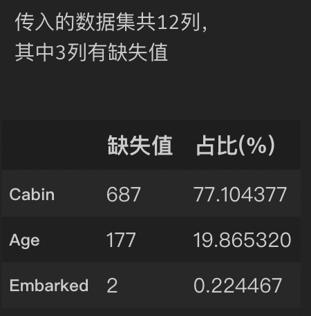

2. ## 缺失值处理方式概述

    

3. ## 删除缺失值(不建议使用)

    > 删除缺失值：删除缺失值会损失信息，并不推荐删除，当缺失数据占比较低的时候，可以尝试使用删除缺失值

    1）按行删除：删除指定列为缺失值的行记录

    ```python
    # 复制一份数据
    train_cp = train.copy() 
    # 对Age列进行处理，空值就删除整行数据
    train_cp.dropna(subset=['Age'], how='any', inplace=True)
    # 输出Age列缺失值的总数
    print(train_cp['Age'].isnull().sum())
    # 图形化缺失值情况
    msno.matrix(train_cp)
    ```

    

    补充内容：dropna的参数

    > df.dropna(axis=0, how='any', thresh=None, subset=None, inplace=False)
    >
    > 参数说明：
    >
    > - 可选参数subset：不与thresh参数一起使用：接收一个列表，列表中的元素为列名: 对特定的列进行缺失值删除处理
    > - 可选参数thresh：参数为int类型，按行去除NaN值，去除NaN值后该行剩余数值的数量（列数）大于等于n，便保留这一行
    > - 可选参数axis：默认为0，设置为 0 或 'index' 表示按行删除，设置为 1 或 'columns' 表示按列删除
    > - 可选参数how：默认为'any'，表示如果存在NA值，则删除该行或列，设置为'all'，表示所有值都是NA，则删除该行或列
    > - 可选参数inplace：表示是否修改变原始的数据集，默认为False，可以设置为True

    2）按列删除：当一列包含了很多缺失值的时候（比如超过80%），可以使用df.drop(['列名',..], axis=1)函数将指定列删除，但最好不要删除数据

    ```python
    # 复制一份数据
    train_cp = train.copy() 
    # 对Age列进行处理，空值就删除整行数据
    train_cp.drop(['Age'], axis=1, inplace=True)
    # 图形化缺失值情况
    msno.matrix(train_cp)
    ```

    

    > 注意：Age 列没有了!!!

4. ## 非时序数据填充缺失值

    > 填充缺失值（非时间序列数据）：填充缺失值是指用一个估算的值来去替代缺失值

    1）使用常量来替换（默认值）

    ```python
    # 复制一份数据
    train_constant = train.copy()
    # 计算各列空值总数
    print('填充缺失值之前：')
    print(train_constant.isnull().sum())
    
    # 将空值都填为0，inplace=True为必要参数
    train_constant.fillna(0, inplace=True)
    
    # 计算各列空值总数
    print('填充缺失值之后：')
    print(train_constant.isnull().sum())
    ```

    

    2）使用统计量替换（缺失值所处列的平均值、中位数、众数）

    ```python
    # 复制一份数据
    train_mean = train.copy()
    # 计算年龄的平均值
    age_mean = train_mean['Age'].mean()
    print(age_mean)
    # 使用年龄的平均值填充 Age 列的缺失值
    train_mean['Age'].fillna(age_mean, inplace=True)
    train_mean.isnull().sum()
    ```

    

5. ## 时序数据缺失值处理

    时序数据在某一列值的变化往往有一定线性规律，绝大多数的时序数据，具体的列值随着时间的变化而变化，所以对于有时序的行数据缺失值处理有三种方式：

    - 用时间序列中空值的上一个非空值填充
    - 用时间序列中空值的下一个非空值填充
    - 线性插值方法

    1）加载样例时序数据集 `city_day.csv`，该数据集为印度城市空气质量数据（2015-2020）

    ```python
    city_day = pd.read_csv('./data/city_day.csv', parse_dates=True, index_col='Date')
    # 复制一份数据
    city_day_cp = city_day.copy()
    # 查看数据的前 5 行
    city_day_cp.head()
    ```

    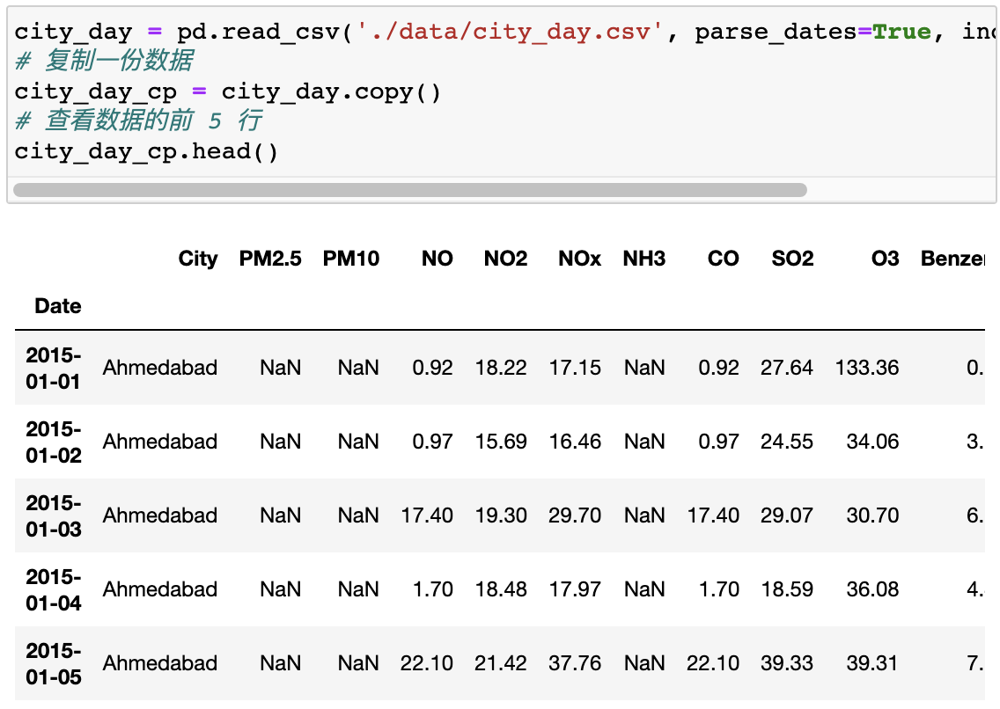

    2）用之前封装的方法（本章3.2.2小节），查看数据缺失情况：

    ```python
    city_day_missing = missing_values_table(city_day_cp)
    city_day_missing
    ```

    

    结果说明：

    - 我们可以观察到数据中有很多缺失值，比如Xylene有超过60%的缺失值（二甲苯），PM10 有超过30%的缺失值

    3）使用`fillna`函数中的`ffill`参数，用时间序列中空值的上一个非空值填充

    ```python
    # 截取一小部分数据用于填充效果查看
    city_day['Xylene'][50:64]
    ```

    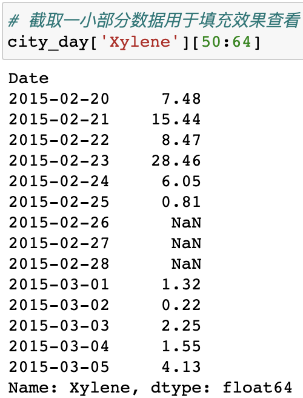

    ```python
    # 填充缺失值
    city_day.fillna(method='ffill', inplace=True)
    # 截取一小部分数据查看填充效果
    city_day['Xylene'][50:64]
    ```

    

    4）上面填充了缺失值之后，再次查看缺失值情况

    ```python
    # 查看缺失值比例
    missing_values_table(city_day)
    ```

    

    5）使用`fillna`函数中的`bfill`参数，用时间序列中空值的下一个非空值填充

    ```python
    # 截取一小部分数据用于填充效果查看
    city_day['AQI'][20:30]
    ```

    

    ```python
    # 填充缺失值
    city_day.fillna(method='bfill', inplace=True)
    # 截取一小部分数据查看填充效果
    city_day['AQI'][20:30]
    ```

    

    6）上面填充了缺失值之后，再次查看缺失值情况

    ```python
    # 查看缺失值比例
    missing_values_table(city_day)
    ```

    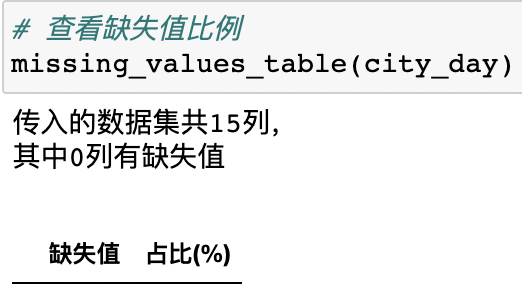

    7）使用`df.interpolate(limit_direction="both", inplace=True)` 对缺失数据进行线性填充

    - 绝大多数的时序数据，具体的列值随着时间的变化而变化。 因此，使用bfill和ffill进行插补并不是解决缺失值问题的最优方案。
    - 线性插值法是一种插补缺失值技术，它假定数据点之间存在严格的线性关系，并利用相邻数据点中的非缺失值来计算缺失数据点的值

    ```python
    # 截取一小部分数据用于填充效果查看
    city_day_cp['Xylene'][50:65]
    ```

    

    ```python
    # 线性插值填充
    city_day_cp.interpolate(limit_direction='both', inplace=True)
    # 截取一小部分数据用于查看填充效果
    city_day_cp['Xylene'][50:65]
    ```

    

6. ## 其它填充缺失值的方法

    > ##### 上面介绍的线性填充缺失值的方法，其本质就是机器学习算法预测；当然还有其他机器学习算法可以用来做缺失值的计算，绝大多数场景只需要我们掌握上述缺失值填充的办法即可；一旦无法用上述办法来解决问题，那么将交由算法工程师来解决

# II. apply自定义函数

1. ## apply函数简介

    pandas 的 `apply()` 函数可以作用于 `Series` 或者整个 `DataFrame`，功能也是自动遍历整个 `Series` 或者 `DataFrame`，对每一个元素运行指定的函数。

    1. pandas 提供了很多数据处理的 API，但当提供的 API 不能满足需求的时候，需要自己编写数据处理函数, 这个时候可以使用 apply 函数

    2. apply 函数可以接收一个自定义函数，可以将 DataFrame 的行或列数据传递给自定义函数处理

    3. apply 函数类似于编写一个 for 循环，遍历行、列的每一个元素, 但比使用 for 循环效率高很多

2. ## Series的apply方法

    > ##### Series 有一个 apply 方法，该方法有一个 func 参数，当传入一个函数后，apply 方法就会把传入的函数应用于Series 的每个元素.

    1）创建一个 DataFrame 数据集，准备数据

    ```python
    df = pd.DataFrame({'a': [10, 20, 30], 'b': [20, 30, 40]})
    df
    ```

    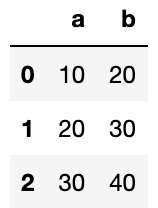

    2）创建一个自定义函数

    ```python
    def my_sq(x):
        """求平方"""
        return x ** 2
    ```

    3）使用 `apply` 方法进行数据处理

    ```python
    # 注意：series.apply(函数名)
    df['a'].apply(my_sq)
    ```

    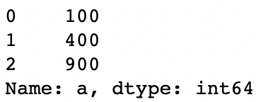

    4）series 的 `apply` 还可以接收多个参数

    ```python
    def my_add(x, n):
        """求和"""
        return x + n
    
    # 注意：args 参数必须是一个元组，这里 3 是传递给 n 的
    df['a'].apply(my_add, args=(3,))
    ```

    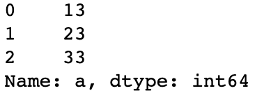

    ```python
    # 使用 apply 时，也可直接指定参数 n 的值
    df['a'].apply(my_add, n=3)
    ```

    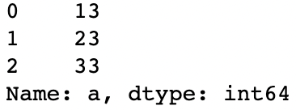

3. ## DataFrame的apply方法

    > DataFrame 的 apply 函数用法和 Series的用法基本一致，当传入一个函数后，apply 方法就会把传入的函数应用于 DataFrame 的行或列

    1. ### 按列执行

        1）首先定义一个处理函数

        ```python
        def sub_one(x):
            """减1操作"""
            print(x)
            return x - 1
        ```

        2）针对 `df` 进行 `apply` 操作，默认按列执行

        ```python
        # 按列计算
        df.apply(sub_one)
        ```

        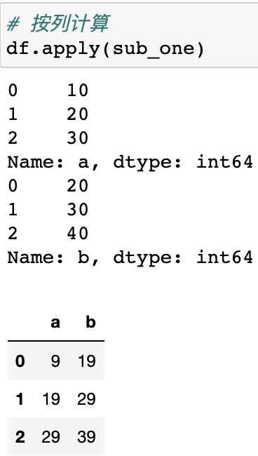

    2. ### 按行执行

        > DataFrame 的 apply 函数有一个 `axis` 参数，默认值为 0，表示按列执行；可以设置为`axis=1` ，表示按行执行

        1）针对 `df` 进行 `apply` 操作，设置按行执行

        ```python
        # 按行计算
        df.apply(sub_one, axis=1)
        ```

        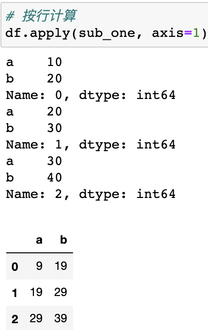

    3. ### 每一个值都执行

        > DataFrame 还有一个 applymap 函数，applymap 也有一个 func 参数接收一个函数，针对 DataFrame 每个值应用 func 指定的函数进行操作，分别返回的结果构成新的 DataFrame 对象
        >
        > 注意：applymap函数是 DataFrame 独有的，Series 没有这个方法

        ```python
        # sub_one 应用于 df 中的每个元素
        df.applymap(sub_one)
        ```

        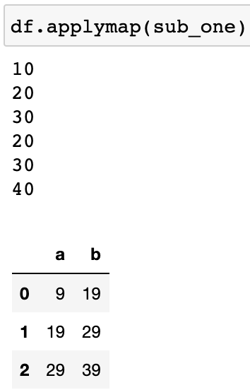

4. ## apply使用案例

    > 接下来我们通过一个数据集 `titanic.csv`，应用 apply 函数计算缺失值的占比以及非空值占比

    ### 4.1 加载数据初步查看缺失情况

    1）加载`titanic.csv`数据集，通过`df.info()`函数来查看数据集基本信息，从中发现缺失值

    ```python
    titanic = pd.read_csv('./data/titanic.csv')
    titanic.info()
    ```

    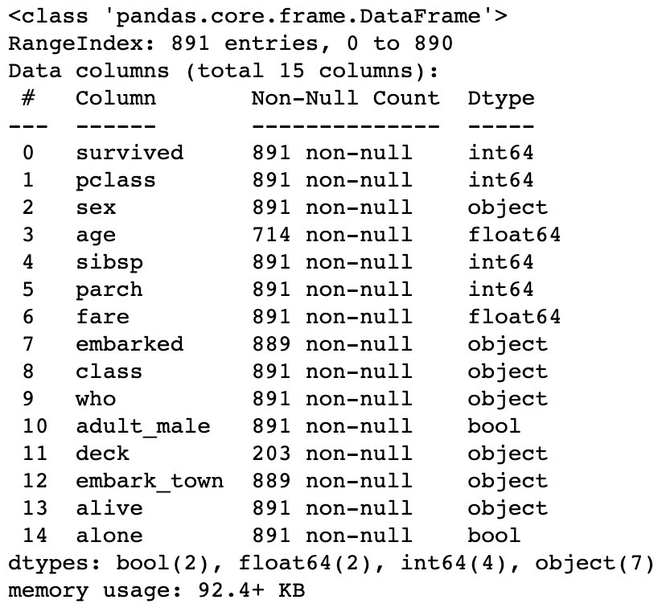

    ### 4.2 完成自定义函数

    通过观察发现有 4 列数据存在缺失值，age 和 deck 两列缺失值较多；此时我们就来完成几个自定义函数，分别来计算：

    - 缺失值总数
    - 缺失值占比
    - 非缺失值占比

    1）缺失值数目

    ```python
    def count_missing(vec):
        """计算缺失值的个数"""
        return vec.isnull().sum()
    ```

    2）缺失值占比

    ```python
    def prop_missing(vec):
        """计算缺失值的比例"""
        return count_missing(vec) / vec.size
    ```

    3）非缺失值占比

    ```python
    def prop_complete(vec):
        """计算非缺失值的比例"""
        return 1 - prop_missing(vec)
    ```

    ### 4.3 计算每一列缺失值及非空值的占比

    1）计算数据集中每列的缺失值

    ```python
    titanic.apply(count_missing)
    ```

    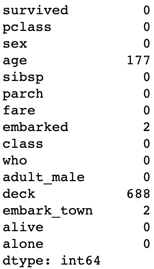

    2）计算数据集中每列的缺失值比例

    ```python
    titanic.apply(prop_missing)
    ```

    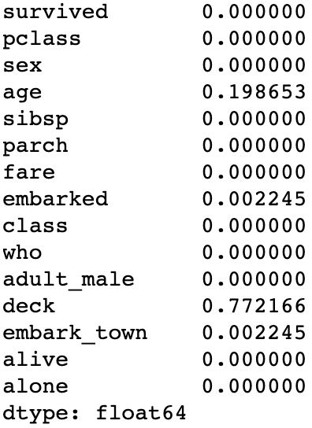

    3）计算数据集中每列的非缺失值比例

    ```python
    titanic.apply(prop_complete)
    ```

    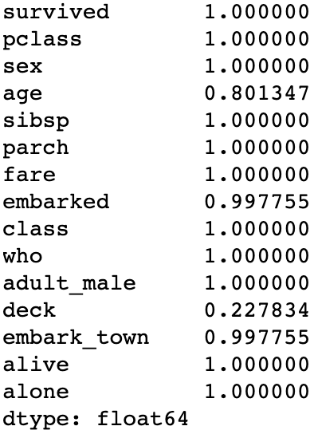

    ### 4.4 计算每一行缺失值及非空值的占比

    1）计算数据集中每行的缺失值

    ```python
    titanic.apply(count_missing, axis=1)
    ```

    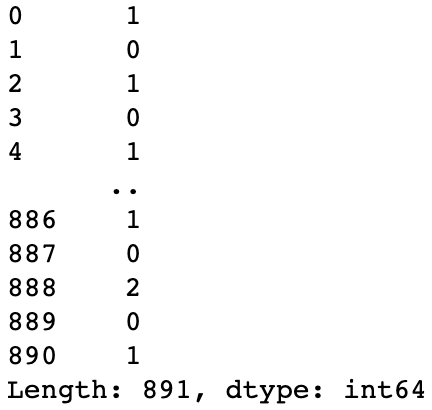

    2）计算数据集中每行的缺失值比例

    ```python
    titanic.apply(prop_missing, axis=1)
    ```

    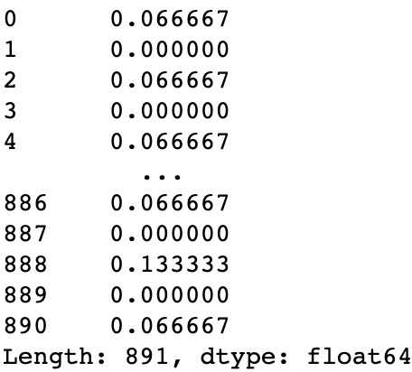

    3）计算数据集中每行的非缺失值比例

    ```python
    titanic.apply(prop_complete, axis=1)
    ```

    

    ### 4.5 按缺失值数量分别统计有多少行

    ```python
    titanic.apply(count_missing, axis=1).value_counts()
    ```

    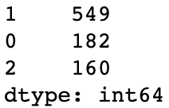

5. ## 数据向量化

    ```python
    # 标量: 一个单独的数值, 如1,2,3...
    # 向量: 一个一维数组, 如[1,2,3]
    # 矩阵, 一个二维数组, 如[[1,2,3],[4,5,6]]
    # 张量: 更高维度的数组
    # 默认向量和标量不能比较
    ```

    1）创建一个 DataFrame

    ```python
    df = pd.DataFrame({
        'a': [10, 20, 30],
        'b': [20, 30, 40]
    })
    df
    ```

    

    2）此时我们创建一个函数，两个 series 计算求和

    ```python
    def add_vec(x, y):
        return x + y
    
    add_vec(df['a'], df['b'])
    ```

    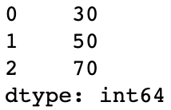

    3）稍微修改一下函数，只加一个判断条件

    ```python
    def add_vec_2(x, y):
        if x != 0:
            return x + y
    
    add_vec_2(df['a'], df['b'])
    ```

    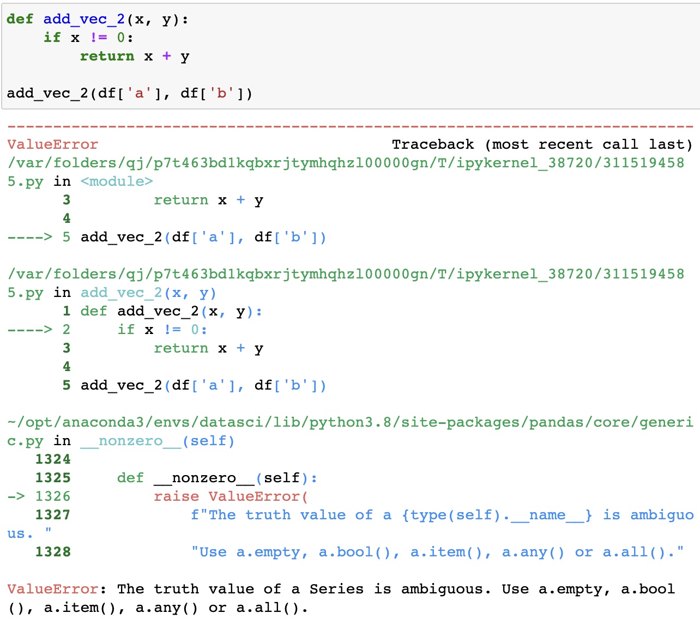

    > 上面函数中，判断条件`if x != 0` ，x是series对象，是一个向量， 但20是具体的数值，int类型的变量，是一个标量。向量和标量不能直接计算，所以出错，这个时候可以使用numpy.vectorize()将函数向量化

    4）在声明函数时，使用装饰器`@np.vectorize`，将函数向量化

    ```python
    import numpy as np
    
    # 函数向量化
    @np.vectorize
    def add_vec_2(x, y):
        if x != 0:
            return x + y
        else:
            return x
    
    add_vec_2(df['a'], df['b'])
    ```

    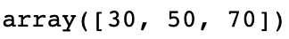

6. ## lambda函数

    > 使用 `apply` 和 `applymap` 对数据进行处理时，当处理函数比较简单的时候，没有必要创建一个函数， 可以使用lambda 表达式创建匿名函数

    lambda匿名函数的优点如下：

    - 使用 Python 写一些执行脚本时，使用 lambda 可以省去定义函数的过程，让代码更加精简
    - 对于一些抽象的，不会别的地方再复用的函数，有时候给函数起个名字也是个难题，使用 lambda 不需要考虑命名的问题
    - 使用 lambda 在某些时候让代码更容易理解

    1）示例：`df` 中的数据加1

    ```python
    df.apply(lambda x: x+1)
    ```

    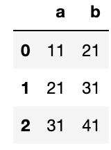

# III. 数据去重操作

1. ## Series的去重操作

    **Series 去重有 2 种方式**：

    | 方法                                    | 说明                                                         |
    | --------------------------------------- | ------------------------------------------------------------ |
    | `series.drop_duplicates(inplace=False)` | 删除 Series 中重复的元素并返回一个新的 Series；inplace设置True，则会直接在原 Series 数据基础上删除重复的元素 |
    | `series.unique()`                       | 将 Series 中的元素去重，返回一个去重后的 ndarray 数据        |

    1）创建一个包含重复元素的 Series 数据

    ```python
    # 创建一个 Series 数据
    new_series = pd.Series([1, 3, 2, 4, 3, 5, 1, 8, 9, 7, 8])
    new_series
    ```

    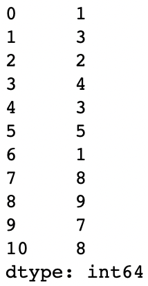

    2）删除 Series 数据中重复的元素

    ```python
    # 使用 drop_duplicates 删除 Series 中重复的元素
    new_series.drop_duplicates()
    ```

    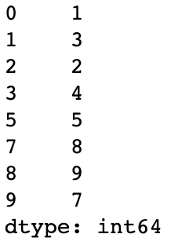

    ```python
    # 使用 unique 对 Series 中的数据去重
    new_series.unique()
    ```

    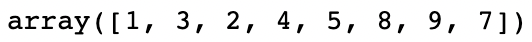

2. DataFrame的去重操作

    | 方法                                                         | 说明                                                         |
    | ------------------------------------------------------------ | ------------------------------------------------------------ |
    | `df.drop_duplicates(subset=None, keep='first', inplace=False)` | 删除 DataFrame 中重复的行并返回一个新的 DataFrame；nplace设置True，则会直接在原 DataFrame 数据基础上删除重复的行 |

    其他参数说明：

    - subset：默认为None，只删除每一列完全相同的重复行；subset可以设置列名，如：`subset=[列1, 列2, ...]`，只要指定列的值相同，则认为就是重复的行
    - keep='first'：删除重复行时默认保留重复行的第一个；设置为'last'，则保留重复行的最后一个

    1）加载 `scientists_duplicates.csv` 数据集

    ```python
    scientists = pd.read_csv('./data/scientists_duplicates.csv')
    scientists
    ```

    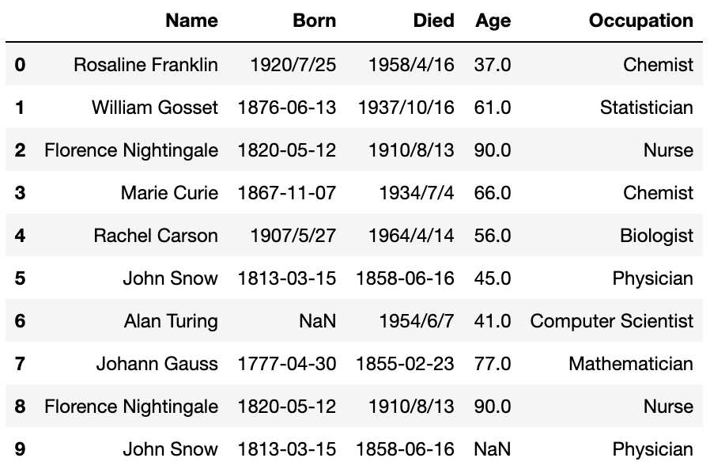

    2）删除 DataFrame 数据中完全重复的行

    ```python
    # 注意：此处是返回了一个新的 DataFrame，原 DataFrame 的数据并没有改变
    scientists.drop_duplicates()
    ```

    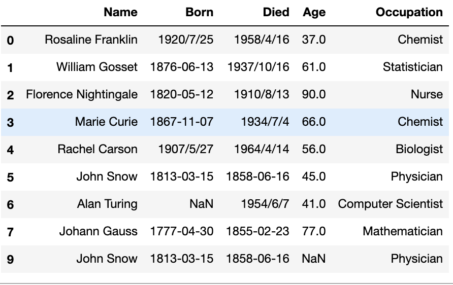

    3）删除 DataFrame 数据中 `Name、Born、Died` 三列相同的行

    ```python
    # 删除指定列值相同的行
    scientists.drop_duplicates(subset=['Name', 'Born', 'Died'])
    ```

    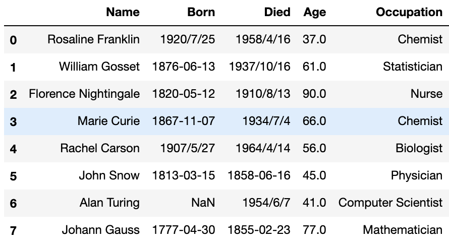

# IV. 数据组合

1. ## 数据组合简介

    在动手进行数据分析工作之前，需要进行数据清理工作，数据清理的主要目标是：

    - 每个观测值成一行
    - 每个变量成一列
    - 每种观测单元构成一张表格

    数据整理好之后，可能需要多张表格组合到一起才能进行某些问题的分析

    - 比如：一张表保存公司名称，另一张表保存股票价格
    - 单个数据集也可能会分割成多个，比如时间序列数据，每个日期可能在一个单独的文件中

2. ## concat拼接数据(重点)

    1. ### 方法简介

        **基本格式**：

        | 方法                        | 说明                                                         |
        | --------------------------- | ------------------------------------------------------------ |
        | `pd.concat([df1, df2, ..])` | 多个数据集(DataFrame或Series)之间按行标签索引 或列标签索引拼接，默认是outer，可以设置为inner |

    2. ### 行拼接: 按照列标签索引对齐

        **DataFrame和DataFrame 进行拼接**：

        > 注意：行拼接时，无法对齐的列，默认在拼接后的数据中会填充为 NaN，因为默认拼接是 outer 拼接

        1）加载数据集

        ```python
        df1 = pd.read_csv('./data/concat_1.csv')
        df2 = pd.read_csv('./data/concat_2.csv')
        df3 = pd.read_csv('./data/concat_3.csv')
        ```

        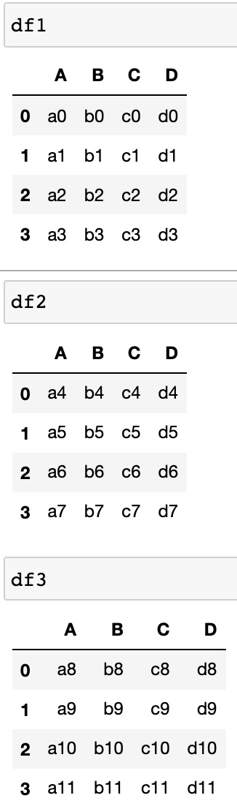

        2）将 `df1`、`df2`和 `df3` 按照列标签对齐，进行行拼接

        ```
        row_concat = pd.concat([df1, df2, df3])
        row_concat
        ```

        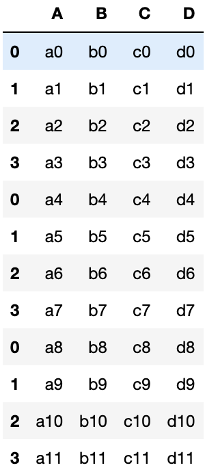

        ```python
        # 按照行位置获取数据
        row_concat.iloc[3]
        ```

        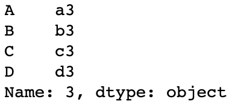

        ```python
        # 按照行标签获取数据
        row_concat.loc[3]
        ```

        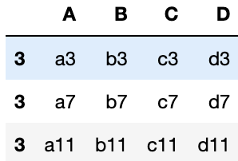

        3）`concat` 拼接数据时忽略原有数据的行标签

        ```python
        # ignore_index=True：表示 concat 拼接时忽略索引
        pd.concat([df1, df2, df3], ignore_index=True)
        ```

        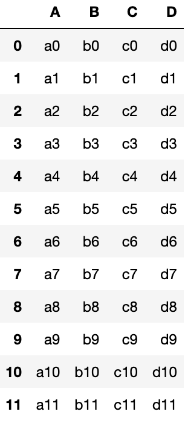

        **DataFrame 和 Series 进行拼接**：

        1）创建一个 Series 数据

        ```python
        new_series = pd.Series(['n1', 'n2', 'n3', 'n4'])
        print(new_series)
        ```

        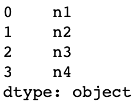

        2）将 `df1` 和 `new_series` 按照列标签对齐，进行行拼接

        ```
        pd.concat([df1, new_series])
        ```

        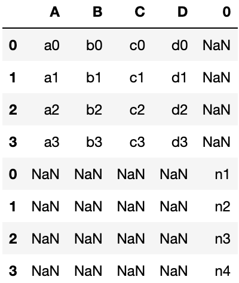

    3. ### 列拼接: 按照行标签索引对齐

        > 注意：列拼接时，无法对齐的行，默认在拼接后的数据中会填充为 NaN，因为默认拼接是 outer 拼接

        **DataFrame和DataFrame 进行拼接**：

        1）将 `df1`、`df2`和 `df3` 按照行标签对齐，进行列拼接

        ```python
        pd.concat([df1, df2, df3], axis=1)
        ```

        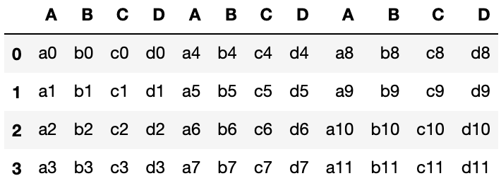

        **DataFrame 和 Series 进行拼接**：

        1）创建一个 Series 数据

        ```python
        new_series = pd.Series(['n1', 'n2', 'n3', 'n4'])
        print(new_series)
        ```

        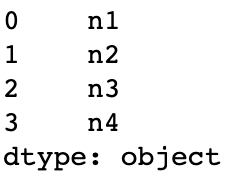

        2）`df1` 和 `new_series` 按照行标签对齐，进行列拼接

        ```python
        pd.concat([df1, new_series], axis=1)
        ```

        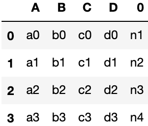

    4. ### join参数的设置

        concat 方法的 join参数：

        - 默认为 outer：无法对齐的行/列，默认在拼接后的数据中会填充为 NaN，因为默认拼接是 outer 拼接
        - 设置为 inner：只有能够对齐的行/列，才会出现在拼接的结果中

        1）修改 `df1` 和 `df3` 的 columns 列标签

        修改之前：

        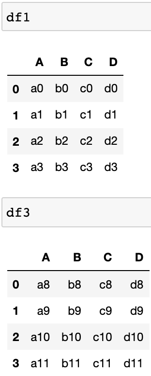

        ```python
        df1.columns = ['A', 'B', 'C', 'D']
        df3.columns = ['A', 'C', 'F', 'H']
        ```

        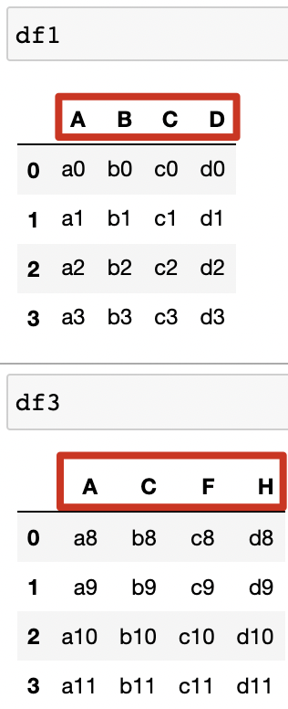

        2）将 `df1` 和 `df3` 按列标签对齐，进行行拼接，默认 outer

        ```python
        pd.concat([df1, df3])
        ```

        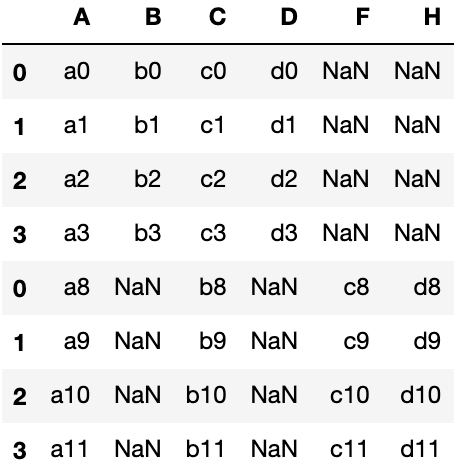

        3）将 `df1` 和 `df3` 按列标签对齐，进行行拼接，设置 `join='inner'`

        ```python
        pd.concat([df1, df3], join='inner')
        ```

        

3. ## merge关联数据(重点)

    1. ### 方法简介

        > merge 方法类似于 sql 中的 join 语句，用于两个数据集之间按照行标签列或列标签列进行连接，默认是inner，可以设置为：left、right、outer

        **基本格式**：

        | 方法                                                     | 说明                       |
        | -------------------------------------------------------- | -------------------------- |
        | `pd.merge(left, right, ...)` 或 `left.merge(right, ...)` | 两个数据集直接进行关联操作 |

        merge函数的参数：

        - left：左侧数据集
        - right：右侧数据集
        - how：关联方式，默认为 inner，可以设置为：left、right、outer
        - on='列名'： 左侧和右则数据以哪一列进行关联操作，左右两侧列名相同时才指定 on 参数
        - left_on='左侧列名' 和 right_on='右侧列名'：左右两侧关联时，列名不同时使用
        - left_index=False：默认为 False，设置为 True，表示左侧的行标签列和右侧的数据进行关联
        - right_index=False：默认为 False，设置为 True，表示左侧的数据和右侧的行标签列进行关联

    2. ### merge示例

        1）分别加载 departments.csv 和 employees.csv 数据

        ```python
        # 加载部门数据
        departments = pd.read_csv('./data/departments.csv')
        departments
        ```

        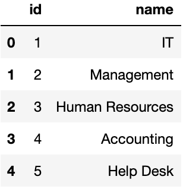

        ```python
        # 查看数据列的结构
        departments.info()
        ```

        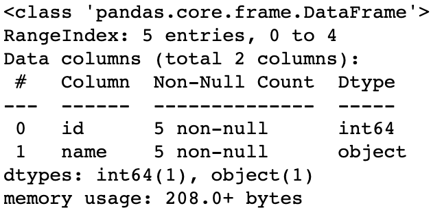

        ```python
        # 加载员工数据
        employees = pd.read_csv('./data/employees.csv')
        employees.head()
        ```

        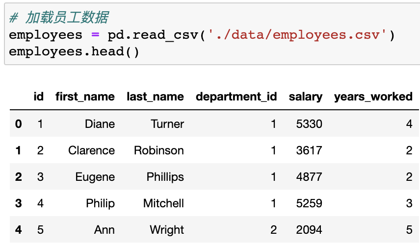

        ```python
        # 查看数据列的结构
        employees.info()
        ```

        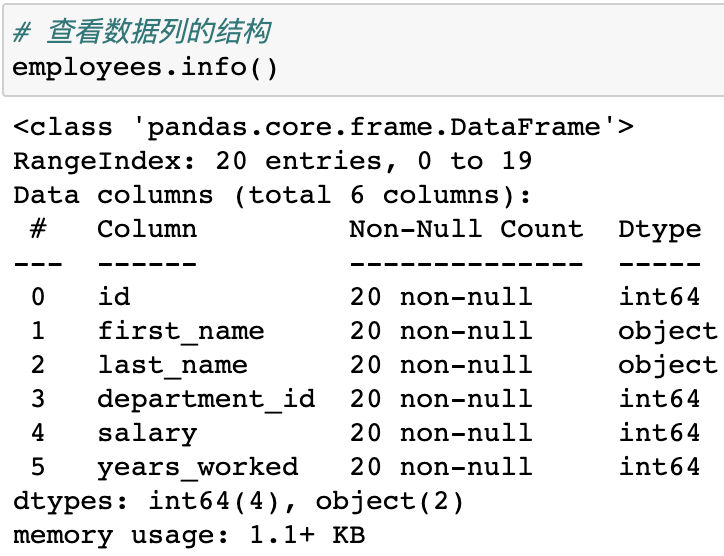

        2）将部门数据和员工数据按照部门 ID 进行关联

        ```python
        # 部门和员工数据进行关联
        merge_data = pd.merge(departments, employees, left_on='id', right_on='department_id')
        # 或者
        merge_data = departments.merge(employees, left_on='id', right_on='department_id')
        merge_data.head()
        ```

        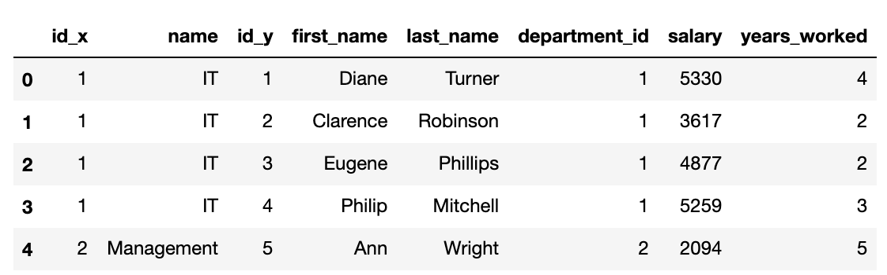

4. ## join关联数据

    1. ### 方法简介

        > join 方法类是 merge 方法的一个特殊情况，被调用的数据集按照行标签列或列标签列和另一个数据集的行标签列进行关联，默认是left，可以设置为：right，inner、outer

        **基本格式**：

        | 方法                  | 说明                                                         |
        | --------------------- | ------------------------------------------------------------ |
        | `df.join(other, ...)` | 左侧数据集的行标签列或列标签列和右侧数据集的行标签列进行关联操作 |

        join函数的参数：

        - other：右侧数据集
        - how：关联方式，默认为 left，可以设置为：right、inner、outer
        - on='左侧列标签'： 左侧数据集的列标签名称，on省略时，默认为左侧数据行标签列
        - lsuffix：关联后的数据中出现相同列名时，lsuffix指定左侧数据集出现相同列名的后缀
        - rsuffix：关联后的数据中出现相同列名时，rsuffix指定右侧数据集出现相同列名的后缀

    2. ### join示例

        1）加载股票数据集

        ```python
        stock_2016 = pd.read_csv('./data/stocks_2016.csv')
        stock_2017 = pd.read_csv('./data/stocks_2017.csv')
        stock_2018 = pd.read_csv('./data/stocks_2018.csv')
        ```

        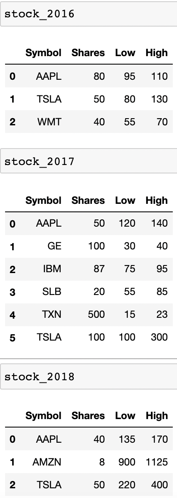

        2) 示例：stock_2016 和 stock_2017 按照行标签进行关联，设置为 outer 连接

        ```python
        # 示例：stock_2016 和 stock_2017 按照行标签进行管理，设置为 outer 连接
        stock_2016.join(stock_2017, lsuffix='2016', rsuffix='2017', how='outer')
        ```

        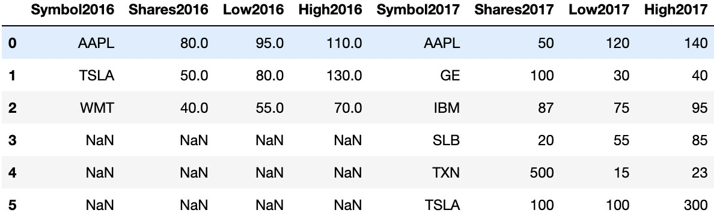

        3）示例：stock_2016 和 stock_2018 按照 Symbol 进行关联

        ```python
        stock_2016.join(stock_2018.set_index('Symbol'), lsuffix='2016', rsuffix='2018', on='Symbol')
        ```

        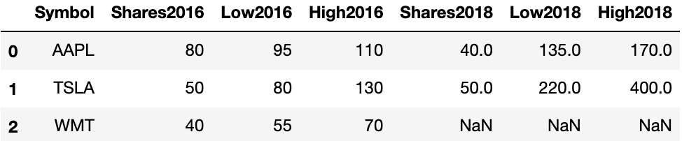

# V. 数据分组

1. ## MultiIndex多级标签

    Series 和 DataFrame 的标签索引可以是多级的，类型为 MultiIndex，可以通过多级标签索引进行取值操作。

    1）加载 `gapminder.tsv` 数据

    ```python
    gapminder = pd.read_csv('./data/gapminder.tsv', sep='\t')
    gapminder
    ```

    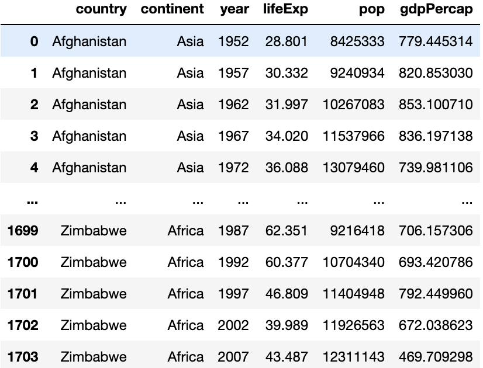

    2）将 year 和 country 两列设置为行标签

    ```python
    multiindex_gapminder = gapminder.set_index(['year', 'country'])
    multiindex_gapminder.head()
    ```

    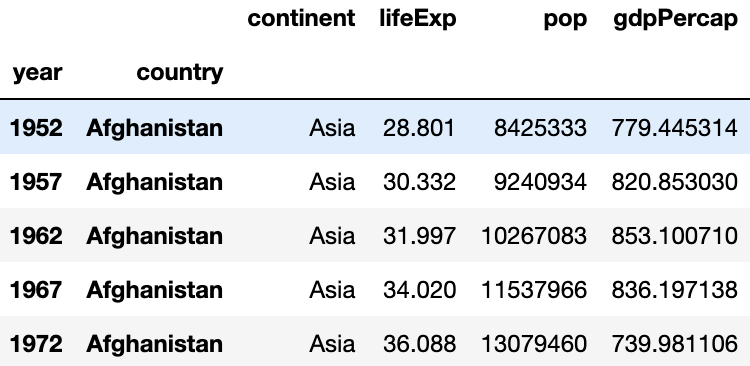

    ```python
    # 查看行标签
    multiindex_gapminder.index
    ```

    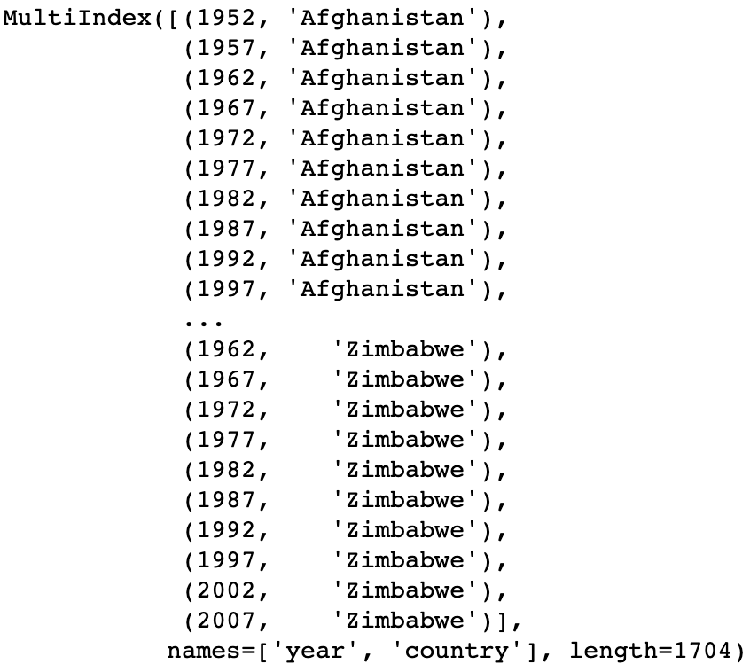

    3）根据一级行标签获取数据，示例：获取 1952 年的数据

    ```python
    # 示例：获取 1952 年的数据
    multiindex_gapminder.loc[[1952]]
    ```

    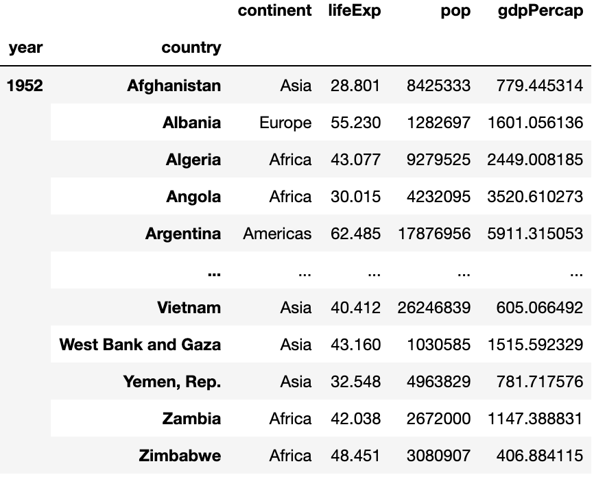

    4）根据一级、二级行标签获取数据，示例：获取 1952 年中国的数据

    ```python
    # 示例：获取 1952 年中国的数据
    multiindex_gapminder.loc[[(1952, 'China')]]
    ```

    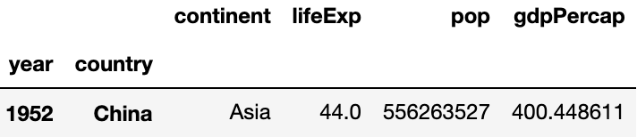

2. ## 分组聚合操作

    1. ### 分组聚合简介

        > 在 SQL 中我们经常使用 GROUP BY 将某个字段，按不同的取值进行分组，在 pandas 中也有 groupby 函数；
        >
        > 分组之后，每组都会有至少1条数据，将这些数据进一步处理返回单个值的过程就是聚合。
        >
        > 比如：分组之后计算算术平均值，或者分组之后计算频数，都属于聚合。

        **基本格式**：

        | 方式                                                         | 说明                                                   |
        | ------------------------------------------------------------ | ------------------------------------------------------ |
        | 方式1： `df.groupby(列标签, ...).列标签.聚合函数()`          | 按指定列分组，并对分组数据 的相应列进行相应的 聚合操作 |
        | 方式2： `df.groupby(列标签, ...).agg({'列标签': '聚合', ...})` `df.groupby(列标签, ...).列表签.agg(聚合...)` | 按指定列分组，并对分组数据 的相应列进行相应的 聚合操作 |
        | 方式3： `df.groupby(列标签, ...).aggregate({'列标签': '聚合', ...})` `df.groupby(列标签, ...).列表签.aggregate(聚合...)` | 按指定列分组，并对分组数据 的相应列进行相应的聚合操作  |
        | 方式4： `df.groupby(列标签, ...)[[列表签1, ...]].聚合函数()` | 按指定列分组，并对分组数据 的相应列进行相应的聚合操作  |

        > 注意：
        >
        > 1）方式1 和 方式4 只能使用 pandas 内置的聚合方法，并且只能进行一种聚合
        >
        > 2）方式2 和 方式3 除了能够使用 pandas 内置的聚合方法，还可以使用其他聚合方法，并且可以进行多种聚合

    2. ### pandas内置的聚合方法

        可以与`groupby`一起使用的方法和函数：

        | pandas方法 | Numpy函数        | 说明                                         |
        | ---------- | ---------------- | -------------------------------------------- |
        | count      | np.count_nonzero | 频率统计(不包含NaN值)                        |
        | size       |                  | 频率统计(包含NaN值)                          |
        | mean       | np.mean          | 求平均值                                     |
        | std        | np.std           | 标准差                                       |
        | min        | np.min           | 最小值                                       |
        | quantile() | np.percentile()  | 分位数                                       |
        | max        | np.max           | 求最大值                                     |
        | sum        | np.sum           | 求和                                         |
        | var        | np.var           | 方差                                         |
        | describe   |                  | 计数、平均值、标准差，最小值、分位数、最大值 |
        | first      |                  | 返回第一行                                   |
        | last       |                  | 返回最后一行                                 |
        | nth        |                  | 返回第N行(Python从0开始计数)                 |

    3. ### 分组聚合操作演示

        1）加载 `gapminder.tsv` 数据集

        ```python
        gapminder = pd.read_csv('./data/gapminder.tsv', sep='\t')
        gapminder.head()
        ```

        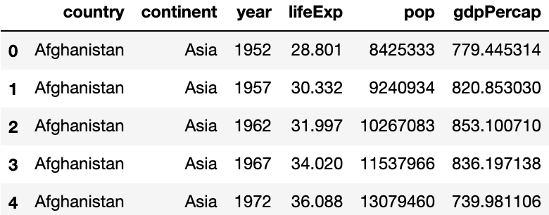

        2）示例：计算每年期望年龄的平均值

        ```python
        # 示例：计算每年期望年龄的平均值
        # gapminder.groupby('year')['lifeExp'].mean()
        gapminder.groupby('year').lifeExp.mean()
        # 或
        gapminder.groupby('year').agg({'lifeExp': 'mean'})
        # 或
        import numpy as np
        gapminder.groupby('year').agg({'lifeExp': np.mean})
        ```

        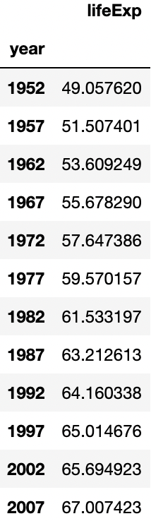

        3）示例：统计每年预期寿命的最小值、最大值和平均值

        ```python
        # 示例：统计每年预期寿命的最小值、最大值和平均值
        # gapminder.groupby('year')['lifeExp'].agg(['min', 'max', 'mean'])
        gapminder.groupby('year').lifeExp.agg(['min', 'max', 'mean'])
        ```

        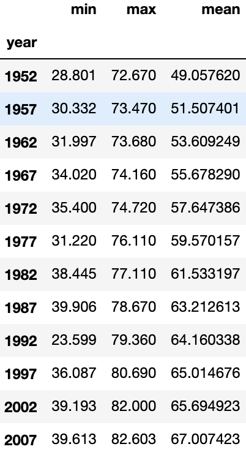

        4）示例：统计每年的人均寿命和GDP的最大值

        ```python
        # 示例：统计每年的人均寿命和GDP的最大值
        ret = gapminder.groupby('year').agg({'lifeExp': 'mean', 'gdpPercap': 'max'})
        ret.rename(columns={'lifeExp': '人均寿命', 'gdpPercap': '最高GDP'})
        ```

        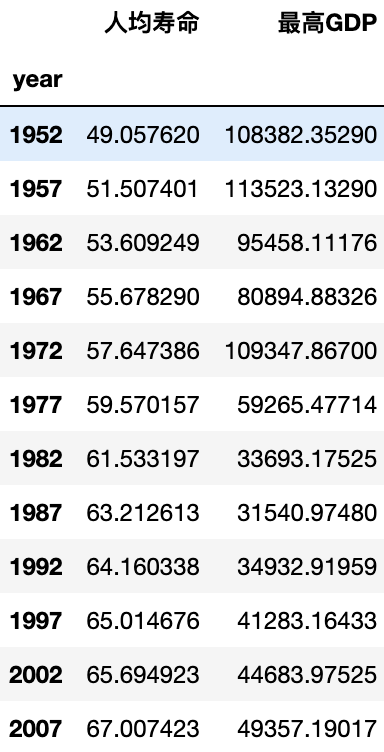

        5）示例：计算每年期望年龄的平均值(自定义聚合函数)

        ```python
        def my_mean(values):
            """计算平均值"""
            # 获取数据条目数
            n = len(values)
            _sum = 0
            for value in values:
                _sum += value
            return _sum/n
        
        # gapminder.groupby('year')['lifeExp'].agg(my_mean)
        gapminder.groupby('year').lifeExp.agg(my_mean)
        ```

        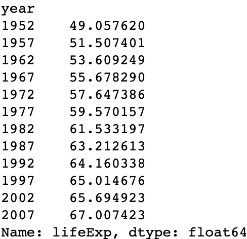

        6）示例：统计每年的平均年龄和所有平均年龄的差值(自定义聚合函数)

        ```python
        # 示例：统计每年的平均年龄和所有平均年龄的差值
        def diff_lifeExp(values, global_mean):
            return values.mean() - global_mean
        
        # 计算所有平均年龄
        global_mean = gapminder.lifeExp.mean()
        gapminder.groupby('year').lifeExp.agg(diff_lifeExp, global_mean=global_mean)
        ```

        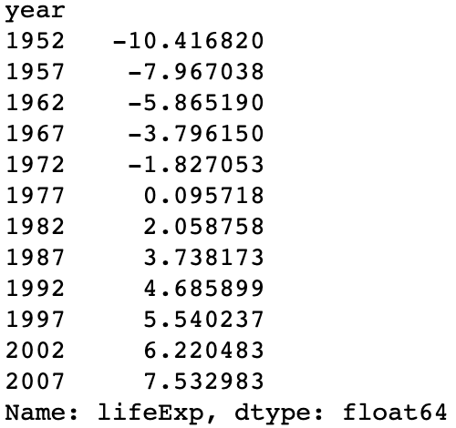

3. ## transform转换

    - ##### transform 转换，需要把 DataFrame 中的值传递给一个函数， 而后由该函数"转换"数据

    - ##### aggregate(聚合) 返回单个聚合值，但 transform 不会减少数据量

    1. ### transform功能演示

        > 需求：按年分组，并计算组内每个人的预期寿命和该组平均年龄的差值

        ```python
        def lifeExp_diff(x):
            return x - x.mean()
        
        # gapminder.groupby('year')['lifeExp'].transform(lifeExp_diff)
        gapminder.groupby('year').lifeExp.transform(lifeExp_diff)
        ```

        

    2. ### transform分组填充缺失值

        之前介绍了填充缺失值的各种方法，对于某些数据集，可以使用列的平均值来填充缺失值。某些情况下，可以考虑将列进行分组，分组之后取平均再填充缺失值

        1）加载 `tips.csv` 数据集，并从其中随机取出 `10` 条数据

        ```python
        tips_10 = pd.read_csv('./data/tips.csv').sample(10, random_state=42)
        tips_10
        ```

        

        2）构建缺失值

        ```python
        import numpy as np
        tips_10.iloc[[1, 3, 5, 7], 0] = np.nan
        tips_10
        ```

        

        3）分组查看缺失情况

        ```python
        tips_10.groupby('sex').count()
        ```

        

        结果说明：

        > total_bill 列中，Female 性别的有 1 个缺失， Male 性别的有 2 个缺失

        4）定义函数，按性别分组填充缺失值

        ```python
        def fill_na_mean(x):
            # 计算平均值
            avg = x.mean()
            # 用平均值填充缺失值
            return x.fillna(avg)
        
        total_bill_group_mean = tips_10.groupby('sex').total_bill.transform(fill_na_mean)
        total_bill_group_mean
        ```

        

        5）将计算的结果赋值新列

        ```python
        tips_10['fill_total_bill'] = total_bill_group_mean
        tips_10
        ```

        

4. ## 分组过滤

    > 使用 groupby 方法还可以过滤数据，调用 filter 方法，传入一个返回布尔值的函数，返回 False 的数据会被过滤掉

    1）使用 `tips.csv` 用餐数据集，加载数据并不同用餐人数的数量

    ```python
    tips = pd.read_csv('./data/tips.csv')
    tips
    ```

    

    ```python
    # 统计不同用餐人数的数量
    tips['size'].value_counts()
    ```

    

    > 结果显示：人数为1、5和6人的数据比较少，考虑将这部分数据过滤掉

    ```python
    tips_filtered = tips.groupby('size').filter(lambda x: x['size'].count() > 30)
    tips_filtered
    ```

    

    2）查看结果

    ```python
    tips_filtered['size'].value_counts()
    ```

    

5. ## DataFrameGroupBy对象

    1. ### 分组操作

        1）准备数据，加载 `tips.csv` 数据集，随机取出其中的 10 条数据

        ```python
        tips_10 = pd.read_csv('./data/tips.csv').sample(10, random_state=42)
        tips_10
        ```

        

        2）调用 `groupby` 方法，创建分组对象

        ```python
        sex_groups = tips_10.groupby('sex')
        sex_groups
        ```

        

        > 注意：sex_groups 是一个DataFrameGroupBy对象，如果想查看计算过的分组，可以借助groups属性实现

        ```python
        sex_groups.groups
        ```

        

        结果说明：上面返回的结果是 DataFrame 的索引，实际上就是原始数据的行标签

        ```
        sex_groups.size()
        ```

        

        结果说明：上面返回的结果是统计分组之后，每组的数据的数目

        3）在 DataFrameGroupBy 对象基础上，直接就可以进行 aggregate、transform 等计算

        ```python
        sex_groups.mean()
        ```

        

        结果说明：上面结果直接计算了按 sex 分组后，所有列的平均值，但只返回了数值列的结果，非数值列不会计算平均值

        4）通过 `get_group` 方法选择分组

        ```python
        sex_groups.get_group('Female')
        ```

        

        ```python
        sex_groups.get_group('Male')
        ```

        

    2. ### 遍历分组

        通过 DataFrameGroupBy 对象，可以遍历所有分组，相比于在 groupby 之后使用aggregate、transform和filter，有时候使用 for 循环解决问题更简单：

        ```python
        for sex_group in sex_groups:
            print(type(sex_group))
            print(sex_group)
        ```

        

        > 注意：DataFrameGroupBy对象不支持下标取值，会报错

        ```python
        # 这句代码会出错
        sex_groups[0]
        ```

        

        ```python
        for sex_group in sex_groups:
            print(sex_group[0])
            print(type(sex_group[0]))
            print(sex_group[1])
            print(type(sex_group[1]))
        ```

        

    3. ### 多个分组

        > 前面使用的 groupby 语句只包含一个变量，可以在 groupby 中添加多个变量

        比如上面用到的 `tips.csv` 数据集，可以使用groupby按性别和用餐时间分别计算小费数据的平均值：

        ```python
        group_avg = tips_10.groupby(['sex', 'time']).mean()
        group_avg
        ```

        

        分别查看分组之后结果的列标签和行标签：

        ```python
        # 查看列标签
        group_avg.columns
        ```

        

        ```python
        # 查看行标签
        group_avg.index
        ```

        

        > 可以看到，多个分组之后返回的是MultiIndex，如果想得到一个普通的DataFrame，可以在结果上调用reset_index 方法

        ```python
        group_avg.reset_index()
        ```

        

        也可以在分组的时候通过`as_index=False`参数（默认是True），效果与调用reset_index()一样

        ```python
        # as_index=False：分组字段不作为结果中的行标签索引
        tips.groupby(['sex', 'time'], as_index=False).mean()
        ```

        

6. ## 数据划分区间(cut函数)

    可以使用 pandas 中的 cut 函数将传递的数据划分成几个区间。

    | 方式                                           | 说明                                                         |
    | ---------------------------------------------- | ------------------------------------------------------------ |
    | `pandas.cut(x, bins, right=True, labels=None)` | 将 x 中的每个数据划分到指定的区间： * x：待划分区间的数据，一维数据，可以是Series * bins：list，直接划分时每个区间的边界值 * right：划分区间时，默认左开右闭，设置为False，则表示左闭右开 * labels：可选项，指定每个区间的显示 label |

    1）加载 tips.csv 数据

    ```python
    tips = pd.read_csv('./data/tips.csv')
    tips
    ```

    

    ```python
    # 查看数据列的信息
    tips.info()
    ```

    

    ```python
    # 查看数据中 total_bill 列的统计值
    tips['total_bill'].describe()
    ```

    

    2）将 tips 数据按照 total_bill 列的值划分为 3 个区间：`0-10、10-30、30-60`

    ```python
    # 指定划分区间的边界值
    bins = [0, 10, 30, 60]
    pd.cut(tips['total_bill'], bins)
    ```

    

    ```python
    # right=False：设置划分区间时左闭右开
    pd.cut(tips['total_bill'], bins, right=False)
    ```

    

    ```python
    # 设置划分区间的 labels
    labels = ['<10', '<30', '<60']
    pd.cut(tips['total_bill'], bins, right=False, labels=labels)
    ```

    

    ```python
    # 在 tips 数据中增加消费金额区间这一列
    tips['bill_group'] = pd.cut(tips['total_bill'], bins, right=False, labels=labels)
    tips
    ```

    

    3）按照消费区间列统计每组消费数据的数目

    ```python
    # 按照消费区间列统计每组消费数据的数目
    tips.groupby('bill_group').size()
    ```

    


