# Spark SQL基础入门

## Hive SQL实现词频统计

> Hive 数据仓库框架，建立在HADOOP之上的框架，为用户提供SQL语句，将其转换为MapReduce程序，提交运行到YARN集群，处理存储在HDFS上数据。


> Hive 本地模式，基本属性设置：

```ini
# 开启Hive的本地模式：
	 set hive.exec.mode.local.auto=true;
	 
# 当一个job满足如下条件才能真正使用本地模式：
    1.job的输入数据大小必须小于参数：
    	hive.exec.mode.local.auto.inputbytes.max=134217728; 
    	默认128MB
    2.处理文件个数
    	hive.exec.mode.local.auto.input.files.max=4;

```

> 词频统计WordCount，将文本数据加载至Hive表中，编写SQL语句实现：

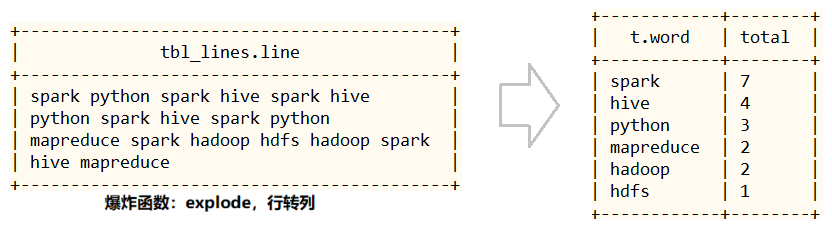

```SQL
-- 1、启动服务
[root@node1 ~]# hadoop-daemon.sh start namenode 
[root@node1 ~]# hadoop-daemons.sh start datanode     

[root@node1 ~]# start-metastore.sh
[root@node1 ~]# start-hiveserver2.sh


-- 2、数据文件：vim /root/words.txt
spark python spark hive spark hive
python spark hive spark python
mapreduce spark hadoop hdfs hadoop spark
hive mapreduce

-- 3、beeline 连接
(base) [root@node1 ~]# beeline
    !connect jdbc:hive2://node1.itcast.cn:10000/default
    root
    123456

-- 4、创建Hive表和加载数据
CREATE DATABASE db_test ;
CREATE TABLE db_test.tbl_lines(line string);

LOAD DATA LOCAL INPATH '/root/words.txt' INTO TABLE db_test.tbl_lines;
SELECT * FROM db_test.tbl_lines; 

-- 5、SQL 分析
SELECT SPLIT(line, "\\s+") AS words FROM db_test.tbl_lines;

-- Hive 中查看内置函数
show functions ;
-- Hive中查看具体函数使用帮助
desc function SPLIT ;

SELECT EXPLODE(SPLIT(line,"\\s+")) AS word FROM db_test.tbl_lines;

-- 查询	
SELECT t.word, COUNT(1) AS total FROM(
  SELECT EXPLODE(SPLIT(line, "\\s+")) AS word FROM db_test.tbl_lines
) t 
GROUP BY t.word ORDER BY total DESC LIMIT 10;

-- 查询
WITH tmp AS (
  SELECT EXPLODE(SPLIT(line, "\\s+")) AS word FROM db_test.tbl_lines
)
SELECT t.word, COUNT(1) AS total FROM tmp t GROUP BY t.word ORDER BY total DESC LIMIT 10 ;
```

## I. 快速入门

### 1. SparkSession应用入口

> Spark 2.0开始，应用程序入口为`SparkSession`，加载不同数据源的数据，封装到`DataFrame`集合数据结构中，使得编程更加简单，程序运行更加快速高效。


```ini
# 1、SparkSession
	程序入口，加载数据
	底层SparkContext，进行封装

# 2、DataFrame
	数据结构，从Spark 1.3开始出现，一直到2.0版本，确定下来
	底层RDD，加上Schema约束（元数据）：字段名称和字段类型
		DataFrame = RDD[Row] + Schema
```

> `SparkSession`对象实例通过==建造者模式==构建，代码如下：

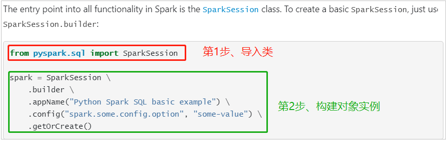

> 案例代码演示：`01_test_session.py`，构建SparkSession实例，加载文本数据，统计条目数。

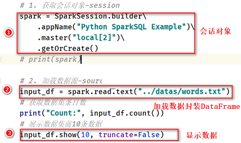

```python
#!/usr/bin/env python
# -*- coding: utf-8 -*-

import os
from pyspark.sql import SparkSession


if __name__ == '__main__':
    """
    Spark 2.0开始，提供新程序入口：SparkSession，构建实例对象，底层依然是SparkContext。   
    """

    # 设置系统环境变量
    os.environ['JAVA_HOME'] = '/export/server/jdk'
    os.environ['HADOOP_HOME'] = '/export/server/hadoop'
    os.environ['PYSPARK_PYTHON'] = '/export/server/anaconda3/bin/python3'
    os.environ['PYSPARK_DRIVER_PYTHON'] = '/export/server/anaconda3/bin/python3'

    # 1. 获取会话实例对象-session
    spark = SparkSession.builder\
        .appName('SparkSession Test')\
        .master('local[2]')\
        .getOrCreate()
    print(spark)

    # 2. 加载数据源-source
    dataframe = spark.read.text('../datas/words.txt')

    # 3. 数据转换处理-transformation

    # 4. 处理结果输出-sink
    dataframe.show(n=10, truncate=False)

    # 5. 关闭会话实例对象-close
    spark.stop()

```

> 后续代码编写方便，编写PySpark代码模板，模板名称：`PySpark Linux SQL Script`

```python
#!/usr/bin/env python
# -*- coding: utf-8 -*-

import os
from pyspark.sql import SparkSession

if __name__ == '__main__':
    """
    
    """
    # 设置系统环境变量
    os.environ['JAVA_HOME'] = '/export/server/jdk'
    os.environ['HADOOP_HOME'] = '/export/server/hadoop'
    os.environ['PYSPARK_PYTHON'] = '/export/server/anaconda3/bin/python3'
    os.environ['PYSPARK_DRIVER_PYTHON'] = '/export/server/anaconda3/bin/python3'

    # 1. 获取会话实例-session
    spark = SparkSession.builder \
        .appName("Python SparkSQL Example") \
        .master("local[2]") \
        .getOrCreate()

    # 2. 加载数据源-source

    # 3. 数据转换处理-transformation

    # 4. 处理结果输出-sink

    # 5. 关闭会话对象-close
    spark.stop()

```

### 2. 基于SQL词频统计

> 大数据框架经典案例：==词频统计WordCount，从文件读取数据，统计单词个数。==

.png)

> ==DataFrame== 数据结构相当于给RDD加上约束Schema，知道数据内部结构（字段名称、字段类型），提供两种方式分析处理数据`：DataFrame API（DSL编程）`和`SQL（类似HiveQL编程）`，下面以WordCount程序为例编程实现，体验DataFrame使用。

```SQL
-- 1. SQL 语法分析
SELECT .... FROM tbl_x GROUP BY x1 WHERE y1 = ? ORDER BY z1 LIMIT 10 ;

-- 2. DSL 语法分析
tblx.where(y1=?).groupBy(x1).select(...).orgerBy(z1).limit(10)

```

> 类似HiveQL词频统计，先分割每行数据为单词，再对单词分组group by，最后count统计，步骤如下：

- 第一步、构建SparkSession对象，加载文件数据；
- 第二步、将DataFrame/Dataset注册为临时视图；
- 第三步、编写SQL语句，使用SparkSession执行获取结果；
- 第四步、控制台打印结果数据和关闭SparkSession；

> 案例演示` 02_wordcount_sql.py`：加载文本数据，封装到DataFrame中，注册临时视图，编写SQL分析。

```python
#!/usr/bin/env python
# -*- coding: utf-8 -*-

import os
from pyspark.sql import SparkSession

if __name__ == '__main__':
    """
    使用SparkSQL实现词频统计WordCount，基于SQL语句实现。  
    """

    # 设置系统环境变量
    os.environ['JAVA_HOME'] = '/export/server/jdk'
    os.environ['HADOOP_HOME'] = '/export/server/hadoop'
    os.environ['PYSPARK_PYTHON'] = '/export/server/anaconda3/bin/python3'
    os.environ['PYSPARK_DRIVER_PYTHON'] = '/export/server/anaconda3/bin/python3'

    # 1. 获取会话实例对象-session
    spark = SparkSession.builder \
        .appName('SparkSession Test') \
        .master('local[2]') \
        .getOrCreate()

    # 2. 加载数据源-source
    input_df = spark.read.text('../datas/words.txt')
    # input_df.printSchema()
    # input_df.show(n=10, truncate=False)
    """
    root
        |-- value: string (nullable = true)
        
    +----------------------------------------+
    |value                                   |
    +----------------------------------------+
    |spark python spark hive spark hive      |
    |python spark hive spark python          |
    |mapreduce spark hadoop hdfs hadoop spark|
    |hive mapreduce                          |
    +----------------------------------------+
    """

    # 3. 数据转换处理-transformation
    """
        当使用SQL方式分析数据时，如下2个步骤：
        step1、注册DataFrame为临时视图view
        step2、编写SQL语句并执行
    """
    # step1、注册DataFrame为临时视图view
    input_df.createOrReplaceTempView('view_tmp_lines')
    # step2、编写SQL语句并执行
    output_df = spark.sql("""
        WITH tmp AS (
          select explode(split(value, ' ')) AS word from view_tmp_lines
        )
        SELECT word, COUNT(1) AS total FROM tmp GROUP BY word ORDER BY total DESC LIMIT 10
    """)

    # 4. 处理结果输出-sink
    output_df.printSchema()
    output_df.show(n=10, truncate=False)

    # 5. 关闭会话实例对象-close
    spark.stop()

```

上述程序运行的结果如下所示：

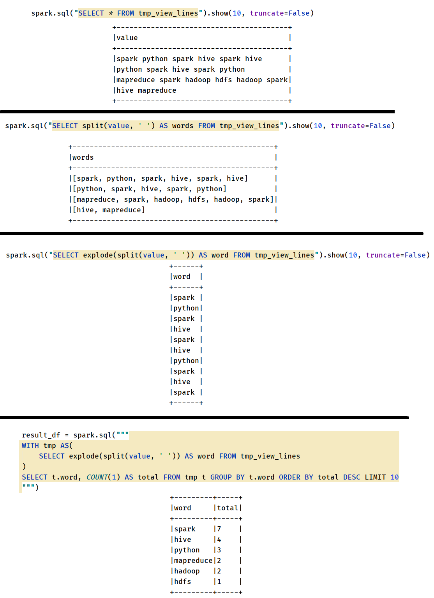

### 3. 基于DSL词频统计

> 以WordCount程序为例编程实现，体验DataFrame使用。**使用SparkSession加载文本数据，封装到DataFrame中，调用API函数处理分析数据**，编程步骤：

- 第一步、构建SparkSession实例对象，设置应用名称和运行本地模式；
- 第二步、读取HDFS上文本文件数据；
- 第三步、使用DSL（Dataset API），类似RDD API处理分析数据；
- 第四步、控制台打印结果数据和关闭SparkSession；

> 案例代码演示 `03_wordcount_dsl.py`：加载文本文件数据，封装到DataFrame中，直接调用SQL函数处理

```python
#!/usr/bin/env python
# -*- coding: utf-8 -*-

import os
from pyspark.sql import SparkSession
from pyspark.sql.functions import *

if __name__ == '__main__':
    """
    使用SparkSQL分析词频统计WordCount，基于DSL实现。  
    """

    # 设置系统环境变量
    os.environ['JAVA_HOME'] = '/export/server/jdk'
    os.environ['HADOOP_HOME'] = '/export/server/hadoop'
    os.environ['PYSPARK_PYTHON'] = '/export/server/anaconda3/bin/python3'
    os.environ['PYSPARK_DRIVER_PYTHON'] = '/export/server/anaconda3/bin/python3'

    # 1. 获取会话实例对象-session
    spark = SparkSession.builder \
        .appName('SparkSession Test') \
        .master('local[2]') \
        .getOrCreate()

    # 2. 加载数据源-source
    input_df = spark.read.text('../datas/words.txt')
    """
    root
        |-- value: string (nullable = true)

    +----------------------------------------+
    |value                                   |
    +----------------------------------------+
    |spark python spark hive spark hive      |
    |python spark hive spark python          |
    |mapreduce spark hadoop hdfs hadoop spark|
    |hive mapreduce                          |
    +----------------------------------------+
    """

    # 3. 数据转换处理-transformation
    """
        a. 分割单词，进行扁平化（使用explode）
        b. 按照单词分组，使用count函数统计个数
        c. 按照词频降序排序，获取前10个
    """
    output_df = input_df\
        .select(
            explode(split(col('value'), ' ')).alias('word')
        )\
        .groupBy(col('word'))\
        .agg(
            count(col('word')).alias('total')
        )\
        .orderBy(col('total').desc())\
        .limit(10)

    # 4. 处理结果输出-sink
    output_df.printSchema()
    output_df.show(n=10, truncate=False)

    # 5. 关闭会话实例对象-close
    spark.stop()

```

### 4. SparkSQL模块概述

> SparkSQL模块一直到Spark 2.0版本才算真正稳定，发挥其巨大功能，发展经历如下几个阶段。

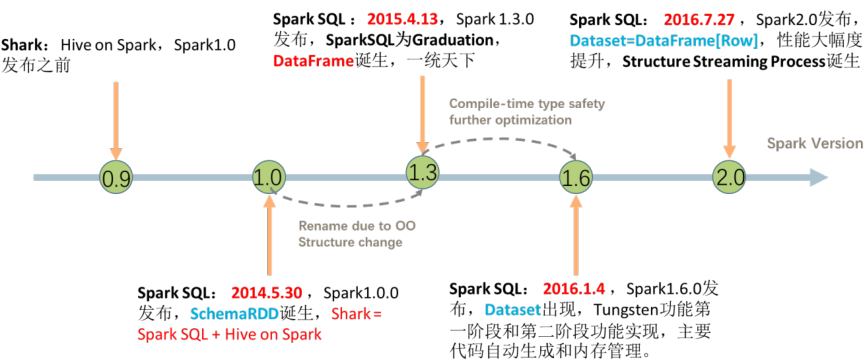

```ini
# 1、Spark 1.0之前
	Shark = Hive + Spark
	将Hive框架源码，修改其中转换SQL为MapReduce，变为转换RDD操作，称为Shark
	问题：维护成本太高，没有更多精力在于框架性能提升
		
# 2、Spark 1.0开始提出SparkSQL模块
	重新编写引擎Catalyst，将SQL解析为优化逻辑计划Logical Plan
	此时数据结构：SchemaRDD
	
# 3、Spark 1.3版本，SparkSQL成为Release版本
	数据结构：DataFrame，借鉴于Python和R中dataframe，DataFrame = RDD[Row] + Schema
	提供外部数据源接口：方便可以从任意外部数据源加载load和保存save数据

# 4、Spark 1.6版本，SparkSQL数据结构Dataset
	坊间流传，参考Flink中DataSet数据结构而来，Dataset = RDD + schema
	
# 5、Spark 2.0版本，DataFrame和Dataset合为一体
	Dataset = RDD + schema，DataFrame = Dataset[Row]
```

> Spark 2.x发布时，将Dataset和DataFrame统一为一套API，以Dataset数据结构为主（==Dataset= RDD + Schema==），其中`DataFrame = Dataset[Row]`。

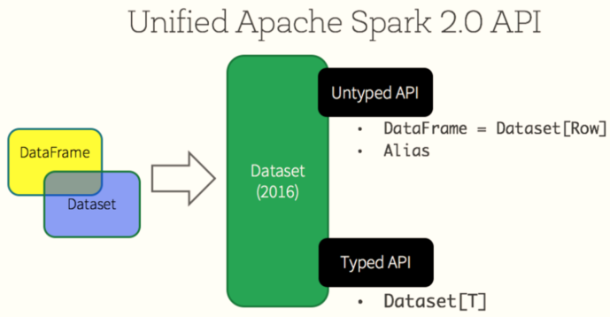

```ini
# Spark 2.0版本中2个重要特性：
	第一、SparkSession新程序入口
	第二、数据结构统一：Dataset
		其中DataFrame = Dataset[Row]
```

> SparkSQL模块官方定义：`针对结构化数据处理Spark Module模块`，数据封装在DataFrame数据结构。


> 主要包含三层含义：

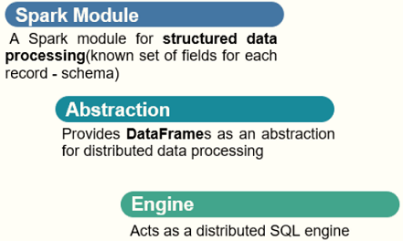

- 第一、针对结构化数据处理，属于Spark框架一个部分


- 第二、抽象数据结构：DataFrame

```ini
DataFrame = RDD[Row] + Schema（字段名称和字段类型）
```


- 第三、分布式SQL引擎，类似Hive框架

```ini
从Hive框架继承而来，Hive中提供bin/hive交互式SQL命令行及HiveServer2服务，SparkSQL都可以；
```

> Spark SQL是Spark用来处理结构化数据的一个模块，主要4个特性：

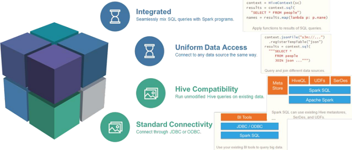

> 官方文档：https://spark.apache.org/docs/3.1.2/sql-programming-guide.html


## II. DataFrame

### 1. DataFrame是什么

> 在SparkSQL中，**DataFrame**是一种==以RDD为基础的分布式数据集==，类似于**传统数据库中的二维表格**。

[DataFrame与RDD的主要区别在于，前者`带有schema元信息`，即DataFrame所表示的二维表`数据集的每一列都带有名称和类型`。]()

> ==DataFrame = RDD[Row] + Schema==

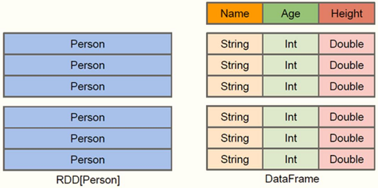

> schema使得Spark SQL得以洞察更多的结构信息，从而对藏于DataFrame背后的数据源以及作用DataFrame之上的变换进行针对性的优化，最终达到大幅提升运行时效率。


```ini
第一点：
	DataFrame = RDD[Row] + Schema 

第二点：
	DataFrame是特殊RDD分布式集合
	
第三点：
	DataFrame是分布式表，类似MySQL数据库中表table、Pandas库中dataframe
```

> **范例演示**：本地模式启动`pyspark`交互式命令行，`加载json格式数据`，封装DataFrame

- 第一步、启动HDFS服务，创建目录和上传测试数据

  [上传官方测试数据`$SPARK_HOME/examples/src/main/resources`至HDFS目录`/datas`]()

  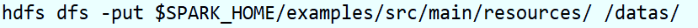

  [查看HDFS上数据文件，其中雇员信息数据【employees.json】]()

  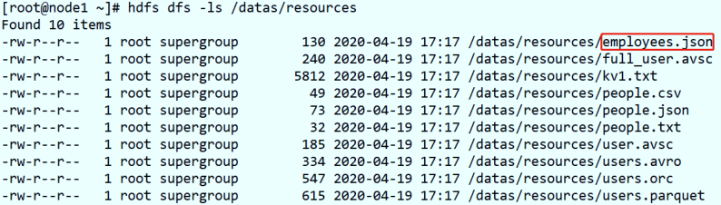

- 第二步、启动`pyspark`命令行，采用本地模式

```ini
(base) [root@node1 ~]# cd /export/server/spark-local

(base) [root@node1 spark-local]# bin/pyspark --master local[2]

>>> emp_df = spark.read.json("hdfs://node1.itcast.cn:8020/datas/resources/employees.json") 
>>> emp_df.printSchema()
root
 |-- name: string (nullable = true)
 |-- salary: long (nullable = true)

>>> emp_df.show()
+-------+------+
|   name|salary|
+-------+------+
|Michael|  3000|
|   Andy|  4500|
| Justin|  3500|
|  Berta|  4000|
+-------+------+

>>> emp_df.rdd
MapPartitionsRDD[12] at javaToPython at NativeMethodAccessorImpl.java:0

>>> emp_df.schema
StructType(List(StructField(name,StringType,true),StructField(salary,LongType,true)))

```

> 查看DataFrame中Schema是什么，执行如下命令：


> Schema封装类：`StructType`结构化类型里存储的每个字段封装的类型：`StructField`结构化字段。

- 其一、`StructType` 定义，属性为`StructField`的数组


- 其二、`StructField` 定义，有四个属性，其中字段名称和类型为必填

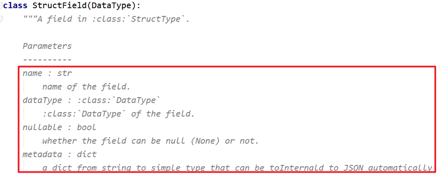

> 自定义Schema结构，官方提供实例代码：


> DataFrame中每条数据封装在`Row`中，Row表示每行数据，具体哪些字段未知，获取DataFrame中第一条数据

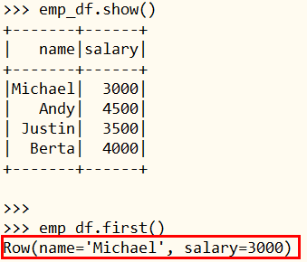

> 如何获取Row中每个字段的值

- 方式一：**下标获取**，从0开始，类似数组下标获取

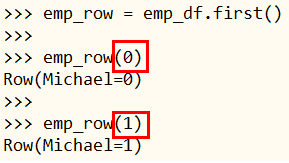

- 方式二：**指定属性名称，获取对应的值， 此种方式开发中使用最多**

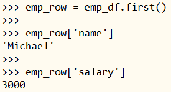

- 方式三：**指定属性名称，通过 `.` 方式获取值**

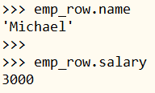

> 如何创建Row对象

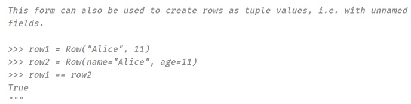

> 在SparkSQL模块中，将结构化数据封装到DataFrame中后，提供两种方式分析处理数据，正如前面案例【词频统计WordCount】两种方式：

- 第一种：`DSL（domain-specific language）`编程
  - 调用DataFrame  API （SQL 函数），类似SQL语句中关键字；
  - DSL编程中，调用函数更多是类似SQL语句关键词函数，比如select、groupBy，同时要使用函数处理
  - 函数库：`from pyspark.sql.functions import *` 

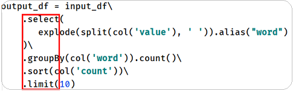

```python
# 导入函数库，别名：F，使用内置函数
import pyspark.sql.functions as F

F.split()
F.explode()
```

- 第二种：**`SQL` 编程**
  - [将DataFrame/Dataset注册为临时视图或表，编写SQL语句，类似HiveQL]()
  - 分为2步操作，先将DataFrame注册为临时视图，然后再编写SQL

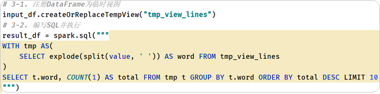

### 2. 自动推断类型转换DataFrame

> 实际项目开发中，往往需要将RDD数据集转换为DataFrame，本质上就是**给RDD加上Schema信息**，官方提供两种方式：`类型推断和自定义Schema`。

文档：https://spark.apache.org/docs/3.1.2/sql-getting-started.html#inferring-the-schema-using-reflection

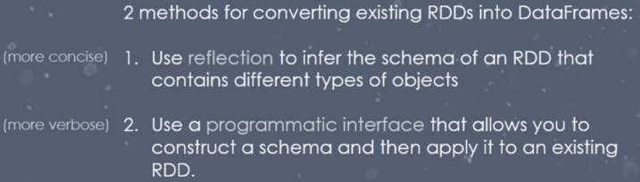

> **范例演示说明**：使用经典数据集【电影评分数据u.data】，==先读取为RDD，再转换为DataFrame==。

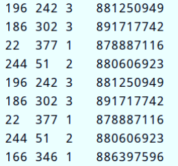

字段信息：`user id 、 item id、 rating 、 timestamp`。

> 将每行电影评分数据，解析封装到Row对象中，并且指定字段名称，如下示意图：


> **案例代码演示**： `04_create_dataframe_reflection.py`：加载文本文件数据封装为RDD，将每条数据转换为Row对象，指定列名称。

```python
#!/usr/bin/env python
# -*- coding: utf-8 -*-

import os
import re
from pyspark.sql import SparkSession, Row

if __name__ == '__main__':
    """
    RDD数据集转换为DataFrame，通过自动推断类型方式，要求RDD中数据为Row，并且指定列名称。
        RDD[Row(id=1001, name=zhangsan, age=24, ....)]  
    """

    # 设置系统环境变量
    os.environ['JAVA_HOME'] = '/export/server/jdk'
    os.environ['HADOOP_HOME'] = '/export/server/hadoop'
    os.environ['PYSPARK_PYTHON'] = '/export/server/anaconda3/bin/python3'
    os.environ['PYSPARK_DRIVER_PYTHON'] = '/export/server/anaconda3/bin/python3'

    # 1. 获取会话实例对象-session
    spark = SparkSession.builder \
        .appName('SparkSession Test') \
        .master('local[2]') \
        .getOrCreate()

    # 2. 加载数据源-source
    rating_rdd = spark.sparkContext.textFile('../datas/ml-100k/u.data')
    """
        每条数据：196	242	3	881250949
    """

    # 3. 数据转换处理-transformation
    """
        3-1. 将RDD中每条数据string，封装转换为Row对象
        3-2. 直接将Row RDD 转换为DataFrame
    """
    row_rdd = rating_rdd\
        .map(lambda line: re.split('\\s+', line))\
        .map(lambda list: Row(user_id=list[0], movie_id=list[1], rating=float(list[2]), timestamp=int(list[3])))

    rating_df = spark.createDataFrame(row_rdd)

    # 4. 处理结果输出-sink
    rating_df.printSchema()
    rating_df.show(n=10, truncate=False)

    # 5. 关闭会话实例对象-close
    spark.stop()

```

### 3. 自定义Schema转换DataFrame

`DataFrame = RDD[Row] + Schema`

> 依据RDD中数据自定义Schema，类型为`StructType`，每个字段的约束使用`StructField`定义，步骤如下：

- 第一步、**Create an RDD of tuples or lists from the original RDD**
  - RDD中数据类型为元组或列表，比如[RDD[list] 或  RDD[tuple]]()
- 第二步、**Create the schema represented by a `StructType`**
  - 创建Schema，定义列名称和列类型，与第一步中RDD匹配
- 第三步、Apply the schema to the RDD via `createDataFrame` method provided by `SparkSession`.
  - 使用SparkSession组合RDD和Schema，转换为DataFrame


> **案例代码演示**： `05_create_dataframe_schema.py`：加载文本文件数据，解析封装到元组中，再自定义Schema，最后应用到RDD转换为DataFrame。

```python
#!/usr/bin/env python
# -*- coding: utf-8 -*-

import os
import re
from pyspark.sql import SparkSession
from pyspark.sql.types import StructType, StructField, StringType, DoubleType, LongType

if __name__ == '__main__':
    """
    将RDD数据转换为DataFrame，采用自定义Schema方式：RDD[list/tuple]、StructType、组合RDD和Schema=DataFrame  
    """

    # 设置系统环境变量
    os.environ['JAVA_HOME'] = '/export/server/jdk'
    os.environ['HADOOP_HOME'] = '/export/server/hadoop'
    os.environ['PYSPARK_PYTHON'] = '/export/server/anaconda3/bin/python3'
    os.environ['PYSPARK_DRIVER_PYTHON'] = '/export/server/anaconda3/bin/python3'

    # 1. 获取会话实例对象-session
    spark = SparkSession.builder \
        .appName('SparkSession Test') \
        .master('local[2]') \
        .getOrCreate()

    # 2. 加载数据源-source
    rating_rdd = spark.sparkContext.textFile('../datas/ml-100k/u.data')

    # 3. 数据转换处理-transformation
    """
        3-1. RDD[list]
        3-2. schema： StructType
        3-3. createDataFrame
    """
    # 3-1. RDD[list]
    list_rdd = rating_rdd\
        .map(lambda line: re.split('\\s+', line))\
        .map(lambda list: [list[0], list[1], float(list[2]), int(list[3])])

    # 3-2. schema： StructType
    list_schema = StructType(
        [
            StructField("user_id", StringType(), True),
            StructField("movie_id", StringType(), True),
            StructField("rating", DoubleType(), True),
            StructField("timestamp", LongType(), True)
        ]
    )

    # 3-3. createDataFrame
    rating_df = spark.createDataFrame(list_rdd, schema=list_schema)

    # 4. 处理结果输出-sink
    rating_df.printSchema()
    rating_df.show(n=10, truncate=False)

    # 5. 关闭会话实例对象-close
    spark.stop()


```

### 4. 指定列名称toDF转换DataFrame

> SparkSQL中提供一个函数：`toDF`，通过**指定列名称**，将`数据类型为元组`的RDD转换为DataFrame，实际开发中也常常使用。


> **案例代码演示**： `06_create_dataframe_todf.py`：并行化方式创建RDD，数据类型为元组，调用toDF函数指定列名称。


```python
#!/usr/bin/env python
# -*- coding: utf-8 -*-

import os
import re
from pyspark.sql import SparkSession

if __name__ == '__main__':
    """
    RDD 数据集转换DataFrame，采用toDF函数，要求RDD数据类型必须是元组，指定列名称即可。  
    """

    # 设置系统环境变量
    os.environ['JAVA_HOME'] = '/export/server/jdk'
    os.environ['HADOOP_HOME'] = '/export/server/hadoop'
    os.environ['PYSPARK_PYTHON'] = '/export/server/anaconda3/bin/python3'
    os.environ['PYSPARK_DRIVER_PYTHON'] = '/export/server/anaconda3/bin/python3'

    # 1. 获取会话实例对象-session
    spark = SparkSession.builder \
        .appName('SparkSession Test') \
        .master('local[2]') \
        .getOrCreate()

    # 2. 加载数据源-source
    rating_rdd = spark.sparkContext.textFile('../datas/ml-100k/u.data')

    # 3. 数据转换处理-transformation
    """
        3-1. RDD[tuple]
        3-2. toDF()
    """
    # 3-1. RDD[tuple]
    tuple_rdd = rating_rdd\
        .map(lambda line: re.split('\\s+', line))\
        .map(lambda list: (list[0], list[1], float(list[2]), int(list[3])))

    # 3-2. toDF()
    rating_df = tuple_rdd.toDF(['user_id', 'movie_id', 'rating', 'timestamp'])

    # 4. 处理结果输出-sink
    rating_df.printSchema()
    rating_df.show(n=10, truncate=False)

    # 5. 关闭会话实例对象-close
    spark.stop()

```

## III. Top10电影分析

### 1. 业务需求分析

[对电影评分数据统计分析：获取Top10电影（电影评分平均值最高，并且每个电影被评分的次数大于2000）]()

> 数据集`ratings.dat`总共100万条数据，数据格式如下，每行数据各个字段之间使用双冒号分开：


> 最终分析的结果数据：


> 数据处理分析步骤如下：


> 加载电影评分数据：`datas/ratings.dat`，采用`toDF`指定列名称的方式，将数据封装到DataFrame中。

**案例代码演示**： `07_movies_analysis_rdd.py`：从本地文件系统加载数据，封装至RDD数据集中。

```python
#!/usr/bin/env python
# -*- coding: utf-8 -*-

import os
from pyspark.sql import SparkSession

if __name__ == '__main__':
    """
    Top10 电影分析（电影评分最高10个，并且每个电影评分人数大于2000）  
    """

    # 设置系统环境变量
    os.environ['JAVA_HOME'] = '/export/server/jdk'
    os.environ['HADOOP_HOME'] = '/export/server/hadoop'
    os.environ['PYSPARK_PYTHON'] = '/export/server/anaconda3/bin/python3'
    os.environ['PYSPARK_DRIVER_PYTHON'] = '/export/server/anaconda3/bin/python3'

    # 1. 获取会话实例对象-session
    spark = SparkSession.builder \
        .appName('SparkSession Test') \
        .master('local[4]') \
        .getOrCreate()

    # 2. 加载数据源-source
    rating_rdd = spark.sparkContext.textFile("../datas/ml-1m/ratings.dat")
    print('count:', rating_rdd.count())
    print(rating_rdd.first())

    # 3. 数据转换处理-transformation

    # 4. 处理结果输出-sink

    # 5. 关闭会话实例对象-close
    spark.stop()

```

### 2. 封装数据DataFrame

> 读取电影评分数据，转换为`DataFrame`，使用指定列名方式定义Schema信息，采用`toDF`函数，代码下：


> **案例代码演示**： `08_movies_analysis_df.py`，采用toDF函数方式，将RDD转换为DataFrame。

```python
    # 3-1. 将RDD数据封装转换为DataFrame数据集
    rating_df = rating_rdd\
        .map(lambda line: str(line).split('::'))\
        .map(lambda list: (list[0], list[1], float(list[2]), int(list[3])))\
        .toDF(['user_id', 'item_id', 'rating', 'timestamp'])
        
    # 4. 处理结果输出-sink
    rating_df.printSchema()
    rating_df.show(n=10, truncate=False) 
```


> 将RDD转换为DataFrame数据集，方便采用DSL或SQL分析数据。

### 3. 基于SQL分析

> **案例代码演示**： `09_movies_analysis_sql.py`，将DataFrame注册为临时视图，再编写SQL语句。

```python
    # 3-2. 编写SQL分析数据
    # step1、注册DataFrame为临时视图
    rating_df.createOrReplaceTempView('tmp_view_ratings')

    # step2、编写SQL语句
    """
        a. 每个电影平均评分和评分人数
            group by item_id
            avg(rating)、round
            count(item_id)
        b. top10电影
            rating_total > 2000
            rating_avg DESC
            limit 10
    """
    top10_movie_df = spark.sql("""
        SELECT
          item_id, COUNT(item_id) AS rating_total, ROUND(AVG(rating), 2) AS rating_avg
        FROM tmp_view_ratings
        GROUP BY item_id
        HAVING rating_total > 2000
        ORDER BY rating_avg DESC, rating_total DESC 
        LIMIT 10
    """)

    # 4. 处理结果输出-sink
    top10_movie_df.printSchema()
    top10_movie_df.show(n=10, truncate=False)
```

运行程序，结果如下图所示：

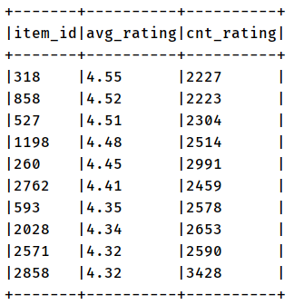

> 运行上述程序时，查看WEB UI监控页面发现，**某个Stage中有200个Task任务**，也就是说**RDD有200分区Partition。**


> 原因：在SparkSQL中当Job中产生Shuffle时，默认的分区数（`spark.sql.shuffle.partitions` ）为`200`，在`实际项目中要合理的设置`。在构建SparkSession实例对象时，设置参数的值。

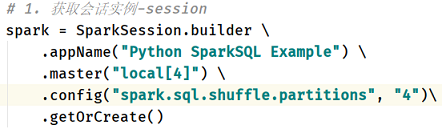

### 4. 关联电影数据

> 将前面电影评分数据分析中，分析结果数据与电影基本信息数据，依据电影ID关联，获取电影名称。

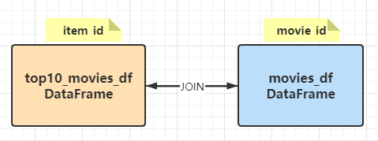

> 加载电影信息数据：`movies.dat`，封装为DataFrame（先RDD，再转换DataFrame）。

```python
    # 3-3. 加载电影基本信息数据
    movie_df = spark.sparkContext\
        .textFile('../datas/ml-1m/movies.dat')\
        .map(lambda line: str(line).split('::'))\
        .toDF(['movie_id', 'title', 'genres'])
    movie_df.printSchema()
    movie_df.show(n=10, truncate=False)
```

> 将Top10电影评分数据与电影数据进行关联Join，采用SQL语句分析，需要将DataFrame注册为临时视图。

```python
    # 3-4. 将Top10电影与电影基本信息数据进行JOIN，采用SQL
    # 注册DataFrame为临时视图
    top10_movie_df.createOrReplaceTempView("view_tmp_top_movies")
    movie_df.createOrReplaceTempView("view_tmp_movies")
    # 编写SQL，进行JOIN
    result_df = spark.sql("""
        SELECT 
          t2.title, t1.rating_avg , t1.rating_total
        FROM 
          view_tmp_top_movies t1 JOIN view_tmp_movies t2 ON t1.item_id = t2.movie_id
    """)

    # 4. 处理结果输出-sink
    result_df.printSchema()
    result_df.show(n=10, truncate=False)
```

运行上述代码，最后结果如下：

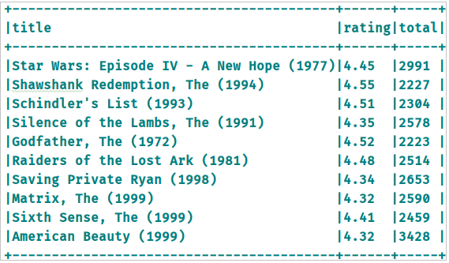

完整代码(John版): 

```python
#!/usr/bin/env python
# -*- coding: utf-8 -*-

import os

from pyspark.sql import SparkSession

if __name__ == '__main__':
    """
    TODO:
    完整Top10电影分析代码
    """
    # 设置系统环境变量
    os.environ['JAVA_HOME'] = '/export/server/jdk'
    os.environ['HADOOP_HOME'] = '/export/server/hadoop'
    os.environ['PYSPARK_PYTHON'] = '/export/server/anaconda3/bin/python3'
    os.environ['PYSPARK_DRIVER_PYTHON'] = '/export/server/anaconda3/bin/python3'

    # 获取会话实例对象-session
    # 根据性能自动指定线程数, 指定分区数为4
    spark = SparkSession.builder \
        .appName("Top10 Movies Analysis PySparkSQL Implement By John Chow") \
        .master("local[*]") \
        .config("spark.sql.shuffle.partition", "4") \
        .getOrCreate()

    # textFile加载用户评分数据集为RDD
    # 使用map算子转换
    # 使用toDF指定列名称转换成DataFrame
    # 一气呵成链式处理成评分表临时视图
    """
    评分数据格式:
      user_id(string)::
      item_id(string)::
      rating(double)::
      timestamp(long)
    """
    spark.sparkContext \
        .textFile('../datas/ml-1m/ratings.dat') \
        .map(lambda line: str(line).split('::')) \
        .map(lambda lst: (lst[0], lst[1], float(lst[2]), int(lst[3]))) \
        .toDF(['user_id', 'item_id', 'rating', 'timestamp']) \
        .createOrReplaceTempView("rating_temp_view")

    # textFile加载电影基本信息数据为RDD
    # 使用map算子转换
    # 使用toDF指定列名称转换成DataFrame
    # 一气呵成链式处理成电影基本信息表临时视图
    """
    电影基本信息数据格式:
        movie_id(string)::
        title(string)::
        genres(string)
    """
    spark.sparkContext \
        .textFile('../datas/ml-1m/movies.dat') \
        .map(lambda line: str(line).split('::')) \
        .map(lambda lst: (lst[0], lst[1], lst[2])) \
        .toDF(['movie_id', 'title', 'genres']) \
        .createOrReplaceTempView("movie_temp_view")

# 编写Spark SQL语句
top10_movie_df = spark.sql(
    """
        with temp_result as (
            select 
                item_id,
                round(avg(rating), 2) avg_rating,
                count(item_id) total
            from 
                rating_temp_view
            group by 
                item_id
            having 
                total > 2000
        )
        select 
            mtv.title,
            tr.avg_rating rating,
            tr.total
        from 
            temp_result tr
        join 
            movie_temp_view mtv 
        on 
            tr.item_id = mtv.movie_id
        order by 
            rating desc 
        limit 10
    """
)

# 输出结果(不裁剪长度)
top10_movie_df.show(truncate=False)

# 关闭上下文对象
spark.stop()

"""
排序逻辑问题: 
    如果把order by写在CTE中则无法按照评分为第一优先级排序, 第一名不是<肖申克的救赎>
    将order by写在最外层后用limit 10限制结果行数则得到想要结果
"""

```

