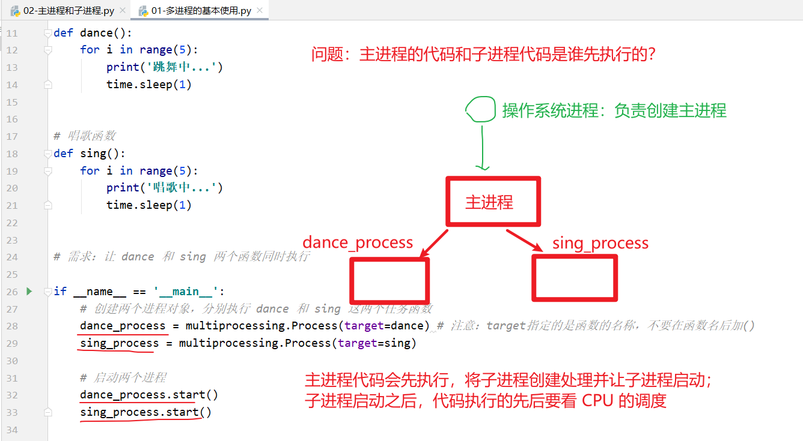
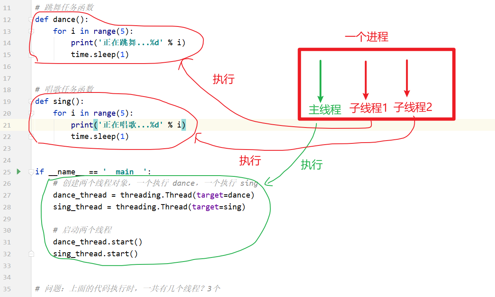
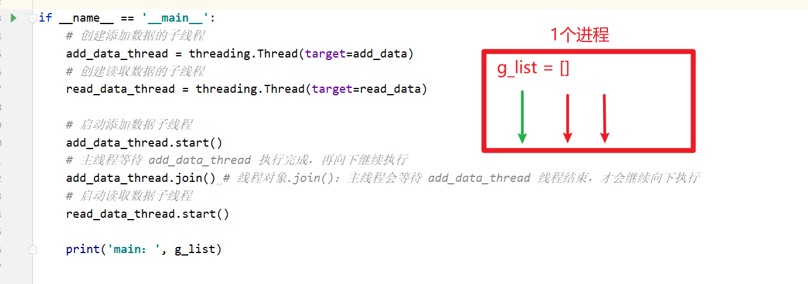
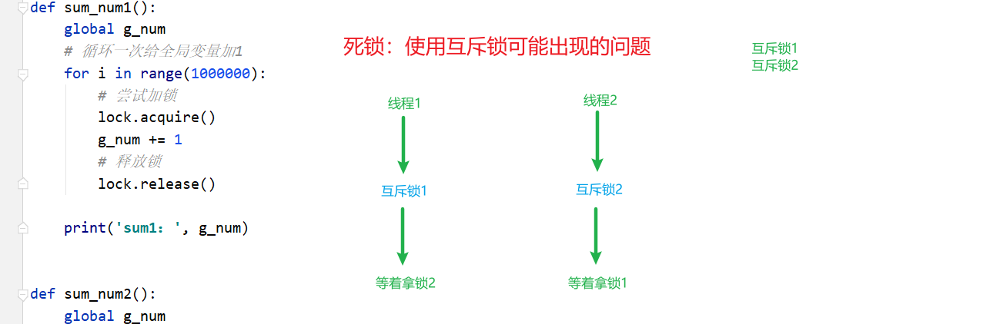
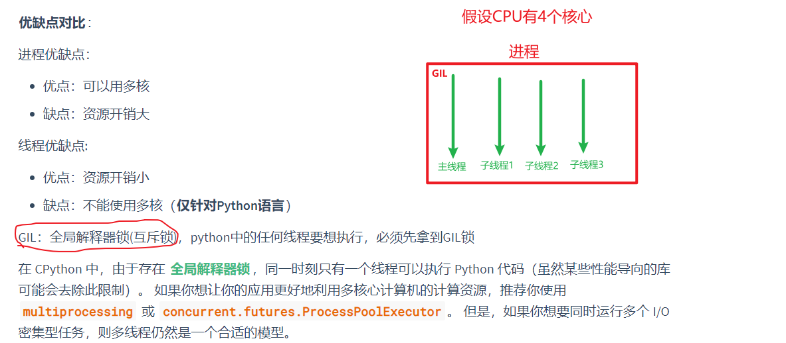
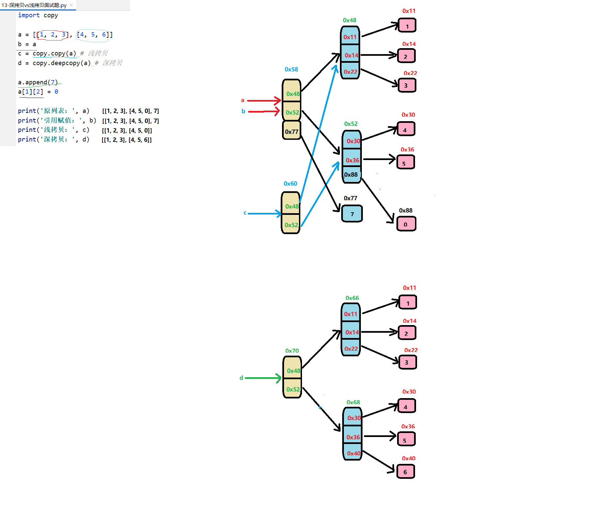

# 多任务编程&深浅拷贝

## I. 多任务编程

1. ### 多任务的基本概念

    - 多个任务同时执行
    - 充分利用CPU资源, 提高程序执行效率

2. ### 多任务实现方式:

    > **多进程**&**多线程**

3. ### 多任务执行方式:

    > **并发**&**并行**

    并发: 在同一时间内快速交替去执行多个任务, 要求任务数量大于CPU的核心数

    并行: 同一时间内同时一起执行多个任务, 要求任务数量小于等于CPU的核心数

4. ### 进程的基本概念

    - 资源分配的最小单位, 它是**操作系统进行资源分配的基本单位**, 一个正在运行的程序就是一个进程

        > **一个程序运行后至少有一个进程**

5. ### Python中多进程的基本使用

    ```python
    """
    多进程的基本使用
    学习目标：能够使用多进程同时执行两个不同的任务函数
    """
    import time
    # 1.导入多进程包
    import multiprocessing
    
    
    # 跳舞函数
    def dance():
        for i in range(5):
            print('跳舞中...')
            time.sleep(1)
    
    
    # 唱歌函数
    def sing():
        for i in range(5):
            print('唱歌中...')
            time.sleep(1)
    
    
    if __name__ == '__main__':
        # 创建一个进程, 指定执行dance函数, 注意target=函数名, 不能加括号
        dance_process = multiprocessing.Process(target=dance)
        # 再创建一个进程, 指定执行sing函数
        sing_process = multiprocessing.Process(target=sing)
        
        # 启动两个进程
        dance_process.start()
        sing_process.start()
    ```

6. ### 进程关系-主进程和子进程

    - 命令行执行:

        tasklist: 查看Windows系统中整体执行的进程

        tasklist | findstr python: 查看Windows系统中正在运行的Python进程

    - 获取进程编号函数:

        ```python
        import os
        os.getpid()		# 获取当前进程的编号
        os.getppid()	# 获取当前进程父进程的编号
        ```

    

7. ### 进程执行带有参数的任务

    

    ```python
    """
    进程执行带有参数的任务(函数)
    学习目录：能够使用多进程执行带有参数的任务
    """
    
    import multiprocessing
    import time
    
    
    # 带有参数的任务(函数)
    def task(count):
        for i in range(count):
            print('任务执行中...')
            time.sleep(0.2)
        else:
            print('任务执行完成')
    
    
    if __name__ == '__main__':
        # 创建一个进程, 指定执行task函数
        # 通过元组指定任务函数的参数: args=(5, ), 按照参数顺序指定参数的值
        # sub_process = multiprocessing.Process(target=task, args(5, ))
    
        # 通过字典指定任务函数的参数: kwargs={'count': 3}, 按照参数名称指定参数的值
        sub_process = multiprocessing.Process(target=task, kwargs={'count': 3})
    
        # 启动进程
        sub_process.start()
    ```

8. ### 进程使用的2个注意点

    - 进程之间不共享全局变量

    > 创建子进程时, 子进程会将主进程的内容全部复制一份

    

    ```python
    # 注意点1：进程之间不共享全局变量
    import multiprocessing
    import time
    
    # 定义全局变量
    g_list = []
    
    
    # 添加数据的函数
    def add_data():
        for i in range(5):
            g_list.append(i)
            print('add：', i)
            time.sleep(0.2)
    
        print('add_data：', g_list)
    
    
    # 读取数据的函数
    def read_data():
        print('read_data：', g_list)
    
    
    if __name__ == '__main__':
        # 创建添加数据的子进程
        add_data_process = multiprocessing.Process(target=add_data)
        # 创建读取数据的子进程
        read_data_process = multiprocessing.Process(target=read_data)
    
        # 启动添加数据子进程
        add_data_process.start()
        # 主进程等待 add_data_process 执行完成，再向下继续执行
        add_data_process.join()
        # 启动读取数据子进程
        read_data_process.start()
    
        print('main：', g_list)
    ```

    

    - 主进程会等待所有的子进程结束再结束

    ```python
    # 注意点2：主进程会等待所有的子进程执行结束再结束
    import multiprocessing
    import time
    
    
    # 任务函数
    def task():
        for i in range(10):
            print('任务执行中...')
            time.sleep(0.2)
    
    
    if __name__ == '__main__':
        # 创建子进程并启动
        sub_process = multiprocessing.Process(target=task)
        sub_process.start()
    
        # 主进程延时 1s
        time.sleep(1)
        print('主进程结束！')
        # 退出程序
        exit()
    ```

9. ### 守护进程和终止子进程

    1. 主进程和子进程执行的先后

        

    2. 将子进程设置为守护进程

    ```python
    import multiprocessing
    import time
    
    
    # 方式1：将子进程设置为守护进程
    
    # 任务函数
    def task():
        for i in range(10):
            print('任务执行中...')
            time.sleep(0.2)
    
    
    if __name__ == '__main__':
        # 创建子进程并启动
        sub_process = multiprocessing.Process(target=task)
        # TODO：设置子进程为守护进程
        sub_process.daemon = True
        sub_process.start()
    
        # 主进程延时 1s
        time.sleep(1)
        print('主进程结束！')
        # 退出程序
        exit()
    ```

    3. 主进程结束时终止子进程

    ```python
    import multiprocessing
    import time
    
    
    # 任务函数
    def task():
        for i in range(10):
            print('任务执行中...')
            time.sleep(0.2)
    
    
    if __name__ == '__main__':
        # 创建子进程并启动
        sub_process = multiprocessing.Process(target=task)
        sub_process.start()
    
        # 主进程延时 1s
        time.sleep(1)
        print('主进程结束！')
        # TODO: 终止子进程
        sub_process.terminate()
        # 退出程序
        exit()
    ```

10. ### 线程的基本概念

    - #### CPU调度的基本单位

    > 进程理解为公司, 线程理解为公司中的员工. 公司负责提供资源, 员工负责实际干活

    

11. ### Python中多线程的基本使用

    ```python
    """
    多线程的基本使用
    学习目标：能够使用多线程同时执行两个不同的函数
    """
    
    import time
    # 导入线程模块
    import threading
    
    
    # 跳舞任务函数
    def dance():
        for i in range(5):
            print('正在跳舞...%d' % i)
            time.sleep(1)
    
    
    # 唱歌任务函数
    def sing():
        for i in range(5):
            print('正在唱歌...%d' % i)
            time.sleep(1)
    
    
    if __name__ == '__main__':
        # 创建一个线程, 执行dance任务函数
        dance_thread = threading.Thread(target=dance)
    
        # 再创建一个线程, 执行sing任务函数
        sing_thread = threading.Thread(target=sing)
    
        # 启动这两个线程
        dance_thread.start()
        sing_thread.start()
    ```

12. ### 线程执行带有参数的任务

    ```python
    """
    线程执行带有参数的任务(函数)
    学习目录：能够使用多线程执行带有参数的任务
    """
    # 导入线程模块
    import threading
    import time
    
    
    # 带有参数的任务(函数)
    def task(count):
        for i in range(count):
            print('任务执行中...')
            time.sleep(0.2)
        else:
            print('任务执行完成')
    
    
    if __name__ == '__main__':
        # 创建一个线程，执行 task 任务函数
        # sub_thread = threading.Thread(target=task, args=(3, ))
        sub_thread = threading.Thread(target=task, kwargs={'count': 5})
        # 启动线程
        sub_thread.start()
    ```

13. ### 线程使用的3个注意点

    1. #### 线程之间的执行是无序的

    ```python
    # 注意点1：线程之间执行是无序的
    import threading
    import time
    
    
    def task():
        time.sleep(1)
        print(f'当前线程：{threading.current_thread().name}')
    
    
    if __name__ == '__main__':
        for i in range(5):
            sub_thread = threading.Thread(target=task)
            sub_thread.start()
    ```

    2. #### 主线程会等待所有的子线程执行结束再结束

    ```python
    # 注意点2：主线程会等待所有的子线程执行结束再结束
    import threading
    import time
    
    
    def task():
        for i in range(5):
            print('任务执行中...')
            time.sleep(0.5)
    
    
    if __name__ == '__main__':
        # 创建子线程
        sub_thread = threading.Thread(target=task)
        sub_thread.start()
    
        # 主进程延时 1s
        time.sleep(1)
        print('主线程结束！')
    ```

    3. #### 线程之间共享全局变量

    

    ```python
    # 注意点3：线程之间共享全局变量
    import threading
    import time
    
    # 定义全局变量
    g_list = []
    
    
    # 添加数据的函数
    def add_data():
        for i in range(5):
            g_list.append(i)
            print('add：', i)
            time.sleep(0.2)
    
        print('add_data：', g_list)
    
    
    # 读取数据的函数
    def read_data():
        print('read_data：', g_list)
    
    
    if __name__ == '__main__':
        # 创建添加数据的子线程
        add_data_thread = threading.Thread(target=add_data)
        # 创建读取数据的子线程
        read_data_thread = threading.Thread(target=read_data)
    
        # 启动添加数据子线程
        add_data_thread.start()
        # 主线程等待 add_data_thread 执行完成，再向下继续执行
        add_data_thread.join()
        # 启动读取数据子线程
        read_data_thread.start()
    
        print('main：', g_list)
    ```

14. ### 守护线程设置

    - 设置守护线程, 让子线程在主线程执行结束时就结束执行

    - **sub_thread.daemon = True**

        或

        **sub_thread.setDaemon(True)**

    ```python
    """
    守护线程
    学习目标：能够设置守护线程
    """
    
    """
    如何让主线程执行结束时，子线程就结束执行？
    答：将子线程设置为守护线程
    """
    
    import threading
    import time
    
    
    # 任务函数
    def task():
        for i in range(10):
            print('任务执行中...')
            time.sleep(0.2)
    
    
    if __name__ == '__main__':
        # 创建子线程并启动
        sub_thread = threading.Thread(target=task)
        # TODO：设置子线程为守护线程
        # sub_thread.daemon = True
        sub_thread.setDaemon(True)
        sub_thread.start()
    
        # 主线程延时 1s
        time.sleep(1)
        print('主线程结束！')
    ```

15. ### 线程的资源共享问题

    - #### 多线程会共享全局变量, 当多个线程同时操作同一个共享的全局变量时, 可能会造成错误的结果!

    ```python
    """
    多线程会共享全局变量，当多个线程同时操作同一个共享的全局变量时，可能会造成错误的结果！
    """
    
    import threading
    
    # 定义全局变量
    g_num = 0
    
    
    def sum_num1():
        global g_num
        # 循环一次给全局变量加1
        for i in range(1000000):
            g_num += 1
    
        print('sum1：', g_num)
    
    
    def sum_num2():
        global g_num
        # 循环一次给全局变量加1
        for i in range(1000000):
            g_num += 1
    
        print('sum2：', g_num)
    
    
    if __name__ == '__main__':
        # 创建两个线程
        first_thread = threading.Thread(target=sum_num1)
        second_thread = threading.Thread(target=sum_num2)
    
        # 启动两个线程
        first_thread.start()
        second_thread.start()
    ```

16. ### 线程资源共享问题解决: 线程等待vs互斥锁

    - 实现**线程同步**

    - 线程等待: **join**: 等待一个线程完全执行结束之后, 再执行另外一个线程

        ```python
        """
        多线程会共享全局变量，当多个线程同时操作同一个共享的全局变量时，可能会造成错误的结果！
        """
        
        import threading
        
        # 定义全局变量
        g_num = 0
        
        
        def sum_num1():
            global g_num
            # 循环一次给全局变量加1
            for i in range(1000000):
                g_num += 1
        
            print('sum1：', g_num)
        
        
        def sum_num2():
            global g_num
            # 循环一次给全局变量加1
            for i in range(1000000):
                g_num += 1
        
            print('sum2：', g_num)
        
        
        if __name__ == '__main__':
            # 创建两个线程
            first_thread = threading.Thread(target=sum_num1)
            second_thread = threading.Thread(target=sum_num2)
        
            # 启动两个线程
            first_thread.start()
            # 线程等待: 等待first_thread执行完成, 主线程的代码再继续向下执行
            first_thread.join()
            second_thread.start()
        ```

    - #### 互斥锁: 操作共享资源时, 多个线程去抢同一把锁, 抢到锁的线程执行, 没抢到的线程会阻塞等待

        ```python
        # 互斥锁：多个线程去抢同一把"锁"，抢到锁的线程执行，没抢到锁的线程会阻塞等待
        import threading
        
        # 定义全局变量
        g_num = 0
        
        # 创建一把全局的互斥锁
        lock = threading.Lock()
        
        
        def sum_num1():
            global g_num
            # 循环一次给全局变量加1
            for i in range(1000000):
                # 加锁: 拿到锁的线程代码可以继续向下执行, 拿不到锁的现成代码会阻塞等待
                lock.acquire()
                g_num += 1
                # 释放锁
                lock.release()
        
            print('sum1：', g_num)
        
        
        def sum_num2():
            global g_num
        
            # 循环一次给全局变量加1
            for i in range(1000000):
                # 加锁: 拿到锁的线程代码可以继续向下执行, 拿不到锁的现成代码会阻塞等待
                lock.acquire()
                g_num += 1
                # 释放锁
                lock.release()
        
            print('sum2：', g_num)
        
        
        if __name__ == '__main__':
            # 创建两个线程
            first_thread = threading.Thread(target=sum_num1)
            second_thread = threading.Thread(target=sum_num2)
        
            # 启动两个线程
            first_thread.start()
            second_thread.start()
        ```

    - **线程等待部署在主线程中, 互斥锁放置在各子线程中**, 线程等待会降低程序的执行效率

    

    - 死锁

    

17. ### 进程和线程对比

    - #### 线程依附在进程里面, 没有进程就没有线程

    - #### 一个进程默认提供一个线程(主线程), 进程可以创建多个线程

    - #### 区别对比

        - 进程是操作系统资源分配的基本单位, 线程是CPU调度的基本单位
        - 线程不能独立执行, 必须存在于进程中
        - 创建进程的资源开销要比创建线程的资源开销更大
        - 进程之间不共享全局变量, 线程之间共享全局变量, 但是要注意资源竞争问题(线程等待&互斥锁)
        - 多进程开发比单进程多线程开发稳定性要强

    - #### 优缺点对比

        ##### 进程

        - 优点: 可以使用多核
        - 缺点: 资源开销大

        ##### 线程

        - 优点: 资源开销小
        - 缺点: 不能使用多核(**仅针对Python**, 其他语言可以)

        GIL: 全局解释器锁, Python中任何线程想要执行, 必须先拿到GIL, 同一时刻只有一个线程线程可以执行Python代码

        

## II. 深拷贝和浅拷贝

1. ### = 号引用赋值

    

2. ### 简单容器类型和嵌套容器类型

    无论简单容器类型还是嵌套容器类型, 其中存放的元素本质都是地址

3. ### 浅拷贝

    #### 可变容器类型: 列表

    > ##### 可变容器类型, 进行浅拷贝时, 只会对第一层数据重新开辟内存, 进行拷贝

    ```python
    import copy
    
    # 简单列表
    my_li1 = [3, 5, 1]
    
    # 浅拷贝
    my_li3 = copy.copy(my_li1)
    
    print('id(my_li1)：', id(my_li1))
    print('id(my_li3)：', id(my_li3))
    
    print('id(my_li1[0])：', id(my_li1[0]))
    print('id(my_li3[0])：', id(my_li3[0]))
    
    print('=' * 20)
    
    # 嵌套列表
    my_li2 = [[2, 4], 6, 7]
    
    # 浅拷贝
    my_li4 = copy.copy(my_li2)
    
    print('id(my_li2)：', id(my_li2))
    print('id(my_li4)：', id(my_li4))
    
    print('id(my_li2[0])：', id(my_li2[0]))
    print('id(my_li4[0])：', id(my_li4[0]))
    ```

    #### 不可变容器类型: 元组

    > ##### 不可变容器类型, 进行浅拷贝时, 不会重新开辟内存, 等同于=号赋值

    ```python
    import copy
    
    # 简单元组
    my_tuple1 = (2, 3, 5)
    
    # 浅拷贝
    my_tuple3 = copy.copy(my_tuple1)
    
    print('id(my_tuple1)：', id(my_tuple1))
    print('id(my_tuple3)：', id(my_tuple3))
    
    print('=' * 20)
    
    # 嵌套元组
    my_tuple2 = ([3, 5], 2, 1)
    
    # 浅拷贝
    my_tuple4 = copy.copy(my_tuple2)
    
    print('id(my_tuple2)：', id(my_tuple2))
    print('id(my_tuple4)：', id(my_tuple4))
    ```

3. ### 深拷贝

    #### 可变容器类型: 列表

    > ##### 可变容器类型, 进行深拷贝时, 每一层可变数据都会重新开辟内存, 进行拷贝

    ```python
    import copy
    
    # 简单列表
    my_li1 = [3, 5, 1]
    
    # 深拷贝
    my_li3 = copy.deepcopy(my_li1)
    
    print('id(my_li1)：', id(my_li1))
    print('id(my_li3)：', id(my_li3))
    
    print('id(my_li1[0])：', id(my_li1[0]))
    print('id(my_li3[0])：', id(my_li3[0]))
    
    print('=' * 20)
    
    # 嵌套列表
    my_li2 = [[2, 4], 6, 7]
    
    # 深拷贝
    my_li4 = copy.deepcopy(my_li2)
    
    print('id(my_li2)：', id(my_li2))
    print('id(my_li4)：', id(my_li4))
    
    print('id(my_li2[0])：', id(my_li2[0]))
    print('id(my_li4[0])：', id(my_li4[0]))
    ```

    #### 不可变容器类型: 元组

    > ##### 不可变容器类型, 进行深拷贝时, 其本身不会重新开辟内存, 等同于=号赋值, 若其内层有可变容器类型, 则会对此可变容器类型重新开辟内存空间, 进行拷贝

    ```python
    import copy
    
    # 简单元组
    my_tuple1 = (2, 3, 5)
    
    # 深拷贝
    my_tuple3 = copy.deepcopy(my_tuple1)
    
    print('id(my_tuple1)：', id(my_tuple1))
    print('id(my_tuple3)：', id(my_tuple3))
    
    print('=' * 20)
    
    # 嵌套元组
    my_tuple2 = ([3, 5], 2, 1)
    
    # 深拷贝
    my_tuple4 = copy.deepcopy(my_tuple2)
    
    print('id(my_tuple2)：', id(my_tuple2))
    print('id(my_tuple4)：', id(my_tuple4))
    ```

4. ### 深拷贝和浅拷贝总结

    #### 浅拷贝:

    - 可变容器类型进行浅拷贝时, 只会对第一层数据重新开辟内存空间进行拷贝
    - 不可变容器类型进行浅拷贝时, 不会重新开辟内存空间, 等同于=赋值

    #### 深拷贝:

    - 可变容器类型进行深拷贝时, 每一层可变数据都会重新开辟内存进行拷贝
    - 不可变容器类型进行深拷贝时, 对于每一层不可变数据不会重新开辟内存, 等同于=号赋值, 对于每一层中的可变数据类型则会重新开辟内存空间进行拷贝

5. ### 赋值与深浅拷贝面试题

    ```python
    import copy
    
    a = [[1, 2, 3], [4, 5, 6]]
    b = a
    c = copy.copy(a)
    d = copy.deepcopy(a)
    
    a.append(7)
    a[1][2] = 0
    
    '''
    a : [[1, 2, 3], [4, 5, 0], 7]
    b : [[1, 2, 3], [4, 5, 0], 7]
    c : [[1, 2, 3], [4, 5, 0]]
    d : [[1, 2, 3], [4, 5, 6]]
    '''
    print('原列表: ', a)
    print('引用赋值: ', b)
    print('浅拷贝: ', c)
    print('深拷贝: ', d)
    ```

    