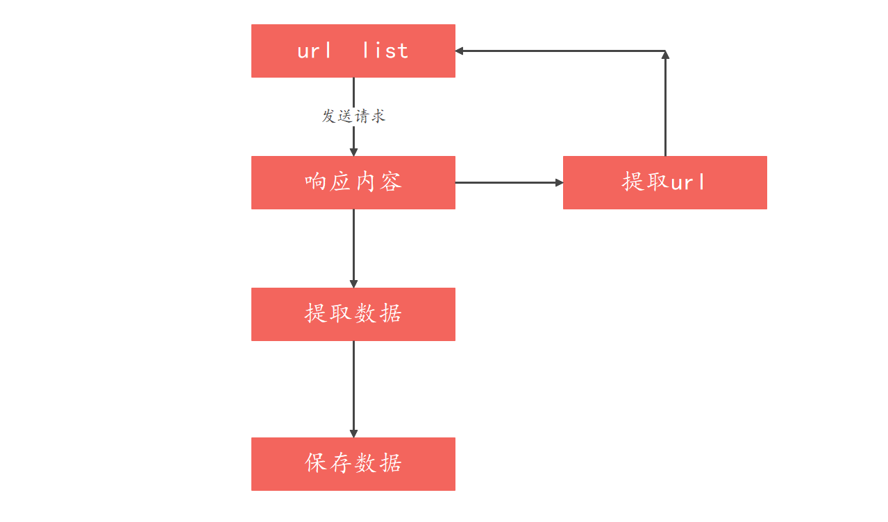

[TOC]

# 正则表达式&爬虫程序

## I. 正则表达式

1. ### 正则表达式的作用

    ##### 正则表达式(Regular Expression)描述了一种字符串匹配的模式, 可以用来检查有一个串是否有某种子串, 将匹配的子串做替换或者从某个串中取出符合某个条件的字串等

    功能:

    - 数据验证(表单验证: 如手机, 邮箱, IP地址格式验证)
    - 数据检索(数据检索, 数据抓取)
    - 数据隐藏(`132****5776` 周先生)
    - 数据过滤(论坛敏感关键词过滤)

    > ##### 正则表达式并不是Python特有的, 其他语言也可能支持正则表达式

2. ### 正则表达式的语法

    - ##### 在线练习网址: https://tool.oschina.net/regex

    - ##### 匹配单个字符:

        - 单个字符本身
        - `.`: 匹配任意1个字符(除了\n), 匹配`.`则用`\.`
        - `[]`: 匹配[]中列举的字符
        - `\d`: 匹配数字
        - `\D`: 匹配非数字
        - `\s`: 匹配空白(空格, tab等)
        - `\S`: 匹配非空白
        - `\w`: 匹配非特殊字符(字母, 数字)
        - `\W`: 匹配特殊字符

    - ##### 匹配多个字符(连续匹配):

        - `*`: 匹配前一个字符出现0次或无限次
        - `+`: 匹配前一个字符出现1次或无限次
        - `?`: 匹配前一个字符出现1次或0次, 即要么有1次, 要么没有

        - `{m}`: 匹配前一个字符出现m次
        - `{m, n}`: 匹配前一个字符出现从m到n次

    - ##### 匹配开头结尾vs其他匹配

        - `^`: 匹配字符串开头
        - `$`: 匹配字符串结尾
        - `[^指定字符]`: 匹配**除了**指定字符以外的所有字符
        - `|`: 匹配左右任意一个表达式

3. ### re正则模块的使用

    re: regex模块

    - match方法的使用

    ```python
    """
    re 正则模块：match、search、findall
    学习目标：能够使用 re 模块中 match、search、findall 三个函数进行字符串的匹配
    """
    import re
    
    """
    match函数：re.match(pattern, string, flags=0)
    功能：尝试从字符串起始位置匹配一个正则表达式
            1）如果不能从起始位置匹配成功，则返回None；
            2）如果能从起始位置匹配成功，则返回一个匹配的对象
    """
    
    my_str1 = 'abc_123_DFG_456'
    
    # 匹配字符串bc(注：从头开始)
    res1 = re.match('bc', my_str1)
    print(res1)  # None, 因为match从头开始匹配
    
    # 匹配字符串abc(注：从头开始)
    res2 = re.match('abc', my_str1)
    # 匹配成功返回一个Match对象
    
    print("=" * 20)
    """
    search函数：re.search(pattern, string, flags=0)
    功能：根据正则表达式扫描整个字符串，并返回第一个成功的匹配
            1）如果不能匹配成功，则返回None；
            2）如果能匹配成功，则返回一个匹配对象
    """
    
    my_str2 = 'abc_123_DFG_456'
    
    # 匹配连续的3位数字
    print(re.search('\d{3}', my_str2).group())
    print("=" * 20)
    """
    findall函数：re.findall(pattern, string, flags=0)
    功能：根据正则表达式扫描整个字符串，并返回所有能成功匹配的子串
            1）如果不能匹配成功，则返回一个空列表；
            2）如果能匹配成功，则返回包含所有匹配子串的列表
    """
    
    my_str3 = 'abc_123_DFG_456'
    
    # 匹配字符串中的所有连续的3位数字
    print(re.findall('\d{3}', my_str3))
    ```

    - split函数
    - 

4. ### 贪婪模式vs非贪婪模式

    ```python
    
    ```

## II. 爬虫程序

1. ### 爬虫工作的流程

    

2. ### FastAPI返回图片数据

3. ### FastAPI提取URL地址数据

4. ### 爬虫的概念和作用

5. ### requests的简单使用