# PySpark安装部署及入门案例

## 大数据技术框架

> 整个大数据技术框架学习，可以划分为4个阶段：==离线分析、内存分析、实时存储和实时分析。==


```ini
# 第1部分、离线分析（Batch Processing）
	分布式协作服务框架Zookeeper
	大数据基础框架Hadoop（HDFS、MapReduce和YARN）
	大数据数仓框架Hive
	大数据辅助框架：FLUME、SQOOP、Oozie和Hue

# 第2部分、内存分析（In-Memory Processing）
	Apache Spark（Environment环境、Core、SQL等），属于批处理，相比MapReduce快
	将分析数据封装到数据结构：RDD（分布式集合），类似Python中列表list，调用函数处理数据

# 第3部分、实时存储
	基于Key-Value内存数据Redis
	大数据NoSQL海量数据库HBase
	分布式消息队列Kafka
	
# 第4部分、实时计算
	Apache Flink（实时流式计算框架，天猫双十一实时大屏）：Environment、DataStream和Table API & SQL
		数据流封装DataStream，调用函数处理
		Table API和SQL批处理和流计算
```

## 集中式计算和分布式计算

> ​	对于数据的计算形式可以多种多样，如果从数据处理的历史进程来划分，可以分为：**大数据时代之前的集中式数据计算**和**大数据时代的分布式数据计算**。


​																		[数据计算定义：将特定数据集处理成业务需要的样子。]()

> 1、集中式计算：在大数据时代之前的数据计算，可以称之为集中式计算，所谓集中式，意思就是**单个进程内部或者单机内部对数据进行计算**。


- 最大的瓶颈是**只能利用单台服务器的资源**，因此其计算规模很容易达到极限。

> 2、分布式计算：**针对一类数据进行计算过程中，将共性部分进行抽象形成的软件框架叫做计算引擎**。

- MapReduce 作为大数据时代分布式计算的开山鼻祖，具有划时代意义，**最核心的思想就是：分而治之**。
- 原来一台机器搞不定，那就多台机器一起帮忙，**每台机器计算一部分，然后将每台机器计算的结果再传到其中的一台或者几台机器进行汇总，最终得出计算结果**。
- 对于大数据时代而言，其**数据计算的共性部分就是map跟reduce**。注意，这里的map跟reduce是广义的。

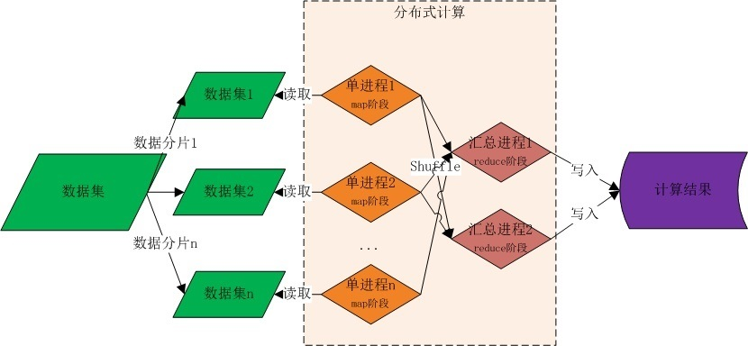

## Spark框架概述

### Spark发展及概念

​			Apache  Spark是一个开源的类似于Hadoop MapReduce的==通用的并行计算框架==，Spark基于map reduce算法实现的分布式计算，拥有Hadoop MapReduce所具有的优点；**但不同于MapReduce的**是Spark中的Job中间输出和结果**可以保存在内存中**，从而不再需要频繁读写磁盘，因此Spark能更好地适用于数据挖掘与机器学习等需要迭代的map reduce的算法。


- 2009年Spark诞生于伯克利AMPLab，伯克利大学的研究性项目
- 2010年通过BSD 许可协议正式对外开源发布
- 2012年Spark第一篇论文发布，第一个正式版（Spark 0.6.0）发布
- 2013年Databricks公司成立并将Spark捐献给Apache软件基金会
- 2014年2月成为Apache顶级项目，同年5月发布Spark 1.0正式版本
- 2015年引入DataFrame大数据分析的设计概念
- 2016年引入DataSet更强大的数据分析设计概念并正式发布Spark2.0
- 2017年Structured streaming 发布，统一化实时与离线分布式计算平台
- 2018年Spark2.4.0发布，成为全球最大的开源项目
- 2019年11月Spark官方发布3.0预览版
- 2020年6月Spark发布3.0.0正式版

​	Aapche Spark 是一种快速、通用、可扩展的**大数据分析引擎**，2009 年诞生于加州大学伯克利分校 AMPLab，2010 年开源， 2013年6月成为Apache孵化项目，2014年2月成为 Apache 顶级项目，`用 Scala进行编写项目框架`。

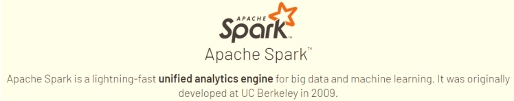

​	从世界著名的开发者论坛，Stack Overflow的数据可以看出，2015年开始Spark每月的问题提交数量已经超越Hadoop，而2018年Spark Python版本的API PySpark每月的问题提交数量也已超过Hadoop。2019年排名Spark第一，PySpark第二；而十年的累计排名是Spark第一，PySpark第三。按照这个趋势发展下去，**Spark和PySpark在未来很长一段时间内应该还会处于垄断地位。**

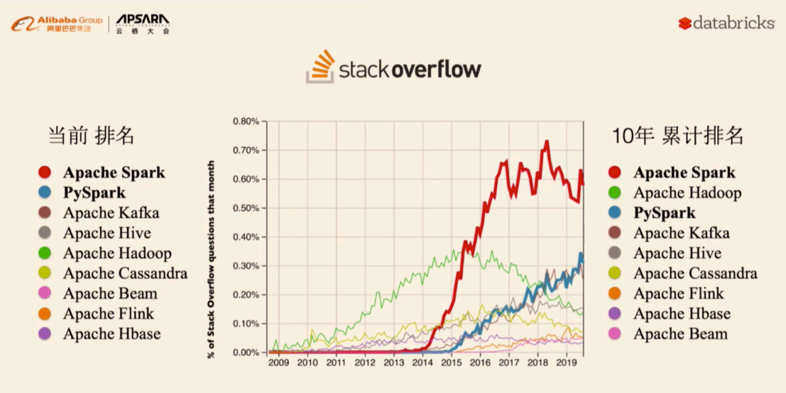

> Apache Spark是用于**大规模数据（large-scala data）**处理的**统一（unified）**分析引擎。


- 1、Apache Spark 官网：http://spark.apache.org/
- 2、Databricks 官网：https://databricks.com/spark/about


```ini
Aapche Spark 是一种快速、通用、可扩展的大数据分析引擎，基于内存分析数据，可以处理任何类型数据业务分析。

# 1、分析引擎（计算引擎）
	分析处理数据，类似MapReduce框架(分布式处理框架，分而治之思想)
# 2、大规模数据
	海量数据，数据很多，多数据源（存储在任何地方数据）
# 3、统一的分析引擎
	离线分析
	实时计算
	机器学习: 推荐系统
	图形计算: 计算最短最优路径, 导航软件
	科学计算: Pandas, R语言
# 4、分布式并行计算
	分而治之思想，与MapReduce计算思想完全一致
```

> Spark具有**运行速度快、易用性好、通用性强和随处运行**等特点。http://spark.apache.org/


- **Batch/Streaming data**：统一化离线计算和实时计算开发方式，支持多种开发语言
- **SQL analytics**：通用的SQL分析快速构建分析报表，运行速度快于大多数数仓计算引擎
- **Data science at scale**：大规模的数据科学引擎，支持PB级别的数据进行探索性数据分析
- **Machine learning**：支持在笔记本电脑上训练机器学习算法，并使用相同的代码扩展到数千台机器的集群

> Spark编程支持5种语言：`Java、Scala、Python、R及SQL`，满足各种分析需求，目前Python语言全球最多


> Spark框架中，最核心要点：抽象，称为`RDD`，是一种封装数据结构, 相当于集合，比如列表List，存储数据


> Spark程序无处不在运行【`Runs Everywhere`】

- 1、数据存储

  [Spark分析的数据在哪里？任何地方都是可以，最主要还是HDFS、Hive、HBase、Kafka等等]()

  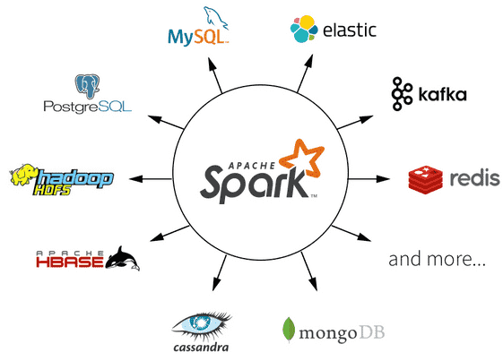

  

- 2、程序运行

  **Spark 编程代码，在何处执行，分析数据？？**

  [本地模式、集群模式【Hadoop `YARN`、Mesos、Standalone】、`容器（K8s）`]()

  

### ★Spark vs MapReduce

> ​	2014 年的时候Benchmark测试中，Spark 秒杀Hadoop，在使用十分之一计算资源的情况下，相同数据的排序上，Spark 比Map Reduce快3倍！

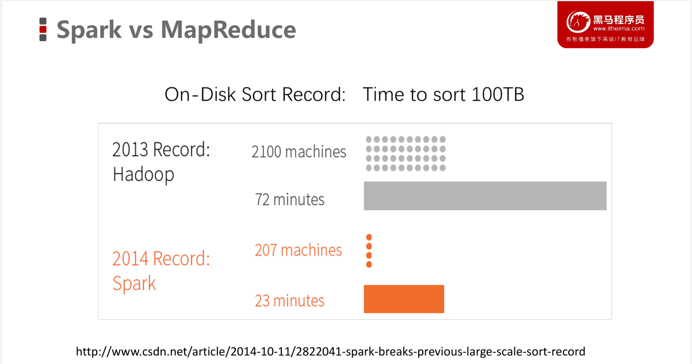

> Spark处理数据与MapReduce处理数据相比，有如下两个不同点：

- 1、其一、Spark处理数据时，可以将==中间处理结果数据存储到内存==中；


- 2、其二、Spark Job调度以`DAG（有向无环图）`方式，并且每个任务Task执行以`线程（Thread）`方式，并不是像MapReduce以`进程（Process）方式`执行。

> ​		Spark是一个通用的DAG引擎，使得用户能够在一个应用程序中描述复杂的逻辑，以便于优化整个数据流，并让不同计算阶段直接通过本地磁盘或内存交换数据，而不是像MapReduce那样需要通过HDFS。

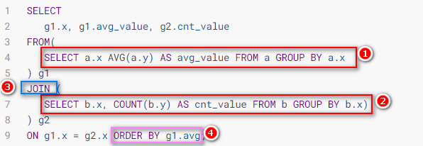

下面左图是MapReduce生成的DAG数据流，右图是Spark生成的DAG数据流。


> Spark 与 MapReduce 比较：Spark 为什么比MapReduce计算要快？

|     比较方面     |         MapRedue 计算引擎          |                    Spark 计算引擎                     |
| :--------------: | :--------------------------------: | :---------------------------------------------------: |
| 1、Job 程序结构  |  1 个Map Stage + 1个 Reduce Stage  | 构架DAG图，多个Stage, 多个Map Stage + 多个Redue Stage |
| 2、中间结果存储  |            本地磁盘Disk            |             没有Shuffle时，存储内存Memory             |
| 3、Task 运行方式 | 进程Process：MapTask 和Reduce Task |         线程Thread：Task，无需频繁启动和销毁          |
| 4、程序编程模型  |   直接读取文件数据，map + reduce   |            文件数据封装：RDD，调用函数处理            |

### Spark框架模块

> ​	整个Spark 框架模块包含：Spark `Core`、 Spark `SQL`、 Spark Streaming、 Spark GraphX、Spark MLlib，而后四项的能力都是建立在核心引擎之上 。

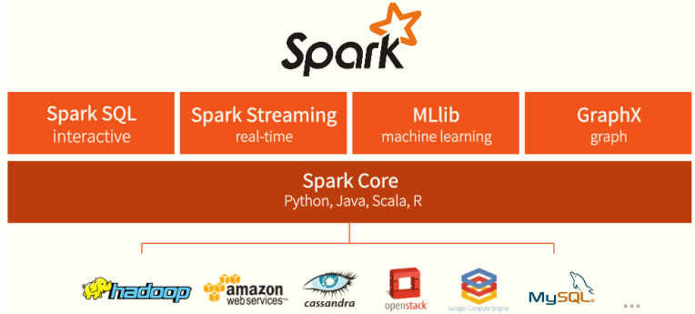

```ini
# 1、最核心，最基础
	SparkCore【★★★★★】：RDD 数据结构，分布式集合，目前理解为列表list=[1,2,3,4]

# 2、四大公共模块
	SparkSQL【★★★★★★★★★★】：使用最多模块，提供SQL和DSL编程分析数据
	SparkStreaming：流式计算
	GraphX：图形计算
	MLlib：机器学习库
	
# 3、高级分析模块
	PySpark：基于Python语言编程
	SparkR：基于R语言编程

# 4、新的模块：从Spark 2.0开始
	Structured Streaming：针对流式数据处理模块，官方推荐使用
```


### ★Spark应用组成

> 每个MapReduce运行时（比如运行YARN集群），由2部分组成：

- **MRAppMaster：MapReduce**应用程序管理者，负责申请资源，调度任务执行和监控等；
- **MapTask或ReducetTask**：要么是处理数据任务MapTask，要么是聚合数据任务ReduceTask；


> 每个Spark 应用运行在集群上时，有2部分组成：`Driver和Executors`


- ==第一、Driver Program==

  

- ==第二、Executors==

  


### Spark运行模式

> ​	Spark 框架编写的应用程序可以运行在`本地模式（Local Mode）`、`集群模式（Cluster Mode）`和**云模式（K8s）**，方便开发测试和生产部署。[基于当前最新版本：Spark-3.1.2 版本学习。]()


> - 第一、本地模式：`Local Mode`，[在当前操作系统，启动1个JVM 进程，指定最多同时运行Task任务数目，以线程Thead方式运行Task任务]()


当Spark程序运行在本地模式时，设置最多同时运行几个Task：`--master local[K]`，其中K含义

- [ ] 其一、表示==并行Task数目==；
- [ ] 其二、表示线程数目（每个Task任务以线程Thread方式运行）；
- [ ] 其三、表示虚拟CPU Cores核数（在Spark程序运行时，1个Task任务，需要1Core CPU）

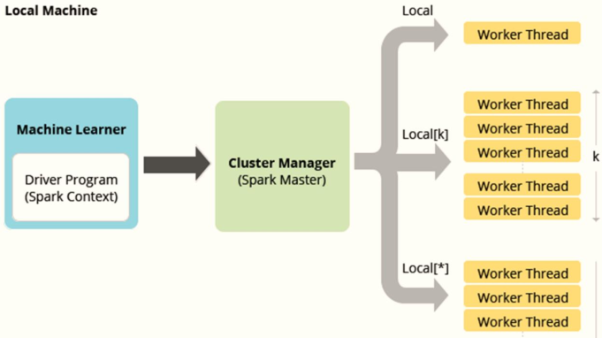

> - 第二、集群模式：`Cluster Mode`，[以Standalone集群和YARN集群为例讲解]()


​			在实际项目中，Spark 应用程序运行最多集群模式：`Hadoop YARN`。

```ini
# 1、Hadoop YARN集群模式（生产环境使用）：
	运行在 YARN 集群之上，由 YARN 负责资源管理，Spark 负责任务调度和计算
	好处：计算资源按需伸缩，集群利用率高，共享底层存储，避免数据跨集群迁移。
	
# 2、Spark Standalone集群模式（开发测试及生成环境使用）：
	类似Hadoop YARN架构，典型的Mater/Slaves模式，使用Zookeeper搭建高可用，避免Master是有单点故障的。
	
# 3、 Apache Mesos集群模式（国内使用较少）：
	运行在 Mesos 资源管理器框架之上，由 Mesos负责资源管理，Spark 负责任务调度和计算。
```

> - 第三、云模式：`Kubernetes` 模式，[中小公司未来会更多的使用云服务，Spark 2.3开始支持将Spark 开发应用运行到K8s上。]()


## Spark快速入门

### ★Anaconda软件安装

使用Python编写Spark代码，首先需要安装Python语言包，此时安装Anaconda科学数据分析包。


> ​	Anaconda是一个**开源的Python发行版本**，其包含了conda、Python等180多个科学包及其依赖项。Anaconda 是跨平台的，有 Windows、MacOS、Linux 版本。

```ini
# 下载地址：	
	https://repo.anaconda.com/archive/
```

> 使用Python编程Spark程序，无论是开发还是运行，需要安装如下基本组件：

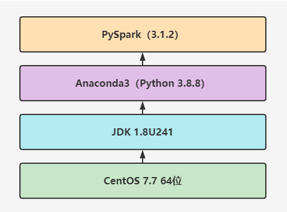

```ini
# 可以直接安装Spark 软件包
	包含pyspark库
	spark-3.1.2-bin-hadoop3.2.tgz
	
# 直接安装pyspark库
	pip install pyspark==3.1.2
```

> 在CentOS7系统上安装**Anaconda3-2021-05**版本，具体步骤如下，[集群所有集群如下方式安装。]()

1、安装包上传并解压

```bash
[root@node1 ~]# cd /export/server/
[root@node1 server]# rz

[root@node1 server]# chmod u+x Anaconda3-2021.05-Linux-x86_64.sh 

[root@node1 server]# sh ./Anaconda3-2021.05-Linux-x86_64.sh 
第一次：【直接回车】
    Please, press ENTER to continue
    >>> 
第二次：【输入yes】
	Do you accept the license terms? [yes|no]
	[no] >>> yes
第三次：【输入解压路径：/export/server/anaconda3】
	[/root/anaconda3] >>> /export/server/anaconda3
第四次：【输入yes，是否在用户的.bashrc文件中初始化Anaconda3的相关内容】
	Do you wish the installer to initialize Anaconda3
    by running conda init? [yes|no]
    [no] >>> yes
```

2、进入 conda 虚拟环境

​	第一次需要先激活，命令行键入以下命令： `source /root/.bashrc`，进入conda默认虚拟环境(base)

```bash
[root@node1 ~]# source /root/.bashrc

## 测试python3
(base) [root@node1 ~]# python3
Python 3.8.8 (default, Apr 13 2021, 19:58:26) 
[GCC 7.3.0] :: Anaconda, Inc. on linux
Type "help", "copyright", "credits" or "license" for more information.
>>> print("Hello Python")
Hello Python
```

3、设置系统环境变量

```bash
[root@node1 ~]# vim /etc/profile
```

文件末尾，添加内容：

```ini
# Anaconda Home
export ANACONDA_HOME=/export/server/anaconda3
export PATH=$PATH:$ANACONDA_HOME/bin
```

设置环境变量生效

```bash
[root@node1 ~]# source /etc/profile
```

4、创建软链接

```ini
[root@node1 ~]# ln -s /export/server/anaconda3/bin/python3 /usr/bin/python
```

> **注意**：集群中三台机器node1、node2和node3都需按照上述步骤安装Anconada3，不要使用`scp`命令拷贝。

### ★Spark Python Shell

> ​	在Spark框架中，提供基于Python交互式命令：`pyspark`，以本地模式运行：`启动一个JVM Process进程，执行任务Task，`通过`--master`参数 指定运行模式。


> 本地模式启动JVM Process进程，示意图：

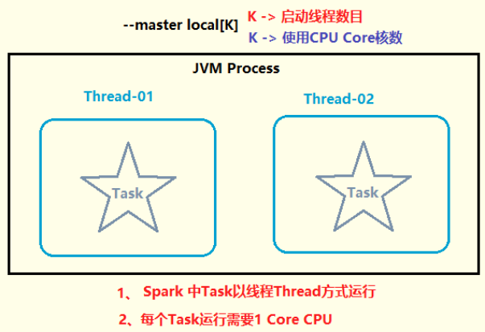

- 1、框架安装包上传解压

```bash
# 第一、进入软件安装目录
(base) [root@node1 ~]# cd /export/server/
# 第二、上传框架软件包
(base) [root@node1 server]# rz
# 第三、赋予执行权限
(base) [root@node1 server]# chmod u+x spark-3.1.2-bin-hadoop3.2.tgz 

# 第四、解压软件包
(base) [root@node1 server]# tar -zxf spark-3.1.2-bin-hadoop3.2.tgz 
# 第五、赋予root用户和组
(base) [root@node1 server]# chown -R root:root spark-3.1.2-bin-hadoop3.2

# 第六、重命名为spark-local
(base) [root@node1 server]# mv spark-3.1.2-bin-hadoop3.2 spark-local
```

- 2、启动`pyspark shell`命令行

```bash
# 第一、进入spark框架安装目录
(base) [root@node1 ~]# cd /export/server/spark-local
(base) [root@node1 spark-local]# ll

# 查看Spark软件安装包目录结构：
```

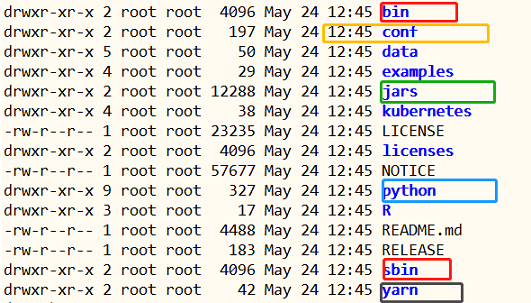

```bash
# 第二、启动pyspark shell命令行，设置本地模式运行
(base) [root@node1 ~]# /export/server/spark-local/bin/pyspark --master local[2]

Python 3.8.8 (default, Apr 13 2021, 19:58:26) 
[GCC 7.3.0] :: Anaconda, Inc. on linux
Type "help", "copyright", "credits" or "license" for more information.
21/09/18 15:08:25 WARN NativeCodeLoader: Unable to load native-hadoop library for your platform... using builtin-java classes where applicable
Using Spark's default log4j profile: org/apache/spark/log4j-defaults.properties
Setting default log level to "WARN".
To adjust logging level use sc.setLogLevel(newLevel). For SparkR, use setLogLevel(newLevel).
Welcome to
      ____              __
     / __/__  ___ _____/ /__
    _\ \/ _ \/ _ `/ __/  '_/
   /__ / .__/\_,_/_/ /_/\_\   version 3.1.2
      /_/

Using Python version 3.8.8 (default, Apr 13 2021 19:58:26)
Spark context Web UI available at http://node1.itcast.cn:4040
Spark context available as 'sc' (master = local[2], app id = local-1631948908036).
SparkSession available as 'spark'.
>>> 
```

其中，==创建SparkContext实例对象：`sc` 和 SparkSession会话实例对象：`spark`==，方便加载数据源数据。

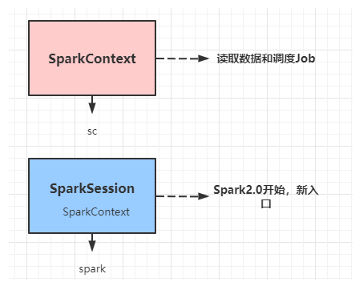

- ==1、Spark context Web UI available at== http://node1.itcast.cn:4040
  - 每个Spark应用运行，提供WEB UI监控页面，默认端口号：`4040`
- ==2、Spark context available as 'sc' (master = local[2], app id = local-1631948908036).==
  - 创建SparkContext类对象，名称为：`sc`
  - Spark应用程序入口，读取数据和调度Job执行

- ==3、Spark session available as 'spark'.==
  - Spark2.0开始，提供新的程序入口：SparkSession，创建对象，名称为：`spark`	

> ​	启动`pyspark shell`命令行后，可以直接书写**pyspark和python代码**， 数据分析处理，如果是pyspark代码，将运行Task任务计算处理数据。

**案例演示**：[并行化列表为RDD，对其中元素进行平方]()。

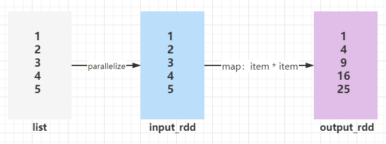

```python
# 第一、创建RDD，并行化列表
>>> input_rdd = sc.parallelize([1, 2, 3, 4, 5])
>>> 
# 第二、对集合中每个元素平方
>>> result_rdd = input_rdd.map(lambda number: number * number)
>>> 
# 第三、将RDD数据转存本地列表List
>>> result_rdd.collect()
[1, 4, 9, 16, 25]     
```


### 词频统计WordCount

> WordCount词频统计**：[加载本地文件系统文本文件数据，进行词频统计WordCount]()

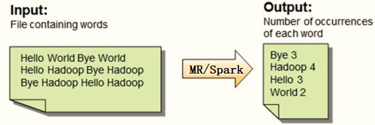

- 数据文件： `vim /root/words.txt`

```ini
spark python spark hive spark hive
python spark hive spark python
mapreduce spark hadoop hdfs hadoop spark
hive mapreduce
```

- 词频统计WordCount

  > - 第一步、从LocalFS读取文件数据，`sc.textFile`方法，将数据封装到RDD中
  > - 第二步、调用RDD中函数，进行处理转换处理，函数：`flapMap、map和reduceByKey`
  > - 第三步、将最终处理结果RDD保存到LocalFS或打印控制台，函数：`foreach、saveAsTextFile`

```python
# 第一、加载本地文件系统文本文件
>>> input_rdd = sc.textFile("file:///root/words.txt")  
>>> type(input_rdd)
<class 'pyspark.rdd.RDD'>

# 第二、每行数据按照空格分词并且进行扁平化
>>> word_rdd = input_rdd.flatMap(lambda line: line.split(" "))  

# 第三、每个单词转换为二元组
>>> tuple_rdd = word_rdd.map(lambda word: (word, 1))

# 第四、按照key单词分组，对组内数据求和
>>> result_rdd = tuple_rdd.reduceByKey(lambda tmp, item: tmp + item)

# 第五、打印RDD集合中每条数据至控制台
>>> result_rdd.foreach(lambda item: print(item))
('python', 3)
('hive', 4)
('hadoop', 2)
('hdfs', 1)
('spark', 7)
('mapreduce', 2)

# 第六、保存数据至本地文件系统文件中
result_rdd.saveAsTextFile("file:///root/wordcount-output")

# 查看文件保存数据
(base) [root@node1 ~]# ll /root/wordcount-output/
total 8
-rw-r--r-- 1 root root 52 Sep 18 16:32 part-00000
-rw-r--r-- 1 root root 30 Sep 18 16:32 part-00001
-rw-r--r-- 1 root root  0 Sep 18 16:32 _SUCCESS

(base) [root@node1 ~]# more /root/wordcount-output/part-00000 
('python', 3)
('hive', 4)
('hadoop', 2)
('hdfs', 1)

(base) [root@node1 ~]# more /root/wordcount-output/part-00001
('spark', 7)
('mapreduce', 2)
```


> 浏览器打开WEB UI监控页面：http://node1.itcast.cn:4040，首页显示运行完成Job：


### 运行圆周率PI


> ​	Spark框架自带的案例Example中涵盖圆周率PI计算程序，可以使用【`$SPARK_HOME/bin/spark-submit`】提交应用执行，运行在本地模式localmode。

使用`spark-submit`脚本，提交运行圆周率PI，采用**蒙特卡罗**算法。

```bash
/export/server/spark-local/bin/spark-submit \
--master local[2] \
/export/server/spark-local/examples/src/main/python/pi.py \
10
```


Hadoop MapReduce中运行圆周率PI，本地模式运行，提交命令

------

```bash
/export/server/hadoop/bin/yarn jar \
/export/server/hadoop/share/hadoop/mapreduce/hadoop-mapreduce-examples-3.3.0.jar \
pi \
-Dmapreduce.framework.name=local \
-Dfs.defaultFS=file:/// \
10 10000

# 第一个参数：10，表示运行10个MapTask任务
# 第二个参数：10000，表示每个MapTask任务投掷次数
# -D设置属性参数值：MapReduce运行本地模式local和文件系统为本地文件系统file
```

## Standalone集群

### 架构及安装部署

> ​	Standalone集群使用了分布式计算中的`master-slave模型`，**master是集群中含有Master进程的节点，slave是集群中的Worker节点含有Executor进程。**

[Spark Standalone集群，仅仅只能向其提交运行Spark Application程序，其他应用无法提交运行]()

- 主节点：`Master`，管理整个集群的资源，[类似Hadoop YARN中ResourceManager]()
- 从节点：`Workers`，管理每台机器的资源（内存和CPU）和执行任务Task，[类似Hadoop YARN中NodeManager]()


> Spark Standalone集群，类似Hadoop YARN集群，管理集群资源和调度资源：

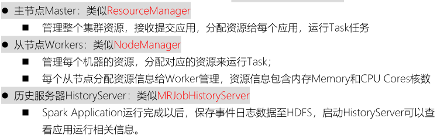

> **Standalone 集群**资源配置，使用三台虚拟机，安装CentOS7操作系统。


> ​		Standalone 集群服务规划，1个Master主节点、3个Workers从节点和1个历史服务节点，==Master主节点和HistoryServer历史服务节点往往在一台机器上。==

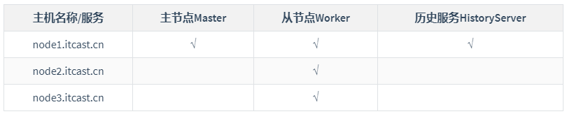

> Standalone集群配置，在`node1.itcast.cn`机器上配置，分发到集群其他机器。

- **1、框架安装包上传解压**

```bash
# 第一、进入软件安装目录
(base) [root@node1 ~]# cd /export/server/

# 第二、上传框架软件包
(base) [root@node1 server]# rz

# 第三、赋予执行权限
(base) [root@node1 server]# chmod u+x spark-3.1.2-bin-hadoop3.2.tgz 

# 第四、解压软件包
(base) [root@node1 server]# tar -zxf spark-3.1.2-bin-hadoop3.2.tgz 

# 第五、赋予root用户和组
(base) [root@node1 server]# chown -R root:root spark-3.1.2-bin-hadoop3.2

# 第六、重命名为spark-local
(base) [root@node1 server]# mv spark-3.1.2-bin-hadoop3.2 spark-standalone
```

- **2、配置Master、Workers、HistoryServer**

  在配置文件**`$SPARK_HOME/conf/spark-env.sh`**，添加如下内容：

```bash
## 第一、进入配置目录
cd /export/server/spark-standalone/conf

## 第二、修改配置文件名称
mv spark-env.sh.template spark-env.sh

## 第三、修改配置文件
vim spark-env.sh
## 增加如下内容：

## 设置JAVA安装目录
JAVA_HOME=/export/server/jdk

## HADOOP软件配置文件目录
HADOOP_CONF_DIR=/export/server/hadoop/etc/hadoop

## 指定Master主机名称和端口号
SPARK_MASTER_HOST=node1.itcast.cn
SPARK_MASTER_PORT=7077
SPARK_MASTER_WEBUI_PORT=8080

## 指定Workers资源和端口号
SPARK_WORKER_CORES=1
SPARK_WORKER_MEMORY=1g
SPARK_WORKER_PORT=7078
SPARK_WORKER_WEBUI_PORT=8081

## 历史日志服务器
SPARK_DAEMON_MEMORY=1g
SPARK_HISTORY_OPTS="-Dspark.history.fs.logDirectory=hdfs://node1.itcast.cn:8020/spark/eventLogs/ -Dspark.history.fs.cleaner.enabled=true"
```

- **3、创建EventLogs存储目录**

  先确定HDFS服务启动，再创建事件日志目录

```bash
# 第一、在node1.itcast.cn启动服务
(base) [root@node1 ~]# start-dfs.sh 

# 第二、创建EventLog目录
(base) [root@node1 ~]# hdfs dfs -mkdir -p /spark/eventLogs/
```

- **4、Workers节点主机名称**

  将 `$SPARK_HOME/conf/workers.template` 名称命名为【**`workers`**】，填写从节点名称。

```bash
## 第一、进入配置目录
cd /export/server/spark-standalone/conf

## 第二、修改配置文件名称
mv workers.template workers

## 第三、编辑和添加内容
vim workers
##内容如下：
node1.itcast.cn
node2.itcast.cn
node3.itcast.cn
```

- **5、配置Spark应用保存EventLogs**

  将 `$SPARK_HOME/conf/spark-defaults.conf.template` 重命名为**`spark-defaults.conf`**，添加内容：

```bash
## 第一、进入配置目录
cd /export/server/spark-standalone/conf

## 第二、修改配置文件名称
mv spark-defaults.conf.template spark-defaults.conf

## 第三、添加应用运行默认配置
vim spark-defaults.conf
## 添加内容如下：
spark.eventLog.enabled     true
spark.eventLog.dir         hdfs://node1.itcast.cn:8020/spark/eventLogs
spark.eventLog.compress    true
```

- **6、设置日志级别**

  将 `$SPARK_HOME/conf/log4j.properties.template`重命名为 `log4j.properties`，修改日志级别为警告**`WARN`**。

```bash
## 第一、进入目录
cd /export/server/spark-standalone/conf

## 第二、修改日志属性配置文件名称
mv log4j.properties.template log4j.properties

## 第三、改变日志级别
vim log4j.properties
## 修改内容： 第19行
log4j.rootCategory=WARN, console
```

- **7、分发到其他机器**

  将配置好的将 Spark 安装包分发给集群中其它机器

```bash
scp -r /export/server/spark-standalone root@node2.itcast.cn:/export/server/
scp -r /export/server/spark-standalone root@node3.itcast.cn:/export/server/
```

### 服务启动及测试

> ​		启动Spark Standalone 集群服务，在主节点`node1.itcast.cn`上先启动Master服务，再启动Workers服务，最后启动历史服务HistoryServer。

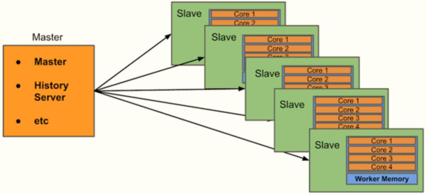

[必须配置主节点到所有从节点的SSH无密钥登录，集群各个机器时间同步。]()

- 1、主节点Master服务

```bash
## 启动Master服务
/export/server/spark-standalone/sbin/start-master.sh

## 停止Master服务
/export/server/spark-standalone/sbin/stop-master.sh
```

- 2、从节点Workers服务

```bash
## 启动Workers服务
/export/server/spark-standalone/sbin/start-workers.sh

## 停止Workers服务
/export/server/spark-standalone/sbin/stop-workers.sh
```


- 3、Master监控UI界面
  - 主节点Master主节点WEB UI服务地址：http://node1.itcast.cn:8080/


> ​	监控页面可以看出，配置3个Worker进程实例，每个Worker实例为1核1GB内存，总共是3核 3GB 内存。目前显示的Worker资源都是空闲的，当向Spark集群提交应用之后，Spark就会分配相应的资源给程序使用，可以在该页面看到资源的使用情况。

- 4、启动历史服务

```bash
## 启动HistoryServer服务
/export/server/spark-standalone/sbin/start-history-server.sh

## 停止HistoryServer服务
/export/server/spark-standalone/sbin/stop-history-server.sh
```

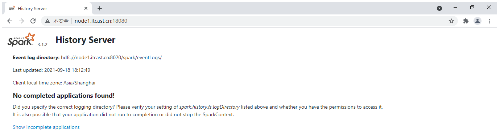

> **案例运行（1）**：[圆周率PI运行]()

​	将圆周率PI程序，提交运行在Standalone集群上，修改【**`--master`**】为Standalone集群地址：**`spark://node1.itcast.cn:7077`**

```bash
/export/server/spark-standalone/bin/spark-submit \
--master spark://node1.itcast.cn:7077 \
--conf "spark.pyspark.driver.python=/export/server/anaconda3/bin/python3" \
--conf "spark.pyspark.python=/export/server/anaconda3/bin/python3" \
/export/server/spark-standalone/examples/src/main/python/pi.py \
10

## 属性参数：spark.pyspark.driver.python和spark.pyspark.python，指定python解析器位置
```

> **案例运行（2）**：[词频统计WordCount]()

- 数据文件： `vim /root/words.txt`

```ini
spark python spark hive spark hive
python spark hive spark python
mapreduce spark hadoop hdfs hadoop spark
hive mapreduce
```

- 上传HDFS文件系统

```bash
# 创建目录
hdfs dfs -mkdir -p /datas/input

# 上传文件
hdfs dfs -put /root/words.txt /datas/input

# 设置目录权限
hdfs dfs -chmod 777 /datas/
```

- 启动`pyspark shell`交互式命令行

```bash
/export/server/spark-standalone/bin/pyspark \
--master spark://node1.itcast.cn:7077 \
--conf "spark.pyspark.driver.python=/export/server/anaconda3/bin/python3" \
--conf "spark.pyspark.python=/export/server/anaconda3/bin/python3"
```

- 词频统计WordCount：

```python
# 第一、加载HDFS文件系统文本文件
input_rdd = sc.textFile("hdfs://node1.itcast.cn:8020/datas/input/words.txt") 
input_rdd.collect()

"""
第二、词频统计
	2-1. 每行数据按照空格分词并且进行扁平化
	2-2. 每个单词转换为二元组
	2-3. 按照key单词分组，对组内数据求和
"""
word_rdd = input_rdd.flatMap(lambda line: str(line).split(' '))
tuple_rdd = word_rdd.map(lambda word: (word, 1))
output_rdd = tuple_rdd.reduceByKey(lambda tmp, item: tmp + item)
output_rdd.collect()

# 第三、打印RDD集合中每条数据至控制台
output_rdd.foreach(lambda item: print(item))

# 保存数据至本地文件系统文件中
output_rdd.saveAsTextFile("hdfs://node1.itcast.cn:8020/datas/wordcount-output")

# 查看文件保存数据
hdfs dfs -ls /datas/wordcount-output
hdfs dfs -text /datas/wordcount-output/part-*
```

### ★应用运行架构

> 当将Spark Application运行在集群上时，所有组件组成如下所示，分为2个部分：
>
> - 第一部分、集群资源管理框架，比如Standalone 集群
> - 第二部分、每个应用组成，应用管理者和应用执行者

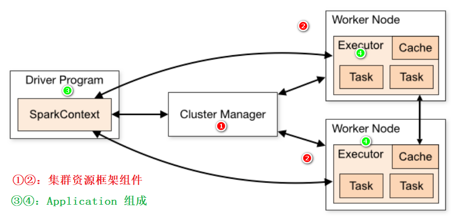

> 第一部分、集群资源管理框架，以Standalone 集群为例

- **主节点Master：集群老大，管理节点**
  - 接受客户端请求、管理从节点Worker节点、资源管理和任务调度
  - 类似YARN中ResourceManager
- **从节点Workers：集群小弟，工作节点**
  - 使用自身节点的资源运行Executor进程：给每个Executor分配一定的资源
  - 类似YARN中NodeManager

> 第二部分、每个应用组成，应用管理者Driver和应用执行者Executors

- **应用管理者Driver Program**：每个应用老大
  - 向主节点申请Executor资源，让主节点在从节点上根据需求配置启动对应的Executor
  - 解析代码逻辑：将代码中的逻辑转换为Task
  - 将Task分配给Executor去运行
  - 监控每个Executor运行的Task状态

- **应用执行者Executors：**应用中干活的
  - 运行在Worker上，使用Worker分配的资源等待运行Task
  - 所有Executor启动成功以后会向Driver进行注册
  - Executor收到分配Task任务，运行Task
  - 可以将RDD数据缓存到Executor内存

> 登录Spark HistoryServer历史服务器WEB UI界面，点击前面运行圆周率PI程序：

```
历史服务器网址：
	http://node1.itcast.cn:18080/
```

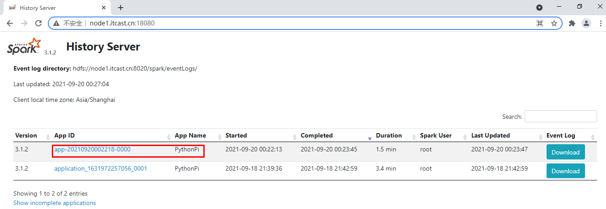


> 切换到【Executors】Tab页面：

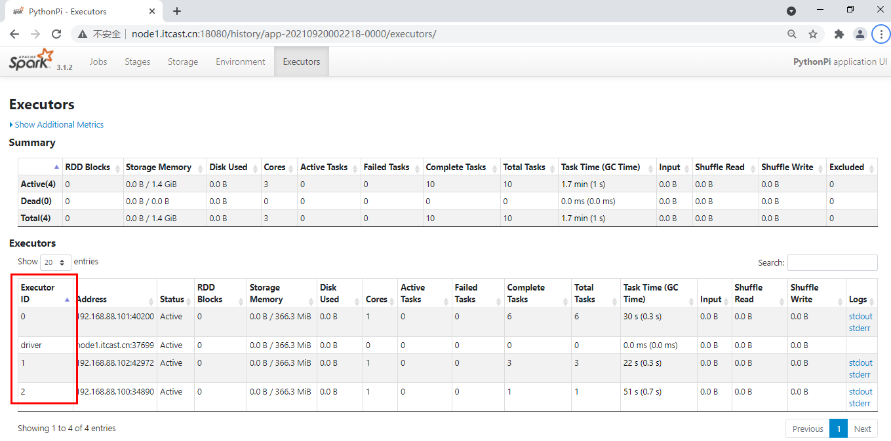

### 高可用HA

> ​		Spark Standalone集群是**Master-Slaves架构**的集群模式，和大部分的Master-Slaves结构集群一样，存在着==Master单点故障（SPOF）==的问题。

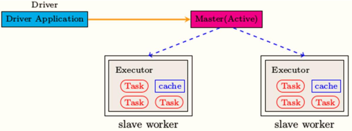

> ​			基于`Zookeeper`的Standby Masters机制实现高可用High Available，其中ZooKeeper提供了==一个Leader Election机制==，可以保证虽然**集群存在多个Master，但是只有一个是Active的，其他的都是Standby。当Active的Master出现故障时，另外的一个Standby Master会被选举出来**。


```
官方文档：
	https://spark.apache.org/docs/3.1.2/spark-standalone.html#standby-masters-with-zookeeper
```

> ​		Spark提供高可用HA方案：**运行2个或多个Master进程**，其中==一个是Active状态：正常工作，其余的为Standby状态：待命中，一旦Active Master出现问题，立刻接上==。

