# PySpark安装部署与应用开发

## PySpark应用开发

### Windows环境准备

> 无论在Windows系统还是Linux系统开发PySpark程序（使用Python编写Spark代码），需要安装一些软件：


```ini
# 1、安装JDK 8
	Spark 框架使用Scala语言编写，最终运行代码转换为字节码，运行在JVM 虚拟机中

# 2、安装Hadoop 3.3.0
	Spark 程序往往读写HDFS上文件数据，在Windows系统需要Hadoop库包支持

# 3、安装Python3
	使用Python语言编写代码，安装Python语言包，此处使用Anaconda科学工具包
	
# 4、安装pyspark模块（库）
	在PyCharm中开发PySpark代码时，需要使用pyspark库，调用Spark 提供API
```

- 1、Windows 系统安装JDK

> 直接解压提供JDK压缩包： `jdk1.8.0_241.zip`到指定目录（建议：英文字符目录）中，比如解压路径：`D:\BigdataUser\Java`


- 2、Windows 系统安装Hadoop

> 直接解压提供的`hadoop-3.3.0-Windows.zip`到指定（建议：英文字符目录）中，比如解压路径：`D:\BigdataUser`
>
> 配置java环境变量: 


​	将 `hadoop-3.3.0\hadoop.dll`文件放入到Windows系统目录：`C:\Windows\System32`，重启电脑。


- 3、Windows 系统安装Anaconda

> 在讲解Pandas时，已经安装完整，同样建议安装目录为英文字符目录，比如安装目录为：`C:\programfiles\Anaconda3`


- 4、Anaconda 中安装pyspark库

> ​	使用PyCharm开发PySpark代码时，需要选择Python解释器，其中需要包含pyspark库，[在Anaconda 基础虚拟环境base中安装pyspark库]()。

```bash
# step1、切换虚拟环境
conda activate base
```


```ini
# step2、安装pyspark类库
pip install pyspark==3.1.2 -i https://pypi.tuna.tsinghua.edu.cn/simple
```

> ​	`pyspark库`在Anaconda中**base基础虚拟环境**安装完成以后，查看`$ANACONDA_HOME/Lib/site-packages`目录，添加【`py4j`】和【`pyspark`】目录。

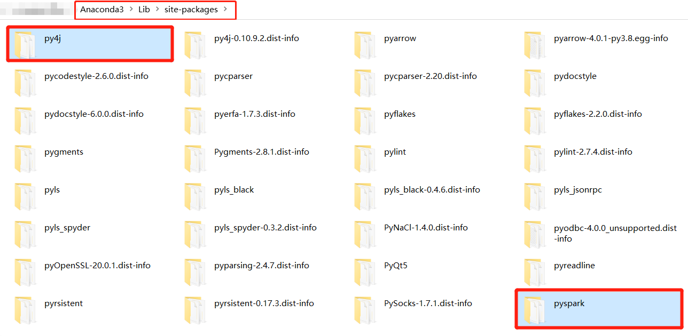

> 至此，在Windows系统下，使用PyCharm开发PySpark程序环境准备全部完成。

### ★构建PyCharm Project

> 本次Spark课程中所有代码，都是基于Python语言开发，使用PyCharm集成开发环境。

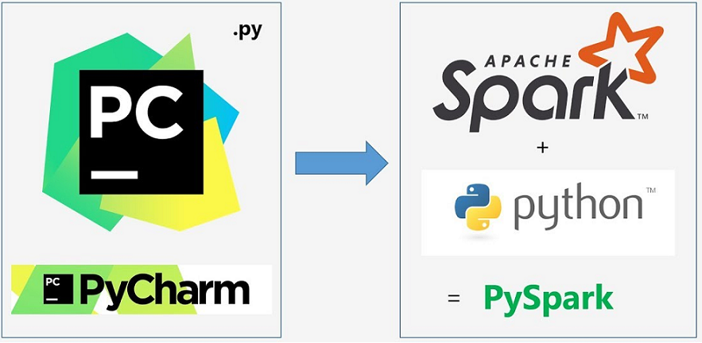

> 在Windows上创建PyCharm Project工程，设置Python解析器Interpreter，如下步骤设置：

- 1、打开PyCharm软件，点击【Create New Project】创建新的工程

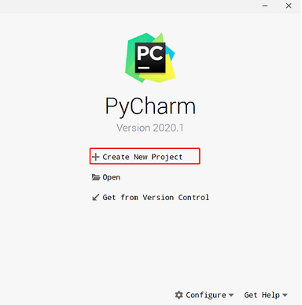

- 2、指定工程的名称（路径）、选择Window系统中安装Anaconda的base基础虚拟环境即可。


- 3、添加Anaconda中base基础虚拟环境


点击【OK】以后，为创建新工程Project添加刚刚指定Python Interpreter解释器


点击【Create】安装，创建新的PyCharm Project。

> ​	**约定规范**：每天Spark课程，创建一个目录，比如第二天课程代码，目录名称：`pyspark-day02`，包含四个子目录：
>
> - `main`目录：源码目录，编写python代码存放位置
> - `resources`目录：资源目录，存储配置文件
> - `datas`目录：测试数据存储
> - `test` 目录：编写Python测试代码

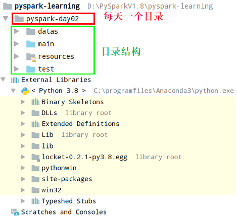

- 代码目录：`main`

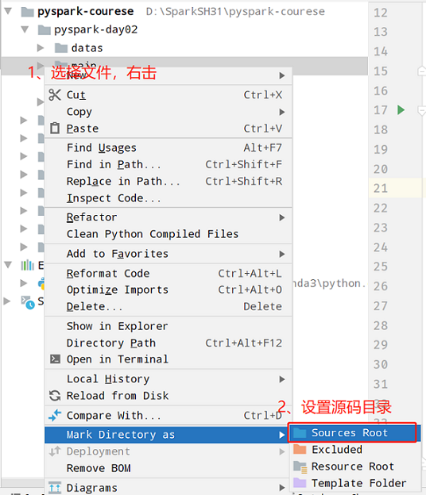

- 资源文件目录：`resources`


> 编写Python测试代码：**HelloWorld程序**，文件名称：`python_hello_world.py`。

```python
#!/usr/bin/env python
# -*- coding: utf-8 -*-

if __name__ == '__main__':
    """
    Python 入门程序：Hello World
    """
    print("Hello World.................")
```

​	执行Python代码，控制台打印：`Hello World`。

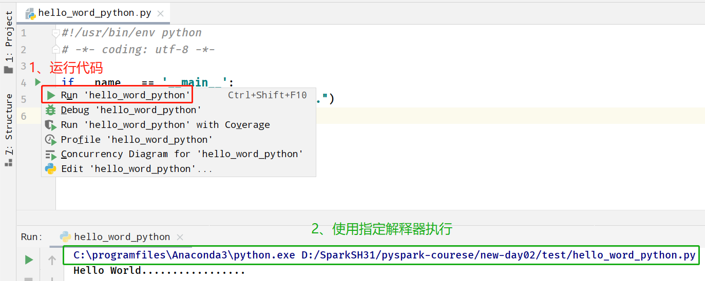

### ★应用入口 - SparkContext

> Spark Application程序入口为：`SparkContext`，任何Spark应用首先需要构建SparkContext对象，构建步骤：


文档：https://spark.apache.org/docs/3.1.2/rdd-programming-guide.html#initializing-spark


案例演示代码：`01_test_sparkcontext.py`

```python
#!/usr/bin/env python
# -*- coding: utf-8 -*-

import os
import time
from pyspark import SparkContext, SparkConf


if __name__ == '__main__':
    """
    Spark程序入口：SparkContext对象创建
    """

    # TODO：设置系统环境变量
    os.environ['JAVA_HOME'] = 'C:/Java/jdk1.8.0_241'
    os.environ['HADOOP_HOME'] = 'C:/Hadoop/hadoop-3.3.0'
    os.environ['PYSPARK_PYTHON'] = 'C:/Users/JohnChow/anaconda3/python.exe'
    os.environ['PYSPARK_DRIVER_PYTHON'] = 'C:/Users/JohnChow/anaconda3/python.exe'

    # 创建SparkConf实例，设置应用属性，比如名称和master
    spark_conf = SparkConf().setAppName("SparkContext Test").setMaster("local[2]")

    # 创建SparkContext对象，传递SparkConf实例
    sc = SparkContext(conf=spark_conf)
    print(sc)

    time.sleep(100000)
    # 关闭资源
    sc.stop()

```

### ★WordCount编程实现

> 编写Spark 程序分为5个步骤：

```ini
1. 获取上下文对象-context
2. 加载数据源-source
3. 数据转换处理-transformation
4. 结果数据输出-sink
5. 关闭上下文对象-close
```


> 创建python文件：`02_wordcount.py`，从本地文件系统读取数据：`datas/words.txt`

- 创建文本文件：`words.txt`，内容如下：

```ini
spark python spark hive spark hive
python spark hive spark python
mapreduce spark hadoop hdfs hadoop spark
hive mapreduce
```

- 词频统计WordCount代码如下：`02_wordcount.py`

```python
#!/usr/bin/env python
# -*- coding: utf-8 -*-

import os
import time

from pyspark import SparkConf, SparkContext

"""
基于Python语言，编程实现Spark中词频统计WordCount
"""

if __name__ == '__main__':
    # 0. 设置系统环境变量
    os.environ['JAVA_HOME'] = 'C:/Java/jdk1.8.0_241'
    os.environ['HADOOP_HOME'] = 'C:/Hadoop/hadoop-3.3.0'
    os.environ['PYSPARK_PYTHON'] = 'C:/Users/JohnChow/anaconda3/python.exe'
    os.environ['PYSPARK_DRIVER_PYTHON'] = 'C:/Users/JohnChow/anaconda3/python.exe'

    # 1. 获取上下文对象-context
    spark_conf = SparkConf().setAppName("PySpark WordCount").setMaster("local[2]")
    sc = SparkContext(conf=spark_conf)

    # 2. 加载数据源-source
    input_rdd = sc.textFile('../datas/words.txt')

    # 3. 数据转换处理-transformation
    """
        a. 分割单词，扁平化
        d. 转换二元组，每个单词出现一次
        c. 按照单词Key分组，并且对组内聚合
    """
    output_rdd = input_rdd \
        .flatMap(lambda line: str(line).split(' ')) \
        .map(lambda word: (word, 1)) \
        .reduceByKey(lambda tmp, item: tmp + item)

    # 4. 结果数据输出-sink
    output_rdd.foreach(lambda item: print(item))
    output_rdd.saveAsTextFile('../datas/output-' + str(round(time.time() * 1000)))

    # 5. 关闭上下文对象-close
    sc.stop()

```

​	运行pyspark代码，结果如下所示：


> 修改上述词频统计WordCount代码，**从HDFS文件系统上读取数据，并且将结果保存文件系统中**。

​	复制python代码，重命名为： `03_wordcount_hdfs.py` ，修改input和output文件路径，都是`hdfs`开头

```python
#!/usr/bin/env python
# -*- coding: utf-8 -*-

import os
from pyspark import SparkConf, SparkContext

if __name__ == '__main__':
    """
    基于Python语言，编程实现Spark中词频统计WordCount
    """
    # 设置系统环境变量
    os.environ['JAVA_HOME'] = 'C:/Java/jdk1.8.0_241'
    os.environ['HADOOP_HOME'] = 'C:/Hadoop/hadoop-3.3.0'
    os.environ['PYSPARK_PYTHON'] = 'C:/Users/JohnChow/anaconda3/python.exe'
    os.environ['PYSPARK_DRIVER_PYTHON'] = 'C:/Users/JohnChow/anaconda3/python.exe'

    # 1. 获取上下文对象-context
    spark_conf = SparkConf().setAppName("PySpark WordCount").setMaster("local[2]")
    sc = SparkContext(conf=spark_conf)

    # 2. 加载数据源-source
    input_rdd = sc.textFile('hdfs://node1.itcast.cn:8020/datas/input/words.txt')

    # 3. 数据转换处理-transformation
    """
        a. 分割单词，扁平化
        d. 转换二元组，每个单词出现一次
        c. 按照单词Key分组，并且对组内聚合
    """
    word_rdd = input_rdd.flatMap(lambda line: str(line).split(' '))
    tuple_rdd = word_rdd.map(lambda word: (word, 1))
    output_rdd = tuple_rdd.reduceByKey(lambda tmp, item: tmp + item)

    # 4. 结果数据输出-sink
    output_rdd.saveAsTextFile('hdfs://node1.itcast.cn:8020/datas/wc-output')

    # 5. 关闭上下文对象-close
    sc.stop()

```

### ★远程Python解析器

> 在实际企业开发PySpark代码时，为了统一开发测试环境，减少不必要环境问题，所有开发人员统一将本地PyCharm远程连接测试环境配置Python解释器。


> 创建PyCharm工程时，指定**Python解析器**为远程主机上安装Anaconda，比如`node1.itcast.cn`。

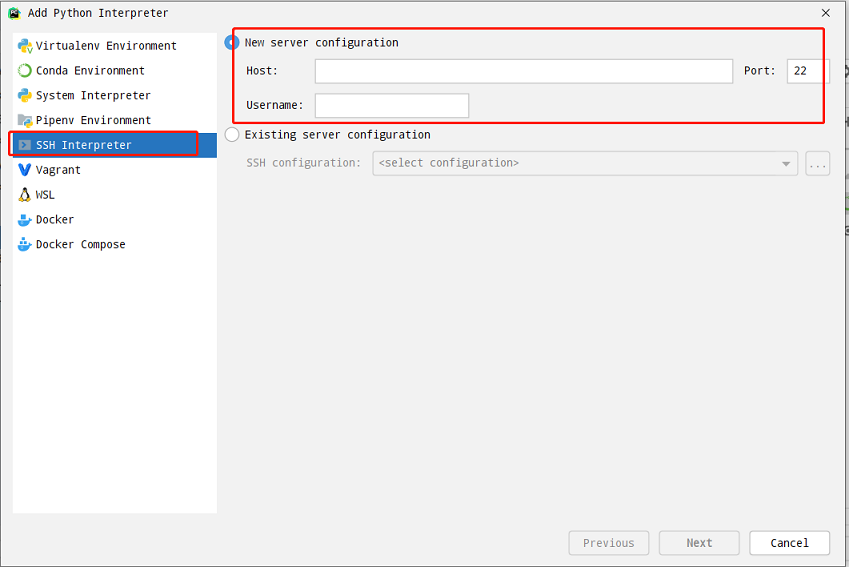

按照如下步骤在虚拟机node1.itcast.cn安装相应软件，除了pyspark库未安装，其他全部安装完成。


> - step1、在Anaconda基础虚拟环境base，安装`pyspark`库即可。

```bash
pip install pyspark==3.1.2 -i https://pypi.tuna.tsinghua.edu.cn/simple
```

查看目录：`/export/server/anaconda3/lib/python3.8/site-packages`，是否有pyspark和py4j目录。

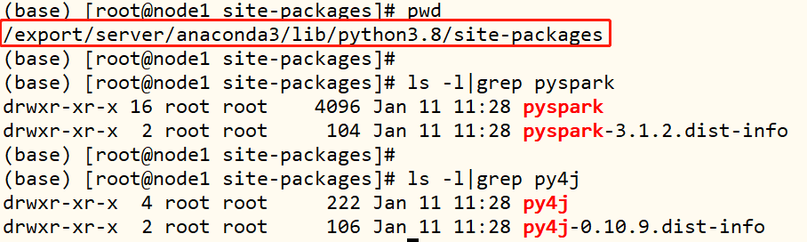

> - step2、配置PyCharm工程使用远程虚拟机中Python解析器。

选择PyCharm工程，点击【settings】设置选项

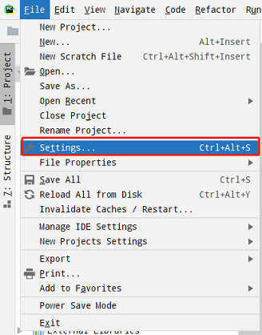

为Project添加Python interpreter解析器：


添加SSH远程连接主机名和用户名


设置用户连接的密码：


设置远程虚拟机中解析器和代码文件同步位置：
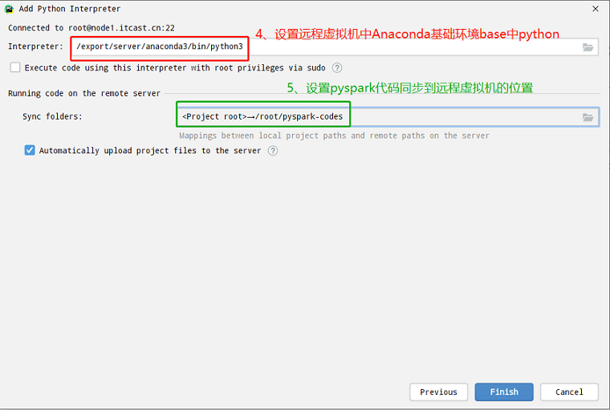

选择刚刚配置好的远程解析器


> 当配置远程连接解析器使用，有时需要手动同步代码到远程服务器：


> 编写代码：`04_wordcount_remote`，使用远程Python解释器，本地模式运行程序。

```python
#!/usr/bin/env python
# -*- coding: utf-8 -*-

import os
from pyspark import SparkConf, SparkContext


if __name__ == '__main__':
    """
    基于Python语言，编程实现Spark中词频统计WordCount，TODO：配置远程Python解析器
    """
    # 设置系统环境变量
    os.environ['JAVA_HOME'] = '/export/server/jdk'
    os.environ['HADOOP_HOME'] = '/export/server/hadoop'
    os.environ['PYSPARK_PYTHON'] = '/export/server/anaconda3/bin/python'
    os.environ['PYSPARK_DRIVER_PYTHON'] = '/export/server/anaconda3/bin/python'

    # 1. 获取上下文对象-context
    spark_conf = SparkConf().setAppName("PySpark WordCount").setMaster("local[2]")
    sc = SparkContext(conf=spark_conf)

    # 2. 加载数据源-source
    input_rdd = sc.textFile('hdfs://node1.itcast.cn:8020/datas/input/words.txt')

    # 3. 数据转换处理-transformation
    """
        a. 分割单词，扁平化
        d. 转换二元组，每个单词出现一次
        c. 按照单词Key分组，并且对组内聚合
    """
    word_rdd = input_rdd.flatMap(lambda line: str(line).split(' '))
    tuple_rdd = word_rdd.map(lambda word: (word, 1))
    output_rdd = tuple_rdd.reduceByKey(lambda tmp, item: tmp + item)

    # 4. 结果数据输出-sink
    output_rdd.saveAsTextFile('hdfs://node1.itcast.cn:8020/datas/output')

    # 5. 关闭上下文对象-close
    sc.stop()
```

## Spark应用提交

### spark-submit命令

> 使用PyCharm工具开发测试Spark Application程序以后，使用命令【`spark-submit`】提交应用的执行，提交命令帮助文档：

```bash
[root@node1 ~]# /export/server/spark-standalone/bin/spark-submit --help
Usage: spark-submit [options] <app jar | python file | R file> [app arguments]
Usage: spark-submit --kill [submission ID] --master [spark://...]
Usage: spark-submit --status [submission ID] --master [spark://...]
Usage: spark-submit run-example [options] example-class [example args]

Options:
  --master MASTER_URL         spark://host:port, mesos://host:port, yarn,
                              k8s://https://host:port, or local (Default: local[*]).
  --deploy-mode DEPLOY_MODE   Whether to launch the driver program locally ("client") or
                              on one of the worker machines inside the cluster ("cluster")
                              (Default: client).
  --class CLASS_NAME          Your application's main class (for Java / Scala apps).
  --name NAME                 A name of your application.
  --jars JARS                 Comma-separated list of jars to include on the driver
                              and executor classpaths.
  --packages                  Comma-separated list of maven coordinates of jars to include
                              on the driver and executor classpaths. Will search the local
                              maven repo, then maven central and any additional remote
                              repositories given by --repositories. The format for the
                              coordinates should be groupId:artifactId:version.
  --exclude-packages          Comma-separated list of groupId:artifactId, to exclude while
                              resolving the dependencies provided in --packages to avoid
                              dependency conflicts.
  --repositories              Comma-separated list of additional remote repositories to
                              search for the maven coordinates given with --packages.
  --py-files PY_FILES         Comma-separated list of .zip, .egg, or .py files to place
                              on the PYTHONPATH for Python apps.
  --files FILES               Comma-separated list of files to be placed in the working
                              directory of each executor. File paths of these files
                              in executors can be accessed via SparkFiles.get(fileName).

  --conf PROP=VALUE           Arbitrary Spark configuration property.
  --properties-file FILE      Path to a file from which to load extra properties. If not
                              specified, this will look for conf/spark-defaults.conf.

  --driver-memory MEM         Memory for driver (e.g. 1000M, 2G) (Default: 1024M).
  --driver-java-options       Extra Java options to pass to the driver.
  --driver-library-path       Extra library path entries to pass to the driver.
  --driver-class-path         Extra class path entries to pass to the driver. Note that
                              jars added with --jars are automatically included in the
                              classpath.

  --executor-memory MEM       Memory per executor (e.g. 1000M, 2G) (Default: 1G).

  --proxy-user NAME           User to impersonate when submitting the application.
                              This argument does not work with --principal / --keytab.

  --help, -h                  Show this help message and exit.
  --verbose, -v               Print additional debug output.
  --version,                  Print the version of current Spark.

 Cluster deploy mode only:
  --driver-cores NUM          Number of cores used by the driver, only in cluster mode
                              (Default: 1).

 Spark standalone or Mesos with cluster deploy mode only:
  --supervise                 If given, restarts the driver on failure.
  --kill SUBMISSION_ID        If given, kills the driver specified.
  --status SUBMISSION_ID      If given, requests the status of the driver specified.

 Spark standalone and Mesos only:
  --total-executor-cores NUM  Total cores for all executors.

 Spark standalone and YARN only:
  --executor-cores NUM        Number of cores per executor. (Default: 1 in YARN mode,
                              or all available cores on the worker in standalone mode)

 YARN-only:
  --queue QUEUE_NAME          The YARN queue to submit to (Default: "default").
  --num-executors NUM         Number of executors to launch (Default: 2).
                              If dynamic allocation is enabled, the initial number of
                              executors will be at least NUM.
  --archives ARCHIVES         Comma separated list of archives to be extracted into the
                              working directory of each executor.
  --principal PRINCIPAL       Principal to be used to login to KDC, while running on
                              secure HDFS.
  --keytab KEYTAB             The full path to the file that contains the keytab for the
                              principal specified above. This keytab will be copied to
                              the node running the Application Master via the Secure
                              Distributed Cache, for renewing the login tickets and the
                              delegation tokens periodically.
```

提交命令：[Usage: `spark-submit` [options] `<app jar | python file | R file>` [app arguments]]()


- 第一种：**基本参数配置**

  提交运行Spark Application时，有些基本参数需要传递值


- 第二种：**Driver Program 参数配置**

  每个Spark Application运行时都有一个Driver Program，属于一个JVM Process进程，可以设置内存Memory和CPU Core核数。

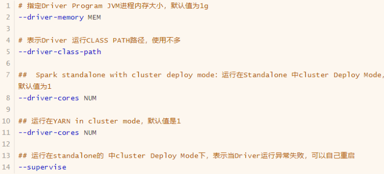

- 第三种：**Executor 参数配置**

  每个Spark Application运行时，需要启动Executor运行任务Task，需要指定Executor个数及每个Executor资源信息（内存Memory和CPU Core核数）。

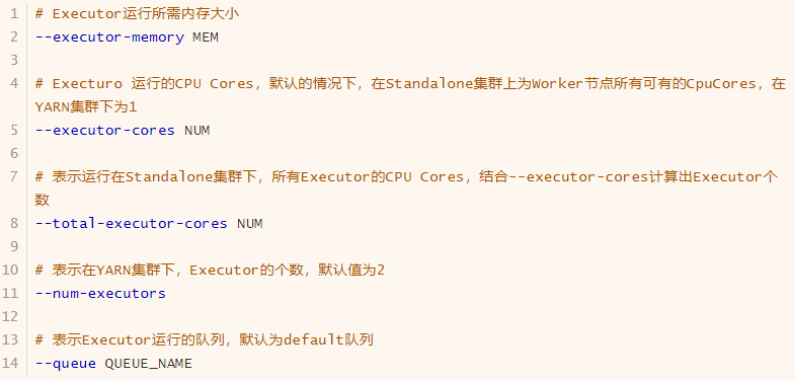

> 官方案例，提交Spark应用运行设置


### ★提交执行WordCount

> 将开发测试完成的WordCount程序，使用【`spark-submit`】分别提交运行在本地模式LocalMode和集群模式Standalone集群。

复制`04_wordcount_remote`代码为：`pyspark_wordcount.py`代码如下所示：


将PySpark程序对应python文件：`pyspark_wordcount.py`，上传到**node1.itcast.cn**虚拟机：`/root` 目录下。

> - 1）、`spark-submit` 提交运行本地模式**localmode**

```bash
# 本地模式方式提交运行
/export/server/spark-local/bin/spark-submit \
--master local[2] \
--conf "spark.pyspark.driver.python=/export/server/anaconda3/bin/python3" \
--conf "spark.pyspark.python=/export/server/anaconda3/bin/python3" \
/root/pyspark_wordcount.py 
```

> - 2）、`spark-submit` 提交运行本地模式**Stanadlone 集群**
> - 注意修改结果输出目录为新目录, 否则报错


```bash
# a. 启动Standalone集群，在 node1机器上执行
/export/server/spark-standalone/sbin/start-master.sh
/export/server/spark-standalone/sbin/start-workers.sh

# b. 启动历史服务器
/export/server/spark-standalone/sbin/start-history-server.sh

# c. 提交脚本
/export/server/spark-standalone/bin/spark-submit \
--master spark://node1.itcast.cn:7077 \
--conf "spark.pyspark.driver.python=/export/server/anaconda3/bin/python3" \
--conf "spark.pyspark.python=/export/server/anaconda3/bin/python3" \
--driver-memory 512m \
--executor-memory 512m \
--executor-cores 1 \
--total-executor-cores 2 \
/root/pyspark_wordcount.py
```

### 部署模式DeployMode

> Spark Application提交运行时==部署模式Deploy Mode==，表示的是**Driver Program运行的地方**，要么是提交应用`客户端：client`，要么是集群`从节点`（**Standalone：Worker，YARN：NodeManager**）：`cluster`。


```ini
--deploy-mode DEPLOY_MODE   Whether to launch the driver program locally ("client") or
                              on one of the worker machines inside the cluster ("cluster")
                              (Default: client).
    含义：Driver 进程运行在哪里
    可选值：
        - client：客户端
            Driver进程运行在提交应用机器上
        - cluster：集群
            Driver进程运行在Standalone集群或YARN集群从节点上；
            Standalone集群就是Worker，YARN集群就是NodeManager。
   默认值：client
```

> 默认DeployMode为`client`，表示应用Driver Program运行在`提交应用Client主机`上（启动JVM Process进程），示意图如下：

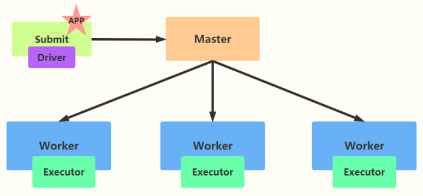

假设运行圆周率PI程序，采用client模式，命令如下：

```bash
/export/server/spark-standalone/bin/spark-submit \
--master spark://node1.itcast.cn:7077 \
--deploy-mode client \
--conf "spark.pyspark.driver.python=/export/server/anaconda3/bin/python3" \
--conf "spark.pyspark.python=/export/server/anaconda3/bin/python3" \
--driver-memory 512m \
--executor-memory 512m \
--executor-cores 1 \
--total-executor-cores 2 \
/export/server/spark-standalone/examples/src/main/python/pi.py \
10
```

程序执行完成，打开历史服务器HistoryServer上记录状态信息。


> 如果采用`cluster`模式运行应用，==应用Driver Program运行在集群从节点Worker某台机器上==。


假设运行圆周率PI程序，采用cluster模式，命令如下：

```bash
/export/server/spark-standalone/bin/spark-submit \
--master spark://node1.itcast.cn:7077 \
--deploy-mode cluster \
--supervise \
--conf "spark.pyspark.driver.python=/export/server/anaconda3/bin/python3" \
--conf "spark.pyspark.python=/export/server/anaconda3/bin/python3" \
--driver-memory 512m \
--executor-memory 512m \
--executor-cores 1 \
--total-executor-cores 2 \
/export/server/spark-standalone/examples/src/main/python/pi.py \
10
```


运行圆周率PI程序，使用**官方提供jar包（Scala语言**），看一下结果：

```bash
/export/server/spark-standalone/bin/spark-submit \
--master spark://node1.itcast.cn:7077 \
--deploy-mode cluster \
--class org.apache.spark.examples.SparkPi \
--supervise \
--conf "spark.pyspark.driver.python=/export/server/anaconda3/bin/python3" \
--conf "spark.pyspark.python=/export/server/anaconda3/bin/python3" \
--driver-memory 512m \
--executor-memory 512m \
--executor-cores 1 \
--total-executor-cores 2 \
/export/server/spark-standalone/examples/jars/spark-examples_2.12-3.1.2.jar \
10
```


### Job作业组成

针对MapReduce应用来说，运行时每个Application 就是一个Job，每个Job包含Map 阶段和Reduce阶段，每个阶段有很多Task任务。[在Spark Application应用中Job是如何组成的呢？]()

> 登录Spark HistoryServer历史服务器WEB UI界面，查看运行词频统计Job：http://node1.itcast.cn:18080/


> 查看应用中运行完成的Job：


> 查看每个Job组成：多个Stage阶段


> 在Spark Application应用每个Job有很多Stage组成，类似MapReduce中MapStage和ReduceStage。


> 每个Stage阶段，由多个Task任务组成，每个Task处理RDD中分区数据。


> Spark Application程序运行时三个核心概念：`Job、Stage、Task`


- **Job作业**：由多个 Task 的并行计算部分，一般 Spark 中的 action 操作（如 save、collect，后面进一步说明），会生成一个 Job。[RDD中函数为Action触发函数时，触发一个Job执行。]()
- **Stage阶段**：Job 的组成单位，一个 Job 会切分成多个 Stage，Stage 彼此之间相互依赖顺序执行，而每个 Stage 是多个 Task 的集合，类似 map 和 reduce stage。
- **Task任务：**被分配到各个 Executor 的单位工作内容，它是 Spark 中的最小执行单位，一般来说有多少个 Paritition（物理层面的概念，即分支可以理解为将数据划分成不同部分并行处理），就会有多少个 Task，每个 Task 只会处理单一分支上的数据。

## Spark on YARN

### Hadoop YARN

> Hadoop YARN是一个成熟稳定且强大的**资源管理和任务调度**的大数据框架，在企业市场占有率很高，很多公司都在使用，将公司的资源交给Hadoop YARN做统一的管理。
>
> 此外，Hadoop YARN支持对任务进行多种模式的调度，如FIFO（先进先出）、Capacity（容量）、Fair（公平）等多种调度模式。在国内，几乎所有Spark Application都是运行Hadoop YARN集群上。


> 首先回顾Hadoop YARN分布式集群架构组件及功能，示意图如下：


```ini
Hadoop YARN：分布式集群资源管理和调度框架
	# 1、主节点
		ResourceManager，老大，管理集群资源和分配资源
	# 2、从节点
		NodeManagers，小弟，管理各个机器资源和干活
		
	# 3、AppMaster
		应用管理者，运行在YARN上任何应用都有一个管理者，管理这个应用执行调度和监控
		
	# 4、Container容器
		封装资源（CPU Core核数和Memory 内存），运行进程，比如AppMaster，MapTask和ReduceTask。
```

[在YARN中，资源按照队列Queue进行划分，默认队列：`default` 队列，提交应用时，指定具体队列名称]()

> 当将MapReduce和Spark 应用同时运行Hadoop YARN时，示意图如下所示：

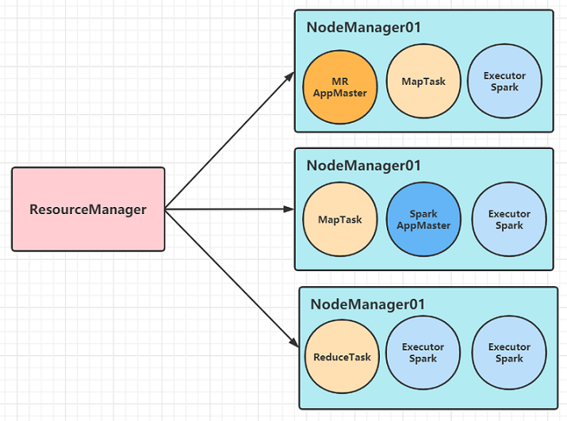

### ★配置部署及测试


### ★yarn-client模式


### ★yarn-cluster模式


## 配置Anaconda下载镜像源地址

> ​	有时候pip install 或conda install 安装一些依赖包，网不好直接超时，或者包死都下不下来，可以配置或指定国内源镜像。

- 1）、Windows 系统，配置镜像源

第1步、创建 .condarc 配置文件，Windows系统文件位置：C:/Users/用户名/.condarc

```ini
conda config --set show_channel_urls yes
```


​	第2步、编辑文件 `.condarc`，**删除**里面所有内容，替换如下内容

```ini
channels:
  - defaults
show_channel_urls: true
default_channels:
  - https://mirrors.tuna.tsinghua.edu.cn/anaconda/pkgs/main
  - https://mirrors.tuna.tsinghua.edu.cn/anaconda/pkgs/r
  - https://mirrors.tuna.tsinghua.edu.cn/anaconda/pkgs/msys2
custom_channels:
  conda-forge: https://mirrors.tuna.tsinghua.edu.cn/anaconda/cloud
  msys2: https://mirrors.tuna.tsinghua.edu.cn/anaconda/cloud
  bioconda: https://mirrors.tuna.tsinghua.edu.cn/anaconda/cloud
  menpo: https://mirrors.tuna.tsinghua.edu.cn/anaconda/cloud
  pytorch: https://mirrors.tuna.tsinghua.edu.cn/anaconda/cloud
  simpleitk: https://mirrors.tuna.tsinghua.edu.cn/anaconda/cloud
```


- 2）、Linunx系统，配置镜像源地址

step1、切换虚拟环境

```ini
conda activate base
```

step2、创建 `.condarc` 配置文件，Linux系统文件位置：`/root/.condarc`

```ini
conda config --set show_channel_urls yes
```

step3、编辑文件 /root/.condarc，删除里面所有内容，替换如下内容

```ini
channels:
  - defaults
show_channel_urls: true
default_channels:
  - https://mirrors.tuna.tsinghua.edu.cn/anaconda/pkgs/main
  - https://mirrors.tuna.tsinghua.edu.cn/anaconda/pkgs/r
  - https://mirrors.tuna.tsinghua.edu.cn/anaconda/pkgs/msys2
custom_channels:
  conda-forge: https://mirrors.tuna.tsinghua.edu.cn/anaconda/cloud
  msys2: https://mirrors.tuna.tsinghua.edu.cn/anaconda/cloud
  bioconda: https://mirrors.tuna.tsinghua.edu.cn/anaconda/cloud
  menpo: https://mirrors.tuna.tsinghua.edu.cn/anaconda/cloud
  pytorch: https://mirrors.tuna.tsinghua.edu.cn/anaconda/cloud
  simpleitk: https://mirrors.tuna.tsinghua.edu.cn/anaconda/cloud
```

> 也可以使用 `pip` 安装包时，通过 `i` 指定镜像源地址：`pip install -i 国内镜像地址 包名`

```
pip install -i  http://mirrors.aliyun.com/pypi/simple/ numpy
```

国内镜像源地址：

```ini
清华：https://pypi.tuna.tsinghua.edu.cn/simple
阿里云：http://mirrors.aliyun.com/pypi/simple/
中国科技大学 https://pypi.mirrors.ustc.edu.cn/simple/
华中理工大学：http://pypi.hustunique.com/
山东理工大学：http://pypi.sdutlinux.org/ 
豆瓣：http://pypi.douban.com/simple/
```