# RDD弹性分布式数据集

## -I. PyCharm创建代码模板Template

> 编写每次PySpark程序，都是如下5步，其中第1步和第5步相同的，每次都要重新写一遍非常麻烦，[可以在PyCharm中构建PySpark程序的代码模板。]()


> PyCharm 中设置 Python 代码模板：**设置 File > Settings > File and Code Template > Python Script**


新建Python Spark程序模板Template：`PySpark Linux Script`


```python
#!/usr/bin/env python
# -*- coding: utf-8 -*-

import os
from pyspark import SparkConf, SparkContext

if __name__ == '__main__':
    """
       
    """
    # 设置系统环境变量
    os.environ['JAVA_HOME'] = '/export/server/jdk'
    os.environ['HADOOP_HOME'] = '/export/server/hadoop'
    os.environ['PYSPARK_PYTHON'] = '/export/server/anaconda3/bin/python'
    os.environ['PYSPARK_DRIVER_PYTHON'] = '/export/server/anaconda3/bin/python'

    # 1. 获取上下文对象-context
    spark_conf = SparkConf().setAppName("PySpark Example").setMaster("local[2]")
    sc = SparkContext(conf=spark_conf)

    # 2. 加载数据源-source

    # 3. 数据转换处理-transformation

    # 4. 处理结果输出-sink

    # 5. 关闭上下文对象-close
    sc.stop()

```

## I. RDD概念

### 1. 分布式计算思想

> 首先回顾一下，MapReduce分布式并行计算引擎思想：[先分再合，分而治之]()

所谓“分而治之”就是**把一个复杂的问题，按照一定的“分解”方法分为等价的规模较小的若干部分，然后逐个解决，分别找出各部分的结果，然后把各部分的结果组成整个问题的最终结果**。


> 基于MapReduce实现词频统计WordCount，流程分为5个部分：input 、**map、shuffle、reduce**、output。


```ini
# MapReduce 对海量数据处理时，分为3个大方面，每个方面都是操作数据
    step1、输入数据input
    step2、处理数据transformation
        map、shuffle、reduce
    step3、输出数据output
```

> 在Spark计算引擎中，思想与MapReduce一样，但是**将输入数据、处理数据和输出数据封装抽象，称为RDD（弹性分布式数据集）**，便于==对数据管理和对数据操作方便==（调用RDD 函数即可）。

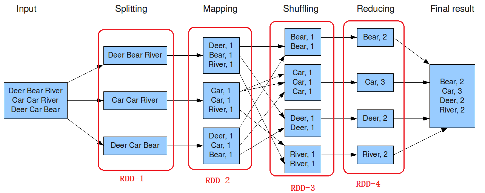

> Spark实现词频统计，首先将要处理数据封装到RDD，处理数据时，直接调用函数，最后将结果RDD输出。


> 思考：Spark中RDD到底是什么呢？[RDD就是一个集合，封装数据，往往数据是大规模海量数据]()


```
官方文档：
	https://spark.apache.org/docs/3.1.2/rdd-programming-guide.html
```

### 2. ★RDD是什么

> `RDD（Resilient Distributed Dataset）`叫做==弹性分布式数据集==，是Spark中最基本的**数据抽象**，代表一个**不可变**、**可分区**、里面的元素可**并行计算**的集合。

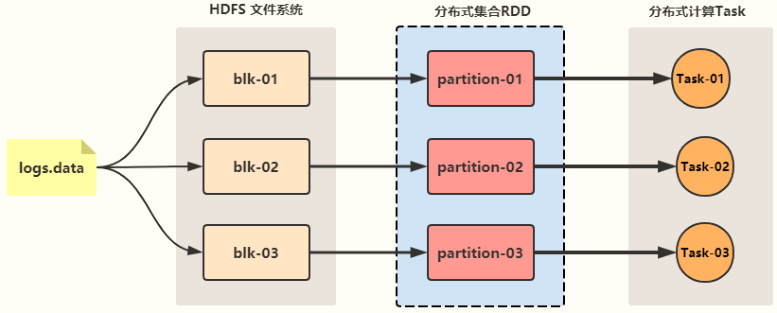

> RDD 分布式集合，三个主要特质：**不可变的集合、分区的集合和并行处理数据的集合**。

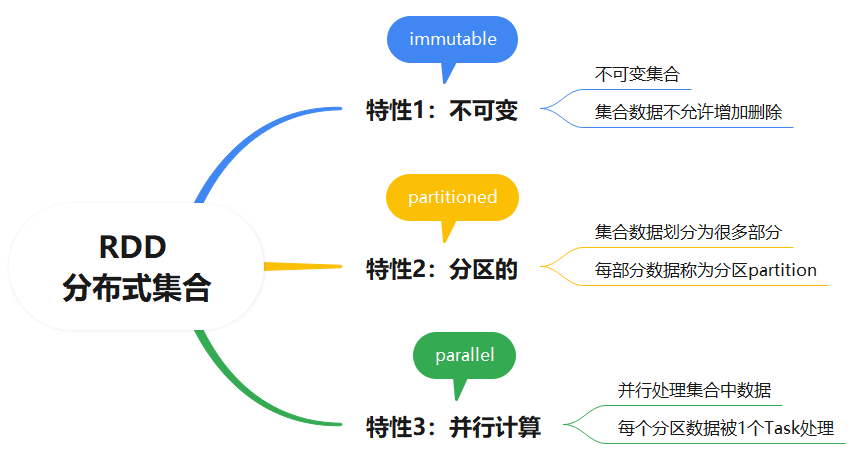

> RDD分布式集合，可以认为RDD是==分布式的列表List==，底层源码`RDD`是一个抽象类`Abstract Class`和泛型`Generic Type`：


> 以**词频统计WordCount**程序为例，查看其中所有RDD，其中代码中RDD默认分区数目为2：


### 3. ★RDD内部五大特性

> RDD 数据结构内部有五个特性（**摘录RDD 源码**）：前3个特性，必须包含的；后2个特性，可选的。

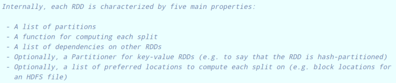

- 第一个：`a list of partitions`

  [每个RDD由一系列分区Partitions组成，一个RDD包含多个分区]()


> 查看RDD中分区数目，调用`getNumPartitios` 方法，返回值int类型，RDD分区数目

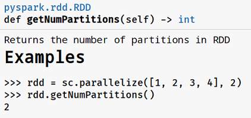

- 第二个：`A function for computing each split`

  [对RDD中数据处理时，每个分区（分片）数据应用函数进行处理，1个分区数据被1个Task处理]()


- 第三个：`A list of dependencies on other RDDs`

  1. [一个RDD依赖于一些列RDD]()

     

  2. RDD的每次转换都会生成一个新的RDD，所以RDD之间就会形成类似于流水线一样的前后依赖关系。

  3. 在部分分区数据丢失时，Spark可以通过这个依赖关系重新计算丢失的分区数据，而不是对RDD的所有分区进行重新计算（Spark的容错机制）；


- 第四个：`Optionally, a Partitioner for key-value RDDs`

  1. [当RDD中数据类型为Key/Value（二元组），可以设置分区器`Partitioner`]()

     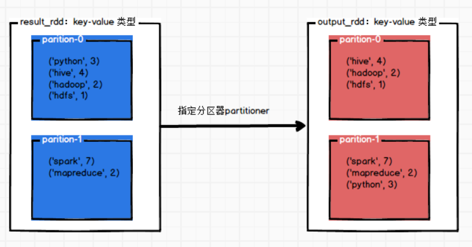

  2. Partitioner函数不但决定了RDD本身的分片数量，也决定了parent RDD Shuffle输出时的
     分片数量。


- 第五个：`Optionally, a list of preferred locations to compute each split on`

  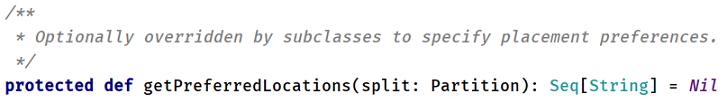

  1. [对RDD中每个分区数据进行计算时，找到`最佳位置`列表]()
  2. 对数据计算时，考虑数据本地性，**数据在哪里，尽量将Task放在哪里，快速读取数据进行处理**

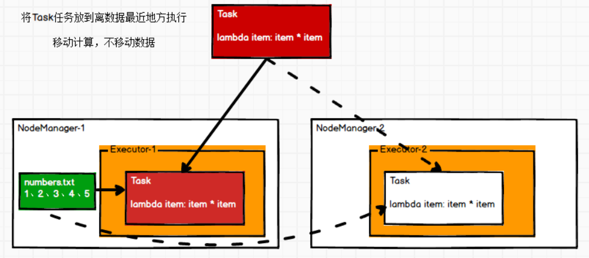

> 再次回顾：RDD是什么呢？
>
> [RDD是Spark 计算引擎中，对数据抽象封装，是一个不可变的、分区的和并行计算集合，方便管理数据和对数据处理分析。]()

## II. RDD创建

### 1. ★两种创建方式

> 如何将数据封装到RDD集合，主要有两种方式：`并行化本地集合`（Driver Program中）和`引用加载外部存储系统`（如HDFS、Hive、HBase、Kafka、Elasticsearch等）数据集。

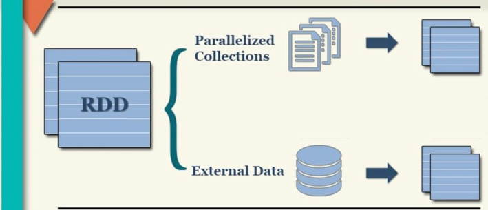

> **方式一：并行化集合**，将一个 Python 中集合（比如列表list）转为RDD集合

- 方法：`parallelize`，将一个集合转换为RDD

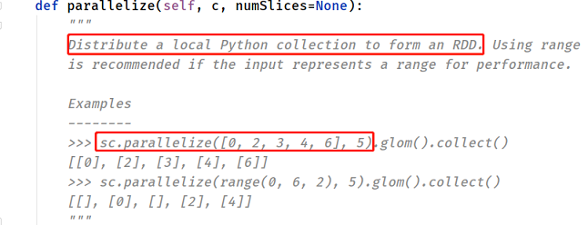

> **方式二：外部存储**，加载外部存储系统的数据集创建RDD

- 方法：`textFile`，读取HDFS或LocalFS上文本文件，指**定文件路径和RDD分区数目**


```ini
# 1、如果是HDFS文件，必须使用绝对路径
	hdfs://namenode-host:8020/xxxxx

# 2、如果是LocalFS文件，可以使用相对路径，也可以使用绝对路径
	Windows 系统：file:///D:/datas/words.txt
	Linunx 系统：file:///root/words.txt
```

> 案例代码演示 `01_create_rdd`：并行列表为RDD和加载本地文件系统文件数据为RDD

```python
#!/usr/bin/env python
# -*- coding: utf-8 -*-

import os
from pyspark import SparkConf, SparkContext


if __name__ == '__main__':
    """
    采用2种方式，创建RDD：并行化Python集合和加载文件系统文本文件数据   
    """

    # 设置系统环境变量
    os.environ['JAVA_HOME'] = '/export/server/jdk'
    os.environ['HADOOP_HOME'] = '/export/server/hadoop'
    os.environ['PYSPARK_PYTHON'] = '/export/server/anaconda3/bin/python3'
    os.environ['PYSPARK_DRIVER_PYTHON'] = '/export/server/anaconda3/bin/python3'

    # 1. 获取上下文对象-context
    spark_conf = SparkConf().setAppName("PySpark Example").setMaster("local[2]")
    sc = SparkContext(conf=spark_conf)

    # 2. 加载数据源-source
    # TODO: 2-1. 并行化本地集合
    rdd_1 = sc.parallelize([1, 2, 3, 4, 5, 6, 7, 8, 9, 10], numSlices=2)
    print(rdd_1.getNumPartitions())

    # TODO: 2-2. 读取本地文件系统文本文件数据
    rdd_2 = sc.textFile('../datas/words.txt', minPartitions=2)
    print(rdd_2.getNumPartitions())

    # 3. 数据转换处理-transformation

    # 4. 处理结果输出-sink

    # 5. 关闭上下文对象-close
    sc.stop()

```

### 2. 小文件数据处理

> 在实际项目中，有时往往处理的数据文件属于**小文件（每个文件数据数据量很小，比如KB，几十MB等），文件数量又很大**，如果一个个文件读取为RDD的一个个分区，计算数据时很耗时性能低下，使用SparkContext中提供：**`wholeTextFiles`**方法，专门读取小文件数据。


- 将每个文件作为一条KV存储在RDD中，[K：文件名的绝对路径，V：文件的内容]()
- 用于解决小文件的问题，可以将多个小文件变成多个KV，自由指定分区个数

> 案例代码演示 `02_create_rdd_wholefile.py`：从LocalFS加载文本文件数据，全部为小文件。

```python
#!/usr/bin/env python
# -*- coding: utf-8 -*-

import os
from pyspark import SparkConf, SparkContext

if __name__ == '__main__':
    """
    Spark 中加载小文件数据，使用方法：wholeTextFiles，指定RDD集合分区数目 
    """

    # 设置系统环境变量
    os.environ['JAVA_HOME'] = '/export/server/jdk'
    os.environ['HADOOP_HOME'] = '/export/server/hadoop'
    os.environ['PYSPARK_PYTHON'] = '/export/server/anaconda3/bin/python3'
    os.environ['PYSPARK_DRIVER_PYTHON'] = '/export/server/anaconda3/bin/python3'

    # 1. 获取上下文对象-context
    spark_conf = SparkConf().setAppName("PySpark Example").setMaster("local[2]")
    sc = SparkContext(conf=spark_conf)

    # 2. 加载数据源-source
    # TODO: 指定目录，加载小文件文本数据
    input_rdd = sc.wholeTextFiles('../datas/ratings100', minPartitions=2)

    # 分区数目和条目数
    print("Partitions:", input_rdd.getNumPartitions())
    print("count:", input_rdd.count())

    # 获取第一条数据
    print(input_rdd.first())

    # 3. 数据转换处理-transformation

    # 4. 处理结果输出-sink

    # 5. 关闭上下文对象-close
    sc.stop()

```

## III. RDD算子

### 1. 算子分类

> RDD 的操作主要可以分为 `Transformation` 和 `Action` 两种。


```
文档：
	https://spark.apache.org/docs/3.1.2/rdd-programming-guide.html#rdd-operations
```

> 1、转换算子：`Transformation` ，[当RDD调用算子，对数据进行处理，产生一个新的RDD ；]()


```ini
# 特点：
	属于lazy懒执行，不会立即将1个RDD转换另外1个RDD
	
# 常用算子：
	map、flatMap、filter、reduceByKey等等
```

> 2、触发算子：`Action`，[当RDD调用算子，触发一个Job执行]()


```ini
# 特点：
	RDD调用Action算子，要么没有返回值，要么非RDD类型
	立即执行Job，对RDD数据进行转换，最后输出或获取值

# 常用算子：
	count、collect、foreach、saveAsTextFile等等
```

> RDD 中2类算子（函数）：转换transformation和触发action。


> RDD 中常用基本算子，包含转换算子和触发算子。


### 2. ★常用转换算子

> RDD 最常用转换算子（Operator）：`map、filter、flatMap`，针对RDD集合中每个元素进行操作的。

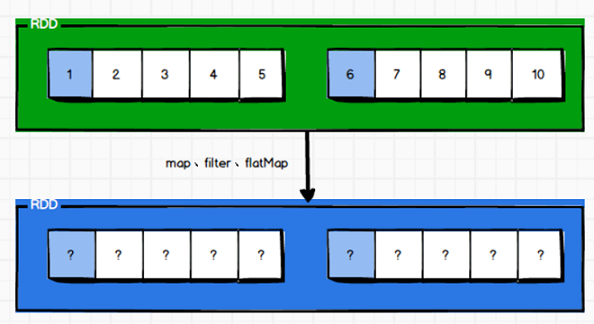

> `map`算子：对RDD集合中每条数据处理，开发中使用最多算子。


```python
input_rdd = sc.parallelize([1, 2, 3, 4, 5, 6, 7, 8, 9, 10], numSlices=2)

# TODO: map函数
map_rdd = input_rdd.map(lambda item: item * item)
map_rdd.foreach(lambda item: print(item))
```

> `filter`算子：对RDD集合中每条数据进行过滤，如果满足条件（返回true），数据就保留，否则数据删除。


```python
input_rdd = sc.parallelize([1, 2, 3, 4, 5, 6, 7, 8, 9, 10], numSlices=2)

# TODO：filter函数
filter_rdd = input_rdd.filter(lambda item: item % 2 == 1)
filter_rdd.foreach(lambda item: print(item))

# Hive SQL 语句： SELECT * FROM tbl_xx WHERE age > 25 ;
```

> `flatMap`算子：类似map算子，都是对RDD集合中每条数据处理，但是还将处理后数据进行扁平化（**类似explode，将一行数据转换多行数据**）。

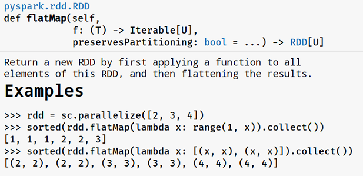

```python
rdd = sc.parallelize(['剧情 / 犯罪', '爱情 / 同性', '剧情 / 爱情 / 灾难'])

# TODO: flatMap函数
flat_rdd = rdd.flatMap(lambda item: str(item).split(' / '))
flat_rdd.foreach(lambda item: print(item))

# Hive SQL 语句： SELECT explode(split(line, ' / '))  FROM tbl_xx 
```

> 案例代码演示 `03_rdd_common_transformation.py`：RDD中常用转换算子使用。

```python
#!/usr/bin/env python
# -*- coding: utf-8 -*-

import os
from pyspark import SparkConf, SparkContext

if __name__ == '__main__':
    """
    RDD中最常用三个转换算子：map、filter、flatMap使用案例演示   
    """

    # 设置系统环境变量
    os.environ['JAVA_HOME'] = '/export/server/jdk'
    os.environ['HADOOP_HOME'] = '/export/server/hadoop'
    os.environ['PYSPARK_PYTHON'] = '/export/server/anaconda3/bin/python3'
    os.environ['PYSPARK_DRIVER_PYTHON'] = '/export/server/anaconda3/bin/python3'

    # 1. 获取上下文对象-context
    spark_conf = SparkConf().setAppName("PySpark Example").setMaster("local[2]")
    sc = SparkContext(conf=spark_conf)

    # 2. 加载数据源-source
    # 并行化方式，创建RDD
    input_rdd = sc.parallelize([1, 2, 3, 4, 5])

    # TODO: map 算子，对集合中每条数据进行处理，按照指定逻辑处理
    map_rdd = input_rdd.map(lambda item: item * item)
    print(map_rdd.collect())

    # TODO: filter 算子，对集合中每条数据进行过滤，返回值为true保存，否则删除
    filter_rdd = input_rdd.filter(lambda item: item % 2 == 1)
    print(filter_rdd.collect())

    # TODO: flatMap 算子，对集合中每条数据进行处理，类似map算子，但是要求处理每条数据结果为集合，将自动将集合数据扁平化（explode）
    rdd = sc.parallelize(['爱情 / 犯罪', '剧情 / 灾难 / 动作'])
    flat_rdd = rdd.flatMap(lambda item: str(item).split(' / '))
    flat_rdd.foreach(lambda item: print(item))
    """
        1001,'剧情 / 犯罪' 
        1002, '剧情 / 爱情 / 灾难'
            |
        1001, ‘剧情’
        1001, ‘犯罪’
        1002， ‘剧情'
        1002, ’爱情'
        1002， ‘灾难’
    """

    # 3. 数据转换处理-transformation

    # 4. 处理结果输出-sink

    # 5. 关闭上下文对象-close
    sc.stop()

```

### 3. ★常用触发算子

> RDD 常用触发算子（Operator）：`count、foreach、saveAsTextFile`，针对RDD集合中每个元素进行操作


> `count`算子：计算RDD集合中数据条目数


> `foreach`算子：针对RDD中每条数据进行操作，比如打印到控制台

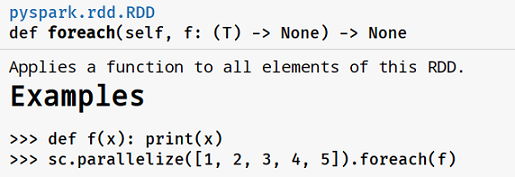

> `saveAsTextFile`算子：将RDD中数据保存到文件中，RDD中一个分区数据写入一个文件。


> 案例代码演示 `04_rdd_common_action.py`：RDD中常用转换算子使用。

```python
#!/usr/bin/env python
# -*- coding: utf-8 -*-

import os
from pyspark import SparkConf, SparkContext

if __name__ == '__main__':
    """
    RDD中常用触发算子使用：count、foreach、saveAsTextFile案例演示   
    """

    # 设置系统环境变量
    os.environ['JAVA_HOME'] = '/export/server/jdk'
    os.environ['HADOOP_HOME'] = '/export/server/hadoop'
    os.environ['PYSPARK_PYTHON'] = '/export/server/anaconda3/bin/python3'
    os.environ['PYSPARK_DRIVER_PYTHON'] = '/export/server/anaconda3/bin/python3'

    # 1. 获取上下文对象-context
    spark_conf = SparkConf().setAppName("PySpark Example").setMaster("local[2]")
    sc = SparkContext(conf=spark_conf)

    # 2. 加载数据源-source
    input_rdd = sc.parallelize([1, 2, 3, 4, 5, 6, 7, 8, 9, 10], numSlices=2)

    # 3. 数据转换处理-transformation
    # TODO: count 算子，统计集合中元素个数
    print("count:", input_rdd.count())

    # TODO: foreach 算子，遍历集合中每个元素，进行输出操作
    input_rdd.foreach(lambda item: print(item))

    # TODO: saveAsTextFiles 算子，将集合数据保存到文本文件，一个分区数据保存一个文件
    input_rdd.saveAsTextFile('../datas/output')

    # 4. 处理结果输出-sink

    # 5. 关闭上下文对象-close
    sc.stop()

```

### 4. ★基本触发算子

> RDD 基本触发算子（Operator）：`first、take、collect、reduce`，对RDD中元素进行操作


> `first`算子：返回RDD集合中第一个元素值。

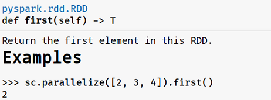

> `take`算子：获取RDD中前N个元素，放在列表list中返回。

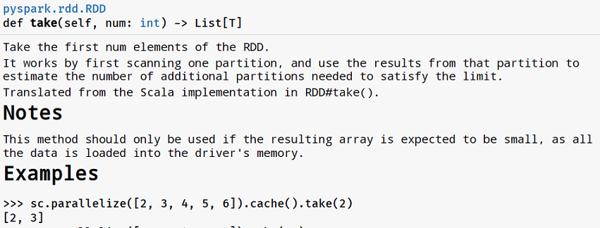

> `collect`算子：将RDD中所有数据，放在列表中返回，注意RDD数据不能太多，否则内存不足，直接GG。

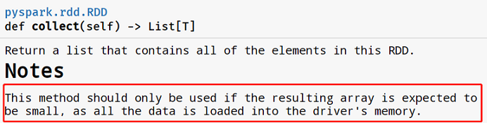

> `reduce`算子：对RDD中数据进行聚合操作，比如累加求和。

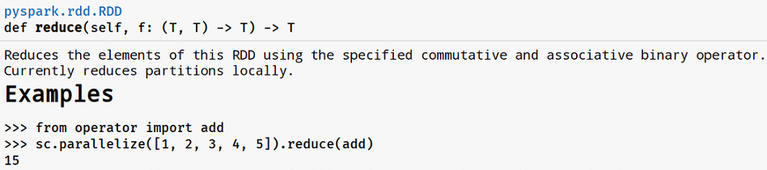

```python
"""
	编写Python代码，对列表list中数据累加求和。
"""

# 定义列表
list = [1, 2, 3, 4, 5]
# 定义聚合临时变量，存储聚合中间值
tmp = 0
# 对列表数据聚合：累加求和
for item in list:
	tmp = tmp + item
# 获取聚合中间值，就是聚合结果
print(tmp)
```

> 案例代码演示 `05_rdd_basic_action.py`：RDD中基本触发算子使用。

```python
#!/usr/bin/env python
# -*- coding: utf-8 -*-

import os
from pyspark import SparkConf, SparkContext

if __name__ == '__main__':
    """
    RDD 中基本触发算子：first、take、collect、reduce 案例演示   
    """

    # 设置系统环境变量
    os.environ['JAVA_HOME'] = '/export/server/jdk'
    os.environ['HADOOP_HOME'] = '/export/server/hadoop'
    os.environ['PYSPARK_PYTHON'] = '/export/server/anaconda3/bin/python3'
    os.environ['PYSPARK_DRIVER_PYTHON'] = '/export/server/anaconda3/bin/python3'

    # 1. 获取上下文对象-context
    spark_conf = SparkConf().setAppName("PySpark Example").setMaster("local[2]")
    sc = SparkContext(conf=spark_conf)

    # 2. 加载数据源-source
    input_rdd = sc.parallelize([1, 2, 3, 4, 5, 6, 7, 8, 9, 10], numSlices=2)

    # 3. 数据转换处理-transformation
    # TODO：first 算子， 获取集合中第一条数据
    print("first:", input_rdd.first())

    # TODO: take 算子，获取集合中前N条数据，放在列表中
    take_list = input_rdd.take(3)
    print(take_list)

    # TODO: collect 算子，将集合数据转换为列表，注意数据不能太大，否则内存不足：OOM
    collect_list = input_rdd.collect()
    print(collect_list)

    # TODO: reduce 算子，对集合中数据进行聚合操作，聚合时需要变量存储聚合中间值
    sum = input_rdd.reduce(lambda tmp, item: tmp + item)
    print("sum:", sum)

    # 4. 处理结果输出-sink

    # 5. 关闭上下文对象-close
    sc.stop()

```

### 5. ★基本转换算子

> RDD 基本转换算子（Operator）：`union、distinct、groupByKey和reduceByKey`。


> `union`算子：类似SQL语句中union，将2个相同数据类型RDD合并为一个RDD。

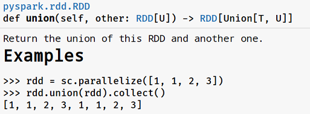

> `distinct`算子：类似SQL语句中distinct，对RDD中数据进行去重。

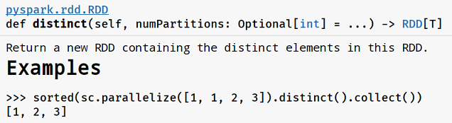

> `groupByKey`算子：要求RDD中数据类型为Key/Value对，按照Key分组，相同Key的Value放在集合中。

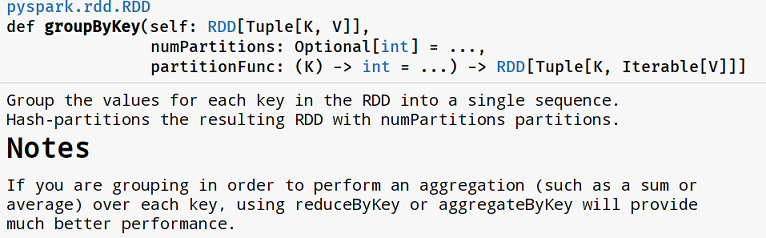

应用案例：


> `reduceByKey`算子：要求RDD中数据类型为Key/Value对，按照Key分组，将相同Key的Value值进行聚合。


应用案例：

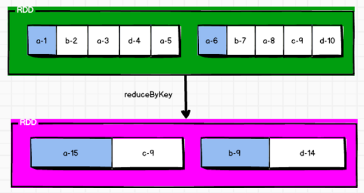

> 案例代码演示 `06_rdd_basic_transformation.py`：RDD中基本转换算子使用。

```python
#!/usr/bin/env python
# -*- coding: utf-8 -*-

import os
from pyspark import SparkConf, SparkContext

if __name__ == '__main__':
    """
    RDD 中基本转换算子：union、distinct、groupByKey和reduceByKey案例演示   
    """

    # 设置系统环境变量
    os.environ['JAVA_HOME'] = '/export/server/jdk'
    os.environ['HADOOP_HOME'] = '/export/server/hadoop'
    os.environ['PYSPARK_PYTHON'] = '/export/server/anaconda3/bin/python3'
    os.environ['PYSPARK_DRIVER_PYTHON'] = '/export/server/anaconda3/bin/python3'

    # 1. 获取上下文对象-context
    spark_conf = SparkConf().setAppName("PySpark Example").setMaster("local[2]")
    sc = SparkContext(conf=spark_conf)

    # 2. 加载数据源-source
    rdd_1 = sc.parallelize([1, 2, 3, 4, 5, 6, 7, 8], numSlices=2)
    rdd_2 = sc.parallelize([6, 7, 8, 9], numSlices=2)

    rdd_3 = sc.parallelize(
        [
            ("北京", 20), ("上海", 15), ("北京", 30), ("上海", 25), ("北京", 50), ("深圳", 90)
        ]
    )

    # 3. 数据转换处理-transformation
    # TODO: union算子，将2个数据类型相同的RDD进行合并，不去重，类似SQL中 union all
    union_rdd = rdd_1.union(rdd_2)
    print(union_rdd.collect())

    # TODO: distinct 算子，对RDD集合中数据进行去重，类似SQL中distinct
    distinct_rdd = union_rdd.distinct()
    print(distinct_rdd.collect())

    # TODO: groupByKey 算子，将集合中数据，按照Key分组，相同key的value放在集合中
    group_rdd = rdd_3.groupByKey()
    group_rdd.foreach(lambda tuple: print(tuple[0], list(tuple[1])))
    """
    深圳 -> [90]
    北京 -> [20, 30, 50]
    上海 -> [15, 25]
    """

    # TODO: reduceByKey 算子，将集合中数据，先按照Key分组，再使用定义reduce函数进行组内聚合
    reduce_rdd = rdd_3.reduceByKey(lambda tmp, item: tmp + item)
    reduce_rdd.foreach(lambda item: print(item))
    """
    ('深圳', 90)
    ('北京', 100)
    ('上海', 40)
    """

    # 4. 处理结果输出-sink

    # 5. 关闭上下文对象-close
    sc.stop()

```


> 编程实现词频统计WordCount：将文本文件数据读取封装到RDD集合，调用Transformation转换算子处理，最后调用Action算子输出。

- 转换算子：map、flatMap、reduceByKey
- 触发算子：collect、foreach、saveAsTextFile

```python
#!/usr/bin/env python
# -*- coding: utf-8 -*-

import os
import re
from pyspark import SparkConf, SparkContext

if __name__ == '__main__':
    """
    使用PySpark实现词频统计WordCount：加载文本文件数据为RDD集合，调用转换算子处理数据，最后数据触发算子输出数据   
    """

    # 设置系统环境变量
    os.environ['JAVA_HOME'] = '/export/server/jdk'
    os.environ['HADOOP_HOME'] = '/export/server/hadoop'
    os.environ['PYSPARK_PYTHON'] = '/export/server/anaconda3/bin/python3'
    os.environ['PYSPARK_DRIVER_PYTHON'] = '/export/server/anaconda3/bin/python3'

    # 1. 获取上下文对象-context
    spark_conf = SparkConf().setAppName("PySpark Example").setMaster("local[2]")
    sc = SparkContext(conf=spark_conf)

    # 2. 加载数据源-source
    input_rdd = sc.textFile('../datas/words.data', minPartitions=2)
    print(input_rdd.collect())

    # 3. 数据转换处理-transformation
    """
        a. 过滤脏数据，空行
            filter
        b. 分割每行数据，转换为单词 -> 使用正则分割
            flatMap
        c. 将每个单词转换为二元组，表示每个单词出现一次
            map
        d. 按照单词分组，再组内求和
            reduceByKey
    """
    # a. 过滤脏数据，空行
    line_rdd = input_rdd.filter(lambda line: len(str(line).strip()) > 0)
    print(line_rdd.collect())

    # b. 分割每行数据，转换为单词 -> 使用正则分割
    word_rdd = line_rdd.flatMap(lambda line: re.split('\\s+', line))
    print(word_rdd.collect())

    # c. 将每个单词转换为二元组，表示每个单词出现一次
    tuple_rdd = word_rdd.map(lambda word:  (word, 1))
    print(tuple_rdd.collect())

    # d.按照单词分组，再组内求和
    output_rdd = tuple_rdd.reduceByKey(lambda tmp, item: tmp + item)
    print(output_rdd)

    # 4. 处理结果输出-sink
    output_rdd.foreach(lambda tuple: print(tuple))

    # 5. 关闭上下文对象-close
    sc.stop()

```

### 6. ★数据排序算子

> RDD中提供对数据排序算子：`sortBy、sortByKey及top和takeOrdered`，其中sortBy和sortByKey为转换算子，top和takeOrdered为触发算子。

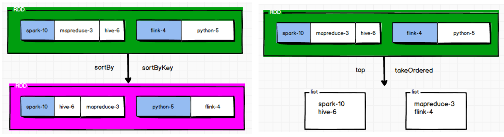

> `sortBy`算子：对RDD集合中**每个分区数据**排序，需要指定排序字段，默认排序规则为升序排序。

```SQL
-- Hive SQL：
	SELECT word, total FROM tbl_wordcount SORT BY total ASC
```


> `sortByKey`算子：对RDD集合中**每个分区数据**排序，要求RDD数据类型为Key/Value对，按照Key升序排序。

```SQL
-- Hive SQL：
	SELECT word, total FROM tbl_wordcount SORT BY total ASC
```

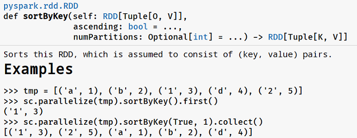

> `top`算子：获取RDD集合中最大前Key个元素，实现数据分析中TopKey。

```SQL
-- Hive SQL：
	SELECT word, total FROM tbl_wordcount ORDER BY total DESC LIMIT 3
```

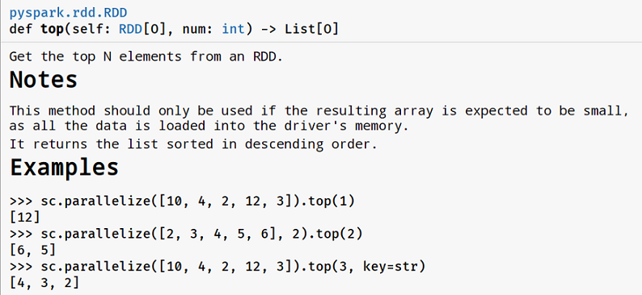

> `takeOrdered`算子：获取RDD集合最小前Key个元素，实现数据分析中BottomKey。

```SQL
-- Hive SQL：
	SELECT word, total FROM tbl_wordcount ORDER BY total ASC LIMIT 3
```

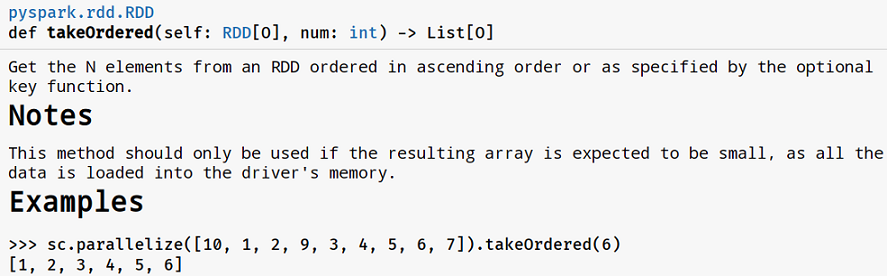

> 案例代码演示 `07_rdd_sort.py`：RDD中数据排序算子使用。

```python
#!/usr/bin/env python
# -*- coding: utf-8 -*-

import os
from pyspark import SparkConf, SparkContext

if __name__ == '__main__':
    """
    RDD 中数据排序算子：sortBy、sortByKey、top、takeOrdered案例演示   
    """

    # 设置系统环境变量
    os.environ['JAVA_HOME'] = '/export/server/jdk'
    os.environ['HADOOP_HOME'] = '/export/server/hadoop'
    os.environ['PYSPARK_PYTHON'] = '/export/server/anaconda3/bin/python3'
    os.environ['PYSPARK_DRIVER_PYTHON'] = '/export/server/anaconda3/bin/python3'

    # 1. 获取上下文对象-context
    spark_conf = SparkConf().setAppName("PySpark Example").setMaster("local[2]")
    sc = SparkContext(conf=spark_conf)

    # 2. 加载数据源-source
    input_rdd = sc.parallelize(
        [("spark", 10), ("mapreduce", 3), ("hive", 6), ("flink", 4), ("python", 5)],
        numSlices=2
    )

    # 3. 数据转换处理-transformation
    # TODO： sortBy算子，按照词频进行降序排序，每个分区内数据排序，并不是全局
    rdd_1 = input_rdd.sortBy(keyfunc=lambda tuple: tuple[1], ascending=False)
    rdd_1.foreach(lambda item: print(item))

    # TODO: sortByKey 算子，按照Key进行排序，可以指定排序规则
    rdd_2 = input_rdd.map(lambda tuple: (tuple[1], tuple[0])).sortByKey(ascending=False)
    rdd_2.foreach(lambda item: print(item))


    rdd = sc.parallelize([34, 87, 1, -98, 36, 83, 100], numSlices=2)

    # TODO： top算子，获取集合中最大前N个数据
    top_list = rdd.top(3)
    print(top_list)

    # TODO: takeOrdered 算子，获取集合中最小前N个数据
    bottom_list = rdd.takeOrdered(3)
    print(bottom_list)

    # 4. 处理结果输出-sink

    # 5. 关闭上下文对象-close
    sc.stop()

```

### 7. ★调整分区算子


