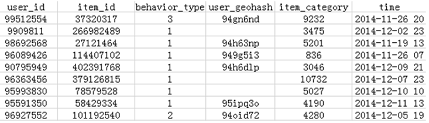
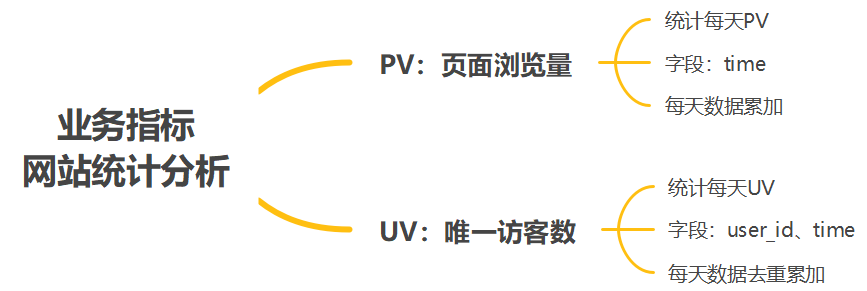
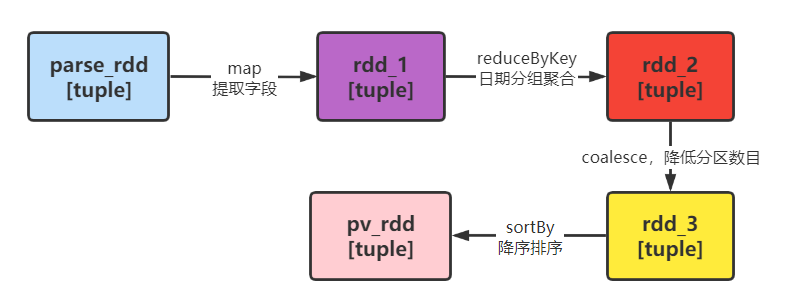
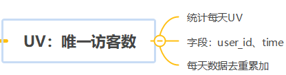
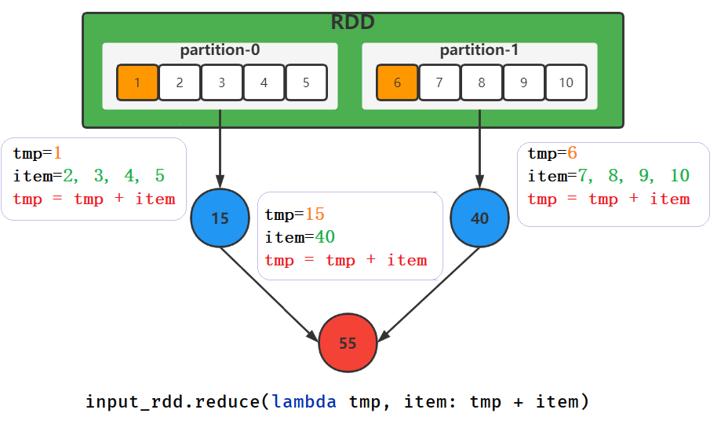
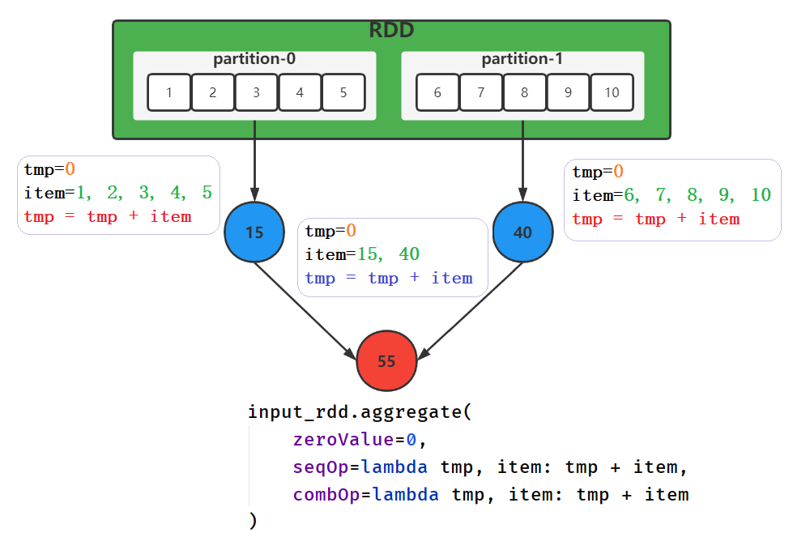
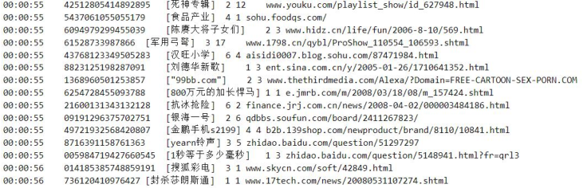
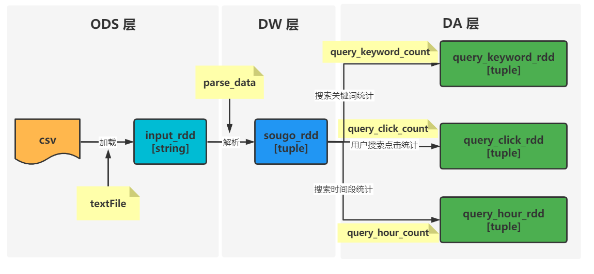

# RDD Operations & Shared Variables

## I. 网站统计分析

### 1. 业务需求分析

> 大数据最早应用场景：离线分析处理网站海量用户行为日志数据，其中 **友盟+**公司开发一系列产品，方便统计分析网站数据。==友盟+== 网站：https://www.umeng.com/


> 从上述图中可以看出，网站统计分析基本指标：`PV、UV、IP`，具体含义如下所示：

- 第一、**PV（page view）**即==页面浏览量==或==点击量==
  - **用户每1次对网站中的每个网页访问均被记录1个PV**，用户对同一页面的多次访问，访问量累计，用以衡量网站用户访问的网页数量；

- 第二、**UV（unique visitor）**即==唯一访客数==
  - 指通过互联网访问、浏览这个网页的自然人。
  - 访问您网站的一台电脑客户端为一个访客，00:00-24:00内相同的客户端只被计算一次。
  - **一天内同个访客多次访问仅计算一个UV。**

- 第三、**IP（Internet Protocol）**即==独立IP==
  - **指访问过某站点的IP总数，以用户的IP地址作为统计依据**，00:00-24:00内相同IP地址之被计算一次。
  - **UV与IP区别**：你和你的家人用各自的账号在同一台电脑上登录新浪微博，则IP数+1，UV数+2。由于使用的是同一台电脑，所以IP不变，但使用的不同账号，所以UV+2。

> 以阿里巴巴移动电商平台的**真实用户-商品行为数据**为基础，进行基本网站指标分析统计：PV、UV等。

- 业务数据：用户浏览网页数据记录日志



- 字段含义：


- 业务需求及分析说明



> 编写PySpark代码，加载用户日志数据，封装为RDD，进行解析，统计每日PV和UV。


### 2. 加载日志数据

> 编写代码 `09_web_analysis.py`：从本地文件系统加载日志数据，解析每条数据，封装元组中。


```python
#!/usr/bin/env python
# -*- coding: utf-8 -*-

import os
from pyspark import SparkConf, SparkContext


if __name__ == '__main__':
    """
    基于阿里提供用户行为日志数据，使用Spark RDD进行基本指标统计分析：pv和uv   
    """

    # 设置系统环境变量
    os.environ['JAVA_HOME'] = '/export/server/jdk'
    os.environ['HADOOP_HOME'] = '/export/server/hadoop'
    os.environ['PYSPARK_PYTHON'] = '/export/server/anaconda3/bin/python3'
    os.environ['PYSPARK_DRIVER_PYTHON'] = '/export/server/anaconda3/bin/python3'

    # 1. 获取上下文对象-context
    spark_conf = SparkConf().setAppName("PySpark Example").setMaster("local[4]")
    sc = SparkContext(conf=spark_conf)

    # 2. 加载数据源-source
    input_rdd = sc.textFile('../datas/tianchi_user.csv', minPartitions=4)
    # print(input_rdd.first())
    # print("count:", input_rdd.count())
    """
    98047837,232431562,1,,4245,2014-12-06 02
    count: 1048575
    """

    # 3. 数据转换处理-transformation
    """
        3-1. 过滤脏数据，解析数据，每条数据封装到元组中
        3-2. pv统计
        3-3. uv统计
    """
    # 3-1. 过滤脏数据，解析数据，每条数据封装到元组中
    """
    对原始日志数据进行ETL转换操作，包括过滤、解析和转换
        数据格式：98047837,232431562,1,,4245,2014-12-06 02
    """
    parse_rdd = input_rdd\
        .map(lambda line: str(line).split(',')) \
        .filter(lambda line: len(str(line).split(',')) == 6) \
        .map(lambda list: (
            list[0], list[1], int(list[2]), list[3], list[4], list[5], str(list[5])[0:10]
        ))
    print("count:", parse_rdd.count())
    print(parse_rdd.first())
    """
        ('98047837', '232431562', 1, '', '4245', '2014-12-06 02', '2014-12-06')
    """

    # 3-2. pv统计
    

    # 3-3. uv统计
    

    # 4. 处理结果输出-sink

    # 5. 关闭上下文对象-close
    sc.stop()

```

### 3. 每日PV统计

> **需求一**：每日PV统计，使用字段【time】，获取访问日期。


```python
# 3-2. pv统计
"""
    ('2014-12-06', 1)
    ('2014-12-06', 1)       ->  reduceByKey
    ('2014-12-06', 1)
    ----------------------------
    解析数据  -map->  ('2014-12-06', 1) -reduceByKey-> ('2014-12-06', 988777) ->coalesce降低RDD分区数目为1 ->sortBy降序排序
    ......
"""
pv_rdd = parse_rdd\
    .map(lambda tuple: (tuple[6], 1))\
    .reduceByKey(lambda tmp, item: tmp + item)\
    .coalesce(1)\
    .sortBy(lambda tuple: tuple[1], ascending=False)
# pv_rdd.foreach(lambda item: print(item))
```



运行程序，输出结果如下：

```ini
('2014-12-12', 59327)
('2014-12-11', 41727)
('2014-12-10', 35835)
('2014-12-03', 34896)
('2014-11-30', 34824)
('2014-12-13', 34801)
('2014-12-14', 34656)
('2014-12-02', 34625)
('2014-12-07', 34400)
('2014-12-04', 34286)
('2014-12-15', 34208)
('2014-12-16', 34077)
('2014-12-09', 33731)
('2014-12-01', 33658)
('2014-12-06', 33119)
('2014-12-17', 33038)
('2014-12-08', 32719)
('2014-11-23', 32458)
('2014-11-24', 32292)
('2014-11-29', 31685)
('2014-11-18', 31581)
('2014-11-25', 31510)
('2014-12-05', 31370)
('2014-11-27', 31338)
('2014-12-18', 31318)
('2014-11-22', 31283)
('2014-11-26', 30792)
('2014-11-20', 30598)
('2014-11-19', 30567)
('2014-11-28', 29817)
('2014-11-21', 28039)
```

### 4. 每日UV统计

> **需求二**：每日UV统计，使用字段【`user_id`】和【`time`】，获取用户ID和访问日期。



```python
# 3-3. uv统计
"""
    ('98047837', '232431562', 1, '', '4245', '2014-12-06 02', '2014-12-06')
    a. 提取字段： map
        ('2014-12-06', '98047837')
        ('2014-12-06', '98047837')
        ('2014-12-06', '98047837')
        ('2014-12-06', '96610296')
        ('2014-12-06', '96610296')
    b. 去重: distinct
        ('2014-12-06', '98047837')
        ('2014-12-06', '96610296')
    c. 转换数据: map
        ('2014-12-06', 1)
        ('2014-12-06', 1)
    d. 分组聚合，每日uv: reduceByKey
        ('2014-12-06', 2)
    e. 按照uv降序排序: sortBy
"""
uv_rdd = parse_rdd\
    .map(lambda tuple: (tuple[6], tuple[0]))\
    .distinct()\
    .map(lambda tuple: (tuple[0], 1))\
    .reduceByKey(lambda tmp, item: tmp + item)\
    .coalesce(1)\
    .sortBy(lambda tuple: tuple[1], ascending=False)
uv_rdd.foreach(lambda item: print(item))
```


运行程序，输出结果如下：

```ini
('2014-12-12', 5693)
('2014-12-11', 4912)
('2014-12-13', 4624)
('2014-12-15', 4615)
('2014-12-16', 4613)
('2014-12-10', 4559)
('2014-12-03', 4558)
('2014-12-14', 4525)
('2014-12-17', 4511)
('2014-12-02', 4497)
('2014-12-08', 4483)
('2014-12-09', 4472)
('2014-12-04', 4458)
('2014-12-07', 4437)
('2014-12-01', 4421)
('2014-12-18', 4399)
('2014-11-24', 4391)
('2014-11-30', 4385)
('2014-12-06', 4373)
('2014-11-23', 4317)
('2014-11-19', 4301)
('2014-11-25', 4298)
('2014-12-05', 4295)
('2014-11-18', 4283)
('2014-11-20', 4276)
('2014-11-26', 4275)
('2014-11-27', 4262)
('2014-11-29', 4235)
('2014-11-21', 4144)
('2014-11-28', 4138)
('2014-11-22', 4122)
```

## II. RDD算子

### 1. reduce聚合原理


### 2. 数据聚合算子

> 在RDD中除了讲解`reduce`函数聚合外，还有`fold`和`aggregate`算子，也是对RDD中数据聚合，更加灵活。

- 算子：`reduce`


**示意图**：对数值类型RDD中数据求和。



- 算子：`fold`，[比reduce算子，多一个参数，可以设置聚合时中间临时变量的初始值]()


**示意图**：对数值类型RDD中数据求和。


- 算子：`aggregate`，[比如fold多一个参数，分别设置RDD数据集合时局部聚合函数和全局聚合函数]()


**示意图**：对数值类型RDD中数据求和。



> 案例代码演示 `02_rdd_agg.py`：分别使用reduce、fold和aggregate函数对RDD数据求和。

```python
#!/usr/bin/env python
# -*- coding: utf-8 -*-

import os
from pyspark import SparkConf, SparkContext, TaskContext

if __name__ == '__main__':
    """
    RDD中三个数据聚合算子：reduce、fold和aggregate案例演示   
    """

    # 设置系统环境变量
    os.environ['JAVA_HOME'] = '/export/server/jdk'
    os.environ['HADOOP_HOME'] = '/export/server/hadoop'
    os.environ['PYSPARK_PYTHON'] = '/export/server/anaconda3/bin/python3'
    os.environ['PYSPARK_DRIVER_PYTHON'] = '/export/server/anaconda3/bin/python3'

    # 1. 获取上下文对象-context
    spark_conf = SparkConf().setAppName("PySpark Example").setMaster("local[2]")
    sc = SparkContext(conf=spark_conf)

    # 2. 加载数据源-source
    input_rdd = sc.parallelize([1, 2, 3, 4, 5, 6, 7, 8, 9, 10], numSlices=2)

    # 3. 数据转换处理-transformation
    # TODO： reduce 算子
    reduce_value = input_rdd.reduce(lambda tmp, item: tmp + item)
    print("reduceValue:", reduce_value)

    # TODO: fold 算子，需要指定聚合时临时变量初始值
    fold_value = input_rdd.fold(0, lambda tmp, item: tmp + item)
    print("foldValue:", fold_value)

    # TODO: aggregate 算子，先指定聚合临时变量初始值、分区数据聚合函数和分区间数据聚合函数
    agg_value = input_rdd.aggregate(0, lambda tmp, item: tmp + item, lambda tmp, item: tmp + item)
    print("foldValue:", agg_value)

    # 4. 处理结果输出-sink

    # 5. 关闭上下文对象-close
    sc.stop()

```

### 3. KeyValue类型算子


### 4. Join关联算子


### 5. 分区处理算子


## III. SogouQ日志分析

### 1. 业务需求分析

> 基于搜狗实验室提供【**用户查询日志(SogouQ)**】数据，使用Spark框架，将数据封装到RDD中进行业务数据处理分析。

- 1）、数据介绍：

> 搜索引擎查询日志库设计为包括约1个月(2008年6月)Sogou搜索引擎部分网页查询需求及用户点击情况的网页查询日志数据集合。数据网址：http://www.sogou.com/labs/resource/q.php

- 2）、数据格式

```ini
访问时间\t用户ID\t[查询词]\t该URL在返回结果中的排名\t用户点击的顺序号\t用户点击的URL
```



- 3）、数据下载：分为三个数据集，大小不一样

```ini
    # 迷你版(样例数据, 376KB)：
        http://download.labs.sogou.com/dl/sogoulabdown/SogouQ/SogouQ.mini.zip

    # 精简版(1天数据，63MB)：
        http://download.labs.sogou.com/dl/sogoulabdown/SogouQ/SogouQ.reduced.zip

    # 完整版(1.9GB)：
        http://www.sogou.com/labs/resource/ftp.php?dir=/Data/SogouQ/SogouQ.zip
```

> 针对SougouQ查询日志数据，分析业务需求：


> 编写实现，按照数仓分层方式管理数据，加载原数据，进行转换处理，最后实现业务需求。



### 2. Jieba中文分词

> [jieba](https://github.com/fxsjy/jieba) 是目前最好的 Python 中文分词组件，首先安装jieba分词库，命令：`pip install jieba`，再使用库对中文语句进行分词。官方网站：<https://github.com/fxsjy/jieba>


[Jieba分词库，支持 3 种分词模式：精确模式、全模式、搜索引擎模式。]()

> 案例代码演示 `test_jieba.py`：使用jieba分词库，对中文分词，采用不同模式。

```python
#!/usr/bin/env python
# -*- coding: utf-8 -*-

import jieba

if __name__ == '__main__':
    """
    Jieba中文分词使用   
    """

    # 定义一个字符串
    line = '我来到北京清华大学'

    # TODO：全模式分词
    seg_list = jieba.cut(line, cut_all=True)
    print(",".join(seg_list))

    # TODO: 精确模式
    seg_list_2 = jieba.cut(line, cut_all=False)
    print(",".join(seg_list_2))

    # TODO: 搜索引擎模式
    seg_list_3 = jieba.cut_for_search(line)
    print(",".join(seg_list_3))

```

运行结果如下所示：

```ini
# 全模式分词：
	我,来到,北京,清华,清华大学,华大,大学
	
# 精确模式：
	我,来到,北京,清华大学
	
# 搜索引擎模式：
	我,来到,北京,清华,华大,大学,清华大学
```

### 3. 数据加载解析


### 4. 搜索关键词统计


### 5. 用户搜索点击统计


### 6. 搜索时间段统计


