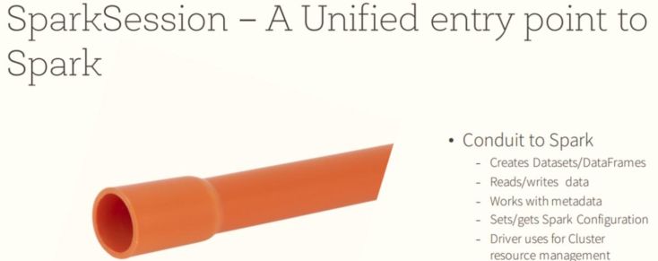

# Spark SQL基础入门

## Hive SQL实现词频统计


## I. 快速入门

### 1. SparkSession应用入口

> Spark 2.0开始，应用程序入口为`SparkSession`，加载不同数据源的数据，封装到`DataFrame`集合数据结构中，使得编程更加简单，程序运行更加快速高效。



```ini
# 1、SparkSession
	程序入口，加载数据
	底层SparkContext，进行封装

# 2、DataFrame
	数据结构，从Spark 1.3开始出现，一直到2.0版本，确定下来
	底层RDD，加上Schema约束（元数据）：字段名称和字段类型
		DataFrame = RDD[Row] + Schema
```

> `SparkSession`对象实例通过==建造者模式==构建，代码如下：


> 案例代码演示：`01_test_session.py`，构建SparkSession实例，加载文本数据，统计条目数。


```python
#!/usr/bin/env python
# -*- coding: utf-8 -*-

import os
from pyspark.sql import SparkSession


if __name__ == '__main__':
    """
    Spark 2.0开始，提供新程序入口：SparkSession，构建实例对象，底层依然是SparkContext。   
    """

    # 设置系统环境变量
    os.environ['JAVA_HOME'] = '/export/server/jdk'
    os.environ['HADOOP_HOME'] = '/export/server/hadoop'
    os.environ['PYSPARK_PYTHON'] = '/export/server/anaconda3/bin/python3'
    os.environ['PYSPARK_DRIVER_PYTHON'] = '/export/server/anaconda3/bin/python3'

    # 1. 获取会话实例对象-session
    spark = SparkSession.builder\
        .appName('SparkSession Test')\
        .master('local[2]')\
        .getOrCreate()
    print(spark)

    # 2. 加载数据源-source
    dataframe = spark.read.text('../datas/words.txt')

    # 3. 数据转换处理-transformation

    # 4. 处理结果输出-sink
    dataframe.show(n=10, truncate=False)

    # 5. 关闭会话实例对象-close
    spark.stop()

```

> 后续代码编写方便，编写PySpark代码模板，模板名称：`PySpark Linux SQL Script`

```python
#!/usr/bin/env python
# -*- coding: utf-8 -*-

import os
from pyspark.sql import SparkSession

if __name__ == '__main__':
    """
    
    """
    # 设置系统环境变量
    os.environ['JAVA_HOME'] = '/export/server/jdk'
    os.environ['HADOOP_HOME'] = '/export/server/hadoop'
    os.environ['PYSPARK_PYTHON'] = '/export/server/anaconda3/bin/python3'
    os.environ['PYSPARK_DRIVER_PYTHON'] = '/export/server/anaconda3/bin/python3'

    # 1. 获取会话实例-session
    spark = SparkSession.builder \
        .appName("Python SparkSQL Example") \
        .master("local[2]") \
        .getOrCreate()

    # 2. 加载数据源-source

    # 3. 数据转换处理-transformation

    # 4. 处理结果输出-sink

    # 5. 关闭会话对象-close
    spark.stop()

```

### 2. 基于SQL词频统计


### 3. 基于DSL词频统计


### 4. SparkSQL模块概述


## II. DataFrame

### 1. DataFrame是什么


### 2. 自动推断类型转换DataFrame


### 3. 自定义Schema转换DataFrame


### 4. 指定列名称toDF转换DataFrame


## III. Top10电影分析

### 1. 业务需求分析


### 2. 封装数据DataFrame


### 3. 基于SQL分析


### 4. 关联电影数据

