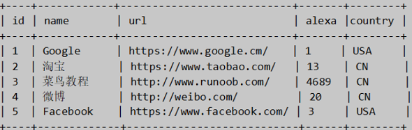
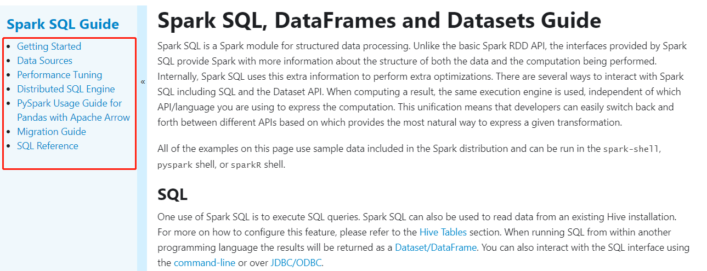

# Spark SQL基础入门

## Hive SQL实现词频统计


## I. 快速入门

### 1. SparkSession应用入口

> Spark 2.0开始，应用程序入口为`SparkSession`，加载不同数据源的数据，封装到`DataFrame`集合数据结构中，使得编程更加简单，程序运行更加快速高效。


```ini
# 1、SparkSession
	程序入口，加载数据
	底层SparkContext，进行封装

# 2、DataFrame
	数据结构，从Spark 1.3开始出现，一直到2.0版本，确定下来
	底层RDD，加上Schema约束（元数据）：字段名称和字段类型
		DataFrame = RDD[Row] + Schema
```

> `SparkSession`对象实例通过==建造者模式==构建，代码如下：


> 案例代码演示：`01_test_session.py`，构建SparkSession实例，加载文本数据，统计条目数。


```python
#!/usr/bin/env python
# -*- coding: utf-8 -*-

import os
from pyspark.sql import SparkSession


if __name__ == '__main__':
    """
    Spark 2.0开始，提供新程序入口：SparkSession，构建实例对象，底层依然是SparkContext。   
    """

    # 设置系统环境变量
    os.environ['JAVA_HOME'] = '/export/server/jdk'
    os.environ['HADOOP_HOME'] = '/export/server/hadoop'
    os.environ['PYSPARK_PYTHON'] = '/export/server/anaconda3/bin/python3'
    os.environ['PYSPARK_DRIVER_PYTHON'] = '/export/server/anaconda3/bin/python3'

    # 1. 获取会话实例对象-session
    spark = SparkSession.builder\
        .appName('SparkSession Test')\
        .master('local[2]')\
        .getOrCreate()
    print(spark)

    # 2. 加载数据源-source
    dataframe = spark.read.text('../datas/words.txt')

    # 3. 数据转换处理-transformation

    # 4. 处理结果输出-sink
    dataframe.show(n=10, truncate=False)

    # 5. 关闭会话实例对象-close
    spark.stop()

```

> 后续代码编写方便，编写PySpark代码模板，模板名称：`PySpark Linux SQL Script`

```python
#!/usr/bin/env python
# -*- coding: utf-8 -*-

import os
from pyspark.sql import SparkSession

if __name__ == '__main__':
    """
    
    """
    # 设置系统环境变量
    os.environ['JAVA_HOME'] = '/export/server/jdk'
    os.environ['HADOOP_HOME'] = '/export/server/hadoop'
    os.environ['PYSPARK_PYTHON'] = '/export/server/anaconda3/bin/python3'
    os.environ['PYSPARK_DRIVER_PYTHON'] = '/export/server/anaconda3/bin/python3'

    # 1. 获取会话实例-session
    spark = SparkSession.builder \
        .appName("Python SparkSQL Example") \
        .master("local[2]") \
        .getOrCreate()

    # 2. 加载数据源-source

    # 3. 数据转换处理-transformation

    # 4. 处理结果输出-sink

    # 5. 关闭会话对象-close
    spark.stop()

```

### 2. 基于SQL词频统计

> 大数据框架经典案例：==词频统计WordCount，从文件读取数据，统计单词个数。==

.png)

> ==DataFrame== 数据结构相当于给RDD加上约束Schema，知道数据内部结构（字段名称、字段类型），提供两种方式分析处理数据`：DataFrame API（DSL编程）`和`SQL（类似HiveQL编程）`，下面以WordCount程序为例编程实现，体验DataFrame使用。

```SQL
-- 1. SQL 语法分析
SELECT .... FROM tbl_x GROUP BY x1 WHERE y1 = ? ORDER BY z1 LIMIT 10 ;

-- 2. DSL 语法分析
tblx.where(y1=?).groupBy(x1).select(...).orgerBy(z1).limit(10)

```

> 类似HiveQL词频统计，先分割每行数据为单词，再对单词分组group by，最后count统计，步骤如下：

- 第一步、构建SparkSession对象，加载文件数据；
- 第二步、将DataFrame/Dataset注册为临时视图；
- 第三步、编写SQL语句，使用SparkSession执行获取结果；
- 第四步、控制台打印结果数据和关闭SparkSession；

> 案例演示` 02_wordcount_sql.py`：加载文本数据，封装到DataFrame中，注册临时视图，编写SQL分析。

```python
#!/usr/bin/env python
# -*- coding: utf-8 -*-

import os
from pyspark.sql import SparkSession

if __name__ == '__main__':
    """
    使用SparkSQL实现词频统计WordCount，基于SQL语句实现。  
    """

    # 设置系统环境变量
    os.environ['JAVA_HOME'] = '/export/server/jdk'
    os.environ['HADOOP_HOME'] = '/export/server/hadoop'
    os.environ['PYSPARK_PYTHON'] = '/export/server/anaconda3/bin/python3'
    os.environ['PYSPARK_DRIVER_PYTHON'] = '/export/server/anaconda3/bin/python3'

    # 1. 获取会话实例对象-session
    spark = SparkSession.builder \
        .appName('SparkSession Test') \
        .master('local[2]') \
        .getOrCreate()

    # 2. 加载数据源-source
    input_df = spark.read.text('../datas/words.txt')
    # input_df.printSchema()
    # input_df.show(n=10, truncate=False)
    """
    root
        |-- value: string (nullable = true)
        
    +----------------------------------------+
    |value                                   |
    +----------------------------------------+
    |spark python spark hive spark hive      |
    |python spark hive spark python          |
    |mapreduce spark hadoop hdfs hadoop spark|
    |hive mapreduce                          |
    +----------------------------------------+
    """

    # 3. 数据转换处理-transformation
    """
        当使用SQL方式分析数据时，如下2个步骤：
        step1、注册DataFrame为临时视图view
        step2、编写SQL语句并执行
    """
    # step1、注册DataFrame为临时视图view
    input_df.createOrReplaceTempView('view_tmp_lines')
    # step2、编写SQL语句并执行
    output_df = spark.sql("""
        WITH tmp AS (
          select explode(split(value, ' ')) AS word from view_tmp_lines
        )
        SELECT word, COUNT(1) AS total FROM tmp GROUP BY word ORDER BY total DESC LIMIT 10
    """)

    # 4. 处理结果输出-sink
    output_df.printSchema()
    output_df.show(n=10, truncate=False)

    # 5. 关闭会话实例对象-close
    spark.stop()

```

上述程序运行的结果如下所示：


### 3. 基于DSL词频统计

> 以WordCount程序为例编程实现，体验DataFrame使用。**使用SparkSession加载文本数据，封装到DataFrame中，调用API函数处理分析数据**，编程步骤：

- 第一步、构建SparkSession实例对象，设置应用名称和运行本地模式；
- 第二步、读取HDFS上文本文件数据；
- 第三步、使用DSL（Dataset API），类似RDD API处理分析数据；
- 第四步、控制台打印结果数据和关闭SparkSession；

> 案例代码演示 `03_wordcount_dsl.py`：加载文本文件数据，封装到DataFrame中，直接调用SQL函数处理

```python
#!/usr/bin/env python
# -*- coding: utf-8 -*-

import os
from pyspark.sql import SparkSession
from pyspark.sql.functions import *

if __name__ == '__main__':
    """
    使用SparkSQL分析词频统计WordCount，基于DSL实现。  
    """

    # 设置系统环境变量
    os.environ['JAVA_HOME'] = '/export/server/jdk'
    os.environ['HADOOP_HOME'] = '/export/server/hadoop'
    os.environ['PYSPARK_PYTHON'] = '/export/server/anaconda3/bin/python3'
    os.environ['PYSPARK_DRIVER_PYTHON'] = '/export/server/anaconda3/bin/python3'

    # 1. 获取会话实例对象-session
    spark = SparkSession.builder \
        .appName('SparkSession Test') \
        .master('local[2]') \
        .getOrCreate()

    # 2. 加载数据源-source
    input_df = spark.read.text('../datas/words.txt')
    """
    root
        |-- value: string (nullable = true)

    +----------------------------------------+
    |value                                   |
    +----------------------------------------+
    |spark python spark hive spark hive      |
    |python spark hive spark python          |
    |mapreduce spark hadoop hdfs hadoop spark|
    |hive mapreduce                          |
    +----------------------------------------+
    """

    # 3. 数据转换处理-transformation
    """
        a. 分割单词，进行扁平化（使用explode）
        b. 按照单词分组，使用count函数统计个数
        c. 按照词频降序排序，获取前10个
    """
    output_df = input_df\
        .select(
            explode(split(col('value'), ' ')).alias('word')
        )\
        .groupBy(col('word'))\
        .agg(
            count(col('word')).alias('total')
        )\
        .orderBy(col('total').desc())\
        .limit(10)

    # 4. 处理结果输出-sink
    output_df.printSchema()
    output_df.show(n=10, truncate=False)

    # 5. 关闭会话实例对象-close
    spark.stop()

```

### 4. SparkSQL模块概述

> SparkSQL模块一直到Spark 2.0版本才算真正稳定，发挥其巨大功能，发展经历如下几个阶段。


```ini
# 1、Spark 1.0之前
	Shark = Hive + Spark
	将Hive框架源码，修改其中转换SQL为MapReduce，变为转换RDD操作，称为Shark
	问题：维护成本太高，没有更多精力在于框架性能提升
		
# 2、Spark 1.0开始提出SparkSQL模块
	重新编写引擎Catalyst，将SQL解析为优化逻辑计划Logical Plan
	此时数据结构：SchemaRDD
	
# 3、Spark 1.3版本，SparkSQL成为Release版本
	数据结构：DataFrame，借鉴于Python和R中dataframe，DataFrame = RDD[Row] + Schema
	提供外部数据源接口：方便可以从任意外部数据源加载load和保存save数据

# 4、Spark 1.6版本，SparkSQL数据结构Dataset
	坊间流传，参考Flink中DataSet数据结构而来，Dataset = RDD + schema
	
# 5、Spark 2.0版本，DataFrame和Dataset何为一体
	Dataset = RDD + schema，DataFrame = Dataset[Row]
```

> Spark 2.x发布时，将Dataset和DataFrame统一为一套API，以Dataset数据结构为主（==Dataset= RDD + Schema==），其中`DataFrame = Dataset[Row]`。


```ini
# Spark 2.0版本中2个重要特性：
	第一、SparkSession新程序入口
	第二、数据结构统一：Dataset
		其中DataFrame = Dataset[Row]
```

> SparkSQL模块官方定义：`针对结构化数据处理Spark Module模块`，数据封装在DataFrame数据结构。


> 主要包含三层含义：


- 第一、针对结构化数据处理，属于Spark框架一个部分



- 第二、抽象数据结构：DataFrame

```ini
DataFrame = RDD[Row] + Schema（字段名称和字段类型）
```


- 第三、分布式SQL引擎，类似Hive框架

```ini
从Hive框架继承而来，Hive中提供bin/hive交互式SQL命令行及HiveServer2服务，SparkSQL都可以；
```

> Spark SQL是Spark用来处理结构化数据的一个模块，主要4个特性：


> 官方文档：https://spark.apache.org/docs/3.1.2/sql-programming-guide.html



## II. DataFrame

### 1. DataFrame是什么


### 2. 自动推断类型转换DataFrame


### 3. 自定义Schema转换DataFrame


### 4. 指定列名称toDF转换DataFrame


## III. Top10电影分析

### 1. 业务需求分析


### 2. 封装数据DataFrame


### 3. 基于SQL分析


### 4. 关联电影数据

