# SQL and DataFrames

## I. SparkSQL数据分析

### 1. SQL分析

> 基于SQL数据分析，将DataFrame注册为临时视图，编写SQL执行分析，分为两个步骤：

- **第一步、注册为临时视图**：`df.createOrReplaceTempView(view_name)`


- **第二步、编写SQL，执行分析**：`df = spark.sql()`


> 其中SQL语句类似Hive中SQL语句，查看Hive官方文档，SQL查询分析语句语法


官方文档：https://cwiki.apache.org/confluence/display/Hive/LanguageManual+Select

> **Iris 鸢尾花数据**集是一个经典数据集，在统计学习和机器学习领域都经常被用作示例。**数据集内包含 3 类共 150 条记录，每类各 50 个数据**，每条记录都有 4 项特征：==花萼（sepals）长度和宽度、花瓣（petals）长度和宽度==，可通过4个特征预测鸢尾花卉属于（**iris-setosa、iris-versicolour、iris-virginica**）中的哪一品种。


> [数据下载：http://archive.ics.uci.edu/ml/datasets/Iris]()


> **案例代码演示**： `01_dataframe_sql.py`：注册DataFrame为临时视图，编写SQL分析数据。

```python
#!/usr/bin/env python
# -*- coding: utf-8 -*-

import os
from pyspark.sql import SparkSession

if __name__ == '__main__':
    """
    加载鸢尾花数据集，使用SQL分析，基本聚合统计操作
    """

    # 设置系统环境变量
    os.environ['JAVA_HOME'] = '/export/server/jdk'
    os.environ['HADOOP_HOME'] = '/export/server/hadoop'
    os.environ['PYSPARK_PYTHON'] = '/export/server/anaconda3/bin/python3'
    os.environ['PYSPARK_DRIVER_PYTHON'] = '/export/server/anaconda3/bin/python3'

    # 1. 获取会话实例对象-session
    spark = SparkSession.builder \
        .appName('SparkSession Test') \
        .master('local[2]') \
        .getOrCreate()

    # 2. 加载数据源-source
    iris_rdd = spark.sparkContext.textFile('../datas/iris/iris.data')

    # 3. 数据转换处理-transformation
    """
        采用toDF函数方式，转换RDD为DataFrame，此时要求RDD中数据类型：元组Tuple
    """
    tuple_rdd = iris_rdd\
        .map(lambda line: str(line).split(','))\
        .map(lambda list: (float(list[0]), float(list[1]), float(list[2]), float(list[3]), list[4]))
    # 调用toDF函数，指定列名称
    iris_df = tuple_rdd.toDF(['sepal_length', 'sepal_width', 'petal_length', 'petal_width', 'category'])
    # iris_df.printSchema()
    # iris_df.show(n=10, truncate=False)

    # 第1步、注册DataFrame为临时视图
    iris_df.createOrReplaceTempView('view_tmp_iris')
    # 第2步、编写SQL语句并执行
    result_df = spark.sql("""
        SELECT   
          category,
          COUNT(1) AS total,
          ROUND(AVG(sepal_length), 2) AS sepal_length_avg,
          ROUND(AVG(sepal_width), 2) AS sepal_width_avg,
          ROUND(AVG(petal_length), 2) AS petal_length_avg,
          ROUND(AVG(petal_width), 2) AS petal_width_avg
        FROM view_tmp_iris GROUP BY category
    """)

    # 4. 处理结果输出-sink
    result_df.printSchema()
    result_df.show()

    # 5. 关闭会话实例对象-close
    spark.stop()

```

程序运行结果：


### 2. DSL分析之API函数

> 调用==DataFrame API（函数）==分析数据，其中函数包含**RDD 函数**和类似**SQL函数**。

- 第一、**类似RDD 算子**，比如count、cache、foreach、collect等，但是**没有map和mapPartitions算子**


[其中，可以从DataFrame数据集中获取列名称：`columns`、Schema信息：`schema`和RDD数据：`rdd`]()

> DataFrame中函数使用演示，说明如下：

- 第一、在PyCharm中开发，方便查看函数的使用说明
- 第二、启动`pyspark shell` 命令行，即使执行命令，查看结果

```bash
(base) [root@node1 ~]# /export/server/spark-local/bin/pyspark \
--master local[2] \
--conf spark.sql.shuffle.partitions=2
```

> **案例代码演示**： `02_dataframe_dsl.py`：加载json格式数据，调用类似RDD算子函数。

```python
#!/usr/bin/env python
# -*- coding: utf-8 -*-

import os
from pyspark.sql import SparkSession
from pyspark import StorageLevel

if __name__ == '__main__':
    """
    加载JSON格式数据，封装到DataFrame中，使用DataFrame API进行操作（类似RDD 算子）  
    """

    # 设置系统环境变量
    os.environ['JAVA_HOME'] = '/export/server/jdk'
    os.environ['HADOOP_HOME'] = '/export/server/hadoop'
    os.environ['PYSPARK_PYTHON'] = '/export/server/anaconda3/bin/python3'
    os.environ['PYSPARK_DRIVER_PYTHON'] = '/export/server/anaconda3/bin/python3'

    # 1. 获取会话实例对象-session
    spark = SparkSession.builder \
        .appName('SparkSession Test') \
        .master('local[2]') \
        .getOrCreate()

    # 2. 加载数据源-source
    emp_df = spark.read.json('hdfs://node1.itcast.cn:8020/datas/resources/employees.json')
    emp_df.printSchema()
    emp_df.show(n=10, truncate=False)

    # 3. 数据转换处理-transformation
    # TODO：count/collect/take/first/head/tail/
    emp_df.count()
    emp_df.collect()
    emp_df.take(2)
    emp_df.head()
    emp_df.first()
    emp_df.tail(2)

    # TODO: foreach/foreachPartition
    emp_df.foreach(lambda row: print(row))

    # TODO：coalesce/repartition
    emp_df.rdd.getNumPartitions()
    emp_df.coalesce(1).rdd.getNumPartitions()
    emp_df.repartition(3).rdd.getNumPartitions()

    # TODO：cache/persist
    emp_df.cache()
    emp_df.unpersist()
    emp_df.persist(storageLevel=StorageLevel.MEMORY_AND_DISK)

    # TODO: columns/schema/rdd/printSchema
    emp_df.columns
    emp_df.schema
    emp_df.printSchema()

    # 5. 关闭会话实例对象-close
    spark.stop()

```

### 3. DSL分析之SQL函数

> 调用==DataFrame API（函数）==分析数据，其中函数包含**RDD 函数**和类似**SQL函数**。

- **第二、类似SQL函数算子**，比如select、groupBy、orderBy、limit等等


```python
# 1、选择函数select：选取某些列的值
	def select(self, *cols: Union[Column, str]) -> DataFrame
	
# 2、过滤函数filter/where：设置过滤条件，类似SQL中WHERE语句
	def filter(self, condition: Union[Column, str]) -> DataFrame
	
# 3、分组函数groupBy/rollup/cube：对某些字段分组，在进行聚合统计
	def groupBy(self, *cols: Union[Column, str]) -> GroupedData

# 4、聚合函数agg：通常与分组函数连用，使用一些count、max、sum等聚合函数操作
	def agg(self, *exprs: Union[Column, Dict[str, str]]) -> DataFrame
    
# 5、排序函数sort/orderBy：按照某写列的值进行排序（升序ASC或者降序DESC）
	def sort(self,
         *cols: Union[str, Column, List[Union[str, Column]]],
         ascending: Union[bool, List[bool]] = ...) -> DataFrame

# 6、限制函数limit：获取前几条数据，类似RDD中take函数
	def limit(self, num: int) -> DataFrame
    
# 7、重命名函数withColumnRenamed：将某列的名称重新命名
	def withColumnRenamed(self, existing: str, new: str) -> DataFrame
    
# 8、删除函数drop：删除某些列
	def drop(self, cols: Union[Column, str]) -> DataFrame

# 9、增加列函数withColumn：当某列存在时替换值，不存在时添加此列
	def withColumn(self, colName: str, col: Column) -> DataFrame
```

> ​		上述SQL函数调用时，通常**指定某个列名称，传递`Column`对象**，使用`col`或`column`内置函数，转换String字符串为Column对象。

```python
# 导入库
from pyspark.sql.functions import col, column

# 转换字符串列名称为Column对象
col('name')
column('name')
```

> **案例代码演示**： `03_top10_movies_dsl.py`，调用DataFrame中函数，采用链式编程分析数据。

```python
#!/usr/bin/env python
# -*- coding: utf-8 -*-

import os
import time
from pyspark.sql import SparkSession
import pyspark.sql.functions as F

if __name__ == '__main__':
    """
    Top10 电影分析（电影评分最高10个，并且每个电影评分人数大于2000）  
    """

    # 设置系统环境变量
    os.environ['JAVA_HOME'] = '/export/server/jdk'
    os.environ['HADOOP_HOME'] = '/export/server/hadoop'
    os.environ['PYSPARK_PYTHON'] = '/export/server/anaconda3/bin/python3'
    os.environ['PYSPARK_DRIVER_PYTHON'] = '/export/server/anaconda3/bin/python3'

    # 1. 获取会话实例对象-session
    spark = SparkSession.builder \
        .appName('SparkSession Test') \
        .master('local[4]') \
        .config('spark.sql.shuffle.partitions', '4')\
        .getOrCreate()

    # 2. 加载数据源-source
    rating_rdd = spark.sparkContext.textFile("../datas/ml-1m/ratings.dat")
    # print('count:', rating_rdd.count())
    # print(rating_rdd.first())

    # 3. 数据转换处理-transformation
    """
        数据格式：
            1::1193::5::978300760
        转换DataFrame：
            采用toDF函数指定列名称
    """
    # 3-1. 将RDD数据封装转换为DataFrame数据集
    rating_df = rating_rdd\
        .map(lambda line: str(line).split('::'))\
        .map(lambda list: (list[0], list[1], float(list[2]), int(list[3])))\
        .toDF(['user_id', 'item_id', 'rating', 'timestamp'])
    # rating_df.printSchema()
    # rating_df.show(10, truncate=False)

    # 3-2. 基于DSL方式分析数据，调用DataFrame函数（尤其是SQL函数）
    """
        Top10电影：电影评分人数>2000, 电影平均评分降序排序，再按照电影评分人数降序排序
        a. 按照电影进行分组：groupBy
        b. 每个电影数据聚合：agg
            count、avg
        c. 过滤电影评分人数：where/filter
        d. 评分和人数降序排序：orderBy/sortBy
        e. 前10条数据：limit
    """
    top10_movie_df = rating_df\
        .groupBy(F.col('item_id'))\
        .agg(
            F.count(F.col('item_id')).alias('rating_total'),
            F.round(F.avg(F.col('rating')), 2).alias('rating_avg')
        )\
        .where(F.col('rating_total') > 2000)\
        .orderBy(
            F.col('rating_avg').desc(), F.col('rating_total').desc()
        )\
        .limit(10)
    # top10_movie_df.printSchema()
    # top10_movie_df.show(n=10, truncate=False)

    # 3-3. 加载电影基本信息数据
    movie_df = spark.sparkContext \
        .textFile('../datas/ml-1m/movies.dat') \
        .map(lambda line: str(line).split('::')) \
        .toDF(['movie_id', 'title', 'genres'])
    # movie_df.printSchema()
    # movie_df.show(n=10, truncate=False)

    # 3-4. 将Top10电影与电影基本信息数据进行JOIN，采用DSL
    result_df = top10_movie_df\
        .join(
            movie_df,
            on=F.col('item_id')==F.col('movie_id'),
            how='inner'
        )\
        .select(
            F.col('title'), F.col('rating_avg').alias('rating'), F.col('rating_total').alias('total')
        )

    # 4. 处理结果输出-sink
    result_df.printSchema()
    result_df.show(10, truncate=False)

    # 5. 关闭会话实例对象-close
    spark.stop()

```

### 4. Catalyst优化器

> 在前面案例【电影数据分析】中，运行应用程序代码，通过WEB UI界面监控可以看出，无论使用DSL还是SQL，构建Job的DAG图一样的，性能是一样的，原因在于SparkSQL中引擎：
> ​[Catalyst：将SQL和DSL转换为相同逻辑计划(LogicalPlan)]()


> Spark SQL的核心是**Catalyst优化器**，==对 SQL 或者DSL 代码解析生成逻辑计划，对逻辑计划进行优化==的查询优化器。


```ini
# 上述图中，可以看出SparkSQL模块：
	第一、【紫色部分】Catalyst 引擎（优化器）
		将SQL或DSL转换逻辑计划Logical Plan
	
	第二、【红色部分】代码生成器CodeGenarator
		将逻辑计划转换为物理计划（Physical Plan）-> RDD Transformations转换操作
```

> 大数据中SQL工具框架：Hive、Presto、SparkSQL等等，执行SQL时，流程如下所示：


> `SparkSQL Catalyst` 运作原理：**对 SQL 或者DSL 代码解析生成逻辑计划，对逻辑计划进行优化**。


- 1）、SQL语句首先通过**Parser**模块被解析为语法树，此棵树称为`Unresolved Logical Plan`；
- 2）、`Unresolved Logical Plan`通过**Analyzer**模块借助于数据元数据解析为`Logical Plan`；
- 3）、此时再通过各种基于规则Rule的**Optimizer**进行深入优化，得到`Optimized Logical Plan`；
- 4）、优化后的逻辑执行计划依然是逻辑的，需要将逻辑计划转化为`Physical Plan`。

```SQL
explain SELECT * FROM bd_hive.emp WHERE sal > 2000 ;
```


> SparkSQL 内部底层核心，有2种优化：RBO 优化和CBO优化。
>
> - 基于规则优化/Rule Based Optimizer/`RBO`；
> - 基于代价优化/Cost Based Optimizer/`CBO`；


## II. 外部数据源

### 1. 加载load和保存save

> 在SparkSQL模块，提供一套完成API接口，用于方便读写外部数据源的的数据（从`Spark 1.3`版本提供），框架本身内置外部数据源：


> 从MySQL表中既可以`加载读取数据：load/read`，又可以`保存写入数据：save/write`。


- **load** 加载数据

> 在SparkSQL中读取数据使用`SparkSession`读取，并且封装到数据结构`DataFrame`中，基本格式如下：


> SparkSQL模块本身自带支持读取外部数据源的数据：

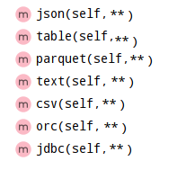

- **save** 保存数据

> SparkSQL模块中可以从某个外部数据源读取数据，就能向其保存数据，提供相应接口，基本格式如下：


> SparkSQL模块内部支持保存数据源如下：

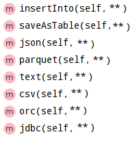

> DataFrame数据保存时有一个`mode`方法，指定保存模式：


- 1、Append 追加模式，当数据存在时，继续追加；
- 2、Overwrite 覆写模式，当数据存在时，覆写以前数据，存储当前最新数据；
- 3、ErrorIfExists 存在及报错；
- 4、Ignore 忽略，数据存在时不做任何操作；

> **案例代码演示**`04_datasource_basic.py`：从本地文件系统加载JSON格式数据，保存为Parquet格式

```python
#!/usr/bin/env python
# -*- coding: utf-8 -*-

import os
from pyspark.sql import SparkSession

if __name__ == '__main__':
    """
    SparkSQL 提供一套外部数据源接口，方便用户读取数据和写入数据，采用一定格式。  
    """

    # 设置系统环境变量
    os.environ['JAVA_HOME'] = '/export/server/jdk'
    os.environ['HADOOP_HOME'] = '/export/server/hadoop'
    os.environ['PYSPARK_PYTHON'] = '/export/server/anaconda3/bin/python3'
    os.environ['PYSPARK_DRIVER_PYTHON'] = '/export/server/anaconda3/bin/python3'

    # 1. 获取会话实例对象-session
    spark = SparkSession.builder \
        .appName('SparkSession Test') \
        .master('local[2]') \
        .getOrCreate()

    # 2. 加载数据源-source
    # TODO： 第1、加载JSON格式数据
    json_df = spark.read\
        .format('json')\
        .option('path', '../datas/resources/employees.json')\
        .load()
    # json_df.printSchema()
    # json_df.show()

    # 4. 处理结果输出-sink
    # TODO: 第2、保存Parquet格式数据
    json_df.write\
        .mode('overwrite')\
        .format('parquet')\
        .option('path', '../datas/resources/emp-parquet')\
        .save()

    # 5. 关闭会话实例对象-close
    spark.stop()

```

### 2. text文本文件

> SparkSQL模块内置：文本文件text数据的加载load和保存save，方便用户使用。

- **load**：加载数据， `spark.read.text()`


- **save**：保存数据，`dataframe.write.text()`

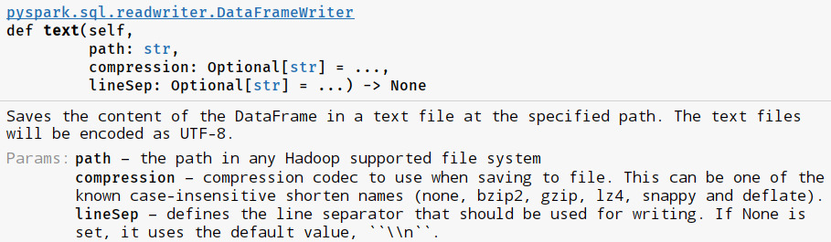

> **案例代码演示**： `05_datasource_text.py`：加载文本数据和保存数据到文本文件中

```python
#!/usr/bin/env python
# -*- coding: utf-8 -*-

import os
from pyspark.sql import SparkSession

if __name__ == '__main__':
    """
    SparkSQL内置外部数据源：text，加载load和保存save案例演示  
    """

    # 设置系统环境变量
    os.environ['JAVA_HOME'] = '/export/server/jdk'
    os.environ['HADOOP_HOME'] = '/export/server/hadoop'
    os.environ['PYSPARK_PYTHON'] = '/export/server/anaconda3/bin/python3'
    os.environ['PYSPARK_DRIVER_PYTHON'] = '/export/server/anaconda3/bin/python3'

    # 1. 获取会话实例对象-session
    spark = SparkSession.builder \
        .appName('SparkSession Test') \
        .master('local[2]') \
        .getOrCreate()

    # 2. 加载数据源-source
    dataframe = spark.read.text('../datas/resources/people.txt')
    dataframe.printSchema()
    dataframe.show(truncate=False)

    # 3. 数据转换处理-transformation

    # 4. 处理结果输出-sink
    dataframe.write.mode('overwrite').text('../datas/save-text')

    # 5. 关闭会话实例对象-close
    spark.stop()

```

### 3. json文本文件

> SparkSQL模块内置：加载json文本数据和保存数据为json格式。

- **load**：加载数据，`spark.read.json()`


- **save**：保存数据，`dataframe.write.json()`


> **案例代码演示**： `06_datasource_json.py`：加载文本JSON格式数据，并保存

```python
#!/usr/bin/env python
# -*- coding: utf-8 -*-

import os
from pyspark.sql import SparkSession

if __name__ == '__main__':
    """
    SparkSQL内置数据源，加载json数据和保存数据为json格式。  
    """

    # 设置系统环境变量
    os.environ['JAVA_HOME'] = '/export/server/jdk'
    os.environ['HADOOP_HOME'] = '/export/server/hadoop'
    os.environ['PYSPARK_PYTHON'] = '/export/server/anaconda3/bin/python3'
    os.environ['PYSPARK_DRIVER_PYTHON'] = '/export/server/anaconda3/bin/python3'

    # 1. 获取会话实例对象-session
    spark = SparkSession.builder \
        .appName('SparkSession Test') \
        .master('local[2]') \
        .getOrCreate()

    # 2. 加载数据源-source
    json_df = spark.read.json('../datas/resources/people.json')
    # json_df.printSchema()
    # json_df.show()

    # 3. 数据转换处理-transformation

    # 4. 处理结果输出-sink
    json_df.coalesce(1).write.mode('overwrite').json('../datas/save-json')

    # 5. 关闭会话实例对象-close
    spark.stop()

```

### 4. parquet列式存储


### 5. csv文本文件


### 6. jdbc数据库

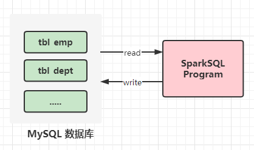

> SparkSQL模块内置：`jdbc` 方法，可以从常见RDBMS数据库中加载数据和保存数据。

- **load**：加载数据，`spark.read.jdbc()`


- **save**：保存数据，`dataframe.write.jdbc()`


> 向MySQL数据库写入数据时，需要将**MySQL JCBC 驱动包**放入到`pyspark`库安装目录`jars`下。

- 远程Python解析器，Linux系统开发测试，目录：`ANACONDA_HOME/lib/python3.8/site-packages/pyspark/jars`

```ini
# 进入目录
cd /export/server/anaconda3/lib/python3.8/site-packages/pyspark/jars

# 上传jar包：mysql-connector-java-5.1.32.jar
rz

```

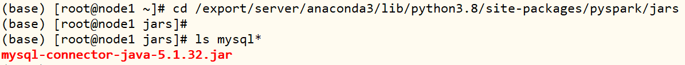

- Window系统开发测试，目录：`ANACONDA_HOME/Lib/site-packages/pyspark/jars`，如下图：


> 保存数据至MySQL数据库，表的创建语句

```SQL
 CREATE TABLE db_company.emp_v2 (
  `empno` int(11) NOT NULL,
  `ename` varchar(10) DEFAULT NULL,
  `job` varchar(9) DEFAULT NULL,
  `sal` double DEFAULT NULL,
  `deptno` int(11) DEFAULT NULL,
  PRIMARY KEY (`empno`)
) ENGINE=InnoDB DEFAULT CHARSET=utf8 ;
```

> **案例代码演示**： `09_datasource_jdbc.py`：加载数据库表数据，选择字段后，再次保存数据库表中

```python
#!/usr/bin/env python
# -*- coding: utf-8 -*-

import os
from pyspark.sql import SparkSession

if __name__ == '__main__':
    """
    SparkSQL 内置数据源，对MySQL数据库数据进行加载和保存。  
    """

    # 设置系统环境变量
    os.environ['JAVA_HOME'] = '/export/server/jdk'
    os.environ['HADOOP_HOME'] = '/export/server/hadoop'
    os.environ['PYSPARK_PYTHON'] = '/export/server/anaconda3/bin/python3'
    os.environ['PYSPARK_DRIVER_PYTHON'] = '/export/server/anaconda3/bin/python3'

    # 1. 获取会话实例对象-session
    spark = SparkSession.builder \
        .appName('SparkSession Test') \
        .master('local[2]') \
        .getOrCreate()

    # 2. 加载数据源-source
    props = { 'user': 'root', 'password': '123456', 'driver': 'com.mysql.jdbc.Driver'}
    jdbc_df = spark.read.jdbc(
        'jdbc:mysql://node1.itcast.cn:3306/?serverTimezone=UTC&characterEncoding=utf8&useUnicode=true',
        'db_company.emp',
        properties=props
    )
    jdbc_df.printSchema()
    jdbc_df.show(n=20, truncate=False)

    # 3. 数据转换处理-transformation
    dataframe = jdbc_df.select('empno', 'ename', 'job', 'sal', 'deptno')

    # 4. 处理结果输出-sink
    dataframe.coalesce(1).write.mode('append').jdbc(
        'jdbc:mysql://node1.itcast.cn:3306/?serverTimezone=UTC&characterEncoding=utf8&useUnicode=true',
        'db_company.emp_v2',
        properties=props
    )

    # 5. 关闭会话实例对象-close
    spark.stop()

```

### 7. hive表

> Spark SQL模块从发展来说**，从Apache Hive框架而来**，发展历程：==Hive（MapReduce）-> Shark(Hive on Spark) -> Spark SQL（SchemaRDD -> DataFrame -> Dataset)==，所以SparkSQL天然无缝集成Hive，可以加载Hive表数据进行分析。

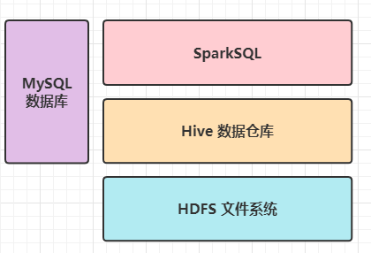

- 第一步、当编译Spark源码时，需要指定集成Hive，命令如下


- 第二步、SparkSQL集成Hive本质就是：[读取Hive框架元数据MetaStore]()，此处启动Hive MetaStore服务即可。

```bash
# 启动HDFS服务：NameNode和DataNodes
(base) [root@node1 ~]# start-dfs.sh 

# 启动HiveMetaStore 服务
(base) [root@node1 ~]# start-metastore.sh 
```

- 第三步、连接HiveMetaStore服务配置文件`hive-site.xml`，放于【`$SPARK_HOME/conf`】目录

  - 创建hive-site.xml文件

  ```ini
  [root@node1 ~]# cd /export/server/spark-local/conf
  [root@node1 conf]# touch hive-site.xml
  
  [root@node1 conf]# vim hive-site.xml
  ```

  - 添加如下内容：

  ```xml
  <?xml version="1.0"?>
  <?xml-stylesheet type="text/xsl" href="configuration.xsl"?>
  <configuration>
      <property>
          <name>hive.metastore.uris</name>
          <value>thrift://node1.itcast.cn:9083</value>
      </property>
  </configuration>
  ```

- 第四步、案例演示，读取Hive中`db_hive.emp`表数据，分析数据

```bash
(base) [root@node1 ~]# jps
4338 RunJar
4549 Jps
3178 NameNode
4252 DataNode

(base) [root@node1 ~]# /export/server/spark-local/bin/pyspark --master local[2] --conf spark.sql.shuffle.partitions=2    

>>> spark.sql("show databases").show()
>>> spark.sql("show tables in db_hive") .show()
>>> emp_df = spark.sql("select * from db_hive.emp").show()

>>> spark.sql("select e.ename, e.sal, d.dname from db_hive.emp e join db_hive.dept d on e.deptno = d.deptno").show()

>>> df = spark.read.table("db_hive.emp")
>>> df.printSchema()
>>> df.show(15)

```

> 将DataFrame数据保存到表中时，使用方法：`saveAsTable`


```bash
# 当向Hive表保存数据，注意HDFS用户权限，可以设置 /user/hive/warehouse 为 777
hdfs dfs -chmod 777 /user/hive/warehouse/db_hive.db
```

> 在PyCharm中开发应用，集成Hive，读取表的数据进行分析，**构建SparkSession时需要设置HiveMetaStore服务器地址**及**集成Hive选项**。


> **案例代码演示**： `10_datasource_hive`：从Hive表加载数据，并且将数据保存到Hive表。

```python
#!/usr/bin/env python
# -*- coding: utf-8 -*-

import os
from pyspark.sql import SparkSession

if __name__ == '__main__':
    """
    SparkSQL 内置数据源：Hive，从其中加载load数据，和保存数据save。  
    """

    # 设置系统环境变量
    os.environ['JAVA_HOME'] = '/export/server/jdk'
    os.environ['HADOOP_HOME'] = '/export/server/hadoop'
    os.environ['PYSPARK_PYTHON'] = '/export/server/anaconda3/bin/python3'
    os.environ['PYSPARK_DRIVER_PYTHON'] = '/export/server/anaconda3/bin/python3'

    # 1. 获取会话实例对象-session
    spark = SparkSession.builder \
        .appName('SparkSession Test') \
        .master('local[2]') \
        .config("spark.sql.warehouse.dir", 'hdfs://node1.itcast.cn:8020/user/hive/warehouse') \
        .config('hive.metastore.uris', 'thrift://node1.itcast.cn:9083') \
        .enableHiveSupport()\
        .getOrCreate()

    # 2. 加载数据源-source
    emp_df = spark.read.format('hive').table('db_hive.emp')
    emp_df.printSchema()
    emp_df.show(n=20, truncate=False)

    # 3. 数据转换处理-transformation

    # 4. 处理结果输出-sink
    emp_df.coalesce(1)\
        .write\
        .format('hive')\
        .mode('append')\
        .saveAsTable('db_hive.emp_v2')

    # 5. 关闭会话实例对象-close
    spark.stop()

```

## III. 分布式SQL引擎

### 1. spark-sql命令行

> 回顾一下，==如何使用Hive进行数据分析的，提供哪些方式交互分析？==


> 在Hive实际项目使用中，启动`HiveMetaStore`服务，用于连接数据库，加载元数据；此外，启动`HiveServer2`服务，提供beeline和JDBC/ODBC方式连接，接收SQL，并行转换提交执行。

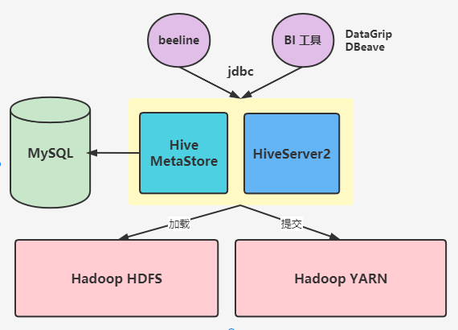

SparkSQL模块从Hive框架衍生发展而来，所以Hive提供的所有功能（数据分析交互式方式）都支持，官方文档：https://spark.apache.org/docs/3.1.2/sql-distributed-sql-engine.html。

> SparkSQL提供`spark-sql`命令，类似Hive中`bin/hive`命令，专门编写SQL分析，按照如下步骤演示。

```bash
# 1、启动HDFS服务：NameNode和DataNodes
(base) [root@node1 ~]# start-dfs.sh

# 2、启动HiveMetaStore 服务
(base) [root@node1 ~]# start-metastore.sh 

# 3、设置Spark日志级别
(base) [root@node1 ~]# cd /export/server/spark-local/conf/
(base) [root@node1 conf]# mv log4j.properties.template log4j.properties
(base) [root@node1 conf]# vim log4j.properties 
	修改INFO为WARN
		log4j.rootCategory=WARN, console

# 4、启动spark-sql命令行
(base) [root@node1 ~]# /export/server/spark-local/bin/spark-sql --master local[2] --conf spark.sql.shuffle.partitions=2
Spark master: local[2], Application Id: local-1632833742325
spark-sql> show databases ;
spark-sql> use db_hive ;
spark-sql> show tables ;
spark-sql> select * from db_hive.emp ;
```


> 此种方式，目前使用较少，主要使用`Spark Thrift JDBC/ODBC Server`服务，通过Beeline连接执行SQL。

### 2. Thrift Server服务

> **Spark Thrift  JDBC/ODBC Server**将==Spark Applicaiton当做一个服务运行==，提供Beeline客户端和JDBC方式访问，==与HiveServer2服务一样==的。


> 在实际项目中，往往使用**SparkSQL集成Hive**开发报表分析，使用==Hive管理元数据==，启动Spark Thrift JDBC/ODBC Server服务（运行在YARN集群上），通过beeline和BI 工具连接，发送SQL请求。

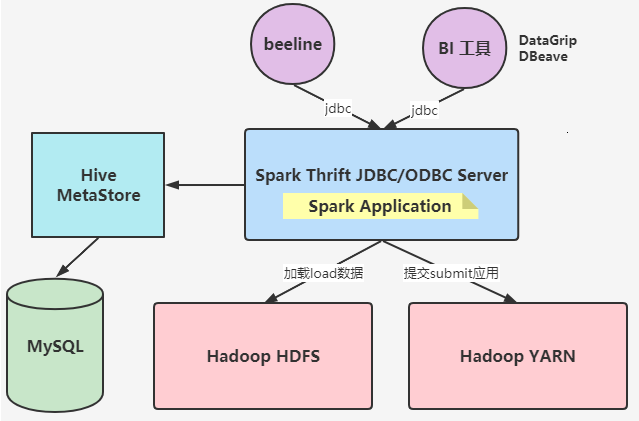

> [Spark Thrift JDBC/ODBC Server 依赖于HiveServer2服务（依赖JAR包]()），所以要想使用此功能，在编译Spark源码时，支持Hive ThriftServer。

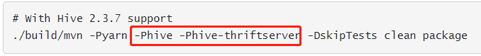

> 在`$SPARK_HOME`目录下的`sbin`目录，Thrift JDBC/ODBC Sever服务启动命令:

```bash
/export/server/spark-local/sbin/start-thriftserver.sh \
--hiveconf hive.server2.thrift.port=10000 \
--hiveconf hive.server2.thrift.bind.host=node1.itcast.cn \
--master local[2] \
--conf spark.sql.shuffle.partitions=2
```

> 监控WEB UI界面：http://node1.itcast.cn:4040/


> SparkSQL类似Hive提供`beeline`客户端命令行连接ThriftServer，启动命令如下：

```ini
(base) [root@node1 ~]# /export/server/spark-local/bin/beeline
	!connect jdbc:hive2://node1.itcast.cn:10000
	root
	123456
```


> 客户端beeline命令行，编写SQL语句执行，与Hive中beeline客户端完全一致，企业中常用一种方式。

```SQL
0: jdbc:hive2://node1.itcast.cn:10000> show databases ;

0: jdbc:hive2://node1.itcast.cn:10000> use db_hive ;

0: jdbc:hive2://node1.itcast.cn:10000> show tables ;

0: jdbc:hive2://node1.itcast.cn:10000> select * from emp ;

```

### 3. DataGrip JDBC连接

> 使用DataGrip或者PyCharm连接Spark Thrift JDBC/ODBC Server服务，创建步骤如下所示：

- 第1步、创建DataSource，选择【Apache Hive】。

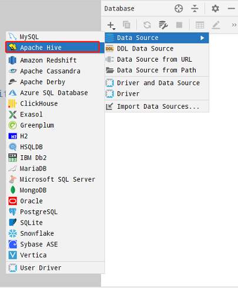

- 第2步、填写Server服务连接信息


- 第3步、打开连接，SQL编写界面


> 至此，配置完成，DataGrip或PyCharm（企业版）远程通过JDBC/ODBC方式连接Spark Thrift JDBC/ODC Server服务，可以编写SQL分析数据。

- 基本查询：`SELECT deptno, round(avg(sal), 2) AS avg_sal FROM db_hive.emp GROUP BY deptno ;`


- 各个部门工资最高人员信息：

```SQL
with tmp AS (
    SELECT empno, ename, sal, deptno,
           row_number() over (partition by deptno order by sal desc) AS rnk
    FROM db_hive.emp
)
SELECT t.empno, t.ename, t.sal, t.deptno FROM tmp t WHERE t.rnk = 1 ;
```

执行结果：


## 拓展内容

### 1. SQL开窗函数

> 开窗函数为了既**显示聚集前的数据，又显示聚集后的数据**。即在每一行的最后一列添加聚合函数的结果。

- 开窗函数与普通聚合函数的区别：

  - 与聚合函数一样，开窗函数也是**对行集组进行聚合计算**，可是它不像普通聚合函数那样每组仅仅返回一个值，**开窗函数能够为每组返回多个值**，由于开窗函数所运行聚合计算的行集组是窗体。

  

- 开窗函数对一组行进行操作，并为基础查询中的每一行返回一个值。  在查询中使用开窗函数时，请使用OVER()子句定义窗口，一个查询可以包含具有相同或不同窗口定义的多个开窗函数。 


> **排序开窗函数**：==给每个分组的数据，按照其排序顺序，打上一个分组内行号==


> **聚合开窗函数**：允许将所有聚合函数用做聚合开窗函数，加上OVER语句，给上窗口定义（数据的限制）

- 常使用聚合函数：最大max、最小min、平均值avg、总和sum、计数count等

> **分析开窗函数**：获取组内某个值（比如前N列值，第一列值等等）

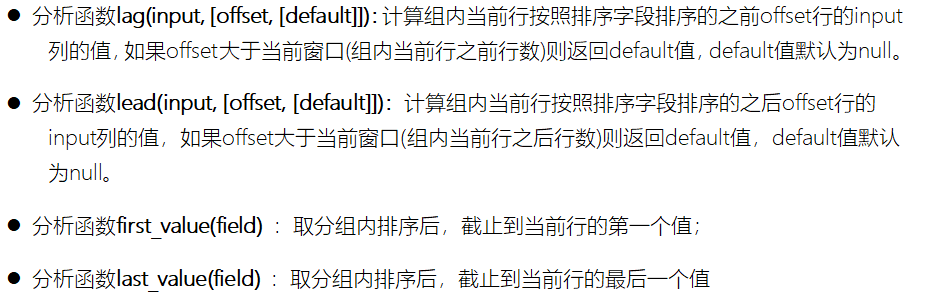

### 2. Top10电影分析升级版

> 基于MoviesLens电影评分数据，统计分析【每个电影**评分次数**、**平均评分**和**各个分值占比**】。


> 按照上述需求对电影评分数据分析处理，最终获取Top10电影，结果如下如所示：


> 基于SparkSQL中SQL方式实现，具体思路如下：

1. 加载csv文本数据，指定schema信息
2. 按照电影分组：`movie_id`
3. 组内聚合：`count`、`avg`、`sum`、 `if或case when`
4. 计算各个评分占比：`stars1_rating_people` / `rating_people`        
5. 过滤评分次数大于2000
6. 依据评分降序，获取前10

> 在PyCharm中创建Python Script脚本文件：`movies_top10_sql.py`，编写代码。

```python
#!/usr/bin/env python
# -*- coding: utf-8 -*-

import os
from pyspark.sql import SparkSession
from pyspark.sql.types import *


if __name__ == '__main__':
    """
    对电影评分数据进行统计分析，获取Top10电影:
        a. 每个电影被评分的次数大于2000
        b. 电影评分平均值最高
        c. 每个电影各个评分占比
        ["user_id", "movie_id", "rating", "timestamp"]
    """

    # 设置系统环境变量
    os.environ['JAVA_HOME'] = '/export/server/jdk'
    os.environ['HADOOP_HOME'] = '/export/server/hadoop'
    os.environ['PYSPARK_PYTHON'] = '/export/server/anaconda3/bin/python3'
    os.environ['PYSPARK_DRIVER_PYTHON'] = '/export/server/anaconda3/bin/python3'

    # 1. 获取会话实例-session
    spark = SparkSession.builder \
        .appName("Python SparkSQL Example") \
        .master("local[4]") \
        .config("spark.sql.shuffle.partitions", "4")\
        .getOrCreate()

    # 2. 加载数据源-source
   
    # 3. 数据转换处理-transformation
    
    # 4. 数据接收器-sink

    # 5. 关闭会话对象-close
    spark.stop()

```