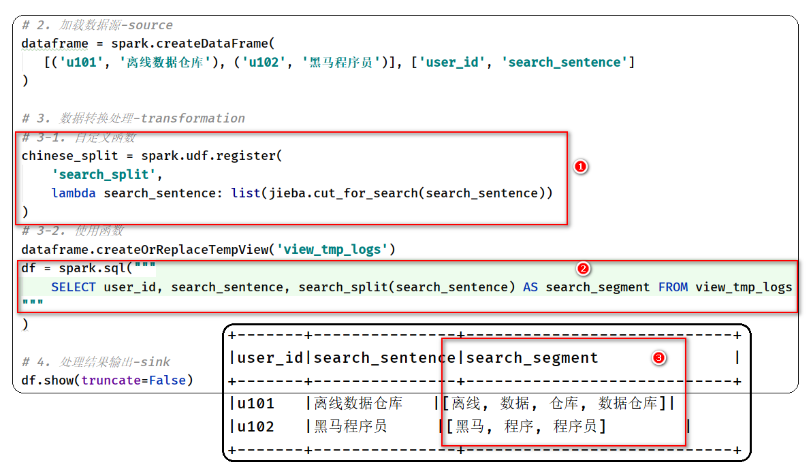

# UDF And Action

## I. 自定义函数

### 1. UDF函数

> 无论Hive还是SparkSQL分析处理数据时，往往需要使用函数，SparkSQL模块本身自带很多实现公共功能的函数，在`pyspark.sql.functions`中。
>
> 文档：https://spark.apache.org/docs/3.1.2/api/sql/index.html


```ini
# 第一类函数： 输入一条数据 -> 输出一条数据（1 -> 1）
    split 分割函数
    round 四舍五入函数

# 第二类函数： 输入多条数据 -> 输出一条数据 (N -> 1)
    count 计数函数
    sum 累加函数
    max/min 最大最小函数
    avg 平均值函数
# 第三类函数：输入一条数据 -> 输出多条数据  (1 -> N)
	explode 爆炸函数
```

[如果框架（如Hive、SparkSQL、Presto）提供函数，无法满足实际需求，提供自定义函数接口，只要实现即可。]()

```
默认split分词函数，不支持中文分词
	可以自定义函数，使用jieba进行分词
```



> 在SparkSQL中，目前仅仅支持==UDF函数==（**1对1关系**）和==UDAF函数==（**多对1关系**）：
>
> - ==UDF函数==：一对一关系，输入一条数据输出一条数据


> - ==UDAF函数==：聚合函数，多对一关系，输入多条数据输出一条数据，通常与**group by** 分组函数连用


> 在SparkSQL中，自定义UDF函数，有如下3种方式：


### 2. register注册定义


### 3. udf注册定义


### 4. pandas_udf注册定义


## II. 零售数据分析

### 1. 业务需求分析


### 2.  业务指标一


### 3. Top3省份数据


### 4. 业务指标二


### 5. 业务指标三


### 6. 业务指标四


### III. 其他知识

### 1. 与Pandas DataFrame相互转换


### 2. Jupyter Notebook开发PySpark


### 3. PySpark应用运行架构


## III. 在线教育数据分析

### 1. 业务需求分析


### 2. 需求一


### 3. 需求二


## 附录: Jupyter Notebook启动配置

