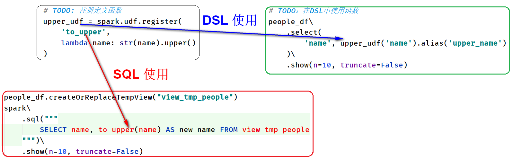
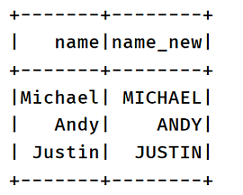
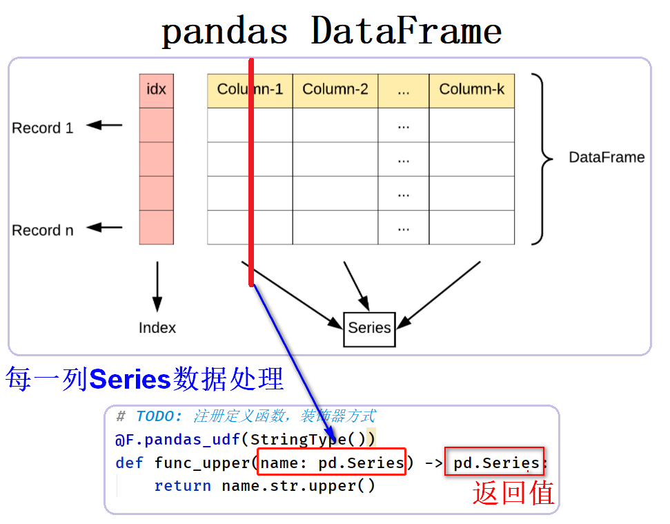
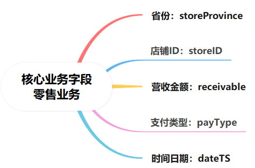
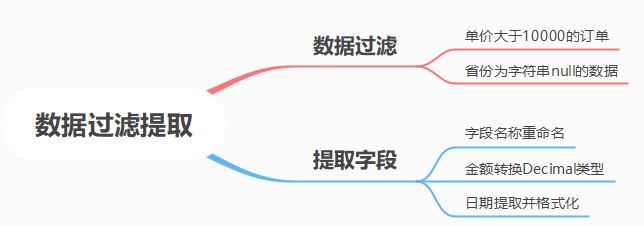
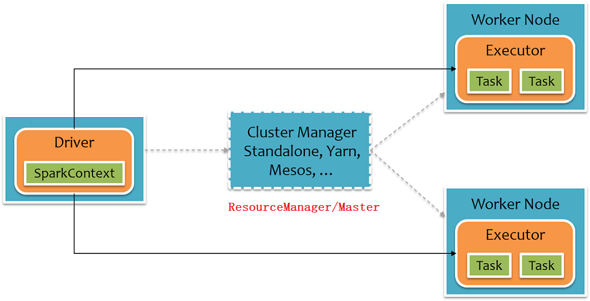
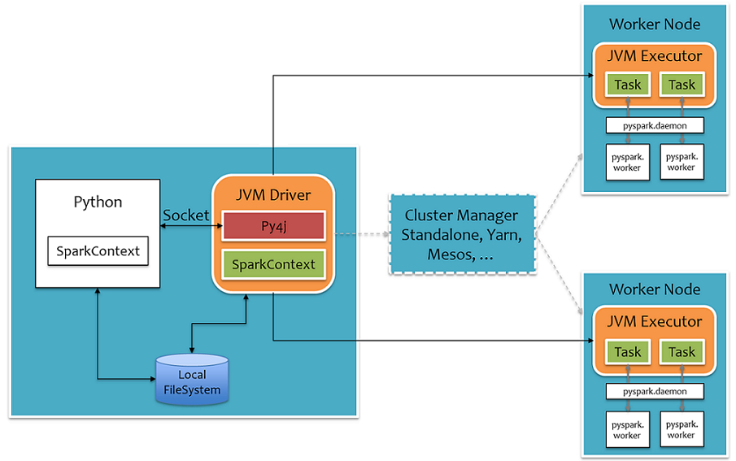
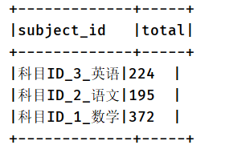

# UDF And Action

## I. 自定义函数

### 1. UDF函数

> 无论Hive还是SparkSQL分析处理数据时，往往需要使用函数，SparkSQL模块本身自带很多实现公共功能的函数，在`pyspark.sql.functions`中。
>
> 文档：https://spark.apache.org/docs/3.1.2/api/sql/index.html


```ini
# 第一类函数： 输入一条数据 -> 输出一条数据（1 -> 1）
    split 分割函数
    round 四舍五入函数

# 第二类函数： 输入多条数据 -> 输出一条数据 (N -> 1)
    count 计数函数
    sum 累加函数
    max/min 最大最小函数
    avg 平均值函数
# 第三类函数：输入一条数据 -> 输出多条数据  (1 -> N)
	explode 爆炸函数
```

[如果框架（如Hive、SparkSQL、Presto）提供函数，无法满足实际需求，提供自定义函数接口，只要实现即可。]()

```
默认split分词函数，不支持中文分词
	可以自定义函数，使用jieba进行分词
```


> 在SparkSQL中，目前仅仅支持==UDF函数==（**1对1关系**）和==UDAF函数==（**多对1关系**）：
>
> - ==UDF函数==：一对一关系，输入一条数据输出一条数据


> - ==UDAF函数==：聚合函数，多对一关系，输入多条数据输出一条数据，通常与**group by** 分组函数连用


> 在SparkSQL中，自定义UDF函数，有如下3种方式：


### 2. register注册定义

> SparkSQL中自定义UDF（1对1）函数，可以直接使用`spark.udf.register`注册和定义函数。


> **案例代码演示**： `01_udf_register.py`：自定义UDF函数，将字符串名称name，全部转换为大写。

```python
#!/usr/bin/env python
# -*- coding: utf-8 -*-

import os
from pyspark.sql import SparkSession
import pyspark.sql.functions as F


if __name__ == '__main__':
    """
    SparkSQL中自定义UDF函数，采用register方式注册定义函数  
    """

    # 设置系统环境变量
    os.environ['JAVA_HOME'] = '/export/server/jdk'
    os.environ['HADOOP_HOME'] = '/export/server/hadoop'
    os.environ['PYSPARK_PYTHON'] = '/export/server/anaconda3/bin/python3'
    os.environ['PYSPARK_DRIVER_PYTHON'] = '/export/server/anaconda3/bin/python3'

    # 1. 获取会话实例对象-session
    spark = SparkSession.builder \
        .appName('SparkSession Test') \
        .master('local[2]') \
        .getOrCreate()

    # 2. 加载数据源-source
    people_df = spark.read.json('../datas/resources/people.json')
    # people_df.printSchema()
    # people_df.show(n=10, truncate=False)

    # 3. 数据转换处理-transformation
    """
        将DataFrame数据集中name字段值转换为大写UpperCase
    """
    # TODO: 注册定义函数
    upper_udf = spark.udf.register(
        'to_upper',
        lambda name: str(name).upper()
    )

    # TODO：在SQL中使用函数
    people_df.createOrReplaceTempView("view_tmp_people")
    spark\
        .sql("""
            SELECT name, to_upper(name) AS new_name FROM view_tmp_people
        """)\
        .show(n=10, truncate=False)

    # TODO：在DSL中使用函数
    people_df\
        .select(
            'name', upper_udf('name').alias('upper_name')
        )\
        .show(n=10, truncate=False)

    # 4. 处理结果输出-sink

    # 5. 关闭会话实例对象-close
    spark.stop()

```

运行程序，执行UDF函数，结果如下：


> 采用register方式注册定义UDF函数，名称不同，使用地方不同。



### 3. udf注册定义

> SparkSQL中函数库`pyspark.sql.functions`中提供函数：`udf`，用来用户自定义函数。


> **案例代码演示**： `02_udf_function.py`：自定义UDF函数，将字符串名称name，全部转换为大写。

```python
#!/usr/bin/env python
# -*- coding: utf-8 -*-

import os
from pyspark.sql import SparkSession
from pyspark.sql.types import *
import pyspark.sql.functions as F

if __name__ == '__main__':
    """
    SparkSQL自定义UDF函数，采用udf函数方式注册定义，仅仅只能在DSL中使用。  
    """

    # 设置系统环境变量
    os.environ['JAVA_HOME'] = '/export/server/jdk'
    os.environ['HADOOP_HOME'] = '/export/server/hadoop'
    os.environ['PYSPARK_PYTHON'] = '/export/server/anaconda3/bin/python3'
    os.environ['PYSPARK_DRIVER_PYTHON'] = '/export/server/anaconda3/bin/python3'

    # 1. 获取会话实例对象-session
    spark = SparkSession.builder \
        .appName('SparkSession Test') \
        .master('local[2]') \
        .getOrCreate()

    # 2. 加载数据源-source
    people_df = spark.read.json('../datas/resources/people.json')
    # people_df.printSchema()
    # people_df.show(n=10, truncate=False)

    # 3. 数据转换处理-transformation
    """
        将DataFrame数据集中name字段值转换为大写UpperCase
    """
    # TODO: 注册定义函数，采用编程：封装函数
    upper_udf = F.udf(
        f=lambda name: str(name).upper(),
        returnType=StringType()
    )

    # 在DSL中使用
    people_df\
        .select(
            'name', upper_udf('name').alias('name_new')
        )\
        .show()

    # 4. 处理结果输出-sink

    # 5. 关闭会话实例对象-close
    spark.stop()

```

运行程序，执行UDF函数，结果如下：



### 4. pandas_udf注册定义

> 在Spark 2.3中提供函数：`pandas_udf()`，用于定义和注册UDF函数，底层使用**列存储和零复制技术**提高**数据传输效率**，在PySpark SQL中建议使用。


> 使用pandas_udf定义UDF函数，需要安装arrow库和启动Arrow技术。

- 第1步、安装arrow库

```ini
pip install pyspark[sql]==3.1.2 -i https://pypi.tuna.tsinghua.edu.cn/simple
```

- 第2步、设置属性参数，启动Arrow技术

```ini
spark.sql.execution.arrow.pyspark.enabled = true
```

> 函数：`pandas_udf` ，要求传递处理数据函数function中参数类型：`Series`，表示`某列数据`。



> 案例演示 `03_udf_pandas.py`：实现字符串类型name，转换为大写字面upper。

```python
#!/usr/bin/env python
# -*- coding: utf-8 -*-

import os
from pyspark.sql import SparkSession
from pyspark.sql.types import *
import pyspark.sql.functions as F
import pandas as pd

if __name__ == '__main__':
    """
    SparkSQL自定义UDF函数，采用pandas_udf函数方式注册定义，仅仅只能在DSL中使用，底层技术：列存储和零拷贝技术。
    """

    # 设置系统环境变量
    os.environ['JAVA_HOME'] = '/export/server/jdk'
    os.environ['HADOOP_HOME'] = '/export/server/hadoop'
    os.environ['PYSPARK_PYTHON'] = '/export/server/anaconda3/bin/python3'
    os.environ['PYSPARK_DRIVER_PYTHON'] = '/export/server/anaconda3/bin/python3'

    # 1. 获取会话实例对象-session
    spark = SparkSession.builder \
        .appName('SparkSession Test') \
        .master('local[2]') \
        .config('spark.sql.execution.arrow.pyspark.enabled', 'true')\
        .getOrCreate()

    # 2. 加载数据源-source
    people_df = spark.read.json('../datas/resources/people.json')
    # people_df.printSchema()
    people_df.show(n=10, truncate=False)

    # 3. 数据转换处理-transformation
    """
        将DataFrame数据集中name字段值转换为大写UpperCase
    """
    # TODO: 注册定义函数，装饰器方式
    @F.pandas_udf(StringType())
    def func_upper(name: pd.Series) -> pd.Series:
        return name.str.upper()

    # 在DSL中使用
    people_df\
        .select(
            'name', func_upper('name').alias('upper_name')
        )\
        .show()

    # 4. 处理结果输出-sink

    # 5. 关闭会话实例对象-close
    spark.stop()

```

## II. 零售数据分析

### 1. 业务需求分析

> 某公司是做**零售**相关业务， 旗下==出品各类收银机==。目前公司的**收银机已经在全国铺开，在各个省份均有店铺使用**。机器是联网的，==每一次使用都会将售卖商品数据上传到公司后台==。

- 零售业务数据，JSON格式

```JSON
{
    "discountRate":1,
    "dayOrderSeq":8,
    "storeDistrict":"雨花区",
    "isSigned":0,
    "storeProvince":"湖南省",
    "origin":0,
    "storeGPSLongitude":"113.01567856440359",
    "discount":0,
    "storeID":4064,
    "productCount":4,
    "operatorName":"OperatorName",
    "operator":"NameStr",
    "storeStatus":"open",
    "storeOwnUserTel":12345678910,
    "corporator":"hnzy",
    "serverSaved":true,
    "payType":"alipay",
    "discountType":2,
    "storeName":"杨光峰南食店",
    "storeOwnUserName":"OwnUserNameStr",
    "dateTS":1563758583000,
    "smallChange":0,
    "storeGPSName":"",
    "erase":0,
    "product":[
        {
            "count":1,
            "name":"百事可乐可乐型汽水",
            "unitID":0,
            "barcode":"6940159410029",
            "pricePer":3,
            "retailPrice":3,
            "tradePrice":0,
            "categoryID":1
        },
        {
            "count":1,
            "name":"馋大嘴盐焗鸡筋110g",
            "unitID":0,
            "barcode":"6951027300076",
            "pricePer":2.5,
            "retailPrice":2.5,
            "tradePrice":0,
            "categoryID":1
        },
        {
            "count":2,
            "name":"糯米锅巴",
            "unitID":0,
            "barcode":"6970362690000",
            "pricePer":2.5,
            "retailPrice":2.5,
            "tradePrice":0,
            "categoryID":1
        },
        {
            "count":1,
            "name":"南京包装",
            "unitID":0,
            "barcode":"6901028300056",
            "pricePer":12,
            "retailPrice":12,
            "tradePrice":0,
            "categoryID":1
        }
    ],
    "storeGPSAddress":"",
    "orderID":"156375858240940641230",
    "moneyBeforeWholeDiscount":22.5,
    "storeCategory":"normal",
    "receivable":22.5,
    "faceID":"",
    "storeOwnUserId":4082,
    "paymentChannel":0,
    "paymentScenarios":"PASV",
    "storeAddress":"StoreAddress",
    "totalNoDiscount":22.5,
    "payedTotal":22.5,
    "storeGPSLatitude":"28.121213726311993",
    "storeCreateDateTS":1557733046000,
    "payStatus":-1,
    "storeCity":"长沙市",
    "memberID":"0"
}
```

- 需求：零售业务数据，**按照省份维度进行不同指标统计分析**。


- 业务指标分析相关字段



> 首先数据过滤提取：加载业务数据，过滤掉异常数据，提取业务指标计算时相关字段（数据转换处理）。



> **案例代码演示**： `retail_analysis.py`：加载业务数据，按照需要过滤数据，提取相关业务字段。

```python
#!/usr/bin/env python
# -*- coding: utf-8 -*-

import os
from pyspark.sql import SparkSession
from pyspark.sql.types import DecimalType
import pyspark.sql.functions as F


if __name__ == '__main__':
    """
    零售数据分析，JSON格式业务数据，加载数据封装DataFrame中，再进行转换处理分析。  
    """

    # 设置系统环境变量
    os.environ['JAVA_HOME'] = '/export/server/jdk'
    os.environ['HADOOP_HOME'] = '/export/server/hadoop'
    os.environ['PYSPARK_PYTHON'] = '/export/server/anaconda3/bin/python3'
    os.environ['PYSPARK_DRIVER_PYTHON'] = '/export/server/anaconda3/bin/python3'

    # 1. 获取会话实例对象-session
    spark = SparkSession.builder \
        .appName('SparkSession Test') \
        .master('local[2]') \
        .config('spark.sql.shuffle.partitions', '4')\
        .getOrCreate()

    # 2. 加载数据源-source
    dataframe = spark.read.json('../datas/retail.json')
    # print("count:", retail_df.count())
    # dataframe.printSchema()
    # dataframe.show(10, truncate=False)

    # 3. 数据转换处理-transformation
    """
        3-1. 过滤测试数据和提取字段与转换值，此外字段名称重命名
    """
    retail_df = dataframe\
        .filter(
            (F.col('receivable') < 10000) &
            (F.col('storeProvince').isNotNull()) &
            (F.col('storeProvince') != 'null')
        )\
        .select(
            F.col('storeProvince').alias('store_province'),
            F.col('storeID').alias('store_id'),
            F.col('payType').alias('pay_type'),
            F.from_unixtime(
                F.substring(F.col('dateTS'), 0, 10), 'yyyy-MM-dd'
            ).alias('day'),
            F.col('receivable').cast(DecimalType(10, 2)).alias('receivable_money')
        )
    retail_df.printSchema()
    retail_df.show(n=20, truncate=False)

    # 4. 处理结果输出-sink

    # 5. 关闭会话实例对象-close
    spark.stop()

```

执行程序，结果如下：

```ini
Count: 99968
root
 |-- store_province: string (nullable = true)
 |-- store_id: long (nullable = true)
 |-- pay_type: string (nullable = true)
 |-- day: string (nullable = true)
 |-- receivable_money: decimal(10,2) (nullable = true)

+--------------+--------+--------+----------+----------------+
|store_province|store_id|pay_type|day       |receivable_money|
+--------------+--------+--------+----------+----------------+
|湖南省        |4064    |alipay  |2019-07-22|22.50           |
|湖南省        |718     |alipay  |2019-01-06|7.00            |
|湖南省        |1786    |cash    |2019-01-03|10.00           |
|广东省        |3702    |wechat  |2019-05-29|10.50           |
|广西壮族自治区|1156    |cash    |2019-01-27|10.00           |
|广东省        |318     |wechat  |2019-01-24|3.00            |
|湖南省        |1699    |cash    |2018-12-21|6.50            |
|湖南省        |1167    |alipay  |2019-01-12|17.00           |
|湖南省        |3466    |cash    |2019-07-23|19.00           |
|广东省        |333     |wechat  |2019-05-07|4.00            |
|湖南省        |3354    |cash    |2019-06-16|22.00           |
```

### 2.  业务指标一

> **需求一**：[各省份销售统计]()，按照省份字段分组，进行累加金额。

```python
    """
        3-2. 需求一：各个省份销售额统计，按照省份分组，统计销售额
    """
    province_total_df = retail_df\
        .groupBy('store_province')\
        .agg(
            F.sum('receivable_money').alias('total_money')
        )
    province_total_df.printSchema()
    province_total_df.show(n=34, truncate=False)
```

执行程序，结果如下：

```ini
root
 |-- store_province: string (nullable = true)
 |-- total: decimal(20,2) (nullable = true)

+--------------+-----------+
|store_province|total_money|
+--------------+-----------+
|广东省        |1713207.92 |
|北京市        |10926.91   |
|浙江省        |4568.10    |
|湖南省        |1701303.53 |
|广西壮族自治区|37828.22   |
|江苏省        |6357.90    |
|上海市        |7358.50    |
|江西省        |553.50     |
|山东省        |664.00     |
+--------------+-----------+

```

### 3. Top3省份数据

> 分析可知，需求二、需求三和需求四，都是针对**销售金额Top3省份的数据进行处理**，所以先提取出Top3省份数据，再按照需求编写DSL或SQL分析。


```python
    """
        3-3. 分析可知，需求2、3和4 处理业务数据都是top3省份数据，所以首先过滤出top3省份业务数据
    """
    # 第1、top3省份
    top3_province_list = province_total_df\
        .orderBy(
            F.col('total_money').desc()
        )\
        .limit(3) \
        .select('store_province') \
        .rdd\
        .map(lambda row: row.store_province)\
        .collect()
    print(top3_province_list)

    # 第2、过滤获取top3省份业务数据
    top3_retail_df = retail_df.filter(
        F.col('store_province').isin(top3_province_list)
    )
    top3_retail_df.printSchema()
    top3_retail_df.show(10, truncate=False)
```

执行程序，结果如下：

```ini
['广东省', '湖南省', '广西壮族自治区']

root
 |-- store_province: string (nullable = true)
 |-- store_id: long (nullable = true)
 |-- pay_type: string (nullable = true)
 |-- day: string (nullable = true)
 |-- receivable_money: decimal(10,2) (nullable = true)

+--------------+--------+--------+----------+----------------+
|store_province|store_id|pay_type|day       |receivable_money|
+--------------+--------+--------+----------+----------------+
|湖南省        |4064    |alipay  |2019-07-22|22.50           |
|湖南省        |718     |alipay  |2019-01-06|7.00            |
|湖南省        |1786    |cash    |2019-01-03|10.00           |
|广东省        |3702    |wechat  |2019-05-29|10.50           |
|广西壮族自治区|1156    |cash    |2019-01-27|10.00           |
|广东省        |318     |wechat  |2019-01-24|3.00            |
|湖南省        |1699    |cash    |2018-12-21|6.50            |
|湖南省        |1167    |alipay  |2019-01-12|17.00           |
|湖南省        |3466    |cash    |2019-07-23|19.00           |
|广东省        |333     |wechat  |2019-05-07|4.00            |
+--------------+--------+--------+----------+----------------+
```

### 4. 业务指标二

> **需求二**：[Top3 省份中，日均销售金额1000+，店铺总数统计]()，分析思路如下：

- a. 按照省份、店铺和日期分组，统计每天销售额
- b. 过滤日销售额大于1000 数据
- c. 一个店铺多天销售额大于1000，进行数据去重
- d. 按照省份分组，统计店铺总数


```python
    # TODO：需求2、3、4使用SQL分析，先注册DataFrame为临时视图
    top3_retail_df.createOrReplaceTempView("view_tmp_top3_retail")
    # 缓存数据，被使用多次
    spark.catalog.cacheTable('view_tmp_top3_retail')

    """
        3-4. Top3 省份中，日均销售金额1000+，店铺总数统计
            a. 分组统计每个省份，每个商铺，每天总销售额
            b. 过滤获取大于1000+数据
                浙江省, 商铺1, 20211201, 1100
                浙江省, 商铺1, 20211202, 1000
                浙江省, 商铺1, 20211203, 1500
                浙江省, 商铺2, 20211203, 1050
            c. 去重，由于商铺可能多天销售额大于1000
            d. 按照省份分组，统计商铺总数
    """
    top3_province_count_df = spark.sql("""
        WITH tmp AS ( 
            SELECT 
              store_province, store_id, day, SUM(receivable_money) AS total_money
            FROM view_tmp_top3_retail
            GROUP BY store_province, store_id, day
            HAVING total_money > 1000
        )
        SELECT 
            store_province, COUNT(DISTINCT store_id) as total 
        FROM tmp GROUP BY store_province
    """)
    top3_province_count_df.printSchema()
    top3_province_count_df.show(n=3, truncate=False)

    # 当数据不再被使用时，记住需要释放资源
    spark.catalog.uncacheTable('view_tmp_top3_retail')
```

执行程序，结果如下：

```ini
root
 |-- store_province: string (nullable = true)
 |-- total: long (nullable = false)

+--------------+-----+
|store_province|total|
+--------------+-----+
|广东省        |105  |
|湖南省        |97   |
|广西壮族自治区|3    |
+--------------+-----+
```

### 5. 业务指标三

> **需求三：** [TOP3 省份中 各个省份的平均单价]()，按照省份分组，计算金额平均值。

```python
    """
        3-5. 需求三： TOP3 省份中 各个省份的平均单价    
            先按照省份分组，使用avg函数求取所有订单金额平均值
    """
    top3_province_avg_df = spark.sql("""
        SELECT 
            store_province, ROUND(AVG(receivable_money), 2) AS avg_money
        FROM view_tmp_top3_retail 
        GROUP BY store_province
    """)
    top3_province_avg_df.printSchema()
    top3_province_avg_df.show(n=3, truncate=False)
```

执行程序，结果如下：

```ini
+--------------+---------+
|store_province|avg_money|
+--------------+---------+
|广东省        |32.81    |
|湖南省        |36.86    |
|广西壮族自治区|40.03    |
+--------------+---------+
```

### 6. 业务指标四

> **需求四**：[各个省份的支付类型比例]()，注册DataFrame临时视图，编写SQL完成，此处使用开窗函数。

```python
    """
        3-6. 需求四：各个省份的支付类型比例
            a. 各个省份各种支付类型总数
                江苏省 alipay  40
                江苏省 wechat  20
                江苏省 cash  25
                江苏省 card  15
            b. 同一个省份数据，添加一行：各种类型总的支付次数
                江苏省 alipay  40      100
                江苏省 wechat  20      100
                江苏省 cash    25      100
                江苏省 card    15      100
            c. 每行数据，计算占比
                江苏省 alipay  40/100 = 0.4
                江苏省 wechat  20/100 = 0.2 
                江苏省 cash    25/100 = 0.25
                江苏省 card    15/100 = 0.15
    """
    top3_province_pay_df = spark.sql("""
        WITH tmp AS ( 
            SELECT
              store_province, pay_type, COUNT(1) AS total
            FROM view_tmp_top3_retail
            GROUP BY store_province, pay_type       
        ), tmp_1 AS ( 
            SELECT 
                t1.*, SUM(total) OVER (PARTITION BY store_province) AS all_total 
            FROM tmp t1
        )
        SELECT 
            t2.store_province, t2.pay_type, 
            ROUND(t2.total / (t2.all_total * 1.0), 2) AS rate 
        FROM tmp_1 t2
    """)
    top3_province_pay_df.printSchema()
    top3_province_pay_df.show(n=50, truncate=False)
```

执行程序，结果如下：

```ini
+--------------+--------+----+
|store_province|pay_type|rate|
+--------------+--------+----+
|广东省        |wechat  |0.39|
|广东省        |cash    |0.53|
|广东省        |bankcard|0.01|
|广东省        |alipay  |0.07|
|广西壮族自治区|wechat  |0.22|
|广西壮族自治区|cash    |0.73|
|广西壮族自治区|bankcard|0.01|
|广西壮族自治区|alipay  |0.04|
|湖南省        |cash    |0.71|
|湖南省        |bankcard|0.00|
|湖南省        |alipay  |0.04|
|湖南省        |wechat  |0.25|
+--------------+--------+----+
```

### III. 其他知识

### 1. 与Pandas DataFrame相互转换


> SparkSQL中`DataFrame`和pandas `DataFrame`，两者区别如下：


> - pandas DataFrame转换为SparkSQL中DataFrame，调用方法：`SparkSession#createDataFrame`


> - 将SparkSQL中DataFrame转换为pandas DataFrame，调用方法：`DataFrame#toPandas`


> **案例代码演示**： `04_dataframe_pandas.py`：SparkSQL中DataFrame与pandas DataFrame相互转换

```python
#!/usr/bin/env python
# -*- coding: utf-8 -*-

import os
import pandas as pd
from pyspark.sql import SparkSession

if __name__ == '__main__':
    """
    SparkSQL DataFrame 与 pandas DataFrame 相互转换案例演示。   
    """

    # 设置系统环境变量
    os.environ['JAVA_HOME'] = '/export/server/jdk'
    os.environ['HADOOP_HOME'] = '/export/server/hadoop'
    os.environ['PYSPARK_PYTHON'] = '/export/server/anaconda3/bin/python3'
    os.environ['PYSPARK_DRIVER_PYTHON'] = '/export/server/anaconda3/bin/python3'

    # 1. 获取会话实例对象-session
    spark = SparkSession.builder \
        .appName('SparkSession Test') \
        .master('local[2]') \
        .getOrCreate()

    # step1、使用pandas加载JSON数据
    pandas_df = pd.read_csv('../datas/resources/people.csv', sep=';')
    print(pandas_df)

    print('*' * 40)
    # TODO: step2、转换pandas DataFrame为 SparkSQL DataFrame
    spark_df = spark.createDataFrame(pandas_df)
    spark_df.printSchema()
    spark_df.show()

    print('*' * 40)
    # TODO: step3、转换SparkSQL DataFrame为 pandas DataFrame
    data_frame = spark_df.toPandas()
    print(data_frame)

    # 5. 关闭会话实例对象-close
    spark.stop()

```

### 2. Jupyter Notebook开发PySpark


> 启动Jupyter Notebook，创建SparkSession实例对象，不同方式创建PySpark DataFrame。

```ini
# 1. 打开终端，切换Anaconda Base 基础环境
(base) C:\Users\Administrator>

# 2. 切换到 notebook 工作目录，比如：【D:/PySparkV1.8/pyspark-notebook】
(base) C:\Users\Administrator>D:
(base) D:\>cd PySparkV1.8
(base) D:\PySparkV1.8>cd pyspark-notebook

# 3. 启动notebook
(base) D:\PySparkV1.8\pyspark-notebook>jupyter notebook

# 4. 启动完成后，自动跳转more浏览器
http://localhost:8888/tree

```


> 创建文件：`01_pyspark_demo.ipynb`，编程代码，读取JSON数据，创建DataFrame，使用SQL和DSL分析

- 设置环境变量和创建SparkSession实例对象

```python
import os

# 设置系统环境变量
os.environ['JAVA_HOME'] = 'D:/BigdataUser/Java/jdk1.8.0_241'
os.environ['HADOOP_HOME'] = 'D:/BigdataUser/hadoop-3.3.0'
os.environ['PYSPARK_PYTHON'] = 'C:/programfiles/Anaconda3/python.exe'
os.environ['PYSPARK_DRIVER_PYTHON'] = 'C:/programfiles/Anaconda3/python.exe'

# 创建SparkSession实例对象
from pyspark.sql import SparkSession
from pyspark.sql.functions import *

spark = SparkSession.builder \
    .appName("Python SparkSQL Example") \
    .master("local[2]") \
    .config('spark.sql.shuffle.partitions', '2') \
    .getOrCreate()
    
print(spark)    
```

- 加载JSON数据，封装DataFrame

```ini
people_df = spark.read.json('./datas/people.json')

people_df.printSchema()
people_df.show()
```

- 基于SQL查询分析

```ini
people_df.createOrReplaceTempView('view_tmp_people')

df = spark.sql('SELECT * FROM view_tmp_people')

df.printSchema()
df.show()
```

- 基于DSL查询分析

```ini
df2= people_df.select('name', 'age'))

df2.printSchema()
df2.show()
```

### 3. PySpark应用运行架构

```ini
# Spark Application 应用执行
    1、申请资源，运行Driver和Executor（JVM 进程）
        yarn-cluster

    2、调度Job执行
        RDD#Action函数触发执行
        2-1. 构建DAG图
            依据调用Action函数RDD开始，采用回溯法，RDD依赖关系
        2-2. DAG图划分Stage
            DAGScheduler
            采用回溯法，从Job最后一个RDD开始，RDD依赖关系，如果是宽依赖，后面划分为1个Stage
        2-3. 调度Stage中Task执行
            TaskScheduler
            将Stage中Task打包为TaskSet，发送给Exeuctors执行
```

> 先回顾下Spark Application运行时架构，如下图，其中**橙色部分表示为JVM**，Spark应用程序运行时主要分为==Driver和Executor==：**Driver负载总体调度及UI展示，Executor负责Task运行**。

Spark应用程序运行在Driver上(某种程度上说：用户的程序就是Spark Driver程序)，经过Spark调度封装成一个个Task，再将Task信息发给Executor执行，Task信息包括代码逻辑以及数据信息，Executor不直接运行用户代码。



> PySpark运行时架构：为了不破坏Spark已有的运行时架构，**Spark在外围包装一层Python API**，借助`Py4j`==实现Python和Java的交互==，进而实现通过Python编写Spark应用程序，其运行时架构如下图所示。



- 白色部分是新增的**Python进程**；
- 在`Driver`端，通过**Py4j实现在Python中调用Java的方法**，即将用户写的PySpark程序”映射”到JVM中；
  - 例如，用户在PySpark中实例化一个Python的SparkContext对象，最终会在JVM中实例化Scala的SparkContext对象；
- 在`Executor`端，直接**为每个Task单独启一个Python进程**，通过`socket`通信方式将Python函数或Lambda表达式发给Python进程执行。

> 语言层面的交互总体流程如下图所示：**实线表示方法调用，虚线表示结果返回**。


> 总体上来说，**PySpark是借助Py4j实现Python调用Java，来驱动Spark应用程序，本质上主要还是JVM runtime，Java到Python的结果返回是通过本地Socket完成。**

## III. 在线教育数据分析

### 1. 业务需求分析

> 在互联网、移动互联网的带动下，教育逐渐从线下走向线上，在线教育近几年一直处于行业的风口浪尖，那随着基础设施的不断完善，用户需求也发生不少变化，因此传统教育机构、新兴互联网企业都在探索在线教育的最佳模式。
>
> 随着在线教育的发展和普及，越来越多的选择在线教育，越来越多的公司也加入的竞争行列中。但是学生个人情况不同，影响学习效果/考试成绩的因素也众多，那么如何充分利用现有数据，**对数据进行价值挖掘，找出影响学生学习效果/考试成绩的关键因素，并加以提升或改进，以提高教学效果，改善教学品质，提升学生考试成绩**，这一需求已经成为各大在线教育企业亟需解决的问题也是广大学子的共同诉求。	


> 业务数据：`eduxxx.csv`，文件首行为列名称，每行数据各个字段之间使用制表符\t 分割。


```ini
学生ID_20 	题目ID_1656,题目ID_759,题目ID_67	教材ID_2	年级ID_6	科目ID_1_数学	章节ID_chapter_3	题目ID_2022	7	2020-12-08 19:43:02	2020-12-08 19:43:02
学生ID_31	题目ID_1824,题目ID_660,题目ID_2066,题目ID_932	教材ID_1	年级ID_1	科目ID_1_数学	章节ID_chapter_3	题目ID_58	0	2020-12-08 19:43:03	2020-12-08 19:43:03
```

> 业务分析需求：

- **需求一：各科目热点题分析**

  找到Top50热点题对应科目，然后统计这些科目中，分别包含这几道热点题的条目数

- **需求二：各科目推荐题分析**

  找到Top20热点题对应的推荐题目，然后找到推荐题目对应的科目，并统计每个科目分别包含推荐题目的条数

> 编写Python 代码 ：`edu_analysis.py` ，加载数据。

```python
#!/usr/bin/env python
# -*- coding: utf-8 -*-

import os
from pyspark.sql import SparkSession
from pyspark.sql.types import *

if __name__ == '__main__':
    """
    在线教育用户行为日志分析：将数据封装到DataFrame，注册为临时视图，编写SQL。   
    """
    # 设置系统环境变量
    os.environ['JAVA_HOME'] = 'D:/BigdataUser/Java/jdk1.8.0_241'
    os.environ['HADOOP_HOME'] = 'D:/BigdataUser/hadoop-3.3.0'
    os.environ['PYSPARK_PYTHON'] = 'C:/programfiles/Anaconda3/python.exe'
    os.environ['PYSPARK_DRIVER_PYTHON'] = 'C:/programfiles/Anaconda3/python.exe'

    # 1. 获取会话实例-session
    spark = SparkSession.builder \
        .appName("Python SparkSQL Example") \
        .master("local[2]") \
        .config("spark.sql.shuffle.partitions", 2) \
        .getOrCreate()

    # 2. 加载数据源-source
    # 2-1. 定义Schema信息
    edu_schema = StructType()\
        .add('student_id',StringType())\
        .add('recommendations',StringType())\
        .add('textbook_id',StringType())\
        .add('grade_id',StringType()) \
        .add('subject_id',StringType()) \
        .add('chapter_id',StringType()) \
        .add('question_id',StringType()) \
        .add('score',IntegerType()) \
        .add('answer_time',StringType()) \
        .add('ts',TimestampType())
    # 2-2.
    edu_df = spark.read.format("csv")\
        .option("sep", '\t')\
        .option("header", True)\
        .schema(edu_schema)\
        .load("../datas/eduxxx.csv")
    edu_df.printSchema()
    edu_df.show()

    # 3. 数据转换处理-transformation

    # 4. 处理结果输出-sink

    # 5. 关闭会话对象-close
    spark.stop()

```

### 2. 需求一: 各科目热点题分析

> 需求：各科目热点题分析
>
> [找到Top50热点题对应科目，然后统计这些科目中，包含热点题的条目数]()



> 编写代码：`edu_analysis.py` ，基于SQL实现上述功能：

```python
    # 3-1. 注册DataFrame为临时视图
    edu_df.createOrReplaceTempView('view_tmp_edu')

    # 3-2. 需求一：找到Top50热点题 对应科目,  然后统计这些科目中，分别包含这几道热点题的条目数
    output_df = spark.sql("""
        WITH tmp AS (
            SELECT question_id FROM view_tmp_edu GROUP BY question_id ORDER BY sum(score) DESC LIMIT 50
        )
        SELECT 
          t2.subject_id, COUNT(1) AS total
        FROM tmp t1 JOIN view_tmp_edu t2 
        ON t1.question_id = t2.question_id
        GROUP BY t2.subject_id
    """)
    output_df.printSchema()
    output_df.show(n=50, truncate=False)
```

### 3. 需求二


## 附录: Jupyter Notebook启动配置

