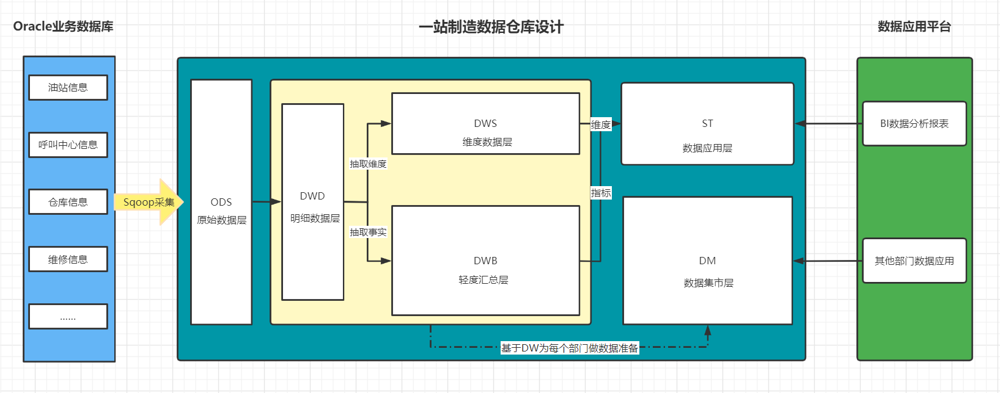
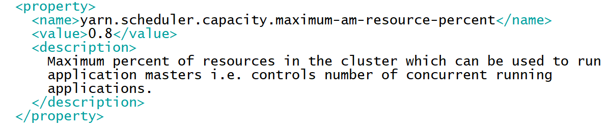
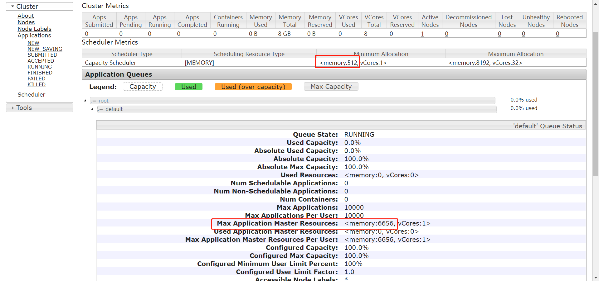
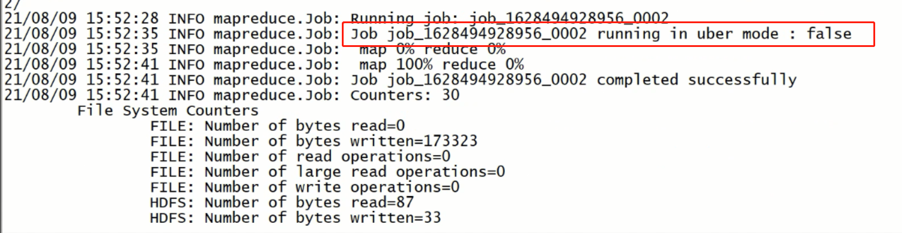
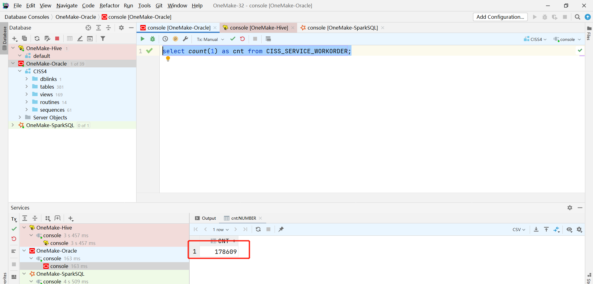
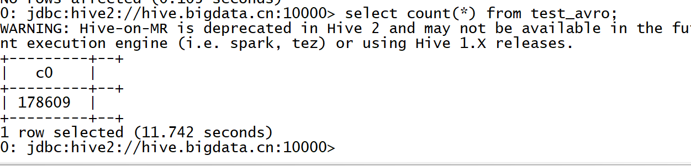
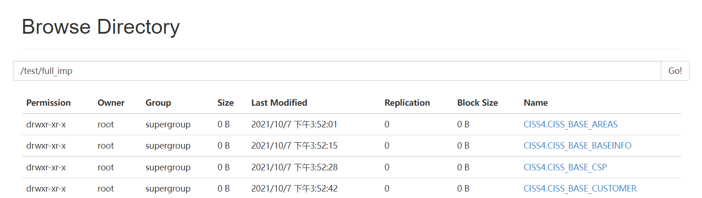

# 数仓设计及数据采集

## I. 数仓分层设计

### 1. 数仓设计回顾

- **目标**：**了解数据仓库设计的核心知识点**

- **路径**

  - step1：分层
  - step2：建模

- **实施**

  - **分层**：决定了数据仓库中数据库的设计

    - **什么是分层？**
      - 本质：规范化数据的处理流程
      - 实现：每一层在Hive中就是一个数据库
    - **为什么要分层？**
      - 清晰数据结构：每一个数据分层都有它的作用域，这样我们在使用表的时候能更方便地定位和理解。
      - 数据血缘追踪：简单来讲可以这样理解，我们最终给业务诚信的是一能直接使用的张业务表，但是它的来源有很多，如果有一张来源表出问题了，我们希望能够快速准确地定位到问题，并清楚它的危害范围。
      - 减少重复开发：规范数据分层，开发一些通用的中间层数据，能够减少极大的重复计算。
      - 把复杂问题简单化：一个复杂的任务分解成多个步骤来完成，每一层只处理单一的步骤，比较简单和容易理解。
      - 屏蔽原始数据的异常对业务的影响：不必改一次业务就需要重新接入数据
    - **怎么分层？**

  - **建模**：决定了数据仓库中表的设计

    - **什么是建模？**

      - 本质：决定了数据存储的方式，表的设计

    - **为什么要建模？**

      - **大数据系统需要数据模型方法来帮助更好地组织和存储数据，在性能、成本、效率和质量之间取得最佳平衡。**
      - 性能：良好的数据模型能帮助我们快速查询所需要的数据，减少数据的I/O吞吐
      - 成本：良好的数据模型能极大地减少不必要的数据冗余，也能实现计算结果复用，极大地降低大数据系统中的存储和计算成本
      - 效率：良好的数据模型能极大地改善用户使用数据的体验，提高使用数据的效率
      - 质量：良好的数据模型能改善数据统计口径的不一致性，减少数据计算错误的可能性

    - **有哪些建模方法？**

      - ER模型：从全企业的高度设计一个 3NF 【三范式】模型，用实体关系模型描述企业业务，满足业务需求的存储
      - 维度模型：从分析决策的需求出发构建模型，为分析需求服务，重点关注用户如何更快速的完成需求分析，具有较好的大规模复杂查询的响应性能
      - Data Vault：ER 模型的衍生，基于主题概念将企业数据进行结构化组织，并引入了更进一步的范式处理来优化模型，以应对源系统变更的扩展性
      - Anchor：一个高度可扩展的模型，核心思想是所有的扩展知识添加而不是修改，因此将模型规范到 6NF，基本变成了 k-v 结构化模型

    - **怎么构建维度模型步骤？**

      - a.选择业务过程：你要做什么？
      - b.声明粒度：你的分析基于什么样的颗粒度？
      - c.确认环境的维度：你的整体有哪些维度？
      - d.确认用于度量的事实：你要基于这些维度构建哪些指标？

    - **维度建模的实施流程是什么？**

      - a.需求调研

        - 业务调研：熟悉整个业务流程

        - 数据调研：业务流程中产生了哪些核心数据

        - b.划分主题域：面向业务将业务划分主题

          - 最终想要分析的有哪些主题域和主题

        - c.构建维度总线矩阵：明确每个业务主题对应的维度关系

          | 主题域主题          | 时间 | 地区 | 平台 |
          | ------------------- | ---- | ---- | ---- |
          | 运营域/订单分析主题 | *    | *    | -    |
          | 运营域/访问分析主题 | *    | -    | -    |
          | 用户域/行为分析主题 | *    | -    | *    |

        - d.明确指标统计：明确所有原生指标与衍生指标：明确每个主题要统计分析哪些指标来反映主题事实

          | 主题域主题          | 指标                                                   | 时间 | 地区 | 平台 |
          | ------------------- | ------------------------------------------------------ | ---- | ---- | ---- |
          | 运营域/订单分析主题 | 订单个数、订单金额                                     | *    | *    | -    |
          | 运营域/访问分析主题 | UV、PV、IP、跳出率、二跳率                             | *    | -    | -    |
          | 用户域/行为分析主题 | 搜索人数、浏览人数、添加购物车人数、订单人数、支付人数 | *    | -    | *    |

        - e.定义事实与维度规范

          - 建表建库规范、命名规范、开发规范

        - f.代码开发

    - **事实表**

      - 表的分类
        - 事务事实表：原始的事务事实的数据表，原始业务数据表
        - 周期快照事实表：周期性对事务事实进行聚合的结果
        - 累计快照事实表：随着时间的变化，事实是不定的，不断完善的过程
        - **无事实事实表**：特殊的事实表，里面没有事实，是多个维度的组合，用于求事实的差值
      - 值的分类
        - 可累加事实：在任何维度下指标的值都可以进行累加
        - 半可累加事实：在一定维度下指标的值都可以进行累加
      - 不可累加事实：在任何维度下指标的值都不可以进行累加

    - **维度表**

      - 维度表设计模型
        - 雪花模型：维度表拥有子维度表，部分维度表关联在维度表中，间接的关联事实表
        - **星型模型/星座模型**：维度表没有子维度，直接关联在事实表上，星座模型中有多个事实
      - 上卷与下钻
        - 上卷：从小维度到一个大的维度，颗粒度从细到粗
        - 下钻：从大维度到一个小的维度，颗粒度从粗到细
      - 拉链表
        - **渐变维度的处理方案**
        - 功能：解决事实中渐变维度发生变化的问题，通过时间来标记维度的每一种状态，存储所有状态
        - 实现
          - startTime：状态开始时间，数据产生时间
            - endTime：状态结束时间，默认为9999-12-31，用于表示最新状态
          - 流程
            - step1：先采集所有增量【新增和更新】数据到ODS层的分区中
            - step2：将更新分区的数据与老的拉链表的数据进行合并写入一张临时表
            - step3：将临时表的结果覆盖到拉链表中

- **小结**

  - 了解数据仓库设计的核心知识点

### 2. 分层整体设计

- **目标**：**掌握油站分析项目中的分层整体设计**

- **实施**

  

  - **ODS**：原始数据层：最接近于原始数据的层次，直接采集写入层次
  - **DWD**：明细数据层：对ODS层的数据根据业务需求实现数据清洗以后的结果，保证数据质量
  - **DWB**：基础数据层：轻度聚合，有的公司也叫作DWM
  - **DWS**：等同于DIM，维度数据层：存储维度数据表
  - **ST**：数据应用层：存储每个主题基于维度分析聚合的结果，只用于对外提供报表
  - **DM**：数据集市：按照不同部门的数据需求，将暂时没有实际主题需求的数据存储

- **小结**

  - 掌握油站分析项目中的分层整体设计

### 3. 分层具体功能

- **目标**：**掌握油站分析的每层的具体功能**
- **实施**
  - **ODS**
    - 数据内容：存储所有原始业务数据，基本与Oracle数据库中的业务数据保持一致
    - 数据来源：使用Sqoop从Oracle中同步采集
    - 存储设计：Hive分区表，avro文件格式存储，保留3个月
    - 数据表：事务事实表 + 维度表
  - **DWD**
    - 数据内容：存储所有业务数据的明细数据
    - 数据来源：对ODS层的数据进行ETL扁平化处理得到，保证数据质量
    - 存储设计：Hive分区表，orc文件格式存储，保留所有数据
    - 数据表：事务事实表 + 维度表，对ODS做了清洗
  - **DWB**
    - 数据内容：存储所有事实与维度的基本关联、基本事实指标等数据
    - 数据来源：对DWD层的数据进行清洗过滤、**轻度聚合**以后的数据
    - 存储设计：Hive分区表，orc文件格式存储，保留所有数据
    - 数据表：主题事务事实表
  - **DWS**
    - 数据内容：存储所有业务的维度数据：日期、地区、油站、呼叫中心、仓库等维度表
    - 数据来源：对DWD的明细数据中抽取维度数据，通过工具生成维度数据
    - 存储设计：Hive普通表，orc文件 + Snappy压缩
    - 数据表：维度表
  - **ST**
    - 数据内容：存储所有报表分析的事实数据
    - 数据来源：基于DWB和DWS层，通过对不同维度的统计聚合得到所有报表事实的指标
    - 数据表：周期快照事实表
  - **DM**
    - 数据内容：存储不同部门所需要的不同主题的数据
    - 数据来源：对DW层的数据进行聚合统计按照不同部门划分
    - 数据表：每个部门需要的数据宽表
- **小结**
  - 掌握油站分析的每层的具体功能

## II. 业务系统

### 1. 业务系统结构

- **目标**：**了解一站制造中的业务系统结构**

- **实施**

  - **数据来源**：业务系统

    

    - **ERP系统**：企业资源管理系统，存储整个公司所有资源的信息
      - 员工部门信息、仓库信息、设备信息
    - **CISS系统**：客户服务管理系统，存储所有用户、运营数据
      - 油站信息、工单信息
    - **呼叫中心系统**：负责实现所有客户的需求申请、调度、回访等
      - 来电信息、回访信息

  - **组织结构**

    - 运营部（编制人数300人）
      - 负责服务策略制定和实施，对服务网络运营过程管理。部门职能包括物料管理、技术支持、服务效率管理、服务质量控制、服务标准化和可视化实施等工作。承担公司基础服务管理方面具体目标责任
    - 综合管理部（编制人数280人）
      - 下属部门有呼叫中心、信息运维、人事行政、绩效考核与培训、企划部等部门。负责公司市场部、运营部、财务部等专业业务以外的所有职能类工作，包括行政后勤管理、劳动关系、绩效考核与培训、企划宣传、采购需求管理、信息建设及数据分析、公司整体目标和绩效管理等工作。
    - 市场部（编制人数50人）
      - 负责客户需求开发、服务产品开发、市场拓展与销售管理工作，执行销售策略、承担公司市场、销售方面具体目标责任。
    - 财务部（编制人数10人）
      - 负责服务公司财务收支、费用报销、报表统计、财务分析等财务管理工作
    - 市场销售服务中心（编制人数4000人）
      - 负责服务产品销售，设备的安装、维护、修理、改造等工作，严格按照公司管理标准实施日常服务工作

  - **业务流程**

    

    

- **小结**

  - 了解一站制造中的业务系统结构

### 2. 业务系统数据

- **目标**：**熟悉业务系统核心数据表**

- **实施**

  - **切换查看数据库**

    

  - **查看数据表**

    - CISS_BASE：基础数据表：维度表 + 字典表
      - 报销项目核算、地区信息、服务商信息、设备信息、故障分类、出差补助信息、油站基础信息等
    - CISS_SERVICE、CISS_S：服务数据表
      - 来电受理单信息、改派记录信息、故障更换材料明细信息、综合报销信息、服务单信息、安装单、维修单、改造单信息、巡检单信息
    - CISS_MATERIAL、CISS_M：仓储物料表
      - 物料申明明细信息、网点物料调配申请等
    - ORG：组织机构数据
      - 部门信息、员工信息等
    - EOS：字典信息表
      - 存放不同状态标识的字典

  - **核心数据表**

    

    - 运营分析：工单分析、来电分析
    - 提高服务质量：回访分析
    - 运营成本核算：费用分析

- **小结**

  - 熟悉业务系统核心数据表

## III. 数据采集

### 1. 全量与增量分析

- **目标**：**了解全量表与增量表数据采集需求**

- **实施**

  - **全量表：**

    - 所有**维度数据表**

    - 场景：不会经常发生变化的数据表，例如维度数据表等

    - 数据表：组织机构信息、地区信息、服务商信息、数据字典等

    - 表名：参考文件《full_import_tables.txt》

      

  - **增量表**

    - 所有**事务事实的数据表**

    - 场景：经常发生变化的数据表，例如业务数据、用户行为数据等

    - 数据表：工单数据信息、呼叫中心信息、物料仓储信息、报销费用信息等

    - 表名：参考文件《incr_import_tables.txt》

      

  - 整体需求：将Oracle中101张表的数据通过全量或者增量同步到Hive的ODS层中

- **小结**

  - 了解全量表与增量表数据采集需求

### 2. Sqoop命令回顾

- **目标**：**掌握Sqoop常用命令的使用**

- **实施**

  - **基本语法**

  - **数据库参数**

  - **导入参数**

  - **导出参数**

  - **连接Oracle语法**

    ```shell
    --connect jdbc:oracle:thin:@OracleServer:OraclePort:OracleSID
    --connect jdbc:oracle:thin:@机器地址:端口:提供SID
    ```

  - **测试采集Oracle数据**

    - 进入

      ```shell
      docker exec -it sqoop bash
      ```

    - 测试

      ```shell
      sqoop import \
      --connect jdbc:oracle:thin:@oracle.bigdata.cn:1521:helowin \
      --username ciss \
      --password 123456 \
      --table CISS4.CISS_BASE_AREAS \
      --target-dir /test/full_imp/ciss4.ciss_base_areas \
      --fields-terminated-by "\t" \
      -m 1
      ```

    - 查看结果

      

- **小结**

  - 掌握Sqoop常用命令的使用

### 3. YARN资源调度及配置

- **目标**：**实现YARN的资源调度配置**

- **实施**

  - **问题1：程序已提交YARN，但是无法运行，报错：Application is added to the scheduler and is not activated. User’s AM resource limit exceeded.**

    ```properties
    yarn.scheduler.capacity.maximum-am-resource-percent=0.8
    ```

    - 配置文件：${HADOOP_HOME}/etc/hadoop/capacity-scheduler.xml
    - 属性功能：指定队列最大可使用的资源容量大小百分比，默认为0.2，指定越大，AM能使用的资源越多

  - **问题2：程序提交，运行失败，报错：无法申请Container**

    ```properties
    yarn.scheduler.minimum-allocation-mb=512
    ```

    - 配置文件：${HADOOP_HOME}/etc/hadoop/yarn-site.xml
    - 属性功能：指定AM为每个Container申请的最小内存，默认为1G，申请不足1G，默认分配1G，值过大，会导致资源不足，程序失败，该值越小，能够运行的程序就越多

  - **问题3：怎么提高YARN集群的并发度？**

    - 物理资源、YARN资源、Container资源、进程资源

    - YARN资源配置：由NodeManager决定

      ```properties
      yarn.nodemanager.resource.cpu-vcores=8
      yarn.nodemanager.resource.memory-mb=8192
      ```

    - Container资源

      ```properties
      yarn.scheduler.minimum-allocation-vcores=1
      yarn.scheduler.maximum-allocation-vcores=32
      yarn.scheduler.minimum-allocation-mb=1024
      yarn.scheduler.maximum-allocation-mb=8192
      ```

    - MR Task资源

      ```properties
      mapreduce.map.cpu.vcores=1
      mapreduce.map.memory.mb=1024
      mapreduce.reduce.cpu.vcores=1
      mapreduce.reduce.memory.mb=1024
      ```

    - Spark Executor资源

      ```shell
      --driver-memory  #分配给Driver的内存，默认分配1GB
      --driver-cores   #分配给Driver运行的CPU核数，默认分配1核
      --executor-memory #分配给每个Executor的内存数，默认为1G，所有集群模式都通用的选项
      --executor-cores  #分配给每个Executor的核心数，YARN集合和Standalone集群通用的选项
      --total-executor-cores NUM  #Standalone模式下用于指定所有Executor所用的总CPU核数
      --num-executors NUM #YARN模式下用于指定Executor的个数，默认启动2个
      ```

  - **实现：修改问题1中的配置属性【不用做】**

    - 注意：修改完成，要重启YARN

      

    

    

- **小结**

  - 实现YARN的资源调度配置

### 4. MR的Uber模式

- **目标**：了解MR的Uber模式的配置及应用

- **实施**

  - **问题**：MR程序运行在YARN上时，有一些轻量级的作业要频繁的申请资源再运行，性能比较差怎么办？

    - Uber模式

    - 类似于Hive的本地模式，程序不提交给YARN，直接在本地运行

      ```
      set hive.exec.mode.local.auto=true;
      ```

      - 满足条件：MapTask不允许超过4个，ReduceTask不允许超过1个，输入数据量不允许超过128M

  - **功能**：Uber模式下，程序只申请一个AM Container：所有Map Task和Reduce Task，均在这个Container中顺序执行

    

    - 默认不开启

  - **配置**：${HADOOP_HOME}/etc/hadoop/mapred-site.xml

    ```properties
    mapreduce.job.ubertask.enable=true
    #必须满足以下条件
    mapreduce.job.ubertask.maxmaps=9
    mapreduce.job.ubertask.maxreduces=1
    mapreduce.job.ubertask.maxbytes=128M
    yarn.app.mapreduce.am.resource.cpu-vcores=1
    yarn.app.mapreduce.am.resource.mb=1536M
    ```

  - **特点**

    - Uber模式的进程为AM，所有资源的使用必须小于AM进程的资源
    - Uber模式条件不满足，不执行Uber模式
    - Uber模式，会禁用推测执行机制

- **小结**

  - 了解MR的Uber模式的配置及应用

### 5. Sqoop采集数据格式问题

- **目标**：**掌握Sqoop采集数据时的问题**

- **路径**

  - step1：现象
  - step2：问题
  - step3：原因
  - step4：解决

- **实施**

  - **现象**

    - step1：查看Oracle中CISS_SERVICE_WORKORDER表的数据条数

      ```sql
      select count(1) as cnt from ciss4.CISS_SERVICE_WORKORDER;
      ```

      

    - step2：采集CISS_SERVICE_WORKORDER的数据到HDFS上

      ```shell
      sqoop import \
      --connect jdbc:oracle:thin:@oracle.bigdata.cn:1521:helowin \
      --username ciss \
      --password 123456 \
      --table CISS4.CISS_SERVICE_WORKORDER \
      --delete-target-dir \
      --target-dir /test/full_imp/ciss4.ciss_service_workorder \
      --fields-terminated-by "\001" \
      -m 1
      ```

    - step3：Hive中建表查看数据条数

      - 进入Hive容器

        ```
        docker exec -it hive bash
        ```

      - 连接HiveServer

        ```
        beeline -u jdbc:hive2://hive.bigdata.cn:10000 -n root -p 123456
        ```

      - 创建测试表

        ```sql
        create external table test_text(
        line string
        )
        location '/test/full_imp/ciss4.ciss_service_workorder';
        ```

      - 统计行数

        ```
        select count(*) from test_text;
        ```

        

  - **问题**：Sqoop采集完成后导致HDFS数据与Oracle数据量不符

  - **原因**

    - sqoop以**文本格式**导入数据时，默认的换行符是特殊字符
    - Oracle中的数据列中如果出现了**\n、\r、\t**等特殊字符，就会被划分为多行
    - Oracle：表
    - HDFS：文件

  - **解决**

    - 方案一：删除或者替换数据中的换行符
      - --hive-drop-import-delims：删除换行符
      - --hive-delims-replacement  char：替换换行符
    - 方案二：使用特殊文件格式：AVRO格式
      - 用其他的文件类型例如orc等是否可以？
      - 为什么选择Avro？

- **小结**

  - 掌握Sqoop采集数据时的问题

### 6. Avro格式

- **目标**：掌握使用Avro格式解决采集换行问题

- **路径**

  - step1：常见格式介绍
  - step2：Avro格式特点
  - step3：Sqoop使用Avro格式
  - step4：使用测试

- **实施**

  - **常见格式介绍**

    | 类型         | 介绍                                                         |
    | ------------ | ------------------------------------------------------------ |
    | TextFile     | Hive默认的文件格式，最简单的数据格式，便于查看和编辑，耗费存储空间，I/O性能较低 |
    | SequenceFile | 含有键值对的二进制文件，优化磁盘利用率和I/O，并行操作数据，查询效率高，但存储空间消耗最大 |
    | AvroFile     | 特殊的二进制文件，设计的主要目标是为了满足schema evolution，Schema和数据保存在一起 |
    | OrcFile      | 列式存储，Schema存储在footer中，不支持schema evolution，高度压缩比并包含索引，查询速度非常快 |
    | ParquetFile  | 列式存储，与Orc类似，压缩比不如Orc，但是查询性能接近，支持的工具更多，通用性更强 |

  - **Avro格式特点**

    - 优点
      - 二进制数据存储，性能好、效率高
      - 使用JSON描述模式，支持场景更丰富
      - **Schema和数据统一存储，消息自描述**：把Avro格式的文件当做表来看
      - 模式定义允许定义数据的排序
    - 缺点
      - 只支持Avro自己的序列化格式
      - 少量列的读取性能比较差，压缩比较低
    - 场景：基于行的大规模结构化数据写入、列的读取非常多或者Schema变更操作比较频繁的场景

  - **项目中使用原因**

    - 解决换行符的问题：将Oracle中一行作为文本中的一行
    - 保留Schema：保留每张表有哪些列，每一列是什么类型这些信息，实现自动化建表

  - **Sqoop使用Avro格式**

    - 选项：Sqoop生成的数据为avro格式

      ```
      --as-avrodatafile                                     Imports data to Avro datafiles
      ```

    - 注意：如果使用了MR的Uber模式，必须在程序中加上以下参数避免类冲突问题

      ```
      -Dmapreduce.job.user.classpath.first=true
      ```

  - **使用测试**

    ```shell
    sqoop import \
    -Dmapreduce.job.user.classpath.first=true \
    --connect jdbc:oracle:thin:@oracle.bigdata.cn:1521:helowin \
    --username ciss \
    --password 123456 \
    --table CISS4.CISS_SERVICE_WORKORDER \
    --delete-target-dir \
    --target-dir /test/full_imp/ciss4.ciss_service_workorder \
    --as-avrodatafile \
    --fields-terminated-by "\001" \
    -m 1
    ```

    - Hive中建表

      - 进入Hive容器

        ```
        docker exec -it hive bash
        ```

      - 连接HiveServer

        ```
        beeline -u jdbc:hive2://hive.bigdata.cn:10000 -n root -p 123456
        ```

      - 创建测试表

        ```sql
        create external table test_avro(
        line string
        )
        stored as avro
        location '/test/full_imp/ciss4.ciss_service_workorder';
        ```

      - 统计行数

        ```
        select count(*) from test_avro;
        ```

        

- **小结**

  - 掌握如何使用Avro格式解决采集换行问题

### 7. Sqoop增量采集方案回顾

- **目标**：回顾Sqoop增量采集方案

- **路径**

  - step1：Append
  - step2：Lastmodified
  - step3：特殊方式

- **实施**

  - **Append**

    - 要求：必须有一列自增的值，按照自增的int值进行判断

    - 特点：只能导入增加的数据，无法导入更新的数据

    - 场景：数据只会发生新增，不会发生更新的场景

    - 代码

      ```shell
      sqoop import \
      --connect jdbc:mysql://node3:3306/sqoopTest \
      --username root \
      --password 123456 \
      --table tb_tohdfs \
      --target-dir /sqoop/import/test02 \
      --fields-terminated-by '\t' \
      --check-column id \
      --incremental append \
      --last-value 0 \
      -m 1
      ```

  - **Lastmodified**

    - 要求：必须包含动态时间变化这一列，按照数据变化的时间进行判断

    - 特点：既导入新增的数据也导入更新的数据

    - 场景：一般无法满足要求，所以不用

    - 代码

      ```shell
      sqoop import \
      --connect jdbc:mysql://node3:3306/sqoopTest \
      --username root \
      --password 123456 \
      --table tb_lastmode \
      --target-dir /sqoop/import/test03 \
      --fields-terminated-by '\t' \
      --incremental lastmodified \
      --check-column lastmode \
      --last-value '2021-06-06 16:09:32' \
      -m 1
      ```

      

  - **条件过滤方式**

    - 要求：每次运行的输出目录不能相同

    - 特点：自己实现增量的数据过滤，可以实现新增和更新数据的采集

    - 场景：一般用于自定义增量采集每天的分区数据到Hive

    - 代码

      ```shell
      sqoop  import \
      --connect jdbc:mysql://node3:3306/db_order \
      --username root \
      --password-file file:///export/data/sqoop.passwd \
      --query "select * from tb_order where substring(create_time,1,10) = '昨天的日期' or substring(update_time,1,10) = '昨天的日期' and \$CONDITIONS " \
      --delete-target-dir \
      --target-dir /nginx/logs/tb_order/daystr=2021-10-31 \
      --fields-terminated-by '\t' \
      -m 1
      ```

- **小结**

  - 回顾Sqoop增量采集方案

### 8. 脚本开发思路

- **目标**：掌握自动化脚本开发的设计思路分析

- **路径**

  - step1：脚本目标
  - step2：实现流程
  - step3：脚本选型
  - step4：单个测试

- **实施**

  - **脚本目标**：实现自动化将多张Oracle中的数据表全量或者增量采集同步到HDFS中

    ```shell
    sqoop import \
    -Dmapreduce.job.user.classpath.first=true \
    --connect jdbc:oracle:thin:@oracle.bigdata.cn:1521:helowin \
    --username ciss \
    --password 123456 \
    --table CISS4.CISS_SERVICE_WORKORDER \
    --delete-target-dir \
    --target-dir /test/full_imp/ciss4.ciss_service_workorder \
    --as-avrodatafile \
    --fields-terminated-by "\001" \
    -m 1
    ```

  - **实现流程**

    - a. 获取表名
    - b.构建Sqoop命令
    - c.执行Sqoop命令
    - d.验证结果

  - **脚本选型**

    - Shell：Linux原生脚本类型，直接运行Linux中，轻量级脚本编程语言
    - Python：必须基于Python环境，Python中必须支持对应的操作，高级语言
    - 判断：100行

  - **单个测试**

    - 创建一个文件，存放要采集的表的名称

      ```shell
      #创建测试目录
      mkdir -p /opt/datas/shell
      cd /opt/datas/shell/
      #创建存放表名的文件
      vim test_full_table.txt
      ```

      ```
      ciss4.ciss_base_areas
      ciss4.ciss_base_baseinfo
      ciss4.ciss_base_csp
      ciss4.ciss_base_customer
      ciss4.ciss_base_device
      ```

    - 创建脚本

      ```
      vim test_full_import_table.sh
      ```

    - 构建采集的Sqoop命令

      ```shell
      sqoop import \
      -Dmapreduce.job.user.classpath.first=true \
      --connect jdbc:oracle:thin:@oracle.bigdata.cn:1521:helowin \
      --username ciss \
      --password 123456 \
      --table CISS4.CISS_SERVICE_WORKORDER \
      --delete-target-dir \
      --target-dir /test/full_imp/ciss4.ciss_service_workorder \
      --as-avrodatafile \
      --fields-terminated-by "\001" \
      -m 1
      ```

    - 封装脚本

      ```shell
      #!/bin/bash
      #export path
      source /etc/profile
      #export the tbname files
      TB_NAME=/opt/datas/shell/test_full_table.txt
      #export the import opt
      IMP_OPT="sqoop import -Dmapreduce.job.user.classpath.first=true"
      #export the jdbc opt
      JDBC_OPT="--connect jdbc:oracle:thin:@oracle.bigdata.cn:1521:helowin --username ciss --password 123456"
      
      #read tbname and exec sqoop
      while read tbname
      do
        ${IMP_OPT} ${JDBC_OPT} --table ${tbname^^} --delete-target-dir --target-dir /test/full_imp/${tbname^^} --as-avrodatafile --fields-terminated-by "\001" -m 1
      done < ${TB_NAME}
      ```

    - 添加执行权限

      ```
      chmod u+x test_full_import_table.sh
      ```

    - 测试执行

      ```
      sh -x test_full_import_table.sh
      ```

    - 检查结果

      

- **小结**

  - 实现自动化脚本开发的设计思路分析