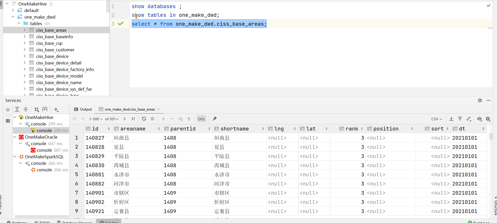
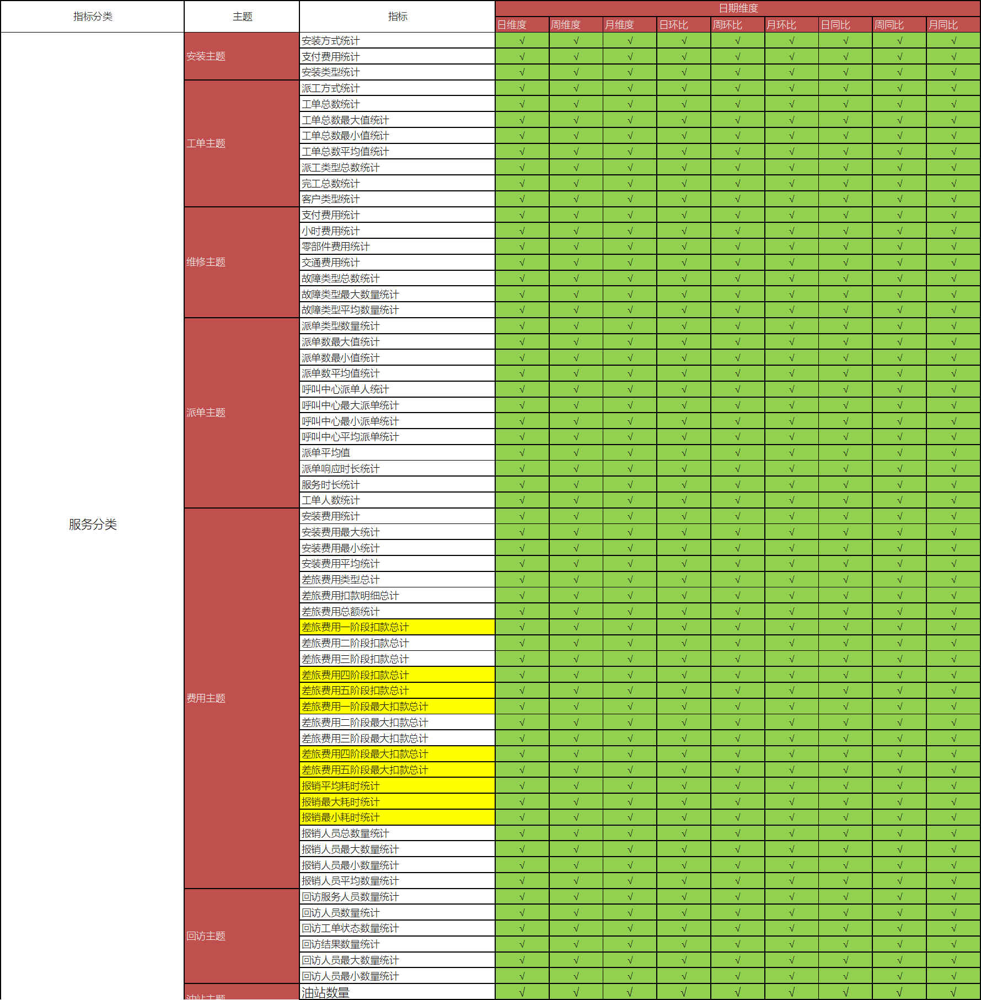

# ODS, DWD与DWS层自动化构建实现

## I. ODS层

### 1. 建表实现分析

- **目标**：阅读ODS建表代码及实现测试

- **实施**

  - **代码讲解**

    - step1：表名怎么获取?

    - step2：建表的语句是什么，哪些是动态变化的？

      ```sql
      create external table 数据库名称.表名
      comment '表的注释'
      partitioned by
      ROW FORMAT SERDE
        'org.apache.hadoop.hive.serde2.avro.AvroSerDe'
      STORED AS INPUTFORMAT
        'org.apache.hadoop.hive.ql.io.avro.AvroContainerInputFormat'
      OUTPUTFORMAT
        'org.apache.hadoop.hive.ql.io.avro.AvroContainerOutputFormat'
      location '这张表在HDFS上的路径'
      TBLPROPERTIES （'这张表的Schema文件在HDFS上的路径'）
      ```

    - step3：怎么获取表的注释？

    - step4：全量表与增量表有什么区别？

    - step5：如何实现自动化建表？

  - **代码测试**

    - 注释掉第4~ 第6阶段的内容
    - 运行代码，查看结果

    

- **小结**

  - 阅读ODS建表代码及实现测试

### 2. 获取Oracle表元数据

- **目标**：**理解ODS层获取Oracle元数据**

- **实施**

  - 从Oracle中获取：从系统表中获取某张表的信息和列的信息

    ```sql
    select
           columnName, dataType, dataScale, dataPercision, columnComment, tableComment
    from
    (
        select
               column_name columnName,
               data_type dataType,
               DATA_SCALE dataScale,
               DATA_PRECISION dataPercision,
               TABLE_NAME
        from all_tab_cols where 'CISS_CSP_WORKORDER' = table_name) t1
        left join (
            select
                   comments tableComment,TABLE_NAME
            from all_tab_comments WHERE 'CISS_CSP_WORKORDER' = TABLE_NAME) t2
            on t1.TABLE_NAME = t2.TABLE_NAME
        left join (
            select comments columnComment, COLUMN_NAME
            from all_col_comments WHERE TABLE_NAME='CISS_CSP_WORKORDER') t3
            on t1.columnName = t3.COLUMN_NAME;
    ```

    

    - 如何获取元数据？
    - 将查询的结果进行保存？

- **小结**

  - 理解ODS层获取Oracle元数据

### 3. 申明分区代码及测试

- **目标**：阅读ODS申明分区的代码及实现测试

- **路径**

  - step1：代码讲解
  - step2：代码测试

- **实施**

  - **代码讲解**

    - step1：为什么要申明分区？
    - step2：怎么申明分区？
    - step3：如何自动化实现每个表的分区的申明？

  - **代码测试**

    - 注释掉第5 ~ 第6阶段的内容
    - 运行代码，查看结果

    

- **小结**

  - 阅读ODS申明分区的代码及实现测试

### 4. ODS层与DWD层区别

- **目标**：理解ODS层与DWD层的区别

- **路径**

  - step1：内容区别
  - step2：设计区别
  - step3：实现区别

- **实施**

  - **内容区别**

    - ODS：原始数据
    - DWD：对ODS层ETL以后的数据，保证数据质量
    - 本次数据来源于Oracle数据库，没有具体的ETL的需求，可以直接将ODS层的数据写入DWD层
    - DWD层与ODS层的数据是一致的

  - **设计区别**

    - ODS层：Avro格式分区数据表
    - DWD层：Orc格式分区数据表

  - **实现区别**

    - ODS层建表：基于avsc文件指定Schema建表

      ```sql
      create external table if not exists one_make_ods.ciss_base_areas 
      partitioned by (dt string) 
      ROW FORMAT SERDE 'org.apache.hadoop.hive.serde2.avro.AvroSerDe'
      STORED AS INPUTFORMAT 'org.apache.hadoop.hive.ql.io.avro.AvroContainerInputFormat'
      OUTPUTFORMAT 'org.apache.hadoop.hive.ql.io.avro.AvroContainerOutputFormat'
      tblproperties ('avro.schema.url'='hdfs:///data/dw/ods/one_make/avsc/CISS4_CISS_BASE_AREAS.avsc')
      location '/data/dw/ods/one_make/full_imp/ciss4.ciss_base_areas'
      ```

    - DWD层建表：自己指定每个字段的Schema建表

      ```sql
      create external table if not exists one_make_dwd.ciss_base_areas(
      	ID string comment '列的注释',
      	AREANAME string,
          PARENTID string,
      	SHORTNAME string,
          LNG string,
      	LAT string,
      	RANK bigint,
      	POSITION string,
      	SORT bigint
      ) partitioned by (dt string) 
      stored as orc
      location '/data/dw/dwd/one_make/ciss_base_areas';
      ```

      - 难点1：字段信息怎么获取？
      - 难点2：Oracle中字段类型与SparkSQL字段可能不一致？

- **小结**

  - 理解ODS层与DWD层的区别

## II. DWD层

### 1. 需求分析

- **目标**：**掌握DWD层的构建需求**
- **路径**
  - step1：整体需求
  - step2：建库需求
  - step3：建表需求
- **实施**
  - **整体需求**：将ODS层的数据表直接加载到DWD层
  - **建库需求**：创建DWD层数据库：one_make_dwd
  - **建表需求**：将ODS层中的每一张表创建一张对应的DWD层的表，抽取数据写入DWD层表
    - 问题1：建表的语法是什么？
    - 问题2：表的名称是什么，怎么获取？
    - 问题3：表的注释怎么来？
    - 问题4：表的字段信息怎么获取？
    - 问题5：Oracle中的字段类型如果与Hive中的类型不一致怎么办？
- **小结**
  - 掌握DWD层的构建需求

### 2. 建库实现测试

- **目标**：**阅读DWD建库代码及实现测试**

- **路径**

  - step1：代码讲解
  - step2：代码测试

- **实施**

  - **代码讲解**

    - step1：DWD层的数据库名称是什么，建库的语法是什么？
    - step2：如何实现DWD层数据库的构建？

  - **代码测试**

    - 注释掉第5.2 ~ 第6阶段的内容

    - 运行代码，查看结果

      

- **小结**

  - 阅读DWD建库代码及实现测试

### 3. 建表实现测试

- **目标**：**阅读DWD建表代码及实现测试**

- **路径**

  - step1：代码讲解
  - step2：代码测试

- **实施**

  - **代码讲解**

    - step1：如何获取所有表名？
    - step2：建表的语句是什么，哪些是动态变化的？
    - step3：怎么获取字段信息？
    - step4：Oracle字段类型与Hive/SparkSQL字段类型不一致怎么办？
    - step4：HDFS上的路径是什么？
    - step5：如何实现自动化

  - **代码测试**

    - 注释掉 第6阶段的内容

    - 运行代码，查看结果

      

      

- **小结**

  - 阅读DWD建表代码及实现测试

### 4. 数据抽取分析

- **目标**：**实现DWD层的构建思路分析**

- **路径**

  - step1：抽取目标
  - step2：抽取语法

- **实施**

  - **抽取目标**：将ODS层中每张表的数据抽取到DWD层对应的数据表中

  - **抽取语法**

    - 行级事务：insert into tbname values（columnValue1……）
    - 写入数据表：insert into|overwrite tbname [partition ] select ……
    - 保存到文件：insert overwrite [local] directory ‘路径’ select ……

    ```sql
    insert overwrite table dwd.tbname partition(dt = '20210101')
    select
    	字段1,
    	字段2,
    	字段3,
    	……
    from ods.tbname
    where dt = '20210101';
    ```

- **小结**

  - 实现DWD层的构建思路分析

### 5. 数据抽取测试

- **目标**：**实现DWD层数据抽取的测试**

- **路径**

  - step1：代码讲解
  - step2：代码测试

- **实施**

  - **代码讲解**

    - step1：如何获取所有表名？
    - step2：如何获取所有字段的信息？

  - **代码测试**

    - 取消第6段代码的注释

    - 运行代码，查看结果

      

- **小结**

  - 实现DWD层数据抽取的测试

## III. 维度建模

### 1. 维度建模建模流程

- **目标**：**掌握维度建模的建模流程**

- **实施**

  - **step1-需求调研**：业务调研和数据调研

    - 了解整个业务实现的过程
    - 收集所有数据使用人员对于数据的需求
    - 整理所有数据来源

  - **step2-划分主题域**：面向业务将业务划分主题域及主题

    - 用户域、店铺域
    - 商品域、交易域、
    - 客服域、信用风控域、采购分销域

  - **step3-构建维度总线矩阵**：明确每个业务主题对应的维度关系

    

  - **step4-明确指标统计**：明确所有原生指标与衍生指标

    - **原生指标**：基于某一业务事件行为下的度量，是业务定义中不可再拆分的指标，如支付总金额
      - 行为+度量值
    - **衍生指标**：基于原子指标添加了维度：近7天的支付总金额等

  - **step5-定义事实与维度规范**

    - 命名规范、类型规范、设计规范等

  - **step6-代码开发**

    - 实现具体的代码开发
    - 只要知道指标的计算方式，基于维度分组计算指标

- **小结**

  - 掌握维度建模的建模流程

### 2. 业务主题划分

- **目标**：**掌握一站制造的主题域及主题的划分**
- **实施**
  - **来源**
    - 主题域划分：业务或者部门划分
      - 业务：客户域、广告域、运营域……
      - 部门：运维域、财务域、销售域……
    - 数据需求来划分主题
      - 运营域：访问分析报表、转化分析报表、用户属性分析报表、订单分析报表
      - 商业化数据分析平台：神策数据：国内相对做的比较好商业化大数据平台
  - **服务域**
    - 安装主题：安装方式、支付费用、安装类型
    - **工单主题**：派工方式、工单总数、派工类型、完工总数
    - 维修主题：支付费用、零部件费用、故障类型
    - **派单主题**：派单数、派单平均值、派单响应时间
    - **费用主题**：差旅费、安装费、报销人员统计
    - 回访主题：回访人员数、回访工单状态
    - 油站主题：油站总数量、油站新增数量
  - **客户域**
    - 客户主题：安装数量、维修数量、巡检数量、回访数量
  - **仓储域**
    - 保内良品核销主题：核销数量、配件金额
    - 保内不良品核销主题：核销配件数、核销配件金额
    - 送修主题：送修申请、送修物料数量、送修类型
    - 调拨主题：调拨状态、调拨数量、调拨设备类型
    - 消耗品核销：核销总数、核销设备类型
  - **服务商域**
    - 工单主题：派工方式、工单总数、工单类型、客户类型
    - 服务商油站主题：油站数量、油站新增数量
  - **运营域**
    - 运营主题：服务人员工时、维修站分析、平均工单、网点分布
  - **市场域**
    - 市场主题：工单统计、完工明细、订单统计
- **小结**
  - 掌握一站制造的主题域及主题的划分

### 3. 业务维度设计

- **目标**：**掌握一站制造业务维度设计**

- **实施**

  - ==**日期时间维度**==

    - 年维度、季度维度、月维度、周维度、日维度

    - 日环比、周环比、月环比、日同比、周同比、月同比

    - 环比：同一个周期内的比较

    - 同比：上个周期的比较

      ```
      天	周	月	季度	年	是否是周末	是否节假日	这周第几天
      ```

  - ==**行政地区维度**==

    - 地区级别：省份维度、城市维度、县区维度、乡镇维度

      ```
      省份id	省份名称	城市id	城市名称		县区id	县区名称	乡镇id	乡镇名称
      ```

  - ==**服务网点维度**==

    - 网点名称、网点编号、省份、城市、县区、所属机构

  - ==**油站维度**==

    - 油站类型、油站名称、油站编号、客户编号、客户名称、省份、城市、县区、油站状态、所属公司

  - ==**组织机构维度【工程师和部门维度】**==

    - 人员编号、人员名称、岗位编号、岗位名称、部门编号、部门名称

  - **服务类型维度**

    - 类型编号、类型名称

  - **设备维度**

    - 设备类型、设备编号、设备名称、油枪数量、泵类型、软件类型

  - **故障类型维度**

    - 一级故障编号、一级故障名称、二级故障编号、二级故障名称

  - **物流公司维度**

    - 物流公司编号、物流公司名称

  - ……

- **小结**

  - 掌握一站制造业务维度设计

### 4. 业务主题维度矩阵

- **目标**：**了解一站制造业务主题的维度矩阵**

- **实施**

  

- **小结**

  - 了解一站制造业务主题的维度矩阵