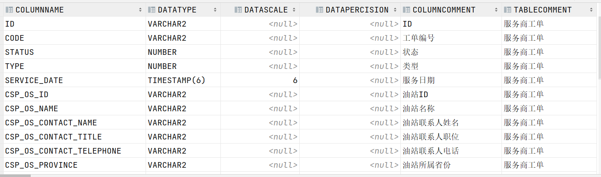
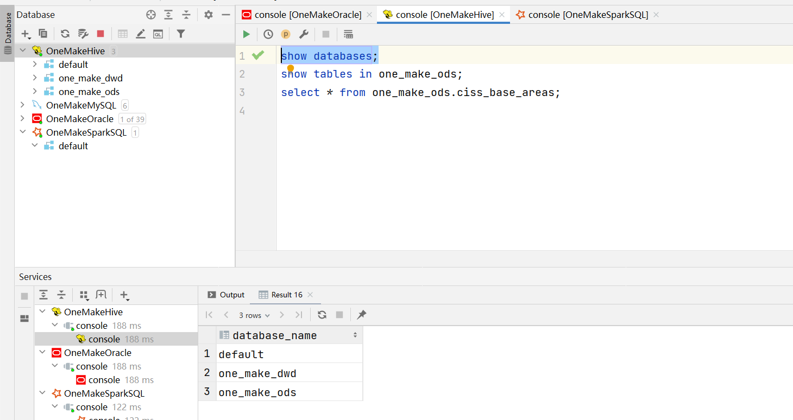

# ODS, DWD与DWS层自动化构建实现

## I. ODS层

### 1. 建表实现分析

- **目标**：阅读ODS建表代码及实现测试

- **实施**

  - **代码讲解**

    - step1：表名怎么获取?

    - step2：建表的语句是什么，哪些是动态变化的？

      ```sql
      create external table 数据库名称.表名
      comment '表的注释'
      partitioned by
      ROW FORMAT SERDE
        'org.apache.hadoop.hive.serde2.avro.AvroSerDe'
      STORED AS INPUTFORMAT
        'org.apache.hadoop.hive.ql.io.avro.AvroContainerInputFormat'
      OUTPUTFORMAT
        'org.apache.hadoop.hive.ql.io.avro.AvroContainerOutputFormat'
      location '这张表在HDFS上的路径'
      TBLPROPERTIES （'这张表的Schema文件在HDFS上的路径'）
      ```

    - step3：怎么获取表的注释？

    - step4：全量表与增量表有什么区别？

    - step5：如何实现自动化建表？

  - **代码测试**

    - 注释掉第4~ 第6阶段的内容
    - 运行代码，查看结果

    

- **小结**

  - 阅读ODS建表代码及实现测试

### 2. 获取Oracle表元数据

- **目标**：**理解ODS层获取Oracle元数据**

- **实施**

  - 从Oracle中获取：从系统表中获取某张表的信息和列的信息

    ```sql
    select
           columnName, dataType, dataScale, dataPercision, columnComment, tableComment
    from
    (
        select
               column_name columnName,
               data_type dataType,
               DATA_SCALE dataScale,
               DATA_PRECISION dataPercision,
               TABLE_NAME
        from all_tab_cols where 'CISS_CSP_WORKORDER' = table_name) t1
        left join (
            select
                   comments tableComment,TABLE_NAME
            from all_tab_comments WHERE 'CISS_CSP_WORKORDER' = TABLE_NAME) t2
            on t1.TABLE_NAME = t2.TABLE_NAME
        left join (
            select comments columnComment, COLUMN_NAME
            from all_col_comments WHERE TABLE_NAME='CISS_CSP_WORKORDER') t3
            on t1.columnName = t3.COLUMN_NAME;
    ```

    

    - 如何获取元数据？
    - 将查询的结果进行保存？

- **小结**

  - 理解ODS层获取Oracle元数据

### 3. 申明分区代码及测试

- **目标**：阅读ODS申明分区的代码及实现测试

- **路径**

  - step1：代码讲解
  - step2：代码测试

- **实施**

  - **代码讲解**

    - step1：为什么要申明分区？
    - step2：怎么申明分区？
    - step3：如何自动化实现每个表的分区的申明？

  - **代码测试**

    - 注释掉第5 ~ 第6阶段的内容
    - 运行代码，查看结果

    

- **小结**

  - 阅读ODS申明分区的代码及实现测试

### 4. ODS层与DWD层区别

- **目标**：理解ODS层与DWD层的区别

- **路径**

  - step1：内容区别
  - step2：设计区别
  - step3：实现区别

- **实施**

  - **内容区别**

    - ODS：原始数据
    - DWD：对ODS层ETL以后的数据，保证数据质量
    - 本次数据来源于Oracle数据库，没有具体的ETL的需求，可以直接将ODS层的数据写入DWD层
    - DWD层与ODS层的数据是一致的

  - **设计区别**

    - ODS层：Avro格式分区数据表
    - DWD层：Orc格式分区数据表

  - **实现区别**

    - ODS层建表：基于avsc文件指定Schema建表

      ```sql
      create external table if not exists one_make_ods.ciss_base_areas 
      partitioned by (dt string) 
      ROW FORMAT SERDE 'org.apache.hadoop.hive.serde2.avro.AvroSerDe'
      STORED AS INPUTFORMAT 'org.apache.hadoop.hive.ql.io.avro.AvroContainerInputFormat'
      OUTPUTFORMAT 'org.apache.hadoop.hive.ql.io.avro.AvroContainerOutputFormat'
      tblproperties ('avro.schema.url'='hdfs:///data/dw/ods/one_make/avsc/CISS4_CISS_BASE_AREAS.avsc')
      location '/data/dw/ods/one_make/full_imp/ciss4.ciss_base_areas'
      ```

    - DWD层建表：自己指定每个字段的Schema建表

      ```sql
      create external table if not exists one_make_dwd.ciss_base_areas(
      	ID string comment '列的注释',
      	AREANAME string,
          PARENTID string,
      	SHORTNAME string,
          LNG string,
      	LAT string,
      	RANK bigint,
      	POSITION string,
      	SORT bigint
      ) partitioned by (dt string) 
      stored as orc
      location '/data/dw/dwd/one_make/ciss_base_areas';
      ```

      - 难点1：字段信息怎么获取？
      - 难点2：Oracle中字段类型与SparkSQL字段可能不一致？

- **小结**

  - 理解ODS层与DWD层的区别

## II. DWD层

### 1. 需求分析

- **目标**：**掌握DWD层的构建需求**
- **路径**
  - step1：整体需求
  - step2：建库需求
  - step3：建表需求
- **实施**
  - **整体需求**：将ODS层的数据表直接加载到DWD层
  - **建库需求**：创建DWD层数据库：one_make_dwd
  - **建表需求**：将ODS层中的每一张表创建一张对应的DWD层的表，抽取数据写入DWD层表
    - 问题1：建表的语法是什么？
    - 问题2：表的名称是什么，怎么获取？
    - 问题3：表的注释怎么来？
    - 问题4：表的字段信息怎么获取？
    - 问题5：Oracle中的字段类型如果与Hive中的类型不一致怎么办？
- **小结**
  - 掌握DWD层的构建需求

### 2. 建库实现测试

- **目标**：**阅读DWD建库代码及实现测试**

- **路径**

  - step1：代码讲解
  - step2：代码测试

- **实施**

  - **代码讲解**

    - step1：DWD层的数据库名称是什么，建库的语法是什么？
    - step2：如何实现DWD层数据库的构建？

  - **代码测试**

    - 注释掉第5.2 ~ 第6阶段的内容

    - 运行代码，查看结果

      

- **小结**

  - 阅读DWD建库代码及实现测试

### 3. 建表实现测试

- **目标**：**阅读DWD建表代码及实现测试**

- **路径**

  - step1：代码讲解
  - step2：代码测试

- **实施**

  - **代码讲解**

    - step1：如何获取所有表名？
    - step2：建表的语句是什么，哪些是动态变化的？
    - step3：怎么获取字段信息？
    - step4：Oracle字段类型与Hive/SparkSQL字段类型不一致怎么办？
    - step4：HDFS上的路径是什么？
    - step5：如何实现自动化

  - **代码测试**

    - 注释掉 第6阶段的内容

    - 运行代码，查看结果

      

      

- **小结**

  - 阅读DWD建表代码及实现测试

### 4. 数据抽取分析


### 5. 数据抽取测试


## III. 维度建模

### 1. 维度建模建模流程


### 2. 业务主题划分


### 3. 业务维度设计


### 4. 业务主题维度矩阵