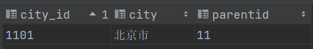
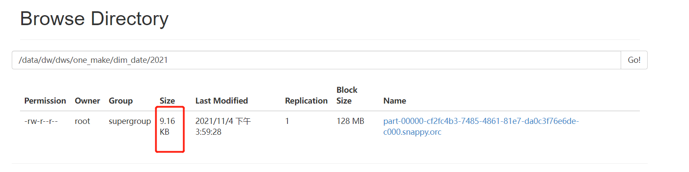
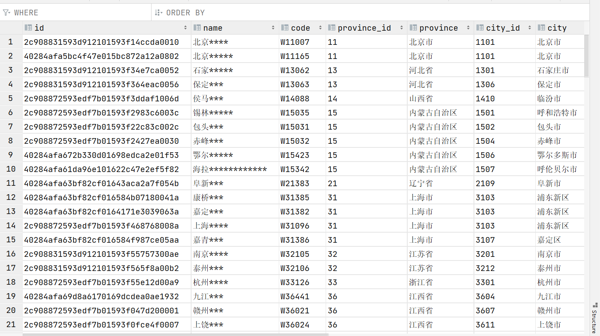

# DIM维度数据层构建

## I. 分层回顾

- **目标**：回顾一站制造项目分层设计

- **实施**

  

  - **ODS层** ：原始数据层
  - **DWD层**：明细数据层
  - **DIM层**：维度数据层
  - **DWB层**：轻度汇总层
  - **ST层**：数据应用层

- **小结**

  - 回顾一站制造项目分层设计

## II. DIM层构建

### 1. 行政地区维度设计

- **目标**：**掌握行政地区维度的需求及设计**

- **路径**

  - step1：需求
  - step2：设计

- **实施**

  - **需求**：构建行政地区维度表，得到所有省份、城市、县区及乡镇维度信息

    - 省份维度表

      ```
      省份id	省份名称
      ```

    - 城市维度表

      ```
      省份id	省份名称	城市id	城市名称
      ```

    - 县区维度表

      ```
      省份id	省份名称	城市id	城市名称	县区id	县区名称
      ```

    - 乡镇维度表

      ```
      --省份id	省份名称	城市id	城市名称	县区id	县区名称	乡镇id	乡镇名称
      --11       北京市      1101     北京市      110108    海淀区    110108014  清华园街道
      ```

    - 统计不同地区维度下的网点个数、工单个数、报销金额等

  - **设计**

    - **数据来源**：one_make_dwd.ciss_base_areas

      ```
      select * from one_make_dwd.ciss_base_areas;
      ```

      - 举例

        - 清华园街道：4

          

        - 海淀区：3

          ​							

          

        - 北京市【市级】2

          

        - 北京市【省级】1

          

    - **实现思路**：以乡镇维度为例

      - 获取所有乡镇的信息

        ```sql
        select id area_id,areaname area,parentid from one_make_dwd.ciss_base_areas where rank = 4;
        ```

      - 获取所有县区的信息

        ```sql
        select id county_id,areaname county,parentid from one_make_dwd.ciss_base_areas where rank = 3;
        ```

      - 获取所有省份的信息

        ```sql
        select id city_id,areaname city,parentid from one_make_dwd.ciss_base_areas where rank = 2;
        ```

      - 获取所有省份的信息

        ```sql
        select id province_id,areaname province,parentid from one_make_dwd.ciss_base_areas where rank = 1;
        ```

      - 需求：获取每个镇的所有行政地区信息

        ```
        省份id	省份名称	城市id	城市名称	县区id	县区名称		乡镇id	乡镇名称
        ```

      - 实现：下一级地区的父id = 上一级地区的id

        ```sql
        select
            a.townid, townname,
            b.countyid, countyname,
            c.cityid, cityname,
            d.provinceid,d.provincename
        from
            (select id townid, areaname townname ,parentid from one_make_dwd.ciss_base_areas where rank = 4) a
        join
            (select id countyid, areaname countyname ,parentid from one_make_dwd.ciss_base_areas where rank = 3) b
        on a.parentid = b.countyid
        join
            (select id cityid, areaname cityname ,parentid  from one_make_dwd.ciss_base_areas where rank = 2)  c
        on b.parentid = c.cityid
        join
            (select id provinceid, areaname provincename ,parentid from one_make_dwd.ciss_base_areas where rank = 1) d
        on c.parentid = d.provinceid;
        ```

### 2. 行政地区维度构建

- **目标**：**实现行政地区维度表的构建**

- **实施**

  - **建维度库**

    ```sql
    create database if not exists one_make_dws;
    ```

  - **建维度表**

    - 区域粒度【乡镇】

      ```sql
      create external table if not exists one_make_dws.dim_location_areas(
          id string comment 'id'
          , province_id string comment '省份ID'
          , province string comment '省份名称'
          , province_short_name string comment '省份短名称'
          , city_id string comment '城市ID'
          , city string comment '城市'
          , city_short_name string comment '城市短名称'
          , county_id string comment '县城ID'
          , county string comment '县城'
          , county_short_name string comment '县城短名称'
          , area_id string comment '区域ID'
          , area string comment '区域名称'
          , area_short_name string comment '区域短名称'
      ) comment '区域维度区域级别表'
      stored as orc
      tblproperties ("orc.compress"="SNAPPY")
      location '/data/dw/dws/one_make/dim_location_areas';
      ```

    - 县区粒度

      ```sql
      create external table if not exists one_make_dws.dim_location_county(
          id string comment 'id'
          , province_id string comment '省份ID'
          , province string comment '省份名称'
          , province_short_name string comment '省份短名称'
          , city_id string comment '城市ID'
          , city string comment '城市'
          , city_short_name string comment '城市短名称'
          , county_id string comment '县城ID'
          , county string comment '县城'
          , county_short_name string comment '县城短名称'
      ) comment '区域维度表（县城粒度）'
      stored as orc
      tblproperties ("orc.compress"="SNAPPY")
      location '/data/dw/dws/one_make/dim_location_county';
      ```

  - **抽取数据**

    - 区域粒度

      ```sql
      insert overwrite table one_make_dws.dim_location_areas
      select
        /*+repartition(1) */
          t_area.id as id,
          t_province.id as province_id,
          t_province.areaname as province,
          t_province.shortname as province_short_name,
          t_city.id as city_id,
          t_city.areaname as city,
          t_city.shortname as city_short_name,
          t_county.id as county_id,
          t_county.areaname as county,
          t_county.shortname as county_short_name,
          t_area.id as area_id,
          t_area.areaname as area,
          t_area.shortname area_short_name
      from
          one_make_dwd.ciss_base_areas t_area
          inner join one_make_dwd.ciss_base_areas t_county on t_area.rank = 4 and t_area.parentid = t_county.id
          inner join one_make_dwd.ciss_base_areas t_city on t_county.parentid = t_city.id
          inner join one_make_dwd.ciss_base_areas t_province on t_city.parentid = t_province.id
          inner join one_make_dwd.ciss_base_areas t_nation on t_province.parentid = t_nation.id
      ;
      ```

    - 县区粒度

      ```sql
      insert overwrite table one_make_dws.dim_location_county
      select
        /*+repartition(1) */
          t_county.id as id,
          t_province.id as province_id,
          t_province.areaname as province,
          t_province.shortname as province_short_name,
          t_city.id as city_id,
          t_city.areaname as city,
          t_city.shortname as city_short_name,
          t_county.id as county_id,
          t_county.areaname as county,
          t_county.shortname as county_short_name
      from
          one_make_dwd.ciss_base_areas t_county
          inner join one_make_dwd.ciss_base_areas t_city on t_county.rank =3 and t_county.parentid = t_city.id
          inner join one_make_dwd.ciss_base_areas t_province on t_city.parentid = t_province.id
          inner join one_make_dwd.ciss_base_areas t_nation on t_province.parentid = t_nation.id
      ;
      ```

- **小结**

  - 实现行政地区维度表的构建
  - **自行完善城市粒度、省份粒度**

### 3. 日期时间维度设计

- **目标**：**掌握日期时间维度的需求与设计**

- **路径**

  - step1：需求
  - step2：设计

- **实施**

  - **需求**：构建日期时间维度表，得到所有年、季度、月、周、日的维度信息

    | dateId             | String | 日期ID               | 20210101                     |
    | ------------------ | ------ | -------------------- | ---------------------------- |
    | yearNameCN         | String | 年份名称（中文）     | 2021年                       |
    | year               | Int    | 年份                 | 2021                         |
    | yearMonthId        | String | 年月ID               | 202101                       |
    | yearNameCN         | String | 年月（中文）         | 2021年01月                   |
    | quotaId            | String | 季度ID               | 2021Q1                       |
    | quotaNameCN        | String | 季度名称（中文）     | 第一季度                     |
    | quotaNameEN        | String | 季度名称（英文）     | 2021 Q1                      |
    | quotaShortNameEN   | String | 季度名称（英文简写） | Q1                           |
    | weekInYearId       | String | 周ID                 | 2021W1                       |
    | weekInYearNameCN   | String | 周（中文）           | 2021第1周                    |
    | weekInYearNameEN   | String | 周（英文）           | 2021 W1                      |
    | weekday            | Int    | 星期                 | 5                            |
    | weekdayCN          | String | 星期（中文）         | 星期五                       |
    | weekdayEN          | String | 星期（英文）         | Friday                       |
    | weekdayShortNameEN | String | 星期（英文缩写）     | Fri                          |
    | yyyyMMdd           | String | 日期(yyyy-mm-dd)     | 2021-01-01                   |
    | yyyyMMddCN         | String | 日期中文             | 2021年01月01日               |
    | isWorkday          | String | 是否工作日           | n                            |
    | isWeekend          | String | 是否周末             | n                            |
    | isHoliday          | String | 是否法定节假日       | y                            |
    | dateType           | String | 日期类型             | 法定节假日 \| 工作日 \| 周末 |

    - 统计不同时间维度下的呼叫次数、工单数、维修数、安装数、报销金额、核销数等

  - **设计**

    - 数据来源：提前通过程序生成构建，**不是从数据中抽取的**

      ```
      2021  2021-10	4	42周		星期日		2021-10-10		yes	 no		周末
      ```

    - 执行周期：每一年生成下一年的每一天的维度信息，**增量**同步到维度表的分区中

- **小结**

  - 掌握日期时间维度的需求与设计

### 4. 日期时间维度构建

- **目标**：**实现日期时间维度表的构建**

- **实施**

  - **建维度表**

    ```sql
    -- 创建日期维度表,日期维度表按照年份分区
    create external table if not exists one_make_dws.dim_date(
        date_id string comment '日期id'
        , year_name_cn string comment '年份名称（中文）'
        , year_month_id string comment '年月id'
        , year_month_cn string comment '年月（中文）'
        , quota_id string comment '季度id'
        , quota_namecn string comment '季度名称（中文）'
        , quota_nameen string comment '季度名称（英文）'
        , quota_shortnameen string comment '季度名称（英文简写）'
        , week_in_year_id string comment '周id'
        , week_in_year_name_cn string comment '周（中文）'
        , week_in_year_name_en string comment '周（英文）'
        , weekday int comment '星期'
        , weekday_cn string comment '星期（中文）'
        , weekday_en string comment '星期（英文）'
        , weekday_short_name_en string comment '星期（英文缩写）'
        , yyyymmdd string comment '日期_yyyy_mm_dd'
        , yyyymmdd_cn string comment '日期中文'
        , is_workday string comment '是否工作日'
        , is_weekend string comment '是否周末'
        , is_holiday string comment '是否法定节假日'
        , date_type string comment '日期类型'
    ) comment '时间维度表'
    partitioned by (year integer)
    stored as orc
    location '/data/dw/dws/one_make/dim_date'
    ;
    ```

  - **加载数据**

    - 进入Hadoop容器

    - HDFS创建路径

      ```shell
      docker exec -it hadoop bash
      hdfs dfs -mkdir -p /data/dw/dws/one_make/dim_date/2021
      ```

    - 可以使用rz方式

      ```
      yum install -y lrzsz
      rz
      hdfs dfs -put part-00000-cf2fc4b3-7485-4861-81e7-da0c3f76e6de-c000.snappy.orc /data/dw/dws/one_make/dim_date/2021/
      ```

      

    - 申明分区

      ```
      alter table one_make_dws.dim_date add if not exists partition (year='2021') location '/data/dw/dws/one_make/dim_date/2021';
      ```

    - 查看数据

      ```sql
      select * from one_make_dws.dim_date;
      ```

      

- **小结**

  - 实现日期时间维度表的构建

### 5. 服务网点维度设计

- **目标**：掌握服务网点维度的需求与设计

- **路径**

  - step1：需求
  - step2：设计

- **实施**

  - **需求**：构建服务网点维度表，得到服务网点id、网点名称、网点所属的地理区域、服务网点状态等

    

    - 统计不同服务网点的服务人员数、工单数、核销数等

  - **设计**

    - **数据来源**

      - ciss_base_servicestation：服务网点信息表

        ```sql
        select
            id, --网点id
            name, --网点名称
            code, --网点编号
            province, --所在省份id
            city, --所在城市id
            region, --所在地区id
            status, --网点状态
            org_id, --部门id
            org_name --部门名称
        from one_make_dwd.ciss_base_servicestation;
        ```

      - eos_dict_type：字典状态类别表，记录所有需要使用字典标记的表

        ```sql
        --字典类别表：字典类型id和字典类型名称
        select
               dicttypeid,dicttypename
        from one_make_dwd.eos_dict_type
        where dicttypename = '服务网点使用状态';
        ```

      - eos_dict_entry：字典状态明细表，记录所有具体的状态或者类别信息

        ```sql
        --字典明细表：字典类型id、具体的编号和值
        select
               dicttypeid,
               dictid,
               dictname
        from one_make_dwd.eos_dict_entry
        where dicttypeid = 'BUSS_SERVICE_STATION_STATUS';
        ```

      - ciss_base_areas：行政地区信息表

        - 通过具体的id关联所有地区信息

    - **实现设计**

      ```sql
      select
          id, --网点id
          name, --网点名称
          code, --网点编号
          province, --所在省份id
          b.provincename
          city, --所在城市id
          c.cityname
          region, --所在地区id
          d.countyname
          status, --网点状态id
          e.dictname as statusname,
          org_id, --部门id
          org_name --部门名称
      from one_make_dwd.ciss_base_servicestation a
      -- 关联省份数据，获取省份名称
      join (select id provinceid , areaname provincename from one_make_dwd.ciss_base_areas where rank = 1) b
      on a.province = b.provinceid
      join (select id cityid , areaname cityname from one_make_dwd.ciss_base_areas where rank = 2) c
      on a.city = c.cityid
      join (select id countyid , areaname countyname from one_make_dwd.ciss_base_areas where rank = 3) d
      on a.region = d.countyid
      join (select
             dictid, -- 状态id
             dictname -- 状态名称
      from one_make_dwd.eos_dict_entry where dicttypeid in (select dicttypeid from one_make_dwd.eos_dict_type where dicttypename = '服务网点使用状态') ) e
      on a.status = e.dictid;
      ```

- **小结**

  - 掌握服务网点维度的需求与设计

### 6. 服务网点维度构建

- **目标**：**实现服务网点维度的构建**

- **实施**

  - **建维度表**

    ```sql
    -- 服务网点维度表
    create external table if not exists one_make_dws.dim_srv_station(
        id string comment '服务网点id'
        , name string comment '服务网点名称'
        ,code string comment '网点编号'
        ,province_id string comment '省份id'
        ,province string comment '省份名称'
        ,city_id string comment '城市id'
        ,city string comment '城市'
        ,county_id string comment '县城id'
        ,county string comment '县城'
        ,status string comment '服务网点状态'
        ,status_name string comment '状态中文名'
        ,org_id string comment '所属组织机构id'
        ,org_name string comment '所属组件机构名称'
    )comment '服务网点维度表'
    partitioned by (dt string)
    stored as orc
    location '/data/dw/dws/one_make/dim_srv_station';
    ```

  - **加载数据**

    ```sql
    insert overwrite table one_make_dws.dim_srv_station partition(dt='20210101')
    select
        station.id
        , station.name
        , station.code
        , province.id as province_id
        , province.areaname as province
        , city.id as city_id
        , city.areaname as city
        , county.id as county_id
        , county.areaname as county
        , station.status as status
        , dict_e.dictname as status_name
        , station.org_id as org_id
        , station.org_name as org_name
    from one_make_dwd.ciss_base_servicestation station
    -- 关联省份RANK为1
    left join one_make_dwd.ciss_base_areas province on station.dt = '20210101' and station.province = province.id and province.rank = 1   
    -- 关联城市RANK为2
    left join one_make_dwd.ciss_base_areas city on station.city = city.id and city.rank = 2 
    -- 关联城市RANK为3
    left join one_make_dwd.ciss_base_areas county on station.region = county.id and county.rank = 3
    -- 关联字典父表（dict_t）
    cross join one_make_dwd.eos_dict_type dict_t  on dict_t.dt = '20210101' and dict_t.dicttypename = '服务网点使用状态'
    -- 关联字典子表（dict_e）
    left join one_make_dwd.eos_dict_entry dict_e on dict_e.dt = '20210101' and dict_t.dicttypeid = dict_e.dicttypeid and station.status = dict_e.dictid;
    ```

    - 查看结果

      

- **小结**

  - 实现服务网点维度的构建

### 7. 油站维度设计

- **目标**：掌握油站维度的需求与设计

- **路径**

  - step1：需求
  - step2：设计

- **实施**

  - **需求**：构建油站维度表，得到油站id、油站名称、油站所属的地理区域、所属公司、油站状态等

    

    

  - **设计**

    - **数据来源**

      - ciss_base_oilstation：油站信息表

        ```sql
        select
            id, --油站id
            name, --油站名称
            code, --油站编号
            customer_id, --客户id
            customer_name, --客户名称
            province, --油站所属省份id
            city, --油站所属城市id
            region, --油站所属县区id
            township, --油站所属乡镇id
            status, --油站状态id
            customer_classify, --客户类型id
            dt --日期
        from one_make_dwd.ciss_base_oilstation
        where id != '' and name is not null and name != 'null' and customer_id is not null;
        ```

      - 油站状态字典表获取

        ```sql
        select
             dictid, --状态id
             dictname  --状态名称
        from one_make_dwd.eos_dict_entry a
        join one_make_dwd.eos_dict_type b on a.dicttypeid = b.dicttypeid
        where b.dicttypename = '油站状态';
        ```

      - 客户分类字典表获取

        ```sql
          select
                 dictid, --类型id
                 dictname  --客户类型名称
          from one_make_dwd.eos_dict_entry a
          join one_make_dwd.eos_dict_type b on a.dicttypeid = b.dicttypeid
          where b.dicttypename = '客户类型';
        ```

      - ciss_base_customer：客户信息表【客户id、客户省份名称、所属公司ID】

        ```sql
          select
                 code,  --客户id
                 company,  --客户所属公司id
                 province  --客户所属省份名称
          from one_make_dwd.ciss_base_customer
          where province is not null;
        ```

      - ciss_base_baseinfo：客户公司信息表【公司ID、公司名称】

        ```sql
          select
            distinct companycode, --公司id
              companyname --公司名称
        from one_make_dwd.ciss_base_baseinfo where companycode is not null;
        ```

      - ciss_base_areas：行政地区信息表

        - 通过具体的id关联所有地区信息

    - **实现设计**【不能运行】

      - 所有表按照对应字段关联，获取对应的属性字段

        ```sql
        select
            id, --油站id
            name, --油站名称
            code, --油站编号
            customer_id, --客户id
            customer_name, --客户名称
            province, --油站所属省份id
            b.provincename
            city, --油站所属城市id
            c.cityname,
            region, --油站所属县区id
            d.countyname,
            township, --油站所属乡镇id
            e.townname,
            status, --油站状态id
            g.dictname as oid_sta_name,
            customer_classify, --客户类型id
            f.dictname as custom_classify_name,
            h.company, --公司id
            i.companyname, --公司名称
            h.provinceid, --客户的省份id
            h.province as provincename, --客户省份名称
            dt --日期
        from one_make_dwd.ciss_base_oilstation a
        join (select id provinceid , areaname provincename from one_make_dwd.ciss_base_areas where rank = 1) b
        on a.province = b.provinceid
        join (select id cityid , areaname cityname from one_make_dwd.ciss_base_areas where rank = 2) c
        on a.city = c.cityid
        join (select id countyid , areaname countyname from one_make_dwd.ciss_base_areas where rank = 3) d
        on a.region = d.countyid
        join (select id townid , areaname townname from one_make_dwd.ciss_base_areas where rank = 4) e
        on a.township = e.townid
        join (select
                 dictid, --类型id
                 dictname  --客户类型名称
            from one_make_dwd.eos_dict_entry a
            join one_make_dwd.eos_dict_type b on a.dicttypeid = b.dicttypeid
            where b.dicttypename = '客户类型') f
        on a.customer_classify = f.dictid
        join (select
                 dictid, --状态id
                 dictname  --状态名称
            from one_make_dwd.eos_dict_entry a
            join one_make_dwd.eos_dict_type b on a.dicttypeid = b.dicttypeid
            where b.dicttypename = '油站状态') g
        on a.status = g.dictid
        join (select
                 code,  --客户id
                 company,  --客户所属公司id
                 provinceid,--客户所属省份id
                 province  --客户所属省份名称
            from one_make_dwd.ciss_base_customer customer
            join (select id provinceid , areaname provincename from one_make_dwd.ciss_base_areas where rank = 1) province
            on customer.province = province.provincename
        where province is not null) h
        on h.code = a.customer_id
        join (select
              distinct companycode, --公司id
              companyname --公司名称
            from one_make_dwd.ciss_base_baseinfo where companycode is not null) i
        on h.company = i.companycode
        where id != '' and name is not null and name != 'null' and customer_id is not null;
        ```

- **小结**

  - 掌握油站维度的需求与设计

### 8. 油站维度构建

- **目标**：**实现油站维度的构建**

- **实施**

  - **建维度表**

    ```sql
    -- 创建油站维度表
    create external table if not exists one_make_dws.dim_oilstation(
        id string comment '油站ID'
        , name string comment '油站名称'
        , code string comment '油站编码'
        , customer_id string comment '客户ID'
        , customer_name string comment '客户名称'
        , province_id int comment '省份id'
        , province_name string comment '省份名称'
        , city_id int comment '城市id'
        , city_name string comment '城市名称'
        , county_id int comment '县城ID'
        , county_name string comment '县城名称'
        , area_id int comment '区域id'
        , area_name string comment '区域名称'
        , customer_classify_id string comment '客户分类ID'
        , customer_classify_name string comment '客户分类名称'
        , status int comment '油站状态（1、2）'
        , status_name string comment '油站状态名（正常、停用）'
        , company_id int comment '所属公司ID'
        , company_name string comment '所属公司名称'
        , customer_province_id int comment '客户所属省份ID'
        , customer_province_name string comment '客户所属省份'
    ) COMMENT '油站维度表'
    PARTITIONED BY (dt STRING)
    STORED AS TEXTFILE
    LOCATION '/data/dw/dws/one_make/dim_oilstation';
    ```

  - **抽取数据**

    ```sql
    insert overwrite table one_make_dws.dim_oilstation partition (dt ='20210101')
    select oil.id, oil.name, oil.code, customer_id, customer_name
           , oil.province province_id, p.areaname province_name
           , oil.city city_id, c.areaname city_name
           , oil.region county_id, county.areaname county_name
           , oil.township area_id, a.areaname area_name
           , oil.customer_classify customer_classify_id, ede.dictname customer_classify_name
           , oil.status status, eosde.dictname status_name
           , cbc.company company_id, binfo.companyname company_name
           , proname.id customer_province_id, proname.areaname customer_province_name
    from (
         select id, name, code, customer_id, customer_name, province, city, region, township, status, customer_classify, dt
         from one_make_dwd.ciss_base_oilstation where id != '' and name is not null and name != 'null' and customer_id is not null
    	 ) oil
         -- 油站所在地理信息
         left join (select id, areaname, parentid from one_make_dwd.ciss_base_areas where rank = 1) p on oil.province = p.id
         left join (select id, areaname, parentid from one_make_dwd.ciss_base_areas where rank = 2) c on oil.city = c.id
         left join (select id, areaname, parentid from one_make_dwd.ciss_base_areas where rank = 3) county on oil.region = county.id
         left join (select id, areaname, parentid from one_make_dwd.ciss_base_areas where rank = 4) a on oil.township = a.id
         -- 油站状态名称
         left join (select dictid, dictname  from one_make_dwd.eos_dict_entry) ede on oil.customer_classify = ede.dictid
         left join (select dictid, dictname from one_make_dwd.eos_dict_entry t1  left join one_make_dwd.eos_dict_type t2 on t1.dicttypeid = t2.dicttypeid where t2.dicttypename = '油站状态') eosde on oil.status = eosde.dictid
         -- 客户id，客户所属公司id，所属省份名称
         left join (select code, province, company from one_make_dwd.ciss_base_customer) cbc on oil.customer_id = cbc.code
         -- 客户所属省份名称
         left join (select id, areaname from one_make_dwd.ciss_base_areas where rank = 1 and id != 83) proname on cbc.province = proname.areaname
         -- 客户所属公司名称
         left join (select distinct companycode, companyname from one_make_dwd.ciss_base_baseinfo where companycode is not null) binfo on cbc.company = binfo.companycode where dt = '20210101';
    ```

- 查看结果

  

- **小结**

  - 实现油站维度的构建

### 9. 组织机构

- **目标**：**实现组织机构维度的设计及构建**

- **路径**

  - step1：需求
  - step2：设计
  - step3：实现

- **实施**

  - **需求**：实现组织机构维度表的构建，得到每个工程师对应的组织机构信息

    

    - 统计不同服务人员的工单数、核销数等

  - **设计**

    - org_employee：员工信息表【员工id、员工编码、员工名称、用户系统id】

      ```sql
      select
         empid, --员工id
         empcode, --员工编码
         empname, --员工名称
         userid --用户系统id
      from one_make_dwd.org_employee;
      ```

    - org_empposition：员工岗位信息表【员工id、岗位id】

      ```sql
      select
        empid, --员工id
        positionid --岗位id
      from one_make_dwd.org_empposition;
      ```

    - org_position：岗位信息表【岗位id、岗位编码、岗位名称、部门id】

      ```sql
      select
             positionid, --岗位id
             posicode, --岗位编码
             posiname, --岗位名称
             orgid --部门id
      from one_make_dwd.org_position;
      ```

    - org_organization：部门信息表【部门id、部门编码、部门名称】

      ```sql
      select
             orgid, --部门id
             orgcode, --部门编码
             orgname --部门名称
      from one_make_dwd.org_organization;
      ```

  - **实现**

    - **建维度表**

      ```sql
      -- 创建组织机构维度表，组织机构人员是经常变动的，所以按照日期分区
      create external table if not exists one_make_dws.dim_emporg(
          empid string comment '人员id'   
          , empcode string comment '人员编码(erp对应的账号id)'
          , empname string comment '人员姓名'
          , userid string comment '用户系统id（登录用户名）'
          , posid string comment '岗位id'
          , posicode string comment '岗位编码'
          , posiname string comment '岗位名称'
          , orgid string comment '部门id'
          , orgcode string comment '部门编码'
          , orgname string comment '部门名称'
      ) comment '组织机构维度表'
      partitioned by (dt string)
      stored as orc
      location '/data/dw/dws/one_make/dim_emporg';
      ```

    - **抽取数据**

      ```sql
      -- 先根据dwd层的表进行关联，然后分别把数据取出来
      insert overwrite table one_make_dws.dim_emporg partition(dt='20210101')
      select
          emp.empid as empid
          , emp.empcode as empcode
          , emp.empname as empname
          , emp.userid as userid
          , pos.positionid as posid
          , pos.posicode as posicode
          , pos.posiname as posiname
          , org.orgid as orgid
          , org.orgcode as orgcode
          , org.orgname as orgname
      from  one_make_dwd.org_employee emp
      left join one_make_dwd.org_empposition emppos
          on emp.empid = emppos.empid and emp.dt = '20210101' and emppos.dt = '20210101'
      left join one_make_dwd.org_position pos
          on emppos.positionid = pos.positionid and pos.dt = '20210101'
      left join one_make_dwd.org_organization org
          on pos.orgid = org.orgid and org.dt = '20210101';
      ```

- **小结**

  - 实现组织机构维度的设计及构建

### 10. 仓库, 物流

- **目标**：**实现仓库维度、物流维度的构建**

- **路径**

  - step1：仓库维度
  - step2：物流维度

- **实施**

  - **仓库维度**

    - 建表

      ```sql
      -- 仓库维度表
      create external table if not exists one_make_dws.dim_warehouse(
          code string comment '仓库编码'
          , name string comment '仓库名称'
          , company_id string comment '所属公司'
          , company string comment '公司名称'
          , srv_station_id string comment '所属服务网点ID'
          , srv_station_name string comment '所属服务网点名称'
      )comment '仓库维度表'
      partitioned by (dt string)
      stored as orc
      location '/data/dw/dws/one_make/dim_warehouse';
      ```

    - 加载

      ```sql
      insert overwrite table one_make_dws.dim_warehouse partition(dt='20210101')
      select
          warehouse.code as code
          , warehouse.name as name
          , warehouse.company as company_id
          , cmp.compmay as compmay
          , station.id as srv_station_id
          , station.name as srv_station_name
      --仓库信息表
      from
          one_make_dwd.ciss_base_warehouse warehouse
      -- 关联公司信息表
      left join (
           select
                 ygcode as company_id, max(companyname) as compmay
           from one_make_dwd.ciss_base_baseinfo where dt='20210101'
           -- 需要对company信息进行分组去重，里面有一些重复数据
           group by ygcode) cmp
           on warehouse.dt = '20210101' and cmp.company_id = warehouse.company
      -- 关联服务网点和仓库关系表
      left join one_make_dwd.ciss_r_serstation_warehouse station_r_warehouse
           on station_r_warehouse.dt = '20210101' and station_r_warehouse.warehouse_code = warehouse.code
      -- 关联服务网点表
      left join one_make_dwd.ciss_base_servicestation station
           on station.dt = '20210101' and station.id = station_r_warehouse.service_station_id;
      ```

  - **物流维度**

    - 建表

      ```sql
      -- 物流维度表(和服务属性表类似)
      create external table if not exists one_make_dws.dim_logistics(
          prop_name string comment '字典名称'
          , type_id string comment '属性id'
          , type_name string comment '属性名称'
      )comment '物流维度表'
      partitioned by (dt string)
      stored as orc
      location '/data/dw/dws/one_make/dim_logistics';
      ```

    - 加载

      ```sql
      insert overwrite table one_make_dws.dim_logistics partition(dt = '20210101')
      select
          dict_t.dicttypename as prop_name
          , dict_e.dictid as type_id
          , dict_e.dictname as type_name
      from  one_make_dwd.eos_dict_type dict_t
      inner join one_make_dwd.eos_dict_entry dict_e
          on dict_t.dt = '20210101'
              and dict_e.dt = '20210101'
              and dict_t.dicttypeid = dict_e.dicttypeid
              and dict_t.dicttypename in (
                  '物流公司'
                  , '物流类型'
              )
      order by dict_t.dicttypename, dict_e.dictid;
      ```

- **小结**

  - 实现仓库维度、物流维度的构建

## 附: 常见问题

### 1. 未开启Cross Join

- 报错

  ```
  Exception in thread "main" org.apache.spark.sql.AnalysisException: Detected implicit cartesian product for INNER join between logical plans.Use the CROSS JOIN syntax to allow cartesian products between these relations
  ```

- Spark2.x默认不允许执行笛卡尔积，除非**显示申明cross join**或者开启属性：`spark.sql.crossJoin.enabled  true`

### 2. Unable to move source

```
Error: org.apache.spark.sql.AnalysisException: org.apache.hadoop.hive.ql.metadata.HiveException: Unable to move source hdfs://hadoop.bigdata.cn:9000/data/dw/dws/one_make/dim_warehouse/.hive-staging_hive_2020-12-23_04-26-01_363_5663538019799519260-16/-ext-10000/part-00000-63069107-6405-4e31-a55a-6bdeefcd7d9b-c000 to destination hdfs://hadoop.bigdata.cn:9000/data/dw/dws/one_make/dim_warehouse/dt=20210101/part-00000-63069107-6405-4e31-a55a-6bdeefcd7d9b-c000; (state=,code=0)
```

- 重启SparkSQL的ThriftServer，与MetaStore构建新的会话连接