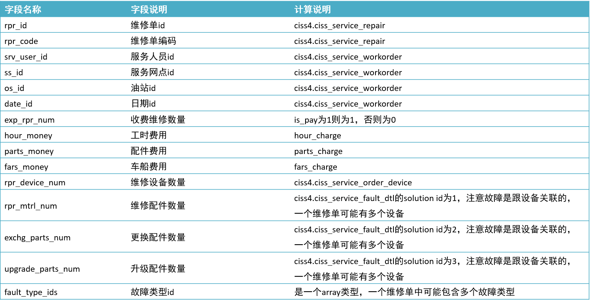
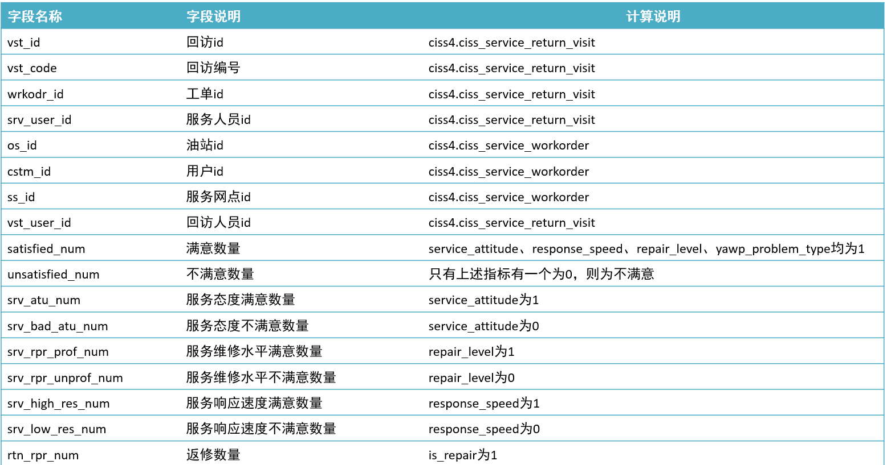
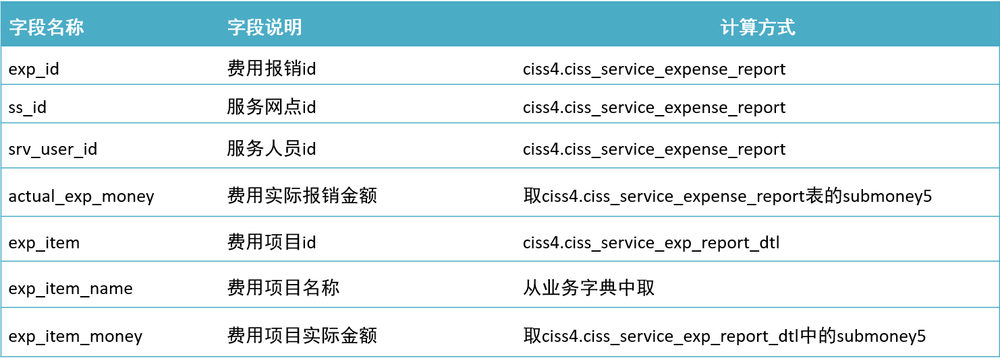
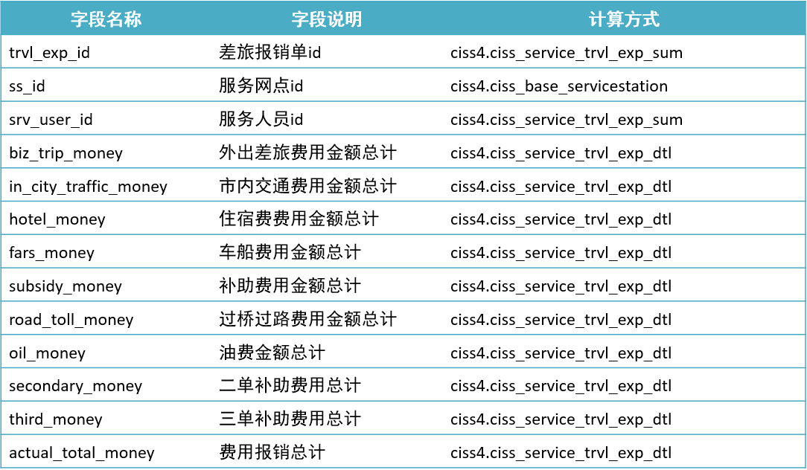
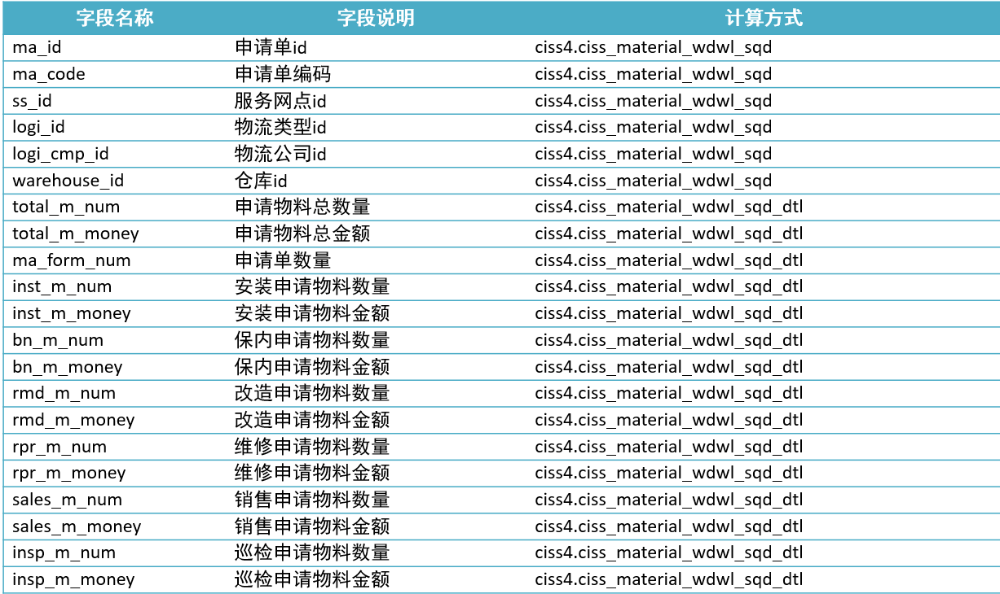
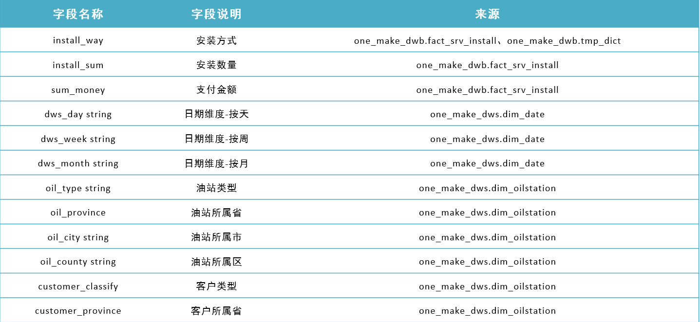
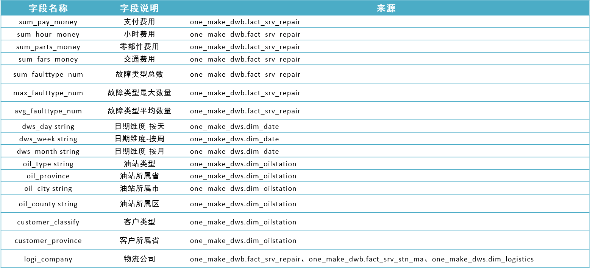

# DWB数仓主题事实层构建

## I. DWB层

### 1. 维修事务事实表

1. #### 需求分析

   - **目标**：**掌握DWB层维修事实指标表的构建需求分析**

   - **路径**

     - step1：目标需求
     - step2：数据来源

   - **实施**

     - **目标需求**：基于维修信息数据统计维修设备个数、维修、更换、升级配件数量、工时费用、配件费用等指标

       

     - **数据来源**

       - ciss_service_repair：维修信息表

         ```sql
         select
             id,--维修单id
             code,--维修单号
             service_id,--服务单id
             is_pay,--是否收费 1-收费，0-免费
             hour_charge,--工时费用
             parts_charge,--配件费用
             fares_charge --车船费用
         from ciss_service_repair;
         ```

       - **ciss_service_order**：服务单信息表

         ```sql
         select
           id,            --服务单id
           workorder_id,  --工单id
           type           --工单类型,1-安装，2-维修，3-巡检
         from ciss_service_order;
         ```

       - **ciss_service_workorder**：工单详情事实表

         ```sql
         select
             id,--工单id
             service_userid,--工程师id
             service_station_id,--服务站点id
             oil_station_id,--油站id
             create_time --创建时间
         from ciss_service_workorder;
         ```

       - **ciss_service_order_device**：服务单设备信息表

         ```sql
         select
             id,               --设备id
             service_order_id  --服务单id
         from ciss_service_order_device;
         ```

       - **ciss_service_fault_dtl**：设备故障信息表

         ```sql
         select
             serviceorder_device_id,--服务单设备id
             solution_id,--解决方案id,1-维修，2-更换，3-升级
             fault_type_id --故障分类id
         from ciss_service_fault_dtl;
         ```

   - **小结**

     - 掌握DWB层维修事实指标表的需求分析

2. #### 构建实现

   - **目标**：**实现DWB层维修事实指标表的构建**

   - **实施**

     - **建表**

       ```sql
       drop table if exists one_make_dwb.fact_srv_repair;
       create table if not exists one_make_dwb.fact_srv_repair(
           rpr_id string comment '维修单id'
           , rpr_code string comment '维修单编码'
           , srv_user_id string comment '服务人员用户id'
           , ss_id string comment '服务网点id'
           , os_id string comment '油站id'
           , date_id string comment '日期id'
           , exp_rpr_num string comment '收费维修数量'
           , hour_money int comment '工时费用'
           , parts_money int comment '配件费用'
           , fars_money int comment '车船费用'
           , rpr_device_num int comment '维修设备数量'
           , rpr_mtrl_num int comment '维修配件数量'
           , exchg_parts_num int comment '更换配件数量'
           , upgrade_parts_num int comment '升级配件数量'
           , fault_type_ids string comment '故障类型id集合'
       ) comment '维修单事实表'
       partitioned by (dt string)
       stored as orc
       location '/data/dw/dwb/one_make/fact_srv_repair';
       ```

     - **抽取**

       ```sql
       insert overwrite table one_make_dwb.fact_srv_repair partition(dt = '20210101')
       select
           repair.id rpr_id                                              --维修单id
       	, repair.code rpr_code                                        --维修单号
       	, swo.service_userid srv_user_id                              --工程师id
       	, swo.service_station_id ss_id                                --服务网点id
       	, swo.oil_station_id os_id                                    --油站id
       	, swo.create_time date_id                                     --创建时间
       	, case when repair.is_pay = 1 then 1 else 0 end exp_rpr_num   --收费维修数量
       	, repair.hour_charge hour_money                               --工时费用
       	, repair.parts_charge parts_money                             --配件费用
       	, repair.fares_charge fars_money                              --车船费用
       	, rpr_device_num                                              --维修设备数量
       	, rpr_mtrl_num                                                --维修配件数量
       	, exchg_parts_num                                             --更换配件数量
       	, upgrade_parts_num                                           --升级配件数量
       	, fault_type_ids                                              --故障类型id集合
       	--维修信息表
       from one_make_dwd.ciss_service_repair repair
       	--服务单信息表
           left join one_make_dwd.ciss_service_order sorder on repair.service_id = sorder.id
       	--工单信息表
           left join one_make_dwd.ciss_service_workorder swo on sorder.workorder_id = swo.id
       	--获取维修设备数量
           left join (
       		select
       			rep.id, count(rep.id) rpr_device_num
       		from one_make_dwd.ciss_service_repair rep
       		left join one_make_dwd.ciss_service_order sod on rep.service_id = sod.id
       		left join one_make_dwd.ciss_service_order_device dev on sod.id = dev.service_order_id
       		group by rep.id
           ) repairdvc on repair.id = repairdvc.id
       	--获取维修、更换、升级配件数量
           left join (
       		select
       			rep.id,
           	   sum(case when sfd.solution_id = 1 then 1 else 0 end) rpr_mtrl_num,
           	   sum(case when sfd.solution_id = 2 then 1 else 0 end) exchg_parts_num,
           	   sum(case when sfd.solution_id = 3 then 1 else 0 end) upgrade_parts_num
       		from one_make_dwd.ciss_service_repair rep
           	left join one_make_dwd.ciss_service_order sod on rep.service_id = sod.id
           	left join one_make_dwd.ciss_service_order_device dev on sod.id = dev.service_order_id
           	left join one_make_dwd.ciss_service_fault_dtl sfd on dev.id = sfd.serviceorder_device_id
       		group by dev.id,rep.id
           ) dvcnum on repair.id = dvcnum.id
       	--获取故障类型ID
           left join (
       		select
       			rep.id, concat_ws(',', collect_set(sfd.fault_type_id)) fault_type_ids
       		from one_make_dwd.ciss_service_repair rep
           	left join one_make_dwd.ciss_service_order sod on rep.service_id = sod.id
           	left join one_make_dwd.ciss_service_order_device dev on sod.id = dev.service_order_id
           	left join one_make_dwd.ciss_service_fault_dtl sfd on dev.id = sfd.serviceorder_device_id
       		where sfd.fault_type_id is not null
       		group by rep.id
           ) faulttype on repair.id = faulttype.id
       where repair.dt = '20210101'
       ;
       ```

   - **小结**

     - 实现DWB层维修事实指标表的构建

### 2. 客户回访事务事实表

1. #### 需求分析

   - **目标**：**掌握DWB层客户回访事实指标表的需求分析**

   - **路径**

     - step1：目标需求
     - step2：数据来源

   - **实施**

     - **目标需求**：基于客户回访数据统计工单满意数量、不满意数量、返修数量等指标

       

     - **数据来源**

       - **ciss_service_return_visit**：回访信息表

         ```sql
         select
             id,--回访id
             code,--回访编号
             workorder_id,--工单id
             create_userid, --回访人员id
             service_attitude,--服务态度
             response_speed,--响应速度
             repair_level,--服务维修水平
             is_repair --是否返修
         from ciss_service_return_visit;
         ```

         - 1：满意
         - 2：不满意

       - **ciss_service_workorder**：服务工单信息表

         ```sql
         select
             id,--工单id
             service_userid,--工程师id
             service_station_id,--服务站点id
             oil_station_id --油站id
         from ciss_service_workorder;
         ```

   - **小结**

     - 掌握DWB层客户回访事实指标表的需求分析

2. #### 构建实现

   - **目标**：**实现DWB层客户回访事实指标表的构建**

   - **实施**

     - **建表**

       ```sql
       -- 创建客户回访实时表
       drop table if exists one_make_dwb.fact_srv_rtn_visit;
       create table if not exists one_make_dwb.fact_srv_rtn_visit(
           vst_id string comment '回访id'
           , vst_code string comment '回访编号'
           , wrkodr_id string comment '工单id'
           , srv_user_id string comment '服务人员用户id'
           , os_id string comment '油站id'
           , ss_id string comment '服务网点id'
           , vst_user_id string comment '回访人员id'
           , satisfied_num int comment '满意数量'
           , unsatisfied_num int comment '不满意数量'
           , srv_atu_num int comment '服务态度满意数量'
           , srv_bad_atu_num int comment '服务态度不满意数量'
           , srv_rpr_prof_num int comment '服务维修水平满意数量'
           , srv_rpr_unprof_num int comment '服务维修水平不满意数量'
           , srv_high_res_num int comment '服务响应速度满意数量'
           , srv_low_res_num int comment '服务响应速度不满意数量'
           , rtn_rpr_num int comment '返修数量'
       ) comment '客户回访事实表'
       partitioned by (dt string)
       stored as orc
       location '/data/dw/dwb/one_make/fact_srv_rtn_visit';
       ```

     - **抽取**

       ```sql
       insert overwrite table one_make_dwb.fact_srv_rtn_visit partition(dt = '20210101')
       select
           visit.id vst_id                         --回访id
       	, visit.code vst_code                   --回访编号
       	, visit.workorder_id wrkodr_id          --工单id
       	, swo.service_userid srv_user_id        --工程师id
       	, swo.oil_station_id os_id              --油站id
       	, swo.service_station_id ss_id          --服务网点id
       	, visit.create_userid vst_user_id       --回访人员id
       	, satisfied_num                         --满意数量
       	, unsatisfied_num                       --不满意数量
       	, srv_atu_num                           --服务态度满意数量
       	, srv_bad_atu_num                       --服务态度不满意数量
       	, srv_rpr_prof_num                      --服务水平满意数量
       	, srv_rpr_unprof_num                    --服务水平不满意数量
       	, srv_high_res_num                      --服务响应速度满意数量
       	, srv_low_res_num                       --服务响应速度不满意数量
       	, rtn_rpr_num                           --返修数量
       --回访信息表
       from one_make_dwd.ciss_service_return_visit visit
       --工单信息表
       left join one_make_dwd.ciss_service_workorder swo on visit.workorder_id = swo.id
       --获取满意与不满意个数
       left join (
           select visit.workorder_id,
       	    sum(case when visit.service_attitude = 1 and visit.response_speed = 1 and visit.repair_level = 1 then 1 else 0 end) satisfied_num,
       	    sum(case when visit.service_attitude = 0 then 1 when visit.response_speed = 0 then 1 when visit.repair_level = 0 then 1 when visit.yawp_problem_type = 0 then 1 else 0 end) unsatisfied_num,
       	    sum(case when visit.service_attitude = 1 then 1 else 0 end) srv_atu_num,
       	    sum(case when visit.service_attitude = 0 then 1 else 0 end) srv_bad_atu_num,
       	    sum(case when visit.repair_level = 1 then 1 else 0 end) srv_rpr_prof_num,
       	    sum(case when visit.repair_level = 0 then 1 else 0 end) srv_rpr_unprof_num,
       	    sum(case when visit.response_speed = 1 then 1 else 0 end) srv_high_res_num,
       	    sum(case when visit.response_speed = 0 then 1 else 0 end) srv_low_res_num,
       	    sum(case when visit.is_repair = 1 then 1 else 0 end) rtn_rpr_num
           from one_make_dwd.ciss_service_return_visit visit
       	left join one_make_dwd.ciss_service_workorder swo on visit.workorder_id = swo.id
       	where visit.dt = '20210101'
       	group by visit.workorder_id
       ) vstswo on visit.workorder_id = vstswo.workorder_id
       where visit.dt = '20210101'
       ;
       ```

   - **小结**

     - 实现DWB层客户回访事实指标表的构建

### 3. 费用事务事实表

- **目标**：**实现DWB层费用报销事实指标表的构建**

- **路径**

  - step1：目标需求
  - step2：数据来源
  - step3：目标实现

- **实施**

  - **目标需求**：基于费用报销数据统计费用报销金额等指标

    

  - **数据来源**

    - **ciss_service_expense_report**：费用信息表

      ```sql
      select
          id,--报销单id
          create_user_id,--创建人id
          submoney5, --报销金额
          create_org_id --部门id
      from ciss_service_expense_report;
      ```

    - **ciss_base_servicestation**：服务网点信息表

      ```sql
      select
          id,--服务网点id
          org_id --部门id
      from ciss_base_servicestation;
      ```

    - **ciss_service_exp_report_dtl**：费用明细表

      ```sql
      select
          exp_report_id,--报销单id
          submoney5,--项目报销实际金额
          item_id --费用项目id
      from ciss_service_exp_report_dtl;
      ```

    - **tmp_dict**：数据字典表

      ```sql
      select
             dictid, --项目id
             dictname --项目名称
      from one_make_dwb.tmp_dict where dicttypename = '费用报销项目';
      ```

  - **目标实现**

    - **建表**

      ```sql
      drop table if exists one_make_dwb.fact_regular_exp;
      create table if not exists one_make_dwb.fact_regular_exp(
            exp_id string comment '费用报销id'
          , ss_id string comment '服务网点id'
          , srv_user_id string comment '服务人员id'
          , actual_exp_money decimal(20,1) comment '费用实际报销金额'
          , exp_item string comment '费用项目id'
          , exp_item_name string comment '费用项目名称'
          , exp_item_money decimal(20,1) comment '费用项目实际金额'
      )
      partitioned by (dt string)
      stored as orc
      location '/data/dw/dwb/one_make/fact_regular_exp';
      ```

    - **抽取**

      ```sql
      insert overwrite table one_make_dwb.fact_regular_exp partition(dt = '20210101')
      select
          /*+repartitions(1) */
          exp.id as exp_id                           --费用报销id
          , ss.id as ss_id                           --服务网点id
          , exp.create_user_id as srv_user_id        --创建人id
          , exp.submoney5 as actual_exp_money        --实际报销金额
          , dict.dictid as exp_item                  --费用项目id
          , dict.dictname as exp_item_name           --费用项目名称
          , exp_dtl.submoney5 as exp_item_money      --费用项目金额
      from
      --费用信息表
      (
          select
      	    *
      	from one_make_dwd.ciss_service_expense_report
          where dt = '20210101' and status = 9 --只取制证会计已审状态
      ) exp
      --服务网点信息表
      left join one_make_dwd.ciss_base_servicestation ss
      on ss.dt = '20210101' and ss.org_id = exp.create_org_id
      --报销明细表
      left join one_make_dwd.ciss_service_exp_report_dtl exp_dtl
      on exp_dtl.dt = '20210101' and exp.id = exp_dtl.exp_report_id
      --数据字典表
      left join one_make_dwb.tmp_dict dict
      on dict.dicttypename = '费用报销项目' and dict.dictid = exp_dtl.item_id
      ;
      ```

- **小结**

  - 实现DWB层费用报销事实指标表的构建

### 4. 差旅费用事务事实表

- **目标**：**实现DWB层差旅报销事实指标表的构建**

- **路径**

  - step1：目标需求
  - step2：数据来源
  - step3：目标实现

- **实施**

  - **目标需求**：基于差率报销信息统计交通费用、住宿费用、油费金额等报销费用指标

    

  - **数据来源**

    - ciss_service_trvl_exp_sum：差旅报销汇总信息表

      ```sql
      select
          id,--汇总费用报销单id
          user_id,--报销人id【工程师id】
          status,--汇总单状态：15表示审核通过
          submoney5 --应收报销总金额
      from one_make_dwd.ciss_service_trvl_exp_sum;
      ```

    - ciss_s_exp_report_wo_payment：汇总报销单与工单费用单对照表

      ```sql
      select
          exp_report_id,--汇总费用报销单id
          workorder_travel_exp_id --费用单id
      from one_make_dwd.ciss_s_exp_report_wo_payment;
      ```

    - ciss_service_travel_expense：差旅报销单信息表

      ```sql
      select
          id,--费用单id
          work_order_id --工单id
      from one_make_dwd.ciss_service_travel_expense;
      ```

    - ciss_service_workorder：工单信息表

      ```sql
      select
          id,--工单id
      service_station_id --服务网点id
      from one_make_dwd.ciss_service_workorder;
      ```

    - ciss_service_trvl_exp_dtl：差旅费用明细表

      ```sql
      select
          travel_expense_id,--费用单id
          item,--费用项目名称
          submoney5 --费用金额
      from one_make_dwd.ciss_service_trvl_exp_dtl;
      ```

  - **目标实现**

    - **建表**

      ```sql
      drop table if exists one_make_dwb.fact_trvl_exp;
      create table if not exists one_make_dwb.fact_trvl_exp(
          trvl_exp_id string comment '差旅报销单id'
          , ss_id string comment '服务网点id'
        , srv_user_id string comment '服务人员id'
          , biz_trip_money decimal(20,1) comment '外出差旅费用金额总计'
        , in_city_traffic_money decimal(20,1) comment '市内交通费用金额总计'
          , hotel_money decimal(20,1) comment '住宿费费用金额总计'
        , fars_money decimal(20,1) comment '车船费用金额总计'
          , subsidy_money decimal(20,1) comment '补助费用金额总计'
          , road_toll_money decimal(20,1) comment '过桥过路费用金额总计'
          , oil_money decimal(20,1) comment '油费金额总计'
          , secondary_money decimal(20,1) comment '二单补助费用总计'
          , third_money decimal(20,1) comment '三单补助费用总计'
          , actual_total_money decimal(20,1) comment '费用报销总计'
      )
      partitioned by (dt string)
      stored as orc
      location '/data/dw/dwb/one_make/fact_trvl_exp';
      ```

    - **抽取**

      ```sql
      insert overwrite table one_make_dwb.fact_trvl_exp partition(dt = '20210101')
      select
      	--差旅费汇总单id
          exp_sum.id as trvl_exp_id
      	--服务网点id
          , wrk_odr.service_station_id as ss_id
      	--服务人员id
          , exp_sum.user_id as srv_user_id
      	--外出差旅费用金额总计
          , sum(case when trvl_dtl_sum.item = 1 then trvl_dtl_sum.item_money else 0 end) as biz_trip_money
          --市内交通费用金额总计
      	, sum(case when trvl_dtl_sum.item = 2 then trvl_dtl_sum.item_money else 0 end) as in_city_traffic_money
          --住宿费费用金额总计
      	, sum(case when trvl_dtl_sum.item = 3 then trvl_dtl_sum.item_money else 0 end) as hotel_money
          --车船费用金额总计
      	, sum(case when trvl_dtl_sum.item = 4 then trvl_dtl_sum.item_money else 0 end) as fars_money
          --补助费用金额总计
      	, sum(case when trvl_dtl_sum.item = 5 then trvl_dtl_sum.item_money else 0 end) as subsidy_money
          --过桥过路费用金额总计
      	, sum(case when trvl_dtl_sum.item = 6 then trvl_dtl_sum.item_money else 0 end) as road_toll_money
          --油费金额总计
      	, sum(case when trvl_dtl_sum.item = 7 then trvl_dtl_sum.item_money else 0 end) as oil_money
          --二单补助费用总计
      	, sum(case when trvl_dtl_sum.item = 8 then trvl_dtl_sum.item_money else 0 end) as secondary_money
          --三单补助费用总计
      	, sum(case when trvl_dtl_sum.item = 9 then trvl_dtl_sum.item_money else 0 end) as third_money
          --费用报销总计
      	, max(exp_sum.submoney5) as actual_total_money
      --差旅报销汇总单
      from one_make_dwd.ciss_service_trvl_exp_sum exp_sum
      --汇总报销单与工单费用单对照表
      inner join one_make_dwd.ciss_s_exp_report_wo_payment r on exp_sum.dt = '20210101' and r.dt = '20210101' and exp_sum.id = r.exp_report_id and exp_sum.status = 15
      --差旅报销单信息表
      inner join one_make_dwd.ciss_service_travel_expense exp on exp.dt = '20210101' and exp.id = r.workorder_travel_exp_id
      --工单信息表
      inner join one_make_dwd.ciss_service_workorder wrk_odr on wrk_odr.dt = '20210101' and wrk_odr.id = exp.work_order_id
      --获取每种费用项目总金额
      inner join  (
      				select
      					travel_expense_id, item, sum(submoney5) as item_money
      				from one_make_dwd.ciss_service_trvl_exp_dtl
      				where dt = '20210101'
      				group by travel_expense_id, item
      		) as trvl_dtl_sum
        on trvl_dtl_sum.travel_expense_id = exp.id
      group by exp_sum.id, wrk_odr.service_station_id, exp_sum.user_id
      ;
        
      ```

- **小结**

  - 实现DWB层差旅报销事实指标表的构建

### 5. 网点物料事实表

- **目标**：**实现DWB层网点物料事实指标表的构建**

- **路径**

  - step1：目标需求
  - step2：数据来源
  - step3：目标实现

- **实施**

  - **目标需求**：基于物料申请单的信息统计物料申请数量、物料申请金额等指标

    

  - **数据来源**

    - ciss_material_wdwl_sqd：物料申请信息表

      ```sql
      select
          id,--申请单id
          code,--申请单编号
          service_station_code,--服务网点编号
          logistics_type,--物流公司类型
          logistics_company,--物流公司名称
          warehouse_code --仓库id
      from ciss_material_wdwl_sqd;
      ```

    - **ciss_base_servicestation**：服务网点信息表

      ```sql
      select
          id,--服务网点id
          code --服务网点编号
      from ciss_base_servicestation;
      ```

    - **ciss_material_wdwl_sqd_dtl**：物料申请明细表

      ```sql
      select
          wdwl_sqd_id,--申请单id
          application_reason,--申请理由
          count_approve,--审核数量
          price,--单价
          count --个数
      from ciss_material_wdwl_sqd_dtl;
      ```

  - **目标实现**

    - **建表**

      ```sql
      create table if not exists one_make_dwb.fact_srv_stn_ma(
            ma_id string comment '申请单id'
          , ma_code string comment '申请单编码'
          , ss_id string comment '服务网点id'
          , logi_id string comment '物流类型id'
          , logi_cmp_id string comment '物流公司id'
          , warehouse_id string comment '仓库id'
          , total_m_num decimal(10,0) comment '申请物料总数量'
          , total_m_money decimal(10,1) comment '申请物料总金额'
          , ma_form_num decimal(10,0) comment '申请单数量'
          , inst_m_num decimal(10,0) comment '安装申请物料数量'
          , inst_m_money decimal(10,1) comment '安装申请物料金额'
          , bn_m_num decimal(10,0) comment '保内申请物料数量'
          , bn_m_money decimal(10,1) comment '保内申请物料金额'
          , rmd_m_num decimal(10,0) comment '改造申请物料数量'
          , rmd_m_money decimal(10,1) comment '改造申请物料金额'
          , rpr_m_num decimal(10,0) comment '维修申请物料数量'
          , rpr_m_money decimal(10,1) comment '维修申请物料金额'
          , sales_m_num decimal(10,0) comment '销售申请物料数量'
          , sales_m_money decimal(10,1) comment '销售申请物料金额'
          , insp_m_num decimal(10,0) comment '巡检申请物料数量'
          , insp_m_money decimal(10,1) comment '巡检申请物料金额'
      )
      partitioned by (dt string)
      stored as orc
      location '/data/dw/dwb/one_make/fact_srv_stn_ma';
      ```

    - **抽取**

      ```sql
      insert overwrite table one_make_dwb.fact_srv_stn_ma partition(dt = '20210101')
      select    
      	/*+repartition(1) */ 
          ma.id as ma_id, 	                       --物料申请单id
      	ma.code as ma_code,                        --申请单编号
      	stn.id as ss_id,                           --服务网点id
      	ma.logistics_type as logi_id,              --物流类型id
      	ma.logistics_company as logi_cmp_id,       --物流公司id
          ma.warehouse_code as warehouse_id,         --仓库id
      	sum(m_smry.cnt) as total_m_num ,           --申请物料总数量
      	sum(m_smry.money) as total_m_money,        --申请物料总金额
          count(1) as ma_form_num,                   --申请单数量
      	sum(case when m_smry.ma_rsn = 1 then m_smry.cnt else 0 end) as inst_m_num,        --安装申请物料数量   
          sum(case when m_smry.ma_rsn = 1 then m_smry.money else 0 end) as inst_m_money,    --安装申请物料金额
          sum(case when m_smry.ma_rsn = 2 then m_smry.cnt else 0 end) as bn_m_num,          --保内申请物料数量
          sum(case when m_smry.ma_rsn = 2 then m_smry.money else 0 end) as bn_m_money,      --保内申请物料金额
          sum(case when m_smry.ma_rsn = 3 then m_smry.cnt else 0 end) as rmd_m_num,         --改造申请物料数量
          sum(case when m_smry.ma_rsn = 3 then m_smry.money else 0 end) as rmd_m_money,     --改造申请物料金额
          sum(case when m_smry.ma_rsn = 4 then m_smry.cnt else 0 end) as rpr_m_num,         --维修申请物料数量
          sum(case when m_smry.ma_rsn = 4 then m_smry.money else 0 end) as rpr_m_money,     --维修申请物料金额
          sum(case when m_smry.ma_rsn = 5 then m_smry.cnt else 0 end) as sales_m_num,       --销售申请物料数量
          sum(case when m_smry.ma_rsn = 5 then m_smry.money else 0 end) as sales_m_money,   --销售申请物料金额
          sum(case when m_smry.ma_rsn = 6 then m_smry.cnt else 0 end) as insp_m_num,        --巡检申请物料数量
          sum(case when m_smry.ma_rsn = 6 then m_smry.money else 0 end) as insp_m_money     --巡检申请物料金额
      --物料申请信息表:8为审核通过
      from (
      		select * 
      		from one_make_dwd.ciss_material_wdwl_sqd 
      		where dt = '20210101' and status = 8 
      	 ) ma
      --关联站点信息表，获取站点id
      left join one_make_dwd.ciss_base_servicestation stn 
      	on stn.dt = '20210101' and ma.service_station_code = stn.code
      --关联物料申请费用明细
      left join (
      			 select 
      				dtl.wdwl_sqd_id as wdwl_sqd_id, 
      				dtl.application_reason as ma_rsn, 
      				sum(dtl.count_approve) as cnt,
                      sum(dtl.price * dtl.count) as money
                   from one_make_dwd.ciss_material_wdwl_sqd_dtl dtl
      			 where dtl.dt = '20210101'
      			 group by dtl.wdwl_sqd_id, dtl.application_reason
                ) m_smry on m_smry.wdwl_sqd_id = ma.id
      group by ma.id, ma.code, stn.id, ma.logistics_type, ma.logistics_company, ma.warehouse_code
      ;
      ```

- **小结**

  - 实现DWB层网点物料事实指标表的构建

## II. ST层构建: 周期快照事实表

- **目标**：**掌握ST层的设计**

- **路径**

  - step1：功能
  - step2：来源
  - step3：需求

- **实施**

  - **功能**：数据应用层，用于支撑对外所有主题的==报表==应用数据的结果

    - **对外提供整个公司所有运营的报表**

  - **来源**：对DWB层的主题事实数据关联DWS层的维度表进行最终聚合

    - DWS：维度表：时间、地区、油站、组织机构

      - 时间维度表：年、季度、月、周、天

        ```
        dt				year    quater		month    		week  
        2022-01-01		2022	Q1			2022-01			1
        ```

    - DWB：主题事实表：工单、呼叫中心、费用

      - 工单主题表：天、工单id、工单个数【1】

        ```
        dt		wokerorder_id		wo_cnt		install_cnt  rep_cnt  ins_cnt   rem_cnt
        								1			1			0		0			0
        ```

    - ST：每个月对应的工单总个数

      ```
      select
      	b.month,
      	sum(wo_cnt),
      	sum(install_cnt)
      	……
      from fact_workorder a
      join dim_time b on a.dt = b.dt
      group by b.month
      ```

  - **需求**：按照一站制造的业务主题的划分需求，构建每个主题的ST层的数据

- **小结**

  - 掌握ST层的设计

### 1. 工单主题

1. #### 需求分析

   - **目标**：**掌握工单主题的需求分析**

   - **路径**

     - step1：需求
     - step2：分析

   - **实施**

     - **需求**：统计不同维度下的工单主题指标的结果

       | 字段名称                  | 字段说明                | 来源                           |
       | ------------------------- | ----------------------- | ------------------------------ |
       | owner_process             | 派工方式-自己处理数量   | one_make_dwb.fact_call_service |
       | tran_process              | 派工方式-转派工数量     | one_make_dwb.fact_call_service |
       | wokerorder_num            | 工单总数sum             | one_make_dwb.fact_worker_order |
       | wokerorder_num_max        | 工单总数最大值max       | one_make_dwb.fact_worker_order |
       | wokerorder_num_min        | 工单总数最小值min       | one_make_dwb.fact_worker_order |
       | wokerorder_num_avg        | 工单总数平均值avg       | one_make_dwb.fact_worker_order |
       | install_sumnum            | 派工类型-安装总数       | one_make_dwb.fact_worker_order |
       | repair_sumnum             | 派工类型-维修总数       | one_make_dwb.fact_worker_order |
       | remould_sumnum            | 派工类型-巡检总数       | one_make_dwb.fact_worker_order |
       | inspection_sumnum         | 派工类型-改造总数       | one_make_dwb.fact_worker_order |
       | alread_complete_sumnum    | 完工总数                | one_make_dwb.fact_worker_order |
       | customer_classify_zsh     | 客户类型-中石化数量     | one_make_dws.dim_oilstation    |
       | customer_classify_jxs     | 客户类型-经销商数量     | one_make_dws.dim_oilstation    |
       | customer_classify_qtzx    | 客户类型-其他直销数量   | one_make_dws.dim_oilstation    |
       | customer_classify_zsy     | 客户类型-中石油数量     | one_make_dws.dim_oilstation    |
       | customer_classify_qtwlh   | 客户类型-其他往来户数量 | one_make_dws.dim_oilstation    |
       | customer_classify_zhjt    | 客户类型-中化集团数量   | one_make_dws.dim_oilstation    |
       | customer_classify_zhy     | 客户类型-中海油数量     | one_make_dws.dim_oilstation    |
       | customer_classify_gys     | 客户类型-供应商数量     | one_make_dws.dim_oilstation    |
       | customer_classify_onemake | 客户类型-一站制造**数量 | one_make_dws.dim_oilstation    |
       | customer_classify_fwy     | 客户类型-服务员数量     | one_make_dws.dim_oilstation    |
       | customer_classify_zt      | 客户类型-中铁数量       | one_make_dws.dim_oilstation    |
       | customer_classify_hzgs    | 客户类型-合资公司数量   | one_make_dws.dim_oilstation    |
       | customer_classify_jg      | 客户类型-军供数量       | one_make_dws.dim_oilstation    |
       | customer_classify_zhhangy | 客户类型-中航油数量     | one_make_dws.dim_oilstation    |
       | dws_day string            | 日期维度-按天           | one_make_dws.dim_date          |
       | dws_week string           | 日期维度-按周           | one_make_dws.dim_date          |
       | dws_month string          | 日期维度-按月           | one_make_dws.dim_date          |
       | oil_type string           | 油站类型                | one_make_dws.dim_oilstation    |
       | oil_province              | 油站所属省              | one_make_dws.dim_oilstation    |
       | oil_city string           | 油站所属市              | one_make_dws.dim_oilstation    |
       | oil_county string         | 油站所属区              | one_make_dws.dim_oilstation    |
       | customer_classify         | 客户类型                | one_make_dws.dim_oilstation    |
       | customer_province         | 客户所属省              | one_make_dws.dim_oilstation    |

     - **分析**

       - **指标**

         - 工单自处理个数、工单转派工个数【呼叫中心主题事务事实表】
         - 工单总数、最大值、最小值、平均值
         - 安装总数、维修总数、巡检总数、改造总数、完工总数
         - 中石化数量、经销商数量、其他直销数量、中石油数量、其他往来户数量、中化集团数量、中海油数量
         - 供应商数量、一站制造数量、服务工程师数量、中铁数量、合资公司数量、军供数量、中航油数量

       - **维度**

         - 日期维度：天、周、月
         - 油站维度：类型、省份、城市、地区、类型、省份

       - **数据表**

         - 事实表

           - fact_worker_order：工单事实表

             ```sql
             select
                 wo_num, --工单数量
                 callaccept_id,--来电受理单id
                 oil_station_id, --油站id
                 dt --日期
             from fact_worker_order;
             ```

           - fact_call_service：呼叫中心事实表

             ```sql
             select
                 id,--来电受理单id
               process_way_name --处理方式
             from fact_call_service;  
             ```

         - 维度表

           - dim_oilstation：油站维度表

             ```sql
             select
                 id,--油站id
                 company_name,--公司名称
                 province_name,--省份名称
                 city_name,--城市名称
                 county_name,--区域名称
                 customer_classify_name,--客户名称
                 customer_province_name--客户省份
             from dim_oilstation;
             ```

           - dim_date：时间维度表

             ```sql
             select
                 date_id,--天
                 week_in_year_id,--周
               year_month_id --月
             from dim_date;
             ```

           - 实现分析【不能运行】

             ```sql
             select
                 sum(case when b.process_way_name = '自己处理' then 1 else 0 end) as self_process ,
                 sum(case when b.process_way_name = '转派工' then 1 else 0 end) as change_process ,
                 sum(wo_num), --工单数量
                 max(wo_num),
                 min(wo_num),
                 avg(wo_num),
                 sum(install_num),
                 sum(repair_num),
                 sum(inspection_num),
                 sum(remould_num),
                 sum(case when c.customer_classify_name = '中石化' then 1 else 0 end ) as zsh_cnt,
                 callaccept_id,--来电受理单id
                 c.id,c.customer_province_name,c.customer_classify_name,c.county_name,c.city_name,c.province_name,c.company_name,
                 oil_station_id, --油站id
                 d.year_month_id,d.week_in_year_id,d.date_id
             from fact_worker_order a
             join (select
                     id,--来电受理单id
                     process_way_name --处理方式
                 from fact_call_service) b
             on a.callaccept_id = b.id
             join (select
                     id,--油站id
                     company_name,--公司名称
                     province_name,--省份名称
                     city_name,--城市名称
                     county_name,--区域名称
                     customer_classify_name,--客户名称
                     customer_province_name--客户省份
                 from one_make_dws.dim_oilstation) c
             on a.oil_station_id = c.id
             join (select
                     date_id,--天
                     week_in_year_id,--周
                   year_month_id --月
                 from one_make_dws.dim_date) d
             on a.dt = d.date_id
             group by c.id,c.customer_province_name,c.customer_classify_name,c.county_name,c.city_name,c.province_name,c.company_name,
                      d.year_month_id,d.week_in_year_id,d.date_id;
             
             -- 天 + 油站
             -- 月 + 油站
             -- 周 + 油站
             ```

   - **小结**

     - 掌握工单主题的需求分析

2. #### 构建实现

   - **目标**：**实现工单主题表的维度指标构建**

   - **实施**

     - **建库**

       ```sql
       create database if not exists one_make_st;
       ```

     - **建表**

       ```sql
       -- 创建工单主题表
       drop table if exists one_make_st.subj_worker_order;
       create table if not exists one_make_st.subj_worker_order(
           owner_process bigint comment '派工方式-自己处理数量'
           ,tran_process bigint comment '派工方式-转派工数量'
           ,wokerorder_num bigint comment '工单总数'
           ,wokerorder_num_max int comment '工单总数最大值'
           ,wokerorder_num_min int comment '工单总数最小值'
           ,wokerorder_num_avg int comment '工单总数平均值'
           ,install_sumnum bigint comment '派工类型-安装总数'
           ,repair_sumnum bigint comment '派工类型-维修总数'
           ,remould_sumnum bigint comment '派工类型-巡检总数'
           ,inspection_sumnum bigint comment '派工类型-改造总数'
           ,alread_complete_sumnum bigint comment '完工总数'
           ,customer_classify_zsh bigint comment '客户类型-中石化数量'
           ,customer_classify_jxs bigint comment '客户类型-经销商数量'
           ,customer_classify_qtzx bigint comment '客户类型-其他直销数量'
           ,customer_classify_zsy bigint comment '客户类型-中石油数量'
           ,customer_classify_qtwlh bigint comment '客户类型-其他往来户数量'
           ,customer_classify_zhjt bigint comment '客户类型-中化集团数量'
           ,customer_classify_zhy bigint comment '客户类型-中海油数量'
           ,customer_classify_gys bigint comment '客户类型-供应商数量'
           ,customer_classify_onemake bigint comment '客户类型-一站制造**数量'
           ,customer_classify_fwy bigint comment '客户类型-服务员数量'
           ,customer_classify_zt bigint comment '客户类型-中铁数量'
           ,customer_classify_hzgs bigint comment '客户类型-合资公司数量'
           ,customer_classify_jg bigint comment '客户类型-军供数量'
           ,customer_classify_zhhangy bigint comment '客户类型-中航油数量'
           ,dws_day string comment '日期维度-按天'
           ,dws_week string comment '日期维度-按周'
           ,dws_month string comment '日期维度-按月'
           ,oil_type string comment '油站维度-油站类型'
           ,oil_province string comment '油站维度-油站所属省'
           ,oil_city string comment '油站维度-油站所属市'
           ,oil_county string comment '油站维度-油站所属区'
           ,customer_classify string comment '客户维度-客户类型'
           ,customer_province string comment '客户维度-客户所属省'
       ) comment '工单主题表'
       partitioned by (month String, week String, day String)
       stored as orc
       location '/data/dw/st/one_make/subj_worker_order'
       ;
       ```

     - **构建**

       ```sql
       insert overwrite table one_make_st.subj_worker_order partition(month = '202101', week='2021W1', day='20210101')
       select
         sum(case when fcs.process_way_name = '自己处理' then 1 else 0 end) owner_process, --工单自处理个数
       	sum(case when fcs.process_way_name = '转派工' then 1 else 0 end) tran_process,    --工单转派工个数
       	sum(fwo.wo_num) wokerorder_num,                                      --工单总数
       	max(fwo.wo_num) wokerorder_num_max,                                  --最大值
           min(fwo.wo_num) wokerorder_num_min,                                  --最小值
       	avg(fwo.wo_num) wokerorder_num_avg,                                  --平均值
       	sum(fwo.install_num) install_sumnum,                                     --安装总数
       	sum(fwo.repair_num) repair_sumnum,                                       --维修总数
           sum(fwo.remould_num) remould_sumnum,                                     --巡检总数
       	sum(fwo.inspection_num) inspection_sumnum,                               --改造总数
       	sum(fwo.alread_complete_num) alread_complete_sumnum,                     --完工总数
           sum(case when oil.customer_classify_name ='中石化' then 1 else 0 end) customer_classify_zsh,       --中石化数量
       	sum(case when oil.customer_classify_name ='经销商' then 1 else 0 end) customer_classify_jxs,       --经销商数量
           sum(case when oil.customer_classify_name ='其他直销' then 1 else 0 end) customer_classify_qtzx,      --其他直销数量
       	sum(case when oil.customer_classify_name ='中石油' then 1 else 0 end) customer_classify_zsy,       --中石油数量
           sum(case when oil.customer_classify_name ='其他往来户' then 1 else 0 end) customer_classify_qtwlh,     --其他往来户数量
       	sum(case when oil.customer_classify_name ='中化集团' then 1 else 0 end) customer_classify_zhjt,      --中化集团数量
           sum(case when oil.customer_classify_name ='中海油' then 1 else 0 end) customer_classify_zhy,       --中海油数量
       	sum(case when oil.customer_classify_name ='供应商' then 1 else 0 end) customer_classify_gys,        --供应商数量
           sum(case when oil.customer_classify_name ='一站制造**' then 1 else 0 end) customer_classify_onemake,     --一站制造数量
       	sum(case when oil.customer_classify_name ='服务工程师' then 1 else 0 end) customer_classify_fwy,          --服务工程师数量
           sum(case when oil.customer_classify_name ='中铁' then 1 else 0 end) customer_classify_zt,           --中铁数量
       	sum(case when oil.customer_classify_name ='合资公司' then 1 else 0 end) customer_classify_hzgs,         --合资公司数量
           sum(case when oil.customer_classify_name ='军供' then 1 else 0 end) customer_classify_jg,             --军供数量
       	sum(case when oil.customer_classify_name ='中航油' then 1 else 0 end) customer_classify_zhhangy,         --中航油数量
           dd.date_id dws_day,                                                  --时间天
       	dd.week_in_year_id dws_week,                                         --时间周
       	dd.year_month_id dws_month,                                          --时间月
       	oil.company_name oil_type,                                           --油站类型
       	oil.province_name oil_province,                                      --油站省份
           oil.city_name oil_city,                                              --油站城市
       	oil.county_name oil_county,                                          --油站地区
       	oil.customer_classify_name customer_classify,                        --客户类型
       	oil.customer_province_name customer_province                         --客户省份
       --工单事务事实表
       from one_make_dwb.fact_worker_order fwo
       --获取自处理个数,转派单个数
       left join one_make_dwb.fact_call_service fcs on fwo.callaccept_id = fcs.id
       --关联日期维度
       left join one_make_dws.dim_date dd on fwo.dt = dd.date_id
       --关联油站维度
       left join one_make_dws.dim_oilstation oil on fwo.oil_station_id = oil.id
       where dd.year_month_id = '202101'and dd.week_in_year_id = '2021W1' and  dd.date_id = '20210101'
       --按照维度字段分组
       group by dd.date_id, dd.week_in_year_id, dd.year_month_id, oil.company_name, oil.province_name, oil.city_name, oil.county_name,oil.customer_classify_name, oil.customer_province_name
       ;
       ```

   - **小结**

     - 实现工单主题表的维度指标构建

### 2. 油站主题

1. #### 需求分析

   - **目标**：**掌握油站主题的需求分析**

   - **路径**

     - step1：需求
     - step2：分析

   - **实施**

     - **需求**：统计不同维度下的油站主题指标的结果

       

     - **分析**

       - **指标**：油站数量、新增油站数量
       - **维度**
         - 日期维度：天、周、月
         - 油站维度：类型、省份、城市、地区、客户类型、省份

   - **数据表**

     - 事实表

       - fact_oil_station：油站事实表

         ```sql
             select
                 os_id, --油站id
                 os_num,--油站个数
                 current_new_os_num, --新增油站个数
                 dt --日期天
         from  fact_oil_station;
         ```

     - 维度表

       - dim_oilstation：油站维度表

         ```sql
         select
                 id,--油站id
                 company_name,--公司名称
                 province_name,--省份名称
                 city_name,--城市名称
                 county_name,--区域名称
                 customer_classify_name,--客户名称
                 customer_province_name--客户省份
             from dim_oilstation;
         ```

       - dim_date：时间维度表

         ```sql
         select
                 date_id,--天
               week_in_year_id,--周
                 year_month_id --月
             from dim_date;
         ```

   - **小结**

     - 掌握油站主题的需求分析

2. #### 构建实现

   - **目标**：**实现油站主题表的维度指标构建**

   - **实施**

     - **建表**

       ```sql
       -- 创建油站主题表
       drop table if exists one_make_st.subj_oilstation;
       create table if not exists one_make_st.subj_oilstation(
           sum_osnum bigint comment '油站数量'
           ,sumnew_osnum int comment '新增油站数量'
           ,dws_day string comment '日期维度-按天'
           ,dws_week string comment '日期维度-按周'
           ,dws_month string comment '日期维度-按月'
           ,oil_type string comment '油站维度-油站类型'
           ,oil_province string comment '油站维度-油站所属省'
           ,oil_city string comment '油站维度-油站所属市'
           ,oil_county string comment '油站维度-油站所属区'
           ,customer_classify string comment '客户维度-客户类型'
           ,customer_province string comment '客户维度-客户所属省'
       ) comment '油站主题表'
       partitioned by (month String, week String, day String)
       stored as orc
       location '/data/dw/st/one_make/subj_oilstation';
       ```

     - **构建**

       ```sql
       insert overwrite table one_make_st.subj_oilstation partition(month = '202101', week='2021W1', day='20210101')
       select
           sum(oil.os_num) sum_osnum,                          --油站数量
       	sum(oil.current_new_os_num) sumnew_osnum,           --新增油站数量
           dd.date_id dws_day,                                 --日期天
       	dd.week_in_year_id dws_week,                        --日期周
       	dd.year_month_id dws_month,                         --日期月
           dimoil.company_name oil_type,                       --油站类型
       	dimoil.province_name oil_province,                  --油站省份
       	dimoil.city_name oil_city,                          --油站城市
           dimoil.county_name oil_county,                      --油站区域
       	dimoil.customer_classify_name customer_classify,    --客户类型
           dimoil.customer_province_name customer_province     --客户省份
       --油站事务事实表
       from one_make_dwb.fact_oil_station oil
       --关联日期维度表
       left join one_make_dws.dim_date dd on oil.dt = dd.date_id
       --关联油站维度表
       left join one_make_dws.dim_oilstation dimoil on oil.os_id = dimoil.id
       where dd.year_month_id = '202101'and dd.week_in_year_id = '2021W1' and  dd.date_id = '20210101'
       --按照维度字段分组
       group by dd.date_id, dd.week_in_year_id, dd.year_month_id,  dimoil.company_name, dimoil.province_name, dimoil.city_name, dimoil.county_name, dimoil.customer_classify_name, dimoil.customer_province_name;
       ```

   - **小结**

     - 实现油站主题表的维度指标构建

### 3. 回访主题

1. #### 需求分析

   - **目标**：**掌握回访主题的需求分析**

   - **路径**

     - step1：需求
     - step2：分析

   - **实施**

     - **需求**：统计不同维度下的回访主题指标的结果

       | 字段名称            | 字段说明                  | 来源                            |
       | ------------------- | ------------------------- | ------------------------------- |
       | rtn_srv_num         | 回访服务人员数量          | one_make_dwb.fact_srv_rtn_visit |
       | vst_user            | 回访人员数量              | one_make_dwb.fact_srv_rtn_visit |
       | wait_dispatch_num   | 待派工数量                | one_make_dwb.fact_worker_order  |
       | wait_departure_num  | 待出发数量                | one_make_dwb.fact_worker_order  |
       | alread_complete_num | 已完工工单数量            | one_make_dwb.fact_worker_order  |
       | processing_num      | 正在处理工单数量          | one_make_dwb.fact_worker_order  |
       | satisfied_num       | 满意数量                  | one_make_dwb.fact_srv_rtn_visit |
       | unsatisfied_num     | 不满意数量                | one_make_dwb.fact_srv_rtn_visit |
       | srv_atu_num         | 服务态度满意数量          | one_make_dwb.fact_srv_rtn_visit |
       | srv_bad_atu_num     | 服务态度不满意数量        | one_make_dwb.fact_srv_rtn_visit |
       | srv_rpr_prof_num    | 服务维修水平满意数量      | one_make_dwb.fact_srv_rtn_visit |
       | srv_rpr_unprof_num  | 服务维修水平不满意数量    | one_make_dwb.fact_srv_rtn_visit |
       | srv_high_res_num    | 服务响应速度满意数量      | one_make_dwb.fact_srv_rtn_visit |
       | srv_low_res_num     | 服务响应速度不满意数量    | one_make_dwb.fact_srv_rtn_visit |
       | rtn_rpr_num         | 返修数量                  | one_make_dwb.fact_srv_rtn_visit |
       | max_vst_user        | 回访人员最大数量          | one_make_dwb.fact_srv_rtn_visit |
       | min_vst_user        | 回访人员最小数量          | one_make_dwb.fact_srv_rtn_visit |
       | dws_day string      | 日期维度-按天             | one_make_dws.dim_date           |
       | dws_week string     | 日期维度-按周             | one_make_dws.dim_date           |
       | dws_month string    | 日期维度-按月             | one_make_dws.dim_date           |
       | orgname             | 组织机构-回访人员所属部门 | one_make_dws.dim_emporg         |
       | posiname            | 组织机构-回访人员所属岗位 | one_make_dws.dim_emporg         |
       | posiname            | 组织机构-回访人员名称     | one_make_dws.dim_emporg         |
       | oil_type string     | 油站类型                  | one_make_dws.dim_oilstation     |
       | oil_province        | 油站所属省                | one_make_dws.dim_oilstation     |
       | oil_city string     | 油站所属市                | one_make_dws.dim_oilstation     |
       | oil_county string   | 油站所属区                | one_make_dws.dim_oilstation     |
       | customer_classify   | 客户类型                  | one_make_dws.dim_oilstation     |
       | customer_province   | 客户所属省                | one_make_dws.dim_oilstation     |

     - **分析**

       - 指标

         - 回访工程师数量、回访人员数量、回访人员最大数量、回访人员最小数量
           - 回访事务事实表
         - 待派工数量、待出发数量、已完工数量、处理中数量
           - 工单事务事实表
         - 满意数量、不满意数量、态度满意数量、态度不满意数量、水平满意数量、水平不满意数量、响应速度满意数量、响应速度不满意数量、返修数量
           - 回访事务事实表

       - 维度

         - 日期维度：天、周、月
           - 日期维度表
         - 组织机构维度：人员部门、人员岗位、人员姓名
           - 组织机构维度表
         - 油站维度：类型、省份、城市、区域、类型、省份
           - 油站维度表

       - 数据

         - 事实表

           - fact_srv_rtn_visit：回访事务事实表

             ```sql
             select
                 srv_user_id,--工程师id
                 vst_user_id,--回访人员id
                 satisfied_num,--满意个数
                 unsatisfied_num,--不满意个数
                 srv_atu_num,--态度满意个数
                 srv_bad_atu_num,--态度不满意个数
                 srv_rpr_prof_num,--水平满意个数
                 srv_rpr_unprof_num,--水平不满意个数
                 srv_high_res_num,--响应速度满意个数
                 srv_low_res_num,--响应速度不满意个数
                 rtn_rpr_num, --返修数量
                 wrkodr_id, --工单id
                 os_id,--油站id
                 dt --日期id
             from fact_srv_rtn_visit;
             ```

           - fact_worker_order：工单事务事实表

             ```sql
             select
                   wo_id,--工单id
                   wait_dispatch_num,--待派工个数
                   wait_departure_num,--待出发个数
                   alread_complete_num,--已完成个数
                   processing_num --正在处理个数
               from fact_worker_order;
             ```

         - 维度表

           - dim_oilstation：油站维度表

             ```sql
             select
                 id,--油站id
                 company_name,--公司名称
                 province_name,--省份名称
                 city_name,--城市名称
                 county_name,--区域名称
                 customer_classify_name,--客户名称
                 customer_province_name--客户省份
             from dim_oilstation;
             ```

           - dim_date：时间维度表

             ```sql
             select
                   date_id,--天
                   week_in_year_id,--周
                   year_month_id --月
               from dim_date;
             ```

           - dim_emporg：组织机构维度

             ```sql
             select
                   empid,--人员id
                 orgname,--部门名称
                   posiname,--岗位名称
                   empname --员工名称
               from dim_emporg;
             ```

   - **小结**

     - 掌握回访主题的需求分析

2. #### 构建实现

   - **目标**：**实现回访主题表的维度指标构建**

   - **实施**

     - **建表**

       ```sql
       drop table if exists one_make_st.subj_rtn_visit;
       create table if not exists one_make_st.subj_rtn_visit(
           rtn_srv_num int comment '回访服务人员数量'
           ,vst_user int comment '回访人员数量'
           ,wait_dispatch_num bigint comment '待派工数量'
           ,wait_departure_num bigint comment '待出发数量'
           ,alread_complete_num bigint comment '已完工工单数量'
           ,processing_num bigint comment '正在处理工单数量'
           ,satisfied_num int comment '满意数量'
           ,unsatisfied_num int comment '不满意数量'
           ,srv_atu_num int comment '服务态度满意数量'
           ,srv_bad_atu_num int comment '服务态度不满意数量'
           ,srv_rpr_prof_num int comment '服务维修水平满意数量'
           ,srv_rpr_unprof_num int comment '服务维修水平不满意数量'
           ,srv_high_res_num int comment '服务响应速度满意数量'
           ,srv_low_res_num int comment '服务响应速度不满意数量'
           ,rtn_rpr_num int comment '返修数量'
           ,max_vst_user int comment '回访人员最大数量'
           ,min_vst_user int comment '回访人员最小数量'
           ,dws_day string comment '日期维度-按天'
           ,dws_week string comment '日期维度-按周'
           ,dws_month string comment '日期维度-按月'
           ,orgname string comment '组织机构维度-回访人员所属部门'
           ,posiname string comment '组织机构维度-回访人员所属岗位'
           ,empname string comment '组织机构维度-回访人员名称'
           ,oil_type string comment '油站维度-油站类型'
           ,oil_province string comment '油站维度-油站所属省'
           ,oil_city string comment '油站维度-油站所属市'
           ,oil_county string comment '油站维度-油站所属区'
           ,customer_classify string comment '客户维度-客户类型'
           ,customer_province string comment '客户维度-客户所属省'
       ) comment '回访主题表'
       partitioned by (month String, week String, day String)
       stored as orc
       location '/data/dw/st/one_make/subj_rtn_visit'
       ;
       ```

     - **构建**

       ```sql
       insert overwrite table one_make_st.subj_rtn_visit partition(month = '202101', week='2021W1', day='20210101')
       select
       	sum(rtn_srv_num) rtn_srv_num,                                --回访工程师数量
       	sum(vst_user) vst_user,                                      --回访人员数量
       	sum(wait_dispatch_sumnum) wait_dispatch_sumnum,              --待派工数量
           sum(wait_departure_sumnum) wait_departure_sumnum,            --待出发数量
       	sum(alread_complete_sumnum) alread_complete_sumnum,          --已完工数量
       	sum(processing_sumnum) processing_sumnum,                    --处理中数量
           sum(satisfied_sumnum) satisfied_sumnum,                      --满意数量
       	sum(unsatisfied_sumnum) unsatisfied_sumnum,                  --不满意数量
       	sum(srv_atu_sumnum) srv_atu_sumnum,                          --态度满意数量
           sum(srv_bad_atu_sumnum) srv_bad_atu_sumnum,                  --态度不满意数量
       	sum(srv_rpr_prof_sumnum) srv_rpr_prof_sumnum,                --水平满意数量
       	sum(srv_rpr_unprof_sumnum) srv_rpr_unprof_sumnum,            --水平不满意数量
           sum(srv_high_res_sumnum) srv_high_res_sumnum,                --响应速度满意数量
       	sum(srv_low_res_sumnum) srv_low_res_sumnum,                  --响应速度不满意数量
       	sum(rtn_rpr_sumnum) rtn_rpr_sumnum,                          --返修数量
           max(vst_user) max_vst_user,                                  --回访人员最大数量
       	min(vst_user) min_vst_user,                                  --回访人员最小数量
       	dws_day,                                                     --日期天
       	dws_week,                                                    --日期周
       	dws_month,                                                   --日期月
       	orgname,                                                     --组织机构人员部门
       	posiname,                                                    --组织机构人员岗位
       	empname,                                                     --组织机构人员姓名
       	oil_type,                                                    --油站类型
       	oil_province,                                                --油站省份
           oil_city,                                                    --油站城市
       	oil_county,                                                  --油站区域
       	customer_classify,                                           --客户类型
       	customer_province                                            --客户省份
       from (
       		 --查询得到每个工单的指标
                select
                    count(fsrv.srv_user_id) rtn_srv_num,
                    count(fsrv.vst_user_id) vst_user,
                    sum(fwo.wait_dispatch_num) wait_dispatch_sumnum,
                    sum(fwo.wait_departure_num) wait_departure_sumnum,
                    sum(fwo.alread_complete_num) alread_complete_sumnum,
                    sum(fwo.processing_num) processing_sumnum,
                    sum(fsrv.satisfied_num) satisfied_sumnum,
                    sum(fsrv.unsatisfied_num) unsatisfied_sumnum,
                    sum(fsrv.srv_atu_num) srv_atu_sumnum,
                    sum(fsrv.srv_bad_atu_num) srv_bad_atu_sumnum,
                    sum(fsrv.srv_rpr_prof_num) srv_rpr_prof_sumnum,
                    sum(fsrv.srv_rpr_unprof_num) srv_rpr_unprof_sumnum,
                    sum(fsrv.srv_high_res_num) srv_high_res_sumnum,
                    sum(fsrv.srv_low_res_num) srv_low_res_sumnum,
                    sum(fsrv.rtn_rpr_num) rtn_rpr_sumnum,
                    dd.date_id dws_day, dd.week_in_year_id dws_week, dd.year_month_id dws_month,
                    emp.orgname, emp.posiname, emp.empname,
                    dimoil.company_name oil_type,
                    dimoil.province_name oil_province, dimoil.city_name oil_city, dimoil.county_name oil_county,
                    dimoil.customer_classify_name customer_classify,
                    dimoil.customer_province_name customer_province
       	     --回访事务事实表
                from one_make_dwb.fact_srv_rtn_visit fsrv
       		 --关联工单事实表
       	     left join one_make_dwb.fact_worker_order fwo on fsrv.wrkodr_id = fwo.wo_id
       		 --关联日期维度表
       	     left join one_make_dws.dim_date dd on fsrv.dt = dd.date_id
       		 --关联油站维度表
       	     left join one_make_dws.dim_oilstation dimoil on fsrv.os_id = dimoil.id
       		 --关联组织机构维度表
       	     left join one_make_dws.dim_emporg emp on fsrv.vst_user_id = emp.empid
                where dd.year_month_id = '202101'and dd.week_in_year_id = '2021W1' and  dd.date_id = '20210101'
       		 --按照分组维度聚合
                group by fsrv.wrkodr_id, dd.date_id, dd.week_in_year_id, dd.year_month_id, emp.orgname, emp.posiname, emp.empname, dimoil.company_name, dimoil.province_name, dimoil.city_name, dimoil.county_name,
                         dimoil.customer_classify_name, dimoil.customer_province_name
            )
       group by dws_day, dws_week, dws_month, orgname, posiname, empname, oil_type, oil_province, oil_city, oil_county, customer_classify, customer_province
       ;
       ```

   - **小结**

     - 实现回访主题表的维度指标构建

### 4. 费用主题

1. #### 需求分析

   - **目标**：**掌握费用主题的需求分析**

   - **路径**

     - step1：需求
     - step2：分析

   - **实施**

     - **需求**:统计不同维度下的费用主题指标的结果

       | 字段名称                 | 字段说明                   | 来源                          |
       | ------------------------ | -------------------------- | ----------------------------- |
       | install_money            | 安装费用                   | one_make_dwb.fact_srv_install |
       | max_install_money        | 最大安装费用               | one_make_dwb.fact_srv_install |
       | min_install_money        | 最小安装费用               | one_make_dwb.fact_srv_install |
       | avg_install_money        | 平均安装费用               | one_make_dwb.fact_srv_install |
       | sumbiz_trip_money        | 外出差旅费用金额总计       | one_make_dwb.fact_trvl_exp    |
       | sumin_city_traffic_money | 市内交通费用金额总计       | one_make_dwb.fact_trvl_exp    |
       | sumhotel_money           | 住宿费费用金额总计         | one_make_dwb.fact_trvl_exp    |
       | sumfars_money            | 车船费用金额总计           | one_make_dwb.fact_trvl_exp    |
       | sumsubsidy_money         | 补助费用金额总计           | one_make_dwb.fact_trvl_exp    |
       | sumroad_toll_money       | 过桥过路费用金额总计       | one_make_dwb.fact_trvl_exp    |
       | sumoil_money             | 油费金额总计               | one_make_dwb.fact_trvl_exp    |
       | exp_item_total           | 差旅费用扣款明细总计       | one_make_dwb.fact_regular_exp |
       | actual_total_money       | 差旅费用总额统计           | one_make_dwb.fact_trvl_exp    |
       | sum_secondary_money      | 差旅费用二阶段扣款总计     | one_make_dwb.fact_trvl_exp    |
       | sum_third_money          | 差旅费用三阶段扣款总计     | one_make_dwb.fact_trvl_exp    |
       | max_secondary_money      | 差旅费用二阶段最大扣款总计 | one_make_dwb.fact_trvl_exp    |
       | max_third_money          | 差旅费用三阶段最大扣款总计 | one_make_dwb.fact_trvl_exp    |
       | sum_srv_user             | 报销人员总数量             | one_make_dwb.fact_trvl_exp    |
       | max_srv_user             | 报销人员最大数量           | one_make_dwb.fact_trvl_exp    |
       | min_srv_user             | 报销人员最小数量           | one_make_dwb.fact_trvl_exp    |
       | avg_srv_user             | 报销人员平均数量           | one_make_dwb.fact_trvl_exp    |
       | dws_day string           | 日期维度-按天              | one_make_dws.dim_date         |
       | dws_week string          | 日期维度-按周              | one_make_dws.dim_date         |
       | dws_month string         | 日期维度-按月              | one_make_dws.dim_date         |
       | oil_type string          | 油站类型                   | one_make_dws.dim_oilstation   |
       | oil_province             | 油站所属省                 | one_make_dws.dim_oilstation   |
       | oil_city string          | 油站所属市                 | one_make_dws.dim_oilstation   |
       | oil_county string        | 油站所属区                 | one_make_dws.dim_oilstation   |
       | customer_classify        | 客户类型                   | one_make_dws.dim_oilstation   |
       | customer_province        | 客户所属省                 | one_make_dws.dim_oilstation   |

     - **分析**

       - **指标**
         - 安装费用、最大安装费用、最小安装费用、平均安装费用
         - 外出差旅费用金额总计、市内交通费用金额总计、住宿费用金额总计、车船费用金额总计、补助费用金额总计、过桥过路费用金额总计、油费金额总计
         - 差旅费用扣款明细总计、差旅费用总额统计、差旅费用二阶段扣款总计、差旅费用三阶段扣款总计、差旅费用二阶段最大扣款总计、差旅费用三阶段最大扣款总计
         - 报销人员数量、报销人员最大数量、报销人员最小数量、报销人员平均数量
       - **维度**
         - 日期维度：天、周、月
         - 油站维度：类型、省份、城市、区域，类型、省份

   - **数据**

     - 事实表

       - fact_trvl_exp：差旅事务事实表

         ```sql
         select
                 biz_trip_money,--外出差旅费用
                 in_city_traffic_money,--市内交通费用
                 hotel_money,--住宿费用
                 fars_money,--车船费用
                 subsidy_money,--补助费用
                 road_toll_money,--过桥过路费用
                 oil_money,--油费
                 secondary_money,--二单补助费用总计
                 third_money, --三单补助费用总计
                 actual_total_money,--费用报销总计
                 ss_id,--服务网点id
                 srv_user_id,--工程师id
                 dt --日期
             from fact_trvl_exp;
         ```

         - fact_regular_exp：报销事务事实表

           ```sql
           select
             ss_id,--服务网点id
               srv_user_id,--工程师id
               exp_item_name --费用项目名称
           from fact_regular_exp;
           ```

         - fact_srv_install：安装事务事实表

           ```sql
           select
               ss_id,--服务网点id
                 exp_device_money,--安装费用
                 os_id --油站id
             from fact_srv_install;
           ```

         - 维度表

           - dim_oilstation：油站维度表

           ```sql
             select
                 id,--油站id
                   company_name,--公司名称
                   province_name,--省份名称
                   city_name,--城市名称
                   county_name,--区域名称
                   customer_classify_name,--客户名称
                   customer_province_name--客户省份
               from dim_oilstation;
           ```

           - dim_date：时间维度表

             ```sql
             select
                 date_id,--天
                 week_in_year_id,--周
                   year_month_id --月
               from dim_date;
             ```

   - **小结**

     - 掌握费用主题的需求分析

2. #### 构建实现

   - **目标**：**实现费用主题表的维度指标构建**

   - **实施**

     - **建表**

       ```sql
       drop table if exists one_make_st.subj_expense;
       create table if not exists one_make_st.subj_expense(
           install_money decimal(20,1) comment '安装费用'
           ,max_install_money decimal(20,1) comment '最大安装费用'
           ,min_install_money decimal(20,1) comment '最小安装费用'
           ,avg_install_money decimal(20,1) comment '平均安装费用'
           ,sumbiz_trip_money decimal(20, 1) comment '外出差旅费用金额总计'
           ,sumin_city_traffic_money decimal(20, 1) comment '市内交通费用金额总计'
           ,sumhotel_money decimal(20, 1) comment '住宿费费用金额总计'
           ,sumfars_money decimal(20, 1) comment '车船费用金额总计'
           ,sumsubsidy_money decimal(20, 1) comment '补助费用金额总计'
           ,sumroad_toll_money decimal(20, 1) comment '过桥过路费用金额总计'
           ,sumoil_money decimal(20, 1) comment '油费金额总计'
           ,exp_item_total int comment '差旅费用扣款明细总计'
           ,actual_total_money decimal(20, 1) comment '差旅费用总额统计'
           ,sum_secondary_money decimal(20, 1) comment '差旅费用二阶段扣款总计'
           ,sum_third_money decimal(20, 1) comment '差旅费用三阶段扣款总计'
           ,max_secondary_money decimal(20, 1) comment '差旅费用二阶段最大扣款总计'
           ,max_third_money decimal(20, 1) comment '差旅费用三阶段最大扣款总计'
           ,sum_srv_user int comment '报销人员总数量'
           ,max_srv_user int comment '报销人员最大数量'
           ,min_srv_user int comment '报销人员最小数量'
           ,avg_srv_user int comment '报销人员平均数量'
           ,dws_day string comment '日期维度-按天'
           ,dws_week string comment '日期维度-按周'
           ,dws_month string comment '日期维度-按月'
           ,oil_type string comment '油站维度-油站类型'
           ,oil_province string comment '油站维度-油站所属省'
           ,oil_city string comment '油站维度-油站所属市'
           ,oil_county string comment '油站维度-油站所属区'
           ,customer_classify string comment '客户维度-客户类型'
           ,customer_province string comment '客户维度-客户所属省'
       ) comment '费用主题表'
       partitioned by (month String, week String, day String)
       stored as orc
       location '/data/dw/st/one_make/subj_expense'
       ;
       ```

     - **构建**

       ```sql
       insert overwrite table one_make_st.subj_expense partition(month = '202101', week='2021W1', day='20210101')
       select
       	sum(install.exp_device_money) install_money,               --安装费用
       	max(install.exp_device_money) max_install_money,           --最大安装费用
       	min(install.exp_device_money) min_install_money,           --最小安装费用
           avg(install.exp_device_money) avg_install_money,           --平均安装费用
       	sum(fte.biz_trip_money) sumbiz_trip_money,                 --外出差旅费用金额总计
       	sum(fte.in_city_traffic_money) sumin_city_traffic_money,   --市内交通费用金额总计
           sum(fte.hotel_money) sumhotel_money,                       --住宿费用金额总计
       	sum(fte.fars_money) sumfars_money,                         --车船费用金额总计
       	sum(fte.subsidy_money) sumsubsidy_money,                   --补助费用金额总计
       	sum(fte.road_toll_money) sumroad_toll_money,               --过桥过路费用金额总计
           sum(fte.oil_money) sumoil_money,                           --油费金额总计
       	count(distinct fre.exp_item_name) exp_item_total,          --差旅费用扣款明细总计
       	sum(fte.actual_total_money) actual_total_money,            --差旅费用总额统计
           sum(fte.secondary_money) sum_secondary_money,              --差旅费用二阶段扣款总计
       	sum(fte.third_money) sum_third_money,                      --差旅费用三阶段扣款总计
       	max(fte.secondary_money) max_secondary_money,              --差旅费用二阶段最大扣款总计
       	max(fte.third_money) max_third_money,                      --差旅费用三阶段最大扣款总计
           sum(size(split(fre.srv_user_id,','))) sum_srv_user,        --报销人员数量
       	max(size(split(fre.srv_user_id,','))) max_srv_user,        --报销人员最大数量
           min(size(split(fre.srv_user_id,','))) min_srv_user,        --报销人员最小数量
       	avg(size(split(fre.srv_user_id,','))) avg_srv_user,        --报销人员平均数量
           dd.date_id dws_day,                                        --日期天
       	dd.week_in_year_id dws_week,                               --日期周
       	dd.year_month_id dws_month,                                --日期月
       	dimoil.company_name oil_type,                              --油站类型
       	dimoil.province_name oil_province,                         --油站省份
           dimoil.city_name oil_city,                                 --油站城市
       	dimoil.county_name oil_county,                             --油站区域
       	dimoil.customer_classify_name customer_classify,           --客户类型
       	dimoil.customer_province_name customer_province            --客户省份
       --差旅事务事实表
       from one_make_dwb.fact_trvl_exp fte
       --安装事务事实表
       left join one_make_dwb.fact_srv_install install on fte.ss_id = install.ss_id
       --报销事务事实表
       left join one_make_dwb.fact_regular_exp  fre on fte.srv_user_id = fre.srv_user_id
       --关联日期维度表
       left join one_make_dws.dim_date dd on fte.dt = dd.date_id
       --关联油站维度表
       left join one_make_dws.dim_oilstation dimoil on install.os_id = dimoil.id
       where dd.year_month_id = '202101'and dd.week_in_year_id = '2021W1' and  dd.date_id = '20210101'
       group by inst_type_id, dd.date_id, dd.week_in_year_id, dd.year_month_id,  dimoil.company_name, dimoil.province_name, dimoil.city_name, dimoil.county_name,
                dimoil.customer_classify_name, dimoil.customer_province_name
       ;
       ```

   - **小结**

     - 实现费用主题表的维度指标构建

### 5. 派单主题

- **目标**：**掌握派单主题的需求分析实现**

- **路径**

  - step1：需求
  - step2：分析

- **实施**

  - **需求**：统计不同维度下的派单主题指标的结果

    | 字段名称          | 字段说明                  | 来源                           |
    | ----------------- | ------------------------- | ------------------------------ |
    | install_sumnum    | 安装单数量                | one_make_dwb.fact_worker_order |
    | repair_sumnum     | 维修单数量                | one_make_dwb.fact_worker_order |
    | remould_sumnum    | 巡检单数量                | one_make_dwb.fact_worker_order |
    | inspection_sumnum | 改造单数量                | one_make_dwb.fact_worker_order |
    | max_wo_num        | 派单数最大值              | one_make_dwb.fact_worker_order |
    | min_wo_num        | 派单数最小值              | one_make_dwb.fact_worker_order |
    | avg_wo_num        | 派单数平均值              | one_make_dwb.fact_worker_order |
    | call_srv_user     | 呼叫中心派单人            | one_make_dwb.fact_call_service |
    | max_dispatch_cnt  | 呼叫中心最大派单          | one_make_dwb.fact_call_service |
    | min_dispatch_cnt  | 呼叫中心最小派单          | one_make_dwb.fact_call_service |
    | avg_dispatch_cnt  | 呼叫中心平均派单          | one_make_dwb.fact_call_service |
    | people_wo_num     | 派单平均值                | one_make_dwb.fact_worker_order |
    | srv_reps_duration | 派单响应时长              | one_make_dwb.fact_worker_order |
    | srv_duration      | 服务时长                  | one_make_dwb.fact_worker_order |
    | pepople_sumnum    | 工单人数                  | one_make_dwb.fact_worker_order |
    | dws_day string    | 日期维度-按天             | one_make_dws.dim_date          |
    | dws_week string   | 日期维度-按周             | one_make_dws.dim_date          |
    | dws_month string  | 日期维度-按月             | one_make_dws.dim_date          |
    | orgname           | 组织机构-回访人员所属部门 | one_make_dws.dim_emporg        |
    | posiname          | 组织机构-回访人员所属岗位 | one_make_dws.dim_emporg        |
    | posiname          | 组织机构-回访人员名称     | one_make_dws.dim_emporg        |
    | oil_type string   | 油站类型                  | one_make_dws.dim_oilstation    |
    | oil_province      | 油站所属省                | one_make_dws.dim_oilstation    |
    | oil_city string   | 油站所属市                | one_make_dws.dim_oilstation    |
    | oil_county string | 油站所属区                | one_make_dws.dim_oilstation    |
    | customer_classify | 客户类型                  | one_make_dws.dim_oilstation    |
    | customer_province | 客户所属省                | one_make_dws.dim_oilstation    |

  - **分析**

    - **指标**
      - 安装单数量、维修单数量、改造单数量、巡检单数量
      - 最大派单数、最小派单数、平均派单数
      - 派单平均值、派单响应时长、服务时长、工单人数
        - 工单主题事实表
      - 呼叫中心派单人、呼叫中心最大派单、呼叫中心最小派单、呼叫中心平均派单
        - 呼叫中心
    - **维度**
      - 日期维度：天、周、月
      - 组织机构维度：人员部门、人员岗位、人员姓名
      - 油站维度：类型、省份、城市、区域，类型、省份

- **数据**

  - 事实表

    - fact_call_service：呼叫中心事务事实表

      ```sql
          select
              userid,--受理人员id
              dispatch_cnt,--派工数量
              id,--呼叫受理id
              oil_station_id, --油站id
              dt --日期
          from fact_call_service;
      ```

    - fact_worker_order：工单事务事实表

      ```sql
      select
            callaccept_id,--呼叫受理id
              install_num,--安装数量
              repair_num,--维修数量
              remould_num,--改造数量
              inspection_num,--巡检数量
              wo_num, --工单数量
              people_num, --工单人数
              repair_service_duration,--报修响应时长
              service_total_duration --服务总时长
          from fact_worker_order;
      ```

      - 维度表

    - dim_oilstation：油站维度表

      ```sql
      select
          id,--油站id
            company_name,--公司名称
              province_name,--省份名称
              city_name,--城市名称
              county_name,--区域名称
              customer_classify_name,--客户名称
              customer_province_name--客户省份
          from dim_oilstation;
      ```

      - dim_date：时间维度表

        ```sql
        select
        date_id,--天
        week_in_year_id,--周
            year_month_id --月
        from dim_date;
        ```

      - dim_emporg：组织机构维度

        ```sql
        select
            empid,--人员id
        orgname,--部门名称
            posiname,--岗位名称
        empname --员工名称
        from dim_emporg;
        ```

  - **实现**

    - 建表

      ```sql
      drop table if exists one_make_st.subj_dispatch;
      create table if not exists one_make_st.subj_dispatch(
        install_sumnum int comment '安装单数量'
          ,repair_sumnum int comment '维修单数量'
        ,remould_sumnum int comment '改造单数量'
          ,inspection_sumnum int comment '巡检单数量'
          ,max_wo_num int comment '派单数最大值'
          ,min_wo_num int comment '派单数最小值'
          ,avg_wo_num decimal(20, 1) comment '派单数平均值'
          ,call_srv_user int comment '呼叫中心派单人'
          ,max_dispatch_cnt int comment '呼叫中心最大派单'
          ,min_dispatch_cnt int comment '呼叫中心最小派单'
          ,avg_dispatch_cnt decimal(20, 1) comment '呼叫中心平均派单'
          ,people_wo_num decimal(20, 1) comment '派单平均值'
          ,srv_reps_duration int comment '派单响应时长'
          ,srv_duration int comment '服务时长'
          ,pepople_sumnum int comment '工单人数'
          ,dws_day string comment '日期维度-按天'
          ,dws_week string comment '日期维度-按周'
          ,dws_month string comment '日期维度-按月'
          ,orgname string comment '组织机构维度-回访人员所属部门'
          ,posiname string comment '组织机构维度-回访人员所属岗位'
          ,empname string comment '组织机构维度-回访人员名称'
          ,oil_type string comment '油站维度-油站类型'
          ,oil_province string comment '油站维度-油站所属省'
          ,oil_city string comment '油站维度-油站所属市'
          ,oil_county string comment '油站维度-油站所属区'
          ,customer_classify string comment '客户维度-客户类型'
          ,customer_province string comment '客户维度-客户所属省'
      ) comment '派单主题表'
      partitioned by (month String, week String, day String)
      stored as orc
      location '/data/dw/st/one_make/subj_dispatch'
      ;
      ```

    - 构建

      ```sql
      insert overwrite table one_make_st.subj_dispatch partition(month = '202101', week='2021W1', day='20210101')
      select
      	sum(fwo.install_num) install_sumnum,                       --安装单数量
      	sum(fwo.repair_num) repair_sumnum,                         --维修单数量
      sum(fwo.remould_num) remould_sumnum,                       --改造单数量
      	sum(fwo.inspection_num) inspection_sumnum,                 --巡检单数量
        max(fwo.wo_num) max_wo_num,                                --最大派单数
      	min(fwo.wo_num) min_wo_num,                                --最小派单数
      	avg(fwo.wo_num) avg_wo_num,                                --平均派单数
      	sum(fcs.userid) call_srv_user,                             --呼叫中心派单人
      	max(fcs.dispatch_cnt) max_dispatch_cnt,                    --呼叫中心最大派单
          min(fcs.dispatch_cnt) min_dispatch_cnt,                    --呼叫中心最小派单
      	avg(fcs.dispatch_cnt) avg_dispatch_cnt,                    --呼叫中心平均派单
      	sum(fwo.wo_num) / sum(fwo.people_num) people_wo_num,       --派单平均值
          sum(fwo.repair_service_duration) srv_reps_duration,        --派单响应时长
      	sum(fwo.service_total_duration) srv_duration,              --服务时长
      	sum(fwo.people_num) pepople_sumnum,                        --工单人数
          dd.date_id dws_day,                                        --日期日
      	dd.week_in_year_id dws_week,                               --日期周
      	dd.year_month_id dws_month,                                --日期月
      	emp.orgname,                                               --组织机构人员部门
      	emp.posiname,                                              --组织机构人员岗位
      	emp.empname,                                               --组织机构人员名称
      	dimoil.company_name oil_type,                              --油站类型
          dimoil.province_name oil_province,                         --油站省份
      	dimoil.city_name oil_city,                                 --油站城市
      	dimoil.county_name oil_county,                             --油站区域
      	dimoil.customer_classify_name customer_classify,           --客户类型
          dimoil.customer_province_name customer_province            --客户省份
      --呼叫中心事务事实表
      from one_make_dwb.fact_call_service fcs
      --关联工单事实表
      left join one_make_dwb.fact_worker_order fwo on fcs.id = fwo.callaccept_id
      --关联组织机构维度表
      left join one_make_dws.dim_emporg emp on fcs.userid = emp.empid
      --关联日期维度表
      left join one_make_dws.dim_date dd on fcs.dt = dd.date_id
      --关联油站维度表
      left join one_make_dws.dim_oilstation dimoil on fcs.oil_station_id = dimoil.id
      where dd.year_month_id = '202101'and dd.week_in_year_id = '2021W1' and  dd.date_id = '20210101'
      group by dd.date_id, dd.week_in_year_id, dd.year_month_id, emp.orgname, emp.posiname, emp.empname, dimoil.company_name, dimoil.province_name,
               dimoil.city_name, dimoil.county_name, dimoil.customer_classify_name, dimoil.customer_province_name
      ;
      ```

- **小结**

  - 掌握派单主题的需求分析及实现

### 6. 安装主题

- **目标**：**掌握安装主题的需求分析及实现**

- **路径**

  - step1：需求
  - step2：分析
  - step3：实现

- **实施**

  - **需求**：统计不同维度下的安装主题指标的结果

    

    

  - **分析**

    - **指标**：安装数量、支付金额
    - **维度**

- 安装方式
      - 日期维度：天、周、月
      - 油站维度：类型、省份、城市、地区，类型、省份

  - **数据**

    - 事实表

      - fact_srv_install：安装事务事实表

        ```sql
        select
            inst_id, --安装单id
            inst_type_id, --安装方式id 1-设备安装，2-设备联调
            exp_device_money, --安装费用
            dt,--日期
            os_id --油站id
        from one_make_dwb.fact_srv_install;
        ```

      - 维度表

        - dim_oilstation：油站维度表

          ```sql
          select
              id,--油站id
              company_name,--公司名称
              province_name,--省份名称
              city_name,--城市名称
              county_name,--区域名称
              customer_classify_name,--客户名称
            customer_province_name--客户省份
          from dim_oilstation;
          ```

        - dim_date：时间维度表

          ```sql
          select
              date_id,--天
              week_in_year_id,--周
              year_month_id --月
          from dim_date;
          ```

    - **实现**

      - **建表**

        ```sql
          create table if not exists one_make_st.subj_install(
              install_way string comment '安装方式'
              ,install_sum bigint comment '安装数量'
              ,sum_money int comment '支付费用'
              ,dws_day string comment '日期维度-按天'
              ,dws_week string comment '日期维度-按周'
              ,dws_month string comment '日期维度-按月'
              ,oil_type string comment '油站维度-油站类型'
              ,oil_province string comment '油站维度-油站所属省'
              ,oil_city string comment '油站维度-油站所属市'
              ,oil_county string comment '油站维度-油站所属区'
              ,customer_classify string comment '客户维度-客户类型'
              ,customer_province string comment '客户维度-客户所属省'
          ) comment '安装主题表'
          partitioned by (month string, week string, day string)
          stored as orc
          location '/data/dw/st/one_make/subj_install';
        ```

      - **构建**

        ```sql
          insert overwrite table one_make_st.subj_install partition(month = '202101', week='2021W1', day='20210101')
          select
          	--安装方式
              max(case when install.inst_type_id = 1 then '设备安装' when install.inst_type_id = 2 then '设备联调' else '未知' end) install_way
              , count(install.inst_id) install_sum                                     --安装数量
          	, sum(install.exp_device_money) sum_money            					 --支付金额
              , dd.date_id dws_day                                                     --日期天
              , dd.week_in_year_id dws_week                                            --日期周
              , dd.year_month_id dws_month                                             --日期月
              , dimoil.company_name oil_type                                           --油站类型
              , dimoil.province_name oil_province                                      --油站省份
              , dimoil.city_name oil_city                                              --油站城市
              , dimoil.county_name oil_county                                          --油站地区
              , dimoil.customer_classify_name customer_classify                        --客户类型
              , dimoil.customer_province_name customer_province                        --客户省份
          --安装事务事实表
          from one_make_dwb.fact_srv_install install
          --关联日期维度表
          left join one_make_dws.dim_date dd on install.dt = dd.date_id
          --关联油站维度表
          left join one_make_dws.dim_oilstation dimoil on install.os_id = dimoil.id
          where dd.year_month_id = '202101' and dd.week_in_year_id = '2021W1' and dd.date_id = '20210101'
          --按照维度分组
          group by
              inst_type_id,
              dd.date_id, dd.week_in_year_id, dd.year_month_id,
              dimoil.company_name, dimoil.province_name, dimoil.city_name, dimoil.county_name,
              dimoil.customer_classify_name, dimoil.customer_province_name
          ;
        ```

- **小结**

  - 掌握安装主题的需求分析及实现

### 7. 维修主题

- **目标**：**掌握维修主题的需求分析及实现**

- **路径**

  - step1：需求
  - step2：分析
  - step3：实现

- **实施**

  - **需求**：统计不同维度下的维修主题指标的结果

    

    String：“a,b,c,d” => sum(size(split（col,”,”）))

  - **分析**

    - 指标
      - 支付费用、工时费用、零部件费用、交通费用
      - 故障总数、最大数量、平均数量
    - 维度
      - 日期维度：天、周、月
      - 油站维度：类型、省份、城市、地区、类型、省份
      - 物流公司

  - 数据

    - 事实表

      - fact_srv_repair：维修事务事实表

        ```sql
            select
                hour_money,--工时费用
                parts_money,--配件物料费用
                fars_money,--交通费用
                fault_type_ids, --故障id集合
                dt,--日期
                os_id,--油站id
              ss_id --服务网点id
            from fact_srv_repair;
        ```

      - fact_srv_stn_ma：网点物料事务事实表

        ```sql
        select
          ss_id,--服务网点id
          logi_cmp_id --物流公司id
        from fact_srv_stn_ma;
        ```

    - 维度表

      - dim_oilstation：油站维度表

        ```sql
        select
            id,--油站id
            company_name,--公司名称
            province_name,--省份名称
            city_name,--城市名称
            county_name,--区域名称
            customer_classify_name,--客户名称
          customer_province_name--客户省份
        from dim_oilstation;
        ```

      - dim_date：时间维度表

        ```sql
        select
            date_id,--天
            week_in_year_id,--周
          year_month_id --月
        from dim_date;
        ```

      - dim_logistics：物流维度表

        ```sql
        select 
        type_id,  --物流公司id
        type_name --物流公司名称
        from one_make_dws.dim_logistics where prop_name = '物流公司';
        ```

    - **实现**

      - 建表

        ```sql
        drop table if exists one_make_st.subj_repair;
          create table if not exists one_make_st.subj_repair(
              sum_pay_money decimal(20,1) comment '支付费用'
              ,sum_hour_money decimal(20,1) comment '小时费用'
              ,sum_parts_money decimal(20,1) comment '零部件费用'
              ,sum_fars_money decimal(20,1) comment '交通费用'
              ,sum_faulttype_num bigint comment '故障类型总数'
              ,max_faulttype_num int comment '故障类型最大数量'
              ,avg_faulttype_num int comment '故障类型平均数量'
              ,dws_day string comment '日期维度-按天'
              ,dws_week string comment '日期维度-按周'
              ,dws_month string comment '日期维度-按月'
              ,oil_type string comment '油站维度-油站类型'
              ,oil_province string comment '油站维度-油站所属省'
              ,oil_city string comment '油站维度-油站所属市'
              ,oil_county string comment '油站维度-油站所属区'
              ,customer_classify string comment '客户维度-客户类型'
              ,customer_province string comment '客户维度-客户所属省'
              ,logi_company string comment '物流公司维度-物流公司名称'
          ) comment '维修主题表'
          partitioned by (month String, week String, day String)
          stored as orc
          location '/data/dw/st/one_make/subj_repair';
        ```

      - 构建

        ```sql
        insert overwrite table one_make_st.subj_repair partition(month = '202101', week='2021W1', day='20210101')
          select
              sum(pay_money) sum_pay_money, 				--支付费用
          	sum(hour_money) sum_hour_money,             --工时费用
              sum(parts_money) sum_parts_money,           --物料费用
          	sum(fars_money) sum_fars_money,             --交通费用
              sum(fault_type_num) sum_faulttype_num,      --故障类型总数
          	max(fault_type_num) max_faulttype_num,      --最大故障数量
              avg(fault_type_num) avg_faulttype_num,      --平均故障数量
          	dws_day,                                    --日期天
          	dws_week,                                   --日期周
          	dws_month,                                  --日期月
          	oil_type,                                   --油站类型
              oil_province,                               --油站省份
          	oil_city,                                   --油站城市
          	oil_county,                                 --油站区域
          	customer_classify,                          --客户类型
          	customer_province,                          --客户省份
          	logi_company                                --物流公司
          from (
          	   select
          		   (hour_money + parts_money+fars_money) pay_money,
          		   hour_money,
          		   parts_money,
          		   fars_money,
          		   case when (size(split(fault_type_ids, ','))) <= 0 then 0 else (size(split(fault_type_ids, ','))) end fault_type_num,
          		   dd.date_id dws_day,
          		   dd.week_in_year_id dws_week,
          		   dd.year_month_id dws_month,
          		   dimoil.company_name oil_type,
          		   dimoil.province_name oil_province,
          		   dimoil.city_name oil_city,
          		   dimoil.county_name oil_county,
          		   dimoil.customer_classify_name customer_classify,
          		   dimoil.customer_province_name customer_province,
          		   type_name logi_company
          	   --维修事务事实表
          	   from one_make_dwb.fact_srv_repair repair
          	   --关联日期维度表
          	   left join one_make_dws.dim_date dd on repair.dt = dd.date_id
          	   --关联油站维度表
          	   left join one_make_dws.dim_oilstation dimoil on repair.os_id = dimoil.id
          	   --关联网点物料事实表：获取物流公司id
          	   left join one_make_dwb.fact_srv_stn_ma fssm on repair.ss_id = fssm.ss_id
          	   --关联物流维度表：获取物流公司名称
          	   left join (
          					select type_id, type_name from one_make_dws.dim_logistics where prop_name = '物流公司'
          	              ) dl on fssm.logi_cmp_id = dl.type_id
          	   where dd.year_month_id = '202101'and dd.week_in_year_id = '2021W1' and  dd.date_id = '20210101' and exp_rpr_num = 1
          	  ) repair_tmp
          group by dws_day, dws_week, dws_month, oil_type, oil_province, oil_city, oil_county,customer_classify, customer_province,logi_company;
        ```

- **小结**

  - 掌握维修主题的需求分析与实现

### 8. 客户主题


### 9. 物料主题


## III. DM层构建