# 图的搜索

## I. 什么是图

### 离线数学中的图

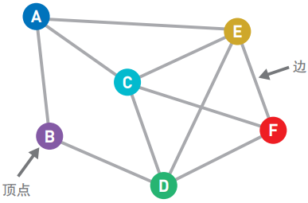

上图中的圆圈叫做“顶点”(也叫“节点”), 连接顶点的线叫做“边”. 也就是说, 由顶点和连接每对顶点的边所构成的图形就是图.

图可以表现各种关系

### 加权图

上面讲到的都是由顶点和边构成的图, 而我们还可以给边加上一个值.

这个值叫做边的‘权重’或者“权”, 加了权的图被称为“加权图”. 没有权的边只能表示两个顶点的连接状态, 而有权的边就可以表示顶点之间的“连接程度”.

### 有向图

当想在路线图中表示该路线只能单向行驶时, 就可以给边加上箭头, 而这样的图就叫做“有向图”.

与此相对, 边上没有箭头的图便是“无向图”.

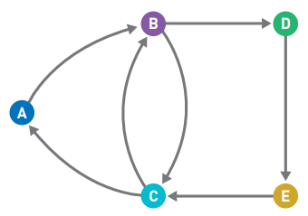

和无向图一样, 有向图的边也可以加上权重.

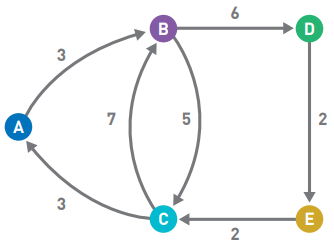

## II. 广度优先搜索

广度优先搜索是一种对图进行搜索的算法, 会优先从离起点近的顶点开始搜索.

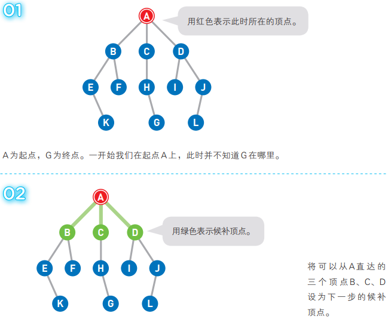

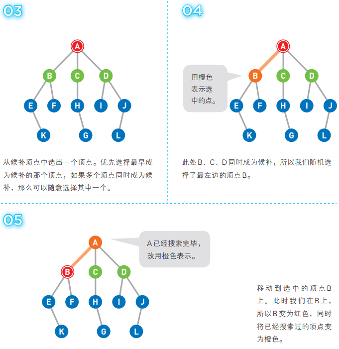

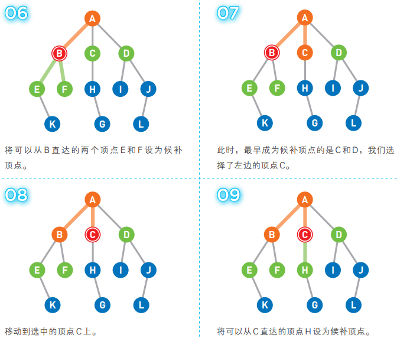

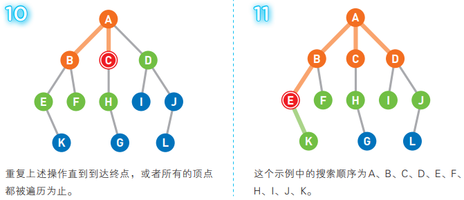

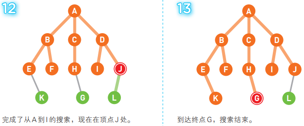

广度优先搜索的特征为从起点开始, 由近及远进行广泛的搜索, 因此, 目标顶点离起点越近, 搜索结束得就越快.

在广度优先搜索中, 候补顶点是用“先入先出”(FIFO)的方式来管理的, 因此可以使用“队列”这个数据结构.

没有闭环的图叫做“树”, 有闭环的图, 起点和终点是同一个顶点.

## III. 深度优先搜索

深度优先搜索和广度优先搜索一样, 都是对图进行搜索的算法, 目的也都是从起点开始搜索直到到达指定顶点(终点). 深度优先搜索会沿着一条路径不断往下搜索直到不能再继续为止, 然后再折返, 开始搜索下一条候补路径.

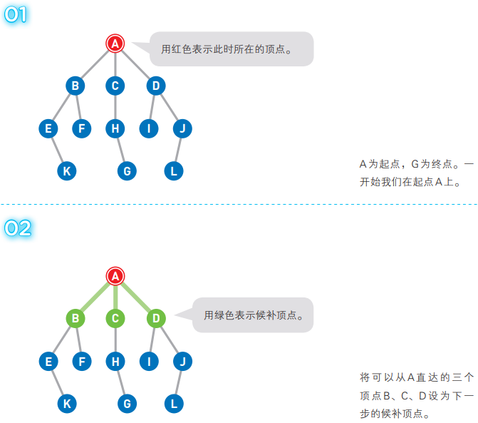

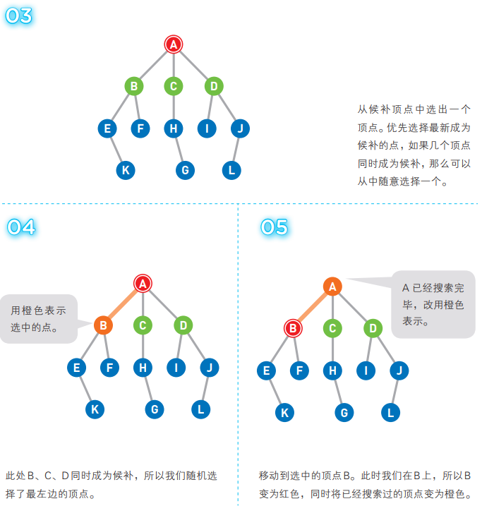

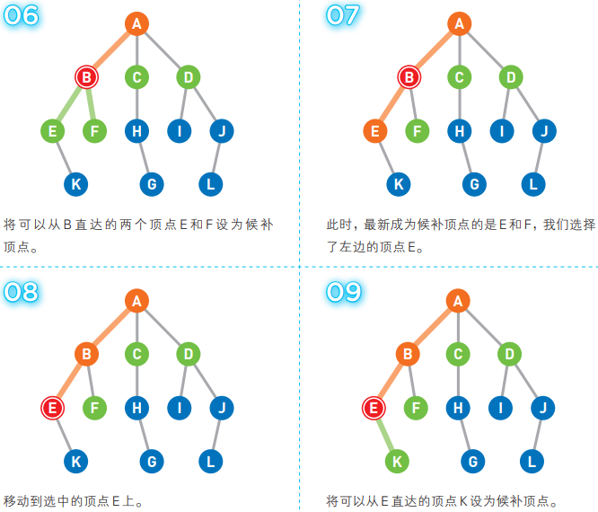

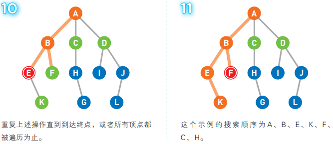

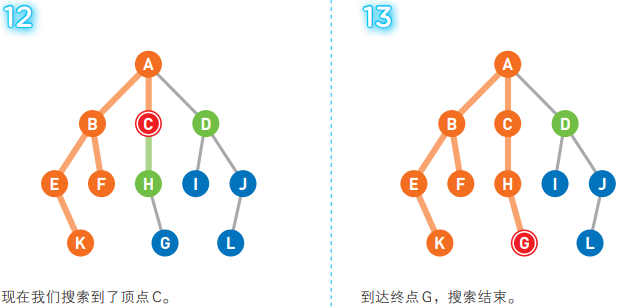

深度优先搜索的特征为沿着一条路径不断往下, 进行深度搜索. 虽然广度优先搜索和深度优先搜索在搜索顺序上有很大的差异, 但是在操作步骤上却只有一点不同, 那就是选择哪一个候补顶点作为下一个顶点的基准不同, 在深度优先搜索中, 候补顶点的管理方式为”后进先出”(LIFO), 可以使用栈这种数据结构进行管理.

广度优先搜索选择的是最早成为候补的顶点, 因为顶点离起点越近就越早称为候补, 所以会从离起点近的地方开始按顺序搜索; 而深度优先搜索选择的则是最新成为候补的顶点, 所以会一路往下, 沿着新发现的路径不断深入搜索.

## IV. 贝尔曼-福特算法

## V. 狄克斯特拉算法

## VI. A*算法

