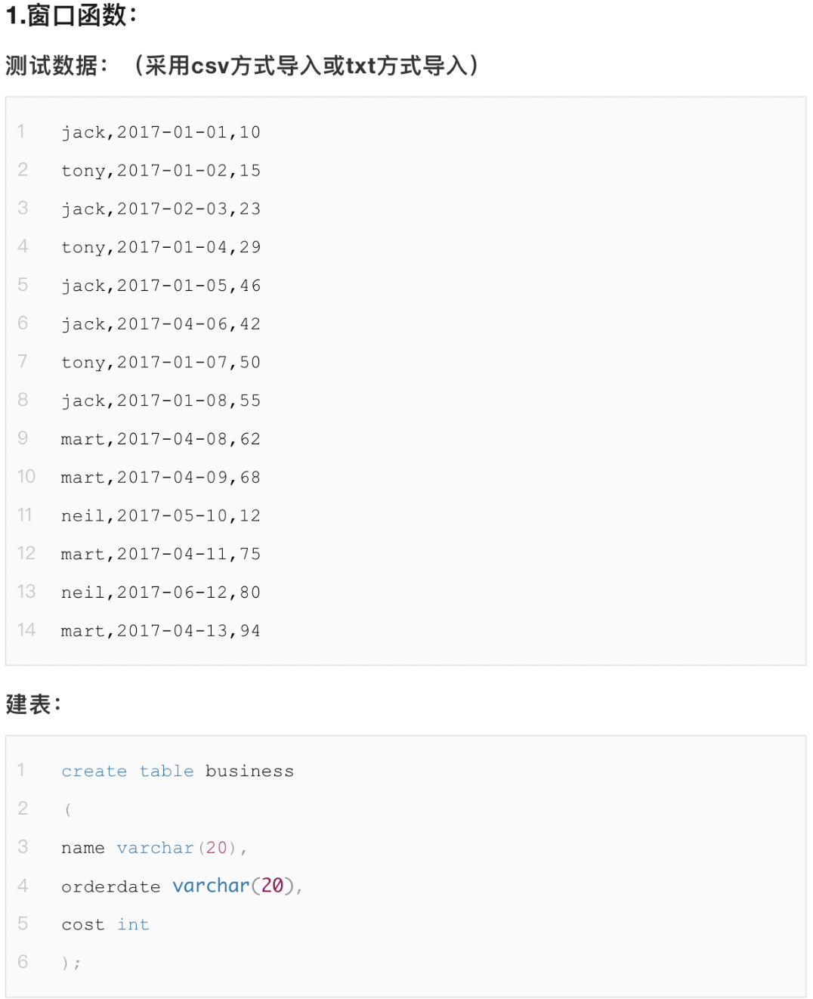
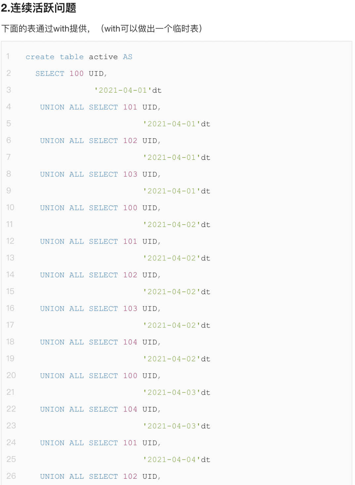

1. ## 窗口函数

    ##### 1. COUNT练习:

    ```mysql
    SELECT name     `顾客`,
           COUNT(*) `购买次数`
    FROM business
    WHERE MONTH(orderdate) = 4
    GROUP BY name;
    ```

    ##### 2. SUM练习:

    ```mysql
    -- 2.1. 查询每个顾客每个月购买总额明细
    SELECT DISTINCT name `顾客`,
           MONTH(orderdate) `月份`,
           SUM(cost) OVER (PARTITION BY MONTH(orderdate), name) `购买总额`
    FROM business;
    
    -- 2.2. 查询每个顾客到目前为止的购买总金额明细
    SELECT DISTINCT name `顾客`,
                    SUM(cost) OVER (PARTITION BY name) `购买总金额`
    FROM business;
    ```

    ##### 3. LAG练习:

    ```mysql
    -- 3. 查询顾客上次的购买时间
    SELECT DISTINCT name `顾客`,
                    orderdate `此次购买时间`,
                    LAG(orderdate) over (PARTITION BY name ORDER BY orderdate) `上次购买时间`
    FROM business;
    ```

    ##### 4. NTILE练习:

    ```mysql
    -- 4. 查询前20%时间的订单信息
    WITH temp_tb AS (SELECT *,
                            NTILE(5) over (ORDER BY orderdate) `N`
                     FROM business
    )
    SELECT name,
           orderdate,
           cost
    FROM temp_tb
    WHERE N = 1;
    ```

2. ## 连续活跃问题

    1. 某APP用户活跃记录表active，有uid（用户id）、dt（活跃日期）字段，求出连续出勤3天及以上的用户数

        ```mysql
        SELECT DISTINCT COUNT(a.uid) `连续活跃3天以上用户数`
        FROM active a
                 JOIN active b
                      ON a.uid = b.uid AND a.dt = (b.dt + 1)
                 JOIN active c
                      ON a.uid = c.uid AND a.dt = (c.dt + 2);
        ```

        

    2. 某APP用户活跃记录表active，有uid（用户id）、dt（活跃日期）字段，求每个用户的最大连续活跃天数 

        思路: 

        1. 按uid分区, 按活跃日期进行row排名, 这样用活跃日期 - row排名序号即可得到几次连续活跃的起始日期
        2. 根据上表查出用户每段连续活跃的天数
        3. 根据上表查出每个用户最大连续活跃天数

        ```mysql
        WITH temp_tb2 AS (
            WITH temp_tb AS (
                SELECT uid,
                       dt,
                       ROW_NUMBER() over (PARTITION BY uid ORDER BY dt) `sign_in_rank`
                FROM active
            )
            SELECT uid               `用户ID`,
                   dt - sign_in_rank `连续活跃开始日期`,
                   COUNT(1)          `此次连续活跃天数` # 分组内数据条数, 即每次连续活跃天数
            FROM temp_tb
            GROUP BY uid, dt - sign_in_rank
        )
        SELECT DISTINCT `用户ID`,
                        MAX(`此次连续活跃天数`) OVER (PARTITION BY `用户ID`) `最大连续活跃天数`
        FROM temp_tb2
        ;
        ```

        

3. ## MySQL日期函数

    1. 使用LAST_DAY函数找出今年2月的最后一天

        ```mysql
        SELECT LAST_DAY('2022-02-01');
        ```

        

    2. 希望知道ALLEN和WARD的HIREDATE相差多少天

        ```mysql
        SELECT DATEDIFF(a.date, b.date)
        FROM T1 a
        JOIN T1 b
        WHERE a.name = 'ALLEN' AND b.name = 'WARD';
        ```

        

