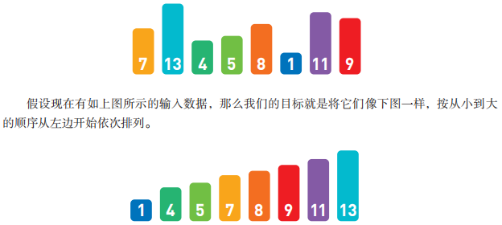
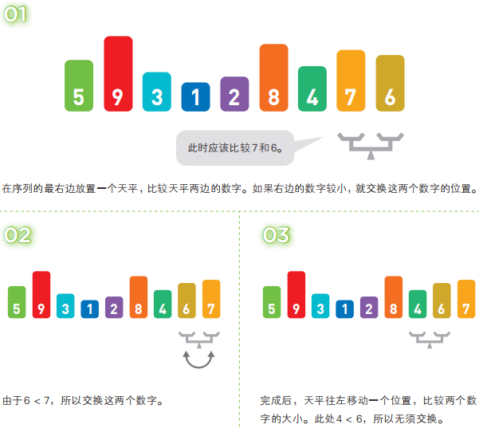

# 排序

## I. 什么是排序

排序就是将输入的数字按照从小到大的顺序进行排序. 

如果只有十个数字, 手动排序也能轻松完成, 但如果有10000个数据, 排序就不那么容易了, 这时, 使用高效率的排序算法便是解决问题的关键.

### 各种各样的排序算法

由于排序是一个比较基础的问题, 所以排序算法的种类也比较多. 在接下来的说明中, 输入的数字个数都设定为n.

## II. 冒泡排序

### 概念

冒泡排序就是重复"从序列右边开始比较相邻两个数字的大小, 再根据结果交换两个数字的位置"这一操作的算法. 在这个过程中, 数字也会像泡泡一样, 慢慢从右往左"浮"到序列的顶端, 所以这个算法才被称作"冒泡排序".

在冒泡排序中, 第1轮需要比较==**n - 1**==次, 第2轮需要比较n - 2次......第n - 1轮需要比较1次. 因此, 总的比较次数为(n -1) + (n - 2) + ...... + 1 ≈ n²/2. 这个比较次数恒定为该数值, 和输入数据的排列顺序无关.

不过, 交换数字的次数和输入数据的排列顺序有关. 假设出现某种极端情况, 如输入数据正好以从小到大的顺序排列, 那么便不需要进行任何交换; 反过来, 输入数据要是以从大到小的顺序排列, 那么每次比较数字后便都要进行交换. 因此, 冒泡排序的时间复杂度为O(n²).

## III. 选择排序

## IV. 插入排序

## V. 堆排序

## VI. 归并排序

## VII. 快速排序