# 排序

## I. 什么是排序

排序就是将输入的数字按照从小到大的顺序进行排序. 


如果只有十个数字, 手动排序也能轻松完成, 但如果有10000个数据, 排序就不那么容易了, 这时, 使用高效率的排序算法便是解决问题的关键.

各种各样的排序算法

由于排序是一个比较基础的问题, 所以排序算法的种类也比较多. 在接下来的说明中, 输入的数字个数都设定为n.

## II. 冒泡排序

### 概念

冒泡排序就是重复"从序列右边开始比较相邻两个数字的大小, 再根据结果交换两个数字的位置"这一操作的算法. 在这个过程中, 数字也会像泡泡一样, 慢慢从右往左"浮"到序列的顶端, 所以这个算法才被称作"冒泡排序".


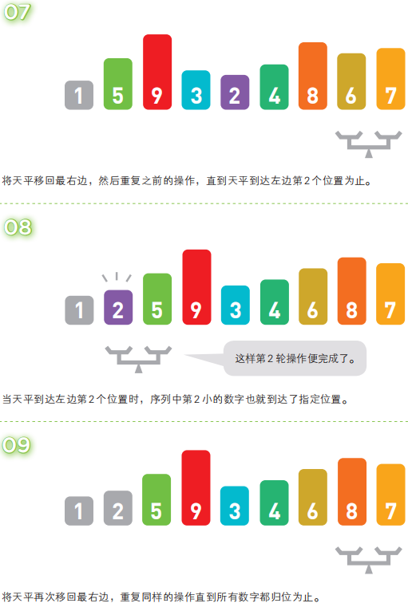

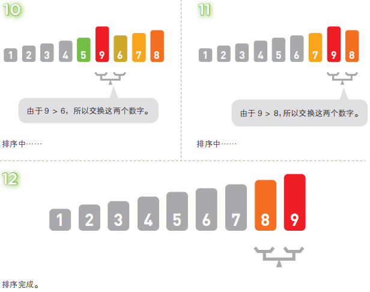

在冒泡排序中, 第1轮需要比较==**n - 1**==次, 第2轮需要比较n - 2次......第n - 1轮需要比较1次. 因此, 总的比较次数为(n -1) + (n - 2) + ...... + 1 ≈ n²/2. 这个比较次数恒定为该数值, 和输入数据的排列顺序无关.

不过, 交换数字的次数和输入数据的排列顺序有关. 假设出现某种极端情况, 如输入数据正好以从小到大的顺序排列, 那么便不需要进行任何交换; 反过来, 输入数据要是以从大到小的顺序排列, 那么每次比较数字后便都要进行交换. 因此, 冒泡排序的时间复杂度为O(n²).

### Python代码实现

```python
def bubbleSort(nums):
    for i in range(len(nums) - 1, 1, -1):
        for j in range(i - 1, -1, -1):
            if nums[j + 1] < nums[j]:
                nums[j + 1], nums[j] = nums[j], nums[j + 1]
    return nums
```

## III. 选择排序

### 概念

选择排序就是重复"从待排序的数据中寻找最小值, 将其与序列最左边的数字进行交换"这一操作的算法. 在序列中寻找最小值时使用的是线性查找

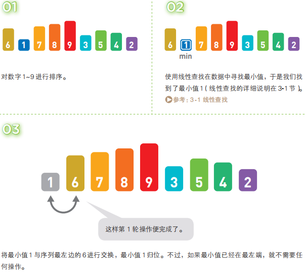

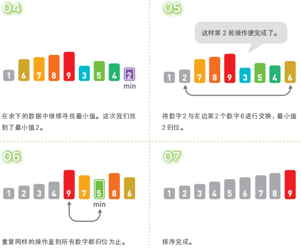

选择排序使用了线性查找来寻找最小值, 因此在第1轮中需要比较n - 1个数字, 第2轮需要比较n - 2个数字......到第n - 1轮的时候就只需比较1个数字了. 因此, 总的比较次数与冒泡排序的相同, 都是n²/2次.

每轮中交换数字的次数最多为1次, 如果输入数据就是按从小到大的顺序排列的, 便不需要进行任何交换. 选择排序的时间复杂度也和冒泡排序的一样, 都为O(n²)

### Python代码实现

```python
def selectionSort(arr):
    # 从头遍历待排序序列
    for i in range(len(arr) - 1):
        # 设当前i为最小值索引
        min_index = i
        # 从i后一位开始遍历
        for j in range(i + 1, len(arr)):
            # 若遍历到的数比最小值索引位置值小则设遍历到的索引为最小值索引
            if arr[j] < arr[min_index]:
                min_index = j
        # 循环结束若最小值索引发生改变
        if min_index != i:
            # 交换arr[min_index]和arr[i]
            arr[min_index], arr[i] = arr[i], arr[min_index]
    # 返回排序后序列
    return arr
```

## IV. 插入排序

### 概念

插入排序是一种从序列左端开始一次对数据进行排序的算法. 在排序过程中, 左侧的数据陆续归位, 而右侧留下的就是还未被排序的数据. 插入排序的思路就是从右侧的未排序区域内取出一个数据, 然后将它插入到已排序区域内合适的位置上

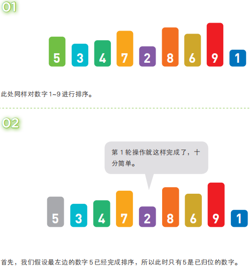

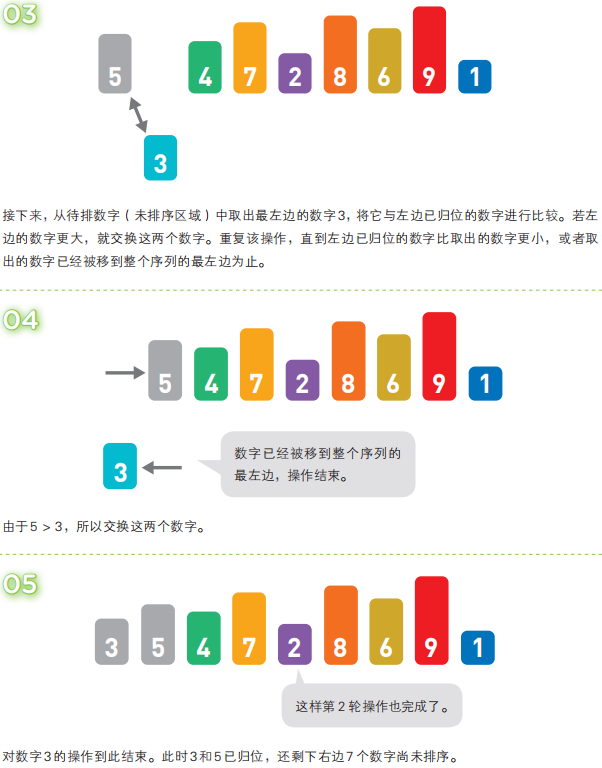

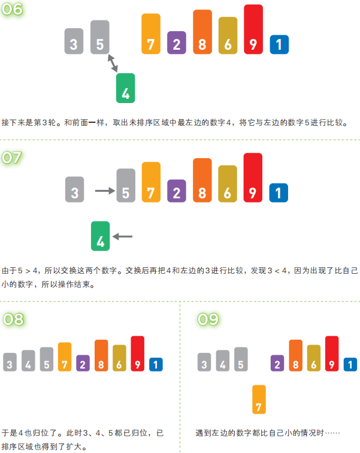

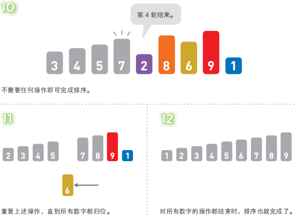

最差情况下, 第k轮需要比较k - 1次, 因此, 时间复杂度和冒泡排序的一样, 都为O(n²).

### Python代码实现

```python
def insertionSort(arr):
    for i in range(len(arr)):
        pre_index = i - 1
        cur_num = arr[i]
        while pre_index >= 0 and cur_num < arr[pre_index]:
            arr[pre_index + 1] = arr[pre_index]
            pre_index -= 1
        arr[pre + 1] = cur_num
    return arr
```

## V. 堆排序

### 概念

堆排序的特点是利用了数据结构中的堆, 堆的特性是子节点一定大(小)于父节点

从降序排列的堆中取出数据时会从最大的数据开始取, 所以将取出的数据反序输出, 排序就完成了


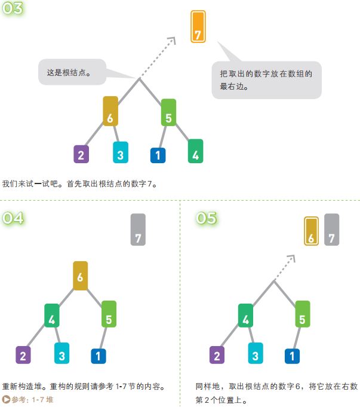

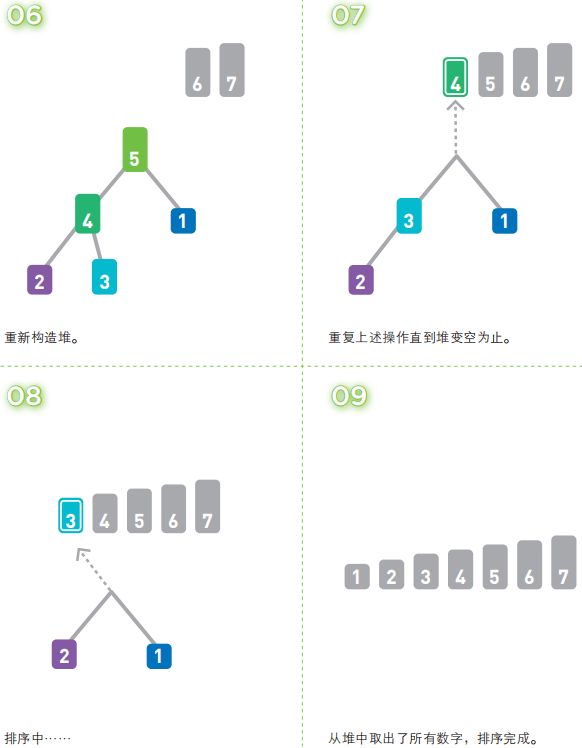

堆排序一开始需要将n个数据存进堆里, 所需时间为O(n log(n)). 排序过程中, 堆从空堆的状态开始, 逐渐被数据填满. 由于堆的高度小于log2(n), 所以插入一个数据所需要的时间为O(log(n)).

每轮取出嘴的数据并重构堆所需要的时间为O(log(n)). 由于共有n轮, 所以重构后排序的时间也是O(n log(n)). 因此整体来看堆排序的时间复杂度为O(n log(n)).

一般来说, 需要排序的数据都存在数组中. 堆排序相当于将堆嵌入到了包含了序列的数组中, 然后在数组中通过交换数据来进行排序. 具体来说, 就是让堆中的各节点和数组像下图这样呈对应关系. 这可以说是强行在数组中使用了堆结构

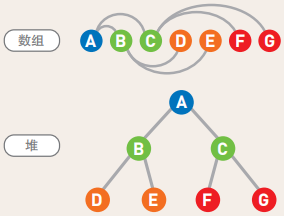

### Python代码实现

```python
def buildMaxHeap(arr):
    import math
    for i in range(math.floor(len(arr) / 2), -1, -1):
        heapify(arr, i)


def heapify(arr, i):
    left_index = 2 * i + 1  # 左子节点性质
    right_index = 2 * i + 2  # 右子节点性质
    largest_index = i
    if left_index < arrLen and arr[left_index] > arr[largest_index]:  # 若左子节点大于当前记录最大节点值
        largest_index = left_index  # 标记位置
    if right_index < arrLen and arr[right_index] > arr[largest_index]:  # 若右子节点大于当前记录最大节点值
        largest_index = right_index  # 标记

    if largest_index != i:  # 若最大值发生变化
        arr[i], arr[largest_index] = arr[largest_index], arr[i]  # 将最大值与当前位置节点交换位置
        heapify(arr, largest_index)  # 递归


def heapSort(arr):
    global arrLen
    arrLen = len(arr)  # 取堆中元素总数
    buildMaxHeap(arr)  # 建大顶堆
    for i in range(len(arr) - 1, 0, -1):
        arr[0], arr[i] = arr[i], arr[0]  # 将堆尾与堆首元素(最大值)交换
        arrLen -= 1  # 将当前最大值排除(更新arr)
        heapify(arr, 0)  # 将剩下的元素重新建大顶堆
    return arr
```

## VI. 归并排序

### 概念

归并排序算法会把序列分成长度相同的两个子序列, 当无法继续往下分时(也就是每个子序列中只有一个数据时), 就对子序列进行归并. 归并指的是把两个排好序的子序列合并成一个有序序列. 该操作会一直重复执行, 直到所有子序列都归并为一个整体为止

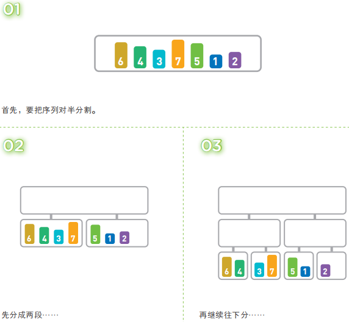

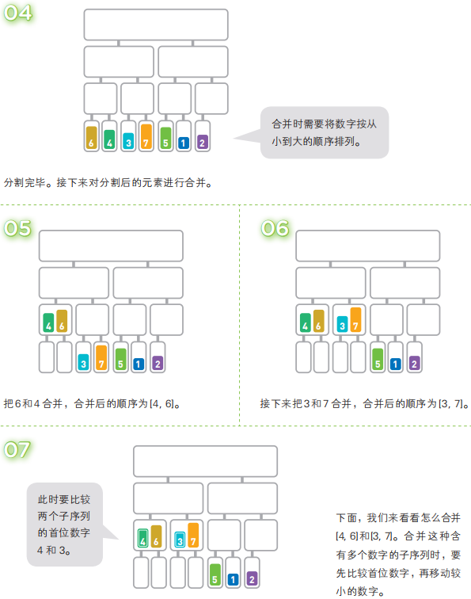

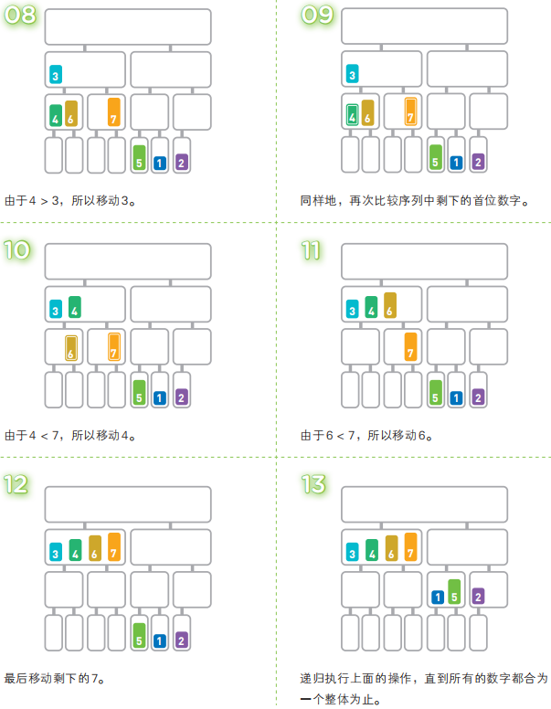

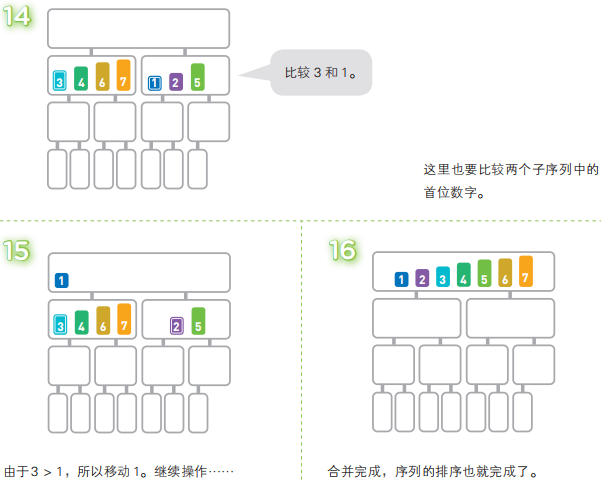

归并排序中, 分割序列所花费的时间不算在运行时间内(可以当作序列本身就是分割好的). 在合并两个已排好序的子序列时, 只需要重复比较首位数据的大小, 然后移动较小的数据, 因此只需花费和两个子序列长度相应的运行时间. 也就是说, 完成一行归并所需的运行时间取决于这一行的数据量.

将长度为n的序列对半分割直到只有一个数据为止时, 可以分成log2(n)行, 因此, 总共有log2(n)行. 也就是说, 总的运行时间为O(n log(n)), 这与堆排序相同.

### Python代码实现

```python
def merge(left_part, right_part):
    result = []
    while left_part and right_part:
        if left_part[0] <= right_part[0]:
            result.append(left_part.pop(0))
        else:
            result.append(right_part.pop(0))
    while left_part:
        result.append(left_part.pop(0))
    while right_part:
        result.append(right_part.pop(0))
    return result


def mergeSort(arr):
    import math
    if len(arr) < 2:
        return arr
    middle = math.floor(len(arr) / 2)
    left_part, right_part = arr[0:middle], arr[middle:]
    return merge(mergeSort(left_part), mergeSort(right_part))
```

## VII. 快速排序

### 概念


### Python代码实现

```python

```

