# 数据结构

## I. 什么是数据结构

数据存储于计算机的内存中, 内存如下图所示, 形似排成1列的箱子, 一个箱子里存储1个数据.

数据存储于内存时, 决定了数据顺序和位置关系的便是"数据结构"

### 电话簿的数据结构

#### 例① 按从上往下获取顺序添加

想找一个联系人, 只能按照顺序从上往下找, 当号码多的时候就不那么容易了

#### 例② 按姓名的拼音顺序排列

通过姓名的拼音首字母就能推测出该数据的大致位置, 但是当要插入新联系人时, 需要从下往上执行"将本行的内容写进下一行, 然后清除本行内容"的操作, 如果数据量大, 将很复杂.

顺序添加添加简单, 查询复杂

拼音顺序排列查询简单, 添加复杂

#### 将获取顺序于拼音顺序结合

分别使用不同的表存储不同的拼音首字母, 然后将同一张表中的数据按照获取顺序进行排列

这样一来, 在添加新数据时, 直接将数据加入到相应表中的末尾就可以了, 而查询数据时, 也只需要到其对应的表中去查找即可

因为各个表中存储的数据依旧是没有规律的, 所以查询时仍需从表头开始找起, 但比查询整个电话簿来说还是要轻松多了

## II. 链表

### 单链表

链表是数据结构之一, 其中的数据呈线性排列. 在链表中, 数据的添加和删除都较为方便, 就是访问比较耗费时间

1. 链表中的每一个数据都有一个"指针", 它指向下一个数据的内存地址

   

2. 在链表中, 数据一般都是分散存储于内存中的, 无须存储在连续空间里

   

3. 因为数据是分散的, 所以如果想要访问数据, 只能从第一个数据开始, 顺着指针的指向一一往下访问(顺序访问)直到找到所需的数据

4. 如果需要添加数据, 只需要改变添加位置前后的指针指向就可以, 非常简单

   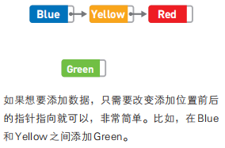

   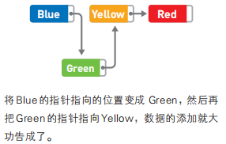

5. 数据的删除也一样, 只要改变指针的指向就可以, 比如删除yellow

   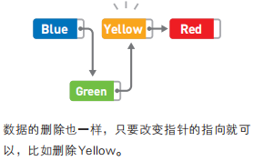

   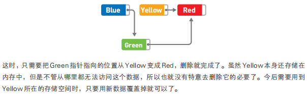

### 时间复杂度

如果目标在链表最后的话, 访问需要的时间就是O(n), 添加与删除需要的时间复杂度都是O(1)

### 循环链表

在链表尾部使用指针, 并且让它指向链表头部的数据, 将链表变成环形. 循环链表没有头和尾的概念. 想要**保存数量固定的最新数据**时通常会使用这种链表

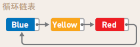

### 双向链表

可以把每个数据的指针设定为两个, 并且让它们分别指向前后的数据. 双向链表不仅可以从前往后, 还可以从后往前遍历数据.

#### 缺点

1. 指针数的增加会导致存储空间需求增加
2. 增加和删除数据时需要改变更多指针的指向

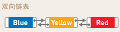

## III. 数组

数组也是数据呈线性排列的一种数据结构. 数组中, 访问数据十分简单, 而添加和删除数据比较耗功夫.

数组下标从0开始计算

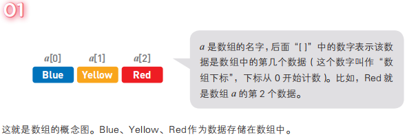

数组按顺序存储在内存的连续空间内, 所以每个数据的内存地址(在内存上的位置)都可以通过数组下标算出, 也可以借此直接访问目标数据(**随机访问**)

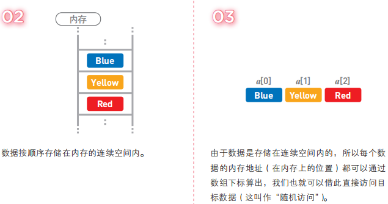

在数组中只要指定下标就可以直接访问数据(**随机访问**), 而在链表中只能从头开始查找

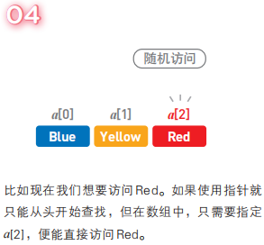

数组的添加或删除操作比链表复杂很多, 首先在数组的末尾确保需要增加的存储空间, 然后为了给新数据腾出位置, 要把已有数据一个个移开

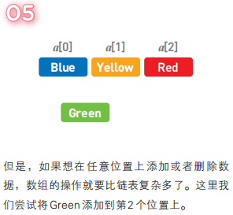

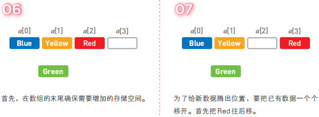

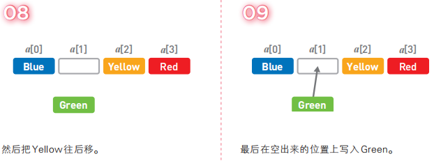

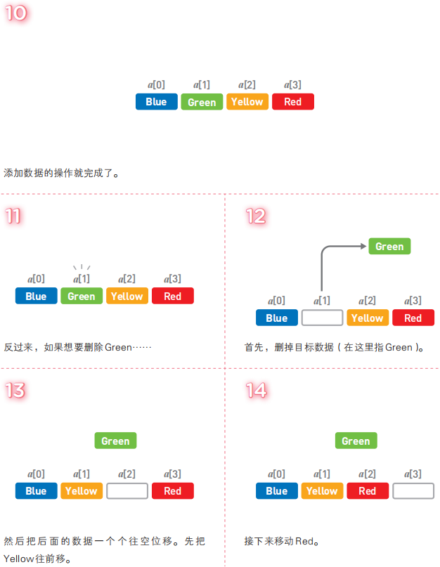

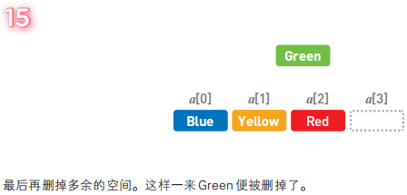

### 时间复杂度

访问: O(1), 因为使用随机访问

增加删除: O(n)

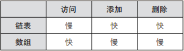

## IV. 栈

栈也是一种数据呈线性排列的数据结构, 不过在这种结构中, 我们只能访问最新添加的数据. 栈就像一摞书, 拿到新书时我们会把它放在书堆的最上面, 取书时也只能从最上面的新书开始取

入栈(**push**)出栈(**pop**)

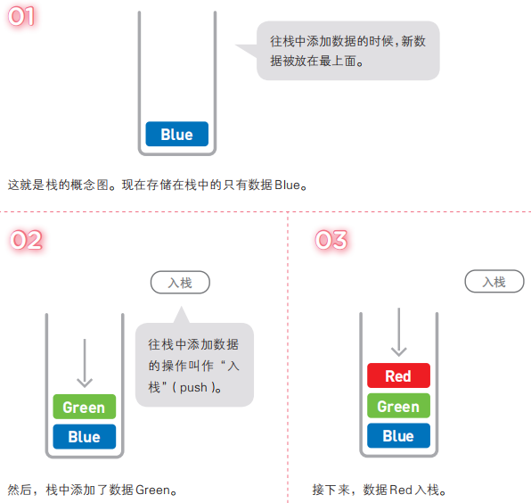

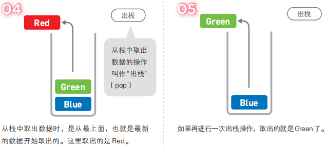

像栈这种最后添加的数据最先被取出, 即"**后进先出**"的结构, **Last In First Out(LIFO)**

与链表和数组一样, 栈的数据也是线性排列的, 但在栈中, 添加和删除数据的操作只能在一端进行, 访问数据也只能访问到顶端的数据. 想要访问中间的数据时, 就必须通过出栈操作将目标数据移到栈顶才行

只需要访问最新数据时, 使用它就比较方便了.

比如，规定（AB（C（DE）F）（G（（H）I J）K））这一串字符中括号的处理方式如下：首先从左边开始读取字符，读到左括号就将其入栈，读到右括号就将栈顶的左括号出栈。此时，出栈的左括号便与当前读取的右括号相匹配。通过这种处理方式，我们就能得知配对括号的具体位置。

