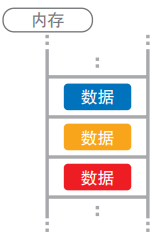
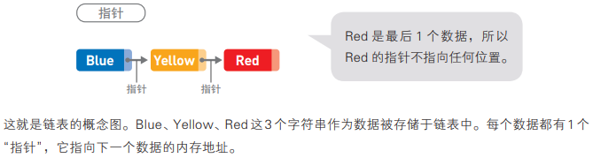
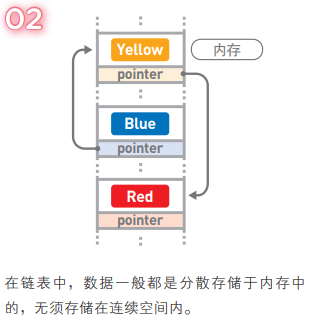

# 数据结构

## I. 什么是数据结构

数据存储于计算机的内存中, 内存如下图所示, 形似排成1列的箱子, 一个箱子里存储1个数据.

数据存储于内存时, 决定了数据顺序和位置关系的便是"数据结构"

### 电话簿的数据结构

#### 例① 按从上往下获取顺序添加

想找一个联系人, 只能按照顺序从上往下找, 当号码多的时候就不那么容易了

#### 例② 按姓名的拼音顺序排列

通过姓名的拼音首字母就能推测出该数据的大致位置, 但是当要插入新联系人时, 需要从下往上执行"将本行的内容写进下一行, 然后清除本行内容"的操作, 如果数据量大, 将很复杂.

顺序添加添加简单, 查询复杂

拼音顺序排列查询简单, 添加复杂

#### 将获取顺序于拼音顺序结合

分别使用不同的表存储不同的拼音首字母, 然后将同一张表中的数据按照获取顺序进行排列

这样一来, 在添加新数据时, 直接将数据加入到相应表中的末尾就可以了, 而查询数据时, 也只需要到其对应的表中去查找即可

因为各个表中存储的数据依旧是没有规律的, 所以查询时仍需从表头开始找起, 但比查询整个电话簿来说还是要轻松多了

## II. 链表

链表时数据结构之一, 其中的数据呈线性排列. 在链表中, 数据的添加和删除都较为方便, 就是访问比较耗费时间

1. 链表中的每一个数据都有一个"指针", 它指向下一个数据的内存地址

   

2. 在链表中, 数据一般都是分散存储于内存中的, 无须存储在连续空间里

   

3. 因为数据是分散的, 所以如果想要访问数据, 只能从第一个数据开始, 顺着指针的指向一一往下访问(顺序访问)直到找到所需的数据

4. 