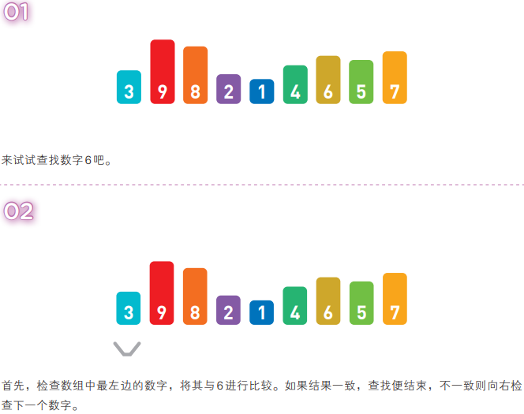
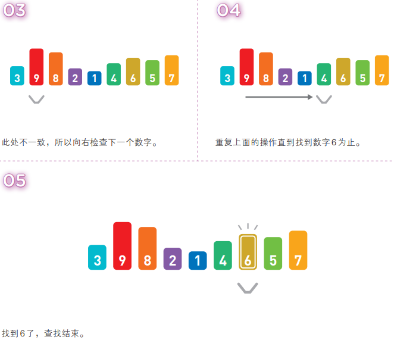
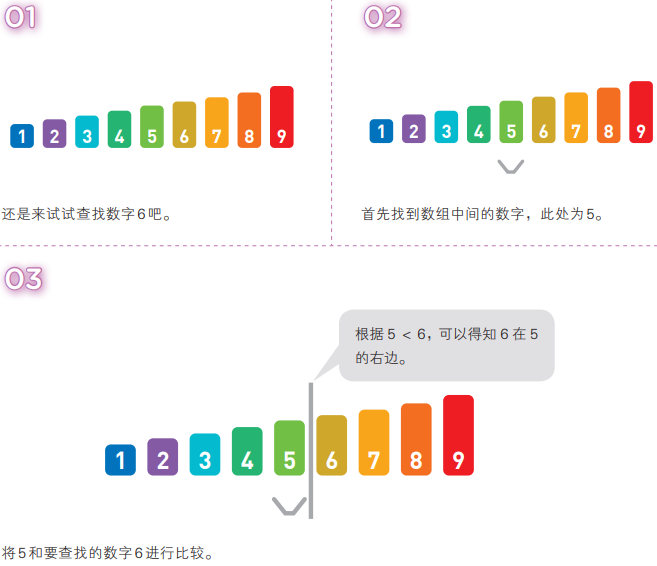
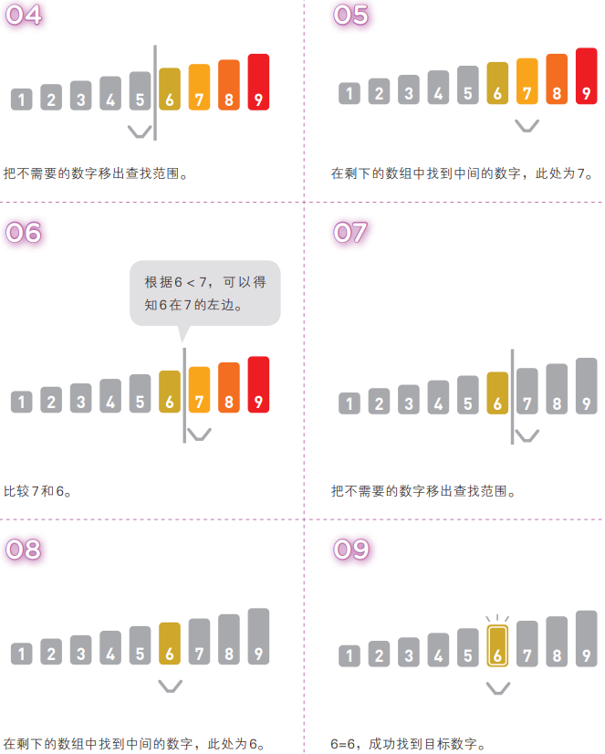

# 数组的查找

## I. 线性查找

即便数据没有按顺序存储, 也可以应用线性查找.

线性查找的操作很简单, 只要在数组中从头开始依次往下查找即可. 

线性查找需要从头开始不断地按顺序检查数据, 因此在数据量大且目标数据靠后, 或者目标数据不存在时, 比较的次数就会更多, 也更为耗时. 若数据量为n, 线性查找的时间复杂度便为O(n).

## II. 二分查找

二分查找也是一种在数组中查找数据的算法, 它只能查找已经排好序的数据.

二分查找通过比较数组中间的数据与目标数据的大小, 可以得知目标数据是在数组的左边还是右边. 因此, 比较一次就可以把查找范围缩小一半. 重复执行该操作就可以找到目标数据, 或得出目标数据不存在的结论

二分查找每一次查找都可以将查找范围减半, 查找范围内只剩一个数据时查找结束, 时间复杂度为O(log n).

二分查找与线性查找相比速度上有了指数倍提高.

但是, 二分查找必须建立在数据已经排好序的基础上才能使用, 因此添加数据时必须加到合适的位置, 这就需要额外耗费维护数据的时间.

而使用线性查找时, 数组中的数据可以是无序的, 因此添加数据时也无须顾虑位置, 直接把它加在末尾即可, 不需要耗费时间.

综上, 具体使用线性查找还是二分查找, 可以根据查找和添加两个操作哪个更为频繁来决定.